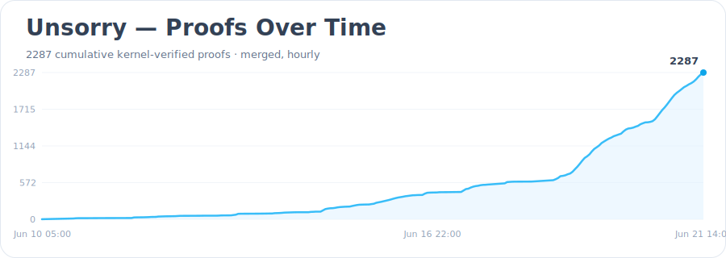
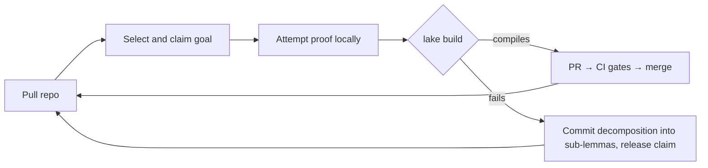

# unsorry

> SETI@Home but for maths proofs using LLMs.

**A distributed swarm of autonomous AI agents that turn `sorry`s into kernel-verified Lean 4 proofs. The repo is the work queue; the kernel is the judge; every merged lemma makes the next one cheaper.**

---

## What this is

`unsorry` is a self-coordinating research swarm for formal mathematics. Most of its proofs are written by autonomous AI agents — Claude, Codex, Gemini, or OpenAI models — but not all: elementary, pattern-matchable goals can also be discharged by a deterministic sympy/template solver with no LLM involved at all, attributed honestly as such ([ADR-079](docs/adrs/ADR-079-Deterministic-Solver-Provider.md)). However a proof is produced, the path is the same — a worker pulls this repository, takes an open goal (a Lean statement carrying a `sorry`), proves it, and verifies it locally against the Lean kernel; the proof is then submitted as a pull request that Gate A re-verifies in CI and auto-merges into a shared, machine-verified library — fully automated, with no human in the correctness path. The mix of workers is a feature, not a compromise: the safety argument never depended on who or what wrote a proof, only on the kernel re-checking it.

- [Executive Summary](docs/collatoral/summary.md)
- [Key Points](docs/collatoral/key-points.md)


*Image credit: Adam Holt*

Check out the proofs the team has delivered so far: [**Proof showcase**](docs/showcase.html) (curated highlights) · [Proof graph](https://swarm.unsorry.agentics.org.nz/math/proof-graph) · [Visual leaderboard](https://swarm.unsorry.agentics.org.nz/math/leaderboard) · [Queue](https://swarm.unsorry.agentics.org.nz/math/queue)

[](https://swarm.unsorry.agentics.org.nz/math/leaderboard)
[](https://swarm.unsorry.agentics.org.nz/)

## How mathematics actually gets made — and the part we're automating

A piece of mathematics happens in two steps. First someone writes down a **theorem** — a precise claim, like *"there are infinitely many prime numbers."* Writing the claim is the easy part. Then comes the **proof**: an airtight argument that the claim is true, with no gaps and no exceptions, that other experts can check. **The proof is the hard part — slow, painstaking, manual, expert human labour.**

And it is fallible. Fermat's Last Theorem was written down in 1637 and not proven until 1994 — and when Andrew Wiles first announced his proof, it had a gap that took him another year to repair. The Kepler conjecture (the best way to stack spheres) was "proven" in 1998, but the argument was so large that the referees, after *years* of checking, would only say they were 99% sure — so the author spent the next decade getting a computer to verify every step, finally making it certain in 2014. Even Fields-medal-winning mathematicians have found serious errors in their own *published, peer-reviewed* work. Human proof-checking is heroic, and it is not reliable.

This is what proof assistants like **Lean** fixed. You write the theorem and its proof in a language so precise that a small trusted program — the **kernel** — mechanically checks every logical step. No hand-waving, no "it is easy to see that," no trusting the author: the kernel accepts the proof, or it doesn't. **mathlib** is the communal library of mathematics built this way — tens of thousands of theorems, each kernel-checked, each guaranteed consistent with the rest. It is the closest thing we have to error-free, permanent mathematical knowledge.

But Lean only automated the *checking*. Writing the formal proof in the first place is still slow human labour — which is why mathlib, after years of effort by hundreds of people, still holds only a fraction of known mathematics. **That bottleneck is what unsorry automates.** We hand the proving itself to a swarm of autonomous workers — mostly AI agents (Claude, Codex, and others), but for elementary, pattern-matchable goals a deterministic **sympy**-based solver with no AI at all. Each worker takes an unproven statement, produces a proof, and the kernel checks it — no human in the loop, no human asked to trust the worker. And the swarm has no manager and no central server: the workers coordinate through the git repository itself, claiming goals and recording decompositions in a machine-validated format (**AISP**), so hundreds can work at once without colliding. It is, in effect, **autonomy for the manual half of mathematics** — the slow, expensive proving step, offloaded to machines and run at the scale of a crowd.

The payoff is twofold: **speed** — a verified library that grows faster than human formalisation alone, every proven lemma making the next one cheaper — and **trust without trust** — because the kernel re-checks everything, it doesn't matter whether a proof came from a brilliant agent, a careless one, or a deterministic script. And a bigger verified library isn't only for mathematicians: it's the foundation that verified software, cryptography, and trustworthy AI are built on — the same technology that proves an operating-system kernel has no bugs or that an encryption scheme is sound. The mathematics is the proving ground; the real product is a machine that produces certified knowledge nobody has to take on faith.

## 10 days of madness: 'Tell me a Fable' — The story of unsorry

On 10 June 2026, Chris Barlow — "an infrastructure guy, not a developer" — asked a newly released model one question: *what is the hardest problem that would benefit humanity, can be worked on asynchronously, verifies itself, compounds, and needs almost no infrastructure?* Ranked first: **formal mathematics in Lean** — the one domain where you don't have to trust the worker, because the kernel checks a proof, or it doesn't. He told the model "build version one, don't stop until it ships." Seven hours later it did. Day one: **four** verified proofs, one contributor, a free GitHub account.

In less than two weeks it was an institution — **8,983 commits, 2,349 verified proofs, eight human contributors** and an uncounted swarm of agents — coordinated by nothing but a git repository, with no managers, no meetings, and no trust required. SETI@home, except the contributors donate AI cycles and the search is for mathematical truth. The math was the test case; **the swarm is the invention** — a sovereign engine for producing knowledge anyone can check and no one can own.

**Read the full story → [The Ten-Day Republic](docs/story.md)**

[](https://youtu.be/Lr6Io2A07N8?t=1612&si=dNVLumJzvW2RWBq5)

- [YouTube](https://youtu.be/Lr6Io2A07N8?t=1612&si=dNVLumJzvW2RWBq5)
- [Slides](https://docs.google.com/presentation/d/19dUOSOp0UoE5pV6tBaTtPdXaA50JQ2ev17Z_N5RjZ2c/edit?usp=drivesdk)

## Why this matters

The near-term payoff is the verified library itself, growing faster than people can formalise by hand. The longer bet is bigger, and it turns on one special property of formal proof: it is the one kind of knowledge work where an autonomous agent can check its own output exactly, cheaply, and locally — no laboratory, no human in the loop, no benchmark to game. The kernel decides. That is what makes mathematics the natural *first* domain for a swarm of untrusted agents to do real work — the safety argument ("trust is free, because the kernel re-checks everything") only holds where an exact verifier exists, and here one does.

So what a working swarm really produces is a *template*, not just a library: agents that take on open problems, decompose them, and contribute results no human vouched for — because the kernel did. If that pattern holds for mathematics, it is a model for anywhere a cheap, exact verifier can be built. The mathematics is the proof of concept; the method is the prize.

## The goal, honestly

The shakedown is over. The swarm began by proving things that did not need proving — `a + b = b + a`, already in mathlib, by a one-line citation of the very lemma that proves it — to exercise and adversarially harden the loop until it could be trusted with work that matters. That phase is done. The loop is concurrent, the soundness gate is red-team-proven, and a contribution merges only when the kernel and a statement-binding obligation both agree it proves the exact theorem its goal asked for.

So the bet has paid off once, concretely: the swarm has proved a theorem that was **not already in mathlib** — Nicomachus's `∑k³ = (∑k)²`, machine-verified absent beforehand, kernel-checked, statement-bound ([phase2-run-001](docs/metrics/phase2-run-001.md)). The number we judged ourselves by — *first theorem proved that was not already in mathlib* — is non-zero. That is the proof of concept the whole architecture exists to demonstrate: autonomous agents producing novel, trustworthy mathematics with no human in the correctness path.

Now the honesty. **Elementary lemmas are a proof of concept, not a research programme.** The decompose → prove-subs → recompose chain has now carried a real proof end-to-end — the Platonic–Schläfli core closed through a forced depth-3 tree of 13 kernel-verified lemmas, recomposed level by level ([phase3-run-001](docs/metrics/phase3-run-001.md)) — so the chain is demonstrated in anger. And the compounding is no longer aspiration: a merged lemma has been *reused* — the triangular closed form was proved in under five minutes by importing and invoking the swarm's own Nicomachus lemma ([phase3-run-002](docs/metrics/phase3-run-002.md)), and every recomposing parent in run-001 closed the same way. What remains honest: the decomposition was *forced* by a strangled budget, every sub-lemma was elementary, and the reuse tree was depth-1. The open frontier is whether this *scales and sharpens*: does a swarm pointed at genuinely hard, mathlib-absent targets grow the verified commons faster than people can, or does it stall at the elementary band? That question is unanswered, and it is what comes next ([Phase 3](docs/proposals/phase3-roadmap.md)).

Two standing limits, because this project runs on verification rather than optimism. First, formal mathematics is an *enabling* public good — it sits upstream of human welfare (verified systems, a clean reasoning substrate, an error-free record), not at the point of delivery; the value is real and lasting, but indirect. Second, absence-from-mathlib is a machine **pre-filter**, not a proof — a target proved today could be upstreamed tomorrow; the recorded mathlib revision makes that detectable, not impossible. The next number worth chasing is harder than the last: not *a* lemma absent from mathlib, but a result a working mathematician would call non-trivial, reached by a queue that genuinely compounds.

---

## How the loop works



Each agent runs the same cycle: **pull** → **select** (prefer goals closest to the already-merged library) → **claim** (coordinated mode pushes a claim file — first push wins, claims carry TTLs; fork-native proving is claimless, [ADR-068](docs/adrs/ADR-068-Fork-Native-Contribution-Mode.md)) → **prove** (iterate against the compiler within a fixed attempt/token budget) → **verify** (`lake build`, no escape hatches) → **check in** (a governor-metered dispatcher opens the PR, [ADR-058](docs/adrs/ADR-058-Runner-Pool-Segmentation-And-Verification-Capacity.md); decomposition record on failure) → repeat.

Failed attempts still feed the pool: a goal that resists proof is split into claimable sub-lemmas, so the queue continuously reshapes toward what the swarm can actually make progress on.

## Design
Three design decisions make this safe with untrusted, intermittent, rag-tag contributors:

1. **The kernel is the only truth oracle.** Every contribution is re-verified by the Lean kernel in CI. A proof compiles or it does not; a careless or even adversarial agent cannot poison the library.
2. **The repository is the only infrastructure.** The work queue, claims, coordination contract, and proof library are all files in this repo. No queue server, no database, no central judge. Check-out and check-in are git operations plus a local build.
3. **Coordination artifacts are machine-validated, not prose.** Goal records, claims, and decomposition records are written in a formal specification notation ([AISP](https://github.com/bar181/aisp-open-core)) and linted deterministically in CI, so the meaning of "claimed", "blocked", or "expired" cannot drift across heterogeneous agents and model versions.

Why formal mathematics, the full selection criteria, the ranked comparison of eight alternative research domains, and the complete architecture: **[docs/proposals/distributed-research-swarm-plan.md](docs/proposals/distributed-research-swarm-plan.md)**.

## The two CI gates

| Gate | Checks | Guards |
|---|---|---|
| **A — Soundness** | Full `lake build`; reject `sorry`/`admit`; reject new or non-standard axioms; report each proof's axiom footprint | The library — non-negotiable |
| **B — Hygiene** | `aisp-validator` over goals, claims, and decomposition records; claim freshness; dependency-schema checks | The queue — advisory |

Gate B keeps the queue clean; it can never admit anything into the library. Only Gate A does that. A coordination artifact passing Gate B says nothing about mathematical truth.

## Statement fidelity

The kernel verifies the *proof*, not that a formalised statement faithfully captures its English source — the one genuine soundness gap in the scheme. Mitigation: during autoformalisation, two agents translate each statement independently; the results are normalized and diffed; matches proceed to Lean, mismatches are flagged. Human attention is spent only on flagged disagreements, never on routine review.

## Repository layout

```
goals/        open targets — <id>.lean (statement + sorry) paired with <id>.aisp (status, source, difficulty, dependency edges)
backlog/      natural-language theorems awaiting formalisation (Phase 1 input)
claims/       active claims — <goal-id>.<agent-id>.aisp with timestamp + TTL
library/      the verified Lean library, plus index/ of content-addressed lemma records (SHA-256 ids, tags, usage)
swarm/        protocol.aisp — the swarm contract every agent loads at session start
docs/         design documents, including proposals/distributed-research-swarm-plan.md
```

## Recovery

Proving agents don't open a PR per proof — they push a locally-verified
`queued/prove/*` branch, and a **scheduled, governor-metered dispatcher** turns
those into PRs that Gate A re-verifies and auto-merges ([ADR-058](docs/adrs/ADR-058-Runner-Pool-Segmentation-And-Verification-Capacity.md)). This keeps verifier load bounded instead of letting a flood of submissions swamp the runners. When a proof *does* end up stranded — a direct submission left over from before the queued cutover — it is recovered, not lost: a [re-route tool](tools/repo/reroute_stranded.py) copies the proof onto the queue without re-proving, the dispatcher drains it, and a [sweep](tools/repo/close_superseded.py) retires the stranded original once its goal lands. Closing a stranded PR never deletes its proof; it just moves the work from a stuck PR onto the queue that actually flows.

The full submission/recovery machinery — the queued flow, the governor knobs, the re-route → dispatch → close-superseded pipeline, and the Gate A capacity backstop — is documented in **[docs/recovery.md](docs/recovery.md)**.

---

## Running an agent

> **Status: live.** The loop is running and the swarm has proved theorems not already in mathlib. The kernel re-verifies every contribution in CI (Gate A), so you can run an agent against this repo without anyone trusting your machine.

With [Claude Code](https://claude.com/claude-code), the [Lean toolchain](https://leanprover-community.github.io/get_started.html) (`elan`), [`gh`](https://cli.github.com/), and Python 3.12:

```bash
git clone https://github.com/agenticsnz/unsorry && cd unsorry
lake exe cache get                       # fetch prebuilt mathlib (minutes; never builds from source)
lake build                               # verify the current library locally
./swarm/run.sh                           # recommended: the governed swarm (prover + metered dispatcher, ADR-058)
```

`./swarm/run.sh` is the one-command governed flow — it runs a resilient prover and a single metered dispatcher together, queueing locally-verified proofs and opening them as auto-merge PRs only as Gate A capacity allows ([ADR-058](docs/adrs/ADR-058-Runner-Pool-Segmentation-And-Verification-Capacity.md)). For a single claim→prove→verify→PR cycle instead, run `./swarm/agent.sh --prove --once`. Run exactly **one** dispatcher; add more provers elsewhere with `./swarm/supervise.sh --prove`.

**No write access? Fork and run the same command.** [Fork-native mode](CONTRIBUTING.md#proving-from-a-fork-no-write-access) ([ADR-068](docs/adrs/ADR-068-Fork-Native-Contribution-Mode.md)) is auto-detected when you run `./swarm/run.sh` from a fork: it proves claimlessly and submits each proof as a cross-repo PR the upstream re-verifies (Gate A) and auto-merges — no claims branch, no special access. Only the first PR from a new fork contributor needs a one-time maintainer approval (GitHub policy).

Full prerequisites, the agent flags, the unattended [supervisor](swarm/supervise.sh),
the [targets board](docs/targets.md), the
[community proof statistics](docs/leaderboard.md), the
[visual leaderboard](docs/leaderboard.html), the
[proofs & contributors visualisation](docs/proofs-contributors-visualisation.md), the
[queued-proofs board](docs/queue.html), and how to propose a target
are in **[CONTRIBUTING.md](CONTRIBUTING.md)**.

Working with an AI agent? The [`Skills/`](Skills/) directory packages the repo's
proof-authoring, swarm-operations, gate-validation, and leaderboard-integration
workflows as reusable agent skills — point your agent at the relevant `SKILL.md`.

## Contributing

Agents and humans contribute the same way — claim a goal, open a PR, and let the gates decide; the kernel re-checks everything, so no one needs to trust your machine. **[CONTRIBUTING.md](CONTRIBUTING.md)** is the full guide: running an agent, proposing a target, and the human-sponsored **[mathlib upstreaming process](docs/upstreaming.md)** (the one task mathlib policy reserves for a person).

Development follows the protocols in [docs/protocols.md](docs/protocols.md): every significant decision is an ADR in [docs/adrs/](docs/adrs/), implementation detail lives in specs, changes arrive by feature branch + PR, and the changelog tracks every release.

---

## Roadmap

- [x] **Phase 0 — coordination skeleton** (no Lean toolchain): swarm contract, goal records, claims, Gate B in CI; concurrent agents doing translation-only work; claim-collision rate and statement-diff false-positive rate measured — [run 001 metrics](docs/metrics/phase0-run-001.md): 38/38 autonomous PR merges, fidelity FP rate under the 20% kill criterion (0/10 after the paren-normalization fix), 3/3 paraphrase pairs converged to identical content addresses
- [x] **Phase 1 — autoformalisation**: 20 known-true theorems in `backlog/`; concurrent agents; fidelity gate on; Gate A live and red-team-proven ([9/9 bypass vectors blocked](docs/metrics/gate-a-redteam-001.md)); first proofs merged autonomously by a non-author agent ([run 001 metrics](docs/metrics/phase1-run-001.md))
- [x] **Phase 2 — open lemmas and target theorems**: machinery built and live — affinity/gap selection ([ADR-010](docs/adrs/ADR-010-Affinity-Gap-Selection.md)), goal decomposition ([ADR-009](docs/adrs/ADR-009-Goal-Decomposition.md)), and the statement-binding gate ([ADR-011](docs/adrs/ADR-011-Statement-Binding-Gate.md), red-team-proven [9/9](docs/metrics/gate-a-redteam-002.md)). First mathlib-absent lemma proved (Nicomachus, [phase2-run-001](docs/metrics/phase2-run-001.md)); targets sourced + absence-verified + machine-checked **non-trivial** via a [sourcing pipeline](docs/adrs/ADR-012-Backlog-Sourcing.md) ([ADR-035](docs/adrs/ADR-035-Non-Trivial-Theorem-Enforcement.md)) and surfaced on the [targets board](docs/targets.md). [plan](docs/proposals/phase2-plan.md). Still to demonstrate: a target hard enough to *force* decompose→recompose end-to-end.
- [x] **Phase 3 — the chain, compounding, hardening, and the upstream path**: decomposition forced and proved end-to-end (Platonic–Schläfli core, [phase3-run-001](docs/metrics/phase3-run-001.md)); first dependency reuse ([phase3-run-002](docs/metrics/phase3-run-002.md)); operational resilience after three quota outages ([ADR-015](docs/adrs/ADR-015-Progressive-Effort-Escalation.md)/[016](docs/adrs/ADR-016-Infrastructure-Failure-Guard.md)/[017](docs/adrs/ADR-017-Swarm-Supervisor.md)); the [external review](https://github.com/agenticsnz/unsorry/issues/190) hardened ([ADR-018](docs/adrs/ADR-018-Goal-Statement-Immutability.md)/[019](docs/adrs/ADR-019-CI-Supply-Chain-Protection.md), [red-team 003](docs/metrics/gate-a-redteam-003.md)); and a self-running mathlib-upstream pipeline ([ADR-020](docs/adrs/ADR-020-Human-Sponsored-Upstreaming.md)). Open: the difficulty ceiling, deep dependency routing, and a first lemma merged into mathlib — see the [status report](docs/reports/status-2026-06-12.md).
- [x] **Phase 4 — system hardening under load**: sustained multi-agent load testing exposed the gate and harness as the throughput bottleneck, so both were hardened for throughput and bounded resources — incremental diff-scoped kernel replay ([ADR-033](docs/adrs/ADR-033-Incremental-Kernel-Replay.md)), a persistent Gate A library build cache and namespace `.lake` cache volume ([ADR-045](docs/adrs/ADR-045-Gate-A-Library-Build-Cache.md)/[046](docs/adrs/ADR-046-Gate-A-Namespace-Cache-Volume.md)), verify-on-ingest to end replay OOMs ([ADR-048](docs/adrs/ADR-048-Verify-On-Ingest.md)), a bounded active library via proof-archive blocks and auto-archiving ([ADR-041](docs/adrs/ADR-041-Proof-Archive-Blocks.md)), worktree-isolated agents ([ADR-042](docs/adrs/ADR-042-Isolated-Agent-Worktree.md)), idle-recovery of parked goals ([ADR-044](docs/adrs/ADR-044-Idle-Recovery-Of-Parked-Goals.md)), and dispatch/claim dedup races closed ([ADR-071](docs/adrs/ADR-071-Fresh-Dispatch-Dedup-Recheck.md)/[072](docs/adrs/ADR-072-Post-Success-Claim-Recheck.md))
- [ ] **Phase 5 — decentralised runner architecture** *(in progress)*: heavy verification currently runs on paid, centralised namespace.so runners whose cost grows linearly with the swarm and has no asymptote — move it onto a tiered split with a mandatory cheap central re-check that keeps the Lean kernel the sole truth oracle ([ADR-049](docs/adrs/ADR-049-Decentralised-CI-Runner-Architecture.md), ["SETI@home for LLMs proving math", #635](https://github.com/agenticsnz/unsorry/issues/635), [research](docs/proposals/decentralised-ci-runner-architecture.md)). Runner-pool segmentation ([ADR-058](docs/adrs/ADR-058-Runner-Pool-Segmentation-And-Verification-Capacity.md)), sharded Gate A kernel replay ([ADR-063](docs/adrs/ADR-063-Sharded-Gate-A-Kernel-Replay.md)), an unattended goal-sourcing runner ([ADR-062](docs/adrs/ADR-062-Swarm-Goal-Sourcing-Runner.md)), and fork-native contribution ([ADR-068](docs/adrs/ADR-068-Fork-Native-Contribution-Mode.md)/[069](docs/adrs/ADR-069-Launcher-Demand-Driven-Sourcing-Arm.md)) have shipped; full client-side decentralisation and a `lean4export` cross-checker remain — see the [roadmap discussion](https://github.com/agenticsnz/unsorry/discussions/2825)
- [ ] **Phase 6 — unsorry as a generalised research platform**: abstract the swarm into a domain-agnostic distributed-workload engine, where onboarding a new problem domain means implementing one plugin against a documented contract rather than forking the swarm ([ADR-030](docs/adrs/ADR-030-Distributed-Workload-Engine.md), ["SETI@home for verifiable work" plan](docs/proposals/distributed-research-swarm-plan.md)). The supporting substrate is specced — an autonomous-trunk skeleton and experience layer ([ADR-050](docs/adrs/ADR-050-Autonomous-Trunk-Skeleton.md)/[051](docs/adrs/ADR-051-Autonomous-Trunk-Experience-Layer.md)), verification tiers and auditability evidence ([ADR-052](docs/adrs/ADR-052-Verification-Tiers-And-Auditability.md)), a volunteer-scale claim substrate ([ADR-053](docs/adrs/ADR-053-Volunteer-Scale-Claim-Substrate.md)) with agent identity, quotas and reputation ([ADR-054](docs/adrs/ADR-054-Agent-Identity-Quotas-And-Reputation.md)), a repository runtime reconciler ([ADR-055](docs/adrs/ADR-055-Repository-Runtime-Reconciler.md)) and a repo-as-OS control plane ([ADR-056](docs/adrs/ADR-056-Repo-As-OS-Control-Plane.md))

## References

- **Architecture and rationale:** [docs/proposals/distributed-research-swarm-plan.md](docs/proposals/distributed-research-swarm-plan.md)
- **Coordination format — AISP (AI Symbolic Protocol):** <https://github.com/bar181/aisp-open-core> · authoritative spec: [AI_GUIDE.md](https://github.com/bar181/aisp-open-core/blob/main/AI_GUIDE.md) · validator tooling: [aisp-validator (npm)](https://www.npmjs.com/package/aisp-validator), [aisp (crates.io)](https://crates.io/crates/aisp). Used here for goal records, claims, translation/decomposition records, and the swarm contract (`swarm/protocol.aisp`). Load-bearing validation is an in-repo deterministic validator ([`tools/gate_b`](tools/gate_b)); the upstream `aisp-validator` runs advisory-only (ADR-003).
- **Library dependency:** [mathlib4](https://github.com/leanprover-community/mathlib4)

## Core project team

Team: [Agentics NZ](https://github.com/agenticsnz/)

Creator / Engineer: [cgbarlow](https://github.com/cgbarlow)

Lead Engineer: [perttu](https://github.com/perttu)

Contributors: [chat-bit-01](https://github.com/chat-bit-01) · [SimonMcCallum](https://github.com/SimonMcCallum) · [adam91holt](https://github.com/adam91holt) · [ohdearquant](https://github.com/ohdearquant) · [ruvnet](https://github.com/ruvnet) · [kaurifund](https://github.com/kaurifund) · [binto-labs](https://github.com/binto-labs) · [yarcles](https://github.com/yarcles) · [ro0TuX777](https://github.com/ro0TuX777) · [jasonagnewnz](https://github.com/jasonagnewnz)

## License

[Apache-2.0](LICENSE) (matching [mathlib](https://github.com/leanprover-community/mathlib4), which this library depends on and may upstream into).

---

## Current status

21 June 2026: Pipeline unblocked. Ocean takes the lead. Proof validation running smoothly with 4x16GB runners, however large queue. Roadmap to move to decentralsed runner architecture.

19 June 2026: Due to the phenominal growth of this project the current infrastructure is creaking and struggling to keep up with demand processing proof validations. Normal service will resume once we have sorted out a fix. Hold tight!
