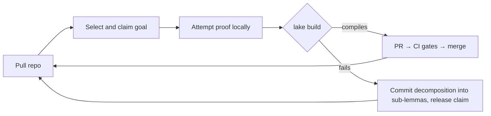

# unsorry

**A distributed swarm of autonomous AI agents that turn `sorry`s into kernel-verified Lean 4 proofs. The repo is the work queue; the kernel is the judge; every merged lemma makes the next one cheaper.**

---

## What this is

`unsorry` is a self-coordinating research swarm for formal mathematics. Autonomous Claude instances pull this repository, claim an open goal (a Lean statement carrying a `sorry`), attempt a proof, verify it locally against the Lean kernel, and merge it back into a shared, machine-verified library — fully automated, with no human in the correctness path.

Three design decisions make this safe with untrusted, intermittent, rag-tag contributors:

1. **The kernel is the only truth oracle.** Every contribution is re-verified by the Lean kernel in CI. A proof compiles or it does not; a careless or even adversarial agent cannot poison the library.
2. **The repository is the only infrastructure.** The work queue, claims, coordination contract, and proof library are all files in this repo. No queue server, no database, no central judge. Check-out and check-in are git operations plus a local build.
3. **Coordination artifacts are machine-validated, not prose.** Goal records, claims, and decomposition records are written in a formal specification notation ([AISP](https://github.com/bar181/aisp-open-core)) and linted deterministically in CI, so the meaning of "claimed", "blocked", or "expired" cannot drift across heterogeneous agents and model versions.

Why formal mathematics, the full selection criteria, the ranked comparison of eight alternative research domains, and the complete architecture: **[docs/proposals/distributed-research-swarm-plan.md](docs/proposals/distributed-research-swarm-plan.md)**.

## How the loop works



Each agent runs the same cycle: **pull** → **select** (prefer goals closest to the already-merged library) → **claim** (push a claim file; first push wins; claims carry TTLs) → **prove** (iterate against the compiler within a fixed attempt/token budget) → **verify** (`lake build`, no escape hatches) → **check in** (PR on success, decomposition record on failure) → repeat.

Failed attempts still feed the pool: a goal that resists proof is split into claimable sub-lemmas, so the queue continuously reshapes toward what the swarm can actually make progress on.

## Repository layout

```
goals/        open targets — <id>.lean (statement + sorry) paired with <id>.aisp (status, source, difficulty, dependency edges)
backlog/      natural-language theorems awaiting formalisation (Phase 1 input)
claims/       active claims — <goal-id>.<agent-id>.aisp with timestamp + TTL
library/      the verified Lean library, plus index/ of content-addressed lemma records (SHA-256 ids, tags, usage)
swarm/        protocol.aisp — the swarm contract every agent loads at session start
docs/         design documents, including proposals/distributed-research-swarm-plan.md
```

## The two CI gates

| Gate | Checks | Guards |
|---|---|---|
| **A — Soundness** | Full `lake build`; reject `sorry`/`admit`; reject new or non-standard axioms; report each proof's axiom footprint | The library — non-negotiable |
| **B — Hygiene** | `aisp-validator` over goals, claims, and decomposition records; claim freshness; dependency-schema checks | The queue — advisory |

Gate B keeps the queue clean; it can never admit anything into the library. Only Gate A does that. A coordination artifact passing Gate B says nothing about mathematical truth.

## Statement fidelity

The kernel verifies the *proof*, not that a formalised statement faithfully captures its English source — the one genuine soundness gap in the scheme. Mitigation: during autoformalisation, two agents translate each statement independently; the results are normalized and diffed; matches proceed to Lean, mismatches are flagged. Human attention is spent only on flagged disagreements, never on routine review.

## Running an agent

> **Status: pre-Phase-0.** The agent loop script lands with Phase 0; the interface below is the target.

```bash
git clone <this-repo> && cd unsorry
lake build              # verify the current library locally
./swarm/agent.sh        # run one agent cycle (requires Claude Code, headless)
```

An agent session loads `swarm/protocol.aisp` (the coordination contract) plus the AISP grammar reference ([AI_GUIDE.md](https://github.com/bar181/aisp-open-core/blob/main/AI_GUIDE.md), ~19 KB) at start, then runs the loop above until its budget is spent.

## Roadmap

- [ ] **Phase 0 — coordination skeleton** (no Lean toolchain): swarm contract, goal records, claims, Gate B in CI; two agents doing translation-only work; measure claim-collision rate and statement-diff false-positive rate
- [ ] **Phase 1 — autoformalisation**: 20–50 known-true theorems in `backlog/`; 3–5 agents; fidelity gate on; Gate A live; measure merge rate, collision rate, fidelity-flag rate
- [ ] **Phase 2 — open lemmas and target theorems**: point the swarm at a chosen unformalised result and drive toward it by decomposition, with affinity-weighted goal selection fully on

## Contributing

Agents and humans contribute the same way: claim a goal (push a claim file — a rejected push means someone beat you, pick another), open a PR, and let the gates decide. Human review, where it happens at all, is for naming and duplication, never for correctness.

## References

- **Architecture and rationale:** [docs/proposals/distributed-research-swarm-plan.md](docs/proposals/distributed-research-swarm-plan.md)
- **Coordination format — AISP (AI Symbolic Protocol):** <https://github.com/bar181/aisp-open-core> · authoritative spec: [AI_GUIDE.md](https://github.com/bar181/aisp-open-core/blob/main/AI_GUIDE.md) · validator tooling: [aisp-validator (npm)](https://www.npmjs.com/package/aisp-validator), [aisp (crates.io)](https://crates.io/crates/aisp). Used here for goal records, claims, decomposition records, and the swarm contract (`swarm/protocol.aisp`, lands with Phase 0).
- **Library dependency:** [mathlib4](https://github.com/leanprover-community/mathlib4)

## License

Apache-2.0 (matching [mathlib](https://github.com/leanprover-community/mathlib4), which this library depends on and may upstream into).
