# Proof graph

<!-- GENERATED by `python3 -m tools.visualiser --write`. Do not edit by hand. -->

A visualiser for the swarm's proof graph (issue #371): every prove-goal, its status, the decomposition lineage that stacks sub-goals into their parents, and who solved each one. Click any node in the diagram to open its Lean statement.

> An **interactive** version — pan/zoom, click-to-detail panel, filterable table — is generated alongside this file at [`docs/proofs-contributors-visualisation.html`](proofs-contributors-visualisation.html) (open it locally or via GitHub Pages; the browser renders it, GitHub shows the source).

**1190 goals — 154 open · 3 blocked · 9 translated · 321 proved · 703 archived.** 5 decomposition families shown below; standalone goals (no lineage) are folded into one summary cluster per status — the interactive page expands a cluster into its goals on click, and every goal is listed individually in the table.

Solving agent, PR and the GitHub user who merged it are resolved from the `prove(…)` merge commits (317 of 321 proved goals carry a per-goal prove-PR; the rest predate that convention and are left blank). The solver shows the recorded AISP login where present, otherwise the merging GitHub user; the model comes from recorded provenance only — never guessed (ADR-023).

## Dependency lineage

Edges run **parent → sub-goal**: a parent is discharged once its sub-goals are proved (the keystone pattern behind big targets — see ADR-031 / issue #365).

```mermaid
flowchart LR
  classDef proved fill:#c6f6d5,stroke:#4a5568,color:#1a202c;
  classDef open fill:#e2e8f0,stroke:#4a5568,color:#1a202c;
  classDef blocked fill:#feebc8,stroke:#4a5568,color:#1a202c;
  classDef flagged fill:#fed7d7,stroke:#4a5568,color:#1a202c;
  classDef translated fill:#bee3f8,stroke:#4a5568,color:#1a202c;
  classDef unknown fill:#edf2f7,stroke:#4a5568,color:#1a202c;
  g_nat_sq_lt_two_pow["nat-sq-lt-two-pow"]
  class g_nat_sq_lt_two_pow proved;
  click g_nat_sq_lt_two_pow "https://github.com/agenticsnz/unsorry/blob/main/goals/nat-sq-lt-two-pow.lean" "nat-sq-lt-two-pow — proved"
  g_nat_sq_lt_two_pow_s1["nat-sq-lt-two-pow-s1"]
  class g_nat_sq_lt_two_pow_s1 proved;
  click g_nat_sq_lt_two_pow_s1 "https://github.com/agenticsnz/unsorry/blob/main/goals/nat-sq-lt-two-pow-s1.lean" "nat-sq-lt-two-pow-s1 — proved"
  g_nat_sq_lt_two_pow_s2["nat-sq-lt-two-pow-s2"]
  class g_nat_sq_lt_two_pow_s2 open;
  click g_nat_sq_lt_two_pow_s2 "https://github.com/agenticsnz/unsorry/blob/main/goals/nat-sq-lt-two-pow-s2.lean" "nat-sq-lt-two-pow-s2 — open"
  g_nat_sq_lt_two_pow_s2_s1["nat-sq-lt-two-pow-s2-s1"]
  class g_nat_sq_lt_two_pow_s2_s1 proved;
  click g_nat_sq_lt_two_pow_s2_s1 "https://github.com/agenticsnz/unsorry/blob/main/goals/nat-sq-lt-two-pow-s2-s1.lean" "nat-sq-lt-two-pow-s2-s1 — proved"
  g_nat_sq_lt_two_pow_s2_s2["nat-sq-lt-two-pow-s2-s2"]
  class g_nat_sq_lt_two_pow_s2_s2 proved;
  click g_nat_sq_lt_two_pow_s2_s2 "https://github.com/agenticsnz/unsorry/blob/main/goals/nat-sq-lt-two-pow-s2-s2.lean" "nat-sq-lt-two-pow-s2-s2 — proved"
  g_nat_sq_lt_two_pow_s2_s3["nat-sq-lt-two-pow-s2-s3"]
  class g_nat_sq_lt_two_pow_s2_s3 proved;
  click g_nat_sq_lt_two_pow_s2_s3 "https://github.com/agenticsnz/unsorry/blob/main/goals/nat-sq-lt-two-pow-s2-s3.lean" "nat-sq-lt-two-pow-s2-s3 — proved"
  g_nesbitt_inequality["nesbitt-inequality"]
  class g_nesbitt_inequality blocked;
  click g_nesbitt_inequality "https://github.com/agenticsnz/unsorry/blob/main/goals/nesbitt-inequality.lean" "nesbitt-inequality — blocked"
  g_nesbitt_inequality_s1["nesbitt-inequality-s1"]
  class g_nesbitt_inequality_s1 open;
  click g_nesbitt_inequality_s1 "https://github.com/agenticsnz/unsorry/blob/main/goals/nesbitt-inequality-s1.lean" "nesbitt-inequality-s1 — open"
  g_nesbitt_inequality_s2["nesbitt-inequality-s2"]
  class g_nesbitt_inequality_s2 proved;
  click g_nesbitt_inequality_s2 "https://github.com/agenticsnz/unsorry/blob/main/goals/nesbitt-inequality-s2.lean" "nesbitt-inequality-s2 — proved"
  g_nesbitt_inequality_s3["nesbitt-inequality-s3"]
  class g_nesbitt_inequality_s3 proved;
  click g_nesbitt_inequality_s3 "https://github.com/agenticsnz/unsorry/blob/main/goals/nesbitt-inequality-s3.lean" "nesbitt-inequality-s3 — proved"
  g_nesbitt_inequality_s4["nesbitt-inequality-s4"]
  class g_nesbitt_inequality_s4 proved;
  click g_nesbitt_inequality_s4 "https://github.com/agenticsnz/unsorry/blob/main/goals/nesbitt-inequality-s4.lean" "nesbitt-inequality-s4 — proved"
  g_sq_add_sq_eq_three_mul_sq["sq-add-sq-eq-three-mul-sq"]
  class g_sq_add_sq_eq_three_mul_sq blocked;
  click g_sq_add_sq_eq_three_mul_sq "https://github.com/agenticsnz/unsorry/blob/main/goals/sq-add-sq-eq-three-mul-sq.lean" "sq-add-sq-eq-three-mul-sq — blocked"
  g_sq_add_sq_eq_three_mul_sq_s1["sq-add-sq-eq-three-mul-sq-s1"]
  class g_sq_add_sq_eq_three_mul_sq_s1 proved;
  click g_sq_add_sq_eq_three_mul_sq_s1 "https://github.com/agenticsnz/unsorry/blob/main/goals/sq-add-sq-eq-three-mul-sq-s1.lean" "sq-add-sq-eq-three-mul-sq-s1 — proved"
  g_sq_add_sq_eq_three_mul_sq_s2["sq-add-sq-eq-three-mul-sq-s2"]
  class g_sq_add_sq_eq_three_mul_sq_s2 proved;
  click g_sq_add_sq_eq_three_mul_sq_s2 "https://github.com/agenticsnz/unsorry/blob/main/goals/sq-add-sq-eq-three-mul-sq-s2.lean" "sq-add-sq-eq-three-mul-sq-s2 — proved"
  g_sq_add_sq_eq_three_mul_sq_s3["sq-add-sq-eq-three-mul-sq-s3"]
  class g_sq_add_sq_eq_three_mul_sq_s3 proved;
  click g_sq_add_sq_eq_three_mul_sq_s3 "https://github.com/agenticsnz/unsorry/blob/main/goals/sq-add-sq-eq-three-mul-sq-s3.lean" "sq-add-sq-eq-three-mul-sq-s3 — proved"
  g_sq_add_sq_eq_three_mul_sq_s4["sq-add-sq-eq-three-mul-sq-s4"]
  class g_sq_add_sq_eq_three_mul_sq_s4 open;
  click g_sq_add_sq_eq_three_mul_sq_s4 "https://github.com/agenticsnz/unsorry/blob/main/goals/sq-add-sq-eq-three-mul-sq-s4.lean" "sq-add-sq-eq-three-mul-sq-s4 — open"
  g_sum_icc_choose_hockey_stick["sum-icc-choose-hockey-stick"]
  class g_sum_icc_choose_hockey_stick blocked;
  click g_sum_icc_choose_hockey_stick "https://github.com/agenticsnz/unsorry/blob/main/goals/sum-icc-choose-hockey-stick.lean" "sum-icc-choose-hockey-stick — blocked"
  g_sum_icc_choose_hockey_stick_s1["sum-icc-choose-hockey-stick-s1"]
  class g_sum_icc_choose_hockey_stick_s1 open;
  click g_sum_icc_choose_hockey_stick_s1 "https://github.com/agenticsnz/unsorry/blob/main/goals/sum-icc-choose-hockey-stick-s1.lean" "sum-icc-choose-hockey-stick-s1 — open"
  g_sum_icc_choose_hockey_stick_s2["sum-icc-choose-hockey-stick-s2"]
  class g_sum_icc_choose_hockey_stick_s2 open;
  click g_sum_icc_choose_hockey_stick_s2 "https://github.com/agenticsnz/unsorry/blob/main/goals/sum-icc-choose-hockey-stick-s2.lean" "sum-icc-choose-hockey-stick-s2 — open"
  g_sum_icc_choose_hockey_stick_s3["sum-icc-choose-hockey-stick-s3"]
  class g_sum_icc_choose_hockey_stick_s3 open;
  click g_sum_icc_choose_hockey_stick_s3 "https://github.com/agenticsnz/unsorry/blob/main/goals/sum-icc-choose-hockey-stick-s3.lean" "sum-icc-choose-hockey-stick-s3 — open"
  g_nat_sq_lt_two_pow --> g_nat_sq_lt_two_pow_s1
  g_nat_sq_lt_two_pow --> g_nat_sq_lt_two_pow_s2
  g_nat_sq_lt_two_pow_s2 --> g_nat_sq_lt_two_pow_s2_s1
  g_nat_sq_lt_two_pow_s2 --> g_nat_sq_lt_two_pow_s2_s2
  g_nat_sq_lt_two_pow_s2 --> g_nat_sq_lt_two_pow_s2_s3
  g_nesbitt_inequality --> g_nesbitt_inequality_s1
  g_nesbitt_inequality --> g_nesbitt_inequality_s2
  g_nesbitt_inequality --> g_nesbitt_inequality_s3
  g_nesbitt_inequality --> g_nesbitt_inequality_s4
  g_sq_add_sq_eq_three_mul_sq --> g_sq_add_sq_eq_three_mul_sq_s1
  g_sq_add_sq_eq_three_mul_sq --> g_sq_add_sq_eq_three_mul_sq_s2
  g_sq_add_sq_eq_three_mul_sq --> g_sq_add_sq_eq_three_mul_sq_s3
  g_sq_add_sq_eq_three_mul_sq --> g_sq_add_sq_eq_three_mul_sq_s4
  g_sum_icc_choose_hockey_stick --> g_sum_icc_choose_hockey_stick_s1
  g_sum_icc_choose_hockey_stick --> g_sum_icc_choose_hockey_stick_s2
  g_sum_icc_choose_hockey_stick --> g_sum_icc_choose_hockey_stick_s3
  cluster_open(["open · 148"])
  class cluster_open open;
  cluster_translated(["translated · 9"])
  class cluster_translated translated;
  cluster_proved(["proved · 310"])
  class cluster_proved proved;
  cluster_archived(["archived · 703"])
  class cluster_archived unknown;
```

Legend: proved #c6f6d5 · open #e2e8f0 · blocked #feebc8 · flagged #fed7d7 · translated #bee3f8

## All goals

| Goal | Status | Difficulty | Agent | Solver / model | PR | Proved |
| --- | --- | --- | --- | --- | --- | --- |
| [`hexagonal-eq-triangular-odd-index`](https://github.com/agenticsnz/unsorry/blob/main/goals/hexagonal-eq-triangular-odd-index.lean) | open | 1 | — | — | — | — |
| [`n4-plus-one-factor-over-sqrt-shift`](https://github.com/agenticsnz/unsorry/blob/main/goals/n4-plus-one-factor-over-sqrt-shift.lean) | open | 2 | — | — | — | — |
| [`nat-sq-lt-two-pow-s2`](https://github.com/agenticsnz/unsorry/blob/main/goals/nat-sq-lt-two-pow-s2.lean) | open | 1 | — | — | — | — |
| [`nesbitt-inequality-s1`](https://github.com/agenticsnz/unsorry/blob/main/goals/nesbitt-inequality-s1.lean) | open | 1 | — | — | — | — |
| [`nicomachus-sum-cubes-eq-sum-id-sq`](https://github.com/agenticsnz/unsorry/blob/main/goals/nicomachus-sum-cubes-eq-sum-id-sq.lean) | open | 3 | — | — | — | — |
| [`platonic-pairs-realizable`](https://github.com/agenticsnz/unsorry/blob/main/goals/platonic-pairs-realizable.lean) | open | 3 | — | — | — | — |
| [`pow-five-add-pow-five-ge-quartic-mul`](https://github.com/agenticsnz/unsorry/blob/main/goals/pow-five-add-pow-five-ge-quartic-mul.lean) | open | 3 | — | — | — | — |
| [`prime-pow-eight-mod-480`](https://github.com/agenticsnz/unsorry/blob/main/goals/prime-pow-eight-mod-480.lean) | open | 4 | — | — | — | — |
| [`prime-pow-six-mod-504`](https://github.com/agenticsnz/unsorry/blob/main/goals/prime-pow-six-mod-504.lean) | open | 4 | — | — | — | — |
| [`prod-icc-k-mul-add-two-div-succ-sq-telescope`](https://github.com/agenticsnz/unsorry/blob/main/goals/prod-icc-k-mul-add-two-div-succ-sq-telescope.lean) | open | 3 | — | — | — | — |
| [`prod-icc-k-mul-add-two-div-succ-sq-telescope-half`](https://github.com/agenticsnz/unsorry/blob/main/goals/prod-icc-k-mul-add-two-div-succ-sq-telescope-half.lean) | open | 2 | — | — | — | — |
| [`prod-icc-k-sq-div-pred-mul-succ-telescope`](https://github.com/agenticsnz/unsorry/blob/main/goals/prod-icc-k-sq-div-pred-mul-succ-telescope.lean) | open | 2 | — | — | — | — |
| [`prod-icc-one-add-recip-eq-succ`](https://github.com/agenticsnz/unsorry/blob/main/goals/prod-icc-one-add-recip-eq-succ.lean) | open | 2 | — | — | — | — |
| [`prod-icc-one-add-recip-k-sq-sub-one-telescope`](https://github.com/agenticsnz/unsorry/blob/main/goals/prod-icc-one-add-recip-k-sq-sub-one-telescope.lean) | open | 3 | — | — | — | — |
| [`prod-icc-one-add-recip-pronic`](https://github.com/agenticsnz/unsorry/blob/main/goals/prod-icc-one-add-recip-pronic.lean) | open | 3 | — | — | — | — |
| [`prod-icc-one-sub-recip-sq-eq-frac`](https://github.com/agenticsnz/unsorry/blob/main/goals/prod-icc-one-sub-recip-sq-eq-frac.lean) | open | 2 | — | — | — | — |
| [`prod-icc-one-sub-two-div-pronic`](https://github.com/agenticsnz/unsorry/blob/main/goals/prod-icc-one-sub-two-div-pronic.lean) | open | 3 | — | — | — | — |
| [`prod-icc-succ-add-three-div-self-eq-binom-shift`](https://github.com/agenticsnz/unsorry/blob/main/goals/prod-icc-succ-add-three-div-self-eq-binom-shift.lean) | open | 2 | — | — | — | — |
| [`prod-icc-succ-sq-div-k-mul-add-two-telescope`](https://github.com/agenticsnz/unsorry/blob/main/goals/prod-icc-succ-sq-div-k-mul-add-two-telescope.lean) | open | 2 | — | — | — | — |
| [`prod-one-sub-inv-sq-telescope`](https://github.com/agenticsnz/unsorry/blob/main/goals/prod-one-sub-inv-sq-telescope.lean) | open | 4 | — | — | — | — |
| [`quartic-n4-plus-four-composite`](https://github.com/agenticsnz/unsorry/blob/main/goals/quartic-n4-plus-four-composite.lean) | open | 2 | — | — | — | — |
| [`quartic-n4-plus-four-not-prime`](https://github.com/agenticsnz/unsorry/blob/main/goals/quartic-n4-plus-four-not-prime.lean) | open | 3 | — | — | — | — |
| [`quartic-plus-four-not-prime`](https://github.com/agenticsnz/unsorry/blob/main/goals/quartic-plus-four-not-prime.lean) | open | 4 | — | — | — | — |
| [`quartic-x4-plus-x2-plus-one-dvd-by-minus-factor`](https://github.com/agenticsnz/unsorry/blob/main/goals/quartic-x4-plus-x2-plus-one-dvd-by-minus-factor.lean) | open | 2 | — | — | — | — |
| [`realization-edge-relation`](https://github.com/agenticsnz/unsorry/blob/main/goals/realization-edge-relation.lean) | open | 2 | — | — | — | — |
| [`sextic-x6-plus-x3-plus-one-composite-shift`](https://github.com/agenticsnz/unsorry/blob/main/goals/sextic-x6-plus-x3-plus-one-composite-shift.lean) | open | 2 | — | — | — | — |
| [`sophie-germain-plus-factor-dvd`](https://github.com/agenticsnz/unsorry/blob/main/goals/sophie-germain-plus-factor-dvd.lean) | open | 2 | — | — | — | — |
| [`sq-add-sq-eq-three-mul-sq-s4`](https://github.com/agenticsnz/unsorry/blob/main/goals/sq-add-sq-eq-three-mul-sq-s4.lean) | open | 1 | — | — | — | — |
| [`sq-mod-five-ne-two-three`](https://github.com/agenticsnz/unsorry/blob/main/goals/sq-mod-five-ne-two-three.lean) | open | 2 | — | — | — | — |
| [`sq-mod-ten-ne-two-three-seven-eight`](https://github.com/agenticsnz/unsorry/blob/main/goals/sq-mod-ten-ne-two-three-seven-eight.lean) | open | 2 | — | — | — | — |
| [`sum-centered-triangular-closed-form`](https://github.com/agenticsnz/unsorry/blob/main/goals/sum-centered-triangular-closed-form.lean) | open | 2 | — | — | — | — |
| [`sum-decagonal-closed-form`](https://github.com/agenticsnz/unsorry/blob/main/goals/sum-decagonal-closed-form.lean) | open | 3 | — | — | — | — |
| [`sum-heptagonal-closed-form`](https://github.com/agenticsnz/unsorry/blob/main/goals/sum-heptagonal-closed-form.lean) | open | 3 | — | — | — | — |
| [`sum-heptagonal-numbers-closed-form`](https://github.com/agenticsnz/unsorry/blob/main/goals/sum-heptagonal-numbers-closed-form.lean) | open | 2 | — | — | — | — |
| [`sum-hexagonal-numbers-closed-form`](https://github.com/agenticsnz/unsorry/blob/main/goals/sum-hexagonal-numbers-closed-form.lean) | open | 3 | — | — | — | — |
| [`sum-icc-choose-hockey-stick-s1`](https://github.com/agenticsnz/unsorry/blob/main/goals/sum-icc-choose-hockey-stick-s1.lean) | open | 1 | — | — | — | — |
| [`sum-icc-choose-hockey-stick-s2`](https://github.com/agenticsnz/unsorry/blob/main/goals/sum-icc-choose-hockey-stick-s2.lean) | open | 1 | — | — | — | — |
| [`sum-icc-choose-hockey-stick-s3`](https://github.com/agenticsnz/unsorry/blob/main/goals/sum-icc-choose-hockey-stick-s3.lean) | open | 1 | — | — | — | — |
| [`sum-icc-eight-k-div-odd-sq-pair-telescope`](https://github.com/agenticsnz/unsorry/blob/main/goals/sum-icc-eight-k-div-odd-sq-pair-telescope.lean) | open | 2 | — | — | — | — |
| [`sum-icc-four-div-four-k-sub-one-four-k-add-three-telescope`](https://github.com/agenticsnz/unsorry/blob/main/goals/sum-icc-four-div-four-k-sub-one-four-k-add-three-telescope.lean) | open | 2 | — | — | — | — |
| [`sum-icc-id-mul-two-pow-pred`](https://github.com/agenticsnz/unsorry/blob/main/goals/sum-icc-id-mul-two-pow-pred.lean) | open | 2 | — | — | — | — |
| [`sum-icc-k-sq-add-one-mul-factorial-eq-prod`](https://github.com/agenticsnz/unsorry/blob/main/goals/sum-icc-k-sq-add-one-mul-factorial-eq-prod.lean) | open | 3 | — | — | — | — |
| [`sum-icc-k-sq-add-one-mul-factorial-eq-pronic-factorial`](https://github.com/agenticsnz/unsorry/blob/main/goals/sum-icc-k-sq-add-one-mul-factorial-eq-pronic-factorial.lean) | open | 2 | — | — | — | — |
| [`sum-icc-k-sub-one-div-factorial-eq-one-sub`](https://github.com/agenticsnz/unsorry/blob/main/goals/sum-icc-k-sub-one-div-factorial-eq-one-sub.lean) | open | 3 | — | — | — | — |
| [`sum-icc-recip-step-four-pair-eq-n-div`](https://github.com/agenticsnz/unsorry/blob/main/goals/sum-icc-recip-step-four-pair-eq-n-div.lean) | open | 2 | — | — | — | — |
| [`sum-icc-three-k-sub-one-mul-two-pow-pred-closed`](https://github.com/agenticsnz/unsorry/blob/main/goals/sum-icc-three-k-sub-one-mul-two-pow-pred-closed.lean) | open | 2 | — | — | — | — |
| [`sum-id-mul-triangular-closed-form`](https://github.com/agenticsnz/unsorry/blob/main/goals/sum-id-mul-triangular-closed-form.lean) | open | 3 | — | — | — | — |
| [`sum-octagonal-running-closed-form`](https://github.com/agenticsnz/unsorry/blob/main/goals/sum-octagonal-running-closed-form.lean) | open | 3 | — | — | — | — |
| [`sum-octahedral-centered-squares`](https://github.com/agenticsnz/unsorry/blob/main/goals/sum-octahedral-centered-squares.lean) | open | 2 | — | — | — | — |
| [`sum-odd-gnomon-squares-closed-form`](https://github.com/agenticsnz/unsorry/blob/main/goals/sum-odd-gnomon-squares-closed-form.lean) | open | 3 | — | — | — | — |
| [`sum-odd-squares-faulhaber`](https://github.com/agenticsnz/unsorry/blob/main/goals/sum-odd-squares-faulhaber.lean) | open | 2 | — | — | — | — |
| [`sum-one-div-four-k-plus-one-mul-four-k-plus-five`](https://github.com/agenticsnz/unsorry/blob/main/goals/sum-one-div-four-k-plus-one-mul-four-k-plus-five.lean) | open | 3 | — | — | — | — |
| [`sum-one-div-succ-mul-add-four-telescope`](https://github.com/agenticsnz/unsorry/blob/main/goals/sum-one-div-succ-mul-add-four-telescope.lean) | open | 4 | — | — | — | — |
| [`sum-one-div-three-k-plus-one-mul-three-k-plus-four`](https://github.com/agenticsnz/unsorry/blob/main/goals/sum-one-div-three-k-plus-one-mul-three-k-plus-four.lean) | open | 3 | — | — | — | — |
| [`sum-pentagonal-running-eq-pyramidal`](https://github.com/agenticsnz/unsorry/blob/main/goals/sum-pentagonal-running-eq-pyramidal.lean) | open | 3 | — | — | — | — |
| [`sum-product-consecutive-odds-closed-form`](https://github.com/agenticsnz/unsorry/blob/main/goals/sum-product-consecutive-odds-closed-form.lean) | open | 2 | — | — | — | — |
| [`sum-pronic-eq-thrice-tetrahedral`](https://github.com/agenticsnz/unsorry/blob/main/goals/sum-pronic-eq-thrice-tetrahedral.lean) | open | 2 | — | — | — | — |
| [`sum-range-catalan-mul-catalan-eq-catalan-succ`](https://github.com/agenticsnz/unsorry/blob/main/goals/sum-range-catalan-mul-catalan-eq-catalan-succ.lean) | open | 3 | — | — | — | — |
| [`sum-range-choose-mul-choose-three-eq`](https://github.com/agenticsnz/unsorry/blob/main/goals/sum-range-choose-mul-choose-three-eq.lean) | open | 4 | — | — | — | — |
| [`sum-range-choose-mul-k-mul-comp-eq`](https://github.com/agenticsnz/unsorry/blob/main/goals/sum-range-choose-mul-k-mul-comp-eq.lean) | open | 4 | — | — | — | — |
| [`sum-range-choose-mul-succ-choose-eq`](https://github.com/agenticsnz/unsorry/blob/main/goals/sum-range-choose-mul-succ-choose-eq.lean) | open | 3 | — | — | — | — |
| [`sum-range-choose-mul-succ-choose-succ-eq-central-shift`](https://github.com/agenticsnz/unsorry/blob/main/goals/sum-range-choose-mul-succ-choose-succ-eq-central-shift.lean) | open | 3 | — | — | — | — |
| [`sum-range-choose-sq-eq-central`](https://github.com/agenticsnz/unsorry/blob/main/goals/sum-range-choose-sq-eq-central.lean) | open | 4 | — | — | — | — |
| [`sum-range-comp-mul-choose-sq-eq`](https://github.com/agenticsnz/unsorry/blob/main/goals/sum-range-comp-mul-choose-sq-eq.lean) | open | 3 | — | — | — | — |
| [`sum-range-compositions-count-eq-two-pow`](https://github.com/agenticsnz/unsorry/blob/main/goals/sum-range-compositions-count-eq-two-pow.lean) | open | 3 | — | — | — | — |
| [`sum-range-cube-sym-choose-sq-eq-zero`](https://github.com/agenticsnz/unsorry/blob/main/goals/sum-range-cube-sym-choose-sq-eq-zero.lean) | open | 4 | — | — | — | — |
| [`sum-range-disp-mul-choose-eq-zero`](https://github.com/agenticsnz/unsorry/blob/main/goals/sum-range-disp-mul-choose-eq-zero.lean) | open | 2 | — | — | — | — |
| [`sum-range-disp-mul-choose-sq-eq-zero`](https://github.com/agenticsnz/unsorry/blob/main/goals/sum-range-disp-mul-choose-sq-eq-zero.lean) | open | 3 | — | — | — | — |
| [`sum-range-even-cols-eq-two-pow`](https://github.com/agenticsnz/unsorry/blob/main/goals/sum-range-even-cols-eq-two-pow.lean) | open | 4 | — | — | — | — |
| [`sum-range-fall-three-mul-choose`](https://github.com/agenticsnz/unsorry/blob/main/goals/sum-range-fall-three-mul-choose.lean) | open | 4 | — | — | — | — |
| [`sum-range-fib-mul-two-pow-rev-eq`](https://github.com/agenticsnz/unsorry/blob/main/goals/sum-range-fib-mul-two-pow-rev-eq.lean) | open | 3 | — | — | — | — |
| [`sum-range-fib-prod-shift-even-nat`](https://github.com/agenticsnz/unsorry/blob/main/goals/sum-range-fib-prod-shift-even-nat.lean) | open | 3 | — | — | — | — |
| [`sum-range-fib-sq-eq-prod`](https://github.com/agenticsnz/unsorry/blob/main/goals/sum-range-fib-sq-eq-prod.lean) | open | 3 | — | — | — | — |
| [`sum-range-fib-sq-mul-two-eq`](https://github.com/agenticsnz/unsorry/blob/main/goals/sum-range-fib-sq-mul-two-eq.lean) | open | 3 | — | — | — | — |
| [`sum-range-fib-two-mul-succ-eq-fib-pred`](https://github.com/agenticsnz/unsorry/blob/main/goals/sum-range-fib-two-mul-succ-eq-fib-pred.lean) | open | 3 | — | — | — | — |
| [`sum-range-four-consecutive-product`](https://github.com/agenticsnz/unsorry/blob/main/goals/sum-range-four-consecutive-product.lean) | open | 3 | — | — | — | — |
| [`sum-range-four-mul-add-one`](https://github.com/agenticsnz/unsorry/blob/main/goals/sum-range-four-mul-add-one.lean) | open | 2 | — | — | — | — |
| [`sum-range-half-even-row-choose-eq`](https://github.com/agenticsnz/unsorry/blob/main/goals/sum-range-half-even-row-choose-eq.lean) | open | 3 | — | — | — | — |
| [`sum-range-id-mul-add-two`](https://github.com/agenticsnz/unsorry/blob/main/goals/sum-range-id-mul-add-two.lean) | open | 3 | — | — | — | — |
| [`sum-range-id-mul-choose-eq-half`](https://github.com/agenticsnz/unsorry/blob/main/goals/sum-range-id-mul-choose-eq-half.lean) | open | 3 | — | — | — | — |
| [`sum-range-k-div-succ-factorial-eq`](https://github.com/agenticsnz/unsorry/blob/main/goals/sum-range-k-div-succ-factorial-eq.lean) | open | 3 | — | — | — | — |
| [`sum-range-k-div-succ-factorial-telescope`](https://github.com/agenticsnz/unsorry/blob/main/goals/sum-range-k-div-succ-factorial-telescope.lean) | open | 3 | — | — | — | — |
| [`sum-range-k-mul-choose-mul-four-pow-closed`](https://github.com/agenticsnz/unsorry/blob/main/goals/sum-range-k-mul-choose-mul-four-pow-closed.lean) | open | 3 | — | — | — | — |
| [`sum-range-k-mul-choose-mul-three-pow-closed`](https://github.com/agenticsnz/unsorry/blob/main/goals/sum-range-k-mul-choose-mul-three-pow-closed.lean) | open | 3 | — | — | — | — |
| [`sum-range-k-mul-choose-mul-two-pow-eq-two-n-three-pow`](https://github.com/agenticsnz/unsorry/blob/main/goals/sum-range-k-mul-choose-mul-two-pow-eq-two-n-three-pow.lean) | open | 3 | — | — | — | — |
| [`sum-range-k-mul-choose-sq-eq-central`](https://github.com/agenticsnz/unsorry/blob/main/goals/sum-range-k-mul-choose-sq-eq-central.lean) | open | 4 | — | — | — | — |
| [`sum-range-k-mul-factorial-eq-factorial-succ-sub-one`](https://github.com/agenticsnz/unsorry/blob/main/goals/sum-range-k-mul-factorial-eq-factorial-succ-sub-one.lean) | open | 3 | — | — | — | — |
| [`sum-range-k-mul-factorial-succ`](https://github.com/agenticsnz/unsorry/blob/main/goals/sum-range-k-mul-factorial-succ.lean) | open | 3 | — | — | — | — |
| [`sum-range-k-plus-one-mul-choose`](https://github.com/agenticsnz/unsorry/blob/main/goals/sum-range-k-plus-one-mul-choose.lean) | open | 3 | — | — | — | — |
| [`sum-range-k-sq-mul-choose-eq`](https://github.com/agenticsnz/unsorry/blob/main/goals/sum-range-k-sq-mul-choose-eq.lean) | open | 3 | — | — | — | — |
| [`sum-range-k-sub-one-div-factorial-telescope`](https://github.com/agenticsnz/unsorry/blob/main/goals/sum-range-k-sub-one-div-factorial-telescope.lean) | open | 2 | — | — | — | — |
| [`sum-range-lower-triangle-choose-eq-two-pow`](https://github.com/agenticsnz/unsorry/blob/main/goals/sum-range-lower-triangle-choose-eq-two-pow.lean) | open | 3 | — | — | — | — |
| [`sum-range-lucas-shift-nat`](https://github.com/agenticsnz/unsorry/blob/main/goals/sum-range-lucas-shift-nat.lean) | open | 3 | — | — | — | — |
| [`sum-range-multichoose-two-eq-choose-succ-two`](https://github.com/agenticsnz/unsorry/blob/main/goals/sum-range-multichoose-two-eq-choose-succ-two.lean) | open | 2 | — | — | — | — |
| [`sum-range-odd-cubes`](https://github.com/agenticsnz/unsorry/blob/main/goals/sum-range-odd-cubes.lean) | open | 3 | — | — | — | — |
| [`sum-range-odd-div-two-pow`](https://github.com/agenticsnz/unsorry/blob/main/goals/sum-range-odd-div-two-pow.lean) | open | 3 | — | — | — | — |
| [`sum-range-odd-index-choose-eq-two-pow`](https://github.com/agenticsnz/unsorry/blob/main/goals/sum-range-odd-index-choose-eq-two-pow.lean) | open | 3 | — | — | — | — |
| [`sum-range-odd-num-sq-succ-sq-telescope`](https://github.com/agenticsnz/unsorry/blob/main/goals/sum-range-odd-num-sq-succ-sq-telescope.lean) | open | 3 | — | — | — | — |
| [`sum-range-pascal-diagonal-eq-choose`](https://github.com/agenticsnz/unsorry/blob/main/goals/sum-range-pascal-diagonal-eq-choose.lean) | open | 3 | — | — | — | — |
| [`sum-range-recip-choose-two-eq-two-n-div-succ`](https://github.com/agenticsnz/unsorry/blob/main/goals/sum-range-recip-choose-two-eq-two-n-div-succ.lean) | open | 3 | — | — | — | — |
| [`sum-range-recip-consecutive`](https://github.com/agenticsnz/unsorry/blob/main/goals/sum-range-recip-consecutive.lean) | open | 3 | — | — | — | — |
| [`sum-range-recip-five-step-product`](https://github.com/agenticsnz/unsorry/blob/main/goals/sum-range-recip-five-step-product.lean) | open | 3 | — | — | — | — |
| [`sum-range-recip-five-step-residue-one`](https://github.com/agenticsnz/unsorry/blob/main/goals/sum-range-recip-five-step-residue-one.lean) | open | 2 | — | — | — | — |
| [`sum-range-recip-four-consec-product`](https://github.com/agenticsnz/unsorry/blob/main/goals/sum-range-recip-four-consec-product.lean) | open | 3 | — | — | — | — |
| [`sum-range-recip-four-step-product`](https://github.com/agenticsnz/unsorry/blob/main/goals/sum-range-recip-four-step-product.lean) | open | 2 | — | — | — | — |
| [`sum-range-recip-four-step-residue-one`](https://github.com/agenticsnz/unsorry/blob/main/goals/sum-range-recip-four-step-residue-one.lean) | open | 2 | — | — | — | — |
| [`sum-range-recip-odd-consecutive`](https://github.com/agenticsnz/unsorry/blob/main/goals/sum-range-recip-odd-consecutive.lean) | open | 2 | — | — | — | — |
| [`sum-range-recip-odd-pair-consecutive`](https://github.com/agenticsnz/unsorry/blob/main/goals/sum-range-recip-odd-pair-consecutive.lean) | open | 2 | — | — | — | — |
| [`sum-range-recip-odd-pair-step-two-eq-n-div`](https://github.com/agenticsnz/unsorry/blob/main/goals/sum-range-recip-odd-pair-step-two-eq-n-div.lean) | open | 2 | — | — | — | — |
| [`sum-range-recip-odd-product`](https://github.com/agenticsnz/unsorry/blob/main/goals/sum-range-recip-odd-product.lean) | open | 3 | — | — | — | — |
| [`sum-range-recip-shift-two-shift-five-telescope`](https://github.com/agenticsnz/unsorry/blob/main/goals/sum-range-recip-shift-two-shift-five-telescope.lean) | open | 3 | — | — | — | — |
| [`sum-range-recip-three-consec-odd-telescope`](https://github.com/agenticsnz/unsorry/blob/main/goals/sum-range-recip-three-consec-odd-telescope.lean) | open | 3 | — | — | — | — |
| [`sum-range-recip-three-consec-shifted`](https://github.com/agenticsnz/unsorry/blob/main/goals/sum-range-recip-three-consec-shifted.lean) | open | 3 | — | — | — | — |
| [`sum-range-recip-three-consecutive`](https://github.com/agenticsnz/unsorry/blob/main/goals/sum-range-recip-three-consecutive.lean) | open | 3 | — | — | — | — |
| [`sum-range-recip-three-step-residue-one`](https://github.com/agenticsnz/unsorry/blob/main/goals/sum-range-recip-three-step-residue-one.lean) | open | 2 | — | — | — | — |
| [`sum-range-recip-triple-consecutive`](https://github.com/agenticsnz/unsorry/blob/main/goals/sum-range-recip-triple-consecutive.lean) | open | 3 | — | — | — | — |
| [`sum-range-shifted-choose-eq-two-pow-sub-one`](https://github.com/agenticsnz/unsorry/blob/main/goals/sum-range-shifted-choose-eq-two-pow-sub-one.lean) | open | 3 | — | — | — | — |
| [`sum-range-stirling-first-row-eq-factorial`](https://github.com/agenticsnz/unsorry/blob/main/goals/sum-range-stirling-first-row-eq-factorial.lean) | open | 3 | — | — | — | — |
| [`sum-range-succ-div-factorial-add-two-telescope`](https://github.com/agenticsnz/unsorry/blob/main/goals/sum-range-succ-div-factorial-add-two-telescope.lean) | open | 3 | — | — | — | — |
| [`sum-range-succ-k-mul-choose-mul-two-pow-closed`](https://github.com/agenticsnz/unsorry/blob/main/goals/sum-range-succ-k-mul-choose-mul-two-pow-closed.lean) | open | 3 | — | — | — | — |
| [`sum-range-succ-mul-choose-sq-eq`](https://github.com/agenticsnz/unsorry/blob/main/goals/sum-range-succ-mul-choose-sq-eq.lean) | open | 3 | — | — | — | — |
| [`sum-range-succ-mul-factorial-eq`](https://github.com/agenticsnz/unsorry/blob/main/goals/sum-range-succ-mul-factorial-eq.lean) | open | 2 | — | — | — | — |
| [`sum-range-succ-mul-factorial-succ`](https://github.com/agenticsnz/unsorry/blob/main/goals/sum-range-succ-mul-factorial-succ.lean) | open | 2 | — | — | — | — |
| [`sum-range-three-mul-add-one`](https://github.com/agenticsnz/unsorry/blob/main/goals/sum-range-three-mul-add-one.lean) | open | 2 | — | — | — | — |
| [`sum-range-triangular-eq-tetrahedral`](https://github.com/agenticsnz/unsorry/blob/main/goals/sum-range-triangular-eq-tetrahedral.lean) | open | 3 | — | — | — | — |
| [`sum-range-two-k-sub-n-mul-choose-sq-eq-zero`](https://github.com/agenticsnz/unsorry/blob/main/goals/sum-range-two-k-sub-n-mul-choose-sq-eq-zero.lean) | open | 3 | — | — | — | — |
| [`sum-range-two-k-succ-mul-choose-eq`](https://github.com/agenticsnz/unsorry/blob/main/goals/sum-range-two-k-succ-mul-choose-eq.lean) | open | 2 | — | — | — | — |
| [`sum-range-vandermonde-self-eq-central-choose`](https://github.com/agenticsnz/unsorry/blob/main/goals/sum-range-vandermonde-self-eq-central-choose.lean) | open | 3 | — | — | — | — |
| [`sum-range-window-five-fib-eq-fib-diff-nat`](https://github.com/agenticsnz/unsorry/blob/main/goals/sum-range-window-five-fib-eq-fib-diff-nat.lean) | open | 2 | — | — | — | — |
| [`sum-range-window-four-fib-eq-fib-diff-nat`](https://github.com/agenticsnz/unsorry/blob/main/goals/sum-range-window-four-fib-eq-fib-diff-nat.lean) | open | 2 | — | — | — | — |
| [`sum-recip-times-sum-ge-nine`](https://github.com/agenticsnz/unsorry/blob/main/goals/sum-recip-times-sum-ge-nine.lean) | open | 3 | — | — | — | — |
| [`sum-rhombic-dodecahedral-eq-fourth-power`](https://github.com/agenticsnz/unsorry/blob/main/goals/sum-rhombic-dodecahedral-eq-fourth-power.lean) | open | 2 | — | — | — | — |
| [`sum-square-pyramidal-eq-hyper`](https://github.com/agenticsnz/unsorry/blob/main/goals/sum-square-pyramidal-eq-hyper.lean) | open | 3 | — | — | — | — |
| [`sum-star-numbers-closed-form`](https://github.com/agenticsnz/unsorry/blob/main/goals/sum-star-numbers-closed-form.lean) | open | 2 | — | — | — | — |
| [`sum-tetrahedral-eq-pentatope`](https://github.com/agenticsnz/unsorry/blob/main/goals/sum-tetrahedral-eq-pentatope.lean) | open | 3 | — | — | — | — |
| [`sum-three-squares-zmod-eight-ne-seven`](https://github.com/agenticsnz/unsorry/blob/main/goals/sum-three-squares-zmod-eight-ne-seven.lean) | open | 3 | — | — | — | — |
| [`sum-three-squares-zmod-sixteen-ne-fifteen`](https://github.com/agenticsnz/unsorry/blob/main/goals/sum-three-squares-zmod-sixteen-ne-fifteen.lean) | open | 3 | — | — | — | — |
| [`sum-two-cubes-zmod-nine-ne-four`](https://github.com/agenticsnz/unsorry/blob/main/goals/sum-two-cubes-zmod-nine-ne-four.lean) | open | 3 | — | — | — | — |
| [`sum-two-cubes-zmod-seven-mem`](https://github.com/agenticsnz/unsorry/blob/main/goals/sum-two-cubes-zmod-seven-mem.lean) | open | 3 | — | — | — | — |
| [`sum-two-fourth-powers-zmod-sixteen-mem`](https://github.com/agenticsnz/unsorry/blob/main/goals/sum-two-fourth-powers-zmod-sixteen-mem.lean) | open | 3 | — | — | — | — |
| [`sum-two-k-plus-one-div-sq-succ-sq-telescope`](https://github.com/agenticsnz/unsorry/blob/main/goals/sum-two-k-plus-one-div-sq-succ-sq-telescope.lean) | open | 3 | — | — | — | — |
| [`sum-two-squares-zmod-eight-ne-six`](https://github.com/agenticsnz/unsorry/blob/main/goals/sum-two-squares-zmod-eight-ne-six.lean) | open | 3 | — | — | — | — |
| [`sum-two-squares-zmod-four-ne-three`](https://github.com/agenticsnz/unsorry/blob/main/goals/sum-two-squares-zmod-four-ne-three.lean) | open | 2 | — | — | — | — |
| [`sum-vandermonde-diagonal-eq-choose`](https://github.com/agenticsnz/unsorry/blob/main/goals/sum-vandermonde-diagonal-eq-choose.lean) | open | 3 | — | — | — | — |
| [`tangent-line-cube-trick`](https://github.com/agenticsnz/unsorry/blob/main/goals/tangent-line-cube-trick.lean) | open | 3 | — | — | — | — |
| [`three-cubes-minus-three-prod-dvd-sum`](https://github.com/agenticsnz/unsorry/blob/main/goals/three-cubes-minus-three-prod-dvd-sum.lean) | open | 2 | — | — | — | — |
| [`three-fourth-powers-zmod-sixteen-mem`](https://github.com/agenticsnz/unsorry/blob/main/goals/three-fourth-powers-zmod-sixteen-mem.lean) | open | 3 | — | — | — | — |
| [`three-mul-fib-eq-fib-add-two-add-fib-sub-two`](https://github.com/agenticsnz/unsorry/blob/main/goals/three-mul-fib-eq-fib-add-two-add-fib-sub-two.lean) | open | 2 | — | — | — | — |
| [`two-cubes-zmod-nine-ne-three-four-five-six`](https://github.com/agenticsnz/unsorry/blob/main/goals/two-cubes-zmod-nine-ne-three-four-five-six.lean) | open | 2 | — | — | — | — |
| [`two-fib-add-int`](https://github.com/agenticsnz/unsorry/blob/main/goals/two-fib-add-int.lean) | open | 3 | — | — | — | — |
| [`two-fourth-powers-zmod-five-ne-three-four`](https://github.com/agenticsnz/unsorry/blob/main/goals/two-fourth-powers-zmod-five-ne-three-four.lean) | open | 2 | — | — | — | — |
| [`two-mul-sum-icc-three-k-sub-two-eq-pentagonal`](https://github.com/agenticsnz/unsorry/blob/main/goals/two-mul-sum-icc-three-k-sub-two-eq-pentagonal.lean) | open | 2 | — | — | — | — |
| [`two-mul-sum-range-fib-triple-eq-fib-pred`](https://github.com/agenticsnz/unsorry/blob/main/goals/two-mul-sum-range-fib-triple-eq-fib-pred.lean) | open | 4 | — | — | — | — |
| [`two-squares-zmod-sixteen-ne-three-seven-eleven`](https://github.com/agenticsnz/unsorry/blob/main/goals/two-squares-zmod-sixteen-ne-three-seven-eleven.lean) | open | 2 | — | — | — | — |
| [`nesbitt-inequality`](https://github.com/agenticsnz/unsorry/blob/main/goals/nesbitt-inequality.lean) | blocked | 4 | — | — | — | — |
| [`sq-add-sq-eq-three-mul-sq`](https://github.com/agenticsnz/unsorry/blob/main/goals/sq-add-sq-eq-three-mul-sq.lean) | blocked | 4 | — | — | — | — |
| [`sum-icc-choose-hockey-stick`](https://github.com/agenticsnz/unsorry/blob/main/goals/sum-icc-choose-hockey-stick.lean) | blocked | 3 | — | — | — | — |
| [`nat-add-assoc`](https://github.com/agenticsnz/unsorry/blob/main/goals/nat-add-assoc.lean) | translated | — | — | — | — | — |
| [`nat-add-zero`](https://github.com/agenticsnz/unsorry/blob/main/goals/nat-add-zero.lean) | translated | — | — | — | — | — |
| [`nat-le-refl`](https://github.com/agenticsnz/unsorry/blob/main/goals/nat-le-refl.lean) | translated | — | — | — | — | — |
| [`nat-le-trans`](https://github.com/agenticsnz/unsorry/blob/main/goals/nat-le-trans.lean) | translated | — | — | — | — | — |
| [`nat-leq-self`](https://github.com/agenticsnz/unsorry/blob/main/goals/nat-leq-self.lean) | translated | — | — | — | — | — |
| [`nat-mul-comm`](https://github.com/agenticsnz/unsorry/blob/main/goals/nat-mul-comm.lean) | translated | — | — | — | — | — |
| [`nat-mul-one`](https://github.com/agenticsnz/unsorry/blob/main/goals/nat-mul-one.lean) | translated | — | — | — | — | — |
| [`nat-product-order`](https://github.com/agenticsnz/unsorry/blob/main/goals/nat-product-order.lean) | translated | — | — | — | — | — |
| [`nat-zero-identity-add`](https://github.com/agenticsnz/unsorry/blob/main/goals/nat-zero-identity-add.lean) | translated | — | — | — | — | — |
| [`five-var-qm-am`](https://github.com/agenticsnz/unsorry/blob/main/goals/five-var-qm-am.lean) | proved | 3 | ruvnet | ruvnet | [#2180](https://github.com/agenticsnz/unsorry/pull/2180) | 2026-06-19 |
| [`fourth-power-mod-fortyone-mem`](https://github.com/agenticsnz/unsorry/blob/main/goals/fourth-power-mod-fortyone-mem.lean) | proved | 2 | ruvnet | ruvnet | [#2182](https://github.com/agenticsnz/unsorry/pull/2182) | 2026-06-19 |
| [`gfac-d1-c2`](https://github.com/agenticsnz/unsorry/blob/main/goals/gfac-d1-c2.lean) | proved | 1 | mac-158f | ohdearquant · `template-ring-cofactor` | [#2190](https://github.com/agenticsnz/unsorry/pull/2190) | 2026-06-19 |
| [`gfac-d2-c0`](https://github.com/agenticsnz/unsorry/blob/main/goals/gfac-d2-c0.lean) | proved | 1 | mac-158f | ohdearquant · `template-ring-cofactor` | [#2204](https://github.com/agenticsnz/unsorry/pull/2204) | 2026-06-19 |
| [`gfac-d2-c2`](https://github.com/agenticsnz/unsorry/blob/main/goals/gfac-d2-c2.lean) | proved | 1 | mac-158f | ohdearquant · `template-ring-cofactor` | [#2205](https://github.com/agenticsnz/unsorry/pull/2205) | 2026-06-19 |
| [`gpow-diff-eight-pow-nine`](https://github.com/agenticsnz/unsorry/blob/main/goals/gpow-diff-eight-pow-nine.lean) | proved | 1 | mac-158f | ohdearquant · `template-ring-cofactor` | [#2295](https://github.com/agenticsnz/unsorry/pull/2295) | 2026-06-19 |
| [`gpow-diff-eight-pow-seven`](https://github.com/agenticsnz/unsorry/blob/main/goals/gpow-diff-eight-pow-seven.lean) | proved | 1 | mac-158f | ohdearquant · `template-ring-cofactor` | [#2296](https://github.com/agenticsnz/unsorry/pull/2296) | 2026-06-19 |
| [`gpow-diff-eight-pow-six`](https://github.com/agenticsnz/unsorry/blob/main/goals/gpow-diff-eight-pow-six.lean) | proved | 1 | mac-158f | ohdearquant · `template-ring-cofactor` | [#2297](https://github.com/agenticsnz/unsorry/pull/2297) | 2026-06-19 |
| [`gpow-diff-eight-pow-three`](https://github.com/agenticsnz/unsorry/blob/main/goals/gpow-diff-eight-pow-three.lean) | proved | 1 | mac-158f | ohdearquant · `template-ring-cofactor` | [#2298](https://github.com/agenticsnz/unsorry/pull/2298) | 2026-06-19 |
| [`gpow-diff-five-pow-eight`](https://github.com/agenticsnz/unsorry/blob/main/goals/gpow-diff-five-pow-eight.lean) | proved | 1 | mac-158f | ohdearquant · `template-ring-cofactor` | [#2301](https://github.com/agenticsnz/unsorry/pull/2301) | 2026-06-19 |
| [`gpow-diff-five-pow-nine`](https://github.com/agenticsnz/unsorry/blob/main/goals/gpow-diff-five-pow-nine.lean) | proved | 1 | mac-158f | ohdearquant · `template-ring-cofactor` | [#2304](https://github.com/agenticsnz/unsorry/pull/2304) | 2026-06-19 |
| [`gpow-diff-five-pow-seven`](https://github.com/agenticsnz/unsorry/blob/main/goals/gpow-diff-five-pow-seven.lean) | proved | 1 | mac-158f | ohdearquant · `template-ring-cofactor` | [#2305](https://github.com/agenticsnz/unsorry/pull/2305) | 2026-06-19 |
| [`gpow-diff-five-pow-three`](https://github.com/agenticsnz/unsorry/blob/main/goals/gpow-diff-five-pow-three.lean) | proved | 1 | mac-158f | ohdearquant · `template-ring-cofactor` | [#2307](https://github.com/agenticsnz/unsorry/pull/2307) | 2026-06-19 |
| [`gpow-diff-five-pow-two`](https://github.com/agenticsnz/unsorry/blob/main/goals/gpow-diff-five-pow-two.lean) | proved | 1 | mac-158f | ohdearquant · `template-ring-cofactor` | [#2308](https://github.com/agenticsnz/unsorry/pull/2308) | 2026-06-19 |
| [`gpow-diff-four-pow-nine`](https://github.com/agenticsnz/unsorry/blob/main/goals/gpow-diff-four-pow-nine.lean) | proved | 1 | mac-158f | ohdearquant · `template-ring-cofactor` | [#2312](https://github.com/agenticsnz/unsorry/pull/2312) | 2026-06-19 |
| [`gpow-diff-four-pow-two`](https://github.com/agenticsnz/unsorry/blob/main/goals/gpow-diff-four-pow-two.lean) | proved | 1 | mac-158f | ohdearquant · `template-ring-cofactor` | [#2316](https://github.com/agenticsnz/unsorry/pull/2316) | 2026-06-19 |
| [`gpow-diff-seven-pow-eight`](https://github.com/agenticsnz/unsorry/blob/main/goals/gpow-diff-seven-pow-eight.lean) | proved | 1 | mac-158f | ohdearquant · `template-ring-cofactor` | [#2317](https://github.com/agenticsnz/unsorry/pull/2317) | 2026-06-19 |
| [`gpow-diff-seven-pow-five`](https://github.com/agenticsnz/unsorry/blob/main/goals/gpow-diff-seven-pow-five.lean) | proved | 1 | mac-158f | ohdearquant · `template-ring-cofactor` | [#2318](https://github.com/agenticsnz/unsorry/pull/2318) | 2026-06-19 |
| [`gpow-diff-seven-pow-six`](https://github.com/agenticsnz/unsorry/blob/main/goals/gpow-diff-seven-pow-six.lean) | proved | 1 | mac-158f | ohdearquant · `template-ring-cofactor` | [#2322](https://github.com/agenticsnz/unsorry/pull/2322) | 2026-06-19 |
| [`gpow-diff-six-pow-five`](https://github.com/agenticsnz/unsorry/blob/main/goals/gpow-diff-six-pow-five.lean) | proved | 1 | mac-158f | ohdearquant · `template-ring-cofactor` | [#2326](https://github.com/agenticsnz/unsorry/pull/2326) | 2026-06-19 |
| [`gpow-diff-six-pow-nine`](https://github.com/agenticsnz/unsorry/blob/main/goals/gpow-diff-six-pow-nine.lean) | proved | 1 | mac-158f | ohdearquant · `template-ring-cofactor` | [#2328](https://github.com/agenticsnz/unsorry/pull/2328) | 2026-06-19 |
| [`gpow-diff-six-pow-two`](https://github.com/agenticsnz/unsorry/blob/main/goals/gpow-diff-six-pow-two.lean) | proved | 1 | mac-158f | ohdearquant · `template-ring-cofactor` | [#2332](https://github.com/agenticsnz/unsorry/pull/2332) | 2026-06-19 |
| [`gpow-diff-three-pow-eight`](https://github.com/agenticsnz/unsorry/blob/main/goals/gpow-diff-three-pow-eight.lean) | proved | 1 | mac-158f | ohdearquant · `template-ring-cofactor` | [#2333](https://github.com/agenticsnz/unsorry/pull/2333) | 2026-06-19 |
| [`gpow-diff-three-pow-five`](https://github.com/agenticsnz/unsorry/blob/main/goals/gpow-diff-three-pow-five.lean) | proved | 1 | mac-158f | ohdearquant · `template-ring-cofactor` | [#2334](https://github.com/agenticsnz/unsorry/pull/2334) | 2026-06-19 |
| [`gpow-diff-three-pow-four`](https://github.com/agenticsnz/unsorry/blob/main/goals/gpow-diff-three-pow-four.lean) | proved | 1 | mac-158f | ohdearquant · `template-ring-cofactor` | [#2335](https://github.com/agenticsnz/unsorry/pull/2335) | 2026-06-19 |
| [`gpow-diff-three-pow-seven`](https://github.com/agenticsnz/unsorry/blob/main/goals/gpow-diff-three-pow-seven.lean) | proved | 1 | mac-158f | ohdearquant · `template-ring-cofactor` | [#2337](https://github.com/agenticsnz/unsorry/pull/2337) | 2026-06-19 |
| [`gpow-diff-three-pow-six`](https://github.com/agenticsnz/unsorry/blob/main/goals/gpow-diff-three-pow-six.lean) | proved | 1 | mac-158f | ohdearquant · `template-ring-cofactor` | [#2338](https://github.com/agenticsnz/unsorry/pull/2338) | 2026-06-19 |
| [`gpow-diff-three-pow-three`](https://github.com/agenticsnz/unsorry/blob/main/goals/gpow-diff-three-pow-three.lean) | proved | 1 | mac-158f | ohdearquant · `template-ring-cofactor` | [#2339](https://github.com/agenticsnz/unsorry/pull/2339) | 2026-06-19 |
| [`gpow-diff-three-pow-two`](https://github.com/agenticsnz/unsorry/blob/main/goals/gpow-diff-three-pow-two.lean) | proved | 1 | mac-158f | ohdearquant · `template-ring-cofactor` | [#2340](https://github.com/agenticsnz/unsorry/pull/2340) | 2026-06-19 |
| [`gpow-diff-two-pow-eight`](https://github.com/agenticsnz/unsorry/blob/main/goals/gpow-diff-two-pow-eight.lean) | proved | 1 | mac-158f | ohdearquant · `template-ring-cofactor` | [#2341](https://github.com/agenticsnz/unsorry/pull/2341) | 2026-06-19 |
| [`gpow-diff-two-pow-five`](https://github.com/agenticsnz/unsorry/blob/main/goals/gpow-diff-two-pow-five.lean) | proved | 1 | mac-158f | ohdearquant · `template-ring-cofactor` | [#2400](https://github.com/agenticsnz/unsorry/pull/2400) | 2026-06-19 |
| [`gpow-diff-two-pow-nine`](https://github.com/agenticsnz/unsorry/blob/main/goals/gpow-diff-two-pow-nine.lean) | proved | 1 | mac-158f | ohdearquant · `template-ring-cofactor` | [#2402](https://github.com/agenticsnz/unsorry/pull/2402) | 2026-06-19 |
| [`gpow-diff-two-pow-seven`](https://github.com/agenticsnz/unsorry/blob/main/goals/gpow-diff-two-pow-seven.lean) | proved | 1 | mac-158f | ohdearquant · `template-ring-cofactor` | [#2403](https://github.com/agenticsnz/unsorry/pull/2403) | 2026-06-19 |
| [`gpow-diff-two-pow-two`](https://github.com/agenticsnz/unsorry/blob/main/goals/gpow-diff-two-pow-two.lean) | proved | 1 | mac-158f | ohdearquant · `template-ring-cofactor` | [#2406](https://github.com/agenticsnz/unsorry/pull/2406) | 2026-06-19 |
| [`gpow-sum-eight-pow-eight`](https://github.com/agenticsnz/unsorry/blob/main/goals/gpow-sum-eight-pow-eight.lean) | proved | 1 | mac-158f | ohdearquant · `template-ring-cofactor` | [#2407](https://github.com/agenticsnz/unsorry/pull/2407) | 2026-06-19 |
| [`gpow-sum-eight-pow-five`](https://github.com/agenticsnz/unsorry/blob/main/goals/gpow-sum-eight-pow-five.lean) | proved | 1 | mac-158f | ohdearquant · `template-ring-cofactor` | [#2408](https://github.com/agenticsnz/unsorry/pull/2408) | 2026-06-19 |
| [`gpow-sum-eight-pow-four`](https://github.com/agenticsnz/unsorry/blob/main/goals/gpow-sum-eight-pow-four.lean) | proved | 1 | mac-158f | ohdearquant · `template-ring-cofactor` | [#2409](https://github.com/agenticsnz/unsorry/pull/2409) | 2026-06-19 |
| [`gpow-sum-eight-pow-nine`](https://github.com/agenticsnz/unsorry/blob/main/goals/gpow-sum-eight-pow-nine.lean) | proved | 1 | mac-158f | ohdearquant · `template-ring-cofactor` | [#2410](https://github.com/agenticsnz/unsorry/pull/2410) | 2026-06-19 |
| [`gpow-sum-eight-pow-seven`](https://github.com/agenticsnz/unsorry/blob/main/goals/gpow-sum-eight-pow-seven.lean) | proved | 1 | mac-158f | ohdearquant · `template-ring-cofactor` | [#2411](https://github.com/agenticsnz/unsorry/pull/2411) | 2026-06-19 |
| [`gpow-sum-eight-pow-six`](https://github.com/agenticsnz/unsorry/blob/main/goals/gpow-sum-eight-pow-six.lean) | proved | 1 | mac-158f | ohdearquant · `template-ring-cofactor` | [#2412](https://github.com/agenticsnz/unsorry/pull/2412) | 2026-06-19 |
| [`gpow-sum-eight-pow-three`](https://github.com/agenticsnz/unsorry/blob/main/goals/gpow-sum-eight-pow-three.lean) | proved | 1 | mac-158f | ohdearquant · `template-ring-cofactor` | [#2413](https://github.com/agenticsnz/unsorry/pull/2413) | 2026-06-19 |
| [`gpow-sum-eight-pow-two`](https://github.com/agenticsnz/unsorry/blob/main/goals/gpow-sum-eight-pow-two.lean) | proved | 1 | mac-158f | ohdearquant · `template-ring-cofactor` | [#2414](https://github.com/agenticsnz/unsorry/pull/2414) | 2026-06-19 |
| [`gpow-sum-five-pow-eight`](https://github.com/agenticsnz/unsorry/blob/main/goals/gpow-sum-five-pow-eight.lean) | proved | 1 | mac-158f | ohdearquant · `template-ring-cofactor` | [#2415](https://github.com/agenticsnz/unsorry/pull/2415) | 2026-06-19 |
| [`gpow-sum-five-pow-five`](https://github.com/agenticsnz/unsorry/blob/main/goals/gpow-sum-five-pow-five.lean) | proved | 1 | mac-158f | ohdearquant · `template-ring-cofactor` | [#2416](https://github.com/agenticsnz/unsorry/pull/2416) | 2026-06-19 |
| [`gpow-sum-five-pow-four`](https://github.com/agenticsnz/unsorry/blob/main/goals/gpow-sum-five-pow-four.lean) | proved | 1 | mac-158f | ohdearquant · `template-ring-cofactor` | [#2417](https://github.com/agenticsnz/unsorry/pull/2417) | 2026-06-19 |
| [`gpow-sum-five-pow-nine`](https://github.com/agenticsnz/unsorry/blob/main/goals/gpow-sum-five-pow-nine.lean) | proved | 1 | mac-158f | ohdearquant · `template-ring-cofactor` | [#2418](https://github.com/agenticsnz/unsorry/pull/2418) | 2026-06-19 |
| [`gpow-sum-five-pow-seven`](https://github.com/agenticsnz/unsorry/blob/main/goals/gpow-sum-five-pow-seven.lean) | proved | 1 | mac-158f | ohdearquant · `template-ring-cofactor` | [#2419](https://github.com/agenticsnz/unsorry/pull/2419) | 2026-06-19 |
| [`gzmod-12-pow-28-sub-pow-two`](https://github.com/agenticsnz/unsorry/blob/main/goals/gzmod-12-pow-28-sub-pow-two.lean) | proved | 3 | mac-158f | ohdearquant · `template-zmod-decide` | [#2420](https://github.com/agenticsnz/unsorry/pull/2420) | 2026-06-19 |
| [`gzmod-12-pow-36-sub-pow-two`](https://github.com/agenticsnz/unsorry/blob/main/goals/gzmod-12-pow-36-sub-pow-two.lean) | proved | 3 | mac-158f | ohdearquant · `template-zmod-decide` | [#2421](https://github.com/agenticsnz/unsorry/pull/2421) | 2026-06-19 |
| [`gzmod-12-pow-40-sub-pow-two`](https://github.com/agenticsnz/unsorry/blob/main/goals/gzmod-12-pow-40-sub-pow-two.lean) | proved | 3 | mac-158f | ohdearquant · `template-zmod-decide` | [#2422](https://github.com/agenticsnz/unsorry/pull/2422) | 2026-06-19 |
| [`gzmod-12-pow-64-sub-pow-two`](https://github.com/agenticsnz/unsorry/blob/main/goals/gzmod-12-pow-64-sub-pow-two.lean) | proved | 3 | mac-158f | ohdearquant · `template-zmod-decide` | [#2423](https://github.com/agenticsnz/unsorry/pull/2423) | 2026-06-19 |
| [`gzmod-12-pow-sixteen-sub-pow-two`](https://github.com/agenticsnz/unsorry/blob/main/goals/gzmod-12-pow-sixteen-sub-pow-two.lean) | proved | 3 | mac-158f | ohdearquant · `template-zmod-decide` | [#2367](https://github.com/agenticsnz/unsorry/pull/2367) | 2026-06-19 |
| [`gzmod-132-pow-52-sub-pow-two`](https://github.com/agenticsnz/unsorry/blob/main/goals/gzmod-132-pow-52-sub-pow-two.lean) | proved | 3 | mac-158f | ohdearquant · `template-zmod-decide` | [#2424](https://github.com/agenticsnz/unsorry/pull/2424) | 2026-06-19 |
| [`gzmod-24-pow-21-sub-pow-nineteen`](https://github.com/agenticsnz/unsorry/blob/main/goals/gzmod-24-pow-21-sub-pow-nineteen.lean) | proved | 3 | mac-158f | ohdearquant · `template-zmod-decide` | [#2368](https://github.com/agenticsnz/unsorry/pull/2368) | 2026-06-19 |
| [`gzmod-24-pow-21-sub-pow-seven`](https://github.com/agenticsnz/unsorry/blob/main/goals/gzmod-24-pow-21-sub-pow-seven.lean) | proved | 3 | mac-158f | ohdearquant · `template-zmod-decide` | [#2369](https://github.com/agenticsnz/unsorry/pull/2369) | 2026-06-19 |
| [`gzmod-24-pow-22-sub-pow-eight`](https://github.com/agenticsnz/unsorry/blob/main/goals/gzmod-24-pow-22-sub-pow-eight.lean) | proved | 3 | mac-158f | ohdearquant · `template-zmod-decide` | [#2370](https://github.com/agenticsnz/unsorry/pull/2370) | 2026-06-19 |
| [`gzmod-24-pow-22-sub-pow-twenty`](https://github.com/agenticsnz/unsorry/blob/main/goals/gzmod-24-pow-22-sub-pow-twenty.lean) | proved | 3 | mac-158f | ohdearquant · `template-zmod-decide` | [#2371](https://github.com/agenticsnz/unsorry/pull/2371) | 2026-06-19 |
| [`gzmod-24-pow-23-sub-pow-nine`](https://github.com/agenticsnz/unsorry/blob/main/goals/gzmod-24-pow-23-sub-pow-nine.lean) | proved | 3 | mac-158f | ohdearquant · `template-zmod-decide` | [#2426](https://github.com/agenticsnz/unsorry/pull/2426) | 2026-06-19 |
| [`gzmod-24-pow-24-sub-pow-22`](https://github.com/agenticsnz/unsorry/blob/main/goals/gzmod-24-pow-24-sub-pow-22.lean) | proved | 3 | mac-158f | ohdearquant · `template-zmod-decide` | [#2427](https://github.com/agenticsnz/unsorry/pull/2427) | 2026-06-19 |
| [`gzmod-24-pow-24-sub-pow-ten`](https://github.com/agenticsnz/unsorry/blob/main/goals/gzmod-24-pow-24-sub-pow-ten.lean) | proved | 3 | mac-158f | ohdearquant · `template-zmod-decide` | [#2428](https://github.com/agenticsnz/unsorry/pull/2428) | 2026-06-19 |
| [`gzmod-24-pow-25-sub-pow-eleven`](https://github.com/agenticsnz/unsorry/blob/main/goals/gzmod-24-pow-25-sub-pow-eleven.lean) | proved | 3 | mac-158f | ohdearquant · `template-zmod-decide` | [#2430](https://github.com/agenticsnz/unsorry/pull/2430) | 2026-06-19 |
| [`gzmod-24-pow-26-sub-pow-24`](https://github.com/agenticsnz/unsorry/blob/main/goals/gzmod-24-pow-26-sub-pow-24.lean) | proved | 3 | mac-158f | ohdearquant · `template-zmod-decide` | [#2431](https://github.com/agenticsnz/unsorry/pull/2431) | 2026-06-19 |
| [`gzmod-24-pow-26-sub-pow-twelve`](https://github.com/agenticsnz/unsorry/blob/main/goals/gzmod-24-pow-26-sub-pow-twelve.lean) | proved | 3 | mac-158f | ohdearquant · `template-zmod-decide` | [#2432](https://github.com/agenticsnz/unsorry/pull/2432) | 2026-06-19 |
| [`gzmod-24-pow-27-sub-pow-25`](https://github.com/agenticsnz/unsorry/blob/main/goals/gzmod-24-pow-27-sub-pow-25.lean) | proved | 3 | mac-158f | ohdearquant · `template-zmod-decide` | [#2433](https://github.com/agenticsnz/unsorry/pull/2433) | 2026-06-19 |
| [`gzmod-24-pow-27-sub-pow-thirteen`](https://github.com/agenticsnz/unsorry/blob/main/goals/gzmod-24-pow-27-sub-pow-thirteen.lean) | proved | 3 | mac-158f | ohdearquant · `template-zmod-decide` | [#2434](https://github.com/agenticsnz/unsorry/pull/2434) | 2026-06-19 |
| [`gzmod-24-pow-28-sub-pow-26`](https://github.com/agenticsnz/unsorry/blob/main/goals/gzmod-24-pow-28-sub-pow-26.lean) | proved | 3 | mac-158f | ohdearquant · `template-zmod-decide` | [#2436](https://github.com/agenticsnz/unsorry/pull/2436) | 2026-06-19 |
| [`gzmod-24-pow-29-sub-pow-27`](https://github.com/agenticsnz/unsorry/blob/main/goals/gzmod-24-pow-29-sub-pow-27.lean) | proved | 3 | mac-158f | ohdearquant · `template-zmod-decide` | [#2438](https://github.com/agenticsnz/unsorry/pull/2438) | 2026-06-19 |
| [`gzmod-24-pow-29-sub-pow-fifteen`](https://github.com/agenticsnz/unsorry/blob/main/goals/gzmod-24-pow-29-sub-pow-fifteen.lean) | proved | 3 | mac-158f | ohdearquant · `template-zmod-decide` | [#2439](https://github.com/agenticsnz/unsorry/pull/2439) | 2026-06-19 |
| [`gzmod-24-pow-29-sub-pow-three`](https://github.com/agenticsnz/unsorry/blob/main/goals/gzmod-24-pow-29-sub-pow-three.lean) | proved | 3 | mac-158f | ohdearquant · `template-zmod-decide` | [#2440](https://github.com/agenticsnz/unsorry/pull/2440) | 2026-06-19 |
| [`gzmod-24-pow-30-sub-pow-28`](https://github.com/agenticsnz/unsorry/blob/main/goals/gzmod-24-pow-30-sub-pow-28.lean) | proved | 3 | mac-158f | ohdearquant · `template-zmod-decide` | [#2441](https://github.com/agenticsnz/unsorry/pull/2441) | 2026-06-19 |
| [`gzmod-24-pow-30-sub-pow-four`](https://github.com/agenticsnz/unsorry/blob/main/goals/gzmod-24-pow-30-sub-pow-four.lean) | proved | 3 | mac-158f | ohdearquant · `template-zmod-decide` | [#2442](https://github.com/agenticsnz/unsorry/pull/2442) | 2026-06-19 |
| [`gzmod-24-pow-30-sub-pow-sixteen`](https://github.com/agenticsnz/unsorry/blob/main/goals/gzmod-24-pow-30-sub-pow-sixteen.lean) | proved | 3 | mac-158f | ohdearquant · `template-zmod-decide` | [#2443](https://github.com/agenticsnz/unsorry/pull/2443) | 2026-06-19 |
| [`gzmod-24-pow-31-sub-pow-29`](https://github.com/agenticsnz/unsorry/blob/main/goals/gzmod-24-pow-31-sub-pow-29.lean) | proved | 3 | mac-158f | ohdearquant · `template-zmod-decide` | [#2444](https://github.com/agenticsnz/unsorry/pull/2444) | 2026-06-19 |
| [`gzmod-24-pow-31-sub-pow-five`](https://github.com/agenticsnz/unsorry/blob/main/goals/gzmod-24-pow-31-sub-pow-five.lean) | proved | 3 | mac-158f | ohdearquant · `template-zmod-decide` | [#2445](https://github.com/agenticsnz/unsorry/pull/2445) | 2026-06-19 |
| [`gzmod-24-pow-31-sub-pow-seventeen`](https://github.com/agenticsnz/unsorry/blob/main/goals/gzmod-24-pow-31-sub-pow-seventeen.lean) | proved | 3 | mac-158f | ohdearquant · `template-zmod-decide` | [#2446](https://github.com/agenticsnz/unsorry/pull/2446) | 2026-06-19 |
| [`gzmod-24-pow-32-sub-pow-30`](https://github.com/agenticsnz/unsorry/blob/main/goals/gzmod-24-pow-32-sub-pow-30.lean) | proved | 3 | mac-158f | ohdearquant · `template-zmod-decide` | [#2447](https://github.com/agenticsnz/unsorry/pull/2447) | 2026-06-19 |
| [`gzmod-24-pow-32-sub-pow-eighteen`](https://github.com/agenticsnz/unsorry/blob/main/goals/gzmod-24-pow-32-sub-pow-eighteen.lean) | proved | 3 | mac-158f | ohdearquant · `template-zmod-decide` | [#2448](https://github.com/agenticsnz/unsorry/pull/2448) | 2026-06-19 |
| [`gzmod-24-pow-32-sub-pow-six`](https://github.com/agenticsnz/unsorry/blob/main/goals/gzmod-24-pow-32-sub-pow-six.lean) | proved | 3 | mac-158f | ohdearquant · `template-zmod-decide` | [#2449](https://github.com/agenticsnz/unsorry/pull/2449) | 2026-06-19 |
| [`gzmod-24-pow-33-sub-pow-31`](https://github.com/agenticsnz/unsorry/blob/main/goals/gzmod-24-pow-33-sub-pow-31.lean) | proved | 3 | mac-158f | ohdearquant · `template-zmod-decide` | [#2450](https://github.com/agenticsnz/unsorry/pull/2450) | 2026-06-19 |
| [`gzmod-24-pow-33-sub-pow-nineteen`](https://github.com/agenticsnz/unsorry/blob/main/goals/gzmod-24-pow-33-sub-pow-nineteen.lean) | proved | 3 | mac-158f | ohdearquant · `template-zmod-decide` | [#2451](https://github.com/agenticsnz/unsorry/pull/2451) | 2026-06-19 |
| [`gzmod-24-pow-33-sub-pow-seven`](https://github.com/agenticsnz/unsorry/blob/main/goals/gzmod-24-pow-33-sub-pow-seven.lean) | proved | 3 | mac-158f | ohdearquant · `template-zmod-decide` | [#2452](https://github.com/agenticsnz/unsorry/pull/2452) | 2026-06-19 |
| [`gzmod-24-pow-34-sub-pow-32`](https://github.com/agenticsnz/unsorry/blob/main/goals/gzmod-24-pow-34-sub-pow-32.lean) | proved | 3 | mac-158f | ohdearquant · `template-zmod-decide` | [#2453](https://github.com/agenticsnz/unsorry/pull/2453) | 2026-06-19 |
| [`gzmod-24-pow-34-sub-pow-eight`](https://github.com/agenticsnz/unsorry/blob/main/goals/gzmod-24-pow-34-sub-pow-eight.lean) | proved | 3 | mac-158f | ohdearquant · `template-zmod-decide` | [#2454](https://github.com/agenticsnz/unsorry/pull/2454) | 2026-06-19 |
| [`gzmod-24-pow-34-sub-pow-twenty`](https://github.com/agenticsnz/unsorry/blob/main/goals/gzmod-24-pow-34-sub-pow-twenty.lean) | proved | 3 | mac-158f | ohdearquant · `template-zmod-decide` | [#2455](https://github.com/agenticsnz/unsorry/pull/2455) | 2026-06-19 |
| [`gzmod-24-pow-35-sub-pow-21`](https://github.com/agenticsnz/unsorry/blob/main/goals/gzmod-24-pow-35-sub-pow-21.lean) | proved | 3 | mac-158f | ohdearquant · `template-zmod-decide` | [#2456](https://github.com/agenticsnz/unsorry/pull/2456) | 2026-06-19 |
| [`gzmod-24-pow-35-sub-pow-33`](https://github.com/agenticsnz/unsorry/blob/main/goals/gzmod-24-pow-35-sub-pow-33.lean) | proved | 3 | mac-158f | ohdearquant · `template-zmod-decide` | [#2457](https://github.com/agenticsnz/unsorry/pull/2457) | 2026-06-19 |
| [`gzmod-24-pow-35-sub-pow-nine`](https://github.com/agenticsnz/unsorry/blob/main/goals/gzmod-24-pow-35-sub-pow-nine.lean) | proved | 3 | mac-158f | ohdearquant · `template-zmod-decide` | [#2458](https://github.com/agenticsnz/unsorry/pull/2458) | 2026-06-19 |
| [`gzmod-24-pow-36-sub-pow-22`](https://github.com/agenticsnz/unsorry/blob/main/goals/gzmod-24-pow-36-sub-pow-22.lean) | proved | 3 | mac-158f | ohdearquant · `template-zmod-decide` | [#2459](https://github.com/agenticsnz/unsorry/pull/2459) | 2026-06-19 |
| [`gzmod-24-pow-36-sub-pow-ten`](https://github.com/agenticsnz/unsorry/blob/main/goals/gzmod-24-pow-36-sub-pow-ten.lean) | proved | 3 | mac-158f | ohdearquant · `template-zmod-decide` | [#2461](https://github.com/agenticsnz/unsorry/pull/2461) | 2026-06-19 |
| [`gzmod-24-pow-37-sub-pow-23`](https://github.com/agenticsnz/unsorry/blob/main/goals/gzmod-24-pow-37-sub-pow-23.lean) | proved | 3 | mac-158f | ohdearquant · `template-zmod-decide` | [#2462](https://github.com/agenticsnz/unsorry/pull/2462) | 2026-06-19 |
| [`gzmod-24-pow-37-sub-pow-35`](https://github.com/agenticsnz/unsorry/blob/main/goals/gzmod-24-pow-37-sub-pow-35.lean) | proved | 3 | mac-158f | ohdearquant · `template-zmod-decide` | [#2463](https://github.com/agenticsnz/unsorry/pull/2463) | 2026-06-19 |
| [`gzmod-24-pow-37-sub-pow-eleven`](https://github.com/agenticsnz/unsorry/blob/main/goals/gzmod-24-pow-37-sub-pow-eleven.lean) | proved | 3 | mac-158f | ohdearquant · `template-zmod-decide` | [#2464](https://github.com/agenticsnz/unsorry/pull/2464) | 2026-06-19 |
| [`gzmod-24-pow-37-sub-pow-three`](https://github.com/agenticsnz/unsorry/blob/main/goals/gzmod-24-pow-37-sub-pow-three.lean) | proved | 3 | mac-158f | ohdearquant · `template-zmod-decide` | [#2465](https://github.com/agenticsnz/unsorry/pull/2465) | 2026-06-19 |
| [`gzmod-24-pow-38-sub-pow-24`](https://github.com/agenticsnz/unsorry/blob/main/goals/gzmod-24-pow-38-sub-pow-24.lean) | proved | 3 | mac-158f | ohdearquant · `template-zmod-decide` | [#2466](https://github.com/agenticsnz/unsorry/pull/2466) | 2026-06-19 |
| [`gzmod-24-pow-38-sub-pow-36`](https://github.com/agenticsnz/unsorry/blob/main/goals/gzmod-24-pow-38-sub-pow-36.lean) | proved | 3 | mac-158f | ohdearquant · `template-zmod-decide` | [#2467](https://github.com/agenticsnz/unsorry/pull/2467) | 2026-06-19 |
| [`gzmod-24-pow-38-sub-pow-four`](https://github.com/agenticsnz/unsorry/blob/main/goals/gzmod-24-pow-38-sub-pow-four.lean) | proved | 3 | mac-158f | ohdearquant · `template-zmod-decide` | [#2468](https://github.com/agenticsnz/unsorry/pull/2468) | 2026-06-19 |
| [`gzmod-24-pow-38-sub-pow-twelve`](https://github.com/agenticsnz/unsorry/blob/main/goals/gzmod-24-pow-38-sub-pow-twelve.lean) | proved | 3 | mac-158f | ohdearquant · `template-zmod-decide` | [#2469](https://github.com/agenticsnz/unsorry/pull/2469) | 2026-06-19 |
| [`gzmod-24-pow-39-sub-pow-37`](https://github.com/agenticsnz/unsorry/blob/main/goals/gzmod-24-pow-39-sub-pow-37.lean) | proved | 3 | mac-158f | ohdearquant · `template-zmod-decide` | [#2471](https://github.com/agenticsnz/unsorry/pull/2471) | 2026-06-19 |
| [`gzmod-24-pow-39-sub-pow-five`](https://github.com/agenticsnz/unsorry/blob/main/goals/gzmod-24-pow-39-sub-pow-five.lean) | proved | 3 | mac-158f | ohdearquant · `template-zmod-decide` | [#2473](https://github.com/agenticsnz/unsorry/pull/2473) | 2026-06-19 |
| [`gzmod-24-pow-39-sub-pow-thirteen`](https://github.com/agenticsnz/unsorry/blob/main/goals/gzmod-24-pow-39-sub-pow-thirteen.lean) | proved | 3 | mac-158f | ohdearquant · `template-zmod-decide` | [#2474](https://github.com/agenticsnz/unsorry/pull/2474) | 2026-06-19 |
| [`gzmod-24-pow-40-sub-pow-26`](https://github.com/agenticsnz/unsorry/blob/main/goals/gzmod-24-pow-40-sub-pow-26.lean) | proved | 3 | mac-158f | ohdearquant · `template-zmod-decide` | [#2475](https://github.com/agenticsnz/unsorry/pull/2475) | 2026-06-19 |
| [`gzmod-24-pow-40-sub-pow-38`](https://github.com/agenticsnz/unsorry/blob/main/goals/gzmod-24-pow-40-sub-pow-38.lean) | proved | 3 | mac-158f | ohdearquant · `template-zmod-decide` | [#2476](https://github.com/agenticsnz/unsorry/pull/2476) | 2026-06-19 |
| [`gzmod-24-pow-40-sub-pow-fourteen`](https://github.com/agenticsnz/unsorry/blob/main/goals/gzmod-24-pow-40-sub-pow-fourteen.lean) | proved | 3 | mac-158f | ohdearquant · `template-zmod-decide` | [#2477](https://github.com/agenticsnz/unsorry/pull/2477) | 2026-06-19 |
| [`gzmod-24-pow-40-sub-pow-six`](https://github.com/agenticsnz/unsorry/blob/main/goals/gzmod-24-pow-40-sub-pow-six.lean) | proved | 3 | mac-158f | ohdearquant · `template-zmod-decide` | [#2478](https://github.com/agenticsnz/unsorry/pull/2478) | 2026-06-19 |
| [`gzmod-24-pow-41-sub-pow-27`](https://github.com/agenticsnz/unsorry/blob/main/goals/gzmod-24-pow-41-sub-pow-27.lean) | proved | 3 | mac-158f | ohdearquant · `template-zmod-decide` | [#2479](https://github.com/agenticsnz/unsorry/pull/2479) | 2026-06-19 |
| [`gzmod-24-pow-41-sub-pow-39`](https://github.com/agenticsnz/unsorry/blob/main/goals/gzmod-24-pow-41-sub-pow-39.lean) | proved | 3 | mac-158f | ohdearquant · `template-zmod-decide` | [#2480](https://github.com/agenticsnz/unsorry/pull/2480) | 2026-06-19 |
| [`gzmod-24-pow-41-sub-pow-fifteen`](https://github.com/agenticsnz/unsorry/blob/main/goals/gzmod-24-pow-41-sub-pow-fifteen.lean) | proved | 3 | mac-158f | ohdearquant · `template-zmod-decide` | [#2481](https://github.com/agenticsnz/unsorry/pull/2481) | 2026-06-19 |
| [`gzmod-24-pow-41-sub-pow-seven`](https://github.com/agenticsnz/unsorry/blob/main/goals/gzmod-24-pow-41-sub-pow-seven.lean) | proved | 3 | mac-158f | ohdearquant · `template-zmod-decide` | [#2482](https://github.com/agenticsnz/unsorry/pull/2482) | 2026-06-19 |
| [`gzmod-24-pow-41-sub-pow-three`](https://github.com/agenticsnz/unsorry/blob/main/goals/gzmod-24-pow-41-sub-pow-three.lean) | proved | 3 | mac-158f | ohdearquant · `template-zmod-decide` | [#2483](https://github.com/agenticsnz/unsorry/pull/2483) | 2026-06-19 |
| [`gzmod-24-pow-42-sub-pow-28`](https://github.com/agenticsnz/unsorry/blob/main/goals/gzmod-24-pow-42-sub-pow-28.lean) | proved | 3 | mac-158f | ohdearquant · `template-zmod-decide` | [#2484](https://github.com/agenticsnz/unsorry/pull/2484) | 2026-06-19 |
| [`gzmod-24-pow-42-sub-pow-40`](https://github.com/agenticsnz/unsorry/blob/main/goals/gzmod-24-pow-42-sub-pow-40.lean) | proved | 3 | mac-158f | ohdearquant · `template-zmod-decide` | [#2485](https://github.com/agenticsnz/unsorry/pull/2485) | 2026-06-19 |
| [`gzmod-24-pow-42-sub-pow-eight`](https://github.com/agenticsnz/unsorry/blob/main/goals/gzmod-24-pow-42-sub-pow-eight.lean) | proved | 3 | mac-158f | ohdearquant · `template-zmod-decide` | [#2486](https://github.com/agenticsnz/unsorry/pull/2486) | 2026-06-19 |
| [`gzmod-24-pow-42-sub-pow-four`](https://github.com/agenticsnz/unsorry/blob/main/goals/gzmod-24-pow-42-sub-pow-four.lean) | proved | 3 | mac-158f | ohdearquant · `template-zmod-decide` | [#2487](https://github.com/agenticsnz/unsorry/pull/2487) | 2026-06-19 |
| [`gzmod-24-pow-42-sub-pow-sixteen`](https://github.com/agenticsnz/unsorry/blob/main/goals/gzmod-24-pow-42-sub-pow-sixteen.lean) | proved | 3 | mac-158f | ohdearquant · `template-zmod-decide` | [#2488](https://github.com/agenticsnz/unsorry/pull/2488) | 2026-06-19 |
| [`gzmod-24-pow-43-sub-pow-29`](https://github.com/agenticsnz/unsorry/blob/main/goals/gzmod-24-pow-43-sub-pow-29.lean) | proved | 3 | mac-158f | ohdearquant · `template-zmod-decide` | [#2489](https://github.com/agenticsnz/unsorry/pull/2489) | 2026-06-19 |
| [`gzmod-24-pow-43-sub-pow-41`](https://github.com/agenticsnz/unsorry/blob/main/goals/gzmod-24-pow-43-sub-pow-41.lean) | proved | 3 | mac-158f | ohdearquant · `template-zmod-decide` | [#2490](https://github.com/agenticsnz/unsorry/pull/2490) | 2026-06-19 |
| [`gzmod-24-pow-43-sub-pow-nine`](https://github.com/agenticsnz/unsorry/blob/main/goals/gzmod-24-pow-43-sub-pow-nine.lean) | proved | 3 | mac-158f | ohdearquant · `template-zmod-decide` | [#2492](https://github.com/agenticsnz/unsorry/pull/2492) | 2026-06-19 |
| [`gzmod-24-pow-43-sub-pow-seventeen`](https://github.com/agenticsnz/unsorry/blob/main/goals/gzmod-24-pow-43-sub-pow-seventeen.lean) | proved | 3 | mac-158f | ohdearquant · `template-zmod-decide` | [#2493](https://github.com/agenticsnz/unsorry/pull/2493) | 2026-06-19 |
| [`gzmod-24-pow-44-sub-pow-30`](https://github.com/agenticsnz/unsorry/blob/main/goals/gzmod-24-pow-44-sub-pow-30.lean) | proved | 3 | mac-158f | ohdearquant · `template-zmod-decide` | [#2494](https://github.com/agenticsnz/unsorry/pull/2494) | 2026-06-19 |
| [`gzmod-24-pow-44-sub-pow-42`](https://github.com/agenticsnz/unsorry/blob/main/goals/gzmod-24-pow-44-sub-pow-42.lean) | proved | 3 | mac-158f | ohdearquant · `template-zmod-decide` | [#2495](https://github.com/agenticsnz/unsorry/pull/2495) | 2026-06-19 |
| [`gzmod-24-pow-44-sub-pow-eighteen`](https://github.com/agenticsnz/unsorry/blob/main/goals/gzmod-24-pow-44-sub-pow-eighteen.lean) | proved | 3 | mac-158f | ohdearquant · `template-zmod-decide` | [#2497](https://github.com/agenticsnz/unsorry/pull/2497) | 2026-06-19 |
| [`gzmod-24-pow-44-sub-pow-six`](https://github.com/agenticsnz/unsorry/blob/main/goals/gzmod-24-pow-44-sub-pow-six.lean) | proved | 3 | mac-158f | ohdearquant · `template-zmod-decide` | [#2498](https://github.com/agenticsnz/unsorry/pull/2498) | 2026-06-19 |
| [`gzmod-24-pow-45-sub-pow-31`](https://github.com/agenticsnz/unsorry/blob/main/goals/gzmod-24-pow-45-sub-pow-31.lean) | proved | 3 | mac-158f | ohdearquant · `template-zmod-decide` | [#2500](https://github.com/agenticsnz/unsorry/pull/2500) | 2026-06-19 |
| [`gzmod-24-pow-45-sub-pow-43`](https://github.com/agenticsnz/unsorry/blob/main/goals/gzmod-24-pow-45-sub-pow-43.lean) | proved | 3 | mac-158f | ohdearquant · `template-zmod-decide` | [#2501](https://github.com/agenticsnz/unsorry/pull/2501) | 2026-06-19 |
| [`gzmod-24-pow-45-sub-pow-nineteen`](https://github.com/agenticsnz/unsorry/blob/main/goals/gzmod-24-pow-45-sub-pow-nineteen.lean) | proved | 3 | mac-158f | ohdearquant · `template-zmod-decide` | [#2503](https://github.com/agenticsnz/unsorry/pull/2503) | 2026-06-19 |
| [`gzmod-24-pow-45-sub-pow-seven`](https://github.com/agenticsnz/unsorry/blob/main/goals/gzmod-24-pow-45-sub-pow-seven.lean) | proved | 3 | mac-158f | ohdearquant · `template-zmod-decide` | [#2504](https://github.com/agenticsnz/unsorry/pull/2504) | 2026-06-19 |
| [`gzmod-24-pow-46-sub-pow-32`](https://github.com/agenticsnz/unsorry/blob/main/goals/gzmod-24-pow-46-sub-pow-32.lean) | proved | 3 | mac-158f | ohdearquant · `template-zmod-decide` | [#2505](https://github.com/agenticsnz/unsorry/pull/2505) | 2026-06-19 |
| [`gzmod-24-pow-46-sub-pow-44`](https://github.com/agenticsnz/unsorry/blob/main/goals/gzmod-24-pow-46-sub-pow-44.lean) | proved | 3 | mac-158f | ohdearquant · `template-zmod-decide` | [#2506](https://github.com/agenticsnz/unsorry/pull/2506) | 2026-06-19 |
| [`gzmod-24-pow-46-sub-pow-eight`](https://github.com/agenticsnz/unsorry/blob/main/goals/gzmod-24-pow-46-sub-pow-eight.lean) | proved | 3 | mac-158f | ohdearquant · `template-zmod-decide` | [#2507](https://github.com/agenticsnz/unsorry/pull/2507) | 2026-06-19 |
| [`gzmod-24-pow-46-sub-pow-twelve`](https://github.com/agenticsnz/unsorry/blob/main/goals/gzmod-24-pow-46-sub-pow-twelve.lean) | proved | 3 | mac-158f | ohdearquant · `template-zmod-decide` | [#2508](https://github.com/agenticsnz/unsorry/pull/2508) | 2026-06-19 |
| [`gzmod-24-pow-46-sub-pow-twenty`](https://github.com/agenticsnz/unsorry/blob/main/goals/gzmod-24-pow-46-sub-pow-twenty.lean) | proved | 3 | mac-158f | ohdearquant · `template-zmod-decide` | [#2509](https://github.com/agenticsnz/unsorry/pull/2509) | 2026-06-19 |
| [`gzmod-24-pow-47-sub-pow-21`](https://github.com/agenticsnz/unsorry/blob/main/goals/gzmod-24-pow-47-sub-pow-21.lean) | proved | 3 | mac-158f | ohdearquant · `template-zmod-decide` | [#2510](https://github.com/agenticsnz/unsorry/pull/2510) | 2026-06-19 |
| [`gzmod-24-pow-47-sub-pow-33`](https://github.com/agenticsnz/unsorry/blob/main/goals/gzmod-24-pow-47-sub-pow-33.lean) | proved | 3 | mac-158f | ohdearquant · `template-zmod-decide` | [#2511](https://github.com/agenticsnz/unsorry/pull/2511) | 2026-06-19 |
| [`gzmod-24-pow-47-sub-pow-45`](https://github.com/agenticsnz/unsorry/blob/main/goals/gzmod-24-pow-47-sub-pow-45.lean) | proved | 3 | mac-158f | ohdearquant · `template-zmod-decide` | [#2512](https://github.com/agenticsnz/unsorry/pull/2512) | 2026-06-19 |
| [`gzmod-24-pow-47-sub-pow-nine`](https://github.com/agenticsnz/unsorry/blob/main/goals/gzmod-24-pow-47-sub-pow-nine.lean) | proved | 3 | mac-158f | ohdearquant · `template-zmod-decide` | [#2513](https://github.com/agenticsnz/unsorry/pull/2513) | 2026-06-19 |
| [`gzmod-24-pow-47-sub-pow-thirteen`](https://github.com/agenticsnz/unsorry/blob/main/goals/gzmod-24-pow-47-sub-pow-thirteen.lean) | proved | 3 | mac-158f | ohdearquant · `template-zmod-decide` | [#2514](https://github.com/agenticsnz/unsorry/pull/2514) | 2026-06-19 |
| [`gzmod-24-pow-48-sub-pow-22`](https://github.com/agenticsnz/unsorry/blob/main/goals/gzmod-24-pow-48-sub-pow-22.lean) | proved | 3 | mac-158f | ohdearquant · `template-zmod-decide` | [#2515](https://github.com/agenticsnz/unsorry/pull/2515) | 2026-06-19 |
| [`gzmod-24-pow-48-sub-pow-34`](https://github.com/agenticsnz/unsorry/blob/main/goals/gzmod-24-pow-48-sub-pow-34.lean) | proved | 3 | mac-158f | ohdearquant · `template-zmod-decide` | [#2516](https://github.com/agenticsnz/unsorry/pull/2516) | 2026-06-19 |
| [`gzmod-24-pow-48-sub-pow-46`](https://github.com/agenticsnz/unsorry/blob/main/goals/gzmod-24-pow-48-sub-pow-46.lean) | proved | 3 | mac-158f | ohdearquant · `template-zmod-decide` | [#2517](https://github.com/agenticsnz/unsorry/pull/2517) | 2026-06-19 |
| [`gzmod-24-pow-48-sub-pow-fourteen`](https://github.com/agenticsnz/unsorry/blob/main/goals/gzmod-24-pow-48-sub-pow-fourteen.lean) | proved | 3 | mac-158f | ohdearquant · `template-zmod-decide` | [#2518](https://github.com/agenticsnz/unsorry/pull/2518) | 2026-06-19 |
| [`gzmod-24-pow-49-sub-pow-23`](https://github.com/agenticsnz/unsorry/blob/main/goals/gzmod-24-pow-49-sub-pow-23.lean) | proved | 3 | mac-158f | ohdearquant · `template-zmod-decide` | [#2520](https://github.com/agenticsnz/unsorry/pull/2520) | 2026-06-19 |
| [`gzmod-24-pow-49-sub-pow-35`](https://github.com/agenticsnz/unsorry/blob/main/goals/gzmod-24-pow-49-sub-pow-35.lean) | proved | 3 | mac-158f | ohdearquant · `template-zmod-decide` | [#2521](https://github.com/agenticsnz/unsorry/pull/2521) | 2026-06-19 |
| [`gzmod-24-pow-49-sub-pow-47`](https://github.com/agenticsnz/unsorry/blob/main/goals/gzmod-24-pow-49-sub-pow-47.lean) | proved | 3 | mac-158f | ohdearquant · `template-zmod-decide` | [#2522](https://github.com/agenticsnz/unsorry/pull/2522) | 2026-06-19 |
| [`gzmod-24-pow-49-sub-pow-eleven`](https://github.com/agenticsnz/unsorry/blob/main/goals/gzmod-24-pow-49-sub-pow-eleven.lean) | proved | 3 | mac-158f | ohdearquant · `template-zmod-decide` | [#2523](https://github.com/agenticsnz/unsorry/pull/2523) | 2026-06-19 |
| [`gzmod-24-pow-49-sub-pow-fifteen`](https://github.com/agenticsnz/unsorry/blob/main/goals/gzmod-24-pow-49-sub-pow-fifteen.lean) | proved | 3 | mac-158f | ohdearquant · `template-zmod-decide` | [#2524](https://github.com/agenticsnz/unsorry/pull/2524) | 2026-06-19 |
| [`gzmod-24-pow-50-sub-pow-24`](https://github.com/agenticsnz/unsorry/blob/main/goals/gzmod-24-pow-50-sub-pow-24.lean) | proved | 3 | mac-158f | ohdearquant · `template-zmod-decide` | [#2525](https://github.com/agenticsnz/unsorry/pull/2525) | 2026-06-19 |
| [`gzmod-24-pow-50-sub-pow-36`](https://github.com/agenticsnz/unsorry/blob/main/goals/gzmod-24-pow-50-sub-pow-36.lean) | proved | 3 | mac-158f | ohdearquant · `template-zmod-decide` | [#2526](https://github.com/agenticsnz/unsorry/pull/2526) | 2026-06-19 |
| [`gzmod-24-pow-50-sub-pow-48`](https://github.com/agenticsnz/unsorry/blob/main/goals/gzmod-24-pow-50-sub-pow-48.lean) | proved | 3 | mac-158f | ohdearquant · `template-zmod-decide` | [#2527](https://github.com/agenticsnz/unsorry/pull/2527) | 2026-06-19 |
| [`gzmod-24-pow-50-sub-pow-sixteen`](https://github.com/agenticsnz/unsorry/blob/main/goals/gzmod-24-pow-50-sub-pow-sixteen.lean) | proved | 3 | mac-158f | ohdearquant · `template-zmod-decide` | [#2528](https://github.com/agenticsnz/unsorry/pull/2528) | 2026-06-19 |
| [`gzmod-24-pow-50-sub-pow-twelve`](https://github.com/agenticsnz/unsorry/blob/main/goals/gzmod-24-pow-50-sub-pow-twelve.lean) | proved | 3 | mac-158f | ohdearquant · `template-zmod-decide` | [#2529](https://github.com/agenticsnz/unsorry/pull/2529) | 2026-06-19 |
| [`gzmod-24-pow-51-sub-pow-25`](https://github.com/agenticsnz/unsorry/blob/main/goals/gzmod-24-pow-51-sub-pow-25.lean) | proved | 3 | mac-158f | ohdearquant · `template-zmod-decide` | [#2530](https://github.com/agenticsnz/unsorry/pull/2530) | 2026-06-19 |
| [`gzmod-24-pow-51-sub-pow-37`](https://github.com/agenticsnz/unsorry/blob/main/goals/gzmod-24-pow-51-sub-pow-37.lean) | proved | 3 | mac-158f | ohdearquant · `template-zmod-decide` | [#2531](https://github.com/agenticsnz/unsorry/pull/2531) | 2026-06-19 |
| [`gzmod-24-pow-51-sub-pow-49`](https://github.com/agenticsnz/unsorry/blob/main/goals/gzmod-24-pow-51-sub-pow-49.lean) | proved | 3 | mac-158f | ohdearquant · `template-zmod-decide` | [#2532](https://github.com/agenticsnz/unsorry/pull/2532) | 2026-06-19 |
| [`gzmod-24-pow-51-sub-pow-seventeen`](https://github.com/agenticsnz/unsorry/blob/main/goals/gzmod-24-pow-51-sub-pow-seventeen.lean) | proved | 3 | mac-158f | ohdearquant · `template-zmod-decide` | [#2534](https://github.com/agenticsnz/unsorry/pull/2534) | 2026-06-19 |
| [`gzmod-24-pow-51-sub-pow-thirteen`](https://github.com/agenticsnz/unsorry/blob/main/goals/gzmod-24-pow-51-sub-pow-thirteen.lean) | proved | 3 | mac-158f | ohdearquant · `template-zmod-decide` | [#2535](https://github.com/agenticsnz/unsorry/pull/2535) | 2026-06-19 |
| [`gzmod-24-pow-52-sub-pow-26`](https://github.com/agenticsnz/unsorry/blob/main/goals/gzmod-24-pow-52-sub-pow-26.lean) | proved | 3 | mac-158f | ohdearquant · `template-zmod-decide` | [#2536](https://github.com/agenticsnz/unsorry/pull/2536) | 2026-06-19 |
| [`gzmod-24-pow-52-sub-pow-38`](https://github.com/agenticsnz/unsorry/blob/main/goals/gzmod-24-pow-52-sub-pow-38.lean) | proved | 3 | mac-158f | ohdearquant · `template-zmod-decide` | [#2537](https://github.com/agenticsnz/unsorry/pull/2537) | 2026-06-19 |
| [`gzmod-24-pow-52-sub-pow-50`](https://github.com/agenticsnz/unsorry/blob/main/goals/gzmod-24-pow-52-sub-pow-50.lean) | proved | 3 | mac-158f | ohdearquant · `template-zmod-decide` | [#2538](https://github.com/agenticsnz/unsorry/pull/2538) | 2026-06-19 |
| [`gzmod-24-pow-52-sub-pow-eighteen`](https://github.com/agenticsnz/unsorry/blob/main/goals/gzmod-24-pow-52-sub-pow-eighteen.lean) | proved | 3 | mac-158f | ohdearquant · `template-zmod-decide` | [#2539](https://github.com/agenticsnz/unsorry/pull/2539) | 2026-06-19 |
| [`gzmod-24-pow-52-sub-pow-fourteen`](https://github.com/agenticsnz/unsorry/blob/main/goals/gzmod-24-pow-52-sub-pow-fourteen.lean) | proved | 3 | mac-158f | ohdearquant · `template-zmod-decide` | [#2540](https://github.com/agenticsnz/unsorry/pull/2540) | 2026-06-19 |
| [`gzmod-24-pow-53-sub-pow-27`](https://github.com/agenticsnz/unsorry/blob/main/goals/gzmod-24-pow-53-sub-pow-27.lean) | proved | 3 | mac-158f | ohdearquant · `template-zmod-decide` | [#2541](https://github.com/agenticsnz/unsorry/pull/2541) | 2026-06-19 |
| [`gzmod-24-pow-53-sub-pow-39`](https://github.com/agenticsnz/unsorry/blob/main/goals/gzmod-24-pow-53-sub-pow-39.lean) | proved | 3 | mac-158f | ohdearquant · `template-zmod-decide` | [#2542](https://github.com/agenticsnz/unsorry/pull/2542) | 2026-06-19 |
| [`gzmod-24-pow-53-sub-pow-51`](https://github.com/agenticsnz/unsorry/blob/main/goals/gzmod-24-pow-53-sub-pow-51.lean) | proved | 3 | mac-158f | ohdearquant · `template-zmod-decide` | [#2543](https://github.com/agenticsnz/unsorry/pull/2543) | 2026-06-19 |
| [`gzmod-24-pow-53-sub-pow-fifteen`](https://github.com/agenticsnz/unsorry/blob/main/goals/gzmod-24-pow-53-sub-pow-fifteen.lean) | proved | 3 | mac-158f | ohdearquant · `template-zmod-decide` | [#2544](https://github.com/agenticsnz/unsorry/pull/2544) | 2026-06-19 |
| [`gzmod-24-pow-53-sub-pow-nineteen`](https://github.com/agenticsnz/unsorry/blob/main/goals/gzmod-24-pow-53-sub-pow-nineteen.lean) | proved | 3 | mac-158f | ohdearquant · `template-zmod-decide` | [#2545](https://github.com/agenticsnz/unsorry/pull/2545) | 2026-06-19 |
| [`gzmod-24-pow-54-sub-pow-28`](https://github.com/agenticsnz/unsorry/blob/main/goals/gzmod-24-pow-54-sub-pow-28.lean) | proved | 3 | mac-158f | ohdearquant · `template-zmod-decide` | [#2546](https://github.com/agenticsnz/unsorry/pull/2546) | 2026-06-19 |
| [`gzmod-24-pow-54-sub-pow-40`](https://github.com/agenticsnz/unsorry/blob/main/goals/gzmod-24-pow-54-sub-pow-40.lean) | proved | 3 | mac-158f | ohdearquant · `template-zmod-decide` | [#2547](https://github.com/agenticsnz/unsorry/pull/2547) | 2026-06-19 |
| [`gzmod-24-pow-54-sub-pow-52`](https://github.com/agenticsnz/unsorry/blob/main/goals/gzmod-24-pow-54-sub-pow-52.lean) | proved | 3 | mac-158f | ohdearquant · `template-zmod-decide` | [#2548](https://github.com/agenticsnz/unsorry/pull/2548) | 2026-06-19 |
| [`gzmod-24-pow-54-sub-pow-sixteen`](https://github.com/agenticsnz/unsorry/blob/main/goals/gzmod-24-pow-54-sub-pow-sixteen.lean) | proved | 3 | mac-158f | ohdearquant · `template-zmod-decide` | [#2549](https://github.com/agenticsnz/unsorry/pull/2549) | 2026-06-19 |
| [`gzmod-24-pow-54-sub-pow-twenty`](https://github.com/agenticsnz/unsorry/blob/main/goals/gzmod-24-pow-54-sub-pow-twenty.lean) | proved | 3 | mac-158f | ohdearquant · `template-zmod-decide` | [#2550](https://github.com/agenticsnz/unsorry/pull/2550) | 2026-06-19 |
| [`gzmod-24-pow-55-sub-pow-21`](https://github.com/agenticsnz/unsorry/blob/main/goals/gzmod-24-pow-55-sub-pow-21.lean) | proved | 3 | mac-158f | ohdearquant · `template-zmod-decide` | [#2551](https://github.com/agenticsnz/unsorry/pull/2551) | 2026-06-19 |
| [`gzmod-24-pow-55-sub-pow-29`](https://github.com/agenticsnz/unsorry/blob/main/goals/gzmod-24-pow-55-sub-pow-29.lean) | proved | 3 | mac-158f | ohdearquant · `template-zmod-decide` | [#2552](https://github.com/agenticsnz/unsorry/pull/2552) | 2026-06-19 |
| [`gzmod-24-pow-55-sub-pow-41`](https://github.com/agenticsnz/unsorry/blob/main/goals/gzmod-24-pow-55-sub-pow-41.lean) | proved | 3 | mac-158f | ohdearquant · `template-zmod-decide` | [#2553](https://github.com/agenticsnz/unsorry/pull/2553) | 2026-06-19 |
| [`gzmod-24-pow-55-sub-pow-53`](https://github.com/agenticsnz/unsorry/blob/main/goals/gzmod-24-pow-55-sub-pow-53.lean) | proved | 3 | mac-158f | ohdearquant · `template-zmod-decide` | [#2554](https://github.com/agenticsnz/unsorry/pull/2554) | 2026-06-19 |
| [`gzmod-24-pow-55-sub-pow-seventeen`](https://github.com/agenticsnz/unsorry/blob/main/goals/gzmod-24-pow-55-sub-pow-seventeen.lean) | proved | 3 | mac-158f | ohdearquant · `template-zmod-decide` | [#2555](https://github.com/agenticsnz/unsorry/pull/2555) | 2026-06-19 |
| [`gzmod-24-pow-56-sub-pow-30`](https://github.com/agenticsnz/unsorry/blob/main/goals/gzmod-24-pow-56-sub-pow-30.lean) | proved | 3 | mac-158f | ohdearquant · `template-zmod-decide` | [#2557](https://github.com/agenticsnz/unsorry/pull/2557) | 2026-06-19 |
| [`gzmod-24-pow-56-sub-pow-42`](https://github.com/agenticsnz/unsorry/blob/main/goals/gzmod-24-pow-56-sub-pow-42.lean) | proved | 3 | mac-158f | ohdearquant · `template-zmod-decide` | [#2558](https://github.com/agenticsnz/unsorry/pull/2558) | 2026-06-19 |
| [`gzmod-24-pow-56-sub-pow-54`](https://github.com/agenticsnz/unsorry/blob/main/goals/gzmod-24-pow-56-sub-pow-54.lean) | proved | 3 | mac-158f | ohdearquant · `template-zmod-decide` | [#2559](https://github.com/agenticsnz/unsorry/pull/2559) | 2026-06-19 |
| [`gzmod-24-pow-56-sub-pow-eighteen`](https://github.com/agenticsnz/unsorry/blob/main/goals/gzmod-24-pow-56-sub-pow-eighteen.lean) | proved | 3 | mac-158f | ohdearquant · `template-zmod-decide` | [#2560](https://github.com/agenticsnz/unsorry/pull/2560) | 2026-06-19 |
| [`gzmod-24-pow-57-sub-pow-23`](https://github.com/agenticsnz/unsorry/blob/main/goals/gzmod-24-pow-57-sub-pow-23.lean) | proved | 3 | mac-158f | ohdearquant · `template-zmod-decide` | [#2561](https://github.com/agenticsnz/unsorry/pull/2561) | 2026-06-19 |
| [`gzmod-24-pow-57-sub-pow-31`](https://github.com/agenticsnz/unsorry/blob/main/goals/gzmod-24-pow-57-sub-pow-31.lean) | proved | 3 | mac-158f | ohdearquant · `template-zmod-decide` | [#2562](https://github.com/agenticsnz/unsorry/pull/2562) | 2026-06-19 |
| [`gzmod-24-pow-57-sub-pow-43`](https://github.com/agenticsnz/unsorry/blob/main/goals/gzmod-24-pow-57-sub-pow-43.lean) | proved | 3 | mac-158f | ohdearquant · `template-zmod-decide` | [#2563](https://github.com/agenticsnz/unsorry/pull/2563) | 2026-06-19 |
| [`gzmod-24-pow-57-sub-pow-55`](https://github.com/agenticsnz/unsorry/blob/main/goals/gzmod-24-pow-57-sub-pow-55.lean) | proved | 3 | mac-158f | ohdearquant · `template-zmod-decide` | [#2564](https://github.com/agenticsnz/unsorry/pull/2564) | 2026-06-19 |
| [`gzmod-24-pow-57-sub-pow-nineteen`](https://github.com/agenticsnz/unsorry/blob/main/goals/gzmod-24-pow-57-sub-pow-nineteen.lean) | proved | 3 | mac-158f | ohdearquant · `template-zmod-decide` | [#2565](https://github.com/agenticsnz/unsorry/pull/2565) | 2026-06-19 |
| [`gzmod-24-pow-58-sub-pow-24`](https://github.com/agenticsnz/unsorry/blob/main/goals/gzmod-24-pow-58-sub-pow-24.lean) | proved | 3 | mac-158f | ohdearquant · `template-zmod-decide` | [#2566](https://github.com/agenticsnz/unsorry/pull/2566) | 2026-06-19 |
| [`gzmod-24-pow-58-sub-pow-32`](https://github.com/agenticsnz/unsorry/blob/main/goals/gzmod-24-pow-58-sub-pow-32.lean) | proved | 3 | mac-158f | ohdearquant · `template-zmod-decide` | [#2567](https://github.com/agenticsnz/unsorry/pull/2567) | 2026-06-19 |
| [`gzmod-24-pow-59-sub-pow-21`](https://github.com/agenticsnz/unsorry/blob/main/goals/gzmod-24-pow-59-sub-pow-21.lean) | proved | 3 | mac-158f | ohdearquant · `template-zmod-decide` | [#2569](https://github.com/agenticsnz/unsorry/pull/2569) | 2026-06-19 |
| [`gzmod-24-pow-59-sub-pow-25`](https://github.com/agenticsnz/unsorry/blob/main/goals/gzmod-24-pow-59-sub-pow-25.lean) | proved | 3 | mac-158f | ohdearquant · `template-zmod-decide` | [#2570](https://github.com/agenticsnz/unsorry/pull/2570) | 2026-06-19 |
| [`gzmod-24-pow-59-sub-pow-33`](https://github.com/agenticsnz/unsorry/blob/main/goals/gzmod-24-pow-59-sub-pow-33.lean) | proved | 3 | mac-158f | ohdearquant · `template-zmod-decide` | [#2571](https://github.com/agenticsnz/unsorry/pull/2571) | 2026-06-19 |
| [`gzmod-24-pow-59-sub-pow-45`](https://github.com/agenticsnz/unsorry/blob/main/goals/gzmod-24-pow-59-sub-pow-45.lean) | proved | 3 | mac-158f | ohdearquant · `template-zmod-decide` | [#2572](https://github.com/agenticsnz/unsorry/pull/2572) | 2026-06-19 |
| [`gzmod-24-pow-59-sub-pow-57`](https://github.com/agenticsnz/unsorry/blob/main/goals/gzmod-24-pow-59-sub-pow-57.lean) | proved | 3 | mac-158f | ohdearquant · `template-zmod-decide` | [#2573](https://github.com/agenticsnz/unsorry/pull/2573) | 2026-06-19 |
| [`gzmod-24-pow-60-sub-pow-22`](https://github.com/agenticsnz/unsorry/blob/main/goals/gzmod-24-pow-60-sub-pow-22.lean) | proved | 3 | mac-158f | ohdearquant · `template-zmod-decide` | [#2574](https://github.com/agenticsnz/unsorry/pull/2574) | 2026-06-19 |
| [`gzmod-24-pow-60-sub-pow-26`](https://github.com/agenticsnz/unsorry/blob/main/goals/gzmod-24-pow-60-sub-pow-26.lean) | proved | 3 | mac-158f | ohdearquant · `template-zmod-decide` | [#2575](https://github.com/agenticsnz/unsorry/pull/2575) | 2026-06-19 |
| [`gzmod-24-pow-60-sub-pow-34`](https://github.com/agenticsnz/unsorry/blob/main/goals/gzmod-24-pow-60-sub-pow-34.lean) | proved | 3 | mac-158f | ohdearquant · `template-zmod-decide` | [#2576](https://github.com/agenticsnz/unsorry/pull/2576) | 2026-06-19 |
| [`gzmod-24-pow-60-sub-pow-46`](https://github.com/agenticsnz/unsorry/blob/main/goals/gzmod-24-pow-60-sub-pow-46.lean) | proved | 3 | mac-158f | ohdearquant · `template-zmod-decide` | [#2577](https://github.com/agenticsnz/unsorry/pull/2577) | 2026-06-19 |
| [`gzmod-24-pow-60-sub-pow-58`](https://github.com/agenticsnz/unsorry/blob/main/goals/gzmod-24-pow-60-sub-pow-58.lean) | proved | 3 | mac-158f | ohdearquant · `template-zmod-decide` | [#2578](https://github.com/agenticsnz/unsorry/pull/2578) | 2026-06-19 |
| [`gzmod-24-pow-61-sub-pow-23`](https://github.com/agenticsnz/unsorry/blob/main/goals/gzmod-24-pow-61-sub-pow-23.lean) | proved | 3 | mac-158f | ohdearquant · `template-zmod-decide` | [#2579](https://github.com/agenticsnz/unsorry/pull/2579) | 2026-06-19 |
| [`gzmod-24-pow-61-sub-pow-27`](https://github.com/agenticsnz/unsorry/blob/main/goals/gzmod-24-pow-61-sub-pow-27.lean) | proved | 3 | mac-158f | ohdearquant · `template-zmod-decide` | [#2580](https://github.com/agenticsnz/unsorry/pull/2580) | 2026-06-19 |
| [`gzmod-24-pow-61-sub-pow-35`](https://github.com/agenticsnz/unsorry/blob/main/goals/gzmod-24-pow-61-sub-pow-35.lean) | proved | 3 | mac-158f | ohdearquant · `template-zmod-decide` | [#2581](https://github.com/agenticsnz/unsorry/pull/2581) | 2026-06-19 |
| [`gzmod-24-pow-61-sub-pow-47`](https://github.com/agenticsnz/unsorry/blob/main/goals/gzmod-24-pow-61-sub-pow-47.lean) | proved | 3 | mac-158f | ohdearquant · `template-zmod-decide` | [#2582](https://github.com/agenticsnz/unsorry/pull/2582) | 2026-06-19 |
| [`gzmod-24-pow-61-sub-pow-59`](https://github.com/agenticsnz/unsorry/blob/main/goals/gzmod-24-pow-61-sub-pow-59.lean) | proved | 3 | mac-158f | ohdearquant · `template-zmod-decide` | [#2583](https://github.com/agenticsnz/unsorry/pull/2583) | 2026-06-19 |
| [`gzmod-24-pow-62-sub-pow-24`](https://github.com/agenticsnz/unsorry/blob/main/goals/gzmod-24-pow-62-sub-pow-24.lean) | proved | 3 | mac-158f | ohdearquant · `template-zmod-decide` | [#2584](https://github.com/agenticsnz/unsorry/pull/2584) | 2026-06-19 |
| [`gzmod-24-pow-62-sub-pow-28`](https://github.com/agenticsnz/unsorry/blob/main/goals/gzmod-24-pow-62-sub-pow-28.lean) | proved | 3 | mac-158f | ohdearquant · `template-zmod-decide` | [#2585](https://github.com/agenticsnz/unsorry/pull/2585) | 2026-06-19 |
| [`gzmod-24-pow-62-sub-pow-36`](https://github.com/agenticsnz/unsorry/blob/main/goals/gzmod-24-pow-62-sub-pow-36.lean) | proved | 3 | mac-158f | ohdearquant · `template-zmod-decide` | [#2586](https://github.com/agenticsnz/unsorry/pull/2586) | 2026-06-19 |
| [`gzmod-24-pow-62-sub-pow-48`](https://github.com/agenticsnz/unsorry/blob/main/goals/gzmod-24-pow-62-sub-pow-48.lean) | proved | 3 | mac-158f | ohdearquant · `template-zmod-decide` | [#2587](https://github.com/agenticsnz/unsorry/pull/2587) | 2026-06-19 |
| [`gzmod-24-pow-62-sub-pow-60`](https://github.com/agenticsnz/unsorry/blob/main/goals/gzmod-24-pow-62-sub-pow-60.lean) | proved | 3 | mac-158f | ohdearquant · `template-zmod-decide` | [#2588](https://github.com/agenticsnz/unsorry/pull/2588) | 2026-06-19 |
| [`gzmod-24-pow-63-sub-pow-25`](https://github.com/agenticsnz/unsorry/blob/main/goals/gzmod-24-pow-63-sub-pow-25.lean) | proved | 3 | mac-158f | ohdearquant · `template-zmod-decide` | [#2589](https://github.com/agenticsnz/unsorry/pull/2589) | 2026-06-19 |
| [`gzmod-24-pow-63-sub-pow-29`](https://github.com/agenticsnz/unsorry/blob/main/goals/gzmod-24-pow-63-sub-pow-29.lean) | proved | 3 | mac-158f | ohdearquant · `template-zmod-decide` | [#2590](https://github.com/agenticsnz/unsorry/pull/2590) | 2026-06-19 |
| [`gzmod-24-pow-63-sub-pow-37`](https://github.com/agenticsnz/unsorry/blob/main/goals/gzmod-24-pow-63-sub-pow-37.lean) | proved | 3 | mac-158f | ohdearquant · `template-zmod-decide` | [#2591](https://github.com/agenticsnz/unsorry/pull/2591) | 2026-06-19 |
| [`gzmod-24-pow-63-sub-pow-49`](https://github.com/agenticsnz/unsorry/blob/main/goals/gzmod-24-pow-63-sub-pow-49.lean) | proved | 3 | mac-158f | ohdearquant · `template-zmod-decide` | [#2592](https://github.com/agenticsnz/unsorry/pull/2592) | 2026-06-19 |
| [`gzmod-24-pow-63-sub-pow-61`](https://github.com/agenticsnz/unsorry/blob/main/goals/gzmod-24-pow-63-sub-pow-61.lean) | proved | 3 | mac-158f | ohdearquant · `template-zmod-decide` | [#2593](https://github.com/agenticsnz/unsorry/pull/2593) | 2026-06-19 |
| [`gzmod-24-pow-64-sub-pow-30`](https://github.com/agenticsnz/unsorry/blob/main/goals/gzmod-24-pow-64-sub-pow-30.lean) | proved | 3 | mac-158f | ohdearquant · `template-zmod-decide` | [#2595](https://github.com/agenticsnz/unsorry/pull/2595) | 2026-06-19 |
| [`gzmod-24-pow-64-sub-pow-50`](https://github.com/agenticsnz/unsorry/blob/main/goals/gzmod-24-pow-64-sub-pow-50.lean) | proved | 3 | mac-158f | ohdearquant · `template-zmod-decide` | [#2597](https://github.com/agenticsnz/unsorry/pull/2597) | 2026-06-19 |
| [`gzmod-24-pow-64-sub-pow-62`](https://github.com/agenticsnz/unsorry/blob/main/goals/gzmod-24-pow-64-sub-pow-62.lean) | proved | 3 | mac-158f | ohdearquant · `template-zmod-decide` | [#2598](https://github.com/agenticsnz/unsorry/pull/2598) | 2026-06-19 |
| [`gzmod-24-pow-eighteen-sub-pow-four`](https://github.com/agenticsnz/unsorry/blob/main/goals/gzmod-24-pow-eighteen-sub-pow-four.lean) | proved | 3 | mac-158f | ohdearquant · `template-zmod-decide` | [#2372](https://github.com/agenticsnz/unsorry/pull/2372) | 2026-06-19 |
| [`gzmod-24-pow-eighteen-sub-pow-sixteen`](https://github.com/agenticsnz/unsorry/blob/main/goals/gzmod-24-pow-eighteen-sub-pow-sixteen.lean) | proved | 3 | mac-158f | ohdearquant · `template-zmod-decide` | [#2373](https://github.com/agenticsnz/unsorry/pull/2373) | 2026-06-19 |
| [`gzmod-24-pow-fifteen-sub-pow-thirteen`](https://github.com/agenticsnz/unsorry/blob/main/goals/gzmod-24-pow-fifteen-sub-pow-thirteen.lean) | proved | 3 | mac-158f | ohdearquant · `template-zmod-decide` | [#2374](https://github.com/agenticsnz/unsorry/pull/2374) | 2026-06-19 |
| [`gzmod-24-pow-nineteen-sub-pow-five`](https://github.com/agenticsnz/unsorry/blob/main/goals/gzmod-24-pow-nineteen-sub-pow-five.lean) | proved | 3 | mac-158f | ohdearquant · `template-zmod-decide` | [#2375](https://github.com/agenticsnz/unsorry/pull/2375) | 2026-06-19 |
| [`gzmod-24-pow-nineteen-sub-pow-seventeen`](https://github.com/agenticsnz/unsorry/blob/main/goals/gzmod-24-pow-nineteen-sub-pow-seventeen.lean) | proved | 3 | mac-158f | ohdearquant · `template-zmod-decide` | [#2376](https://github.com/agenticsnz/unsorry/pull/2376) | 2026-06-19 |
| [`gzmod-24-pow-seventeen-sub-pow-fifteen`](https://github.com/agenticsnz/unsorry/blob/main/goals/gzmod-24-pow-seventeen-sub-pow-fifteen.lean) | proved | 3 | mac-158f | ohdearquant · `template-zmod-decide` | [#2377](https://github.com/agenticsnz/unsorry/pull/2377) | 2026-06-19 |
| [`gzmod-24-pow-seventeen-sub-pow-three`](https://github.com/agenticsnz/unsorry/blob/main/goals/gzmod-24-pow-seventeen-sub-pow-three.lean) | proved | 3 | mac-158f | ohdearquant · `template-zmod-decide` | [#2378](https://github.com/agenticsnz/unsorry/pull/2378) | 2026-06-19 |
| [`gzmod-24-pow-sixteen-sub-pow-fourteen`](https://github.com/agenticsnz/unsorry/blob/main/goals/gzmod-24-pow-sixteen-sub-pow-fourteen.lean) | proved | 3 | mac-158f | ohdearquant · `template-zmod-decide` | [#2379](https://github.com/agenticsnz/unsorry/pull/2379) | 2026-06-19 |
| [`gzmod-24-pow-twenty-sub-pow-eighteen`](https://github.com/agenticsnz/unsorry/blob/main/goals/gzmod-24-pow-twenty-sub-pow-eighteen.lean) | proved | 3 | mac-158f | ohdearquant · `template-zmod-decide` | [#2380](https://github.com/agenticsnz/unsorry/pull/2380) | 2026-06-19 |
| [`gzmod-24-pow-twenty-sub-pow-six`](https://github.com/agenticsnz/unsorry/blob/main/goals/gzmod-24-pow-twenty-sub-pow-six.lean) | proved | 3 | mac-158f | ohdearquant · `template-zmod-decide` | [#2381](https://github.com/agenticsnz/unsorry/pull/2381) | 2026-06-19 |
| [`gzmod-240-pow-21-sub-pow-seventeen`](https://github.com/agenticsnz/unsorry/blob/main/goals/gzmod-240-pow-21-sub-pow-seventeen.lean) | proved | 3 | mac-158f | ohdearquant · `template-zmod-decide` | [#2382](https://github.com/agenticsnz/unsorry/pull/2382) | 2026-06-19 |
| [`gzmod-240-pow-22-sub-pow-eighteen`](https://github.com/agenticsnz/unsorry/blob/main/goals/gzmod-240-pow-22-sub-pow-eighteen.lean) | proved | 3 | mac-158f | ohdearquant · `template-zmod-decide` | [#2383](https://github.com/agenticsnz/unsorry/pull/2383) | 2026-06-19 |
| [`gzmod-240-pow-23-sub-pow-nineteen`](https://github.com/agenticsnz/unsorry/blob/main/goals/gzmod-240-pow-23-sub-pow-nineteen.lean) | proved | 3 | mac-158f | ohdearquant · `template-zmod-decide` | [#2599](https://github.com/agenticsnz/unsorry/pull/2599) | 2026-06-19 |
| [`gzmod-240-pow-24-sub-pow-twenty`](https://github.com/agenticsnz/unsorry/blob/main/goals/gzmod-240-pow-24-sub-pow-twenty.lean) | proved | 3 | mac-158f | ohdearquant · `template-zmod-decide` | [#2600](https://github.com/agenticsnz/unsorry/pull/2600) | 2026-06-19 |
| [`gzmod-240-pow-25-sub-pow-21`](https://github.com/agenticsnz/unsorry/blob/main/goals/gzmod-240-pow-25-sub-pow-21.lean) | proved | 3 | mac-158f | ohdearquant · `template-zmod-decide` | [#2601](https://github.com/agenticsnz/unsorry/pull/2601) | 2026-06-19 |
| [`gzmod-240-pow-26-sub-pow-22`](https://github.com/agenticsnz/unsorry/blob/main/goals/gzmod-240-pow-26-sub-pow-22.lean) | proved | 3 | mac-158f | ohdearquant · `template-zmod-decide` | [#2602](https://github.com/agenticsnz/unsorry/pull/2602) | 2026-06-19 |
| [`gzmod-240-pow-27-sub-pow-23`](https://github.com/agenticsnz/unsorry/blob/main/goals/gzmod-240-pow-27-sub-pow-23.lean) | proved | 3 | mac-158f | ohdearquant · `template-zmod-decide` | [#2603](https://github.com/agenticsnz/unsorry/pull/2603) | 2026-06-19 |
| [`gzmod-240-pow-28-sub-pow-24`](https://github.com/agenticsnz/unsorry/blob/main/goals/gzmod-240-pow-28-sub-pow-24.lean) | proved | 3 | mac-158f | ohdearquant · `template-zmod-decide` | [#2604](https://github.com/agenticsnz/unsorry/pull/2604) | 2026-06-19 |
| [`gzmod-240-pow-29-sub-pow-25`](https://github.com/agenticsnz/unsorry/blob/main/goals/gzmod-240-pow-29-sub-pow-25.lean) | proved | 3 | mac-158f | ohdearquant · `template-zmod-decide` | [#2605](https://github.com/agenticsnz/unsorry/pull/2605) | 2026-06-19 |
| [`gzmod-240-pow-30-sub-pow-26`](https://github.com/agenticsnz/unsorry/blob/main/goals/gzmod-240-pow-30-sub-pow-26.lean) | proved | 3 | mac-158f | ohdearquant · `template-zmod-decide` | [#2606](https://github.com/agenticsnz/unsorry/pull/2606) | 2026-06-19 |
| [`gzmod-240-pow-31-sub-pow-27`](https://github.com/agenticsnz/unsorry/blob/main/goals/gzmod-240-pow-31-sub-pow-27.lean) | proved | 3 | mac-158f | ohdearquant · `template-zmod-decide` | [#2607](https://github.com/agenticsnz/unsorry/pull/2607) | 2026-06-19 |
| [`gzmod-240-pow-32-sub-pow-28`](https://github.com/agenticsnz/unsorry/blob/main/goals/gzmod-240-pow-32-sub-pow-28.lean) | proved | 3 | mac-158f | ohdearquant · `template-zmod-decide` | [#2608](https://github.com/agenticsnz/unsorry/pull/2608) | 2026-06-19 |
| [`gzmod-240-pow-33-sub-pow-29`](https://github.com/agenticsnz/unsorry/blob/main/goals/gzmod-240-pow-33-sub-pow-29.lean) | proved | 3 | mac-158f | ohdearquant · `template-zmod-decide` | [#2609](https://github.com/agenticsnz/unsorry/pull/2609) | 2026-06-19 |
| [`gzmod-240-pow-34-sub-pow-30`](https://github.com/agenticsnz/unsorry/blob/main/goals/gzmod-240-pow-34-sub-pow-30.lean) | proved | 3 | mac-158f | ohdearquant · `template-zmod-decide` | [#2610](https://github.com/agenticsnz/unsorry/pull/2610) | 2026-06-19 |
| [`gzmod-240-pow-35-sub-pow-31`](https://github.com/agenticsnz/unsorry/blob/main/goals/gzmod-240-pow-35-sub-pow-31.lean) | proved | 3 | mac-158f | ohdearquant · `template-zmod-decide` | [#2611](https://github.com/agenticsnz/unsorry/pull/2611) | 2026-06-19 |
| [`gzmod-240-pow-36-sub-pow-32`](https://github.com/agenticsnz/unsorry/blob/main/goals/gzmod-240-pow-36-sub-pow-32.lean) | proved | 3 | mac-158f | ohdearquant · `template-zmod-decide` | [#2612](https://github.com/agenticsnz/unsorry/pull/2612) | 2026-06-19 |
| [`gzmod-240-pow-37-sub-pow-33`](https://github.com/agenticsnz/unsorry/blob/main/goals/gzmod-240-pow-37-sub-pow-33.lean) | proved | 3 | mac-158f | ohdearquant · `template-zmod-decide` | [#2613](https://github.com/agenticsnz/unsorry/pull/2613) | 2026-06-19 |
| [`gzmod-240-pow-41-sub-pow-37`](https://github.com/agenticsnz/unsorry/blob/main/goals/gzmod-240-pow-41-sub-pow-37.lean) | proved | 3 | mac-158f | ohdearquant · `template-zmod-decide` | [#2617](https://github.com/agenticsnz/unsorry/pull/2617) | 2026-06-19 |
| [`gzmod-240-pow-42-sub-pow-38`](https://github.com/agenticsnz/unsorry/blob/main/goals/gzmod-240-pow-42-sub-pow-38.lean) | proved | 3 | mac-158f | ohdearquant · `template-zmod-decide` | [#2618](https://github.com/agenticsnz/unsorry/pull/2618) | 2026-06-19 |
| [`gzmod-240-pow-43-sub-pow-39`](https://github.com/agenticsnz/unsorry/blob/main/goals/gzmod-240-pow-43-sub-pow-39.lean) | proved | 3 | mac-158f | ohdearquant · `template-zmod-decide` | [#2619](https://github.com/agenticsnz/unsorry/pull/2619) | 2026-06-19 |
| [`gzmod-240-pow-45-sub-pow-41`](https://github.com/agenticsnz/unsorry/blob/main/goals/gzmod-240-pow-45-sub-pow-41.lean) | proved | 3 | mac-158f | ohdearquant · `template-zmod-decide` | [#2621](https://github.com/agenticsnz/unsorry/pull/2621) | 2026-06-19 |
| [`gzmod-240-pow-46-sub-pow-42`](https://github.com/agenticsnz/unsorry/blob/main/goals/gzmod-240-pow-46-sub-pow-42.lean) | proved | 3 | mac-158f | ohdearquant · `template-zmod-decide` | [#2622](https://github.com/agenticsnz/unsorry/pull/2622) | 2026-06-19 |
| [`gzmod-240-pow-47-sub-pow-43`](https://github.com/agenticsnz/unsorry/blob/main/goals/gzmod-240-pow-47-sub-pow-43.lean) | proved | 3 | mac-158f | ohdearquant · `template-zmod-decide` | [#2623](https://github.com/agenticsnz/unsorry/pull/2623) | 2026-06-19 |
| [`gzmod-240-pow-48-sub-pow-44`](https://github.com/agenticsnz/unsorry/blob/main/goals/gzmod-240-pow-48-sub-pow-44.lean) | proved | 3 | mac-158f | ohdearquant · `template-zmod-decide` | [#2624](https://github.com/agenticsnz/unsorry/pull/2624) | 2026-06-19 |
| [`gzmod-240-pow-49-sub-pow-45`](https://github.com/agenticsnz/unsorry/blob/main/goals/gzmod-240-pow-49-sub-pow-45.lean) | proved | 3 | mac-158f | ohdearquant · `template-zmod-decide` | [#2625](https://github.com/agenticsnz/unsorry/pull/2625) | 2026-06-19 |
| [`gzmod-240-pow-50-sub-pow-46`](https://github.com/agenticsnz/unsorry/blob/main/goals/gzmod-240-pow-50-sub-pow-46.lean) | proved | 3 | mac-158f | ohdearquant · `template-zmod-decide` | [#2626](https://github.com/agenticsnz/unsorry/pull/2626) | 2026-06-19 |
| [`gzmod-240-pow-eighteen-sub-pow-fourteen`](https://github.com/agenticsnz/unsorry/blob/main/goals/gzmod-240-pow-eighteen-sub-pow-fourteen.lean) | proved | 3 | mac-158f | ohdearquant · `template-zmod-decide` | [#2384](https://github.com/agenticsnz/unsorry/pull/2384) | 2026-06-19 |
| [`gzmod-240-pow-fifteen-sub-pow-eleven`](https://github.com/agenticsnz/unsorry/blob/main/goals/gzmod-240-pow-fifteen-sub-pow-eleven.lean) | proved | 3 | mac-158f | ohdearquant · `template-zmod-decide` | [#2385](https://github.com/agenticsnz/unsorry/pull/2385) | 2026-06-19 |
| [`gzmod-240-pow-nineteen-sub-pow-fifteen`](https://github.com/agenticsnz/unsorry/blob/main/goals/gzmod-240-pow-nineteen-sub-pow-fifteen.lean) | proved | 3 | mac-158f | ohdearquant · `template-zmod-decide` | [#2386](https://github.com/agenticsnz/unsorry/pull/2386) | 2026-06-19 |
| [`gzmod-240-pow-seventeen-sub-pow-thirteen`](https://github.com/agenticsnz/unsorry/blob/main/goals/gzmod-240-pow-seventeen-sub-pow-thirteen.lean) | proved | 3 | mac-158f | ohdearquant · `template-zmod-decide` | [#2387](https://github.com/agenticsnz/unsorry/pull/2387) | 2026-06-19 |
| [`gzmod-240-pow-sixteen-sub-pow-twelve`](https://github.com/agenticsnz/unsorry/blob/main/goals/gzmod-240-pow-sixteen-sub-pow-twelve.lean) | proved | 3 | mac-158f | ohdearquant · `template-zmod-decide` | [#2388](https://github.com/agenticsnz/unsorry/pull/2388) | 2026-06-19 |
| [`gzmod-240-pow-twenty-sub-pow-sixteen`](https://github.com/agenticsnz/unsorry/blob/main/goals/gzmod-240-pow-twenty-sub-pow-sixteen.lean) | proved | 3 | mac-158f | ohdearquant · `template-zmod-decide` | [#2389](https://github.com/agenticsnz/unsorry/pull/2389) | 2026-06-19 |
| [`gzmod-264-pow-21-sub-pow-eleven`](https://github.com/agenticsnz/unsorry/blob/main/goals/gzmod-264-pow-21-sub-pow-eleven.lean) | proved | 3 | mac-158f | ohdearquant · `template-zmod-decide` | [#2390](https://github.com/agenticsnz/unsorry/pull/2390) | 2026-06-19 |
| [`gzmod-264-pow-22-sub-pow-twelve`](https://github.com/agenticsnz/unsorry/blob/main/goals/gzmod-264-pow-22-sub-pow-twelve.lean) | proved | 3 | mac-158f | ohdearquant · `template-zmod-decide` | [#2391](https://github.com/agenticsnz/unsorry/pull/2391) | 2026-06-19 |
| [`gzmod-264-pow-23-sub-pow-thirteen`](https://github.com/agenticsnz/unsorry/blob/main/goals/gzmod-264-pow-23-sub-pow-thirteen.lean) | proved | 3 | mac-158f | ohdearquant · `template-zmod-decide` | [#2627](https://github.com/agenticsnz/unsorry/pull/2627) | 2026-06-19 |
| [`gzmod-264-pow-24-sub-pow-fourteen`](https://github.com/agenticsnz/unsorry/blob/main/goals/gzmod-264-pow-24-sub-pow-fourteen.lean) | proved | 3 | mac-158f | ohdearquant · `template-zmod-decide` | [#2628](https://github.com/agenticsnz/unsorry/pull/2628) | 2026-06-19 |
| [`gzmod-264-pow-26-sub-pow-sixteen`](https://github.com/agenticsnz/unsorry/blob/main/goals/gzmod-264-pow-26-sub-pow-sixteen.lean) | proved | 3 | mac-158f | ohdearquant · `template-zmod-decide` | [#2630](https://github.com/agenticsnz/unsorry/pull/2630) | 2026-06-19 |
| [`gzmod-264-pow-27-sub-pow-seventeen`](https://github.com/agenticsnz/unsorry/blob/main/goals/gzmod-264-pow-27-sub-pow-seventeen.lean) | proved | 3 | mac-158f | ohdearquant · `template-zmod-decide` | [#2631](https://github.com/agenticsnz/unsorry/pull/2631) | 2026-06-19 |
| [`gzmod-264-pow-28-sub-pow-eighteen`](https://github.com/agenticsnz/unsorry/blob/main/goals/gzmod-264-pow-28-sub-pow-eighteen.lean) | proved | 3 | mac-158f | ohdearquant · `template-zmod-decide` | [#2632](https://github.com/agenticsnz/unsorry/pull/2632) | 2026-06-19 |
| [`gzmod-264-pow-29-sub-pow-nineteen`](https://github.com/agenticsnz/unsorry/blob/main/goals/gzmod-264-pow-29-sub-pow-nineteen.lean) | proved | 3 | mac-158f | ohdearquant · `template-zmod-decide` | [#2633](https://github.com/agenticsnz/unsorry/pull/2633) | 2026-06-19 |
| [`gzmod-264-pow-30-sub-pow-twenty`](https://github.com/agenticsnz/unsorry/blob/main/goals/gzmod-264-pow-30-sub-pow-twenty.lean) | proved | 3 | mac-158f | ohdearquant · `template-zmod-decide` | [#2634](https://github.com/agenticsnz/unsorry/pull/2634) | 2026-06-19 |
| [`gzmod-264-pow-31-sub-pow-21`](https://github.com/agenticsnz/unsorry/blob/main/goals/gzmod-264-pow-31-sub-pow-21.lean) | proved | 3 | mac-158f | ohdearquant · `template-zmod-decide` | [#2635](https://github.com/agenticsnz/unsorry/pull/2635) | 2026-06-19 |
| [`gzmod-264-pow-32-sub-pow-22`](https://github.com/agenticsnz/unsorry/blob/main/goals/gzmod-264-pow-32-sub-pow-22.lean) | proved | 3 | mac-158f | ohdearquant · `template-zmod-decide` | [#2636](https://github.com/agenticsnz/unsorry/pull/2636) | 2026-06-19 |
| [`gzmod-264-pow-33-sub-pow-23`](https://github.com/agenticsnz/unsorry/blob/main/goals/gzmod-264-pow-33-sub-pow-23.lean) | proved | 3 | mac-158f | ohdearquant · `template-zmod-decide` | [#2637](https://github.com/agenticsnz/unsorry/pull/2637) | 2026-06-19 |
| [`gzmod-264-pow-34-sub-pow-24`](https://github.com/agenticsnz/unsorry/blob/main/goals/gzmod-264-pow-34-sub-pow-24.lean) | proved | 3 | mac-158f | ohdearquant · `template-zmod-decide` | [#2638](https://github.com/agenticsnz/unsorry/pull/2638) | 2026-06-19 |
| [`gzmod-264-pow-35-sub-pow-25`](https://github.com/agenticsnz/unsorry/blob/main/goals/gzmod-264-pow-35-sub-pow-25.lean) | proved | 3 | mac-158f | ohdearquant · `template-zmod-decide` | [#2639](https://github.com/agenticsnz/unsorry/pull/2639) | 2026-06-19 |
| [`gzmod-264-pow-36-sub-pow-26`](https://github.com/agenticsnz/unsorry/blob/main/goals/gzmod-264-pow-36-sub-pow-26.lean) | proved | 3 | mac-158f | ohdearquant · `template-zmod-decide` | [#2640](https://github.com/agenticsnz/unsorry/pull/2640) | 2026-06-19 |
| [`gzmod-264-pow-37-sub-pow-27`](https://github.com/agenticsnz/unsorry/blob/main/goals/gzmod-264-pow-37-sub-pow-27.lean) | proved | 3 | mac-158f | ohdearquant · `template-zmod-decide` | [#2641](https://github.com/agenticsnz/unsorry/pull/2641) | 2026-06-19 |
| [`gzmod-264-pow-38-sub-pow-28`](https://github.com/agenticsnz/unsorry/blob/main/goals/gzmod-264-pow-38-sub-pow-28.lean) | proved | 3 | mac-158f | ohdearquant · `template-zmod-decide` | [#2642](https://github.com/agenticsnz/unsorry/pull/2642) | 2026-06-19 |
| [`gzmod-264-pow-39-sub-pow-29`](https://github.com/agenticsnz/unsorry/blob/main/goals/gzmod-264-pow-39-sub-pow-29.lean) | proved | 3 | mac-158f | ohdearquant · `template-zmod-decide` | [#2643](https://github.com/agenticsnz/unsorry/pull/2643) | 2026-06-19 |
| [`gzmod-264-pow-40-sub-pow-30`](https://github.com/agenticsnz/unsorry/blob/main/goals/gzmod-264-pow-40-sub-pow-30.lean) | proved | 3 | mac-158f | ohdearquant · `template-zmod-decide` | [#2644](https://github.com/agenticsnz/unsorry/pull/2644) | 2026-06-19 |
| [`gzmod-264-pow-41-sub-pow-31`](https://github.com/agenticsnz/unsorry/blob/main/goals/gzmod-264-pow-41-sub-pow-31.lean) | proved | 3 | mac-158f | ohdearquant · `template-zmod-decide` | [#2645](https://github.com/agenticsnz/unsorry/pull/2645) | 2026-06-19 |
| [`gzmod-264-pow-42-sub-pow-32`](https://github.com/agenticsnz/unsorry/blob/main/goals/gzmod-264-pow-42-sub-pow-32.lean) | proved | 3 | mac-158f | ohdearquant · `template-zmod-decide` | [#2646](https://github.com/agenticsnz/unsorry/pull/2646) | 2026-06-19 |
| [`gzmod-264-pow-43-sub-pow-33`](https://github.com/agenticsnz/unsorry/blob/main/goals/gzmod-264-pow-43-sub-pow-33.lean) | proved | 3 | mac-158f | ohdearquant · `template-zmod-decide` | [#2647](https://github.com/agenticsnz/unsorry/pull/2647) | 2026-06-19 |
| [`gzmod-264-pow-44-sub-pow-34`](https://github.com/agenticsnz/unsorry/blob/main/goals/gzmod-264-pow-44-sub-pow-34.lean) | proved | 3 | mac-158f | ohdearquant · `template-zmod-decide` | [#2648](https://github.com/agenticsnz/unsorry/pull/2648) | 2026-06-19 |
| [`gzmod-264-pow-45-sub-pow-35`](https://github.com/agenticsnz/unsorry/blob/main/goals/gzmod-264-pow-45-sub-pow-35.lean) | proved | 3 | mac-158f | ohdearquant · `template-zmod-decide` | [#2649](https://github.com/agenticsnz/unsorry/pull/2649) | 2026-06-19 |
| [`gzmod-264-pow-eighteen-sub-pow-eight`](https://github.com/agenticsnz/unsorry/blob/main/goals/gzmod-264-pow-eighteen-sub-pow-eight.lean) | proved | 3 | mac-158f | ohdearquant · `template-zmod-decide` | [#2392](https://github.com/agenticsnz/unsorry/pull/2392) | 2026-06-19 |
| [`gzmod-264-pow-fifteen-sub-pow-five`](https://github.com/agenticsnz/unsorry/blob/main/goals/gzmod-264-pow-fifteen-sub-pow-five.lean) | proved | 3 | mac-158f | ohdearquant · `template-zmod-decide` | [#2393](https://github.com/agenticsnz/unsorry/pull/2393) | 2026-06-19 |
| [`gzmod-264-pow-nineteen-sub-pow-nine`](https://github.com/agenticsnz/unsorry/blob/main/goals/gzmod-264-pow-nineteen-sub-pow-nine.lean) | proved | 3 | mac-158f | ohdearquant · `template-zmod-decide` | [#2394](https://github.com/agenticsnz/unsorry/pull/2394) | 2026-06-19 |
| [`gzmod-264-pow-seventeen-sub-pow-seven`](https://github.com/agenticsnz/unsorry/blob/main/goals/gzmod-264-pow-seventeen-sub-pow-seven.lean) | proved | 3 | mac-158f | ohdearquant · `template-zmod-decide` | [#2395](https://github.com/agenticsnz/unsorry/pull/2395) | 2026-06-19 |
| [`gzmod-264-pow-sixteen-sub-pow-six`](https://github.com/agenticsnz/unsorry/blob/main/goals/gzmod-264-pow-sixteen-sub-pow-six.lean) | proved | 3 | mac-158f | ohdearquant · `template-zmod-decide` | [#2396](https://github.com/agenticsnz/unsorry/pull/2396) | 2026-06-19 |
| [`gzmod-264-pow-twenty-sub-pow-ten`](https://github.com/agenticsnz/unsorry/blob/main/goals/gzmod-264-pow-twenty-sub-pow-ten.lean) | proved | 3 | mac-158f | ohdearquant · `template-zmod-decide` | [#2398](https://github.com/agenticsnz/unsorry/pull/2398) | 2026-06-19 |
| [`gzmod-276-pow-24-sub-pow-two`](https://github.com/agenticsnz/unsorry/blob/main/goals/gzmod-276-pow-24-sub-pow-two.lean) | proved | 3 | mac-158f | ohdearquant · `template-zmod-decide` | [#2650](https://github.com/agenticsnz/unsorry/pull/2650) | 2026-06-19 |
| [`gzmod-36-pow-eleven-sub-pow-five`](https://github.com/agenticsnz/unsorry/blob/main/goals/gzmod-36-pow-eleven-sub-pow-five.lean) | proved | 3 | claude-web | chat-bit-01 · `template-zmod-decide` | [#2346](https://github.com/agenticsnz/unsorry/pull/2346) | 2026-06-19 |
| [`gzmod-36-pow-fifteen-sub-pow-three`](https://github.com/agenticsnz/unsorry/blob/main/goals/gzmod-36-pow-fifteen-sub-pow-three.lean) | proved | 3 | claude-web | chat-bit-01 · `template-zmod-decide` | [#2343](https://github.com/agenticsnz/unsorry/pull/2343) | 2026-06-19 |
| [`gzmod-36-pow-fourteen-sub-pow-eight`](https://github.com/agenticsnz/unsorry/blob/main/goals/gzmod-36-pow-fourteen-sub-pow-eight.lean) | proved | 3 | claude-web | chat-bit-01 · `template-zmod-decide` | [#2352](https://github.com/agenticsnz/unsorry/pull/2352) | 2026-06-19 |
| [`gzmod-36-pow-sixteen-sub-pow-four`](https://github.com/agenticsnz/unsorry/blob/main/goals/gzmod-36-pow-sixteen-sub-pow-four.lean) | proved | 3 | claude-web | chat-bit-01 · `template-zmod-decide` | [#2345](https://github.com/agenticsnz/unsorry/pull/2345) | 2026-06-19 |
| [`gzmod-40-pow-eleven-sub-pow-three`](https://github.com/agenticsnz/unsorry/blob/main/goals/gzmod-40-pow-eleven-sub-pow-three.lean) | proved | 3 | claude-web | chat-bit-01 · `template-zmod-decide` | [#2355](https://github.com/agenticsnz/unsorry/pull/2355) | 2026-06-19 |
| [`gzmod-40-pow-seven-sub-pow-three`](https://github.com/agenticsnz/unsorry/blob/main/goals/gzmod-40-pow-seven-sub-pow-three.lean) | proved | 3 | claude-web | chat-bit-01 · `template-zmod-decide` | [#2354](https://github.com/agenticsnz/unsorry/pull/2354) | 2026-06-19 |
| [`gzmod-48-pow-eight-sub-pow-four`](https://github.com/agenticsnz/unsorry/blob/main/goals/gzmod-48-pow-eight-sub-pow-four.lean) | proved | 3 | claude-web | chat-bit-01 · `template-zmod-decide` | [#2358](https://github.com/agenticsnz/unsorry/pull/2358) | 2026-06-19 |
| [`gzmod-48-pow-nine-sub-pow-five`](https://github.com/agenticsnz/unsorry/blob/main/goals/gzmod-48-pow-nine-sub-pow-five.lean) | proved | 3 | claude-web | chat-bit-01 · `template-zmod-decide` | [#2361](https://github.com/agenticsnz/unsorry/pull/2361) | 2026-06-19 |
| [`gzmod-48-pow-seventeen-sub-pow-five`](https://github.com/agenticsnz/unsorry/blob/main/goals/gzmod-48-pow-seventeen-sub-pow-five.lean) | proved | 3 | claude-web | chat-bit-01 · `template-zmod-decide` | [#2363](https://github.com/agenticsnz/unsorry/pull/2363) | 2026-06-19 |
| [`gzmod-48-pow-sixteen-sub-pow-four`](https://github.com/agenticsnz/unsorry/blob/main/goals/gzmod-48-pow-sixteen-sub-pow-four.lean) | proved | 3 | claude-web | chat-bit-01 · `template-zmod-decide` | [#2360](https://github.com/agenticsnz/unsorry/pull/2360) | 2026-06-19 |
| [`gzmod-48-pow-ten-sub-pow-six`](https://github.com/agenticsnz/unsorry/blob/main/goals/gzmod-48-pow-ten-sub-pow-six.lean) | proved | 3 | claude-web | chat-bit-01 · `template-zmod-decide` | [#2364](https://github.com/agenticsnz/unsorry/pull/2364) | 2026-06-19 |
| [`gzmod-48-pow-thirteen-sub-pow-five`](https://github.com/agenticsnz/unsorry/blob/main/goals/gzmod-48-pow-thirteen-sub-pow-five.lean) | proved | 3 | claude-web | chat-bit-01 · `template-zmod-decide` | [#2362](https://github.com/agenticsnz/unsorry/pull/2362) | 2026-06-19 |
| [`gzmod-48-pow-twelve-sub-pow-four`](https://github.com/agenticsnz/unsorry/blob/main/goals/gzmod-48-pow-twelve-sub-pow-four.lean) | proved | 3 | claude-web | chat-bit-01 · `template-zmod-decide` | [#2359](https://github.com/agenticsnz/unsorry/pull/2359) | 2026-06-19 |
| [`gzmod-480-pow-21-sub-pow-thirteen`](https://github.com/agenticsnz/unsorry/blob/main/goals/gzmod-480-pow-21-sub-pow-thirteen.lean) | proved | 3 | mac-158f | ohdearquant · `template-zmod-decide` | [#2651](https://github.com/agenticsnz/unsorry/pull/2651) | 2026-06-19 |
| [`gzmod-480-pow-22-sub-pow-fourteen`](https://github.com/agenticsnz/unsorry/blob/main/goals/gzmod-480-pow-22-sub-pow-fourteen.lean) | proved | 3 | mac-158f | ohdearquant · `template-zmod-decide` | [#2652](https://github.com/agenticsnz/unsorry/pull/2652) | 2026-06-19 |
| [`gzmod-480-pow-23-sub-pow-fifteen`](https://github.com/agenticsnz/unsorry/blob/main/goals/gzmod-480-pow-23-sub-pow-fifteen.lean) | proved | 3 | mac-158f | ohdearquant · `template-zmod-decide` | [#2653](https://github.com/agenticsnz/unsorry/pull/2653) | 2026-06-19 |
| [`gzmod-480-pow-24-sub-pow-sixteen`](https://github.com/agenticsnz/unsorry/blob/main/goals/gzmod-480-pow-24-sub-pow-sixteen.lean) | proved | 3 | mac-158f | ohdearquant · `template-zmod-decide` | [#2654](https://github.com/agenticsnz/unsorry/pull/2654) | 2026-06-19 |
| [`gzmod-480-pow-fifteen-sub-pow-seven`](https://github.com/agenticsnz/unsorry/blob/main/goals/gzmod-480-pow-fifteen-sub-pow-seven.lean) | proved | 3 | mac-158f | ohdearquant · `template-zmod-decide` | [#2657](https://github.com/agenticsnz/unsorry/pull/2657) | 2026-06-19 |
| [`gzmod-504-pow-22-sub-pow-sixteen`](https://github.com/agenticsnz/unsorry/blob/main/goals/gzmod-504-pow-22-sub-pow-sixteen.lean) | proved | 3 | mac-158f | ohdearquant · `template-zmod-decide` | [#2664](https://github.com/agenticsnz/unsorry/pull/2664) | 2026-06-19 |
| [`gzmod-6-pow-fifteen-sub-pow-one`](https://github.com/agenticsnz/unsorry/blob/main/goals/gzmod-6-pow-fifteen-sub-pow-one.lean) | proved | 3 | mac-158f | ohdearquant · `template-zmod-decide` | [#2399](https://github.com/agenticsnz/unsorry/pull/2399) | 2026-06-19 |
| [`nat-sq-lt-two-pow`](https://github.com/agenticsnz/unsorry/blob/main/goals/nat-sq-lt-two-pow.lean) | proved | 3 | — | adam91holt · `gpt-5.5` | — | 2026-06-14 |
| [`nat-sq-lt-two-pow-s1`](https://github.com/agenticsnz/unsorry/blob/main/goals/nat-sq-lt-two-pow-s1.lean) | proved | 1 | oma-2-c50d | perttu | [#442](https://github.com/agenticsnz/unsorry/pull/442) | 2026-06-14 |
| [`nat-sq-lt-two-pow-s2-s1`](https://github.com/agenticsnz/unsorry/blob/main/goals/nat-sq-lt-two-pow-s2-s1.lean) | proved | 1 | 1367ab40f0b1-e413 | cgbarlow · `opus` | [#666](https://github.com/agenticsnz/unsorry/pull/666) | 2026-06-15 |
| [`nat-sq-lt-two-pow-s2-s2`](https://github.com/agenticsnz/unsorry/blob/main/goals/nat-sq-lt-two-pow-s2-s2.lean) | proved | 1 | — | adam91holt · `gpt-5.5` | — | 2026-06-14 |
| [`nat-sq-lt-two-pow-s2-s3`](https://github.com/agenticsnz/unsorry/blob/main/goals/nat-sq-lt-two-pow-s2-s3.lean) | proved | 1 | — | adam91holt · `gpt-5.5` | — | 2026-06-14 |
| [`nat-zero-lt-succ`](https://github.com/agenticsnz/unsorry/blob/main/goals/nat-zero-lt-succ.lean) | proved | — | — | — | — | 2026-06-10 |
| [`nesbitt-inequality-s2`](https://github.com/agenticsnz/unsorry/blob/main/goals/nesbitt-inequality-s2.lean) | proved | 1 | claude-rmt-001 | chat-bit-01 | [#451](https://github.com/agenticsnz/unsorry/pull/451) | 2026-06-14 |
| [`nesbitt-inequality-s3`](https://github.com/agenticsnz/unsorry/blob/main/goals/nesbitt-inequality-s3.lean) | proved | 1 | afnz-zbook-b336 | cgbarlow · `leanstral-2603` | [#667](https://github.com/agenticsnz/unsorry/pull/667) | 2026-06-15 |
| [`nesbitt-inequality-s4`](https://github.com/agenticsnz/unsorry/blob/main/goals/nesbitt-inequality-s4.lean) | proved | 1 | 1367ab40f0b1-e413 | cgbarlow · `opus` | [#668](https://github.com/agenticsnz/unsorry/pull/668) | 2026-06-15 |
| [`quartic-four-var-ge-four-prod`](https://github.com/agenticsnz/unsorry/blob/main/goals/quartic-four-var-ge-four-prod.lean) | proved | 3 | claude-web | chat-bit-01 | [#2097](https://github.com/agenticsnz/unsorry/pull/2097) | 2026-06-19 |
| [`sq-add-sq-eq-three-mul-sq-s1`](https://github.com/agenticsnz/unsorry/blob/main/goals/sq-add-sq-eq-three-mul-sq-s1.lean) | proved | 1 | p3-b1 | cgbarlow · `opus` | [#323](https://github.com/agenticsnz/unsorry/pull/323) | 2026-06-13 |
| [`sq-add-sq-eq-three-mul-sq-s2`](https://github.com/agenticsnz/unsorry/blob/main/goals/sq-add-sq-eq-three-mul-sq-s2.lean) | proved | 1 | p3-b1 | cgbarlow · `opus` | [#332](https://github.com/agenticsnz/unsorry/pull/332) | 2026-06-13 |
| [`sq-add-sq-eq-three-mul-sq-s3`](https://github.com/agenticsnz/unsorry/blob/main/goals/sq-add-sq-eq-three-mul-sq-s3.lean) | proved | 1 | p3-a1 | cgbarlow · `opus` | [#330](https://github.com/agenticsnz/unsorry/pull/330) | 2026-06-13 |
| [`three-quartic-ge-sum-times-cubes`](https://github.com/agenticsnz/unsorry/blob/main/goals/three-quartic-ge-sum-times-cubes.lean) | proved | 3 | claude-web | chat-bit-01 | [#2101](https://github.com/agenticsnz/unsorry/pull/2101) | 2026-06-19 |
| [`abc-nine-le-sum-times-pairsum`](https://github.com/agenticsnz/unsorry/blob/main/goals/abc-nine-le-sum-times-pairsum.lean) | archived | 3 | claude-rmt-001 | chat-bit-01 | [#1148](https://github.com/agenticsnz/unsorry/pull/1148) | 2026-06-17 |
| [`abstract-regular-polyhedron-classification`](https://github.com/agenticsnz/unsorry/blob/main/goals/abstract-regular-polyhedron-classification.lean) | archived | 3 | — | — | — | 2026-06-13 |
| [`abstract-regular-polyhedron-realizable-iff`](https://github.com/agenticsnz/unsorry/blob/main/goals/abstract-regular-polyhedron-realizable-iff.lean) | archived | 4 | claude-web | chat-bit-01 | [#2171](https://github.com/agenticsnz/unsorry/pull/2171) | 2026-06-18 |
| [`alt-sum-range-choose-sq-eq-zero-odd`](https://github.com/agenticsnz/unsorry/blob/main/goals/alt-sum-range-choose-sq-eq-zero-odd.lean) | archived | 3 | thebeast-ace7 | adam91holt | [#2036](https://github.com/agenticsnz/unsorry/pull/2036) | 2026-06-19 |
| [`alt-sum-range-sq-eq-signed-pronic`](https://github.com/agenticsnz/unsorry/blob/main/goals/alt-sum-range-sq-eq-signed-pronic.lean) | archived | 2 | mac-158f | ohdearquant · `template-sum-induction` | [#1924](https://github.com/agenticsnz/unsorry/pull/1924) | 2026-06-17 |
| [`alt-sum-range-two-k-add-one-eq-signed-n`](https://github.com/agenticsnz/unsorry/blob/main/goals/alt-sum-range-two-k-add-one-eq-signed-n.lean) | archived | 2 | claude-web | chat-bit-01 | [#1931](https://github.com/agenticsnz/unsorry/pull/1931) | 2026-06-17 |
| [`alternating-sum-k-mul-choose-eq-zero`](https://github.com/agenticsnz/unsorry/blob/main/goals/alternating-sum-k-mul-choose-eq-zero.lean) | archived | 4 | ruvnet | ruvnet | [#1927](https://github.com/agenticsnz/unsorry/pull/1927) | 2026-06-17 |
| [`alternating-sum-naturals`](https://github.com/agenticsnz/unsorry/blob/main/goals/alternating-sum-naturals.lean) | archived | 3 | mac-158f | OceanLi | [#204](https://github.com/agenticsnz/unsorry/pull/204) | 2026-06-11 |
| [`alternating-sum-shifted-choose-eq-one`](https://github.com/agenticsnz/unsorry/blob/main/goals/alternating-sum-shifted-choose-eq-one.lean) | archived | 4 | thebeast-ace7 | adam91holt | [#2038](https://github.com/agenticsnz/unsorry/pull/2038) | 2026-06-19 |
| [`am-gm-three-cube`](https://github.com/agenticsnz/unsorry/blob/main/goals/am-gm-three-cube.lean) | archived | 3 | ruvnet | ruvnet | [#1936](https://github.com/agenticsnz/unsorry/pull/1936) | 2026-06-17 |
| [`am-gm-three-cube-s1`](https://github.com/agenticsnz/unsorry/blob/main/goals/am-gm-three-cube-s1.lean) | archived | 1 | 1367ab40f0b1-e413 | cgbarlow | [#611](https://github.com/agenticsnz/unsorry/pull/611) | 2026-06-15 |
| [`am-gm-three-cube-s2`](https://github.com/agenticsnz/unsorry/blob/main/goals/am-gm-three-cube-s2.lean) | archived | 1 | oma-2-c50d | perttu · `opus` | [#1202](https://github.com/agenticsnz/unsorry/pull/1202) | 2026-06-16 |
| [`am-gm-three-cube-s2-s1`](https://github.com/agenticsnz/unsorry/blob/main/goals/am-gm-three-cube-s2-s1.lean) | archived | 1 | oma-2-c50d | perttu · `gemini-3.1-pro-preview` | [#496](https://github.com/agenticsnz/unsorry/pull/496) | 2026-06-14 |
| [`am-gm-three-cube-s2-s2`](https://github.com/agenticsnz/unsorry/blob/main/goals/am-gm-three-cube-s2-s2.lean) | archived | 1 | claude-rmt-001 | chat-bit-01 | [#1131](https://github.com/agenticsnz/unsorry/pull/1131) | 2026-06-16 |
| [`am-gm-three-cube-s2-s2-s1`](https://github.com/agenticsnz/unsorry/blob/main/goals/am-gm-three-cube-s2-s2-s1.lean) | archived | 1 | 1367ab40f0b1-e413 | cgbarlow · `opus` | [#649](https://github.com/agenticsnz/unsorry/pull/649) | 2026-06-15 |
| [`am-gm-three-cube-s2-s2-s2`](https://github.com/agenticsnz/unsorry/blob/main/goals/am-gm-three-cube-s2-s2-s2.lean) | archived | 1 | 1367ab40f0b1-e413 | cgbarlow · `opus` | [#644](https://github.com/agenticsnz/unsorry/pull/644) | 2026-06-15 |
| [`am-hm-two-var`](https://github.com/agenticsnz/unsorry/blob/main/goals/am-hm-two-var.lean) | archived | 2 | claude-web | chat-bit-01 | [#1929](https://github.com/agenticsnz/unsorry/pull/1929) | 2026-06-17 |
| [`am-hm-two-var-s1`](https://github.com/agenticsnz/unsorry/blob/main/goals/am-hm-two-var-s1.lean) | archived | 1 | claude-rmt-001 | chat-bit-01 | [#713](https://github.com/agenticsnz/unsorry/pull/713) | 2026-06-15 |
| [`am-hm-two-var-s2`](https://github.com/agenticsnz/unsorry/blob/main/goals/am-hm-two-var-s2.lean) | archived | 1 | oma-2-c50d | perttu · `gemini-3.1-pro-preview` | [#652](https://github.com/agenticsnz/unsorry/pull/652) | 2026-06-15 |
| [`am-hm-two-var-s3`](https://github.com/agenticsnz/unsorry/blob/main/goals/am-hm-two-var-s3.lean) | archived | 1 | 1367ab40f0b1-e413 | cgbarlow · `opus` | [#646](https://github.com/agenticsnz/unsorry/pull/646) | 2026-06-15 |
| [`amgm-four-cross-three-var`](https://github.com/agenticsnz/unsorry/blob/main/goals/amgm-four-cross-three-var.lean) | archived | 3 | thebeast-ace7 | adam91holt | [#678](https://github.com/agenticsnz/unsorry/pull/678) | 2026-06-15 |
| [`amgm-prod-half-sum-le-cubes`](https://github.com/agenticsnz/unsorry/blob/main/goals/amgm-prod-half-sum-le-cubes.lean) | archived | 3 | claude-rmt-001 | chat-bit-01 | [#1141](https://github.com/agenticsnz/unsorry/pull/1141) | 2026-06-17 |
| [`and-comm-imp`](https://github.com/agenticsnz/unsorry/blob/main/goals/and-comm-imp.lean) | archived | 1 | prover-bravo | Chris Barlow | [#70](https://github.com/agenticsnz/unsorry/pull/70) | 2026-06-10 |
| [`aurifeuillian-quartic-dvd`](https://github.com/agenticsnz/unsorry/blob/main/goals/aurifeuillian-quartic-dvd.lean) | archived | 2 | 1367ab40f0b1-e413 | cgbarlow · `opus` | [#617](https://github.com/agenticsnz/unsorry/pull/617) | 2026-06-15 |
| [`bezout-eleven-thirteen-eq-one`](https://github.com/agenticsnz/unsorry/blob/main/goals/bezout-eleven-thirteen-eq-one.lean) | archived | 2 | claude-rmt-001 | chat-bit-01 | [#985](https://github.com/agenticsnz/unsorry/pull/985) | 2026-06-16 |
| [`bezout-five-seven-eq-one`](https://github.com/agenticsnz/unsorry/blob/main/goals/bezout-five-seven-eq-one.lean) | archived | 2 | claude-rmt-001 | chat-bit-01 | [#984](https://github.com/agenticsnz/unsorry/pull/984) | 2026-06-15 |
| [`binder-shape-canary`](https://github.com/agenticsnz/unsorry/blob/main/goals/binder-shape-canary.lean) | archived | 1 | — | — | — | 2026-06-12 |
| [`candido-sum-quartics-twice-square`](https://github.com/agenticsnz/unsorry/blob/main/goals/candido-sum-quartics-twice-square.lean) | archived | 2 | claude-rmt-001 | chat-bit-01 | [#1139](https://github.com/agenticsnz/unsorry/pull/1139) | 2026-06-16 |
| [`cassini-nat-fib-int`](https://github.com/agenticsnz/unsorry/blob/main/goals/cassini-nat-fib-int.lean) | archived | 4 | ruvnet | ruvnet | [#1940](https://github.com/agenticsnz/unsorry/pull/1940) | 2026-06-17 |
| [`catalan-r2-int-fib`](https://github.com/agenticsnz/unsorry/blob/main/goals/catalan-r2-int-fib.lean) | archived | 2 | ruvnet | ruvnet | [#1942](https://github.com/agenticsnz/unsorry/pull/1942) | 2026-06-17 |
| [`catalan-r2-shift-nat-fib-int`](https://github.com/agenticsnz/unsorry/blob/main/goals/catalan-r2-shift-nat-fib-int.lean) | archived | 3 | thebeast-ace7 | adam91holt | [#2044](https://github.com/agenticsnz/unsorry/pull/2044) | 2026-06-19 |
| [`catalan-r3-shift-nat-fib-int`](https://github.com/agenticsnz/unsorry/blob/main/goals/catalan-r3-shift-nat-fib-int.lean) | archived | 3 | ruvnet | ruvnet | [#1945](https://github.com/agenticsnz/unsorry/pull/1945) | 2026-06-17 |
| [`cauchy-schwarz-three-term`](https://github.com/agenticsnz/unsorry/blob/main/goals/cauchy-schwarz-three-term.lean) | archived | 3 | claude-rmt-001 | chat-bit-01 | [#692](https://github.com/agenticsnz/unsorry/pull/692) | 2026-06-15 |
| [`cauchy-schwarz-three-var-product`](https://github.com/agenticsnz/unsorry/blob/main/goals/cauchy-schwarz-three-var-product.lean) | archived | 2 | claude-web | chat-bit-01 | [#1926](https://github.com/agenticsnz/unsorry/pull/1926) | 2026-06-17 |
| [`cauchy-schwarz-two-term`](https://github.com/agenticsnz/unsorry/blob/main/goals/cauchy-schwarz-two-term.lean) | archived | 2 | claude-rmt-001 | chat-bit-01 | [#1110](https://github.com/agenticsnz/unsorry/pull/1110) | 2026-06-16 |
| [`cheb-three-cube-ge-sum-times-sumsq`](https://github.com/agenticsnz/unsorry/blob/main/goals/cheb-three-cube-ge-sum-times-sumsq.lean) | archived | 3 | claude-web | chat-bit-01 | [#2100](https://github.com/agenticsnz/unsorry/pull/2100) | 2026-06-18 |
| [`consec-prod-succ-coprime`](https://github.com/agenticsnz/unsorry/blob/main/goals/consec-prod-succ-coprime.lean) | archived | 2 | 1367ab40f0b1-e413 | cgbarlow · `opus` | [#967](https://github.com/agenticsnz/unsorry/pull/967) | 2026-06-15 |
| [`consecutive-cubes-diff-odd`](https://github.com/agenticsnz/unsorry/blob/main/goals/consecutive-cubes-diff-odd.lean) | archived | 2 | claude-rmt-001 | chat-bit-01 | [#726](https://github.com/agenticsnz/unsorry/pull/726) | 2026-06-15 |
| [`consecutive-fib-product-diff-nat-int`](https://github.com/agenticsnz/unsorry/blob/main/goals/consecutive-fib-product-diff-nat-int.lean) | archived | 4 | ruvnet | ruvnet | [#1950](https://github.com/agenticsnz/unsorry/pull/1950) | 2026-06-17 |
| [`consecutive-triangular-eq-square`](https://github.com/agenticsnz/unsorry/blob/main/goals/consecutive-triangular-eq-square.lean) | archived | 2 | p3-b1 | cgbarlow · `opus` | [#347](https://github.com/agenticsnz/unsorry/pull/347) | 2026-06-13 |
| [`constrained-pairsum-le-three-sum-three`](https://github.com/agenticsnz/unsorry/blob/main/goals/constrained-pairsum-le-three-sum-three.lean) | archived | 2 | afnz-zbook-b336 | cgbarlow · `leanstral-2603` | [#842](https://github.com/agenticsnz/unsorry/pull/842) | 2026-06-15 |
| [`constrained-prod-le-sum-cubes-third`](https://github.com/agenticsnz/unsorry/blob/main/goals/constrained-prod-le-sum-cubes-third.lean) | archived | 2 | 1367ab40f0b1-e413 | cgbarlow · `opus` | [#965](https://github.com/agenticsnz/unsorry/pull/965) | 2026-06-15 |
| [`constrained-sum-le-sumsq-prod-one`](https://github.com/agenticsnz/unsorry/blob/main/goals/constrained-sum-le-sumsq-prod-one.lean) | archived | 2 | 1367ab40f0b1-e413 | cgbarlow · `opus` | [#966](https://github.com/agenticsnz/unsorry/pull/966) | 2026-06-15 |
| [`constrained-sum-sq-ge-one-third`](https://github.com/agenticsnz/unsorry/blob/main/goals/constrained-sum-sq-ge-one-third.lean) | archived | 2 | claude-rmt-001 | chat-bit-01 | [#1133](https://github.com/agenticsnz/unsorry/pull/1133) | 2026-06-16 |
| [`constrained-sum-sq-ge-three`](https://github.com/agenticsnz/unsorry/blob/main/goals/constrained-sum-sq-ge-three.lean) | archived | 2 | 1367ab40f0b1-e413 | cgbarlow · `opus` | [#633](https://github.com/agenticsnz/unsorry/pull/633) | 2026-06-15 |
| [`coprime-2n1-2n3`](https://github.com/agenticsnz/unsorry/blob/main/goals/coprime-2n1-2n3.lean) | archived | 2 | claude-rmt-001 | chat-bit-01 | [#892](https://github.com/agenticsnz/unsorry/pull/892) | 2026-06-15 |
| [`coprime-2n1-3n2`](https://github.com/agenticsnz/unsorry/blob/main/goals/coprime-2n1-3n2.lean) | archived | 2 | 1367ab40f0b1-e413 | cgbarlow · `opus` | [#680](https://github.com/agenticsnz/unsorry/pull/680) | 2026-06-15 |
| [`coprime-2n1-n1`](https://github.com/agenticsnz/unsorry/blob/main/goals/coprime-2n1-n1.lean) | archived | 3 | 1367ab40f0b1-e413 | cgbarlow · `opus` | [#619](https://github.com/agenticsnz/unsorry/pull/619) | 2026-06-15 |
| [`coprime-3n1-4n1`](https://github.com/agenticsnz/unsorry/blob/main/goals/coprime-3n1-4n1.lean) | archived | 2 | claude-rmt-001 | chat-bit-01 | [#888](https://github.com/agenticsnz/unsorry/pull/888) | 2026-06-15 |
| [`coprime-consec-tri`](https://github.com/agenticsnz/unsorry/blob/main/goals/coprime-consec-tri.lean) | archived | 3 | claude-rmt-001 | chat-bit-01 | [#1006](https://github.com/agenticsnz/unsorry/pull/1006) | 2026-06-16 |
| [`coprime-fib-sq-fib-succ`](https://github.com/agenticsnz/unsorry/blob/main/goals/coprime-fib-sq-fib-succ.lean) | archived | 3 | claude-rmt-001 | chat-bit-01 | [#1016](https://github.com/agenticsnz/unsorry/pull/1016) | 2026-06-16 |
| [`coprime-n-cube-add-one`](https://github.com/agenticsnz/unsorry/blob/main/goals/coprime-n-cube-add-one.lean) | archived | 2 | claude-rmt-001 | chat-bit-01 | [#941](https://github.com/agenticsnz/unsorry/pull/941) | 2026-06-15 |
| [`coprime-n-sq-n-add-one`](https://github.com/agenticsnz/unsorry/blob/main/goals/coprime-n-sq-n-add-one.lean) | archived | 2 | afnz-zbook-b336 | cgbarlow · `leanstral-2603` | [#718](https://github.com/agenticsnz/unsorry/pull/718) | 2026-06-15 |
| [`coprime-n1-nsq1`](https://github.com/agenticsnz/unsorry/blob/main/goals/coprime-n1-nsq1.lean) | archived | 3 | claude-rmt-001 | chat-bit-01 | [#947](https://github.com/agenticsnz/unsorry/pull/947) | 2026-06-15 |
| [`coprime-n2p1-n2p2`](https://github.com/agenticsnz/unsorry/blob/main/goals/coprime-n2p1-n2p2.lean) | archived | 2 | claude-rmt-001 | chat-bit-01 | [#940](https://github.com/agenticsnz/unsorry/pull/940) | 2026-06-15 |
| [`coprime-ncube1-ncube2`](https://github.com/agenticsnz/unsorry/blob/main/goals/coprime-ncube1-ncube2.lean) | archived | 2 | claude-rmt-001 | chat-bit-01 | [#952](https://github.com/agenticsnz/unsorry/pull/952) | 2026-06-15 |
| [`coprime-nsq2-nsq3`](https://github.com/agenticsnz/unsorry/blob/main/goals/coprime-nsq2-nsq3.lean) | archived | 2 | claude-rmt-001 | chat-bit-01 | [#945](https://github.com/agenticsnz/unsorry/pull/945) | 2026-06-15 |
| [`coprime-succ-sq-add`](https://github.com/agenticsnz/unsorry/blob/main/goals/coprime-succ-sq-add.lean) | archived | 3 | claude-rmt-001 | chat-bit-01 | [#934](https://github.com/agenticsnz/unsorry/pull/934) | 2026-06-16 |
| [`coprime-twopow-sub-one-two`](https://github.com/agenticsnz/unsorry/blob/main/goals/coprime-twopow-sub-one-two.lean) | archived | 3 | claude-rmt-001 | chat-bit-01 | [#1011](https://github.com/agenticsnz/unsorry/pull/1011) | 2026-06-16 |
| [`cube-eq-triangular-sq-diff`](https://github.com/agenticsnz/unsorry/blob/main/goals/cube-eq-triangular-sq-diff.lean) | archived | 2 | claude-rmt-001 | chat-bit-01 | [#322](https://github.com/agenticsnz/unsorry/pull/322) | 2026-06-13 |
| [`cube-mod-eighteen-mem`](https://github.com/agenticsnz/unsorry/blob/main/goals/cube-mod-eighteen-mem.lean) | archived | 3 | claude-rmt-001 | chat-bit-01 | [#784](https://github.com/agenticsnz/unsorry/pull/784) | 2026-06-15 |
| [`cube-mod-fortythree-mem`](https://github.com/agenticsnz/unsorry/blob/main/goals/cube-mod-fortythree-mem.lean) | archived | 3 | 1367ab40f0b1-e413 | cgbarlow · `opus` | [#968](https://github.com/agenticsnz/unsorry/pull/968) | 2026-06-15 |
| [`cube-mod-four`](https://github.com/agenticsnz/unsorry/blob/main/goals/cube-mod-four.lean) | archived | 2 | claude-rmt-001 | chat-bit-01 | [#745](https://github.com/agenticsnz/unsorry/pull/745) | 2026-06-15 |
| [`cube-mod-fourteen-mem`](https://github.com/agenticsnz/unsorry/blob/main/goals/cube-mod-fourteen-mem.lean) | archived | 2 | claude-rmt-001 | chat-bit-01 | [#1019](https://github.com/agenticsnz/unsorry/pull/1019) | 2026-06-16 |
| [`cube-mod-nine`](https://github.com/agenticsnz/unsorry/blob/main/goals/cube-mod-nine.lean) | archived | 2 | 1367ab40f0b1-e413 | cgbarlow · `opus` | [#620](https://github.com/agenticsnz/unsorry/pull/620) | 2026-06-15 |
| [`cube-mod-nineteen-mem`](https://github.com/agenticsnz/unsorry/blob/main/goals/cube-mod-nineteen-mem.lean) | archived | 3 | claude-rmt-001 | chat-bit-01 | [#1020](https://github.com/agenticsnz/unsorry/pull/1020) | 2026-06-16 |
| [`cube-mod-seven`](https://github.com/agenticsnz/unsorry/blob/main/goals/cube-mod-seven.lean) | archived | 2 | claude-rmt-001 | chat-bit-01 | [#743](https://github.com/agenticsnz/unsorry/pull/743) | 2026-06-15 |
| [`cube-mod-thirteen-mem`](https://github.com/agenticsnz/unsorry/blob/main/goals/cube-mod-thirteen-mem.lean) | archived | 3 | 1367ab40f0b1-e413 | cgbarlow · `opus` | [#625](https://github.com/agenticsnz/unsorry/pull/625) | 2026-06-15 |
| [`cube-mod-thirtyone-nonresidue-five`](https://github.com/agenticsnz/unsorry/blob/main/goals/cube-mod-thirtyone-nonresidue-five.lean) | archived | 3 | afnz-zbook-b336 | cgbarlow · `leanstral-2603` | [#777](https://github.com/agenticsnz/unsorry/pull/777) | 2026-06-15 |
| [`cube-mod-thirtyseven-mem`](https://github.com/agenticsnz/unsorry/blob/main/goals/cube-mod-thirtyseven-mem.lean) | archived | 3 | 1367ab40f0b1-e413 | cgbarlow · `opus` | [#970](https://github.com/agenticsnz/unsorry/pull/970) | 2026-06-15 |
| [`cube-mod-twentyone-mem`](https://github.com/agenticsnz/unsorry/blob/main/goals/cube-mod-twentyone-mem.lean) | archived | 2 | afnz-zbook-b336 | cgbarlow · `leanstral-2603` | [#844](https://github.com/agenticsnz/unsorry/pull/844) | 2026-06-15 |
| [`cube-mod-twentyseven-mem`](https://github.com/agenticsnz/unsorry/blob/main/goals/cube-mod-twentyseven-mem.lean) | archived | 3 | afnz-zbook-b336 | cgbarlow · `leanstral-2603` | [#811](https://github.com/agenticsnz/unsorry/pull/811) | 2026-06-15 |
| [`cube-mod-twentysix-mem`](https://github.com/agenticsnz/unsorry/blob/main/goals/cube-mod-twentysix-mem.lean) | archived | 3 | claude-rmt-001 | chat-bit-01 | [#1022](https://github.com/agenticsnz/unsorry/pull/1022) | 2026-06-16 |
| [`cube-of-sum-le-nine-sum-cubes`](https://github.com/agenticsnz/unsorry/blob/main/goals/cube-of-sum-le-nine-sum-cubes.lean) | archived | 3 | claude-web | chat-bit-01 | [#2095](https://github.com/agenticsnz/unsorry/pull/2095) | 2026-06-18 |
| [`cube-of-sum-minus-cubes-div-by-sum`](https://github.com/agenticsnz/unsorry/blob/main/goals/cube-of-sum-minus-cubes-div-by-sum.lean) | archived | 2 | claude-rmt-001 | chat-bit-01 | [#1137](https://github.com/agenticsnz/unsorry/pull/1137) | 2026-06-16 |
| [`cube-sum-ge-mul-sq`](https://github.com/agenticsnz/unsorry/blob/main/goals/cube-sum-ge-mul-sq.lean) | archived | 2 | claude-rmt-001 | chat-bit-01 | [#675](https://github.com/agenticsnz/unsorry/pull/675) | 2026-06-15 |
| [`cube-sum-ge-three-prod`](https://github.com/agenticsnz/unsorry/blob/main/goals/cube-sum-ge-three-prod.lean) | archived | 2 | oma-2-c50d | perttu | [#1170](https://github.com/agenticsnz/unsorry/pull/1170) | 2026-06-16 |
| [`cube-sum-ge-three-prod-s1`](https://github.com/agenticsnz/unsorry/blob/main/goals/cube-sum-ge-three-prod-s1.lean) | archived | 1 | claude-rmt-001 | chat-bit-01 | [#698](https://github.com/agenticsnz/unsorry/pull/698) | 2026-06-15 |
| [`cube-sum-ge-three-prod-s2`](https://github.com/agenticsnz/unsorry/blob/main/goals/cube-sum-ge-three-prod-s2.lean) | archived | 1 | claude-rmt-001 | chat-bit-01 | [#1135](https://github.com/agenticsnz/unsorry/pull/1135) | 2026-06-16 |
| [`cube-sum-ge-three-prod-s3`](https://github.com/agenticsnz/unsorry/blob/main/goals/cube-sum-ge-three-prod-s3.lean) | archived | 1 | afnz-zbook-b336 | cgbarlow · `leanstral-2603` | [#493](https://github.com/agenticsnz/unsorry/pull/493) | 2026-06-14 |
| [`cyclic-cube-sum-ge-asym-quad-cubic`](https://github.com/agenticsnz/unsorry/blob/main/goals/cyclic-cube-sum-ge-asym-quad-cubic.lean) | archived | 2 | ruvnet | ruvnet | [#1951](https://github.com/agenticsnz/unsorry/pull/1951) | 2026-06-17 |
| [`cyclic-quad-ge-abc-times-sum`](https://github.com/agenticsnz/unsorry/blob/main/goals/cyclic-quad-ge-abc-times-sum.lean) | archived | 3 | claude-rmt-001 | chat-bit-01 | [#1144](https://github.com/agenticsnz/unsorry/pull/1144) | 2026-06-17 |
| [`cyclic-quartic-ge-asym-cubic-cross`](https://github.com/agenticsnz/unsorry/blob/main/goals/cyclic-quartic-ge-asym-cubic-cross.lean) | archived | 2 | 1367ab40f0b1-e413 | cgbarlow · `opus` | [#973](https://github.com/agenticsnz/unsorry/pull/973) | 2026-06-15 |
| [`cyclotomic-five-divides-pow-five-sub-one`](https://github.com/agenticsnz/unsorry/blob/main/goals/cyclotomic-five-divides-pow-five-sub-one.lean) | archived | 2 | ruvnet | ruvnet | [#1953](https://github.com/agenticsnz/unsorry/pull/1953) | 2026-06-17 |
| [`cyclotomic-three-divides-pow-six-sub-one`](https://github.com/agenticsnz/unsorry/blob/main/goals/cyclotomic-three-divides-pow-six-sub-one.lean) | archived | 2 | ruvnet | ruvnet | [#1954](https://github.com/agenticsnz/unsorry/pull/1954) | 2026-06-17 |
| [`descartes-total-angular-defect`](https://github.com/agenticsnz/unsorry/blob/main/goals/descartes-total-angular-defect.lean) | archived | 4 | oma-2-c50d | perttu | [#465](https://github.com/agenticsnz/unsorry/pull/465) | 2026-06-14 |
| [`diff-sixth-power-dvd-by-sum`](https://github.com/agenticsnz/unsorry/blob/main/goals/diff-sixth-power-dvd-by-sum.lean) | archived | 2 | afnz-zbook-b336 | cgbarlow · `leanstral-2603` | [#865](https://github.com/agenticsnz/unsorry/pull/865) | 2026-06-15 |
| [`diff-tetrahedral-eq-triangular`](https://github.com/agenticsnz/unsorry/blob/main/goals/diff-tetrahedral-eq-triangular.lean) | archived | 2 | ruvnet | ruvnet | [#1955](https://github.com/agenticsnz/unsorry/pull/1955) | 2026-06-17 |
| [`diff-twelfth-power-dvd-by-diff-cube`](https://github.com/agenticsnz/unsorry/blob/main/goals/diff-twelfth-power-dvd-by-diff-cube.lean) | archived | 2 | claude-rmt-001 | chat-bit-01 | [#1140](https://github.com/agenticsnz/unsorry/pull/1140) | 2026-06-16 |
| [`diff-two-cubes-zmod-seven-ne-three-four`](https://github.com/agenticsnz/unsorry/blob/main/goals/diff-two-cubes-zmod-seven-ne-three-four.lean) | archived | 2 | claude-rmt-001 | chat-bit-01 | [#1100](https://github.com/agenticsnz/unsorry/pull/1100) | 2026-06-16 |
| [`diff-two-squares-zmod-four-ne-two`](https://github.com/agenticsnz/unsorry/blob/main/goals/diff-two-squares-zmod-four-ne-two.lean) | archived | 2 | claude-rmt-001 | chat-bit-01 | [#1096](https://github.com/agenticsnz/unsorry/pull/1096) | 2026-06-16 |
| [`diff-two-squares-zmod-sixteen-ne-two-six`](https://github.com/agenticsnz/unsorry/blob/main/goals/diff-two-squares-zmod-sixteen-ne-two-six.lean) | archived | 2 | 1367ab40f0b1-e413 | cgbarlow · `opus` | [#975](https://github.com/agenticsnz/unsorry/pull/975) | 2026-06-15 |
| [`discriminant-nonneg`](https://github.com/agenticsnz/unsorry/blob/main/goals/discriminant-nonneg.lean) | archived | 3 | oma-2-c50d | perttu · `gemini-3.1-pro-preview` | [#665](https://github.com/agenticsnz/unsorry/pull/665) | 2026-06-15 |
| [`discriminant-nonneg-s1`](https://github.com/agenticsnz/unsorry/blob/main/goals/discriminant-nonneg-s1.lean) | archived | 1 | claude-rmt-001 | chat-bit-01 | [#710](https://github.com/agenticsnz/unsorry/pull/710) | 2026-06-15 |
| [`discriminant-nonneg-s2`](https://github.com/agenticsnz/unsorry/blob/main/goals/discriminant-nonneg-s2.lean) | archived | 1 | claude-rmt-001 | chat-bit-01 | [#669](https://github.com/agenticsnz/unsorry/pull/669) | 2026-06-15 |
| [`discriminant-nonneg-s3`](https://github.com/agenticsnz/unsorry/blob/main/goals/discriminant-nonneg-s3.lean) | archived | 1 | 1367ab40f0b1-e413 | cgbarlow · `opus` | [#627](https://github.com/agenticsnz/unsorry/pull/627) | 2026-06-15 |
| [`dvd-1023-pow-thirtyone-sub-self`](https://github.com/agenticsnz/unsorry/blob/main/goals/dvd-1023-pow-thirtyone-sub-self.lean) | archived | 3 | mac-158f | ohdearquant · `template-zmod-crt` | [#1227](https://github.com/agenticsnz/unsorry/pull/1227) | 2026-06-16 |
| [`dvd-120-five-consecutive-product`](https://github.com/agenticsnz/unsorry/blob/main/goals/dvd-120-five-consecutive-product.lean) | archived | 3 | 1367ab40f0b1-e413 | cgbarlow · `opus` | [#977](https://github.com/agenticsnz/unsorry/pull/977) | 2026-06-15 |
| [`dvd-120-pow-eleven-sub-pow-three`](https://github.com/agenticsnz/unsorry/blob/main/goals/dvd-120-pow-eleven-sub-pow-three.lean) | archived | 3 | mac-158f | ohdearquant · `template-zmod-crt` | [#1982](https://github.com/agenticsnz/unsorry/pull/1982) | 2026-06-17 |
| [`dvd-120-pow-seven-sub-pow-three`](https://github.com/agenticsnz/unsorry/blob/main/goals/dvd-120-pow-seven-sub-pow-three.lean) | archived | 3 | claude-rmt-001 | chat-bit-01 | [#1161](https://github.com/agenticsnz/unsorry/pull/1161) | 2026-06-17 |
| [`dvd-1302-pow-thirtyone-sub-self`](https://github.com/agenticsnz/unsorry/blob/main/goals/dvd-1302-pow-thirtyone-sub-self.lean) | archived | 3 | mac-158f | ohdearquant · `template-zmod-crt` | [#1984](https://github.com/agenticsnz/unsorry/pull/1984) | 2026-06-17 |
| [`dvd-133-pow-nineteen-sub-self`](https://github.com/agenticsnz/unsorry/blob/main/goals/dvd-133-pow-nineteen-sub-self.lean) | archived | 2 | mac-158f | ohdearquant · `template-zmod-crt` | [#1985](https://github.com/agenticsnz/unsorry/pull/1985) | 2026-06-17 |
| [`dvd-1365-pow-fifteen-sub-pow-three`](https://github.com/agenticsnz/unsorry/blob/main/goals/dvd-1365-pow-fifteen-sub-pow-three.lean) | archived | 3 | mac-158f | ohdearquant · `template-zmod-crt` | [#1956](https://github.com/agenticsnz/unsorry/pull/1956) | 2026-06-17 |
| [`dvd-1365-pow-thirteen-sub-self`](https://github.com/agenticsnz/unsorry/blob/main/goals/dvd-1365-pow-thirteen-sub-self.lean) | archived | 2 | mac-158f | ohdearquant · `template-zmod-crt` | [#1234](https://github.com/agenticsnz/unsorry/pull/1234) | 2026-06-17 |
| [`dvd-138-pow-fortyfive-sub-pow-twentythree`](https://github.com/agenticsnz/unsorry/blob/main/goals/dvd-138-pow-fortyfive-sub-pow-twentythree.lean) | archived | 2 | 1367ab40f0b1-e413 | cgbarlow · `opus` | [#978](https://github.com/agenticsnz/unsorry/pull/978) | 2026-06-15 |
| [`dvd-138-pow-twentythree-sub-self`](https://github.com/agenticsnz/unsorry/blob/main/goals/dvd-138-pow-twentythree-sub-self.lean) | archived | 3 | mac-158f | ohdearquant · `template-zmod-crt` | [#1957](https://github.com/agenticsnz/unsorry/pull/1957) | 2026-06-17 |
| [`dvd-170-pow-seventeen-sub-self`](https://github.com/agenticsnz/unsorry/blob/main/goals/dvd-170-pow-seventeen-sub-self.lean) | archived | 3 | mac-158f | ohdearquant · `template-zmod-crt` | [#1958](https://github.com/agenticsnz/unsorry/pull/1958) | 2026-06-17 |
| [`dvd-1806-pow-fortythree-sub-self`](https://github.com/agenticsnz/unsorry/blob/main/goals/dvd-1806-pow-fortythree-sub-self.lean) | archived | 3 | mac-158f | ohdearquant · `template-zmod-crt` | [#1959](https://github.com/agenticsnz/unsorry/pull/1959) | 2026-06-17 |
| [`dvd-210-pow-fifteen-sub-pow-three`](https://github.com/agenticsnz/unsorry/blob/main/goals/dvd-210-pow-fifteen-sub-pow-three.lean) | archived | 2 | mac-158f | ohdearquant · `template-zmod-crt` | [#2047](https://github.com/agenticsnz/unsorry/pull/2047) | 2026-06-19 |
| [`dvd-210-pow-fifteen-sub-pow-three-s1`](https://github.com/agenticsnz/unsorry/blob/main/goals/dvd-210-pow-fifteen-sub-pow-three-s1.lean) | archived | 1 | mac-158f | ohdearquant · `template-zmod-decide` | [#1207](https://github.com/agenticsnz/unsorry/pull/1207) | 2026-06-16 |
| [`dvd-210-pow-fifteen-sub-pow-three-s2`](https://github.com/agenticsnz/unsorry/blob/main/goals/dvd-210-pow-fifteen-sub-pow-three-s2.lean) | archived | 1 | mac-158f | ohdearquant · `template-zmod-decide` | [#1208](https://github.com/agenticsnz/unsorry/pull/1208) | 2026-06-16 |
| [`dvd-210-pow-fifteen-sub-pow-three-s3`](https://github.com/agenticsnz/unsorry/blob/main/goals/dvd-210-pow-fifteen-sub-pow-three-s3.lean) | archived | 1 | oma-2-c50d | perttu | [#890](https://github.com/agenticsnz/unsorry/pull/890) | 2026-06-15 |
| [`dvd-210-pow-fifteen-sub-pow-three-s4`](https://github.com/agenticsnz/unsorry/blob/main/goals/dvd-210-pow-fifteen-sub-pow-three-s4.lean) | archived | 1 | mac-158f | ohdearquant · `template-zmod-decide` | [#1209](https://github.com/agenticsnz/unsorry/pull/1209) | 2026-06-16 |
| [`dvd-240-pow-eight-sub-pow-four`](https://github.com/agenticsnz/unsorry/blob/main/goals/dvd-240-pow-eight-sub-pow-four.lean) | archived | 3 | mac-158f | ohdearquant · `template-zmod-crt` | [#1238](https://github.com/agenticsnz/unsorry/pull/1238) | 2026-06-16 |
| [`dvd-240-pow-nine-sub-pow-five`](https://github.com/agenticsnz/unsorry/blob/main/goals/dvd-240-pow-nine-sub-pow-five.lean) | archived | 3 | mac-158f | ohdearquant · `template-zmod-crt` | [#1961](https://github.com/agenticsnz/unsorry/pull/1961) | 2026-06-17 |
| [`dvd-252-pow-eight-sub-sq`](https://github.com/agenticsnz/unsorry/blob/main/goals/dvd-252-pow-eight-sub-sq.lean) | archived | 3 | mac-158f | ohdearquant · `template-zmod-crt` | [#1962](https://github.com/agenticsnz/unsorry/pull/1962) | 2026-06-17 |
| [`dvd-255-pow-seventeen-sub-self`](https://github.com/agenticsnz/unsorry/blob/main/goals/dvd-255-pow-seventeen-sub-self.lean) | archived | 3 | mac-158f | ohdearquant · `template-zmod-crt` | [#1963](https://github.com/agenticsnz/unsorry/pull/1963) | 2026-06-17 |
| [`dvd-264-pow-thirteen-sub-pow-three`](https://github.com/agenticsnz/unsorry/blob/main/goals/dvd-264-pow-thirteen-sub-pow-three.lean) | archived | 3 | oma-2-c50d | perttu | [#884](https://github.com/agenticsnz/unsorry/pull/884) | 2026-06-15 |
| [`dvd-266-pow-nineteen-sub-self`](https://github.com/agenticsnz/unsorry/blob/main/goals/dvd-266-pow-nineteen-sub-self.lean) | archived | 2 | mac-158f | ohdearquant · `template-zmod-crt` | [#1964](https://github.com/agenticsnz/unsorry/pull/1964) | 2026-06-17 |
| [`dvd-273-pow-fourteen-sub-sq`](https://github.com/agenticsnz/unsorry/blob/main/goals/dvd-273-pow-fourteen-sub-sq.lean) | archived | 2 | mac-158f | ohdearquant · `template-zmod-crt` | [#1965](https://github.com/agenticsnz/unsorry/pull/1965) | 2026-06-17 |
| [`dvd-273-pow-thirteen-sub-self`](https://github.com/agenticsnz/unsorry/blob/main/goals/dvd-273-pow-thirteen-sub-self.lean) | archived | 2 | mac-158f | ohdearquant · `template-zmod-crt` | [#1244](https://github.com/agenticsnz/unsorry/pull/1244) | 2026-06-17 |
| [`dvd-2730-pow-thirteen-sub-self`](https://github.com/agenticsnz/unsorry/blob/main/goals/dvd-2730-pow-thirteen-sub-self.lean) | archived | 4 | mac-158f | ohdearquant · `template-zmod-crt` | [#1966](https://github.com/agenticsnz/unsorry/pull/1966) | 2026-06-17 |
| [`dvd-282-pow-fortyseven-sub-self`](https://github.com/agenticsnz/unsorry/blob/main/goals/dvd-282-pow-fortyseven-sub-self.lean) | archived | 3 | mac-158f | ohdearquant · `template-zmod-crt` | [#1246](https://github.com/agenticsnz/unsorry/pull/1246) | 2026-06-17 |
| [`dvd-30-pow-nine-sub-self`](https://github.com/agenticsnz/unsorry/blob/main/goals/dvd-30-pow-nine-sub-self.lean) | archived | 3 | 1367ab40f0b1-e413 | cgbarlow · `opus` | [#628](https://github.com/agenticsnz/unsorry/pull/628) | 2026-06-15 |
| [`dvd-30-pow-twentyone-sub-pow-five`](https://github.com/agenticsnz/unsorry/blob/main/goals/dvd-30-pow-twentyone-sub-pow-five.lean) | archived | 2 | mac-158f | ohdearquant · `template-zmod-decide` | [#1210](https://github.com/agenticsnz/unsorry/pull/1210) | 2026-06-16 |
| [`dvd-330-pow-twentyone-sub-self`](https://github.com/agenticsnz/unsorry/blob/main/goals/dvd-330-pow-twentyone-sub-self.lean) | archived | 3 | oma-2-c50d | perttu | [#754](https://github.com/agenticsnz/unsorry/pull/754) | 2026-06-15 |
| [`dvd-330-pow-twentythree-sub-pow-three`](https://github.com/agenticsnz/unsorry/blob/main/goals/dvd-330-pow-twentythree-sub-pow-three.lean) | archived | 3 | mac-158f | ohdearquant · `template-zmod-crt` | [#1967](https://github.com/agenticsnz/unsorry/pull/1967) | 2026-06-17 |
| [`dvd-360-pow-fifteen-sub-pow-three`](https://github.com/agenticsnz/unsorry/blob/main/goals/dvd-360-pow-fifteen-sub-pow-three.lean) | archived | 3 | mac-158f | ohdearquant · `template-zmod-crt` | [#1968](https://github.com/agenticsnz/unsorry/pull/1968) | 2026-06-17 |
| [`dvd-399-pow-nineteen-sub-self`](https://github.com/agenticsnz/unsorry/blob/main/goals/dvd-399-pow-nineteen-sub-self.lean) | archived | 2 | mac-158f | ohdearquant · `template-zmod-crt` | [#1249](https://github.com/agenticsnz/unsorry/pull/1249) | 2026-06-17 |
| [`dvd-42-pow-twentyfive-sub-pow-seven`](https://github.com/agenticsnz/unsorry/blob/main/goals/dvd-42-pow-twentyfive-sub-pow-seven.lean) | archived | 2 | mac-158f | ohdearquant · `template-zmod-decide` | [#1211](https://github.com/agenticsnz/unsorry/pull/1211) | 2026-06-16 |
| [`dvd-455-pow-fifteen-sub-pow-three`](https://github.com/agenticsnz/unsorry/blob/main/goals/dvd-455-pow-fifteen-sub-pow-three.lean) | archived | 2 | mac-158f | ohdearquant · `template-zmod-crt` | [#1969](https://github.com/agenticsnz/unsorry/pull/1969) | 2026-06-17 |
| [`dvd-455-pow-thirteen-sub-self`](https://github.com/agenticsnz/unsorry/blob/main/goals/dvd-455-pow-thirteen-sub-self.lean) | archived | 2 | oma-2-c50d | perttu | [#912](https://github.com/agenticsnz/unsorry/pull/912) | 2026-06-15 |
| [`dvd-462-pow-thirtyone-sub-self`](https://github.com/agenticsnz/unsorry/blob/main/goals/dvd-462-pow-thirtyone-sub-self.lean) | archived | 3 | oma-2-c50d | perttu · `opus` | [#914](https://github.com/agenticsnz/unsorry/pull/914) | 2026-06-15 |
| [`dvd-480-pow-thirteen-sub-pow-five`](https://github.com/agenticsnz/unsorry/blob/main/goals/dvd-480-pow-thirteen-sub-pow-five.lean) | archived | 3 | mac-158f | ohdearquant · `template-zmod-crt` | [#1251](https://github.com/agenticsnz/unsorry/pull/1251) | 2026-06-17 |
| [`dvd-504-pow-nine-sub-pow-three`](https://github.com/agenticsnz/unsorry/blob/main/goals/dvd-504-pow-nine-sub-pow-three.lean) | archived | 3 | mac-158f | ohdearquant · `template-zmod-crt` | [#1970](https://github.com/agenticsnz/unsorry/pull/1970) | 2026-06-17 |
| [`dvd-5040-seven-consecutive-product`](https://github.com/agenticsnz/unsorry/blob/main/goals/dvd-5040-seven-consecutive-product.lean) | archived | 4 | mac-158f | ohdearquant · `template-zmod-crt` | [#1971](https://github.com/agenticsnz/unsorry/pull/1971) | 2026-06-17 |
| [`dvd-510-pow-fortynine-sub-pow-seventeen`](https://github.com/agenticsnz/unsorry/blob/main/goals/dvd-510-pow-fortynine-sub-pow-seventeen.lean) | archived | 2 | mac-158f | ohdearquant · `template-zmod-crt` | [#1972](https://github.com/agenticsnz/unsorry/pull/1972) | 2026-06-17 |
| [`dvd-510-pow-nineteen-sub-pow-three`](https://github.com/agenticsnz/unsorry/blob/main/goals/dvd-510-pow-nineteen-sub-pow-three.lean) | archived | 2 | mac-158f | ohdearquant · `template-zmod-crt` | [#1974](https://github.com/agenticsnz/unsorry/pull/1974) | 2026-06-17 |
| [`dvd-510-pow-seventeen-sub-self`](https://github.com/agenticsnz/unsorry/blob/main/goals/dvd-510-pow-seventeen-sub-self.lean) | archived | 3 | oma-2-c50d | perttu | [#770](https://github.com/agenticsnz/unsorry/pull/770) | 2026-06-15 |
| [`dvd-510-pow-thirtythree-sub-pow-seventeen`](https://github.com/agenticsnz/unsorry/blob/main/goals/dvd-510-pow-thirtythree-sub-pow-seventeen.lean) | archived | 3 | mac-158f | ohdearquant · `template-zmod-crt` | [#1975](https://github.com/agenticsnz/unsorry/pull/1975) | 2026-06-17 |
| [`dvd-510-pow-twentyone-sub-pow-five`](https://github.com/agenticsnz/unsorry/blob/main/goals/dvd-510-pow-twentyone-sub-pow-five.lean) | archived | 3 | mac-158f | ohdearquant · `template-zmod-crt` | [#1976](https://github.com/agenticsnz/unsorry/pull/1976) | 2026-06-17 |
| [`dvd-546-pow-fourteen-sub-sq`](https://github.com/agenticsnz/unsorry/blob/main/goals/dvd-546-pow-fourteen-sub-sq.lean) | archived | 2 | mac-158f | ohdearquant · `template-zmod-crt` | [#1977](https://github.com/agenticsnz/unsorry/pull/1977) | 2026-06-17 |
| [`dvd-630-pow-fourteen-sub-sq`](https://github.com/agenticsnz/unsorry/blob/main/goals/dvd-630-pow-fourteen-sub-sq.lean) | archived | 3 | mac-158f | ohdearquant · `template-zmod-crt` | [#1978](https://github.com/agenticsnz/unsorry/pull/1978) | 2026-06-17 |
| [`dvd-66-pow-eleven-sub-self`](https://github.com/agenticsnz/unsorry/blob/main/goals/dvd-66-pow-eleven-sub-self.lean) | archived | 3 | 1367ab40f0b1-e413 | cgbarlow · `opus` | [#629](https://github.com/agenticsnz/unsorry/pull/629) | 2026-06-15 |
| [`dvd-66-pow-thirtyone-sub-pow-eleven`](https://github.com/agenticsnz/unsorry/blob/main/goals/dvd-66-pow-thirtyone-sub-pow-eleven.lean) | archived | 3 | mac-158f | ohdearquant · `template-zmod-crt` | [#1980](https://github.com/agenticsnz/unsorry/pull/1980) | 2026-06-17 |
| [`dvd-66-pow-twentyone-sub-pow-eleven`](https://github.com/agenticsnz/unsorry/blob/main/goals/dvd-66-pow-twentyone-sub-pow-eleven.lean) | archived | 3 | oma-2-c50d | perttu · `opus` | [#929](https://github.com/agenticsnz/unsorry/pull/929) | 2026-06-15 |
| [`dvd-6765-pow-fortyone-sub-self`](https://github.com/agenticsnz/unsorry/blob/main/goals/dvd-6765-pow-fortyone-sub-self.lean) | archived | 3 | mac-158f | ohdearquant · `template-zmod-crt` | [#1981](https://github.com/agenticsnz/unsorry/pull/1981) | 2026-06-17 |
| [`dvd-798-pow-nineteen-sub-self`](https://github.com/agenticsnz/unsorry/blob/main/goals/dvd-798-pow-nineteen-sub-self.lean) | archived | 3 | oma-2-c50d | perttu | [#767](https://github.com/agenticsnz/unsorry/pull/767) | 2026-06-15 |
| [`dvd-798-pow-thirtyseven-sub-pow-nineteen`](https://github.com/agenticsnz/unsorry/blob/main/goals/dvd-798-pow-thirtyseven-sub-pow-nineteen.lean) | archived | 3 | mac-158f | ohdearquant · `template-zmod-crt` | [#1262](https://github.com/agenticsnz/unsorry/pull/1262) | 2026-06-17 |
| [`dvd-840-pow-fifteen-sub-pow-three`](https://github.com/agenticsnz/unsorry/blob/main/goals/dvd-840-pow-fifteen-sub-pow-three.lean) | archived | 3 | mac-158f | ohdearquant · `template-zmod-crt` | [#1986](https://github.com/agenticsnz/unsorry/pull/1986) | 2026-06-17 |
| [`dvd-870-pow-twentynine-sub-self`](https://github.com/agenticsnz/unsorry/blob/main/goals/dvd-870-pow-twentynine-sub-self.lean) | archived | 3 | mac-158f | ohdearquant · `template-zmod-crt` | [#1987](https://github.com/agenticsnz/unsorry/pull/1987) | 2026-06-17 |
| [`dvd-903-pow-fortythree-sub-self`](https://github.com/agenticsnz/unsorry/blob/main/goals/dvd-903-pow-fortythree-sub-self.lean) | archived | 3 | mac-158f | ohdearquant · `template-zmod-crt` | [#1989](https://github.com/agenticsnz/unsorry/pull/1989) | 2026-06-17 |
| [`dvd-910-pow-fifteen-sub-pow-three`](https://github.com/agenticsnz/unsorry/blob/main/goals/dvd-910-pow-fifteen-sub-pow-three.lean) | archived | 3 | mac-158f | ohdearquant · `template-zmod-crt` | [#1267](https://github.com/agenticsnz/unsorry/pull/1267) | 2026-06-17 |
| [`dvd-910-pow-thirteen-sub-self`](https://github.com/agenticsnz/unsorry/blob/main/goals/dvd-910-pow-thirteen-sub-self.lean) | archived | 2 | mac-158f | ohdearquant · `template-zmod-crt` | [#1990](https://github.com/agenticsnz/unsorry/pull/1990) | 2026-06-17 |
| [`dvd-910-pow-twentyfive-sub-pow-thirteen`](https://github.com/agenticsnz/unsorry/blob/main/goals/dvd-910-pow-twentyfive-sub-pow-thirteen.lean) | archived | 3 | mac-158f | ohdearquant · `template-zmod-crt` | [#1991](https://github.com/agenticsnz/unsorry/pull/1991) | 2026-06-17 |
| [`dvd-fortyeight-coprime-six-pow-four-sub-one`](https://github.com/agenticsnz/unsorry/blob/main/goals/dvd-fortyeight-coprime-six-pow-four-sub-one.lean) | archived | 4 | ruvnet | ruvnet | [#1995](https://github.com/agenticsnz/unsorry/pull/1995) | 2026-06-17 |
| [`dvd-nine-pow-nine-sub-pow-three`](https://github.com/agenticsnz/unsorry/blob/main/goals/dvd-nine-pow-nine-sub-pow-three.lean) | archived | 3 | 1367ab40f0b1-e413 | cgbarlow · `opus` | [#630](https://github.com/agenticsnz/unsorry/pull/630) | 2026-06-15 |
| [`dvd-sixteen-odd-pow-four-sub-one`](https://github.com/agenticsnz/unsorry/blob/main/goals/dvd-sixteen-odd-pow-four-sub-one.lean) | archived | 3 | ruvnet | ruvnet | [#1996](https://github.com/agenticsnz/unsorry/pull/1996) | 2026-06-17 |
| [`dvd-sixty-pow-six-sub-sq`](https://github.com/agenticsnz/unsorry/blob/main/goals/dvd-sixty-pow-six-sub-sq.lean) | archived | 2 | mac-158f | ohdearquant · `template-zmod-decide` | [#1212](https://github.com/agenticsnz/unsorry/pull/1212) | 2026-06-16 |
| [`dvd-sixty-pow-ten-sub-sq`](https://github.com/agenticsnz/unsorry/blob/main/goals/dvd-sixty-pow-ten-sub-sq.lean) | archived | 2 | mac-158f | ohdearquant · `template-zmod-decide` | [#1213](https://github.com/agenticsnz/unsorry/pull/1213) | 2026-06-16 |
| [`dvd-thirtytwo-odd-pow-eight-sub-one`](https://github.com/agenticsnz/unsorry/blob/main/goals/dvd-thirtytwo-odd-pow-eight-sub-one.lean) | archived | 3 | ruvnet | ruvnet | [#1998](https://github.com/agenticsnz/unsorry/pull/1998) | 2026-06-19 |
| [`dvd-twentyfour-pow-five-sub-pow-three`](https://github.com/agenticsnz/unsorry/blob/main/goals/dvd-twentyfour-pow-five-sub-pow-three.lean) | archived | 2 | mac-158f | ohdearquant · `template-zmod-decide` | [#1214](https://github.com/agenticsnz/unsorry/pull/1214) | 2026-06-16 |
| [`dvd-twentyfour-pow-seven-sub-pow-five`](https://github.com/agenticsnz/unsorry/blob/main/goals/dvd-twentyfour-pow-seven-sub-pow-five.lean) | archived | 2 | mac-158f | ohdearquant · `template-zmod-decide` | [#1215](https://github.com/agenticsnz/unsorry/pull/1215) | 2026-06-16 |
| [`dvd-twentyfour-pow-six-sub-pow-four`](https://github.com/agenticsnz/unsorry/blob/main/goals/dvd-twentyfour-pow-six-sub-pow-four.lean) | archived | 2 | mac-158f | ohdearquant · `template-zmod-decide` | [#1216](https://github.com/agenticsnz/unsorry/pull/1216) | 2026-06-16 |
| [`eight-dvd-consecutive-odd-sq-diff`](https://github.com/agenticsnz/unsorry/blob/main/goals/eight-dvd-consecutive-odd-sq-diff.lean) | archived | 2 | afnz-zbook-b336 | cgbarlow · `leanstral-2603` | [#495](https://github.com/agenticsnz/unsorry/pull/495) | 2026-06-14 |
| [`eight-sum-pow-four-ge-sum-pow-four`](https://github.com/agenticsnz/unsorry/blob/main/goals/eight-sum-pow-four-ge-sum-pow-four.lean) | archived | 3 | 1367ab40f0b1-e413 | cgbarlow · `opus` | [#631](https://github.com/agenticsnz/unsorry/pull/631) | 2026-06-15 |
| [`eight-triangular-add-one-eq-odd-sq`](https://github.com/agenticsnz/unsorry/blob/main/goals/eight-triangular-add-one-eq-odd-sq.lean) | archived | 2 | p3-a1 | cgbarlow · `opus` | [#307](https://github.com/agenticsnz/unsorry/pull/307) | 2026-06-13 |
| [`eighth-power-mod-fifteen-mem`](https://github.com/agenticsnz/unsorry/blob/main/goals/eighth-power-mod-fifteen-mem.lean) | archived | 2 | claude-rmt-001 | chat-bit-01 | [#859](https://github.com/agenticsnz/unsorry/pull/859) | 2026-06-15 |
| [`eighth-power-mod-seventeen-mem`](https://github.com/agenticsnz/unsorry/blob/main/goals/eighth-power-mod-seventeen-mem.lean) | archived | 3 | claude-rmt-001 | chat-bit-01 | [#1027](https://github.com/agenticsnz/unsorry/pull/1027) | 2026-06-16 |
| [`eighth-power-mod-sixteen-mem`](https://github.com/agenticsnz/unsorry/blob/main/goals/eighth-power-mod-sixteen-mem.lean) | archived | 2 | claude-rmt-001 | chat-bit-01 | [#1034](https://github.com/agenticsnz/unsorry/pull/1034) | 2026-06-16 |
| [`eighth-power-mod-thirtytwo-mem`](https://github.com/agenticsnz/unsorry/blob/main/goals/eighth-power-mod-thirtytwo-mem.lean) | archived | 2 | claude-rmt-001 | chat-bit-01 | [#1035](https://github.com/agenticsnz/unsorry/pull/1035) | 2026-06-16 |
| [`eisenstein-norm-multiplicative`](https://github.com/agenticsnz/unsorry/blob/main/goals/eisenstein-norm-multiplicative.lean) | archived | 2 | ruvnet | ruvnet | [#2001](https://github.com/agenticsnz/unsorry/pull/2001) | 2026-06-17 |
| [`eleventh-power-mod-twentythree-mem`](https://github.com/agenticsnz/unsorry/blob/main/goals/eleventh-power-mod-twentythree-mem.lean) | archived | 2 | claude-rmt-001 | chat-bit-01 | [#1031](https://github.com/agenticsnz/unsorry/pull/1031) | 2026-06-16 |
| [`euclid-perfect-numbers`](https://github.com/agenticsnz/unsorry/blob/main/goals/euclid-perfect-numbers.lean) | archived | 3 | p3-a1 | cgbarlow · `opus` | [#370](https://github.com/agenticsnz/unsorry/pull/370) | 2026-06-13 |
| [`euclid-perfect-numbers-s1`](https://github.com/agenticsnz/unsorry/blob/main/goals/euclid-perfect-numbers-s1.lean) | archived | 1 | cgbarlow | Chris Barlow | [#276](https://github.com/agenticsnz/unsorry/pull/276) | 2026-06-13 |
| [`euclid-perfect-numbers-s2`](https://github.com/agenticsnz/unsorry/blob/main/goals/euclid-perfect-numbers-s2.lean) | archived | 1 | claude-rmt-001 | chat-bit-01 | [#282](https://github.com/agenticsnz/unsorry/pull/282) | 2026-06-13 |
| [`euclid-perfect-numbers-s3`](https://github.com/agenticsnz/unsorry/blob/main/goals/euclid-perfect-numbers-s3.lean) | archived | 1 | cgbarlow | Chris Barlow | [#289](https://github.com/agenticsnz/unsorry/pull/289) | 2026-06-13 |
| [`euclid-perfect-numbers-s4`](https://github.com/agenticsnz/unsorry/blob/main/goals/euclid-perfect-numbers-s4.lean) | archived | 1 | claude-rmt-001 | chat-bit-01 | [#273](https://github.com/agenticsnz/unsorry/pull/273) | 2026-06-13 |
| [`euclid-perfect-numbers-s5`](https://github.com/agenticsnz/unsorry/blob/main/goals/euclid-perfect-numbers-s5.lean) | archived | 1 | claude-rmt-001 | chat-bit-01 | [#269](https://github.com/agenticsnz/unsorry/pull/269) | 2026-06-13 |
| [`euclid-perfect-numbers-s6`](https://github.com/agenticsnz/unsorry/blob/main/goals/euclid-perfect-numbers-s6.lean) | archived | 1 | claude-rmt-001 | chat-bit-01 | [#279](https://github.com/agenticsnz/unsorry/pull/279) | 2026-06-13 |
| [`factorial-telescope-sum`](https://github.com/agenticsnz/unsorry/blob/main/goals/factorial-telescope-sum.lean) | archived | 2 | binto-labs | binto | [#218](https://github.com/agenticsnz/unsorry/pull/218) | 2026-06-12 |
| [`fib-add-five-eq-five-mul-fib-succ-add-three-mul-fib`](https://github.com/agenticsnz/unsorry/blob/main/goals/fib-add-five-eq-five-mul-fib-succ-add-three-mul-fib.lean) | archived | 2 | ruvnet | ruvnet | [#2003](https://github.com/agenticsnz/unsorry/pull/2003) | 2026-06-17 |
| [`fib-add-four-eq-three-mul-fib-add-two-sub-fib`](https://github.com/agenticsnz/unsorry/blob/main/goals/fib-add-four-eq-three-mul-fib-add-two-sub-fib.lean) | archived | 2 | ruvnet | ruvnet | [#2004](https://github.com/agenticsnz/unsorry/pull/2004) | 2026-06-17 |
| [`fib-add-four-recurrence-nat`](https://github.com/agenticsnz/unsorry/blob/main/goals/fib-add-four-recurrence-nat.lean) | archived | 2 | ruvnet | ruvnet | [#2010](https://github.com/agenticsnz/unsorry/pull/2010) | 2026-06-17 |
| [`fib-add-six-eq-eight-mul-fib-succ-add-five-mul-fib`](https://github.com/agenticsnz/unsorry/blob/main/goals/fib-add-six-eq-eight-mul-fib-succ-add-five-mul-fib.lean) | archived | 2 | ruvnet | ruvnet | [#2014](https://github.com/agenticsnz/unsorry/pull/2014) | 2026-06-17 |
| [`fib-add-three-eq-two-mul-fib-succ-add-fib`](https://github.com/agenticsnz/unsorry/blob/main/goals/fib-add-three-eq-two-mul-fib-succ-add-fib.lean) | archived | 2 | ruvnet | ruvnet | [#2018](https://github.com/agenticsnz/unsorry/pull/2018) | 2026-06-17 |
| [`fib-add-two-sq-sub-fib-sq-eq-fib-two-mul-add-two`](https://github.com/agenticsnz/unsorry/blob/main/goals/fib-add-two-sq-sub-fib-sq-eq-fib-two-mul-add-two.lean) | archived | 3 | ruvnet | ruvnet | [#2023](https://github.com/agenticsnz/unsorry/pull/2023) | 2026-06-17 |
| [`fib-consecutive-vieta-form-value`](https://github.com/agenticsnz/unsorry/blob/main/goals/fib-consecutive-vieta-form-value.lean) | archived | 2 | ruvnet | ruvnet | [#2028](https://github.com/agenticsnz/unsorry/pull/2028) | 2026-06-17 |
| [`fib-prod-cross-shift-nat-int`](https://github.com/agenticsnz/unsorry/blob/main/goals/fib-prod-cross-shift-nat-int.lean) | archived | 3 | ruvnet | ruvnet | [#2033](https://github.com/agenticsnz/unsorry/pull/2033) | 2026-06-19 |
| [`fib-two-mul-eq-fib-mul-two-mul-fib-succ-sub-fib`](https://github.com/agenticsnz/unsorry/blob/main/goals/fib-two-mul-eq-fib-mul-two-mul-fib-succ-sub-fib.lean) | archived | 3 | ruvnet | ruvnet | [#2042](https://github.com/agenticsnz/unsorry/pull/2042) | 2026-06-17 |
| [`fib-two-mul-sq-diff-int`](https://github.com/agenticsnz/unsorry/blob/main/goals/fib-two-mul-sq-diff-int.lean) | archived | 3 | thebeast-ace7 | adam91holt | [#2056](https://github.com/agenticsnz/unsorry/pull/2056) | 2026-06-17 |
| [`fifth-power-mod-eleven`](https://github.com/agenticsnz/unsorry/blob/main/goals/fifth-power-mod-eleven.lean) | archived | 2 | 1367ab40f0b1-e413 | cgbarlow · `opus` | [#632](https://github.com/agenticsnz/unsorry/pull/632) | 2026-06-15 |
| [`fifth-power-mod-sixteen-odd-mem`](https://github.com/agenticsnz/unsorry/blob/main/goals/fifth-power-mod-sixteen-odd-mem.lean) | archived | 3 | claude-rmt-001 | chat-bit-01 | [#1033](https://github.com/agenticsnz/unsorry/pull/1033) | 2026-06-16 |
| [`fifth-power-mod-twentyfive-mem`](https://github.com/agenticsnz/unsorry/blob/main/goals/fifth-power-mod-twentyfive-mem.lean) | archived | 3 | claude-rmt-001 | chat-bit-01 | [#757](https://github.com/agenticsnz/unsorry/pull/757) | 2026-06-15 |
| [`fifth-power-mod-twentytwo-mem`](https://github.com/agenticsnz/unsorry/blob/main/goals/fifth-power-mod-twentytwo-mem.lean) | archived | 3 | claude-rmt-001 | chat-bit-01 | [#1024](https://github.com/agenticsnz/unsorry/pull/1024) | 2026-06-16 |
| [`forty-two-dvd-pow-seven-sub-self`](https://github.com/agenticsnz/unsorry/blob/main/goals/forty-two-dvd-pow-seven-sub-self.lean) | archived | 2 | claude-rmt-001 | chat-bit-01 | [#737](https://github.com/agenticsnz/unsorry/pull/737) | 2026-06-15 |
| [`four-consecutive-product-add-one-square`](https://github.com/agenticsnz/unsorry/blob/main/goals/four-consecutive-product-add-one-square.lean) | archived | 2 | oma-2-c50d | perttu | [#573](https://github.com/agenticsnz/unsorry/pull/573) | 2026-06-15 |
| [`four-consecutive-product-add-one-square-s1`](https://github.com/agenticsnz/unsorry/blob/main/goals/four-consecutive-product-add-one-square-s1.lean) | archived | 1 | oma-2-c50d | perttu | [#437](https://github.com/agenticsnz/unsorry/pull/437) | 2026-06-14 |
| [`four-consecutive-product-add-one-square-s2`](https://github.com/agenticsnz/unsorry/blob/main/goals/four-consecutive-product-add-one-square-s2.lean) | archived | 1 | oma-2-c50d | perttu | [#438](https://github.com/agenticsnz/unsorry/pull/438) | 2026-06-14 |
| [`four-consecutive-product-add-one-square-s3`](https://github.com/agenticsnz/unsorry/blob/main/goals/four-consecutive-product-add-one-square-s3.lean) | archived | 1 | — | adam91holt · `gpt-5.5` | — | 2026-06-14 |
| [`four-mul-prod-le-sq-sum`](https://github.com/agenticsnz/unsorry/blob/main/goals/four-mul-prod-le-sq-sum.lean) | archived | 2 | afnz-zbook-b336 | cgbarlow · `leanstral-2603` | [#498](https://github.com/agenticsnz/unsorry/pull/498) | 2026-06-14 |
| [`four-not-dvd-sq-add-two`](https://github.com/agenticsnz/unsorry/blob/main/goals/four-not-dvd-sq-add-two.lean) | archived | 3 | 1367ab40f0b1-e413 | cgbarlow · `opus` | [#634](https://github.com/agenticsnz/unsorry/pull/634) | 2026-06-15 |
| [`four-var-cyclic-sos`](https://github.com/agenticsnz/unsorry/blob/main/goals/four-var-cyclic-sos.lean) | archived | 2 | oma-2-c50d | perttu · `gemini-3.1-pro-preview` | [#639](https://github.com/agenticsnz/unsorry/pull/639) | 2026-06-15 |
| [`four-var-qm-am`](https://github.com/agenticsnz/unsorry/blob/main/goals/four-var-qm-am.lean) | archived | 2 | mac-158f | ohdearquant · `sonnet` | [#1176](https://github.com/agenticsnz/unsorry/pull/1176) | 2026-06-16 |
| [`four-var-qm-am-s1`](https://github.com/agenticsnz/unsorry/blob/main/goals/four-var-qm-am-s1.lean) | archived | 1 | oma-2-c50d | perttu | [#751](https://github.com/agenticsnz/unsorry/pull/751) | 2026-06-15 |
| [`four-var-qm-am-s2`](https://github.com/agenticsnz/unsorry/blob/main/goals/four-var-qm-am-s2.lean) | archived | 1 | claude-rmt-001 | chat-bit-01 | [#1120](https://github.com/agenticsnz/unsorry/pull/1120) | 2026-06-16 |
| [`four-var-qm-am-s3`](https://github.com/agenticsnz/unsorry/blob/main/goals/four-var-qm-am-s3.lean) | archived | 1 | afnz-zbook-b336 | cgbarlow · `leanstral-2603` | [#696](https://github.com/agenticsnz/unsorry/pull/696) | 2026-06-15 |
| [`fourth-power-mod-eight-mem`](https://github.com/agenticsnz/unsorry/blob/main/goals/fourth-power-mod-eight-mem.lean) | archived | 3 | afnz-zbook-b336 | cgbarlow · `leanstral-2603` | [#640](https://github.com/agenticsnz/unsorry/pull/640) | 2026-06-15 |
| [`fourth-power-mod-eighty-mem`](https://github.com/agenticsnz/unsorry/blob/main/goals/fourth-power-mod-eighty-mem.lean) | archived | 3 | claude-rmt-001 | chat-bit-01 | [#1038](https://github.com/agenticsnz/unsorry/pull/1038) | 2026-06-16 |
| [`fourth-power-mod-five`](https://github.com/agenticsnz/unsorry/blob/main/goals/fourth-power-mod-five.lean) | archived | 3 | claude-rmt-001 | chat-bit-01 | [#359](https://github.com/agenticsnz/unsorry/pull/359) | 2026-06-13 |
| [`fourth-power-mod-five-mem`](https://github.com/agenticsnz/unsorry/blob/main/goals/fourth-power-mod-five-mem.lean) | archived | 1 | claude-rmt-001 | chat-bit-01 | [#831](https://github.com/agenticsnz/unsorry/pull/831) | 2026-06-15 |
| [`fourth-power-mod-five-s1`](https://github.com/agenticsnz/unsorry/blob/main/goals/fourth-power-mod-five-s1.lean) | archived | 1 | claude-rmt-001 | chat-bit-01 | [#353](https://github.com/agenticsnz/unsorry/pull/353) | 2026-06-13 |
| [`fourth-power-mod-five-s2`](https://github.com/agenticsnz/unsorry/blob/main/goals/fourth-power-mod-five-s2.lean) | archived | 1 | claude-rmt-001 | chat-bit-01 | [#343](https://github.com/agenticsnz/unsorry/pull/343) | 2026-06-13 |
| [`fourth-power-mod-fortyeight-mem`](https://github.com/agenticsnz/unsorry/blob/main/goals/fourth-power-mod-fortyeight-mem.lean) | archived | 3 | claude-rmt-001 | chat-bit-01 | [#1036](https://github.com/agenticsnz/unsorry/pull/1036) | 2026-06-16 |
| [`fourth-power-mod-hundred-mem`](https://github.com/agenticsnz/unsorry/blob/main/goals/fourth-power-mod-hundred-mem.lean) | archived | 3 | claude-rmt-001 | chat-bit-01 | [#1039](https://github.com/agenticsnz/unsorry/pull/1039) | 2026-06-16 |
| [`fourth-power-mod-nine-mem`](https://github.com/agenticsnz/unsorry/blob/main/goals/fourth-power-mod-nine-mem.lean) | archived | 2 | claude-rmt-001 | chat-bit-01 | [#841](https://github.com/agenticsnz/unsorry/pull/841) | 2026-06-15 |
| [`fourth-power-mod-seventeen-mem`](https://github.com/agenticsnz/unsorry/blob/main/goals/fourth-power-mod-seventeen-mem.lean) | archived | 3 | claude-rmt-001 | chat-bit-01 | [#753](https://github.com/agenticsnz/unsorry/pull/753) | 2026-06-15 |
| [`fourth-power-mod-sixteen-mem`](https://github.com/agenticsnz/unsorry/blob/main/goals/fourth-power-mod-sixteen-mem.lean) | archived | 2 | claude-rmt-001 | chat-bit-01 | [#749](https://github.com/agenticsnz/unsorry/pull/749) | 2026-06-15 |
| [`fourth-power-mod-ten-mem`](https://github.com/agenticsnz/unsorry/blob/main/goals/fourth-power-mod-ten-mem.lean) | archived | 2 | claude-rmt-001 | chat-bit-01 | [#836](https://github.com/agenticsnz/unsorry/pull/836) | 2026-06-15 |
| [`fourth-power-mod-thirteen-mem`](https://github.com/agenticsnz/unsorry/blob/main/goals/fourth-power-mod-thirteen-mem.lean) | archived | 3 | claude-rmt-001 | chat-bit-01 | [#769](https://github.com/agenticsnz/unsorry/pull/769) | 2026-06-15 |
| [`fourth-power-mod-thirtytwo-mem`](https://github.com/agenticsnz/unsorry/blob/main/goals/fourth-power-mod-thirtytwo-mem.lean) | archived | 3 | claude-rmt-001 | chat-bit-01 | [#1025](https://github.com/agenticsnz/unsorry/pull/1025) | 2026-06-16 |
| [`fourth-power-mod-three`](https://github.com/agenticsnz/unsorry/blob/main/goals/fourth-power-mod-three.lean) | archived | 2 | claude-rmt-001 | chat-bit-01 | [#306](https://github.com/agenticsnz/unsorry/pull/306) | 2026-06-13 |
| [`fourth-power-mod-twentyfive-mem`](https://github.com/agenticsnz/unsorry/blob/main/goals/fourth-power-mod-twentyfive-mem.lean) | archived | 2 | claude-rmt-001 | chat-bit-01 | [#1023](https://github.com/agenticsnz/unsorry/pull/1023) | 2026-06-16 |
| [`gcd-2n1-2n5-dvd-four`](https://github.com/agenticsnz/unsorry/blob/main/goals/gcd-2n1-2n5-dvd-four.lean) | archived | 2 | claude-rmt-001 | chat-bit-01 | [#879](https://github.com/agenticsnz/unsorry/pull/879) | 2026-06-15 |
| [`gcd-2n1-2n7-dvd-six`](https://github.com/agenticsnz/unsorry/blob/main/goals/gcd-2n1-2n7-dvd-six.lean) | archived | 2 | claude-rmt-001 | chat-bit-01 | [#883](https://github.com/agenticsnz/unsorry/pull/883) | 2026-06-15 |
| [`gcd-2n1-3n4-dvd-five`](https://github.com/agenticsnz/unsorry/blob/main/goals/gcd-2n1-3n4-dvd-five.lean) | archived | 3 | claude-rmt-001 | chat-bit-01 | [#881](https://github.com/agenticsnz/unsorry/pull/881) | 2026-06-15 |
| [`gcd-2n3-3n5-eq-one`](https://github.com/agenticsnz/unsorry/blob/main/goals/gcd-2n3-3n5-eq-one.lean) | archived | 2 | claude-rmt-001 | chat-bit-01 | [#976](https://github.com/agenticsnz/unsorry/pull/976) | 2026-06-15 |
| [`gcd-2n3-4n5-dvd-two`](https://github.com/agenticsnz/unsorry/blob/main/goals/gcd-2n3-4n5-dvd-two.lean) | archived | 3 | claude-rmt-001 | chat-bit-01 | [#990](https://github.com/agenticsnz/unsorry/pull/990) | 2026-06-16 |
| [`gcd-2n5-3n7-eq-one`](https://github.com/agenticsnz/unsorry/blob/main/goals/gcd-2n5-3n7-eq-one.lean) | archived | 3 | claude-rmt-001 | chat-bit-01 | [#863](https://github.com/agenticsnz/unsorry/pull/863) | 2026-06-15 |
| [`gcd-2pow-3pow-eq-one`](https://github.com/agenticsnz/unsorry/blob/main/goals/gcd-2pow-3pow-eq-one.lean) | archived | 2 | claude-rmt-001 | chat-bit-01 | [#1008](https://github.com/agenticsnz/unsorry/pull/1008) | 2026-06-16 |
| [`gcd-3n1-5n2-eq-one`](https://github.com/agenticsnz/unsorry/blob/main/goals/gcd-3n1-5n2-eq-one.lean) | archived | 2 | claude-rmt-001 | chat-bit-01 | [#971](https://github.com/agenticsnz/unsorry/pull/971) | 2026-06-15 |
| [`gcd-3n1-9n4-eq-one`](https://github.com/agenticsnz/unsorry/blob/main/goals/gcd-3n1-9n4-eq-one.lean) | archived | 2 | claude-rmt-001 | chat-bit-01 | [#981](https://github.com/agenticsnz/unsorry/pull/981) | 2026-06-15 |
| [`gcd-3n2-4n3-eq-one`](https://github.com/agenticsnz/unsorry/blob/main/goals/gcd-3n2-4n3-eq-one.lean) | archived | 3 | claude-rmt-001 | chat-bit-01 | [#861](https://github.com/agenticsnz/unsorry/pull/861) | 2026-06-15 |
| [`gcd-3n2-5n4-dvd-two`](https://github.com/agenticsnz/unsorry/blob/main/goals/gcd-3n2-5n4-dvd-two.lean) | archived | 2 | claude-rmt-001 | chat-bit-01 | [#988](https://github.com/agenticsnz/unsorry/pull/988) | 2026-06-16 |
| [`gcd-3n4-5n7-eq-one`](https://github.com/agenticsnz/unsorry/blob/main/goals/gcd-3n4-5n7-eq-one.lean) | archived | 3 | claude-rmt-001 | chat-bit-01 | [#958](https://github.com/agenticsnz/unsorry/pull/958) | 2026-06-15 |
| [`gcd-4n1-6n1-dvd-two`](https://github.com/agenticsnz/unsorry/blob/main/goals/gcd-4n1-6n1-dvd-two.lean) | archived | 3 | claude-rmt-001 | chat-bit-01 | [#887](https://github.com/agenticsnz/unsorry/pull/887) | 2026-06-15 |
| [`gcd-4n3-5n4-eq-one`](https://github.com/agenticsnz/unsorry/blob/main/goals/gcd-4n3-5n4-eq-one.lean) | archived | 2 | claude-rmt-001 | chat-bit-01 | [#979](https://github.com/agenticsnz/unsorry/pull/979) | 2026-06-15 |
| [`gcd-4n3-6n5-eq-one`](https://github.com/agenticsnz/unsorry/blob/main/goals/gcd-4n3-6n5-eq-one.lean) | archived | 3 | claude-rmt-001 | chat-bit-01 | [#800](https://github.com/agenticsnz/unsorry/pull/800) | 2026-06-15 |
| [`gcd-5n2-7n3-eq-one`](https://github.com/agenticsnz/unsorry/blob/main/goals/gcd-5n2-7n3-eq-one.lean) | archived | 3 | claude-rmt-001 | chat-bit-01 | [#794](https://github.com/agenticsnz/unsorry/pull/794) | 2026-06-15 |
| [`gcd-5n3-7n4-eq-one`](https://github.com/agenticsnz/unsorry/blob/main/goals/gcd-5n3-7n4-eq-one.lean) | archived | 2 | — | — | — | 2026-06-15 |
| [`gcd-6n5-4n3-eq-one`](https://github.com/agenticsnz/unsorry/blob/main/goals/gcd-6n5-4n3-eq-one.lean) | archived | 3 | claude-rmt-001 | chat-bit-01 | [#960](https://github.com/agenticsnz/unsorry/pull/960) | 2026-06-15 |
| [`gcd-6n5-6n11-eq-one`](https://github.com/agenticsnz/unsorry/blob/main/goals/gcd-6n5-6n11-eq-one.lean) | archived | 2 | claude-rmt-001 | chat-bit-01 | [#964](https://github.com/agenticsnz/unsorry/pull/964) | 2026-06-15 |
| [`gcd-consec-odd-eq-one`](https://github.com/agenticsnz/unsorry/blob/main/goals/gcd-consec-odd-eq-one.lean) | archived | 3 | claude-rmt-001 | chat-bit-01 | [#986](https://github.com/agenticsnz/unsorry/pull/986) | 2026-06-16 |
| [`gcd-factorial-succ-eq-factorial`](https://github.com/agenticsnz/unsorry/blob/main/goals/gcd-factorial-succ-eq-factorial.lean) | archived | 3 | claude-rmt-001 | chat-bit-01 | [#1015](https://github.com/agenticsnz/unsorry/pull/1015) | 2026-06-16 |
| [`gcd-fib-add-two-eq-gcd-fib-succ`](https://github.com/agenticsnz/unsorry/blob/main/goals/gcd-fib-add-two-eq-gcd-fib-succ.lean) | archived | 3 | claude-rmt-001 | chat-bit-01 | [#1017](https://github.com/agenticsnz/unsorry/pull/1017) | 2026-06-16 |
| [`gcd-lin-3n2-5n3`](https://github.com/agenticsnz/unsorry/blob/main/goals/gcd-lin-3n2-5n3.lean) | archived | 3 | 1367ab40f0b1-e413 | cgbarlow · `opus` | [#658](https://github.com/agenticsnz/unsorry/pull/658) | 2026-06-15 |
| [`gcd-n-add-six-dvd-six`](https://github.com/agenticsnz/unsorry/blob/main/goals/gcd-n-add-six-dvd-six.lean) | archived | 2 | claude-rmt-001 | chat-bit-01 | [#869](https://github.com/agenticsnz/unsorry/pull/869) | 2026-06-15 |
| [`gcd-n-factorial-succ-eq-one`](https://github.com/agenticsnz/unsorry/blob/main/goals/gcd-n-factorial-succ-eq-one.lean) | archived | 3 | claude-rmt-001 | chat-bit-01 | [#1009](https://github.com/agenticsnz/unsorry/pull/1009) | 2026-06-16 |
| [`gcd-n1-n4-dvd-three`](https://github.com/agenticsnz/unsorry/blob/main/goals/gcd-n1-n4-dvd-three.lean) | archived | 2 | claude-rmt-001 | chat-bit-01 | [#732](https://github.com/agenticsnz/unsorry/pull/732) | 2026-06-15 |
| [`gcd-n1-n7-dvd-six`](https://github.com/agenticsnz/unsorry/blob/main/goals/gcd-n1-n7-dvd-six.lean) | archived | 2 | claude-rmt-001 | chat-bit-01 | [#872](https://github.com/agenticsnz/unsorry/pull/872) | 2026-06-15 |
| [`gcd-n2-2n5-eq-one`](https://github.com/agenticsnz/unsorry/blob/main/goals/gcd-n2-2n5-eq-one.lean) | archived | 2 | claude-rmt-001 | chat-bit-01 | [#866](https://github.com/agenticsnz/unsorry/pull/866) | 2026-06-15 |
| [`gcd-n2-n4-dvd-two`](https://github.com/agenticsnz/unsorry/blob/main/goals/gcd-n2-n4-dvd-two.lean) | archived | 2 | claude-rmt-001 | chat-bit-01 | [#870](https://github.com/agenticsnz/unsorry/pull/870) | 2026-06-15 |
| [`gcd-n2-n6-dvd-four`](https://github.com/agenticsnz/unsorry/blob/main/goals/gcd-n2-n6-dvd-four.lean) | archived | 2 | claude-rmt-001 | chat-bit-01 | [#874](https://github.com/agenticsnz/unsorry/pull/874) | 2026-06-15 |
| [`gcd-n2-n8-dvd-six`](https://github.com/agenticsnz/unsorry/blob/main/goals/gcd-n2-n8-dvd-six.lean) | archived | 2 | claude-rmt-001 | chat-bit-01 | [#876](https://github.com/agenticsnz/unsorry/pull/876) | 2026-06-15 |
| [`gcd-n2p1-n2p3-dvd-two`](https://github.com/agenticsnz/unsorry/blob/main/goals/gcd-n2p1-n2p3-dvd-two.lean) | archived | 2 | claude-rmt-001 | chat-bit-01 | [#992](https://github.com/agenticsnz/unsorry/pull/992) | 2026-06-16 |
| [`gcd-n3-2n7-eq-one`](https://github.com/agenticsnz/unsorry/blob/main/goals/gcd-n3-2n7-eq-one.lean) | archived | 2 | claude-rmt-001 | chat-bit-01 | [#954](https://github.com/agenticsnz/unsorry/pull/954) | 2026-06-15 |
| [`gcd-n3p1-np1-eq-np1`](https://github.com/agenticsnz/unsorry/blob/main/goals/gcd-n3p1-np1-eq-np1.lean) | archived | 2 | claude-rmt-001 | chat-bit-01 | [#1000](https://github.com/agenticsnz/unsorry/pull/1000) | 2026-06-16 |
| [`gcd-n4p1-n2p1-dvd-two`](https://github.com/agenticsnz/unsorry/blob/main/goals/gcd-n4p1-n2p1-dvd-two.lean) | archived | 2 | claude-rmt-001 | chat-bit-01 | [#1003](https://github.com/agenticsnz/unsorry/pull/1003) | 2026-06-16 |
| [`gcd-np1-2np1-eq-one`](https://github.com/agenticsnz/unsorry/blob/main/goals/gcd-np1-2np1-eq-one.lean) | archived | 2 | claude-rmt-001 | chat-bit-01 | [#867](https://github.com/agenticsnz/unsorry/pull/867) | 2026-06-15 |
| [`gcd-np1-n2p1-dvd-two`](https://github.com/agenticsnz/unsorry/blob/main/goals/gcd-np1-n2p1-dvd-two.lean) | archived | 2 | claude-rmt-001 | chat-bit-01 | [#1001](https://github.com/agenticsnz/unsorry/pull/1001) | 2026-06-16 |
| [`gcd-nsq1-n1-dvd-two`](https://github.com/agenticsnz/unsorry/blob/main/goals/gcd-nsq1-n1-dvd-two.lean) | archived | 3 | claude-rmt-001 | chat-bit-01 | [#996](https://github.com/agenticsnz/unsorry/pull/996) | 2026-06-16 |
| [`gcd-nsq1-nsq3-dvd-two`](https://github.com/agenticsnz/unsorry/blob/main/goals/gcd-nsq1-nsq3-dvd-two.lean) | archived | 2 | claude-rmt-001 | chat-bit-01 | [#951](https://github.com/agenticsnz/unsorry/pull/951) | 2026-06-15 |
| [`gcd-quad-factored-n1-eq-n1`](https://github.com/agenticsnz/unsorry/blob/main/goals/gcd-quad-factored-n1-eq-n1.lean) | archived | 3 | claude-rmt-001 | chat-bit-01 | [#1002](https://github.com/agenticsnz/unsorry/pull/1002) | 2026-06-16 |
| [`gcd-self-add-dvd`](https://github.com/agenticsnz/unsorry/blob/main/goals/gcd-self-add-dvd.lean) | archived | 2 | claude-rmt-001 | chat-bit-01 | [#728](https://github.com/agenticsnz/unsorry/pull/728) | 2026-06-15 |
| [`gcd-sq-n-sq-n-one`](https://github.com/agenticsnz/unsorry/blob/main/goals/gcd-sq-n-sq-n-one.lean) | archived | 3 | claude-rmt-001 | chat-bit-01 | [#997](https://github.com/agenticsnz/unsorry/pull/997) | 2026-06-16 |
| [`gcd-three-pow-succ-three-pow-add-one`](https://github.com/agenticsnz/unsorry/blob/main/goals/gcd-three-pow-succ-three-pow-add-one.lean) | archived | 3 | claude-rmt-001 | chat-bit-01 | [#1013](https://github.com/agenticsnz/unsorry/pull/1013) | 2026-06-16 |
| [`gcd-threen-n7-dvd-twentyone`](https://github.com/agenticsnz/unsorry/blob/main/goals/gcd-threen-n7-dvd-twentyone.lean) | archived | 3 | claude-rmt-001 | chat-bit-01 | [#995](https://github.com/agenticsnz/unsorry/pull/995) | 2026-06-16 |
| [`gcd-two-pow-add-one-sub-one-dvd-two`](https://github.com/agenticsnz/unsorry/blob/main/goals/gcd-two-pow-add-one-sub-one-dvd-two.lean) | archived | 3 | claude-rmt-001 | chat-bit-01 | [#1007](https://github.com/agenticsnz/unsorry/pull/1007) | 2026-06-16 |
| [`gcd-twon-n5-dvd-ten`](https://github.com/agenticsnz/unsorry/blob/main/goals/gcd-twon-n5-dvd-ten.lean) | archived | 3 | claude-rmt-001 | chat-bit-01 | [#994](https://github.com/agenticsnz/unsorry/pull/994) | 2026-06-16 |
| [`gfac-d0-c1`](https://github.com/agenticsnz/unsorry/blob/main/goals/gfac-d0-c1.lean) | archived | 1 | mac-158f | ohdearquant · `template-ring-cofactor` | [#2183](https://github.com/agenticsnz/unsorry/pull/2183) | 2026-06-19 |
| [`gfac-d0-c3`](https://github.com/agenticsnz/unsorry/blob/main/goals/gfac-d0-c3.lean) | archived | 1 | mac-158f | ohdearquant · `template-ring-cofactor` | [#2184](https://github.com/agenticsnz/unsorry/pull/2184) | 2026-06-19 |
| [`gfac-d0-c4`](https://github.com/agenticsnz/unsorry/blob/main/goals/gfac-d0-c4.lean) | archived | 1 | mac-158f | ohdearquant · `template-ring-cofactor` | [#2185](https://github.com/agenticsnz/unsorry/pull/2185) | 2026-06-19 |
| [`gfac-d0-c5`](https://github.com/agenticsnz/unsorry/blob/main/goals/gfac-d0-c5.lean) | archived | 1 | mac-158f | ohdearquant · `template-ring-cofactor` | [#2186](https://github.com/agenticsnz/unsorry/pull/2186) | 2026-06-19 |
| [`gfac-d0-c6`](https://github.com/agenticsnz/unsorry/blob/main/goals/gfac-d0-c6.lean) | archived | 1 | mac-158f | ohdearquant · `template-ring-cofactor` | [#2187](https://github.com/agenticsnz/unsorry/pull/2187) | 2026-06-19 |
| [`gfac-d1-c1`](https://github.com/agenticsnz/unsorry/blob/main/goals/gfac-d1-c1.lean) | archived | 1 | mac-158f | ohdearquant · `template-ring-cofactor` | [#2189](https://github.com/agenticsnz/unsorry/pull/2189) | 2026-06-19 |
| [`gfac-d1-c4`](https://github.com/agenticsnz/unsorry/blob/main/goals/gfac-d1-c4.lean) | archived | 1 | mac-158f | ohdearquant · `template-ring-cofactor` | [#2191](https://github.com/agenticsnz/unsorry/pull/2191) | 2026-06-19 |
| [`gfac-d1-c5`](https://github.com/agenticsnz/unsorry/blob/main/goals/gfac-d1-c5.lean) | archived | 1 | mac-158f | ohdearquant · `template-ring-cofactor` | [#2192](https://github.com/agenticsnz/unsorry/pull/2192) | 2026-06-19 |
| [`gfac-d1-c6`](https://github.com/agenticsnz/unsorry/blob/main/goals/gfac-d1-c6.lean) | archived | 1 | mac-158f | ohdearquant · `template-ring-cofactor` | [#2202](https://github.com/agenticsnz/unsorry/pull/2202) | 2026-06-19 |
| [`gfac-d2-c3`](https://github.com/agenticsnz/unsorry/blob/main/goals/gfac-d2-c3.lean) | archived | 1 | mac-158f | ohdearquant · `template-ring-cofactor` | [#2206](https://github.com/agenticsnz/unsorry/pull/2206) | 2026-06-19 |
| [`gfac-d2-c5`](https://github.com/agenticsnz/unsorry/blob/main/goals/gfac-d2-c5.lean) | archived | 1 | mac-158f | ohdearquant · `template-ring-cofactor` | [#2212](https://github.com/agenticsnz/unsorry/pull/2212) | 2026-06-19 |
| [`gfac-d2-c6`](https://github.com/agenticsnz/unsorry/blob/main/goals/gfac-d2-c6.lean) | archived | 1 | mac-158f | ohdearquant · `template-ring-cofactor` | [#2213](https://github.com/agenticsnz/unsorry/pull/2213) | 2026-06-19 |
| [`gfac-d3-c0`](https://github.com/agenticsnz/unsorry/blob/main/goals/gfac-d3-c0.lean) | archived | 1 | mac-158f | ohdearquant · `template-ring-cofactor` | [#2214](https://github.com/agenticsnz/unsorry/pull/2214) | 2026-06-19 |
| [`gfac-d3-c1`](https://github.com/agenticsnz/unsorry/blob/main/goals/gfac-d3-c1.lean) | archived | 1 | mac-158f | ohdearquant · `template-ring-cofactor` | [#2215](https://github.com/agenticsnz/unsorry/pull/2215) | 2026-06-19 |
| [`gfac-d3-c2`](https://github.com/agenticsnz/unsorry/blob/main/goals/gfac-d3-c2.lean) | archived | 1 | mac-158f | ohdearquant · `template-ring-cofactor` | [#2216](https://github.com/agenticsnz/unsorry/pull/2216) | 2026-06-19 |
| [`gfac-d3-c3`](https://github.com/agenticsnz/unsorry/blob/main/goals/gfac-d3-c3.lean) | archived | 1 | mac-158f | ohdearquant · `template-ring-cofactor` | [#2217](https://github.com/agenticsnz/unsorry/pull/2217) | 2026-06-19 |
| [`gfac-d3-c4`](https://github.com/agenticsnz/unsorry/blob/main/goals/gfac-d3-c4.lean) | archived | 1 | mac-158f | ohdearquant · `template-ring-cofactor` | [#2218](https://github.com/agenticsnz/unsorry/pull/2218) | 2026-06-19 |
| [`gfac-d3-c5`](https://github.com/agenticsnz/unsorry/blob/main/goals/gfac-d3-c5.lean) | archived | 1 | mac-158f | ohdearquant · `template-ring-cofactor` | [#2293](https://github.com/agenticsnz/unsorry/pull/2293) | 2026-06-19 |
| [`gfac-d3-c6`](https://github.com/agenticsnz/unsorry/blob/main/goals/gfac-d3-c6.lean) | archived | 1 | mac-158f | ohdearquant · `template-ring-cofactor` | [#2300](https://github.com/agenticsnz/unsorry/pull/2300) | 2026-06-19 |
| [`ggeom-pred-pow-eight-sub-one`](https://github.com/agenticsnz/unsorry/blob/main/goals/ggeom-pred-pow-eight-sub-one.lean) | archived | 1 | mac-158f | ohdearquant · `template-ring-cofactor` | [#2219](https://github.com/agenticsnz/unsorry/pull/2219) | 2026-06-19 |
| [`ggeom-pred-pow-eleven-sub-one`](https://github.com/agenticsnz/unsorry/blob/main/goals/ggeom-pred-pow-eleven-sub-one.lean) | archived | 1 | mac-158f | ohdearquant · `template-ring-cofactor` | [#2220](https://github.com/agenticsnz/unsorry/pull/2220) | 2026-06-19 |
| [`ggeom-pred-pow-five-sub-one`](https://github.com/agenticsnz/unsorry/blob/main/goals/ggeom-pred-pow-five-sub-one.lean) | archived | 1 | mac-158f | ohdearquant · `template-ring-cofactor` | [#2221](https://github.com/agenticsnz/unsorry/pull/2221) | 2026-06-19 |
| [`ggeom-pred-pow-four-sub-one`](https://github.com/agenticsnz/unsorry/blob/main/goals/ggeom-pred-pow-four-sub-one.lean) | archived | 1 | mac-158f | ohdearquant · `template-ring-cofactor` | [#2222](https://github.com/agenticsnz/unsorry/pull/2222) | 2026-06-19 |
| [`ggeom-pred-pow-nine-sub-one`](https://github.com/agenticsnz/unsorry/blob/main/goals/ggeom-pred-pow-nine-sub-one.lean) | archived | 1 | mac-158f | ohdearquant · `template-ring-cofactor` | [#2223](https://github.com/agenticsnz/unsorry/pull/2223) | 2026-06-19 |
| [`ggeom-pred-pow-seven-sub-one`](https://github.com/agenticsnz/unsorry/blob/main/goals/ggeom-pred-pow-seven-sub-one.lean) | archived | 1 | mac-158f | ohdearquant · `template-ring-cofactor` | [#2224](https://github.com/agenticsnz/unsorry/pull/2224) | 2026-06-19 |
| [`ggeom-pred-pow-six-sub-one`](https://github.com/agenticsnz/unsorry/blob/main/goals/ggeom-pred-pow-six-sub-one.lean) | archived | 1 | mac-158f | ohdearquant · `template-ring-cofactor` | [#2225](https://github.com/agenticsnz/unsorry/pull/2225) | 2026-06-19 |
| [`ggeom-pred-pow-ten-sub-one`](https://github.com/agenticsnz/unsorry/blob/main/goals/ggeom-pred-pow-ten-sub-one.lean) | archived | 1 | mac-158f | ohdearquant · `template-ring-cofactor` | [#2226](https://github.com/agenticsnz/unsorry/pull/2226) | 2026-06-19 |
| [`ggeom-pred-pow-three-sub-one`](https://github.com/agenticsnz/unsorry/blob/main/goals/ggeom-pred-pow-three-sub-one.lean) | archived | 1 | mac-158f | ohdearquant · `template-ring-cofactor` | [#2228](https://github.com/agenticsnz/unsorry/pull/2228) | 2026-06-19 |
| [`ggeom-pred-pow-twelve-sub-one`](https://github.com/agenticsnz/unsorry/blob/main/goals/ggeom-pred-pow-twelve-sub-one.lean) | archived | 1 | mac-158f | ohdearquant · `template-ring-cofactor` | [#2229](https://github.com/agenticsnz/unsorry/pull/2229) | 2026-06-19 |
| [`ggeom-pred-pow-two-sub-one`](https://github.com/agenticsnz/unsorry/blob/main/goals/ggeom-pred-pow-two-sub-one.lean) | archived | 1 | mac-158f | ohdearquant · `template-ring-cofactor` | [#2230](https://github.com/agenticsnz/unsorry/pull/2230) | 2026-06-19 |
| [`gpow-diff-eight-pow-eight`](https://github.com/agenticsnz/unsorry/blob/main/goals/gpow-diff-eight-pow-eight.lean) | archived | 1 | mac-158f | ohdearquant · `template-ring-cofactor` | [#2291](https://github.com/agenticsnz/unsorry/pull/2291) | 2026-06-19 |
| [`gpow-diff-eight-pow-five`](https://github.com/agenticsnz/unsorry/blob/main/goals/gpow-diff-eight-pow-five.lean) | archived | 1 | mac-158f | ohdearquant · `template-ring-cofactor` | [#2292](https://github.com/agenticsnz/unsorry/pull/2292) | 2026-06-19 |
| [`gpow-diff-eight-pow-four`](https://github.com/agenticsnz/unsorry/blob/main/goals/gpow-diff-eight-pow-four.lean) | archived | 1 | mac-158f | ohdearquant · `template-ring-cofactor` | [#2294](https://github.com/agenticsnz/unsorry/pull/2294) | 2026-06-19 |
| [`gpow-diff-eight-pow-two`](https://github.com/agenticsnz/unsorry/blob/main/goals/gpow-diff-eight-pow-two.lean) | archived | 1 | mac-158f | ohdearquant · `template-ring-cofactor` | [#2299](https://github.com/agenticsnz/unsorry/pull/2299) | 2026-06-19 |
| [`gpow-diff-five-pow-five`](https://github.com/agenticsnz/unsorry/blob/main/goals/gpow-diff-five-pow-five.lean) | archived | 1 | mac-158f | ohdearquant · `template-ring-cofactor` | [#2302](https://github.com/agenticsnz/unsorry/pull/2302) | 2026-06-19 |
| [`gpow-diff-five-pow-four`](https://github.com/agenticsnz/unsorry/blob/main/goals/gpow-diff-five-pow-four.lean) | archived | 1 | mac-158f | ohdearquant · `template-ring-cofactor` | [#2303](https://github.com/agenticsnz/unsorry/pull/2303) | 2026-06-19 |
| [`gpow-diff-five-pow-six`](https://github.com/agenticsnz/unsorry/blob/main/goals/gpow-diff-five-pow-six.lean) | archived | 1 | mac-158f | ohdearquant · `template-ring-cofactor` | [#2306](https://github.com/agenticsnz/unsorry/pull/2306) | 2026-06-19 |
| [`gpow-diff-four-pow-eight`](https://github.com/agenticsnz/unsorry/blob/main/goals/gpow-diff-four-pow-eight.lean) | archived | 1 | mac-158f | ohdearquant · `template-ring-cofactor` | [#2309](https://github.com/agenticsnz/unsorry/pull/2309) | 2026-06-19 |
| [`gpow-diff-four-pow-five`](https://github.com/agenticsnz/unsorry/blob/main/goals/gpow-diff-four-pow-five.lean) | archived | 1 | mac-158f | ohdearquant · `template-ring-cofactor` | [#2310](https://github.com/agenticsnz/unsorry/pull/2310) | 2026-06-19 |
| [`gpow-diff-four-pow-four`](https://github.com/agenticsnz/unsorry/blob/main/goals/gpow-diff-four-pow-four.lean) | archived | 1 | mac-158f | ohdearquant · `template-ring-cofactor` | [#2311](https://github.com/agenticsnz/unsorry/pull/2311) | 2026-06-19 |
| [`gpow-diff-four-pow-seven`](https://github.com/agenticsnz/unsorry/blob/main/goals/gpow-diff-four-pow-seven.lean) | archived | 1 | mac-158f | ohdearquant · `template-ring-cofactor` | [#2313](https://github.com/agenticsnz/unsorry/pull/2313) | 2026-06-19 |
| [`gpow-diff-four-pow-three`](https://github.com/agenticsnz/unsorry/blob/main/goals/gpow-diff-four-pow-three.lean) | archived | 1 | mac-158f | ohdearquant · `template-ring-cofactor` | [#2315](https://github.com/agenticsnz/unsorry/pull/2315) | 2026-06-19 |
| [`gpow-diff-seven-pow-four`](https://github.com/agenticsnz/unsorry/blob/main/goals/gpow-diff-seven-pow-four.lean) | archived | 1 | mac-158f | ohdearquant · `template-ring-cofactor` | [#2319](https://github.com/agenticsnz/unsorry/pull/2319) | 2026-06-19 |
| [`gpow-diff-seven-pow-seven`](https://github.com/agenticsnz/unsorry/blob/main/goals/gpow-diff-seven-pow-seven.lean) | archived | 1 | mac-158f | ohdearquant · `template-ring-cofactor` | [#2321](https://github.com/agenticsnz/unsorry/pull/2321) | 2026-06-19 |
| [`gpow-diff-seven-pow-three`](https://github.com/agenticsnz/unsorry/blob/main/goals/gpow-diff-seven-pow-three.lean) | archived | 1 | mac-158f | ohdearquant · `template-ring-cofactor` | [#2323](https://github.com/agenticsnz/unsorry/pull/2323) | 2026-06-19 |
| [`gpow-diff-seven-pow-two`](https://github.com/agenticsnz/unsorry/blob/main/goals/gpow-diff-seven-pow-two.lean) | archived | 1 | mac-158f | ohdearquant · `template-ring-cofactor` | [#2324](https://github.com/agenticsnz/unsorry/pull/2324) | 2026-06-19 |
| [`gpow-diff-six-pow-eight`](https://github.com/agenticsnz/unsorry/blob/main/goals/gpow-diff-six-pow-eight.lean) | archived | 1 | mac-158f | ohdearquant · `template-ring-cofactor` | [#2325](https://github.com/agenticsnz/unsorry/pull/2325) | 2026-06-19 |
| [`gpow-diff-six-pow-four`](https://github.com/agenticsnz/unsorry/blob/main/goals/gpow-diff-six-pow-four.lean) | archived | 1 | mac-158f | ohdearquant · `template-ring-cofactor` | [#2327](https://github.com/agenticsnz/unsorry/pull/2327) | 2026-06-19 |
| [`gpow-diff-six-pow-seven`](https://github.com/agenticsnz/unsorry/blob/main/goals/gpow-diff-six-pow-seven.lean) | archived | 1 | mac-158f | ohdearquant · `template-ring-cofactor` | [#2329](https://github.com/agenticsnz/unsorry/pull/2329) | 2026-06-19 |
| [`gpow-diff-six-pow-three`](https://github.com/agenticsnz/unsorry/blob/main/goals/gpow-diff-six-pow-three.lean) | archived | 1 | mac-158f | ohdearquant · `template-ring-cofactor` | [#2331](https://github.com/agenticsnz/unsorry/pull/2331) | 2026-06-19 |
| [`gpow-diff-three-pow-nine`](https://github.com/agenticsnz/unsorry/blob/main/goals/gpow-diff-three-pow-nine.lean) | archived | 1 | mac-158f | ohdearquant · `template-ring-cofactor` | [#2336](https://github.com/agenticsnz/unsorry/pull/2336) | 2026-06-19 |
| [`gself-pow-five-add-pow-four`](https://github.com/agenticsnz/unsorry/blob/main/goals/gself-pow-five-add-pow-four.lean) | archived | 1 | mac-158f | ohdearquant · `template-ring-cofactor` | [#2231](https://github.com/agenticsnz/unsorry/pull/2231) | 2026-06-19 |
| [`gself-pow-five-add-pow-one`](https://github.com/agenticsnz/unsorry/blob/main/goals/gself-pow-five-add-pow-one.lean) | archived | 1 | mac-158f | ohdearquant · `template-ring-cofactor` | [#2232](https://github.com/agenticsnz/unsorry/pull/2232) | 2026-06-19 |
| [`gself-pow-five-add-pow-three`](https://github.com/agenticsnz/unsorry/blob/main/goals/gself-pow-five-add-pow-three.lean) | archived | 1 | mac-158f | ohdearquant · `template-ring-cofactor` | [#2233](https://github.com/agenticsnz/unsorry/pull/2233) | 2026-06-19 |
| [`gself-pow-five-add-pow-two`](https://github.com/agenticsnz/unsorry/blob/main/goals/gself-pow-five-add-pow-two.lean) | archived | 1 | mac-158f | ohdearquant · `template-ring-cofactor` | [#2234](https://github.com/agenticsnz/unsorry/pull/2234) | 2026-06-19 |
| [`gself-pow-four-add-pow-one`](https://github.com/agenticsnz/unsorry/blob/main/goals/gself-pow-four-add-pow-one.lean) | archived | 1 | mac-158f | ohdearquant · `template-ring-cofactor` | [#2235](https://github.com/agenticsnz/unsorry/pull/2235) | 2026-06-19 |
| [`gself-pow-four-add-pow-three`](https://github.com/agenticsnz/unsorry/blob/main/goals/gself-pow-four-add-pow-three.lean) | archived | 1 | mac-158f | ohdearquant · `template-ring-cofactor` | [#2236](https://github.com/agenticsnz/unsorry/pull/2236) | 2026-06-19 |
| [`gself-pow-four-add-pow-two`](https://github.com/agenticsnz/unsorry/blob/main/goals/gself-pow-four-add-pow-two.lean) | archived | 1 | mac-158f | ohdearquant · `template-ring-cofactor` | [#2237](https://github.com/agenticsnz/unsorry/pull/2237) | 2026-06-19 |
| [`gself-pow-six-add-pow-five`](https://github.com/agenticsnz/unsorry/blob/main/goals/gself-pow-six-add-pow-five.lean) | archived | 1 | mac-158f | ohdearquant · `template-ring-cofactor` | [#2238](https://github.com/agenticsnz/unsorry/pull/2238) | 2026-06-19 |
| [`gself-pow-six-add-pow-four`](https://github.com/agenticsnz/unsorry/blob/main/goals/gself-pow-six-add-pow-four.lean) | archived | 1 | mac-158f | ohdearquant · `template-ring-cofactor` | [#2239](https://github.com/agenticsnz/unsorry/pull/2239) | 2026-06-19 |
| [`gself-pow-six-add-pow-one`](https://github.com/agenticsnz/unsorry/blob/main/goals/gself-pow-six-add-pow-one.lean) | archived | 1 | mac-158f | ohdearquant · `template-ring-cofactor` | [#2240](https://github.com/agenticsnz/unsorry/pull/2240) | 2026-06-19 |
| [`gself-pow-six-add-pow-three`](https://github.com/agenticsnz/unsorry/blob/main/goals/gself-pow-six-add-pow-three.lean) | archived | 1 | mac-158f | ohdearquant · `template-ring-cofactor` | [#2241](https://github.com/agenticsnz/unsorry/pull/2241) | 2026-06-19 |
| [`gself-pow-six-add-pow-two`](https://github.com/agenticsnz/unsorry/blob/main/goals/gself-pow-six-add-pow-two.lean) | archived | 1 | mac-158f | ohdearquant · `template-ring-cofactor` | [#2242](https://github.com/agenticsnz/unsorry/pull/2242) | 2026-06-19 |
| [`gself-pow-three-add-pow-one`](https://github.com/agenticsnz/unsorry/blob/main/goals/gself-pow-three-add-pow-one.lean) | archived | 1 | mac-158f | ohdearquant · `template-ring-cofactor` | [#2243](https://github.com/agenticsnz/unsorry/pull/2243) | 2026-06-19 |
| [`gself-pow-three-add-pow-two`](https://github.com/agenticsnz/unsorry/blob/main/goals/gself-pow-three-add-pow-two.lean) | archived | 1 | mac-158f | ohdearquant · `template-ring-cofactor` | [#2244](https://github.com/agenticsnz/unsorry/pull/2244) | 2026-06-19 |
| [`gself-pow-three-pow-five-add-pow-four`](https://github.com/agenticsnz/unsorry/blob/main/goals/gself-pow-three-pow-five-add-pow-four.lean) | archived | 1 | mac-158f | ohdearquant · `template-ring-cofactor` | [#2245](https://github.com/agenticsnz/unsorry/pull/2245) | 2026-06-19 |
| [`gself-pow-three-pow-five-add-pow-three`](https://github.com/agenticsnz/unsorry/blob/main/goals/gself-pow-three-pow-five-add-pow-three.lean) | archived | 1 | mac-158f | ohdearquant · `template-ring-cofactor` | [#2246](https://github.com/agenticsnz/unsorry/pull/2246) | 2026-06-19 |
| [`gself-pow-three-pow-four-add-pow-three`](https://github.com/agenticsnz/unsorry/blob/main/goals/gself-pow-three-pow-four-add-pow-three.lean) | archived | 1 | mac-158f | ohdearquant · `template-ring-cofactor` | [#2247](https://github.com/agenticsnz/unsorry/pull/2247) | 2026-06-19 |
| [`gself-pow-three-pow-six-add-pow-five`](https://github.com/agenticsnz/unsorry/blob/main/goals/gself-pow-three-pow-six-add-pow-five.lean) | archived | 1 | mac-158f | ohdearquant · `template-ring-cofactor` | [#2259](https://github.com/agenticsnz/unsorry/pull/2259) | 2026-06-19 |
| [`gself-pow-three-pow-six-add-pow-four`](https://github.com/agenticsnz/unsorry/blob/main/goals/gself-pow-three-pow-six-add-pow-four.lean) | archived | 1 | mac-158f | ohdearquant · `template-ring-cofactor` | [#2260](https://github.com/agenticsnz/unsorry/pull/2260) | 2026-06-19 |
| [`gself-pow-three-pow-six-add-pow-three`](https://github.com/agenticsnz/unsorry/blob/main/goals/gself-pow-three-pow-six-add-pow-three.lean) | archived | 1 | mac-158f | ohdearquant · `template-ring-cofactor` | [#2261](https://github.com/agenticsnz/unsorry/pull/2261) | 2026-06-19 |
| [`gself-pow-two-add-pow-one`](https://github.com/agenticsnz/unsorry/blob/main/goals/gself-pow-two-add-pow-one.lean) | archived | 1 | mac-158f | ohdearquant · `template-ring-cofactor` | [#2262](https://github.com/agenticsnz/unsorry/pull/2262) | 2026-06-19 |
| [`gself-pow-two-pow-five-add-pow-four`](https://github.com/agenticsnz/unsorry/blob/main/goals/gself-pow-two-pow-five-add-pow-four.lean) | archived | 1 | mac-158f | ohdearquant · `template-ring-cofactor` | [#2263](https://github.com/agenticsnz/unsorry/pull/2263) | 2026-06-19 |
| [`gself-pow-two-pow-five-add-pow-three`](https://github.com/agenticsnz/unsorry/blob/main/goals/gself-pow-two-pow-five-add-pow-three.lean) | archived | 1 | mac-158f | ohdearquant · `template-ring-cofactor` | [#2264](https://github.com/agenticsnz/unsorry/pull/2264) | 2026-06-19 |
| [`gself-pow-two-pow-five-add-pow-two`](https://github.com/agenticsnz/unsorry/blob/main/goals/gself-pow-two-pow-five-add-pow-two.lean) | archived | 1 | mac-158f | ohdearquant · `template-ring-cofactor` | [#2265](https://github.com/agenticsnz/unsorry/pull/2265) | 2026-06-19 |
| [`gself-pow-two-pow-four-add-pow-three`](https://github.com/agenticsnz/unsorry/blob/main/goals/gself-pow-two-pow-four-add-pow-three.lean) | archived | 1 | mac-158f | ohdearquant · `template-ring-cofactor` | [#2266](https://github.com/agenticsnz/unsorry/pull/2266) | 2026-06-19 |
| [`gself-pow-two-pow-four-add-pow-two`](https://github.com/agenticsnz/unsorry/blob/main/goals/gself-pow-two-pow-four-add-pow-two.lean) | archived | 1 | mac-158f | ohdearquant · `template-ring-cofactor` | [#2267](https://github.com/agenticsnz/unsorry/pull/2267) | 2026-06-19 |
| [`gself-pow-two-pow-six-add-pow-five`](https://github.com/agenticsnz/unsorry/blob/main/goals/gself-pow-two-pow-six-add-pow-five.lean) | archived | 1 | mac-158f | ohdearquant · `template-ring-cofactor` | [#2268](https://github.com/agenticsnz/unsorry/pull/2268) | 2026-06-19 |
| [`gself-pow-two-pow-six-add-pow-four`](https://github.com/agenticsnz/unsorry/blob/main/goals/gself-pow-two-pow-six-add-pow-four.lean) | archived | 1 | mac-158f | ohdearquant · `template-ring-cofactor` | [#2269](https://github.com/agenticsnz/unsorry/pull/2269) | 2026-06-19 |
| [`gself-pow-two-pow-six-add-pow-three`](https://github.com/agenticsnz/unsorry/blob/main/goals/gself-pow-two-pow-six-add-pow-three.lean) | archived | 1 | mac-158f | ohdearquant · `template-ring-cofactor` | [#2270](https://github.com/agenticsnz/unsorry/pull/2270) | 2026-06-19 |
| [`gself-pow-two-pow-six-add-pow-two`](https://github.com/agenticsnz/unsorry/blob/main/goals/gself-pow-two-pow-six-add-pow-two.lean) | archived | 1 | mac-158f | ohdearquant · `template-ring-cofactor` | [#2271](https://github.com/agenticsnz/unsorry/pull/2271) | 2026-06-19 |
| [`gself-pow-two-pow-three-add-pow-two`](https://github.com/agenticsnz/unsorry/blob/main/goals/gself-pow-two-pow-three-add-pow-two.lean) | archived | 1 | mac-158f | ohdearquant · `template-ring-cofactor` | [#2272](https://github.com/agenticsnz/unsorry/pull/2272) | 2026-06-19 |
| [`gzmod-12-pow-four-sub-pow-two`](https://github.com/agenticsnz/unsorry/blob/main/goals/gzmod-12-pow-four-sub-pow-two.lean) | archived | 3 | mac-158f | ohdearquant · `template-zmod-decide` | [#2273](https://github.com/agenticsnz/unsorry/pull/2273) | 2026-06-19 |
| [`gzmod-132-pow-twelve-sub-pow-two`](https://github.com/agenticsnz/unsorry/blob/main/goals/gzmod-132-pow-twelve-sub-pow-two.lean) | archived | 3 | mac-158f | ohdearquant · `template-zmod-decide` | [#2274](https://github.com/agenticsnz/unsorry/pull/2274) | 2026-06-19 |
| [`gzmod-24-pow-eight-sub-pow-six`](https://github.com/agenticsnz/unsorry/blob/main/goals/gzmod-24-pow-eight-sub-pow-six.lean) | archived | 3 | mac-158f | ohdearquant · `template-zmod-decide` | [#2275](https://github.com/agenticsnz/unsorry/pull/2275) | 2026-06-19 |
| [`gzmod-24-pow-eleven-sub-pow-nine`](https://github.com/agenticsnz/unsorry/blob/main/goals/gzmod-24-pow-eleven-sub-pow-nine.lean) | archived | 3 | mac-158f | ohdearquant · `template-zmod-decide` | [#2276](https://github.com/agenticsnz/unsorry/pull/2276) | 2026-06-19 |
| [`gzmod-24-pow-fourteen-sub-pow-twelve`](https://github.com/agenticsnz/unsorry/blob/main/goals/gzmod-24-pow-fourteen-sub-pow-twelve.lean) | archived | 3 | mac-158f | ohdearquant · `template-zmod-decide` | [#2277](https://github.com/agenticsnz/unsorry/pull/2277) | 2026-06-19 |
| [`gzmod-24-pow-nine-sub-pow-seven`](https://github.com/agenticsnz/unsorry/blob/main/goals/gzmod-24-pow-nine-sub-pow-seven.lean) | archived | 3 | mac-158f | ohdearquant · `template-zmod-decide` | [#2278](https://github.com/agenticsnz/unsorry/pull/2278) | 2026-06-19 |
| [`gzmod-24-pow-ten-sub-pow-eight`](https://github.com/agenticsnz/unsorry/blob/main/goals/gzmod-24-pow-ten-sub-pow-eight.lean) | archived | 3 | mac-158f | ohdearquant · `template-zmod-decide` | [#2279](https://github.com/agenticsnz/unsorry/pull/2279) | 2026-06-19 |
| [`gzmod-24-pow-thirteen-sub-pow-eleven`](https://github.com/agenticsnz/unsorry/blob/main/goals/gzmod-24-pow-thirteen-sub-pow-eleven.lean) | archived | 3 | mac-158f | ohdearquant · `template-zmod-decide` | [#2280](https://github.com/agenticsnz/unsorry/pull/2280) | 2026-06-19 |
| [`gzmod-24-pow-twelve-sub-pow-ten`](https://github.com/agenticsnz/unsorry/blob/main/goals/gzmod-24-pow-twelve-sub-pow-ten.lean) | archived | 3 | mac-158f | ohdearquant · `template-zmod-decide` | [#2281](https://github.com/agenticsnz/unsorry/pull/2281) | 2026-06-19 |
| [`gzmod-240-pow-eleven-sub-pow-seven`](https://github.com/agenticsnz/unsorry/blob/main/goals/gzmod-240-pow-eleven-sub-pow-seven.lean) | archived | 3 | mac-158f | ohdearquant · `template-zmod-decide` | [#2282](https://github.com/agenticsnz/unsorry/pull/2282) | 2026-06-19 |
| [`gzmod-240-pow-fourteen-sub-pow-ten`](https://github.com/agenticsnz/unsorry/blob/main/goals/gzmod-240-pow-fourteen-sub-pow-ten.lean) | archived | 3 | mac-158f | ohdearquant · `template-zmod-decide` | [#2283](https://github.com/agenticsnz/unsorry/pull/2283) | 2026-06-19 |
| [`gzmod-240-pow-ten-sub-pow-six`](https://github.com/agenticsnz/unsorry/blob/main/goals/gzmod-240-pow-ten-sub-pow-six.lean) | archived | 3 | mac-158f | ohdearquant · `template-zmod-decide` | [#2284](https://github.com/agenticsnz/unsorry/pull/2284) | 2026-06-19 |
| [`gzmod-240-pow-thirteen-sub-pow-nine`](https://github.com/agenticsnz/unsorry/blob/main/goals/gzmod-240-pow-thirteen-sub-pow-nine.lean) | archived | 3 | mac-158f | ohdearquant · `template-zmod-decide` | [#2285](https://github.com/agenticsnz/unsorry/pull/2285) | 2026-06-19 |
| [`gzmod-240-pow-twelve-sub-pow-eight`](https://github.com/agenticsnz/unsorry/blob/main/goals/gzmod-240-pow-twelve-sub-pow-eight.lean) | archived | 3 | mac-158f | ohdearquant · `template-zmod-decide` | [#2286](https://github.com/agenticsnz/unsorry/pull/2286) | 2026-06-19 |
| [`gzmod-240-pow-twelve-sub-pow-four`](https://github.com/agenticsnz/unsorry/blob/main/goals/gzmod-240-pow-twelve-sub-pow-four.lean) | archived | 3 | mac-158f | ohdearquant · `template-zmod-decide` | [#2287](https://github.com/agenticsnz/unsorry/pull/2287) | 2026-06-19 |
| [`gzmod-264-pow-fourteen-sub-pow-four`](https://github.com/agenticsnz/unsorry/blob/main/goals/gzmod-264-pow-fourteen-sub-pow-four.lean) | archived | 3 | mac-158f | ohdearquant · `template-zmod-decide` | [#2288](https://github.com/agenticsnz/unsorry/pull/2288) | 2026-06-19 |
| [`gzmod-30-pow-five-sub-pow-one`](https://github.com/agenticsnz/unsorry/blob/main/goals/gzmod-30-pow-five-sub-pow-one.lean) | archived | 3 | mac-158f | ohdearquant · `template-zmod-decide` | [#2289](https://github.com/agenticsnz/unsorry/pull/2289) | 2026-06-19 |
| [`gzmod-36-pow-eighteen-sub-pow-six`](https://github.com/agenticsnz/unsorry/blob/main/goals/gzmod-36-pow-eighteen-sub-pow-six.lean) | archived | 3 | claude-web | chat-bit-01 · `template-zmod-decide` | [#2349](https://github.com/agenticsnz/unsorry/pull/2349) | 2026-06-19 |
| [`gzmod-36-pow-nine-sub-pow-three`](https://github.com/agenticsnz/unsorry/blob/main/goals/gzmod-36-pow-nine-sub-pow-three.lean) | archived | 3 | claude-web | chat-bit-01 · `template-zmod-decide` | [#2342](https://github.com/agenticsnz/unsorry/pull/2342) | 2026-06-19 |
| [`gzmod-36-pow-nineteen-sub-pow-seven`](https://github.com/agenticsnz/unsorry/blob/main/goals/gzmod-36-pow-nineteen-sub-pow-seven.lean) | archived | 3 | claude-web | chat-bit-01 · `template-zmod-decide` | [#2351](https://github.com/agenticsnz/unsorry/pull/2351) | 2026-06-19 |
| [`gzmod-36-pow-seventeen-sub-pow-five`](https://github.com/agenticsnz/unsorry/blob/main/goals/gzmod-36-pow-seventeen-sub-pow-five.lean) | archived | 3 | claude-web | chat-bit-01 · `template-zmod-decide` | [#2347](https://github.com/agenticsnz/unsorry/pull/2347) | 2026-06-19 |
| [`gzmod-36-pow-ten-sub-pow-four`](https://github.com/agenticsnz/unsorry/blob/main/goals/gzmod-36-pow-ten-sub-pow-four.lean) | archived | 3 | claude-web | chat-bit-01 · `template-zmod-decide` | [#2344](https://github.com/agenticsnz/unsorry/pull/2344) | 2026-06-19 |
| [`gzmod-36-pow-thirteen-sub-pow-seven`](https://github.com/agenticsnz/unsorry/blob/main/goals/gzmod-36-pow-thirteen-sub-pow-seven.lean) | archived | 3 | claude-web | chat-bit-01 · `template-zmod-decide` | [#2350](https://github.com/agenticsnz/unsorry/pull/2350) | 2026-06-19 |
| [`gzmod-36-pow-twelve-sub-pow-six`](https://github.com/agenticsnz/unsorry/blob/main/goals/gzmod-36-pow-twelve-sub-pow-six.lean) | archived | 3 | claude-web | chat-bit-01 · `template-zmod-decide` | [#2348](https://github.com/agenticsnz/unsorry/pull/2348) | 2026-06-19 |
| [`gzmod-36-pow-twenty-sub-pow-eight`](https://github.com/agenticsnz/unsorry/blob/main/goals/gzmod-36-pow-twenty-sub-pow-eight.lean) | archived | 3 | claude-web | chat-bit-01 · `template-zmod-decide` | [#2353](https://github.com/agenticsnz/unsorry/pull/2353) | 2026-06-19 |
| [`gzmod-42-pow-seven-sub-pow-one`](https://github.com/agenticsnz/unsorry/blob/main/goals/gzmod-42-pow-seven-sub-pow-one.lean) | archived | 3 | mac-158f | ohdearquant · `template-zmod-decide` | [#2290](https://github.com/agenticsnz/unsorry/pull/2290) | 2026-06-19 |
| [`int-add-neg`](https://github.com/agenticsnz/unsorry/blob/main/goals/int-add-neg.lean) | archived | 1 | prover-alpha | Chris Barlow | [#72](https://github.com/agenticsnz/unsorry/pull/72) | 2026-06-10 |
| [`int-neg-neg`](https://github.com/agenticsnz/unsorry/blob/main/goals/int-neg-neg.lean) | archived | 1 | prover-alpha | Chris Barlow | [#74](https://github.com/agenticsnz/unsorry/pull/74) | 2026-06-10 |
| [`int-sub-eq-add-neg`](https://github.com/agenticsnz/unsorry/blob/main/goals/int-sub-eq-add-neg.lean) | archived | 1 | p2-charlie | Chris Barlow | [#90](https://github.com/agenticsnz/unsorry/pull/90) | 2026-06-10 |
| [`lcm-self-succ`](https://github.com/agenticsnz/unsorry/blob/main/goals/lcm-self-succ.lean) | archived | 2 | claude-web | chat-bit-01 | [#1928](https://github.com/agenticsnz/unsorry/pull/1928) | 2026-06-17 |
| [`list-reverse-reverse`](https://github.com/agenticsnz/unsorry/blob/main/goals/list-reverse-reverse.lean) | archived | 1 | p2-charlie | Chris Barlow | [#85](https://github.com/agenticsnz/unsorry/pull/85) | 2026-06-10 |
| [`lucas-succ-add-lucas-pred-eq-five-mul-fib`](https://github.com/agenticsnz/unsorry/blob/main/goals/lucas-succ-add-lucas-pred-eq-five-mul-fib.lean) | archived | 2 | claude-web | chat-bit-01 | [#1930](https://github.com/agenticsnz/unsorry/pull/1930) | 2026-06-17 |
| [`nat-add-assoc-thm`](https://github.com/agenticsnz/unsorry/blob/main/goals/nat-add-assoc-thm.lean) | archived | 1 | p2-alpha | Chris Barlow | [#89](https://github.com/agenticsnz/unsorry/pull/89) | 2026-06-10 |
| [`nat-add-comm-thm`](https://github.com/agenticsnz/unsorry/blob/main/goals/nat-add-comm-thm.lean) | archived | 1 | p2-bravo | Chris Barlow | [#91](https://github.com/agenticsnz/unsorry/pull/91) | 2026-06-10 |
| [`nat-add-left-cancel`](https://github.com/agenticsnz/unsorry/blob/main/goals/nat-add-left-cancel.lean) | archived | 1 | p2-charlie | Chris Barlow | [#97](https://github.com/agenticsnz/unsorry/pull/97) | 2026-06-10 |
| [`nat-add-zero-thm`](https://github.com/agenticsnz/unsorry/blob/main/goals/nat-add-zero-thm.lean) | archived | 1 | p2-alpha | Chris Barlow | [#96](https://github.com/agenticsnz/unsorry/pull/96) | 2026-06-10 |
| [`nat-dvd-refl`](https://github.com/agenticsnz/unsorry/blob/main/goals/nat-dvd-refl.lean) | archived | 1 | p2-bravo | Chris Barlow | [#107](https://github.com/agenticsnz/unsorry/pull/107) | 2026-06-10 |
| [`nat-even-or-odd`](https://github.com/agenticsnz/unsorry/blob/main/goals/nat-even-or-odd.lean) | archived | 1 | p2-charlie | Chris Barlow | [#103](https://github.com/agenticsnz/unsorry/pull/103) | 2026-06-10 |
| [`nat-gcd-comm`](https://github.com/agenticsnz/unsorry/blob/main/goals/nat-gcd-comm.lean) | archived | 1 | p2-alpha | Chris Barlow | [#105](https://github.com/agenticsnz/unsorry/pull/105) | 2026-06-10 |
| [`nat-le-add-right`](https://github.com/agenticsnz/unsorry/blob/main/goals/nat-le-add-right.lean) | archived | 1 | p2-bravo | Chris Barlow | [#115](https://github.com/agenticsnz/unsorry/pull/115) | 2026-06-10 |
| [`nat-le-succ`](https://github.com/agenticsnz/unsorry/blob/main/goals/nat-le-succ.lean) | archived | 1 | p2-charlie | Chris Barlow | [#119](https://github.com/agenticsnz/unsorry/pull/119) | 2026-06-10 |
| [`nat-mul-add-distrib`](https://github.com/agenticsnz/unsorry/blob/main/goals/nat-mul-add-distrib.lean) | archived | 1 | p2-alpha | Chris Barlow | [#117](https://github.com/agenticsnz/unsorry/pull/117) | 2026-06-10 |
| [`nat-mul-comm-thm`](https://github.com/agenticsnz/unsorry/blob/main/goals/nat-mul-comm-thm.lean) | archived | 1 | p2-charlie | Chris Barlow | [#121](https://github.com/agenticsnz/unsorry/pull/121) | 2026-06-10 |
| [`nat-mul-one-thm`](https://github.com/agenticsnz/unsorry/blob/main/goals/nat-mul-one-thm.lean) | archived | 1 | p3-b1 | Chris Barlow | [#235](https://github.com/agenticsnz/unsorry/pull/235) | 2026-06-12 |
| [`nat-mul-zero-thm`](https://github.com/agenticsnz/unsorry/blob/main/goals/nat-mul-zero-thm.lean) | archived | 1 | p3-b1 | Chris Barlow | [#238](https://github.com/agenticsnz/unsorry/pull/238) | 2026-06-12 |
| [`nat-zero-le`](https://github.com/agenticsnz/unsorry/blob/main/goals/nat-zero-le.lean) | archived | 1 | p3-a1 | Chris Barlow | [#237](https://github.com/agenticsnz/unsorry/pull/237) | 2026-06-12 |
| [`nicomachus-sum-cubes`](https://github.com/agenticsnz/unsorry/blob/main/goals/nicomachus-sum-cubes.lean) | archived | 3 | e-alpha | Chris Barlow | [#133](https://github.com/agenticsnz/unsorry/pull/133) | 2026-06-10 |
| [`nicomachus-sum-cubes-triangular`](https://github.com/agenticsnz/unsorry/blob/main/goals/nicomachus-sum-cubes-triangular.lean) | archived | 3 | p3-bravo | Chris Barlow | [#154](https://github.com/agenticsnz/unsorry/pull/154) | 2026-06-11 |
| [`ninth-power-mod-nineteen-mem`](https://github.com/agenticsnz/unsorry/blob/main/goals/ninth-power-mod-nineteen-mem.lean) | archived | 2 | claude-rmt-001 | chat-bit-01 | [#1029](https://github.com/agenticsnz/unsorry/pull/1029) | 2026-06-16 |
| [`no-int-sq-eq-eight-mul-add-three`](https://github.com/agenticsnz/unsorry/blob/main/goals/no-int-sq-eq-eight-mul-add-three.lean) | archived | 3 | claude-rmt-001 | chat-bit-01 | [#791](https://github.com/agenticsnz/unsorry/pull/791) | 2026-06-15 |
| [`no-nat-sq-eq-two-mul-sq`](https://github.com/agenticsnz/unsorry/blob/main/goals/no-nat-sq-eq-two-mul-sq.lean) | archived | 4 | oma-2-c50d | perttu | [#747](https://github.com/agenticsnz/unsorry/pull/747) | 2026-06-15 |
| [`no-nat-sq-eq-two-mul-sq-s1`](https://github.com/agenticsnz/unsorry/blob/main/goals/no-nat-sq-eq-two-mul-sq-s1.lean) | archived | 1 | 1367ab40f0b1-e413 | cgbarlow · `opus` | [#670](https://github.com/agenticsnz/unsorry/pull/670) | 2026-06-15 |
| [`no-nat-sq-eq-two-mul-sq-s2`](https://github.com/agenticsnz/unsorry/blob/main/goals/no-nat-sq-eq-two-mul-sq-s2.lean) | archived | 1 | 1367ab40f0b1-e413 | cgbarlow · `opus` | [#671](https://github.com/agenticsnz/unsorry/pull/671) | 2026-06-15 |
| [`no-nat-sq-eq-two-mul-sq-s3`](https://github.com/agenticsnz/unsorry/blob/main/goals/no-nat-sq-eq-two-mul-sq-s3.lean) | archived | 1 | thebeast-ace7 | adam91holt | [#673](https://github.com/agenticsnz/unsorry/pull/673) | 2026-06-15 |
| [`no-nat-sq-eq-two-mul-sq-s4`](https://github.com/agenticsnz/unsorry/blob/main/goals/no-nat-sq-eq-two-mul-sq-s4.lean) | archived | 1 | claude-rmt-001 | chat-bit-01 | [#440](https://github.com/agenticsnz/unsorry/pull/440) | 2026-06-14 |
| [`not-prime-pow-four-add-four`](https://github.com/agenticsnz/unsorry/blob/main/goals/not-prime-pow-four-add-four.lean) | archived | 3 | binto-labs | binto | [#221](https://github.com/agenticsnz/unsorry/pull/221) | 2026-06-12 |
| [`numderangements-add-two-int-form`](https://github.com/agenticsnz/unsorry/blob/main/goals/numderangements-add-two-int-form.lean) | archived | 2 | oma-2-c50d | perttu | [#1064](https://github.com/agenticsnz/unsorry/pull/1064) | 2026-06-16 |
| [`odd-fourth-power-mod-sixteen`](https://github.com/agenticsnz/unsorry/blob/main/goals/odd-fourth-power-mod-sixteen.lean) | archived | 2 | p3-a1 | cgbarlow · `opus` | [#310](https://github.com/agenticsnz/unsorry/pull/310) | 2026-06-13 |
| [`odd-sq-mod-eight`](https://github.com/agenticsnz/unsorry/blob/main/goals/odd-sq-mod-eight.lean) | archived | 2 | binto-labs | binto | [#246](https://github.com/agenticsnz/unsorry/pull/246) | 2026-06-12 |
| [`one-add-four-b-fourth-not-prime`](https://github.com/agenticsnz/unsorry/blob/main/goals/one-add-four-b-fourth-not-prime.lean) | archived | 3 | p3-a1 | cgbarlow · `opus` | [#315](https://github.com/agenticsnz/unsorry/pull/315) | 2026-06-13 |
| [`one-add-three-x-le-cube`](https://github.com/agenticsnz/unsorry/blob/main/goals/one-add-three-x-le-cube.lean) | archived | 2 | claude-rmt-001 | chat-bit-01 | [#706](https://github.com/agenticsnz/unsorry/pull/706) | 2026-06-15 |
| [`one-add-two-x-le-sq`](https://github.com/agenticsnz/unsorry/blob/main/goals/one-add-two-x-le-sq.lean) | archived | 2 | claude-rmt-001 | chat-bit-01 | [#650](https://github.com/agenticsnz/unsorry/pull/650) | 2026-06-15 |
| [`one-hundred-twenty-dvd-five-consecutive`](https://github.com/agenticsnz/unsorry/blob/main/goals/one-hundred-twenty-dvd-five-consecutive.lean) | archived | 3 | mac-158f | ohdearquant · `template-zmod-crt` | [#1992](https://github.com/agenticsnz/unsorry/pull/1992) | 2026-06-17 |
| [`or-comm-imp`](https://github.com/agenticsnz/unsorry/blob/main/goals/or-comm-imp.lean) | archived | 1 | p3-a1 | Chris Barlow | [#239](https://github.com/agenticsnz/unsorry/pull/239) | 2026-06-12 |
| [`pair-sum-sq-ge-three-abc-sum`](https://github.com/agenticsnz/unsorry/blob/main/goals/pair-sum-sq-ge-three-abc-sum.lean) | archived | 2 | claude-rmt-001 | chat-bit-01 | [#1115](https://github.com/agenticsnz/unsorry/pull/1115) | 2026-06-16 |
| [`pairsum-sq-le-three-sum-sq-products`](https://github.com/agenticsnz/unsorry/blob/main/goals/pairsum-sq-le-three-sum-sq-products.lean) | archived | 3 | claude-web | chat-bit-01 | [#2096](https://github.com/agenticsnz/unsorry/pull/2096) | 2026-06-19 |
| [`pairwise-product-sum-sq-ge-three-abc-sum`](https://github.com/agenticsnz/unsorry/blob/main/goals/pairwise-product-sum-sq-ge-three-abc-sum.lean) | archived | 3 | claude-rmt-001 | chat-bit-01 | [#1117](https://github.com/agenticsnz/unsorry/pull/1117) | 2026-06-16 |
| [`pell-brahmagupta-composition-d2`](https://github.com/agenticsnz/unsorry/blob/main/goals/pell-brahmagupta-composition-d2.lean) | archived | 3 | oma-2-c50d | perttu · `opus` | [#1073](https://github.com/agenticsnz/unsorry/pull/1073) | 2026-06-16 |
| [`pell-brahmagupta-composition-generic-d`](https://github.com/agenticsnz/unsorry/blob/main/goals/pell-brahmagupta-composition-generic-d.lean) | archived | 3 | claude-rmt-001 | chat-bit-01 | [#1074](https://github.com/agenticsnz/unsorry/pull/1074) | 2026-06-16 |
| [`pell-d10-fundamental-ladder-step-preserves`](https://github.com/agenticsnz/unsorry/blob/main/goals/pell-d10-fundamental-ladder-step-preserves.lean) | archived | 2 | claude-rmt-001 | chat-bit-01 | [#1046](https://github.com/agenticsnz/unsorry/pull/1046) | 2026-06-16 |
| [`pell-d11-ladder-step-preserves`](https://github.com/agenticsnz/unsorry/blob/main/goals/pell-d11-ladder-step-preserves.lean) | archived | 2 | claude-rmt-001 | chat-bit-01 | [#1042](https://github.com/agenticsnz/unsorry/pull/1042) | 2026-06-16 |
| [`pell-d12-ladder-step-preserves`](https://github.com/agenticsnz/unsorry/blob/main/goals/pell-d12-ladder-step-preserves.lean) | archived | 2 | claude-rmt-001 | chat-bit-01 | [#1044](https://github.com/agenticsnz/unsorry/pull/1044) | 2026-06-16 |
| [`pell-d13-ladder-step-preserves`](https://github.com/agenticsnz/unsorry/blob/main/goals/pell-d13-ladder-step-preserves.lean) | archived | 3 | claude-rmt-001 | chat-bit-01 | [#1045](https://github.com/agenticsnz/unsorry/pull/1045) | 2026-06-16 |
| [`pell-d14-ladder-step-preserves`](https://github.com/agenticsnz/unsorry/blob/main/goals/pell-d14-ladder-step-preserves.lean) | archived | 2 | claude-rmt-001 | chat-bit-01 | [#1047](https://github.com/agenticsnz/unsorry/pull/1047) | 2026-06-16 |
| [`pell-d15-ladder-step-preserves`](https://github.com/agenticsnz/unsorry/blob/main/goals/pell-d15-ladder-step-preserves.lean) | archived | 2 | claude-rmt-001 | chat-bit-01 | [#1048](https://github.com/agenticsnz/unsorry/pull/1048) | 2026-06-16 |
| [`pell-d17-ladder-step-preserves`](https://github.com/agenticsnz/unsorry/blob/main/goals/pell-d17-ladder-step-preserves.lean) | archived | 2 | claude-rmt-001 | chat-bit-01 | [#1050](https://github.com/agenticsnz/unsorry/pull/1050) | 2026-06-16 |
| [`pell-d18-ladder-step-preserves`](https://github.com/agenticsnz/unsorry/blob/main/goals/pell-d18-ladder-step-preserves.lean) | archived | 2 | claude-rmt-001 | chat-bit-01 | [#1052](https://github.com/agenticsnz/unsorry/pull/1052) | 2026-06-16 |
| [`pell-d2-convergent-cross-difference`](https://github.com/agenticsnz/unsorry/blob/main/goals/pell-d2-convergent-cross-difference.lean) | archived | 2 | oma-2-c50d | perttu · `opus` | [#1075](https://github.com/agenticsnz/unsorry/pull/1075) | 2026-06-16 |
| [`pell-d2-form-product-telescope-step`](https://github.com/agenticsnz/unsorry/blob/main/goals/pell-d2-form-product-telescope-step.lean) | archived | 2 | claude-rmt-001 | chat-bit-01 | [#1072](https://github.com/agenticsnz/unsorry/pull/1072) | 2026-06-16 |
| [`pell-d2-ladder-cross-determinant`](https://github.com/agenticsnz/unsorry/blob/main/goals/pell-d2-ladder-cross-determinant.lean) | archived | 2 | oma-2-c50d | perttu · `opus` | [#1076](https://github.com/agenticsnz/unsorry/pull/1076) | 2026-06-16 |
| [`pell-d2-ladder-step-preserves`](https://github.com/agenticsnz/unsorry/blob/main/goals/pell-d2-ladder-step-preserves.lean) | archived | 2 | claude-rmt-001 | chat-bit-01 | [#1040](https://github.com/agenticsnz/unsorry/pull/1040) | 2026-06-16 |
| [`pell-d2-negative-seven-ladder-preserves`](https://github.com/agenticsnz/unsorry/blob/main/goals/pell-d2-negative-seven-ladder-preserves.lean) | archived | 2 | afnz-zbook-b336 | cgbarlow · `leanstral-2603` | [#1080](https://github.com/agenticsnz/unsorry/pull/1080) | 2026-06-16 |
| [`pell-d2-negative-to-positive-step`](https://github.com/agenticsnz/unsorry/blob/main/goals/pell-d2-negative-to-positive-step.lean) | archived | 2 | claude-rmt-001 | chat-bit-01 | [#1079](https://github.com/agenticsnz/unsorry/pull/1079) | 2026-06-16 |
| [`pell-d2-no-small-nontrivial-y`](https://github.com/agenticsnz/unsorry/blob/main/goals/pell-d2-no-small-nontrivial-y.lean) | archived | 3 | claude-rmt-001 | chat-bit-01 | [#1102](https://github.com/agenticsnz/unsorry/pull/1102) | 2026-06-16 |
| [`pell-d2-positive-multiple-of-form`](https://github.com/agenticsnz/unsorry/blob/main/goals/pell-d2-positive-multiple-of-form.lean) | archived | 2 | claude-rmt-001 | chat-bit-01 | [#1077](https://github.com/agenticsnz/unsorry/pull/1077) | 2026-06-16 |
| [`pell-d2-positive-to-negative-step`](https://github.com/agenticsnz/unsorry/blob/main/goals/pell-d2-positive-to-negative-step.lean) | archived | 2 | claude-rmt-001 | chat-bit-01 | [#1082](https://github.com/agenticsnz/unsorry/pull/1082) | 2026-06-16 |
| [`pell-d2-quad-ladder-step-preserves`](https://github.com/agenticsnz/unsorry/blob/main/goals/pell-d2-quad-ladder-step-preserves.lean) | archived | 2 | claude-rmt-001 | chat-bit-01 | [#1062](https://github.com/agenticsnz/unsorry/pull/1062) | 2026-06-16 |
| [`pell-d2-rational-bound-above`](https://github.com/agenticsnz/unsorry/blob/main/goals/pell-d2-rational-bound-above.lean) | archived | 2 | oma-2-c50d | perttu | [#1084](https://github.com/agenticsnz/unsorry/pull/1084) | 2026-06-16 |
| [`pell-d2-rational-bound-gap`](https://github.com/agenticsnz/unsorry/blob/main/goals/pell-d2-rational-bound-gap.lean) | archived | 2 | afnz-zbook-b336 | cgbarlow · `leanstral-2603` | [#1086](https://github.com/agenticsnz/unsorry/pull/1086) | 2026-06-16 |
| [`pell-d2-solution-coords-coprime`](https://github.com/agenticsnz/unsorry/blob/main/goals/pell-d2-solution-coords-coprime.lean) | archived | 2 | claude-rmt-001 | chat-bit-01 | [#1107](https://github.com/agenticsnz/unsorry/pull/1107) | 2026-06-16 |
| [`pell-d2-square-doubling-identity`](https://github.com/agenticsnz/unsorry/blob/main/goals/pell-d2-square-doubling-identity.lean) | archived | 2 | claude-rmt-001 | chat-bit-01 | [#1068](https://github.com/agenticsnz/unsorry/pull/1068) | 2026-06-16 |
| [`pell-d2-square-ladder-step-preserves`](https://github.com/agenticsnz/unsorry/blob/main/goals/pell-d2-square-ladder-step-preserves.lean) | archived | 2 | claude-rmt-001 | chat-bit-01 | [#1060](https://github.com/agenticsnz/unsorry/pull/1060) | 2026-06-16 |
| [`pell-d2-stormer-seven-ladder-preserves`](https://github.com/agenticsnz/unsorry/blob/main/goals/pell-d2-stormer-seven-ladder-preserves.lean) | archived | 2 | claude-rmt-001 | chat-bit-01 | [#1085](https://github.com/agenticsnz/unsorry/pull/1085) | 2026-06-16 |
| [`pell-d2-x-odd`](https://github.com/agenticsnz/unsorry/blob/main/goals/pell-d2-x-odd.lean) | archived | 3 | claude-rmt-001 | chat-bit-01 | [#1098](https://github.com/agenticsnz/unsorry/pull/1098) | 2026-06-16 |
| [`pell-d2-x-sq-congr-one-mod-eight`](https://github.com/agenticsnz/unsorry/blob/main/goals/pell-d2-x-sq-congr-one-mod-eight.lean) | archived | 2 | claude-rmt-001 | chat-bit-01 | [#1106](https://github.com/agenticsnz/unsorry/pull/1106) | 2026-06-16 |
| [`pell-d2-y-even`](https://github.com/agenticsnz/unsorry/blob/main/goals/pell-d2-y-even.lean) | archived | 3 | oma-2-c50d | perttu | [#1094](https://github.com/agenticsnz/unsorry/pull/1094) | 2026-06-16 |
| [`pell-d2-y-lt-x-of-pos`](https://github.com/agenticsnz/unsorry/blob/main/goals/pell-d2-y-lt-x-of-pos.lean) | archived | 2 | afnz-zbook-b336 | cgbarlow · `leanstral-2603` | [#1099](https://github.com/agenticsnz/unsorry/pull/1099) | 2026-06-16 |
| [`pell-d21-ladder-step-preserves`](https://github.com/agenticsnz/unsorry/blob/main/goals/pell-d21-ladder-step-preserves.lean) | archived | 2 | claude-rmt-001 | chat-bit-01 | [#1054](https://github.com/agenticsnz/unsorry/pull/1054) | 2026-06-16 |
| [`pell-d23-ladder-step-preserves`](https://github.com/agenticsnz/unsorry/blob/main/goals/pell-d23-ladder-step-preserves.lean) | archived | 2 | claude-rmt-001 | chat-bit-01 | [#1056](https://github.com/agenticsnz/unsorry/pull/1056) | 2026-06-16 |
| [`pell-d3-form-value-ne-two-zmod3`](https://github.com/agenticsnz/unsorry/blob/main/goals/pell-d3-form-value-ne-two-zmod3.lean) | archived | 2 | claude-rmt-001 | chat-bit-01 | [#1092](https://github.com/agenticsnz/unsorry/pull/1092) | 2026-06-16 |
| [`pell-d3-fundamental-square-doubling`](https://github.com/agenticsnz/unsorry/blob/main/goals/pell-d3-fundamental-square-doubling.lean) | archived | 2 | claude-rmt-001 | chat-bit-01 | [#1070](https://github.com/agenticsnz/unsorry/pull/1070) | 2026-06-16 |
| [`pell-d3-ladder-step-preserves`](https://github.com/agenticsnz/unsorry/blob/main/goals/pell-d3-ladder-step-preserves.lean) | archived | 2 | claude-rmt-001 | chat-bit-01 | [#1041](https://github.com/agenticsnz/unsorry/pull/1041) | 2026-06-16 |
| [`pell-d3-no-negative-solution-zmod3`](https://github.com/agenticsnz/unsorry/blob/main/goals/pell-d3-no-negative-solution-zmod3.lean) | archived | 3 | claude-rmt-001 | chat-bit-01 | [#1093](https://github.com/agenticsnz/unsorry/pull/1093) | 2026-06-16 |
| [`pell-d3-no-small-nontrivial-y`](https://github.com/agenticsnz/unsorry/blob/main/goals/pell-d3-no-small-nontrivial-y.lean) | archived | 3 | claude-rmt-001 | chat-bit-01 | [#1108](https://github.com/agenticsnz/unsorry/pull/1108) | 2026-06-16 |
| [`pell-d3-rational-bound-above`](https://github.com/agenticsnz/unsorry/blob/main/goals/pell-d3-rational-bound-above.lean) | archived | 2 | claude-rmt-001 | chat-bit-01 | [#1104](https://github.com/agenticsnz/unsorry/pull/1104) | 2026-06-16 |
| [`pell-d3-x-coord-pos-gt-y`](https://github.com/agenticsnz/unsorry/blob/main/goals/pell-d3-x-coord-pos-gt-y.lean) | archived | 3 | claude-rmt-001 | chat-bit-01 | [#1101](https://github.com/agenticsnz/unsorry/pull/1101) | 2026-06-16 |
| [`pell-d5-ladder-step-preserves`](https://github.com/agenticsnz/unsorry/blob/main/goals/pell-d5-ladder-step-preserves.lean) | archived | 2 | claude-rmt-001 | chat-bit-01 | [#1057](https://github.com/agenticsnz/unsorry/pull/1057) | 2026-06-16 |
| [`pell-d5-negative-ladder-step-preserves`](https://github.com/agenticsnz/unsorry/blob/main/goals/pell-d5-negative-ladder-step-preserves.lean) | archived | 2 | claude-rmt-001 | chat-bit-01 | [#1065](https://github.com/agenticsnz/unsorry/pull/1065) | 2026-06-16 |
| [`pell-d5-positive-from-negative-square`](https://github.com/agenticsnz/unsorry/blob/main/goals/pell-d5-positive-from-negative-square.lean) | archived | 2 | claude-rmt-001 | chat-bit-01 | [#1090](https://github.com/agenticsnz/unsorry/pull/1090) | 2026-06-16 |
| [`pell-d6-ladder-step-preserves`](https://github.com/agenticsnz/unsorry/blob/main/goals/pell-d6-ladder-step-preserves.lean) | archived | 2 | claude-rmt-001 | chat-bit-01 | [#1058](https://github.com/agenticsnz/unsorry/pull/1058) | 2026-06-16 |
| [`pell-d7-ladder-step-preserves`](https://github.com/agenticsnz/unsorry/blob/main/goals/pell-d7-ladder-step-preserves.lean) | archived | 2 | claude-rmt-001 | chat-bit-01 | [#1059](https://github.com/agenticsnz/unsorry/pull/1059) | 2026-06-16 |
| [`pell-d7-no-negative-solution-zmod7`](https://github.com/agenticsnz/unsorry/blob/main/goals/pell-d7-no-negative-solution-zmod7.lean) | archived | 2 | claude-rmt-001 | chat-bit-01 | [#1095](https://github.com/agenticsnz/unsorry/pull/1095) | 2026-06-16 |
| [`pell-doubling-identity-generic-d`](https://github.com/agenticsnz/unsorry/blob/main/goals/pell-doubling-identity-generic-d.lean) | archived | 3 | claude-rmt-001 | chat-bit-01 | [#1087](https://github.com/agenticsnz/unsorry/pull/1087) | 2026-06-16 |
| [`pell-negative-brahmagupta-composition-generic-d`](https://github.com/agenticsnz/unsorry/blob/main/goals/pell-negative-brahmagupta-composition-generic-d.lean) | archived | 2 | claude-rmt-001 | chat-bit-01 | [#1089](https://github.com/agenticsnz/unsorry/pull/1089) | 2026-06-16 |
| [`platonic-schlafli-core`](https://github.com/agenticsnz/unsorry/blob/main/goals/platonic-schlafli-core.lean) | archived | 4 | p3-alpha | Chris Barlow | [#211](https://github.com/agenticsnz/unsorry/pull/211) | 2026-06-12 |
| [`platonic-schlafli-core-s1`](https://github.com/agenticsnz/unsorry/blob/main/goals/platonic-schlafli-core-s1.lean) | archived | 1 | p3-alpha | Chris Barlow | [#207](https://github.com/agenticsnz/unsorry/pull/207) | 2026-06-11 |
| [`platonic-schlafli-core-s1-s1`](https://github.com/agenticsnz/unsorry/blob/main/goals/platonic-schlafli-core-s1-s1.lean) | archived | 1 | p3-alpha | Chris Barlow | [#197](https://github.com/agenticsnz/unsorry/pull/197) | 2026-06-11 |
| [`platonic-schlafli-core-s1-s1-s1`](https://github.com/agenticsnz/unsorry/blob/main/goals/platonic-schlafli-core-s1-s1-s1.lean) | archived | 1 | p3-alpha | Chris Barlow | [#184](https://github.com/agenticsnz/unsorry/pull/184) | 2026-06-11 |
| [`platonic-schlafli-core-s1-s1-s2`](https://github.com/agenticsnz/unsorry/blob/main/goals/platonic-schlafli-core-s1-s1-s2.lean) | archived | 1 | p3-alpha | Chris Barlow | [#186](https://github.com/agenticsnz/unsorry/pull/186) | 2026-06-11 |
| [`platonic-schlafli-core-s1-s2`](https://github.com/agenticsnz/unsorry/blob/main/goals/platonic-schlafli-core-s1-s2.lean) | archived | 1 | p3-bravo | Chris Barlow | [#166](https://github.com/agenticsnz/unsorry/pull/166) | 2026-06-11 |
| [`platonic-schlafli-core-s1-s3`](https://github.com/agenticsnz/unsorry/blob/main/goals/platonic-schlafli-core-s1-s3.lean) | archived | 1 | p3-bravo | Chris Barlow | [#187](https://github.com/agenticsnz/unsorry/pull/187) | 2026-06-11 |
| [`platonic-schlafli-core-s2`](https://github.com/agenticsnz/unsorry/blob/main/goals/platonic-schlafli-core-s2.lean) | archived | 1 | p3-alpha | Chris Barlow | [#202](https://github.com/agenticsnz/unsorry/pull/202) | 2026-06-11 |
| [`platonic-schlafli-core-s2-s1`](https://github.com/agenticsnz/unsorry/blob/main/goals/platonic-schlafli-core-s2-s1.lean) | archived | 1 | p3-alpha | Chris Barlow | [#191](https://github.com/agenticsnz/unsorry/pull/191) | 2026-06-11 |
| [`platonic-schlafli-core-s2-s2`](https://github.com/agenticsnz/unsorry/blob/main/goals/platonic-schlafli-core-s2-s2.lean) | archived | 1 | p3-bravo | Chris Barlow | [#195](https://github.com/agenticsnz/unsorry/pull/195) | 2026-06-11 |
| [`platonic-schlafli-core-s2-s3`](https://github.com/agenticsnz/unsorry/blob/main/goals/platonic-schlafli-core-s2-s3.lean) | archived | 1 | p3-alpha | Chris Barlow | [#194](https://github.com/agenticsnz/unsorry/pull/194) | 2026-06-11 |
| [`platonic-schlafli-core-s3`](https://github.com/agenticsnz/unsorry/blob/main/goals/platonic-schlafli-core-s3.lean) | archived | 1 | p3-alpha | Chris Barlow | [#201](https://github.com/agenticsnz/unsorry/pull/201) | 2026-06-11 |
| [`platonic-schlafli-core-s4`](https://github.com/agenticsnz/unsorry/blob/main/goals/platonic-schlafli-core-s4.lean) | archived | 1 | p3-alpha | Chris Barlow | [#208](https://github.com/agenticsnz/unsorry/pull/208) | 2026-06-11 |
| [`pow-four-add-pow-four-ge-cube-mul`](https://github.com/agenticsnz/unsorry/blob/main/goals/pow-four-add-pow-four-ge-cube-mul.lean) | archived | 2 | claude-rmt-001 | chat-bit-01 | [#1149](https://github.com/agenticsnz/unsorry/pull/1149) | 2026-06-17 |
| [`pow-four-add-sq-add-one-factor`](https://github.com/agenticsnz/unsorry/blob/main/goals/pow-four-add-sq-add-one-factor.lean) | archived | 2 | p3-b1 | cgbarlow · `opus` | [#320](https://github.com/agenticsnz/unsorry/pull/320) | 2026-06-13 |
| [`pow-four-add-sq-add-one-not-prime`](https://github.com/agenticsnz/unsorry/blob/main/goals/pow-four-add-sq-add-one-not-prime.lean) | archived | 3 | p3-b1 | cgbarlow · `opus` | [#337](https://github.com/agenticsnz/unsorry/pull/337) | 2026-06-13 |
| [`pred-dvd-square-sub-one`](https://github.com/agenticsnz/unsorry/blob/main/goals/pred-dvd-square-sub-one.lean) | archived | 1 | mac-158f | ohdearquant · `template-dvd-cofactor` | [#2116](https://github.com/agenticsnz/unsorry/pull/2116) | 2026-06-19 |
| [`prime-fourth-power-mod-240`](https://github.com/agenticsnz/unsorry/blob/main/goals/prime-fourth-power-mod-240.lean) | archived | 4 | p3-b1 | cgbarlow · `opus` | [#349](https://github.com/agenticsnz/unsorry/pull/349) | 2026-06-13 |
| [`prime-sq-mod-twenty-four`](https://github.com/agenticsnz/unsorry/blob/main/goals/prime-sq-mod-twenty-four.lean) | archived | 3 | binto-labs | binto | [#247](https://github.com/agenticsnz/unsorry/pull/247) | 2026-06-12 |
| [`prime-sq-sub-sq-div-twenty-four`](https://github.com/agenticsnz/unsorry/blob/main/goals/prime-sq-sub-sq-div-twenty-four.lean) | archived | 2 | binto-labs | binto | [#248](https://github.com/agenticsnz/unsorry/pull/248) | 2026-06-12 |
| [`prod-icc-one-add-recip-k-sq-add-two-k-telescope`](https://github.com/agenticsnz/unsorry/blob/main/goals/prod-icc-one-add-recip-k-sq-add-two-k-telescope.lean) | archived | 3 | claude-web | chat-bit-01 | [#1944](https://github.com/agenticsnz/unsorry/pull/1944) | 2026-06-17 |
| [`prod-pair-sums-ge-eight-mul`](https://github.com/agenticsnz/unsorry/blob/main/goals/prod-pair-sums-ge-eight-mul.lean) | archived | 3 | claude-rmt-001 | chat-bit-01 | [#700](https://github.com/agenticsnz/unsorry/pull/700) | 2026-06-15 |
| [`prod-pair-sums-ge-eight-ninths-sum-prod`](https://github.com/agenticsnz/unsorry/blob/main/goals/prod-pair-sums-ge-eight-ninths-sum-prod.lean) | archived | 4 | claude-web | chat-bit-01 | [#2104](https://github.com/agenticsnz/unsorry/pull/2104) | 2026-06-18 |
| [`prod-range-one-add-inv`](https://github.com/agenticsnz/unsorry/blob/main/goals/prod-range-one-add-inv.lean) | archived | 3 | oma-2-c50d | perttu · `gemini-3.1-pro-preview` | [#509](https://github.com/agenticsnz/unsorry/pull/509) | 2026-06-14 |
| [`prod-range-one-sub-recip-succ-sq`](https://github.com/agenticsnz/unsorry/blob/main/goals/prod-range-one-sub-recip-succ-sq.lean) | archived | 2 | claude-web | chat-bit-01 | [#1934](https://github.com/agenticsnz/unsorry/pull/1934) | 2026-06-17 |
| [`product-le-quarter-of-sum-one`](https://github.com/agenticsnz/unsorry/blob/main/goals/product-le-quarter-of-sum-one.lean) | archived | 2 | claude-rmt-001 | chat-bit-01 | [#656](https://github.com/agenticsnz/unsorry/pull/656) | 2026-06-15 |
| [`product-of-two-sums-of-squares-ge-square-of-cross`](https://github.com/agenticsnz/unsorry/blob/main/goals/product-of-two-sums-of-squares-ge-square-of-cross.lean) | archived | 2 | claude-rmt-001 | chat-bit-01 | [#1150](https://github.com/agenticsnz/unsorry/pull/1150) | 2026-06-17 |
| [`qm-am-three-var`](https://github.com/agenticsnz/unsorry/blob/main/goals/qm-am-three-var.lean) | archived | 2 | claude-rmt-001 | chat-bit-01 | [#704](https://github.com/agenticsnz/unsorry/pull/704) | 2026-06-15 |
| [`quad-form-divides-cube-sum`](https://github.com/agenticsnz/unsorry/blob/main/goals/quad-form-divides-cube-sum.lean) | archived | 1 | claude-rmt-001 | chat-bit-01 | [#1127](https://github.com/agenticsnz/unsorry/pull/1127) | 2026-06-16 |
| [`quad-form-ge-three-quarter-sq`](https://github.com/agenticsnz/unsorry/blob/main/goals/quad-form-ge-three-quarter-sq.lean) | archived | 2 | claude-rmt-001 | chat-bit-01 | [#1156](https://github.com/agenticsnz/unsorry/pull/1156) | 2026-06-17 |
| [`quartic-ge-cross`](https://github.com/agenticsnz/unsorry/blob/main/goals/quartic-ge-cross.lean) | archived | 2 | claude-rmt-001 | chat-bit-01 | [#702](https://github.com/agenticsnz/unsorry/pull/702) | 2026-06-15 |
| [`quartic-ge-sq-prod`](https://github.com/agenticsnz/unsorry/blob/main/goals/quartic-ge-sq-prod.lean) | archived | 2 | claude-rmt-001 | chat-bit-01 | [#689](https://github.com/agenticsnz/unsorry/pull/689) | 2026-06-15 |
| [`quartic-n4-plus-four-dvd-by-shift-quadratic`](https://github.com/agenticsnz/unsorry/blob/main/goals/quartic-n4-plus-four-dvd-by-shift-quadratic.lean) | archived | 2 | afnz-zbook-b336 | cgbarlow · `leanstral-2603` | [#1164](https://github.com/agenticsnz/unsorry/pull/1164) | 2026-06-16 |
| [`quartic-sum-ge-abc-times-sum`](https://github.com/agenticsnz/unsorry/blob/main/goals/quartic-sum-ge-abc-times-sum.lean) | archived | 2 | mac-158f | ohdearquant · `template-nlinarith` | [#1993](https://github.com/agenticsnz/unsorry/pull/1993) | 2026-06-17 |
| [`quartic-x4-plus-64-dvd-by-x2-minus-4x-plus-8`](https://github.com/agenticsnz/unsorry/blob/main/goals/quartic-x4-plus-64-dvd-by-x2-minus-4x-plus-8.lean) | archived | 2 | afnz-zbook-b336 | cgbarlow · `leanstral-2603` | [#1168](https://github.com/agenticsnz/unsorry/pull/1168) | 2026-06-16 |
| [`ravi-product-le-abc`](https://github.com/agenticsnz/unsorry/blob/main/goals/ravi-product-le-abc.lean) | archived | 4 | claude-web | chat-bit-01 | [#2105](https://github.com/agenticsnz/unsorry/pull/2105) | 2026-06-19 |
| [`realization-determines-counts`](https://github.com/agenticsnz/unsorry/blob/main/goals/realization-determines-counts.lean) | archived | 5 | claude-web | chat-bit-01 | [#2170](https://github.com/agenticsnz/unsorry/pull/2170) | 2026-06-19 |
| [`realization-edge-in-set`](https://github.com/agenticsnz/unsorry/blob/main/goals/realization-edge-in-set.lean) | archived | 4 | claude-web | chat-bit-01 | [#2169](https://github.com/agenticsnz/unsorry/pull/2169) | 2026-06-18 |
| [`recip-succ-lt-recip`](https://github.com/agenticsnz/unsorry/blob/main/goals/recip-succ-lt-recip.lean) | archived | 2 | claude-rmt-001 | chat-bit-01 | [#735](https://github.com/agenticsnz/unsorry/pull/735) | 2026-06-15 |
| [`schur-inequality-deg-one`](https://github.com/agenticsnz/unsorry/blob/main/goals/schur-inequality-deg-one.lean) | archived | 4 | claude-web | chat-bit-01 | [#2108](https://github.com/agenticsnz/unsorry/pull/2108) | 2026-06-18 |
| [`self-dvd-cube-add-square`](https://github.com/agenticsnz/unsorry/blob/main/goals/self-dvd-cube-add-square.lean) | archived | 1 | mac-158f | ohdearquant · `template-dvd-cofactor` | [#2117](https://github.com/agenticsnz/unsorry/pull/2117) | 2026-06-18 |
| [`self-dvd-pow-four-add-cube`](https://github.com/agenticsnz/unsorry/blob/main/goals/self-dvd-pow-four-add-cube.lean) | archived | 1 | mac-158f | ohdearquant · `template-dvd-cofactor` | [#2118](https://github.com/agenticsnz/unsorry/pull/2118) | 2026-06-18 |
| [`shifted-sophie-germain-x4-plus-4-dvd-by-x2-plus-2x-plus-2`](https://github.com/agenticsnz/unsorry/blob/main/goals/shifted-sophie-germain-x4-plus-4-dvd-by-x2-plus-2x-plus-2.lean) | archived | 2 | claude-rmt-001 | chat-bit-01 | [#1153](https://github.com/agenticsnz/unsorry/pull/1153) | 2026-06-17 |
| [`shifted-sum-sq-ge-twice-sum-three-var`](https://github.com/agenticsnz/unsorry/blob/main/goals/shifted-sum-sq-ge-twice-sum-three-var.lean) | archived | 2 | claude-rmt-001 | chat-bit-01 | [#1114](https://github.com/agenticsnz/unsorry/pull/1114) | 2026-06-16 |
| [`six-dvd-n-mul-succ-mul-two-n-add-one`](https://github.com/agenticsnz/unsorry/blob/main/goals/six-dvd-n-mul-succ-mul-two-n-add-one.lean) | archived | 2 | mac-158f | ohdearquant · `template-zmod-decide` | [#1217](https://github.com/agenticsnz/unsorry/pull/1217) | 2026-06-16 |
| [`six-dvd-pow-three-add-five-mul`](https://github.com/agenticsnz/unsorry/blob/main/goals/six-dvd-pow-three-add-five-mul.lean) | archived | 2 | mac-158f | ohdearquant · `template-zmod-decide` | [#2119](https://github.com/agenticsnz/unsorry/pull/2119) | 2026-06-18 |
| [`six-dvd-pow-three-add-five-mul-s1`](https://github.com/agenticsnz/unsorry/blob/main/goals/six-dvd-pow-three-add-five-mul-s1.lean) | archived | 1 | afnz-zbook-b336 | cgbarlow · `leanstral-2603` | [#1218](https://github.com/agenticsnz/unsorry/pull/1218) | 2026-06-16 |
| [`six-dvd-pow-three-add-five-mul-s2`](https://github.com/agenticsnz/unsorry/blob/main/goals/six-dvd-pow-three-add-five-mul-s2.lean) | archived | 1 | mac-158f | ohdearquant · `template-zmod-decide` | [#1220](https://github.com/agenticsnz/unsorry/pull/1220) | 2026-06-16 |
| [`six-dvd-pow-three-sub-self`](https://github.com/agenticsnz/unsorry/blob/main/goals/six-dvd-pow-three-sub-self.lean) | archived | 2 | claude-rmt-001 | chat-bit-01 | [#774](https://github.com/agenticsnz/unsorry/pull/774) | 2026-06-15 |
| [`six-dvd-three-consecutive`](https://github.com/agenticsnz/unsorry/blob/main/goals/six-dvd-three-consecutive.lean) | archived | 2 | claude-rmt-001 | chat-bit-01 | [#405](https://github.com/agenticsnz/unsorry/pull/405) | 2026-06-14 |
| [`six-dvd-three-consecutive-int`](https://github.com/agenticsnz/unsorry/blob/main/goals/six-dvd-three-consecutive-int.lean) | archived | 2 | claude-rmt-001 | chat-bit-01 | [#778](https://github.com/agenticsnz/unsorry/pull/778) | 2026-06-15 |
| [`sixth-power-mod-fourteen-mem`](https://github.com/agenticsnz/unsorry/blob/main/goals/sixth-power-mod-fourteen-mem.lean) | archived | 2 | mac-158f | ohdearquant · `template-decide` | [#1178](https://github.com/agenticsnz/unsorry/pull/1178) | 2026-06-16 |
| [`sixth-power-mod-nine-mem`](https://github.com/agenticsnz/unsorry/blob/main/goals/sixth-power-mod-nine-mem.lean) | archived | 2 | claude-rmt-001 | chat-bit-01 | [#829](https://github.com/agenticsnz/unsorry/pull/829) | 2026-06-15 |
| [`sixth-power-mod-nineteen-mem`](https://github.com/agenticsnz/unsorry/blob/main/goals/sixth-power-mod-nineteen-mem.lean) | archived | 2 | mac-158f | ohdearquant · `template-decide` | [#1179](https://github.com/agenticsnz/unsorry/pull/1179) | 2026-06-16 |
| [`sixth-power-mod-seven`](https://github.com/agenticsnz/unsorry/blob/main/goals/sixth-power-mod-seven.lean) | archived | 2 | claude-rmt-001 | chat-bit-01 | [#766](https://github.com/agenticsnz/unsorry/pull/766) | 2026-06-15 |
| [`sixth-power-mod-sixtythree-mem`](https://github.com/agenticsnz/unsorry/blob/main/goals/sixth-power-mod-sixtythree-mem.lean) | archived | 3 | mac-158f | ohdearquant · `template-decide` | [#1180](https://github.com/agenticsnz/unsorry/pull/1180) | 2026-06-16 |
| [`sixth-power-mod-thirteen-mem`](https://github.com/agenticsnz/unsorry/blob/main/goals/sixth-power-mod-thirteen-mem.lean) | archived | 3 | claude-rmt-001 | chat-bit-01 | [#837](https://github.com/agenticsnz/unsorry/pull/837) | 2026-06-15 |
| [`sixth-power-mod-thirtyone-mem`](https://github.com/agenticsnz/unsorry/blob/main/goals/sixth-power-mod-thirtyone-mem.lean) | archived | 2 | mac-158f | ohdearquant · `template-decide` | [#1183](https://github.com/agenticsnz/unsorry/pull/1183) | 2026-06-16 |
| [`sixth-power-mod-twentyone-mem`](https://github.com/agenticsnz/unsorry/blob/main/goals/sixth-power-mod-twentyone-mem.lean) | archived | 2 | mac-158f | ohdearquant · `template-decide` | [#1184](https://github.com/agenticsnz/unsorry/pull/1184) | 2026-06-16 |
| [`sophie-germain-factor-dvd`](https://github.com/agenticsnz/unsorry/blob/main/goals/sophie-germain-factor-dvd.lean) | archived | 2 | claude-rmt-001 | chat-bit-01 | [#1155](https://github.com/agenticsnz/unsorry/pull/1155) | 2026-06-17 |
| [`sophie-germain-not-prime`](https://github.com/agenticsnz/unsorry/blob/main/goals/sophie-germain-not-prime.lean) | archived | 4 | oma-2-c50d | perttu | [#1226](https://github.com/agenticsnz/unsorry/pull/1226) | 2026-06-16 |
| [`sos-weighted-three-one-two`](https://github.com/agenticsnz/unsorry/blob/main/goals/sos-weighted-three-one-two.lean) | archived | 3 | mac-158f | ohdearquant · `template-nlinarith` | [#2120](https://github.com/agenticsnz/unsorry/pull/2120) | 2026-06-18 |
| [`sq-lt-cube-of-one-lt`](https://github.com/agenticsnz/unsorry/blob/main/goals/sq-lt-cube-of-one-lt.lean) | archived | 2 | claude-rmt-001 | chat-bit-01 | [#723](https://github.com/agenticsnz/unsorry/pull/723) | 2026-06-15 |
| [`sq-mod-eight-mem`](https://github.com/agenticsnz/unsorry/blob/main/goals/sq-mod-eight-mem.lean) | archived | 2 | claude-rmt-001 | chat-bit-01 | [#849](https://github.com/agenticsnz/unsorry/pull/849) | 2026-06-15 |
| [`sq-mod-eighteen-mem`](https://github.com/agenticsnz/unsorry/blob/main/goals/sq-mod-eighteen-mem.lean) | archived | 2 | mac-158f | ohdearquant · `template-decide` | [#1185](https://github.com/agenticsnz/unsorry/pull/1185) | 2026-06-16 |
| [`sq-mod-eleven-mem`](https://github.com/agenticsnz/unsorry/blob/main/goals/sq-mod-eleven-mem.lean) | archived | 2 | claude-rmt-001 | chat-bit-01 | [#853](https://github.com/agenticsnz/unsorry/pull/853) | 2026-06-15 |
| [`sq-mod-fifteen-mem`](https://github.com/agenticsnz/unsorry/blob/main/goals/sq-mod-fifteen-mem.lean) | archived | 2 | claude-rmt-001 | chat-bit-01 | [#857](https://github.com/agenticsnz/unsorry/pull/857) | 2026-06-15 |
| [`sq-mod-five`](https://github.com/agenticsnz/unsorry/blob/main/goals/sq-mod-five.lean) | archived | 2 | mac-158f | ohdearquant · `template-decide` | [#1186](https://github.com/agenticsnz/unsorry/pull/1186) | 2026-06-16 |
| [`sq-mod-forty-mem`](https://github.com/agenticsnz/unsorry/blob/main/goals/sq-mod-forty-mem.lean) | archived | 3 | mac-158f | ohdearquant · `template-decide` | [#1187](https://github.com/agenticsnz/unsorry/pull/1187) | 2026-06-16 |
| [`sq-mod-fourteen-mem`](https://github.com/agenticsnz/unsorry/blob/main/goals/sq-mod-fourteen-mem.lean) | archived | 2 | mac-158f | ohdearquant · `template-decide` | [#1188](https://github.com/agenticsnz/unsorry/pull/1188) | 2026-06-16 |
| [`sq-mod-nine`](https://github.com/agenticsnz/unsorry/blob/main/goals/sq-mod-nine.lean) | archived | 2 | mac-158f | ohdearquant · `template-decide` | [#1189](https://github.com/agenticsnz/unsorry/pull/1189) | 2026-06-16 |
| [`sq-mod-seven`](https://github.com/agenticsnz/unsorry/blob/main/goals/sq-mod-seven.lean) | archived | 2 | claude-rmt-001 | chat-bit-01 | [#828](https://github.com/agenticsnz/unsorry/pull/828) | 2026-06-15 |
| [`sq-mod-sixteen-mem`](https://github.com/agenticsnz/unsorry/blob/main/goals/sq-mod-sixteen-mem.lean) | archived | 2 | mac-158f | ohdearquant · `template-decide` | [#1190](https://github.com/agenticsnz/unsorry/pull/1190) | 2026-06-16 |
| [`sq-mod-ten-mem`](https://github.com/agenticsnz/unsorry/blob/main/goals/sq-mod-ten-mem.lean) | archived | 2 | mac-158f | ohdearquant · `template-decide` | [#1191](https://github.com/agenticsnz/unsorry/pull/1191) | 2026-06-16 |
| [`sq-mod-thirteen-mem`](https://github.com/agenticsnz/unsorry/blob/main/goals/sq-mod-thirteen-mem.lean) | archived | 3 | claude-rmt-001 | chat-bit-01 | [#856](https://github.com/agenticsnz/unsorry/pull/856) | 2026-06-15 |
| [`sq-mod-thirtytwo-mem`](https://github.com/agenticsnz/unsorry/blob/main/goals/sq-mod-thirtytwo-mem.lean) | archived | 3 | mac-158f | ohdearquant · `template-decide` | [#1192](https://github.com/agenticsnz/unsorry/pull/1192) | 2026-06-16 |
| [`sq-mod-three`](https://github.com/agenticsnz/unsorry/blob/main/goals/sq-mod-three.lean) | archived | 2 | binto-labs | binto | [#245](https://github.com/agenticsnz/unsorry/pull/245) | 2026-06-12 |
| [`sq-mod-twelve-mem`](https://github.com/agenticsnz/unsorry/blob/main/goals/sq-mod-twelve-mem.lean) | archived | 2 | mac-158f | ohdearquant · `template-decide` | [#1193](https://github.com/agenticsnz/unsorry/pull/1193) | 2026-06-16 |
| [`sq-mod-twenty-mem`](https://github.com/agenticsnz/unsorry/blob/main/goals/sq-mod-twenty-mem.lean) | archived | 2 | mac-158f | ohdearquant · `template-decide` | [#1194](https://github.com/agenticsnz/unsorry/pull/1194) | 2026-06-16 |
| [`sq-mod-twentyfive-mem`](https://github.com/agenticsnz/unsorry/blob/main/goals/sq-mod-twentyfive-mem.lean) | archived | 2 | mac-158f | ohdearquant · `template-decide` | [#1195](https://github.com/agenticsnz/unsorry/pull/1195) | 2026-06-16 |
| [`sq-mod-twentyfour-mem`](https://github.com/agenticsnz/unsorry/blob/main/goals/sq-mod-twentyfour-mem.lean) | archived | 3 | mac-158f | ohdearquant · `template-decide` | [#1196](https://github.com/agenticsnz/unsorry/pull/1196) | 2026-06-16 |
| [`sq-mod-twentytwo-mem`](https://github.com/agenticsnz/unsorry/blob/main/goals/sq-mod-twentytwo-mem.lean) | archived | 2 | mac-158f | ohdearquant · `template-decide` | [#1197](https://github.com/agenticsnz/unsorry/pull/1197) | 2026-06-16 |
| [`sq-sum-le-two-mul-sum-sq`](https://github.com/agenticsnz/unsorry/blob/main/goals/sq-sum-le-two-mul-sum-sq.lean) | archived | 2 | claude-rmt-001 | chat-bit-01 | [#570](https://github.com/agenticsnz/unsorry/pull/570) | 2026-06-15 |
| [`square-of-sum-ge-three-pairwise`](https://github.com/agenticsnz/unsorry/blob/main/goals/square-of-sum-ge-three-pairwise.lean) | archived | 2 | claude-rmt-001 | chat-bit-01 | [#1151](https://github.com/agenticsnz/unsorry/pull/1151) | 2026-06-17 |
| [`square-triangular-pell-link`](https://github.com/agenticsnz/unsorry/blob/main/goals/square-triangular-pell-link.lean) | archived | 2 | oma-2-c50d | perttu | [#1272](https://github.com/agenticsnz/unsorry/pull/1272) | 2026-06-17 |
| [`sum-centered-cube-eq-biquadratic`](https://github.com/agenticsnz/unsorry/blob/main/goals/sum-centered-cube-eq-biquadratic.lean) | archived | 2 | mac-158f | ohdearquant · `template-sum-induction` | [#1994](https://github.com/agenticsnz/unsorry/pull/1994) | 2026-06-17 |
| [`sum-centered-hexagonal-eq-cube`](https://github.com/agenticsnz/unsorry/blob/main/goals/sum-centered-hexagonal-eq-cube.lean) | archived | 2 | mac-158f | ohdearquant · `template-sum-induction` | [#1997](https://github.com/agenticsnz/unsorry/pull/1997) | 2026-06-17 |
| [`sum-centered-octahedral-closed-form`](https://github.com/agenticsnz/unsorry/blob/main/goals/sum-centered-octahedral-closed-form.lean) | archived | 2 | mac-158f | ohdearquant · `template-sum-induction` | [#1999](https://github.com/agenticsnz/unsorry/pull/1999) | 2026-06-17 |
| [`sum-centered-square-numbers-closed-form`](https://github.com/agenticsnz/unsorry/blob/main/goals/sum-centered-square-numbers-closed-form.lean) | archived | 2 | mac-158f | ohdearquant · `template-sum-induction` | [#2000](https://github.com/agenticsnz/unsorry/pull/2000) | 2026-06-17 |
| [`sum-centered-tetrahedral-closed-form`](https://github.com/agenticsnz/unsorry/blob/main/goals/sum-centered-tetrahedral-closed-form.lean) | archived | 2 | mac-158f | ohdearquant · `template-sum-induction` | [#2002](https://github.com/agenticsnz/unsorry/pull/2002) | 2026-06-17 |
| [`sum-centered-triangular-running-closed-form`](https://github.com/agenticsnz/unsorry/blob/main/goals/sum-centered-triangular-running-closed-form.lean) | archived | 2 | mac-158f | ohdearquant · `template-sum-induction` | [#2005](https://github.com/agenticsnz/unsorry/pull/2005) | 2026-06-17 |
| [`sum-cube-add-id-closed-form`](https://github.com/agenticsnz/unsorry/blob/main/goals/sum-cube-add-id-closed-form.lean) | archived | 2 | mac-158f | ohdearquant · `template-sum-induction` | [#2006](https://github.com/agenticsnz/unsorry/pull/2006) | 2026-06-17 |
| [`sum-cubes-ge-sym-quadratic-two-var`](https://github.com/agenticsnz/unsorry/blob/main/goals/sum-cubes-ge-sym-quadratic-two-var.lean) | archived | 2 | claude-rmt-001 | chat-bit-01 | [#1119](https://github.com/agenticsnz/unsorry/pull/1119) | 2026-06-16 |
| [`sum-cubes-sq-le-three-sum-sixth`](https://github.com/agenticsnz/unsorry/blob/main/goals/sum-cubes-sq-le-three-sum-sixth.lean) | archived | 3 | claude-web | chat-bit-01 | [#2098](https://github.com/agenticsnz/unsorry/pull/2098) | 2026-06-18 |
| [`sum-cubes-sym-divisible-by-quadratic`](https://github.com/agenticsnz/unsorry/blob/main/goals/sum-cubes-sym-divisible-by-quadratic.lean) | archived | 2 | claude-rmt-001 | chat-bit-01 | [#1158](https://github.com/agenticsnz/unsorry/pull/1158) | 2026-06-17 |
| [`sum-decagonal-numbers-closed-form`](https://github.com/agenticsnz/unsorry/blob/main/goals/sum-decagonal-numbers-closed-form.lean) | archived | 2 | mac-158f | ohdearquant · `template-sum-induction` | [#2008](https://github.com/agenticsnz/unsorry/pull/2008) | 2026-06-17 |
| [`sum-decagonal-second-kind-closed-form`](https://github.com/agenticsnz/unsorry/blob/main/goals/sum-decagonal-second-kind-closed-form.lean) | archived | 2 | mac-158f | ohdearquant · `template-sum-induction` | [#2011](https://github.com/agenticsnz/unsorry/pull/2011) | 2026-06-17 |
| [`sum-even-cubes-eq-twice-square`](https://github.com/agenticsnz/unsorry/blob/main/goals/sum-even-cubes-eq-twice-square.lean) | archived | 2 | mac-158f | ohdearquant · `template-sum-induction` | [#2012](https://github.com/agenticsnz/unsorry/pull/2012) | 2026-06-17 |
| [`sum-even-index-triangular-closed-form`](https://github.com/agenticsnz/unsorry/blob/main/goals/sum-even-index-triangular-closed-form.lean) | archived | 2 | mac-158f | ohdearquant · `template-sum-induction` | [#2013](https://github.com/agenticsnz/unsorry/pull/2013) | 2026-06-17 |
| [`sum-even-squares-faulhaber`](https://github.com/agenticsnz/unsorry/blob/main/goals/sum-even-squares-faulhaber.lean) | archived | 2 | mac-158f | ohdearquant · `template-sum-induction` | [#2015](https://github.com/agenticsnz/unsorry/pull/2015) | 2026-06-17 |
| [`sum-five-consecutive-product-closed-form`](https://github.com/agenticsnz/unsorry/blob/main/goals/sum-five-consecutive-product-closed-form.lean) | archived | 2 | mac-158f | ohdearquant · `template-sum-induction` | [#2016](https://github.com/agenticsnz/unsorry/pull/2016) | 2026-06-17 |
| [`sum-four-consecutive-eq-hyper-tetrahedral`](https://github.com/agenticsnz/unsorry/blob/main/goals/sum-four-consecutive-eq-hyper-tetrahedral.lean) | archived | 3 | mac-158f | ohdearquant · `template-sum-induction` | [#2017](https://github.com/agenticsnz/unsorry/pull/2017) | 2026-06-18 |
| [`sum-four-pow-ge-sq-prod`](https://github.com/agenticsnz/unsorry/blob/main/goals/sum-four-pow-ge-sq-prod.lean) | archived | 2 | claude-rmt-001 | chat-bit-01 | [#690](https://github.com/agenticsnz/unsorry/pull/690) | 2026-06-15 |
| [`sum-four-pow-ge-sq-prod-s1`](https://github.com/agenticsnz/unsorry/blob/main/goals/sum-four-pow-ge-sq-prod-s1.lean) | archived | 1 | afnz-zbook-b336 | cgbarlow · `leanstral-2603` | [#544](https://github.com/agenticsnz/unsorry/pull/544) | 2026-06-14 |
| [`sum-four-pow-ge-sq-prod-s2`](https://github.com/agenticsnz/unsorry/blob/main/goals/sum-four-pow-ge-sq-prod-s2.lean) | archived | 1 | afnz-zbook-b336 | cgbarlow · `leanstral-2603` | [#546](https://github.com/agenticsnz/unsorry/pull/546) | 2026-06-14 |
| [`sum-four-sq-ge-two-cross`](https://github.com/agenticsnz/unsorry/blob/main/goals/sum-four-sq-ge-two-cross.lean) | archived | 2 | claude-rmt-001 | chat-bit-01 | [#686](https://github.com/agenticsnz/unsorry/pull/686) | 2026-06-15 |
| [`sum-four-sq-ge-two-cross-s1`](https://github.com/agenticsnz/unsorry/blob/main/goals/sum-four-sq-ge-two-cross-s1.lean) | archived | 1 | steves-mac-mini-50c1 | yarcles · `opus` | [#547](https://github.com/agenticsnz/unsorry/pull/547) | 2026-06-14 |
| [`sum-four-sq-ge-two-cross-s2`](https://github.com/agenticsnz/unsorry/blob/main/goals/sum-four-sq-ge-two-cross-s2.lean) | archived | 1 | afnz-zbook-b336 | cgbarlow · `leanstral-2603` | [#549](https://github.com/agenticsnz/unsorry/pull/549) | 2026-06-14 |
| [`sum-fourth-powers-eq`](https://github.com/agenticsnz/unsorry/blob/main/goals/sum-fourth-powers-eq.lean) | archived | 4 | mac-158f | ohdearquant · `template-sum-induction` | [#2019](https://github.com/agenticsnz/unsorry/pull/2019) | 2026-06-17 |
| [`sum-fourth-powers-ge-cube-times-sum`](https://github.com/agenticsnz/unsorry/blob/main/goals/sum-fourth-powers-ge-cube-times-sum.lean) | archived | 2 | claude-rmt-001 | chat-bit-01 | [#1157](https://github.com/agenticsnz/unsorry/pull/1157) | 2026-06-17 |
| [`sum-fourth-powers-three-var-ge-sym-square-products`](https://github.com/agenticsnz/unsorry/blob/main/goals/sum-fourth-powers-three-var-ge-sym-square-products.lean) | archived | 2 | mac-158f | ohdearquant · `template-nlinarith` | [#2020](https://github.com/agenticsnz/unsorry/pull/2020) | 2026-06-17 |
| [`sum-hexagonal-eq`](https://github.com/agenticsnz/unsorry/blob/main/goals/sum-hexagonal-eq.lean) | archived | 3 | mac-158f | ohdearquant · `template-sum-induction` | [#2126](https://github.com/agenticsnz/unsorry/pull/2126) | 2026-06-18 |
| [`sum-icc-cube-diff-recip-telescope`](https://github.com/agenticsnz/unsorry/blob/main/goals/sum-icc-cube-diff-recip-telescope.lean) | archived | 3 | mac-158f | ohdearquant · `template-telescope` | [#2021](https://github.com/agenticsnz/unsorry/pull/2021) | 2026-06-17 |
| [`sum-icc-five-k-sub-two-mul-three-pow-pred-closed`](https://github.com/agenticsnz/unsorry/blob/main/goals/sum-icc-five-k-sub-two-mul-three-pow-pred-closed.lean) | archived | 2 | mac-158f | ohdearquant · `template-sum-induction` | [#2022](https://github.com/agenticsnz/unsorry/pull/2022) | 2026-06-18 |
| [`sum-icc-four-div-three-consec-odd-telescope`](https://github.com/agenticsnz/unsorry/blob/main/goals/sum-icc-four-div-three-consec-odd-telescope.lean) | archived | 2 | claude-web | chat-bit-01 | [#1939](https://github.com/agenticsnz/unsorry/pull/1939) | 2026-06-17 |
| [`sum-icc-k-div-three-shifted-consecutive-telescope`](https://github.com/agenticsnz/unsorry/blob/main/goals/sum-icc-k-div-three-shifted-consecutive-telescope.lean) | archived | 3 | claude-web | chat-bit-01 | [#1943](https://github.com/agenticsnz/unsorry/pull/1943) | 2026-06-17 |
| [`sum-icc-k-mul-three-k-add-one-eq`](https://github.com/agenticsnz/unsorry/blob/main/goals/sum-icc-k-mul-three-k-add-one-eq.lean) | archived | 3 | mac-158f | ohdearquant · `template-sum-induction` | [#2024](https://github.com/agenticsnz/unsorry/pull/2024) | 2026-06-17 |
| [`sum-icc-k-mul-three-k-sub-one-eq`](https://github.com/agenticsnz/unsorry/blob/main/goals/sum-icc-k-mul-three-k-sub-one-eq.lean) | archived | 3 | claude-web | chat-bit-01 | [#2094](https://github.com/agenticsnz/unsorry/pull/2094) | 2026-06-19 |
| [`sum-icc-k-mul-two-k-sub-one-closed-form`](https://github.com/agenticsnz/unsorry/blob/main/goals/sum-icc-k-mul-two-k-sub-one-closed-form.lean) | archived | 2 | claude-web | chat-bit-01 | [#1949](https://github.com/agenticsnz/unsorry/pull/1949) | 2026-06-17 |
| [`sum-icc-recip-four-consecutive-product-telescope`](https://github.com/agenticsnz/unsorry/blob/main/goals/sum-icc-recip-four-consecutive-product-telescope.lean) | archived | 2 | claude-web | chat-bit-01 | [#1935](https://github.com/agenticsnz/unsorry/pull/1935) | 2026-06-17 |
| [`sum-icc-recip-k-sq-sub-one-telescope`](https://github.com/agenticsnz/unsorry/blob/main/goals/sum-icc-recip-k-sq-sub-one-telescope.lean) | archived | 3 | claude-web | chat-bit-01 | [#1947](https://github.com/agenticsnz/unsorry/pull/1947) | 2026-06-17 |
| [`sum-icc-recip-km1-k-kp1-telescope`](https://github.com/agenticsnz/unsorry/blob/main/goals/sum-icc-recip-km1-k-kp1-telescope.lean) | archived | 3 | claude-web | chat-bit-01 | [#1946](https://github.com/agenticsnz/unsorry/pull/1946) | 2026-06-17 |
| [`sum-icc-three-div-three-k-sub-one-three-k-add-two-telescope`](https://github.com/agenticsnz/unsorry/blob/main/goals/sum-icc-three-div-three-k-sub-one-three-k-add-two-telescope.lean) | archived | 2 | claude-web | chat-bit-01 | [#1933](https://github.com/agenticsnz/unsorry/pull/1933) | 2026-06-17 |
| [`sum-icc-three-k-add-two-div-triple-consecutive-telescope`](https://github.com/agenticsnz/unsorry/blob/main/goals/sum-icc-three-k-add-two-div-triple-consecutive-telescope.lean) | archived | 2 | claude-web | chat-bit-01 | [#1938](https://github.com/agenticsnz/unsorry/pull/1938) | 2026-06-17 |
| [`sum-icc-two-div-k-mul-k-add-two-telescope`](https://github.com/agenticsnz/unsorry/blob/main/goals/sum-icc-two-div-k-mul-k-add-two-telescope.lean) | archived | 2 | claude-web | chat-bit-01 | [#1932](https://github.com/agenticsnz/unsorry/pull/1932) | 2026-06-17 |
| [`sum-icc-two-k-add-one-div-k-sq-succ-sq-telescope`](https://github.com/agenticsnz/unsorry/blob/main/goals/sum-icc-two-k-add-one-div-k-sq-succ-sq-telescope.lean) | archived | 3 | claude-web | chat-bit-01 | [#1941](https://github.com/agenticsnz/unsorry/pull/1941) | 2026-06-17 |
| [`sum-k-add-one-mul-two-pow`](https://github.com/agenticsnz/unsorry/blob/main/goals/sum-k-add-one-mul-two-pow.lean) | archived | 2 | mac-158f | ohdearquant · `template-sum-closedform` | [#2025](https://github.com/agenticsnz/unsorry/pull/2025) | 2026-06-17 |
| [`sum-k-mul-k-add-two-closed-form`](https://github.com/agenticsnz/unsorry/blob/main/goals/sum-k-mul-k-add-two-closed-form.lean) | archived | 2 | mac-158f | ohdearquant · `template-sum-induction` | [#2026](https://github.com/agenticsnz/unsorry/pull/2026) | 2026-06-17 |
| [`sum-k-mul-succ-mul-two-k-succ`](https://github.com/agenticsnz/unsorry/blob/main/goals/sum-k-mul-succ-mul-two-k-succ.lean) | archived | 3 | mac-158f | ohdearquant · `template-sum-induction` | [#2029](https://github.com/agenticsnz/unsorry/pull/2029) | 2026-06-17 |
| [`sum-k-mul-succ-sq-closed-form`](https://github.com/agenticsnz/unsorry/blob/main/goals/sum-k-mul-succ-sq-closed-form.lean) | archived | 2 | mac-158f | ohdearquant · `template-sum-induction` | [#2030](https://github.com/agenticsnz/unsorry/pull/2030) | 2026-06-17 |
| [`sum-k-sq-mul-succ-closed-form`](https://github.com/agenticsnz/unsorry/blob/main/goals/sum-k-sq-mul-succ-closed-form.lean) | archived | 2 | mac-158f | ohdearquant · `template-sum-closedform` | [#2130](https://github.com/agenticsnz/unsorry/pull/2130) | 2026-06-18 |
| [`sum-k-sq-mul-two-pow`](https://github.com/agenticsnz/unsorry/blob/main/goals/sum-k-sq-mul-two-pow.lean) | archived | 3 | mac-158f | ohdearquant · `template-sum-closedform` | [#2031](https://github.com/agenticsnz/unsorry/pull/2031) | 2026-06-17 |
| [`sum-nonagonal-closed-form`](https://github.com/agenticsnz/unsorry/blob/main/goals/sum-nonagonal-closed-form.lean) | archived | 3 | claude-web | chat-bit-01 | [#2106](https://github.com/agenticsnz/unsorry/pull/2106) | 2026-06-18 |
| [`sum-nonagonal-numbers-closed-form`](https://github.com/agenticsnz/unsorry/blob/main/goals/sum-nonagonal-numbers-closed-form.lean) | archived | 2 | claude-web | chat-bit-01 | [#1948](https://github.com/agenticsnz/unsorry/pull/1948) | 2026-06-17 |
| [`sum-oblong-eq`](https://github.com/agenticsnz/unsorry/blob/main/goals/sum-oblong-eq.lean) | archived | 2 | mac-158f | ohdearquant · `template-sum-induction` | [#2034](https://github.com/agenticsnz/unsorry/pull/2034) | 2026-06-17 |
| [`sum-octagonal-eq`](https://github.com/agenticsnz/unsorry/blob/main/goals/sum-octagonal-eq.lean) | archived | 3 | mac-158f | ohdearquant · `template-sum-induction` | [#2133](https://github.com/agenticsnz/unsorry/pull/2133) | 2026-06-18 |
| [`sum-octagonal-numbers-closed-form`](https://github.com/agenticsnz/unsorry/blob/main/goals/sum-octagonal-numbers-closed-form.lean) | archived | 2 | mac-158f | ohdearquant · `template-sum-induction` | [#2037](https://github.com/agenticsnz/unsorry/pull/2037) | 2026-06-17 |
| [`sum-octahedral-numbers-closed-form`](https://github.com/agenticsnz/unsorry/blob/main/goals/sum-octahedral-numbers-closed-form.lean) | archived | 2 | mac-158f | ohdearquant · `template-sum-induction` | [#2039](https://github.com/agenticsnz/unsorry/pull/2039) | 2026-06-17 |
| [`sum-odd-squares-eq`](https://github.com/agenticsnz/unsorry/blob/main/goals/sum-odd-squares-eq.lean) | archived | 3 | mac-158f | ohdearquant · `template-sum-induction` | [#2040](https://github.com/agenticsnz/unsorry/pull/2040) | 2026-06-17 |
| [`sum-pentagonal-eq`](https://github.com/agenticsnz/unsorry/blob/main/goals/sum-pentagonal-eq.lean) | archived | 3 | mac-158f | ohdearquant · `template-sum-closedform` | [#2041](https://github.com/agenticsnz/unsorry/pull/2041) | 2026-06-18 |
| [`sum-pentagonal-pyramidal-closed-form`](https://github.com/agenticsnz/unsorry/blob/main/goals/sum-pentagonal-pyramidal-closed-form.lean) | archived | 3 | mac-158f | ohdearquant · `template-sum-induction` | [#2043](https://github.com/agenticsnz/unsorry/pull/2043) | 2026-06-17 |
| [`sum-pentatope-triple-product`](https://github.com/agenticsnz/unsorry/blob/main/goals/sum-pentatope-triple-product.lean) | archived | 2 | mac-158f | ohdearquant · `template-sum-induction` | [#2045](https://github.com/agenticsnz/unsorry/pull/2045) | 2026-06-17 |
| [`sum-quadruple-product-closed-form`](https://github.com/agenticsnz/unsorry/blob/main/goals/sum-quadruple-product-closed-form.lean) | archived | 2 | mac-158f | ohdearquant · `template-sum-induction` | [#2046](https://github.com/agenticsnz/unsorry/pull/2046) | 2026-06-17 |
| [`sum-quintic-gnomon-eq-fifth-power`](https://github.com/agenticsnz/unsorry/blob/main/goals/sum-quintic-gnomon-eq-fifth-power.lean) | archived | 2 | mac-158f | ohdearquant · `template-sum-induction` | [#2049](https://github.com/agenticsnz/unsorry/pull/2049) | 2026-06-18 |
| [`sum-range-choose-mul-two-pow`](https://github.com/agenticsnz/unsorry/blob/main/goals/sum-range-choose-mul-two-pow.lean) | archived | 2 | p3-a1 | cgbarlow · `opus` | [#338](https://github.com/agenticsnz/unsorry/pull/338) | 2026-06-13 |
| [`sum-range-cube-diff-eq-cube`](https://github.com/agenticsnz/unsorry/blob/main/goals/sum-range-cube-diff-eq-cube.lean) | archived | 2 | mac-158f | ohdearquant · `template-sum-induction` | [#2051](https://github.com/agenticsnz/unsorry/pull/2051) | 2026-06-17 |
| [`sum-range-cube-even`](https://github.com/agenticsnz/unsorry/blob/main/goals/sum-range-cube-even.lean) | archived | 2 | claude-rmt-001 | chat-bit-01 | [#329](https://github.com/agenticsnz/unsorry/pull/329) | 2026-06-13 |
| [`sum-range-cube-mul-choose`](https://github.com/agenticsnz/unsorry/blob/main/goals/sum-range-cube-mul-choose.lean) | archived | 3 | p3-b1 | cgbarlow · `opus` | [#340](https://github.com/agenticsnz/unsorry/pull/340) | 2026-06-13 |
| [`sum-range-cube-mul-three-pow-closed`](https://github.com/agenticsnz/unsorry/blob/main/goals/sum-range-cube-mul-three-pow-closed.lean) | archived | 3 | mac-158f | ohdearquant · `template-sum-induction` | [#2053](https://github.com/agenticsnz/unsorry/pull/2053) | 2026-06-18 |
| [`sum-range-cube-mul-two-pow-closed`](https://github.com/agenticsnz/unsorry/blob/main/goals/sum-range-cube-mul-two-pow-closed.lean) | archived | 3 | mac-158f | ohdearquant · `template-sum-closedform` | [#2054](https://github.com/agenticsnz/unsorry/pull/2054) | 2026-06-17 |
| [`sum-range-cube-odd`](https://github.com/agenticsnz/unsorry/blob/main/goals/sum-range-cube-odd.lean) | archived | 2 | claude-rmt-001 | chat-bit-01 | [#254](https://github.com/agenticsnz/unsorry/pull/254) | 2026-06-12 |
| [`sum-range-fall-mul-choose`](https://github.com/agenticsnz/unsorry/blob/main/goals/sum-range-fall-mul-choose.lean) | archived | 3 | p3-a1 | cgbarlow · `opus` | [#339](https://github.com/agenticsnz/unsorry/pull/339) | 2026-06-13 |
| [`sum-range-fib-even-index`](https://github.com/agenticsnz/unsorry/blob/main/goals/sum-range-fib-even-index.lean) | archived | 3 | claude-rmt-001 | chat-bit-01 | [#408](https://github.com/agenticsnz/unsorry/pull/408) | 2026-06-14 |
| [`sum-range-fib-odd-index`](https://github.com/agenticsnz/unsorry/blob/main/goals/sum-range-fib-odd-index.lean) | archived | 2 | claude-rmt-001 | chat-bit-01 | [#406](https://github.com/agenticsnz/unsorry/pull/406) | 2026-06-14 |
| [`sum-range-fib-sq`](https://github.com/agenticsnz/unsorry/blob/main/goals/sum-range-fib-sq.lean) | archived | 2 | binto-labs | binto | [#217](https://github.com/agenticsnz/unsorry/pull/217) | 2026-06-12 |
| [`sum-range-fib-sq-eq-fib-mul-fib-succ`](https://github.com/agenticsnz/unsorry/blob/main/goals/sum-range-fib-sq-eq-fib-mul-fib-succ.lean) | archived | 3 | mac-158f | ohdearquant · `template-fib` | [#2055](https://github.com/agenticsnz/unsorry/pull/2055) | 2026-06-18 |
| [`sum-range-four-cube-diff-eq`](https://github.com/agenticsnz/unsorry/blob/main/goals/sum-range-four-cube-diff-eq.lean) | archived | 2 | mac-158f | ohdearquant · `template-sum-induction` | [#2057](https://github.com/agenticsnz/unsorry/pull/2057) | 2026-06-17 |
| [`sum-range-id-div-two-pow`](https://github.com/agenticsnz/unsorry/blob/main/goals/sum-range-id-div-two-pow.lean) | archived | 3 | mac-158f | ohdearquant · `template-sum-closedform` | [#2143](https://github.com/agenticsnz/unsorry/pull/2143) | 2026-06-18 |
| [`sum-range-id-div-two-pow-eq-two-sub`](https://github.com/agenticsnz/unsorry/blob/main/goals/sum-range-id-div-two-pow-eq-two-sub.lean) | archived | 3 | mac-158f | ohdearquant · `template-sum-closedform` | [#2058](https://github.com/agenticsnz/unsorry/pull/2058) | 2026-06-17 |
| [`sum-range-id-eq-choose-two`](https://github.com/agenticsnz/unsorry/blob/main/goals/sum-range-id-eq-choose-two.lean) | archived | 2 | claude-rmt-001 | chat-bit-01 | [#403](https://github.com/agenticsnz/unsorry/pull/403) | 2026-06-14 |
| [`sum-range-id-mul-four-pow-closed`](https://github.com/agenticsnz/unsorry/blob/main/goals/sum-range-id-mul-four-pow-closed.lean) | archived | 2 | mac-158f | ohdearquant · `template-sum-induction` | [#2144](https://github.com/agenticsnz/unsorry/pull/2144) | 2026-06-18 |
| [`sum-range-id-mul-neg-two-pow-closed`](https://github.com/agenticsnz/unsorry/blob/main/goals/sum-range-id-mul-neg-two-pow-closed.lean) | archived | 2 | mac-158f | ohdearquant · `template-sum-induction` | [#2060](https://github.com/agenticsnz/unsorry/pull/2060) | 2026-06-17 |
| [`sum-range-id-mul-succ-mul-two-pow-closed`](https://github.com/agenticsnz/unsorry/blob/main/goals/sum-range-id-mul-succ-mul-two-pow-closed.lean) | archived | 3 | mac-158f | ohdearquant · `template-sum-closedform` | [#2061](https://github.com/agenticsnz/unsorry/pull/2061) | 2026-06-17 |
| [`sum-range-id-mul-three-pow`](https://github.com/agenticsnz/unsorry/blob/main/goals/sum-range-id-mul-three-pow.lean) | archived | 3 | mac-158f | ohdearquant · `template-sum-induction` | [#2151](https://github.com/agenticsnz/unsorry/pull/2151) | 2026-06-18 |
| [`sum-range-id-mul-three-pow-closed`](https://github.com/agenticsnz/unsorry/blob/main/goals/sum-range-id-mul-three-pow-closed.lean) | archived | 2 | mac-158f | ohdearquant · `template-sum-induction` | [#2063](https://github.com/agenticsnz/unsorry/pull/2063) | 2026-06-17 |
| [`sum-range-k-mul-two-pow-eq`](https://github.com/agenticsnz/unsorry/blob/main/goals/sum-range-k-mul-two-pow-eq.lean) | archived | 2 | mac-158f | ohdearquant · `template-sum-closedform` | [#2064](https://github.com/agenticsnz/unsorry/pull/2064) | 2026-06-17 |
| [`sum-range-k-sq-mul-five-pow-closed`](https://github.com/agenticsnz/unsorry/blob/main/goals/sum-range-k-sq-mul-five-pow-closed.lean) | archived | 2 | mac-158f | ohdearquant · `template-sum-induction` | [#2066](https://github.com/agenticsnz/unsorry/pull/2066) | 2026-06-17 |
| [`sum-range-k-sq-mul-four-pow-closed`](https://github.com/agenticsnz/unsorry/blob/main/goals/sum-range-k-sq-mul-four-pow-closed.lean) | archived | 2 | mac-158f | ohdearquant · `template-sum-induction` | [#2067](https://github.com/agenticsnz/unsorry/pull/2067) | 2026-06-17 |
| [`sum-range-mul-two-pow`](https://github.com/agenticsnz/unsorry/blob/main/goals/sum-range-mul-two-pow.lean) | archived | 2 | claude-rmt-001 | chat-bit-01 | [#251](https://github.com/agenticsnz/unsorry/pull/251) | 2026-06-12 |
| [`sum-range-odd-eq-sq`](https://github.com/agenticsnz/unsorry/blob/main/goals/sum-range-odd-eq-sq.lean) | archived | 1 | binto-labs | binto | [#214](https://github.com/agenticsnz/unsorry/pull/214) | 2026-06-12 |
| [`sum-range-odd-mul-three-pow`](https://github.com/agenticsnz/unsorry/blob/main/goals/sum-range-odd-mul-three-pow.lean) | archived | 3 | mac-158f | ohdearquant · `template-sum-induction` | [#2068](https://github.com/agenticsnz/unsorry/pull/2068) | 2026-06-17 |
| [`sum-range-pentagonal-closed-form`](https://github.com/agenticsnz/unsorry/blob/main/goals/sum-range-pentagonal-closed-form.lean) | archived | 3 | claude-rmt-001 | chat-bit-01 | [#259](https://github.com/agenticsnz/unsorry/pull/259) | 2026-06-12 |
| [`sum-range-pow-five-add-pow-seven`](https://github.com/agenticsnz/unsorry/blob/main/goals/sum-range-pow-five-add-pow-seven.lean) | archived | 4 | p3-a1 | cgbarlow · `opus` | [#351](https://github.com/agenticsnz/unsorry/pull/351) | 2026-06-13 |
| [`sum-range-pow-five-closed-form`](https://github.com/agenticsnz/unsorry/blob/main/goals/sum-range-pow-five-closed-form.lean) | archived | 3 | claude-rmt-001 | chat-bit-01 | [#255](https://github.com/agenticsnz/unsorry/pull/255) | 2026-06-12 |
| [`sum-range-pow-five-faulhaber-triangular`](https://github.com/agenticsnz/unsorry/blob/main/goals/sum-range-pow-five-faulhaber-triangular.lean) | archived | 3 | p3-a1 | cgbarlow · `opus` | [#342](https://github.com/agenticsnz/unsorry/pull/342) | 2026-06-13 |
| [`sum-range-pow-four-closed-form`](https://github.com/agenticsnz/unsorry/blob/main/goals/sum-range-pow-four-closed-form.lean) | archived | 2 | h4 | Chris Barlow | [#140](https://github.com/agenticsnz/unsorry/pull/140) | 2026-06-10 |
| [`sum-range-pow-four-triangular-form`](https://github.com/agenticsnz/unsorry/blob/main/goals/sum-range-pow-four-triangular-form.lean) | archived | 3 | p3-b1 | cgbarlow · `opus` | [#345](https://github.com/agenticsnz/unsorry/pull/345) | 2026-06-13 |
| [`sum-range-pow-seven-closed-form`](https://github.com/agenticsnz/unsorry/blob/main/goals/sum-range-pow-seven-closed-form.lean) | archived | 4 | p3-a1 | cgbarlow · `opus` | [#346](https://github.com/agenticsnz/unsorry/pull/346) | 2026-06-13 |
| [`sum-range-pow-seven-faulhaber-triangular`](https://github.com/agenticsnz/unsorry/blob/main/goals/sum-range-pow-seven-faulhaber-triangular.lean) | archived | 4 | claude-rmt-001 | chat-bit-01 | [#413](https://github.com/agenticsnz/unsorry/pull/413) | 2026-06-14 |
| [`sum-range-pow-six-closed-form`](https://github.com/agenticsnz/unsorry/blob/main/goals/sum-range-pow-six-closed-form.lean) | archived | 3 | p3-a1 | cgbarlow · `opus` | [#348](https://github.com/agenticsnz/unsorry/pull/348) | 2026-06-13 |
| [`sum-range-pronic`](https://github.com/agenticsnz/unsorry/blob/main/goals/sum-range-pronic.lean) | archived | 2 | claude-rmt-001 | chat-bit-01 | [#250](https://github.com/agenticsnz/unsorry/pull/250) | 2026-06-12 |
| [`sum-range-recip-pronic`](https://github.com/agenticsnz/unsorry/blob/main/goals/sum-range-recip-pronic.lean) | archived | 3 | claude-rmt-001 | chat-bit-01 | [#253](https://github.com/agenticsnz/unsorry/pull/253) | 2026-06-12 |
| [`sum-range-recip-triangular`](https://github.com/agenticsnz/unsorry/blob/main/goals/sum-range-recip-triangular.lean) | archived | 3 | claude-rmt-001 | chat-bit-01 | [#409](https://github.com/agenticsnz/unsorry/pull/409) | 2026-06-14 |
| [`sum-range-recip-two-pow`](https://github.com/agenticsnz/unsorry/blob/main/goals/sum-range-recip-two-pow.lean) | archived | 2 | mac-158f | ohdearquant · `template-sum-induction` | [#2069](https://github.com/agenticsnz/unsorry/pull/2069) | 2026-06-17 |
| [`sum-range-sq-add-one-mul-two-pow-closed`](https://github.com/agenticsnz/unsorry/blob/main/goals/sum-range-sq-add-one-mul-two-pow-closed.lean) | archived | 3 | mac-158f | ohdearquant · `template-sum-closedform` | [#2070](https://github.com/agenticsnz/unsorry/pull/2070) | 2026-06-17 |
| [`sum-range-sq-closed-form`](https://github.com/agenticsnz/unsorry/blob/main/goals/sum-range-sq-closed-form.lean) | archived | 2 | binto-labs | binto | [#216](https://github.com/agenticsnz/unsorry/pull/216) | 2026-06-12 |
| [`sum-range-sq-even`](https://github.com/agenticsnz/unsorry/blob/main/goals/sum-range-sq-even.lean) | archived | 2 | claude-rmt-001 | chat-bit-01 | [#252](https://github.com/agenticsnz/unsorry/pull/252) | 2026-06-12 |
| [`sum-range-sq-mul-choose`](https://github.com/agenticsnz/unsorry/blob/main/goals/sum-range-sq-mul-choose.lean) | archived | 3 | claude-rmt-001 | chat-bit-01 | [#266](https://github.com/agenticsnz/unsorry/pull/266) | 2026-06-13 |
| [`sum-range-sq-mul-four-pow-closed`](https://github.com/agenticsnz/unsorry/blob/main/goals/sum-range-sq-mul-four-pow-closed.lean) | archived | 3 | mac-158f | ohdearquant · `template-sum-induction` | [#2159](https://github.com/agenticsnz/unsorry/pull/2159) | 2026-06-18 |
| [`sum-range-sq-mul-three-pow`](https://github.com/agenticsnz/unsorry/blob/main/goals/sum-range-sq-mul-three-pow.lean) | archived | 2 | mac-158f | ohdearquant · `template-sum-induction` | [#2165](https://github.com/agenticsnz/unsorry/pull/2165) | 2026-06-18 |
| [`sum-range-sq-mul-three-pow-closed`](https://github.com/agenticsnz/unsorry/blob/main/goals/sum-range-sq-mul-three-pow-closed.lean) | archived | 3 | mac-158f | ohdearquant · `template-sum-induction` | [#2072](https://github.com/agenticsnz/unsorry/pull/2072) | 2026-06-18 |
| [`sum-range-sq-mul-two-pow`](https://github.com/agenticsnz/unsorry/blob/main/goals/sum-range-sq-mul-two-pow.lean) | archived | 2 | mac-158f | ohdearquant · `template-sum-induction` | [#2167](https://github.com/agenticsnz/unsorry/pull/2167) | 2026-06-18 |
| [`sum-range-sq-odd-closed-form`](https://github.com/agenticsnz/unsorry/blob/main/goals/sum-range-sq-odd-closed-form.lean) | archived | 2 | p3-b1 | Chris Barlow | [#240](https://github.com/agenticsnz/unsorry/pull/240) | 2026-06-12 |
| [`sum-range-sq-triangular-form`](https://github.com/agenticsnz/unsorry/blob/main/goals/sum-range-sq-triangular-form.lean) | archived | 2 | claude-rmt-001 | chat-bit-01 | [#335](https://github.com/agenticsnz/unsorry/pull/335) | 2026-06-13 |
| [`sum-range-succ-div-two-pow-eq-four-sub`](https://github.com/agenticsnz/unsorry/blob/main/goals/sum-range-succ-div-two-pow-eq-four-sub.lean) | archived | 3 | mac-158f | ohdearquant · `template-sum-closedform` | [#2073](https://github.com/agenticsnz/unsorry/pull/2073) | 2026-06-18 |
| [`sum-range-succ-mul-two-pow-eq-closed`](https://github.com/agenticsnz/unsorry/blob/main/goals/sum-range-succ-mul-two-pow-eq-closed.lean) | archived | 2 | mac-158f | ohdearquant · `template-sum-induction` | [#2074](https://github.com/agenticsnz/unsorry/pull/2074) | 2026-06-17 |
| [`sum-range-succ-sq-mul-two-pow-closed`](https://github.com/agenticsnz/unsorry/blob/main/goals/sum-range-succ-sq-mul-two-pow-closed.lean) | archived | 3 | mac-158f | ohdearquant · `template-sum-closedform` | [#2075](https://github.com/agenticsnz/unsorry/pull/2075) | 2026-06-18 |
| [`sum-range-three-consecutive-product`](https://github.com/agenticsnz/unsorry/blob/main/goals/sum-range-three-consecutive-product.lean) | archived | 2 | claude-rmt-001 | chat-bit-01 | [#407](https://github.com/agenticsnz/unsorry/pull/407) | 2026-06-14 |
| [`sum-range-three-k-add-two-mul-two-pow-closed`](https://github.com/agenticsnz/unsorry/blob/main/goals/sum-range-three-k-add-two-mul-two-pow-closed.lean) | archived | 2 | mac-158f | ohdearquant · `template-sum-closedform` | [#2076](https://github.com/agenticsnz/unsorry/pull/2076) | 2026-06-17 |
| [`sum-range-two-k-add-one-div-two-pow-closed`](https://github.com/agenticsnz/unsorry/blob/main/goals/sum-range-two-k-add-one-div-two-pow-closed.lean) | archived | 3 | mac-158f | ohdearquant · `template-sum-closedform` | [#2078](https://github.com/agenticsnz/unsorry/pull/2078) | 2026-06-18 |
| [`sum-range-two-k-add-one-mul-two-pow-closed`](https://github.com/agenticsnz/unsorry/blob/main/goals/sum-range-two-k-add-one-mul-two-pow-closed.lean) | archived | 3 | mac-158f | ohdearquant · `template-sum-closedform` | [#2079](https://github.com/agenticsnz/unsorry/pull/2079) | 2026-06-18 |
| [`sum-range-two-k-sub-one-mul-three-pow-closed`](https://github.com/agenticsnz/unsorry/blob/main/goals/sum-range-two-k-sub-one-mul-three-pow-closed.lean) | archived | 2 | mac-158f | ohdearquant · `template-sum-closedform` | [#2080](https://github.com/agenticsnz/unsorry/pull/2080) | 2026-06-18 |
| [`sum-range-two-mul-add-one`](https://github.com/agenticsnz/unsorry/blob/main/goals/sum-range-two-mul-add-one.lean) | archived | 2 | mac-158f | ohdearquant · `template-sum-induction` | [#2175](https://github.com/agenticsnz/unsorry/pull/2175) | 2026-06-18 |
| [`sum-sixth-ge-cyclic-quartic-sq`](https://github.com/agenticsnz/unsorry/blob/main/goals/sum-sixth-ge-cyclic-quartic-sq.lean) | archived | 3 | claude-web | chat-bit-01 | [#2099](https://github.com/agenticsnz/unsorry/pull/2099) | 2026-06-19 |
| [`sum-sixth-ge-mixed-fourth-second`](https://github.com/agenticsnz/unsorry/blob/main/goals/sum-sixth-ge-mixed-fourth-second.lean) | archived | 2 | mac-158f | ohdearquant · `template-nlinarith` | [#2177](https://github.com/agenticsnz/unsorry/pull/2177) | 2026-06-19 |
| [`sum-sixth-power-two-var-ge-mixed-fourth-second`](https://github.com/agenticsnz/unsorry/blob/main/goals/sum-sixth-power-two-var-ge-mixed-fourth-second.lean) | archived | 2 | claude-rmt-001 | chat-bit-01 | [#1121](https://github.com/agenticsnz/unsorry/pull/1121) | 2026-06-16 |
| [`sum-sq-add-one-ge-mul-add`](https://github.com/agenticsnz/unsorry/blob/main/goals/sum-sq-add-one-ge-mul-add.lean) | archived | 2 | claude-rmt-001 | chat-bit-01 | [#705](https://github.com/agenticsnz/unsorry/pull/705) | 2026-06-15 |
| [`sum-sq-add-three-ge-two-sum`](https://github.com/agenticsnz/unsorry/blob/main/goals/sum-sq-add-three-ge-two-sum.lean) | archived | 2 | claude-rmt-001 | chat-bit-01 | [#695](https://github.com/agenticsnz/unsorry/pull/695) | 2026-06-15 |
| [`sum-sq-ge-third-sq-sum`](https://github.com/agenticsnz/unsorry/blob/main/goals/sum-sq-ge-third-sq-sum.lean) | archived | 2 | claude-rmt-001 | chat-bit-01 | [#1116](https://github.com/agenticsnz/unsorry/pull/1116) | 2026-06-16 |
| [`sum-sq-norm-sq-le-twice-sum-fourth`](https://github.com/agenticsnz/unsorry/blob/main/goals/sum-sq-norm-sq-le-twice-sum-fourth.lean) | archived | 2 | claude-rmt-001 | chat-bit-01 | [#1129](https://github.com/agenticsnz/unsorry/pull/1129) | 2026-06-16 |
| [`sum-sq-prod-ge-mul-sum`](https://github.com/agenticsnz/unsorry/blob/main/goals/sum-sq-prod-ge-mul-sum.lean) | archived | 2 | claude-rmt-001 | chat-bit-01 | [#1125](https://github.com/agenticsnz/unsorry/pull/1125) | 2026-06-16 |
| [`sum-sq-times-pairsum-ge-three-abc-sum`](https://github.com/agenticsnz/unsorry/blob/main/goals/sum-sq-times-pairsum-ge-three-abc-sum.lean) | archived | 4 | claude-web | chat-bit-01 | [#2103](https://github.com/agenticsnz/unsorry/pull/2103) | 2026-06-19 |
| [`sum-squares-eq-square-pyramidal`](https://github.com/agenticsnz/unsorry/blob/main/goals/sum-squares-eq-square-pyramidal.lean) | archived | 2 | mac-158f | ohdearquant · `template-sum-induction` | [#2178](https://github.com/agenticsnz/unsorry/pull/2178) | 2026-06-19 |
| [`sum-stella-octangula-closed-form`](https://github.com/agenticsnz/unsorry/blob/main/goals/sum-stella-octangula-closed-form.lean) | archived | 2 | mac-158f | ohdearquant · `template-sum-induction` | [#2082](https://github.com/agenticsnz/unsorry/pull/2082) | 2026-06-17 |
| [`sum-three-squares-ge-sum-products`](https://github.com/agenticsnz/unsorry/blob/main/goals/sum-three-squares-ge-sum-products.lean) | archived | 2 | claude-rmt-001 | chat-bit-01 | [#432](https://github.com/agenticsnz/unsorry/pull/432) | 2026-06-14 |
| [`sum-triangular-squared-closed-form`](https://github.com/agenticsnz/unsorry/blob/main/goals/sum-triangular-squared-closed-form.lean) | archived | 3 | mac-158f | ohdearquant · `template-sum-induction` | [#2083](https://github.com/agenticsnz/unsorry/pull/2083) | 2026-06-18 |
| [`sum-triple-product-eq`](https://github.com/agenticsnz/unsorry/blob/main/goals/sum-triple-product-eq.lean) | archived | 3 | mac-158f | ohdearquant · `template-sum-induction` | [#2084](https://github.com/agenticsnz/unsorry/pull/2084) | 2026-06-18 |
| [`sum-two-k-add-one-mul-two-pow`](https://github.com/agenticsnz/unsorry/blob/main/goals/sum-two-k-add-one-mul-two-pow.lean) | archived | 2 | mac-158f | ohdearquant · `template-sum-closedform` | [#2195](https://github.com/agenticsnz/unsorry/pull/2195) | 2026-06-19 |
| [`sum-two-k-sub-one-mul-two-pow`](https://github.com/agenticsnz/unsorry/blob/main/goals/sum-two-k-sub-one-mul-two-pow.lean) | archived | 2 | mac-158f | ohdearquant · `template-sum-closedform` | [#2196](https://github.com/agenticsnz/unsorry/pull/2196) | 2026-06-19 |
| [`sumsq-ge-ab-plus-bc`](https://github.com/agenticsnz/unsorry/blob/main/goals/sumsq-ge-ab-plus-bc.lean) | archived | 2 | mac-158f | ohdearquant · `template-nlinarith` | [#2085](https://github.com/agenticsnz/unsorry/pull/2085) | 2026-06-18 |
| [`sumsq-products-ge-abc-times-sum`](https://github.com/agenticsnz/unsorry/blob/main/goals/sumsq-products-ge-abc-times-sum.lean) | archived | 2 | mac-158f | ohdearquant · `template-nlinarith` | [#2086](https://github.com/agenticsnz/unsorry/pull/2086) | 2026-06-18 |
| [`sumsq-times-recip-sq-ge-nine`](https://github.com/agenticsnz/unsorry/blob/main/goals/sumsq-times-recip-sq-ge-nine.lean) | archived | 3 | claude-web | chat-bit-01 | [#2102](https://github.com/agenticsnz/unsorry/pull/2102) | 2026-06-18 |
| [`sym-deg-three-ge-six-mul`](https://github.com/agenticsnz/unsorry/blob/main/goals/sym-deg-three-ge-six-mul.lean) | archived | 3 | mac-158f | ohdearquant · `template-nlinarith` | [#2087](https://github.com/agenticsnz/unsorry/pull/2087) | 2026-06-18 |
| [`sym-grouped-deg-three-ge-six-abc`](https://github.com/agenticsnz/unsorry/blob/main/goals/sym-grouped-deg-three-ge-six-abc.lean) | archived | 3 | mac-158f | ohdearquant · `template-nlinarith` | [#2088](https://github.com/agenticsnz/unsorry/pull/2088) | 2026-06-18 |
| [`tenth-power-mod-eleven-mem`](https://github.com/agenticsnz/unsorry/blob/main/goals/tenth-power-mod-eleven-mem.lean) | archived | 2 | mac-158f | ohdearquant · `template-decide` | [#1198](https://github.com/agenticsnz/unsorry/pull/1198) | 2026-06-16 |
| [`thirty-dvd-pow-five-sub-self`](https://github.com/agenticsnz/unsorry/blob/main/goals/thirty-dvd-pow-five-sub-self.lean) | archived | 2 | oma-2-c50d | perttu · `gemini-3.1-pro-preview` | [#565](https://github.com/agenticsnz/unsorry/pull/565) | 2026-06-14 |
| [`three-cubes-div-nine`](https://github.com/agenticsnz/unsorry/blob/main/goals/three-cubes-div-nine.lean) | archived | 2 | claude-rmt-001 | chat-bit-01 | [#249](https://github.com/agenticsnz/unsorry/pull/249) | 2026-06-13 |
| [`three-cubes-zmod-nine-ne-four-five`](https://github.com/agenticsnz/unsorry/blob/main/goals/three-cubes-zmod-nine-ne-four-five.lean) | archived | 2 | mac-158f | ohdearquant · `template-zmod-ne` | [#2089](https://github.com/agenticsnz/unsorry/pull/2089) | 2026-06-18 |
| [`three-dvd-n-cubed-add-two-n`](https://github.com/agenticsnz/unsorry/blob/main/goals/three-dvd-n-cubed-add-two-n.lean) | archived | 2 | mac-158f | ohdearquant · `template-zmod-decide` | [#1221](https://github.com/agenticsnz/unsorry/pull/1221) | 2026-06-16 |
| [`three-quartic-sum-ge-sumsq-sq`](https://github.com/agenticsnz/unsorry/blob/main/goals/three-quartic-sum-ge-sumsq-sq.lean) | archived | 3 | mac-158f | ohdearquant · `template-nlinarith` | [#2090](https://github.com/agenticsnz/unsorry/pull/2090) | 2026-06-18 |
| [`twelve-dvd-pow-four-sub-sq`](https://github.com/agenticsnz/unsorry/blob/main/goals/twelve-dvd-pow-four-sub-sq.lean) | archived | 2 | oma-2-c50d | perttu | [#567](https://github.com/agenticsnz/unsorry/pull/567) | 2026-06-15 |
| [`twenty-four-dvd-four-consecutive`](https://github.com/agenticsnz/unsorry/blob/main/goals/twenty-four-dvd-four-consecutive.lean) | archived | 2 | oma-2-c50d | perttu · `gemini-3.1-pro-preview` | [#569](https://github.com/agenticsnz/unsorry/pull/569) | 2026-06-15 |
| [`two-abs-le-sq-add-one`](https://github.com/agenticsnz/unsorry/blob/main/goals/two-abs-le-sq-add-one.lean) | archived | 2 | oma-2-c50d | perttu | [#571](https://github.com/agenticsnz/unsorry/pull/571) | 2026-06-14 |
| [`two-abs-mul-le-sq-add-sq`](https://github.com/agenticsnz/unsorry/blob/main/goals/two-abs-mul-le-sq-add-sq.lean) | archived | 2 | claude-rmt-001 | chat-bit-01 | [#719](https://github.com/agenticsnz/unsorry/pull/719) | 2026-06-15 |
| [`two-cube-sum-ge-sum-times-sumsq`](https://github.com/agenticsnz/unsorry/blob/main/goals/two-cube-sum-ge-sum-times-sumsq.lean) | archived | 3 | claude-rmt-001 | chat-bit-01 | [#1123](https://github.com/agenticsnz/unsorry/pull/1123) | 2026-06-16 |
| [`two-sum-cubes-ge-sym-quadratics`](https://github.com/agenticsnz/unsorry/blob/main/goals/two-sum-cubes-ge-sym-quadratics.lean) | archived | 3 | mac-158f | ohdearquant · `template-nlinarith` | [#2091](https://github.com/agenticsnz/unsorry/pull/2091) | 2026-06-18 |
| [`two-var-sq-add-one-ge-cross-plus-sum`](https://github.com/agenticsnz/unsorry/blob/main/goals/two-var-sq-add-one-ge-cross-plus-sum.lean) | archived | 2 | claude-rmt-001 | chat-bit-01 | [#1112](https://github.com/agenticsnz/unsorry/pull/1112) | 2026-06-16 |
| [`weighted-am-gm-cubed`](https://github.com/agenticsnz/unsorry/blob/main/goals/weighted-am-gm-cubed.lean) | archived | 2 | claude-rmt-001 | chat-bit-01 | [#1130](https://github.com/agenticsnz/unsorry/pull/1130) | 2026-06-16 |

