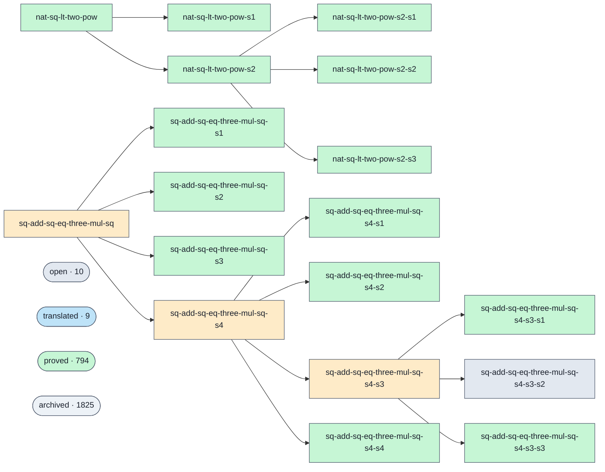

# Proof graph

<!-- GENERATED by `python3 -m tools.visualiser --write`. Do not edit by hand. -->

A visualiser for the swarm's proof graph (issue #371): every prove-goal, its status, the decomposition lineage that stacks sub-goals into their parents, and who solved each one. Click any node in the diagram to open its Lean statement.

> An **interactive** version — pan/zoom, click-to-detail panel, filterable table — is generated alongside this file at [`docs/proofs-contributors-visualisation.html`](proofs-contributors-visualisation.html) (open it locally or via GitHub Pages; the browser renders it, GitHub shows the source).

**2656 goals — 11 open · 3 blocked · 9 translated · 808 proved · 1825 archived.** 5 decomposition families shown below; standalone goals (no lineage) are folded into one summary cluster per status — the interactive page expands a cluster into its goals on click, and every goal is listed individually in the table.

Solving agent, PR and the GitHub user who merged it are resolved from the `prove(…)` merge commits (804 of 808 proved goals carry a per-goal prove-PR; the rest predate that convention and are left blank). The **solver** shows the recorded AISP login only — never guessed (ADR-023), so a goal with no recorded solver shows “—”; **merged by** is the GitHub user who landed the PR (who merged it, not who solved it), shown in its own column so the two are never conflated. The model comes from recorded provenance only.

## Dependency lineage

Edges run **parent → sub-goal**: a parent is discharged once its sub-goals are proved (the keystone pattern behind big targets — see ADR-031 / issue #365).

Legend: proved #c6f6d5 · open #e2e8f0 · blocked #feebc8 · flagged #fed7d7 · translated #bee3f8

## All goals

| Goal | Status | Difficulty | Agent | Solver / model | Merged by | PR | Proved |
| --- | --- | --- | --- | --- | --- | --- | --- |
| [`n4-plus-one-factor-over-sqrt-shift`](https://github.com/agenticsnz/unsorry/blob/main/goals/n4-plus-one-factor-over-sqrt-shift.lean) | open | 2 | — | — | — | — | — |
| [`quartic-x4-plus-x2-plus-one-dvd-by-minus-factor`](https://github.com/agenticsnz/unsorry/blob/main/goals/quartic-x4-plus-x2-plus-one-dvd-by-minus-factor.lean) | open | 2 | — | — | — | — | — |
| [`sextic-x6-plus-x3-plus-one-composite-shift`](https://github.com/agenticsnz/unsorry/blob/main/goals/sextic-x6-plus-x3-plus-one-composite-shift.lean) | open | 2 | — | — | — | — | — |
| [`sq-add-sq-eq-three-mul-sq-s4-s3-s2`](https://github.com/agenticsnz/unsorry/blob/main/goals/sq-add-sq-eq-three-mul-sq-s4-s3-s2.lean) | open | 1 | — | — | — | — | — |
| [`sum-range-succ-k-mul-choose-mul-two-pow-closed`](https://github.com/agenticsnz/unsorry/blob/main/goals/sum-range-succ-k-mul-choose-mul-two-pow-closed.lean) | open | 3 | — | — | — | — | — |
| [`sum-three-squares-zmod-eight-ne-seven`](https://github.com/agenticsnz/unsorry/blob/main/goals/sum-three-squares-zmod-eight-ne-seven.lean) | open | 3 | — | — | — | — | — |
| [`sum-three-squares-zmod-sixteen-ne-fifteen`](https://github.com/agenticsnz/unsorry/blob/main/goals/sum-three-squares-zmod-sixteen-ne-fifteen.lean) | open | 3 | — | — | — | — | — |
| [`sum-two-cubes-zmod-seven-mem`](https://github.com/agenticsnz/unsorry/blob/main/goals/sum-two-cubes-zmod-seven-mem.lean) | open | 3 | — | — | — | — | — |
| [`sum-two-squares-zmod-eight-ne-six`](https://github.com/agenticsnz/unsorry/blob/main/goals/sum-two-squares-zmod-eight-ne-six.lean) | open | 3 | — | — | — | — | — |
| [`sum-two-squares-zmod-four-ne-three`](https://github.com/agenticsnz/unsorry/blob/main/goals/sum-two-squares-zmod-four-ne-three.lean) | open | 2 | — | — | — | — | — |
| [`three-fourth-powers-zmod-sixteen-mem`](https://github.com/agenticsnz/unsorry/blob/main/goals/three-fourth-powers-zmod-sixteen-mem.lean) | open | 3 | — | — | — | — | — |
| [`sq-add-sq-eq-three-mul-sq`](https://github.com/agenticsnz/unsorry/blob/main/goals/sq-add-sq-eq-three-mul-sq.lean) | blocked | 4 | — | — | — | — | — |
| [`sq-add-sq-eq-three-mul-sq-s4`](https://github.com/agenticsnz/unsorry/blob/main/goals/sq-add-sq-eq-three-mul-sq-s4.lean) | blocked | 1 | — | — | — | — | — |
| [`sq-add-sq-eq-three-mul-sq-s4-s3`](https://github.com/agenticsnz/unsorry/blob/main/goals/sq-add-sq-eq-three-mul-sq-s4-s3.lean) | blocked | 1 | — | — | — | — | — |
| [`nat-add-assoc`](https://github.com/agenticsnz/unsorry/blob/main/goals/nat-add-assoc.lean) | translated | — | — | — | — | — | — |
| [`nat-add-zero`](https://github.com/agenticsnz/unsorry/blob/main/goals/nat-add-zero.lean) | translated | — | — | — | — | — | — |
| [`nat-le-refl`](https://github.com/agenticsnz/unsorry/blob/main/goals/nat-le-refl.lean) | translated | — | — | — | — | — | — |
| [`nat-le-trans`](https://github.com/agenticsnz/unsorry/blob/main/goals/nat-le-trans.lean) | translated | — | — | — | — | — | — |
| [`nat-leq-self`](https://github.com/agenticsnz/unsorry/blob/main/goals/nat-leq-self.lean) | translated | — | — | — | — | — | — |
| [`nat-mul-comm`](https://github.com/agenticsnz/unsorry/blob/main/goals/nat-mul-comm.lean) | translated | — | — | — | — | — | — |
| [`nat-mul-one`](https://github.com/agenticsnz/unsorry/blob/main/goals/nat-mul-one.lean) | translated | — | — | — | — | — | — |
| [`nat-product-order`](https://github.com/agenticsnz/unsorry/blob/main/goals/nat-product-order.lean) | translated | — | — | — | — | — | — |
| [`nat-zero-identity-add`](https://github.com/agenticsnz/unsorry/blob/main/goals/nat-zero-identity-add.lean) | translated | — | — | — | — | — | — |
| [`gbinom-ap-k4-step3-dvd`](https://github.com/agenticsnz/unsorry/blob/main/goals/gbinom-ap-k4-step3-dvd.lean) | proved | 3 | mac-158f | perttu · `sympy` | Perttu Isotalo | [#2697](https://github.com/agenticsnz/unsorry/pull/2697) | 2026-06-19 |
| [`gbinom-ap-k5-step2-dvd`](https://github.com/agenticsnz/unsorry/blob/main/goals/gbinom-ap-k5-step2-dvd.lean) | proved | 3 | mac-158f | perttu · `sympy` | Perttu Isotalo | [#2699](https://github.com/agenticsnz/unsorry/pull/2699) | 2026-06-19 |
| [`gbinom-ap-k6-step2-dvd`](https://github.com/agenticsnz/unsorry/blob/main/goals/gbinom-ap-k6-step2-dvd.lean) | proved | 3 | mac-158f | perttu · `sympy` | Perttu Isotalo | [#2700](https://github.com/agenticsnz/unsorry/pull/2700) | 2026-06-19 |
| [`gbinom-ap-k7-step2-dvd`](https://github.com/agenticsnz/unsorry/blob/main/goals/gbinom-ap-k7-step2-dvd.lean) | proved | 3 | mac-158f | perttu · `sympy` | Perttu Isotalo | [#2701](https://github.com/agenticsnz/unsorry/pull/2701) | 2026-06-19 |
| [`gbinom-ap-k8-step2-dvd`](https://github.com/agenticsnz/unsorry/blob/main/goals/gbinom-ap-k8-step2-dvd.lean) | proved | 3 | mac-158f | cgbarlow · `sympy` | Chris Barlow | [#2702](https://github.com/agenticsnz/unsorry/pull/2702) | 2026-06-19 |
| [`gbinom-ap-k9-step2-dvd`](https://github.com/agenticsnz/unsorry/blob/main/goals/gbinom-ap-k9-step2-dvd.lean) | proved | 3 | mac-158f | ohdearquant · `sympy` | OceanLi | [#2703](https://github.com/agenticsnz/unsorry/pull/2703) | 2026-06-19 |
| [`gbinom-consec-four-fact-dvd`](https://github.com/agenticsnz/unsorry/blob/main/goals/gbinom-consec-four-fact-dvd.lean) | proved | 3 | mac-158f | perttu · `sympy` | Perttu Isotalo | [#2692](https://github.com/agenticsnz/unsorry/pull/2692) | 2026-06-19 |
| [`gbinom-consec-seven-fact-dvd`](https://github.com/agenticsnz/unsorry/blob/main/goals/gbinom-consec-seven-fact-dvd.lean) | proved | 3 | mac-158f | cgbarlow · `sympy` | Chris Barlow | [#2693](https://github.com/agenticsnz/unsorry/pull/2693) | 2026-06-19 |
| [`gbinom-consec-six-fact-dvd`](https://github.com/agenticsnz/unsorry/blob/main/goals/gbinom-consec-six-fact-dvd.lean) | proved | 3 | mac-158f | cgbarlow · `sympy` | Chris Barlow | [#2694](https://github.com/agenticsnz/unsorry/pull/2694) | 2026-06-19 |
| [`gbinom-falling-five-fact-dvd`](https://github.com/agenticsnz/unsorry/blob/main/goals/gbinom-falling-five-fact-dvd.lean) | proved | 3 | mac-158f | cgbarlow · `sympy` | Chris Barlow | [#2695](https://github.com/agenticsnz/unsorry/pull/2695) | 2026-06-19 |
| [`gbinom-falling-four-fact-dvd`](https://github.com/agenticsnz/unsorry/blob/main/goals/gbinom-falling-four-fact-dvd.lean) | proved | 3 | mac-158f | cgbarlow · `sympy` | Chris Barlow | [#2696](https://github.com/agenticsnz/unsorry/pull/2696) | 2026-06-19 |
| [`gbinom-falling-seven-fact-dvd`](https://github.com/agenticsnz/unsorry/blob/main/goals/gbinom-falling-seven-fact-dvd.lean) | proved | 3 | mac-158f | ohdearquant · `sympy` | OceanLi | [#2704](https://github.com/agenticsnz/unsorry/pull/2704) | 2026-06-19 |
| [`gbinom-falling-six-fact-dvd`](https://github.com/agenticsnz/unsorry/blob/main/goals/gbinom-falling-six-fact-dvd.lean) | proved | 3 | mac-158f | perttu · `sympy` | Perttu Isotalo | [#2705](https://github.com/agenticsnz/unsorry/pull/2705) | 2026-06-19 |
| [`gbinom-falling-three-fact-dvd`](https://github.com/agenticsnz/unsorry/blob/main/goals/gbinom-falling-three-fact-dvd.lean) | proved | 3 | mac-158f | ohdearquant · `sympy` | OceanLi | [#2706](https://github.com/agenticsnz/unsorry/pull/2706) | 2026-06-19 |
| [`gbinom-poly-nmul2mulnp1mul2mulnm1`](https://github.com/agenticsnz/unsorry/blob/main/goals/gbinom-poly-nmul2mulnp1mul2mulnm1.lean) | proved | 3 | mac-158f | ohdearquant · `sympy` | OceanLi | [#2707](https://github.com/agenticsnz/unsorry/pull/2707) | 2026-06-19 |
| [`gbinom-poly-nmulnp2mulnp4`](https://github.com/agenticsnz/unsorry/blob/main/goals/gbinom-poly-nmulnp2mulnp4.lean) | proved | 3 | mac-158f | ohdearquant · `sympy` | OceanLi | [#2708](https://github.com/agenticsnz/unsorry/pull/2708) | 2026-06-19 |
| [`gbinom-poly-nmulnp4mulnp8`](https://github.com/agenticsnz/unsorry/blob/main/goals/gbinom-poly-nmulnp4mulnp8.lean) | proved | 3 | mac-158f | ohdearquant · `sympy` | OceanLi | [#2709](https://github.com/agenticsnz/unsorry/pull/2709) | 2026-06-19 |
| [`gbinom-poly-nmulnpow2m7`](https://github.com/agenticsnz/unsorry/blob/main/goals/gbinom-poly-nmulnpow2m7.lean) | proved | 3 | mac-158f | ohdearquant · `sympy` | OceanLi | [#2710](https://github.com/agenticsnz/unsorry/pull/2710) | 2026-06-19 |
| [`gbinom-poly-nmulnpow2p2`](https://github.com/agenticsnz/unsorry/blob/main/goals/gbinom-poly-nmulnpow2p2.lean) | proved | 3 | mac-158f | ohdearquant · `sympy` | OceanLi | [#2711](https://github.com/agenticsnz/unsorry/pull/2711) | 2026-06-19 |
| [`gbinom-poly-np1mulnp2mul2mulnp3`](https://github.com/agenticsnz/unsorry/blob/main/goals/gbinom-poly-np1mulnp2mul2mulnp3.lean) | proved | 3 | mac-158f | ohdearquant · `sympy` | OceanLi | [#2713](https://github.com/agenticsnz/unsorry/pull/2713) | 2026-06-19 |
| [`gbinom-sp-0-1-4-5`](https://github.com/agenticsnz/unsorry/blob/main/goals/gbinom-sp-0-1-4-5.lean) | proved | 3 | mac-158f | ohdearquant · `sympy` | OceanLi | [#2714](https://github.com/agenticsnz/unsorry/pull/2714) | 2026-06-19 |
| [`gbinom-sp-0-1-5`](https://github.com/agenticsnz/unsorry/blob/main/goals/gbinom-sp-0-1-5.lean) | proved | 3 | mac-158f | ohdearquant · `sympy` | OceanLi | [#2715](https://github.com/agenticsnz/unsorry/pull/2715) | 2026-06-19 |
| [`gbinom-sp-0-1-8`](https://github.com/agenticsnz/unsorry/blob/main/goals/gbinom-sp-0-1-8.lean) | proved | 3 | mac-158f | perttu · `sympy` | Perttu Isotalo | [#2716](https://github.com/agenticsnz/unsorry/pull/2716) | 2026-06-19 |
| [`gbinom-sp-0-2-3-5`](https://github.com/agenticsnz/unsorry/blob/main/goals/gbinom-sp-0-2-3-5.lean) | proved | 3 | mac-158f | ohdearquant · `sympy` | OceanLi | [#2717](https://github.com/agenticsnz/unsorry/pull/2717) | 2026-06-19 |
| [`gbinom-sp-0-2-7`](https://github.com/agenticsnz/unsorry/blob/main/goals/gbinom-sp-0-2-7.lean) | proved | 3 | mac-158f | ohdearquant · `sympy` | OceanLi | [#2718](https://github.com/agenticsnz/unsorry/pull/2718) | 2026-06-19 |
| [`geud-30-pow-69-sub-self`](https://github.com/agenticsnz/unsorry/blob/main/goals/geud-30-pow-69-sub-self.lean) | proved | 3 | mac-158f | perttu · `sympy` | Perttu Isotalo | [#2690](https://github.com/agenticsnz/unsorry/pull/2690) | 2026-06-19 |
| [`geud-30-pow-77-sub-self`](https://github.com/agenticsnz/unsorry/blob/main/goals/geud-30-pow-77-sub-self.lean) | proved | 3 | mac-158f | perttu · `sympy` | Perttu Isotalo | [#2691](https://github.com/agenticsnz/unsorry/pull/2691) | 2026-06-19 |
| [`geud-30-pow-five-sub-self`](https://github.com/agenticsnz/unsorry/blob/main/goals/geud-30-pow-five-sub-self.lean) | proved | 3 | mac-158f | ohdearquant · `sympy` | OceanLi | [#2719](https://github.com/agenticsnz/unsorry/pull/2719) | 2026-06-19 |
| [`geud-42-pow-seven-sub-self`](https://github.com/agenticsnz/unsorry/blob/main/goals/geud-42-pow-seven-sub-self.lean) | proved | 3 | mac-158f | ohdearquant · `sympy` | OceanLi | [#2722](https://github.com/agenticsnz/unsorry/pull/2722) | 2026-06-19 |
| [`geud-6-pow-thirtyfive-sub-self`](https://github.com/agenticsnz/unsorry/blob/main/goals/geud-6-pow-thirtyfive-sub-self.lean) | proved | 3 | mac-158f | ohdearquant · `sympy` | OceanLi | [#2723](https://github.com/agenticsnz/unsorry/pull/2723) | 2026-06-19 |
| [`geud-6-pow-thirtynine-sub-self`](https://github.com/agenticsnz/unsorry/blob/main/goals/geud-6-pow-thirtynine-sub-self.lean) | proved | 3 | mac-158f | ohdearquant · `sympy` | OceanLi | [#2724](https://github.com/agenticsnz/unsorry/pull/2724) | 2026-06-19 |
| [`geud-6-pow-twentyseven-sub-self`](https://github.com/agenticsnz/unsorry/blob/main/goals/geud-6-pow-twentyseven-sub-self.lean) | proved | 3 | mac-158f | ohdearquant · `sympy` | OceanLi | [#2725](https://github.com/agenticsnz/unsorry/pull/2725) | 2026-06-19 |
| [`geud-66-pow-171-sub-self`](https://github.com/agenticsnz/unsorry/blob/main/goals/geud-66-pow-171-sub-self.lean) | proved | 3 | mac-158f | ohdearquant · `sympy` | OceanLi | [#2726](https://github.com/agenticsnz/unsorry/pull/2726) | 2026-06-19 |
| [`gpow-diff-eleven-pow-twenty`](https://github.com/agenticsnz/unsorry/blob/main/goals/gpow-diff-eleven-pow-twenty.lean) | proved | 1 | mac-158f | perttu · `sympy` | Perttu Isotalo | [#2771](https://github.com/agenticsnz/unsorry/pull/2771) | 2026-06-19 |
| [`gpow-diff-twelve-pow-eight`](https://github.com/agenticsnz/unsorry/blob/main/goals/gpow-diff-twelve-pow-eight.lean) | proved | 1 | mac-158f | cgbarlow · `sympy` | Chris Barlow | [#2891](https://github.com/agenticsnz/unsorry/pull/2891) | 2026-06-19 |
| [`gpow-diff-twelve-pow-eighteen`](https://github.com/agenticsnz/unsorry/blob/main/goals/gpow-diff-twelve-pow-eighteen.lean) | proved | 1 | mac-158f | cgbarlow · `sympy` | Chris Barlow | [#2892](https://github.com/agenticsnz/unsorry/pull/2892) | 2026-06-19 |
| [`gpow-diff-twelve-pow-eleven`](https://github.com/agenticsnz/unsorry/blob/main/goals/gpow-diff-twelve-pow-eleven.lean) | proved | 1 | mac-158f | cgbarlow · `sympy` | Chris Barlow | [#2893](https://github.com/agenticsnz/unsorry/pull/2893) | 2026-06-19 |
| [`gpow-diff-twelve-pow-fifteen`](https://github.com/agenticsnz/unsorry/blob/main/goals/gpow-diff-twelve-pow-fifteen.lean) | proved | 1 | mac-158f | cgbarlow · `sympy` | Chris Barlow | [#2894](https://github.com/agenticsnz/unsorry/pull/2894) | 2026-06-19 |
| [`gpow-diff-twelve-pow-five`](https://github.com/agenticsnz/unsorry/blob/main/goals/gpow-diff-twelve-pow-five.lean) | proved | 1 | mac-158f | cgbarlow · `sympy` | Chris Barlow | [#2895](https://github.com/agenticsnz/unsorry/pull/2895) | 2026-06-19 |
| [`gpow-diff-twelve-pow-four`](https://github.com/agenticsnz/unsorry/blob/main/goals/gpow-diff-twelve-pow-four.lean) | proved | 1 | mac-158f | cgbarlow · `sympy` | Chris Barlow | [#2897](https://github.com/agenticsnz/unsorry/pull/2897) | 2026-06-19 |
| [`gpow-diff-twelve-pow-fourteen`](https://github.com/agenticsnz/unsorry/blob/main/goals/gpow-diff-twelve-pow-fourteen.lean) | proved | 1 | mac-158f | perttu · `sympy` | Perttu Isotalo | [#2898](https://github.com/agenticsnz/unsorry/pull/2898) | 2026-06-19 |
| [`gpow-diff-twelve-pow-nine`](https://github.com/agenticsnz/unsorry/blob/main/goals/gpow-diff-twelve-pow-nine.lean) | proved | 1 | mac-158f | cgbarlow · `sympy` | Chris Barlow | [#2899](https://github.com/agenticsnz/unsorry/pull/2899) | 2026-06-19 |
| [`gpow-diff-twelve-pow-nineteen`](https://github.com/agenticsnz/unsorry/blob/main/goals/gpow-diff-twelve-pow-nineteen.lean) | proved | 1 | mac-158f | perttu · `sympy` | Perttu Isotalo | [#2900](https://github.com/agenticsnz/unsorry/pull/2900) | 2026-06-19 |
| [`gpow-diff-twelve-pow-seven`](https://github.com/agenticsnz/unsorry/blob/main/goals/gpow-diff-twelve-pow-seven.lean) | proved | 1 | mac-158f | cgbarlow · `sympy` | Chris Barlow | [#2901](https://github.com/agenticsnz/unsorry/pull/2901) | 2026-06-19 |
| [`gpow-diff-twelve-pow-seventeen`](https://github.com/agenticsnz/unsorry/blob/main/goals/gpow-diff-twelve-pow-seventeen.lean) | proved | 1 | mac-158f | cgbarlow · `sympy` | Chris Barlow | [#2903](https://github.com/agenticsnz/unsorry/pull/2903) | 2026-06-19 |
| [`gpow-diff-twelve-pow-six`](https://github.com/agenticsnz/unsorry/blob/main/goals/gpow-diff-twelve-pow-six.lean) | proved | 1 | mac-158f | perttu · `sympy` | Perttu Isotalo | [#2904](https://github.com/agenticsnz/unsorry/pull/2904) | 2026-06-19 |
| [`gpow-diff-twelve-pow-sixteen`](https://github.com/agenticsnz/unsorry/blob/main/goals/gpow-diff-twelve-pow-sixteen.lean) | proved | 1 | mac-158f | perttu · `sympy` | Perttu Isotalo | [#2905](https://github.com/agenticsnz/unsorry/pull/2905) | 2026-06-20 |
| [`gpow-diff-twelve-pow-ten`](https://github.com/agenticsnz/unsorry/blob/main/goals/gpow-diff-twelve-pow-ten.lean) | proved | 1 | mac-158f | cgbarlow · `sympy` | Chris Barlow | [#2906](https://github.com/agenticsnz/unsorry/pull/2906) | 2026-06-20 |
| [`gpow-diff-twelve-pow-thirteen`](https://github.com/agenticsnz/unsorry/blob/main/goals/gpow-diff-twelve-pow-thirteen.lean) | proved | 1 | mac-158f | perttu · `sympy` | Perttu Isotalo | [#2907](https://github.com/agenticsnz/unsorry/pull/2907) | 2026-06-20 |
| [`gpow-diff-twelve-pow-three`](https://github.com/agenticsnz/unsorry/blob/main/goals/gpow-diff-twelve-pow-three.lean) | proved | 1 | mac-158f | cgbarlow · `sympy` | Chris Barlow | [#2908](https://github.com/agenticsnz/unsorry/pull/2908) | 2026-06-20 |
| [`gpow-diff-twelve-pow-twelve`](https://github.com/agenticsnz/unsorry/blob/main/goals/gpow-diff-twelve-pow-twelve.lean) | proved | 1 | mac-158f | perttu · `sympy` | Perttu Isotalo | [#2909](https://github.com/agenticsnz/unsorry/pull/2909) | 2026-06-20 |
| [`gpow-diff-twelve-pow-twenty`](https://github.com/agenticsnz/unsorry/blob/main/goals/gpow-diff-twelve-pow-twenty.lean) | proved | 1 | mac-158f | cgbarlow · `sympy` | Chris Barlow | [#2910](https://github.com/agenticsnz/unsorry/pull/2910) | 2026-06-20 |
| [`gpow-diff-twelve-pow-two`](https://github.com/agenticsnz/unsorry/blob/main/goals/gpow-diff-twelve-pow-two.lean) | proved | 1 | mac-158f | perttu · `sympy` | Perttu Isotalo | [#2911](https://github.com/agenticsnz/unsorry/pull/2911) | 2026-06-20 |
| [`gpow-sum-eight-pow-eighteen`](https://github.com/agenticsnz/unsorry/blob/main/goals/gpow-sum-eight-pow-eighteen.lean) | proved | 1 | mac-158f | perttu · `sympy` | Perttu Isotalo | [#2924](https://github.com/agenticsnz/unsorry/pull/2924) | 2026-06-20 |
| [`gpow-sum-eight-pow-eleven`](https://github.com/agenticsnz/unsorry/blob/main/goals/gpow-sum-eight-pow-eleven.lean) | proved | 1 | mac-158f | cgbarlow · `sympy` | Chris Barlow | [#2926](https://github.com/agenticsnz/unsorry/pull/2926) | 2026-06-20 |
| [`gpow-sum-eight-pow-fifteen`](https://github.com/agenticsnz/unsorry/blob/main/goals/gpow-sum-eight-pow-fifteen.lean) | proved | 1 | mac-158f | perttu · `sympy` | Perttu Isotalo | [#2927](https://github.com/agenticsnz/unsorry/pull/2927) | 2026-06-20 |
| [`gpow-sum-eight-pow-fourteen`](https://github.com/agenticsnz/unsorry/blob/main/goals/gpow-sum-eight-pow-fourteen.lean) | proved | 1 | mac-158f | cgbarlow · `sympy` | Chris Barlow | [#2928](https://github.com/agenticsnz/unsorry/pull/2928) | 2026-06-20 |
| [`gpow-sum-eight-pow-nineteen`](https://github.com/agenticsnz/unsorry/blob/main/goals/gpow-sum-eight-pow-nineteen.lean) | proved | 1 | mac-158f | perttu · `sympy` | Perttu Isotalo | [#2929](https://github.com/agenticsnz/unsorry/pull/2929) | 2026-06-20 |
| [`gpow-sum-eight-pow-seventeen`](https://github.com/agenticsnz/unsorry/blob/main/goals/gpow-sum-eight-pow-seventeen.lean) | proved | 1 | mac-158f | cgbarlow · `sympy` | Chris Barlow | [#2930](https://github.com/agenticsnz/unsorry/pull/2930) | 2026-06-20 |
| [`gpow-sum-eight-pow-sixteen`](https://github.com/agenticsnz/unsorry/blob/main/goals/gpow-sum-eight-pow-sixteen.lean) | proved | 1 | mac-158f | perttu · `sympy` | Perttu Isotalo | [#2931](https://github.com/agenticsnz/unsorry/pull/2931) | 2026-06-20 |
| [`gpow-sum-eight-pow-ten`](https://github.com/agenticsnz/unsorry/blob/main/goals/gpow-sum-eight-pow-ten.lean) | proved | 1 | mac-158f | cgbarlow · `sympy` | Chris Barlow | [#2932](https://github.com/agenticsnz/unsorry/pull/2932) | 2026-06-20 |
| [`gpow-sum-eight-pow-thirteen`](https://github.com/agenticsnz/unsorry/blob/main/goals/gpow-sum-eight-pow-thirteen.lean) | proved | 1 | mac-158f | perttu · `sympy` | Perttu Isotalo | [#2933](https://github.com/agenticsnz/unsorry/pull/2933) | 2026-06-20 |
| [`gpow-sum-eight-pow-twelve`](https://github.com/agenticsnz/unsorry/blob/main/goals/gpow-sum-eight-pow-twelve.lean) | proved | 1 | mac-158f | cgbarlow · `sympy` | Chris Barlow | [#2934](https://github.com/agenticsnz/unsorry/pull/2934) | 2026-06-20 |
| [`gpow-sum-eight-pow-twenty`](https://github.com/agenticsnz/unsorry/blob/main/goals/gpow-sum-eight-pow-twenty.lean) | proved | 1 | mac-158f | cgbarlow · `sympy` | Chris Barlow | [#2935](https://github.com/agenticsnz/unsorry/pull/2935) | 2026-06-20 |
| [`gpow-sum-eleven-pow-eight`](https://github.com/agenticsnz/unsorry/blob/main/goals/gpow-sum-eleven-pow-eight.lean) | proved | 1 | mac-158f | cgbarlow · `sympy` | Chris Barlow | [#2936](https://github.com/agenticsnz/unsorry/pull/2936) | 2026-06-20 |
| [`gpow-sum-eleven-pow-eighteen`](https://github.com/agenticsnz/unsorry/blob/main/goals/gpow-sum-eleven-pow-eighteen.lean) | proved | 1 | mac-158f | cgbarlow · `sympy` | Chris Barlow | [#2937](https://github.com/agenticsnz/unsorry/pull/2937) | 2026-06-20 |
| [`gpow-sum-eleven-pow-eleven`](https://github.com/agenticsnz/unsorry/blob/main/goals/gpow-sum-eleven-pow-eleven.lean) | proved | 1 | mac-158f | cgbarlow · `sympy` | Chris Barlow | [#2938](https://github.com/agenticsnz/unsorry/pull/2938) | 2026-06-20 |
| [`gpow-sum-eleven-pow-fifteen`](https://github.com/agenticsnz/unsorry/blob/main/goals/gpow-sum-eleven-pow-fifteen.lean) | proved | 1 | mac-158f | cgbarlow · `sympy` | Chris Barlow | [#2939](https://github.com/agenticsnz/unsorry/pull/2939) | 2026-06-20 |
| [`gpow-sum-eleven-pow-five`](https://github.com/agenticsnz/unsorry/blob/main/goals/gpow-sum-eleven-pow-five.lean) | proved | 1 | mac-158f | cgbarlow · `sympy` | Chris Barlow | [#2940](https://github.com/agenticsnz/unsorry/pull/2940) | 2026-06-20 |
| [`gpow-sum-eleven-pow-four`](https://github.com/agenticsnz/unsorry/blob/main/goals/gpow-sum-eleven-pow-four.lean) | proved | 1 | mac-158f | cgbarlow · `sympy` | Chris Barlow | [#2942](https://github.com/agenticsnz/unsorry/pull/2942) | 2026-06-20 |
| [`gpow-sum-eleven-pow-fourteen`](https://github.com/agenticsnz/unsorry/blob/main/goals/gpow-sum-eleven-pow-fourteen.lean) | proved | 1 | mac-158f | perttu · `sympy` | Perttu Isotalo | [#2943](https://github.com/agenticsnz/unsorry/pull/2943) | 2026-06-20 |
| [`gpow-sum-eleven-pow-nine`](https://github.com/agenticsnz/unsorry/blob/main/goals/gpow-sum-eleven-pow-nine.lean) | proved | 1 | mac-158f | cgbarlow · `sympy` | Chris Barlow | [#2944](https://github.com/agenticsnz/unsorry/pull/2944) | 2026-06-20 |
| [`gpow-sum-eleven-pow-nineteen`](https://github.com/agenticsnz/unsorry/blob/main/goals/gpow-sum-eleven-pow-nineteen.lean) | proved | 1 | mac-158f | perttu · `sympy` | Perttu Isotalo | [#2945](https://github.com/agenticsnz/unsorry/pull/2945) | 2026-06-20 |
| [`gpow-sum-eleven-pow-seven`](https://github.com/agenticsnz/unsorry/blob/main/goals/gpow-sum-eleven-pow-seven.lean) | proved | 1 | mac-158f | cgbarlow · `sympy` | Chris Barlow | [#2946](https://github.com/agenticsnz/unsorry/pull/2946) | 2026-06-20 |
| [`gpow-sum-eleven-pow-seventeen`](https://github.com/agenticsnz/unsorry/blob/main/goals/gpow-sum-eleven-pow-seventeen.lean) | proved | 1 | mac-158f | perttu · `sympy` | Perttu Isotalo | [#2947](https://github.com/agenticsnz/unsorry/pull/2947) | 2026-06-20 |
| [`gpow-sum-eleven-pow-six`](https://github.com/agenticsnz/unsorry/blob/main/goals/gpow-sum-eleven-pow-six.lean) | proved | 1 | mac-158f | cgbarlow · `sympy` | Chris Barlow | [#2948](https://github.com/agenticsnz/unsorry/pull/2948) | 2026-06-20 |
| [`gpow-sum-eleven-pow-sixteen`](https://github.com/agenticsnz/unsorry/blob/main/goals/gpow-sum-eleven-pow-sixteen.lean) | proved | 1 | mac-158f | perttu · `sympy` | Perttu Isotalo | [#2949](https://github.com/agenticsnz/unsorry/pull/2949) | 2026-06-20 |
| [`gpow-sum-eleven-pow-ten`](https://github.com/agenticsnz/unsorry/blob/main/goals/gpow-sum-eleven-pow-ten.lean) | proved | 1 | mac-158f | perttu · `sympy` | Perttu Isotalo | [#2951](https://github.com/agenticsnz/unsorry/pull/2951) | 2026-06-20 |
| [`gpow-sum-eleven-pow-thirteen`](https://github.com/agenticsnz/unsorry/blob/main/goals/gpow-sum-eleven-pow-thirteen.lean) | proved | 1 | mac-158f | cgbarlow · `sympy` | Chris Barlow | [#2952](https://github.com/agenticsnz/unsorry/pull/2952) | 2026-06-20 |
| [`gpow-sum-eleven-pow-three`](https://github.com/agenticsnz/unsorry/blob/main/goals/gpow-sum-eleven-pow-three.lean) | proved | 1 | mac-158f | cgbarlow · `sympy` | Chris Barlow | [#2954](https://github.com/agenticsnz/unsorry/pull/2954) | 2026-06-20 |
| [`gpow-sum-eleven-pow-twelve`](https://github.com/agenticsnz/unsorry/blob/main/goals/gpow-sum-eleven-pow-twelve.lean) | proved | 1 | mac-158f | perttu · `sympy` | Perttu Isotalo | [#2955](https://github.com/agenticsnz/unsorry/pull/2955) | 2026-06-20 |
| [`gpow-sum-eleven-pow-twenty`](https://github.com/agenticsnz/unsorry/blob/main/goals/gpow-sum-eleven-pow-twenty.lean) | proved | 1 | mac-158f | cgbarlow · `sympy` | Chris Barlow | [#2956](https://github.com/agenticsnz/unsorry/pull/2956) | 2026-06-20 |
| [`gpow-sum-eleven-pow-two`](https://github.com/agenticsnz/unsorry/blob/main/goals/gpow-sum-eleven-pow-two.lean) | proved | 1 | mac-158f | perttu · `sympy` | Perttu Isotalo | [#2957](https://github.com/agenticsnz/unsorry/pull/2957) | 2026-06-20 |
| [`gpow-sum-five-pow-eighteen`](https://github.com/agenticsnz/unsorry/blob/main/goals/gpow-sum-five-pow-eighteen.lean) | proved | 1 | mac-158f | cgbarlow · `sympy` | Chris Barlow | [#2958](https://github.com/agenticsnz/unsorry/pull/2958) | 2026-06-20 |
| [`gpow-sum-five-pow-eleven`](https://github.com/agenticsnz/unsorry/blob/main/goals/gpow-sum-five-pow-eleven.lean) | proved | 1 | mac-158f | perttu · `sympy` | Perttu Isotalo | [#2960](https://github.com/agenticsnz/unsorry/pull/2960) | 2026-06-20 |
| [`gpow-sum-five-pow-fifteen`](https://github.com/agenticsnz/unsorry/blob/main/goals/gpow-sum-five-pow-fifteen.lean) | proved | 1 | mac-158f | cgbarlow · `sympy` | Chris Barlow | [#2961](https://github.com/agenticsnz/unsorry/pull/2961) | 2026-06-20 |
| [`gpow-sum-five-pow-fourteen`](https://github.com/agenticsnz/unsorry/blob/main/goals/gpow-sum-five-pow-fourteen.lean) | proved | 1 | mac-158f | cgbarlow · `sympy` | Chris Barlow | [#2963](https://github.com/agenticsnz/unsorry/pull/2963) | 2026-06-20 |
| [`gpow-sum-five-pow-nineteen`](https://github.com/agenticsnz/unsorry/blob/main/goals/gpow-sum-five-pow-nineteen.lean) | proved | 1 | mac-158f | perttu · `sympy` | Perttu Isotalo | [#2964](https://github.com/agenticsnz/unsorry/pull/2964) | 2026-06-20 |
| [`gpow-sum-five-pow-seventeen`](https://github.com/agenticsnz/unsorry/blob/main/goals/gpow-sum-five-pow-seventeen.lean) | proved | 1 | mac-158f | cgbarlow · `sympy` | Chris Barlow | [#2965](https://github.com/agenticsnz/unsorry/pull/2965) | 2026-06-20 |
| [`gpow-sum-five-pow-sixteen`](https://github.com/agenticsnz/unsorry/blob/main/goals/gpow-sum-five-pow-sixteen.lean) | proved | 1 | mac-158f | cgbarlow · `sympy` | Chris Barlow | [#2967](https://github.com/agenticsnz/unsorry/pull/2967) | 2026-06-20 |
| [`gpow-sum-five-pow-ten`](https://github.com/agenticsnz/unsorry/blob/main/goals/gpow-sum-five-pow-ten.lean) | proved | 1 | mac-158f | perttu · `sympy` | Perttu Isotalo | [#2969](https://github.com/agenticsnz/unsorry/pull/2969) | 2026-06-20 |
| [`gpow-sum-five-pow-thirteen`](https://github.com/agenticsnz/unsorry/blob/main/goals/gpow-sum-five-pow-thirteen.lean) | proved | 1 | mac-158f | cgbarlow · `sympy` | Chris Barlow | [#2970](https://github.com/agenticsnz/unsorry/pull/2970) | 2026-06-20 |
| [`gpow-sum-five-pow-twelve`](https://github.com/agenticsnz/unsorry/blob/main/goals/gpow-sum-five-pow-twelve.lean) | proved | 1 | mac-158f | cgbarlow · `sympy` | Chris Barlow | [#2972](https://github.com/agenticsnz/unsorry/pull/2972) | 2026-06-20 |
| [`gpow-sum-five-pow-twenty`](https://github.com/agenticsnz/unsorry/blob/main/goals/gpow-sum-five-pow-twenty.lean) | proved | 1 | mac-158f | perttu · `sympy` | Perttu Isotalo | [#2973](https://github.com/agenticsnz/unsorry/pull/2973) | 2026-06-20 |
| [`gpow-sum-four-pow-eighteen`](https://github.com/agenticsnz/unsorry/blob/main/goals/gpow-sum-four-pow-eighteen.lean) | proved | 1 | mac-158f | perttu · `sympy` | Perttu Isotalo | [#2977](https://github.com/agenticsnz/unsorry/pull/2977) | 2026-06-20 |
| [`gpow-sum-four-pow-eleven`](https://github.com/agenticsnz/unsorry/blob/main/goals/gpow-sum-four-pow-eleven.lean) | proved | 1 | mac-158f | cgbarlow · `sympy` | Chris Barlow | [#2978](https://github.com/agenticsnz/unsorry/pull/2978) | 2026-06-20 |
| [`gpow-sum-four-pow-fifteen`](https://github.com/agenticsnz/unsorry/blob/main/goals/gpow-sum-four-pow-fifteen.lean) | proved | 1 | mac-158f | perttu · `sympy` | Perttu Isotalo | [#2979](https://github.com/agenticsnz/unsorry/pull/2979) | 2026-06-20 |
| [`gpow-sum-four-pow-fourteen`](https://github.com/agenticsnz/unsorry/blob/main/goals/gpow-sum-four-pow-fourteen.lean) | proved | 1 | mac-158f | perttu · `sympy` | Perttu Isotalo | [#2983](https://github.com/agenticsnz/unsorry/pull/2983) | 2026-06-20 |
| [`gpow-sum-four-pow-nineteen`](https://github.com/agenticsnz/unsorry/blob/main/goals/gpow-sum-four-pow-nineteen.lean) | proved | 1 | mac-158f | perttu · `sympy` | Perttu Isotalo | [#2986](https://github.com/agenticsnz/unsorry/pull/2986) | 2026-06-20 |
| [`gpow-sum-four-pow-seventeen`](https://github.com/agenticsnz/unsorry/blob/main/goals/gpow-sum-four-pow-seventeen.lean) | proved | 1 | mac-158f | perttu · `sympy` | Perttu Isotalo | [#2989](https://github.com/agenticsnz/unsorry/pull/2989) | 2026-06-20 |
| [`gpow-sum-four-pow-sixteen`](https://github.com/agenticsnz/unsorry/blob/main/goals/gpow-sum-four-pow-sixteen.lean) | proved | 1 | mac-158f | perttu · `sympy` | Perttu Isotalo | [#2991](https://github.com/agenticsnz/unsorry/pull/2991) | 2026-06-20 |
| [`gpow-sum-four-pow-ten`](https://github.com/agenticsnz/unsorry/blob/main/goals/gpow-sum-four-pow-ten.lean) | proved | 1 | mac-158f | perttu · `sympy` | Perttu Isotalo | [#2992](https://github.com/agenticsnz/unsorry/pull/2992) | 2026-06-20 |
| [`gpow-sum-four-pow-thirteen`](https://github.com/agenticsnz/unsorry/blob/main/goals/gpow-sum-four-pow-thirteen.lean) | proved | 1 | mac-158f | cgbarlow · `sympy` | Chris Barlow | [#2993](https://github.com/agenticsnz/unsorry/pull/2993) | 2026-06-20 |
| [`gpow-sum-four-pow-twelve`](https://github.com/agenticsnz/unsorry/blob/main/goals/gpow-sum-four-pow-twelve.lean) | proved | 1 | mac-158f | cgbarlow · `sympy` | Chris Barlow | [#2995](https://github.com/agenticsnz/unsorry/pull/2995) | 2026-06-20 |
| [`gpow-sum-four-pow-twenty`](https://github.com/agenticsnz/unsorry/blob/main/goals/gpow-sum-four-pow-twenty.lean) | proved | 1 | mac-158f | perttu · `sympy` | Perttu Isotalo | [#2996](https://github.com/agenticsnz/unsorry/pull/2996) | 2026-06-20 |
| [`gpow-sum-nine-pow-eight`](https://github.com/agenticsnz/unsorry/blob/main/goals/gpow-sum-nine-pow-eight.lean) | proved | 1 | mac-158f | perttu · `sympy` | Perttu Isotalo | [#2998](https://github.com/agenticsnz/unsorry/pull/2998) | 2026-06-20 |
| [`gpow-sum-nine-pow-eighteen`](https://github.com/agenticsnz/unsorry/blob/main/goals/gpow-sum-nine-pow-eighteen.lean) | proved | 1 | mac-158f | cgbarlow · `sympy` | Chris Barlow | [#2999](https://github.com/agenticsnz/unsorry/pull/2999) | 2026-06-20 |
| [`gpow-sum-nine-pow-eleven`](https://github.com/agenticsnz/unsorry/blob/main/goals/gpow-sum-nine-pow-eleven.lean) | proved | 1 | mac-158f | perttu · `sympy` | Perttu Isotalo | [#3000](https://github.com/agenticsnz/unsorry/pull/3000) | 2026-06-20 |
| [`gpow-sum-nine-pow-fifteen`](https://github.com/agenticsnz/unsorry/blob/main/goals/gpow-sum-nine-pow-fifteen.lean) | proved | 1 | mac-158f | cgbarlow · `sympy` | Chris Barlow | [#3001](https://github.com/agenticsnz/unsorry/pull/3001) | 2026-06-20 |
| [`gpow-sum-nine-pow-five`](https://github.com/agenticsnz/unsorry/blob/main/goals/gpow-sum-nine-pow-five.lean) | proved | 1 | mac-158f | perttu · `sympy` | Perttu Isotalo | [#3017](https://github.com/agenticsnz/unsorry/pull/3017) | 2026-06-20 |
| [`gpow-sum-nine-pow-four`](https://github.com/agenticsnz/unsorry/blob/main/goals/gpow-sum-nine-pow-four.lean) | proved | 1 | mac-158f | cgbarlow · `sympy` | Chris Barlow | [#3026](https://github.com/agenticsnz/unsorry/pull/3026) | 2026-06-20 |
| [`gpow-sum-nine-pow-fourteen`](https://github.com/agenticsnz/unsorry/blob/main/goals/gpow-sum-nine-pow-fourteen.lean) | proved | 1 | mac-158f | perttu · `sympy` | Perttu Isotalo | [#3048](https://github.com/agenticsnz/unsorry/pull/3048) | 2026-06-20 |
| [`gpow-sum-nine-pow-nine`](https://github.com/agenticsnz/unsorry/blob/main/goals/gpow-sum-nine-pow-nine.lean) | proved | 1 | mac-158f | cgbarlow · `sympy` | Chris Barlow | [#3063](https://github.com/agenticsnz/unsorry/pull/3063) | 2026-06-20 |
| [`gpow-sum-nine-pow-nineteen`](https://github.com/agenticsnz/unsorry/blob/main/goals/gpow-sum-nine-pow-nineteen.lean) | proved | 1 | mac-158f | cgbarlow · `sympy` | Chris Barlow | [#3064](https://github.com/agenticsnz/unsorry/pull/3064) | 2026-06-20 |
| [`gpow-sum-nine-pow-seven`](https://github.com/agenticsnz/unsorry/blob/main/goals/gpow-sum-nine-pow-seven.lean) | proved | 1 | mac-158f | cgbarlow · `sympy` | Chris Barlow | [#3065](https://github.com/agenticsnz/unsorry/pull/3065) | 2026-06-20 |
| [`gpow-sum-nine-pow-seventeen`](https://github.com/agenticsnz/unsorry/blob/main/goals/gpow-sum-nine-pow-seventeen.lean) | proved | 1 | mac-158f | cgbarlow · `sympy` | Chris Barlow | [#3066](https://github.com/agenticsnz/unsorry/pull/3066) | 2026-06-20 |
| [`gpow-sum-nine-pow-six`](https://github.com/agenticsnz/unsorry/blob/main/goals/gpow-sum-nine-pow-six.lean) | proved | 1 | mac-158f | cgbarlow · `sympy` | Chris Barlow | [#3067](https://github.com/agenticsnz/unsorry/pull/3067) | 2026-06-20 |
| [`gpow-sum-nine-pow-sixteen`](https://github.com/agenticsnz/unsorry/blob/main/goals/gpow-sum-nine-pow-sixteen.lean) | proved | 1 | mac-158f | cgbarlow · `sympy` | Chris Barlow | [#3068](https://github.com/agenticsnz/unsorry/pull/3068) | 2026-06-20 |
| [`gpow-sum-nine-pow-ten`](https://github.com/agenticsnz/unsorry/blob/main/goals/gpow-sum-nine-pow-ten.lean) | proved | 1 | mac-158f | cgbarlow · `sympy` | Chris Barlow | [#3069](https://github.com/agenticsnz/unsorry/pull/3069) | 2026-06-20 |
| [`gpow-sum-nine-pow-thirteen`](https://github.com/agenticsnz/unsorry/blob/main/goals/gpow-sum-nine-pow-thirteen.lean) | proved | 1 | mac-158f | perttu · `sympy` | Perttu Isotalo | [#3072](https://github.com/agenticsnz/unsorry/pull/3072) | 2026-06-20 |
| [`gpow-sum-nine-pow-three`](https://github.com/agenticsnz/unsorry/blob/main/goals/gpow-sum-nine-pow-three.lean) | proved | 1 | mac-158f | perttu · `sympy` | Perttu Isotalo | [#3073](https://github.com/agenticsnz/unsorry/pull/3073) | 2026-06-20 |
| [`gpow-sum-nine-pow-twelve`](https://github.com/agenticsnz/unsorry/blob/main/goals/gpow-sum-nine-pow-twelve.lean) | proved | 1 | mac-158f | cgbarlow · `sympy` | Chris Barlow | [#3075](https://github.com/agenticsnz/unsorry/pull/3075) | 2026-06-20 |
| [`gpow-sum-nine-pow-twenty`](https://github.com/agenticsnz/unsorry/blob/main/goals/gpow-sum-nine-pow-twenty.lean) | proved | 1 | mac-158f | cgbarlow · `sympy` | Chris Barlow | [#3078](https://github.com/agenticsnz/unsorry/pull/3078) | 2026-06-20 |
| [`gpow-sum-nine-pow-two`](https://github.com/agenticsnz/unsorry/blob/main/goals/gpow-sum-nine-pow-two.lean) | proved | 1 | mac-158f | perttu · `sympy` | Perttu Isotalo | [#3080](https://github.com/agenticsnz/unsorry/pull/3080) | 2026-06-20 |
| [`gpow-sum-one-pow-eighteen`](https://github.com/agenticsnz/unsorry/blob/main/goals/gpow-sum-one-pow-eighteen.lean) | proved | 1 | mac-158f | perttu · `sympy` | Perttu Isotalo | [#3084](https://github.com/agenticsnz/unsorry/pull/3084) | 2026-06-20 |
| [`gpow-sum-one-pow-eleven`](https://github.com/agenticsnz/unsorry/blob/main/goals/gpow-sum-one-pow-eleven.lean) | proved | 1 | mac-158f | cgbarlow · `sympy` | Chris Barlow | [#3086](https://github.com/agenticsnz/unsorry/pull/3086) | 2026-06-20 |
| [`gpow-sum-one-pow-fifteen`](https://github.com/agenticsnz/unsorry/blob/main/goals/gpow-sum-one-pow-fifteen.lean) | proved | 1 | mac-158f | perttu · `sympy` | Perttu Isotalo | [#3088](https://github.com/agenticsnz/unsorry/pull/3088) | 2026-06-20 |
| [`gpow-sum-one-pow-fourteen`](https://github.com/agenticsnz/unsorry/blob/main/goals/gpow-sum-one-pow-fourteen.lean) | proved | 1 | mac-158f | cgbarlow · `sympy` | Chris Barlow | [#3098](https://github.com/agenticsnz/unsorry/pull/3098) | 2026-06-20 |
| [`gpow-sum-one-pow-nineteen`](https://github.com/agenticsnz/unsorry/blob/main/goals/gpow-sum-one-pow-nineteen.lean) | proved | 1 | mac-158f | cgbarlow · `sympy` | Chris Barlow | [#3103](https://github.com/agenticsnz/unsorry/pull/3103) | 2026-06-20 |
| [`gpow-sum-one-pow-seventeen`](https://github.com/agenticsnz/unsorry/blob/main/goals/gpow-sum-one-pow-seventeen.lean) | proved | 1 | mac-158f | cgbarlow · `sympy` | Chris Barlow | [#3111](https://github.com/agenticsnz/unsorry/pull/3111) | 2026-06-20 |
| [`gpow-sum-one-pow-sixteen`](https://github.com/agenticsnz/unsorry/blob/main/goals/gpow-sum-one-pow-sixteen.lean) | proved | 1 | mac-158f | perttu · `sympy` | Perttu Isotalo | [#3114](https://github.com/agenticsnz/unsorry/pull/3114) | 2026-06-20 |
| [`gpow-sum-one-pow-ten`](https://github.com/agenticsnz/unsorry/blob/main/goals/gpow-sum-one-pow-ten.lean) | proved | 1 | mac-158f | cgbarlow · `sympy` | Chris Barlow | [#3115](https://github.com/agenticsnz/unsorry/pull/3115) | 2026-06-20 |
| [`gpow-sum-one-pow-thirteen`](https://github.com/agenticsnz/unsorry/blob/main/goals/gpow-sum-one-pow-thirteen.lean) | proved | 1 | mac-158f | perttu · `sympy` | Perttu Isotalo | [#3116](https://github.com/agenticsnz/unsorry/pull/3116) | 2026-06-20 |
| [`gpow-sum-one-pow-twelve`](https://github.com/agenticsnz/unsorry/blob/main/goals/gpow-sum-one-pow-twelve.lean) | proved | 1 | mac-158f | perttu · `sympy` | Perttu Isotalo | [#3129](https://github.com/agenticsnz/unsorry/pull/3129) | 2026-06-20 |
| [`gpow-sum-one-pow-twenty`](https://github.com/agenticsnz/unsorry/blob/main/goals/gpow-sum-one-pow-twenty.lean) | proved | 1 | mac-158f | perttu · `sympy` | Perttu Isotalo | [#3131](https://github.com/agenticsnz/unsorry/pull/3131) | 2026-06-20 |
| [`gpow-sum-seven-pow-eighteen`](https://github.com/agenticsnz/unsorry/blob/main/goals/gpow-sum-seven-pow-eighteen.lean) | proved | 1 | mac-158f | perttu · `sympy` | Perttu Isotalo | [#3138](https://github.com/agenticsnz/unsorry/pull/3138) | 2026-06-20 |
| [`gpow-sum-seven-pow-eleven`](https://github.com/agenticsnz/unsorry/blob/main/goals/gpow-sum-seven-pow-eleven.lean) | proved | 1 | mac-158f | ohdearquant · `sympy` | Chris Barlow | [#3178](https://github.com/agenticsnz/unsorry/pull/3178) | 2026-06-20 |
| [`gpow-sum-seven-pow-fifteen`](https://github.com/agenticsnz/unsorry/blob/main/goals/gpow-sum-seven-pow-fifteen.lean) | proved | 1 | mac-158f | ohdearquant · `sympy` | Chris Barlow | [#3182](https://github.com/agenticsnz/unsorry/pull/3182) | 2026-06-20 |
| [`gpow-sum-seven-pow-fourteen`](https://github.com/agenticsnz/unsorry/blob/main/goals/gpow-sum-seven-pow-fourteen.lean) | proved | 1 | mac-158f | ohdearquant · `sympy` | Chris Barlow | [#3205](https://github.com/agenticsnz/unsorry/pull/3205) | 2026-06-20 |
| [`gpow-sum-seven-pow-nineteen`](https://github.com/agenticsnz/unsorry/blob/main/goals/gpow-sum-seven-pow-nineteen.lean) | proved | 1 | mac-158f | ohdearquant · `sympy` | Chris Barlow | [#3219](https://github.com/agenticsnz/unsorry/pull/3219) | 2026-06-20 |
| [`gpow-sum-seven-pow-seventeen`](https://github.com/agenticsnz/unsorry/blob/main/goals/gpow-sum-seven-pow-seventeen.lean) | proved | 1 | mac-158f | ohdearquant · `sympy` | Chris Barlow | [#3227](https://github.com/agenticsnz/unsorry/pull/3227) | 2026-06-20 |
| [`gpow-sum-seven-pow-sixteen`](https://github.com/agenticsnz/unsorry/blob/main/goals/gpow-sum-seven-pow-sixteen.lean) | proved | 1 | mac-158f | ohdearquant · `sympy` | Chris Barlow | [#3247](https://github.com/agenticsnz/unsorry/pull/3247) | 2026-06-20 |
| [`gpow-sum-seven-pow-ten`](https://github.com/agenticsnz/unsorry/blob/main/goals/gpow-sum-seven-pow-ten.lean) | proved | 1 | mac-158f | ohdearquant · `sympy` | Chris Barlow | [#3250](https://github.com/agenticsnz/unsorry/pull/3250) | 2026-06-20 |
| [`gpow-sum-seven-pow-thirteen`](https://github.com/agenticsnz/unsorry/blob/main/goals/gpow-sum-seven-pow-thirteen.lean) | proved | 1 | mac-158f | ohdearquant · `sympy` | Chris Barlow | [#3255](https://github.com/agenticsnz/unsorry/pull/3255) | 2026-06-20 |
| [`gpow-sum-seven-pow-twelve`](https://github.com/agenticsnz/unsorry/blob/main/goals/gpow-sum-seven-pow-twelve.lean) | proved | 1 | mac-158f | ohdearquant · `sympy` | Chris Barlow | [#3258](https://github.com/agenticsnz/unsorry/pull/3258) | 2026-06-20 |
| [`gpow-sum-seven-pow-twenty`](https://github.com/agenticsnz/unsorry/blob/main/goals/gpow-sum-seven-pow-twenty.lean) | proved | 1 | mac-158f | ohdearquant · `sympy` | Chris Barlow | [#3259](https://github.com/agenticsnz/unsorry/pull/3259) | 2026-06-20 |
| [`gpow-sum-six-pow-eighteen`](https://github.com/agenticsnz/unsorry/blob/main/goals/gpow-sum-six-pow-eighteen.lean) | proved | 1 | mac-158f | ohdearquant · `sympy` | Chris Barlow | [#3267](https://github.com/agenticsnz/unsorry/pull/3267) | 2026-06-20 |
| [`gpow-sum-six-pow-eleven`](https://github.com/agenticsnz/unsorry/blob/main/goals/gpow-sum-six-pow-eleven.lean) | proved | 1 | mac-158f | ohdearquant · `sympy` | Chris Barlow | [#3271](https://github.com/agenticsnz/unsorry/pull/3271) | 2026-06-20 |
| [`gpow-sum-six-pow-fifteen`](https://github.com/agenticsnz/unsorry/blob/main/goals/gpow-sum-six-pow-fifteen.lean) | proved | 1 | mac-158f | ohdearquant · `sympy` | Chris Barlow | [#3279](https://github.com/agenticsnz/unsorry/pull/3279) | 2026-06-20 |
| [`gpow-sum-six-pow-fourteen`](https://github.com/agenticsnz/unsorry/blob/main/goals/gpow-sum-six-pow-fourteen.lean) | proved | 1 | mac-158f | ohdearquant · `sympy` | Chris Barlow | [#3288](https://github.com/agenticsnz/unsorry/pull/3288) | 2026-06-20 |
| [`gpow-sum-six-pow-nineteen`](https://github.com/agenticsnz/unsorry/blob/main/goals/gpow-sum-six-pow-nineteen.lean) | proved | 1 | mac-158f | ohdearquant · `sympy` | Chris Barlow | [#3294](https://github.com/agenticsnz/unsorry/pull/3294) | 2026-06-20 |
| [`gpow-sum-six-pow-seventeen`](https://github.com/agenticsnz/unsorry/blob/main/goals/gpow-sum-six-pow-seventeen.lean) | proved | 1 | mac-158f | ohdearquant · `sympy` | Chris Barlow | [#3300](https://github.com/agenticsnz/unsorry/pull/3300) | 2026-06-20 |
| [`gpow-sum-six-pow-sixteen`](https://github.com/agenticsnz/unsorry/blob/main/goals/gpow-sum-six-pow-sixteen.lean) | proved | 1 | mac-158f | ohdearquant · `sympy` | Chris Barlow | [#3306](https://github.com/agenticsnz/unsorry/pull/3306) | 2026-06-20 |
| [`gpow-sum-six-pow-ten`](https://github.com/agenticsnz/unsorry/blob/main/goals/gpow-sum-six-pow-ten.lean) | proved | 1 | mac-158f | ohdearquant · `sympy` | Perttu Isotalo | [#3310](https://github.com/agenticsnz/unsorry/pull/3310) | 2026-06-21 |
| [`gpow-sum-six-pow-thirteen`](https://github.com/agenticsnz/unsorry/blob/main/goals/gpow-sum-six-pow-thirteen.lean) | proved | 1 | mac-158f | ohdearquant · `sympy` | Perttu Isotalo | [#3314](https://github.com/agenticsnz/unsorry/pull/3314) | 2026-06-20 |
| [`gpow-sum-six-pow-twelve`](https://github.com/agenticsnz/unsorry/blob/main/goals/gpow-sum-six-pow-twelve.lean) | proved | 1 | mac-158f | ohdearquant · `sympy` | adam91holt | [#3320](https://github.com/agenticsnz/unsorry/pull/3320) | 2026-06-20 |
| [`gpow-sum-six-pow-twenty`](https://github.com/agenticsnz/unsorry/blob/main/goals/gpow-sum-six-pow-twenty.lean) | proved | 1 | mac-158f | ohdearquant · `sympy` | Chris Barlow | [#3323](https://github.com/agenticsnz/unsorry/pull/3323) | 2026-06-20 |
| [`gpow-sum-ten-pow-eight`](https://github.com/agenticsnz/unsorry/blob/main/goals/gpow-sum-ten-pow-eight.lean) | proved | 1 | mac-158f | ohdearquant · `sympy` | Chris Barlow | [#3342](https://github.com/agenticsnz/unsorry/pull/3342) | 2026-06-20 |
| [`gpow-sum-ten-pow-eighteen`](https://github.com/agenticsnz/unsorry/blob/main/goals/gpow-sum-ten-pow-eighteen.lean) | proved | 1 | mac-158f | ohdearquant · `sympy` | Chris Barlow | [#3345](https://github.com/agenticsnz/unsorry/pull/3345) | 2026-06-20 |
| [`gpow-sum-ten-pow-eleven`](https://github.com/agenticsnz/unsorry/blob/main/goals/gpow-sum-ten-pow-eleven.lean) | proved | 1 | mac-158f | ohdearquant · `sympy` | Perttu Isotalo | [#3350](https://github.com/agenticsnz/unsorry/pull/3350) | 2026-06-20 |
| [`gpow-sum-ten-pow-fifteen`](https://github.com/agenticsnz/unsorry/blob/main/goals/gpow-sum-ten-pow-fifteen.lean) | proved | 1 | mac-158f | ohdearquant · `sympy` | Perttu Isotalo | [#3355](https://github.com/agenticsnz/unsorry/pull/3355) | 2026-06-20 |
| [`gpow-sum-ten-pow-five`](https://github.com/agenticsnz/unsorry/blob/main/goals/gpow-sum-ten-pow-five.lean) | proved | 1 | mac-158f | ohdearquant · `sympy` | Chris Barlow | [#3360](https://github.com/agenticsnz/unsorry/pull/3360) | 2026-06-20 |
| [`gpow-sum-ten-pow-four`](https://github.com/agenticsnz/unsorry/blob/main/goals/gpow-sum-ten-pow-four.lean) | proved | 1 | mac-158f | ohdearquant · `sympy` | Perttu Isotalo | [#3362](https://github.com/agenticsnz/unsorry/pull/3362) | 2026-06-20 |
| [`gpow-sum-ten-pow-fourteen`](https://github.com/agenticsnz/unsorry/blob/main/goals/gpow-sum-ten-pow-fourteen.lean) | proved | 1 | mac-158f | ohdearquant · `sympy` | adam91holt | [#3367](https://github.com/agenticsnz/unsorry/pull/3367) | 2026-06-20 |
| [`gpow-sum-ten-pow-nine`](https://github.com/agenticsnz/unsorry/blob/main/goals/gpow-sum-ten-pow-nine.lean) | proved | 1 | mac-158f | ohdearquant · `sympy` | Chris Barlow | [#3373](https://github.com/agenticsnz/unsorry/pull/3373) | 2026-06-20 |
| [`gpow-sum-ten-pow-nineteen`](https://github.com/agenticsnz/unsorry/blob/main/goals/gpow-sum-ten-pow-nineteen.lean) | proved | 1 | mac-158f | ohdearquant · `sympy` | Chris Barlow | [#3376](https://github.com/agenticsnz/unsorry/pull/3376) | 2026-06-20 |
| [`gpow-sum-ten-pow-seven`](https://github.com/agenticsnz/unsorry/blob/main/goals/gpow-sum-ten-pow-seven.lean) | proved | 1 | mac-158f | ohdearquant · `sympy` | Chris Barlow | [#3379](https://github.com/agenticsnz/unsorry/pull/3379) | 2026-06-20 |
| [`gpow-sum-ten-pow-seventeen`](https://github.com/agenticsnz/unsorry/blob/main/goals/gpow-sum-ten-pow-seventeen.lean) | proved | 1 | mac-158f | ohdearquant · `sympy` | Chris Barlow | [#3382](https://github.com/agenticsnz/unsorry/pull/3382) | 2026-06-20 |
| [`gpow-sum-ten-pow-six`](https://github.com/agenticsnz/unsorry/blob/main/goals/gpow-sum-ten-pow-six.lean) | proved | 1 | mac-158f | ohdearquant · `sympy` | Chris Barlow | [#3385](https://github.com/agenticsnz/unsorry/pull/3385) | 2026-06-20 |
| [`gpow-sum-ten-pow-sixteen`](https://github.com/agenticsnz/unsorry/blob/main/goals/gpow-sum-ten-pow-sixteen.lean) | proved | 1 | mac-158f | ohdearquant · `sympy` | Chris Barlow | [#3388](https://github.com/agenticsnz/unsorry/pull/3388) | 2026-06-20 |
| [`gpow-sum-ten-pow-ten`](https://github.com/agenticsnz/unsorry/blob/main/goals/gpow-sum-ten-pow-ten.lean) | proved | 1 | mac-158f | ohdearquant · `sympy` | Chris Barlow | [#3391](https://github.com/agenticsnz/unsorry/pull/3391) | 2026-06-20 |
| [`gpow-sum-ten-pow-thirteen`](https://github.com/agenticsnz/unsorry/blob/main/goals/gpow-sum-ten-pow-thirteen.lean) | proved | 1 | mac-158f | ohdearquant · `sympy` | Chris Barlow | [#3395](https://github.com/agenticsnz/unsorry/pull/3395) | 2026-06-20 |
| [`gpow-sum-ten-pow-three`](https://github.com/agenticsnz/unsorry/blob/main/goals/gpow-sum-ten-pow-three.lean) | proved | 1 | mac-158f | ohdearquant · `sympy` | adam91holt | [#3397](https://github.com/agenticsnz/unsorry/pull/3397) | 2026-06-20 |
| [`gpow-sum-ten-pow-twelve`](https://github.com/agenticsnz/unsorry/blob/main/goals/gpow-sum-ten-pow-twelve.lean) | proved | 1 | mac-158f | ohdearquant · `sympy` | Chris Barlow | [#3402](https://github.com/agenticsnz/unsorry/pull/3402) | 2026-06-20 |
| [`gpow-sum-ten-pow-twenty`](https://github.com/agenticsnz/unsorry/blob/main/goals/gpow-sum-ten-pow-twenty.lean) | proved | 1 | mac-158f | ohdearquant · `sympy` | Chris Barlow | [#3410](https://github.com/agenticsnz/unsorry/pull/3410) | 2026-06-20 |
| [`gpow-sum-ten-pow-two`](https://github.com/agenticsnz/unsorry/blob/main/goals/gpow-sum-ten-pow-two.lean) | proved | 1 | mac-158f | ohdearquant · `sympy` | Chris Barlow | [#3413](https://github.com/agenticsnz/unsorry/pull/3413) | 2026-06-20 |
| [`gpow-sum-three-pow-eighteen`](https://github.com/agenticsnz/unsorry/blob/main/goals/gpow-sum-three-pow-eighteen.lean) | proved | 1 | mac-158f | ohdearquant · `sympy` | Chris Barlow | [#3420](https://github.com/agenticsnz/unsorry/pull/3420) | 2026-06-20 |
| [`gpow-sum-three-pow-eleven`](https://github.com/agenticsnz/unsorry/blob/main/goals/gpow-sum-three-pow-eleven.lean) | proved | 1 | mac-158f | ohdearquant · `sympy` | Chris Barlow | [#3423](https://github.com/agenticsnz/unsorry/pull/3423) | 2026-06-20 |
| [`gpow-sum-three-pow-fifteen`](https://github.com/agenticsnz/unsorry/blob/main/goals/gpow-sum-three-pow-fifteen.lean) | proved | 1 | mac-158f | ohdearquant · `sympy` | Chris Barlow | [#3426](https://github.com/agenticsnz/unsorry/pull/3426) | 2026-06-20 |
| [`gpow-sum-three-pow-fourteen`](https://github.com/agenticsnz/unsorry/blob/main/goals/gpow-sum-three-pow-fourteen.lean) | proved | 1 | mac-158f | ohdearquant · `sympy` | Chris Barlow | [#3435](https://github.com/agenticsnz/unsorry/pull/3435) | 2026-06-20 |
| [`gpow-sum-three-pow-nineteen`](https://github.com/agenticsnz/unsorry/blob/main/goals/gpow-sum-three-pow-nineteen.lean) | proved | 1 | mac-158f | ohdearquant · `sympy` | Chris Barlow | [#3441](https://github.com/agenticsnz/unsorry/pull/3441) | 2026-06-20 |
| [`gpow-sum-three-pow-seventeen`](https://github.com/agenticsnz/unsorry/blob/main/goals/gpow-sum-three-pow-seventeen.lean) | proved | 1 | mac-158f | ohdearquant · `sympy` | Chris Barlow | [#3447](https://github.com/agenticsnz/unsorry/pull/3447) | 2026-06-20 |
| [`gpow-sum-three-pow-sixteen`](https://github.com/agenticsnz/unsorry/blob/main/goals/gpow-sum-three-pow-sixteen.lean) | proved | 1 | mac-158f | ohdearquant · `sympy` | adam91holt | [#3455](https://github.com/agenticsnz/unsorry/pull/3455) | 2026-06-20 |
| [`gpow-sum-three-pow-ten`](https://github.com/agenticsnz/unsorry/blob/main/goals/gpow-sum-three-pow-ten.lean) | proved | 1 | mac-158f | ohdearquant · `sympy` | Chris Barlow | [#3462](https://github.com/agenticsnz/unsorry/pull/3462) | 2026-06-20 |
| [`gpow-sum-three-pow-thirteen`](https://github.com/agenticsnz/unsorry/blob/main/goals/gpow-sum-three-pow-thirteen.lean) | proved | 1 | mac-158f | ohdearquant · `sympy` | Chris Barlow | [#3463](https://github.com/agenticsnz/unsorry/pull/3463) | 2026-06-20 |
| [`gpow-sum-three-pow-twelve`](https://github.com/agenticsnz/unsorry/blob/main/goals/gpow-sum-three-pow-twelve.lean) | proved | 1 | mac-158f | ohdearquant · `sympy` | Chris Barlow | [#3469](https://github.com/agenticsnz/unsorry/pull/3469) | 2026-06-20 |
| [`gpow-sum-three-pow-twenty`](https://github.com/agenticsnz/unsorry/blob/main/goals/gpow-sum-three-pow-twenty.lean) | proved | 1 | mac-158f | ohdearquant · `sympy` | Chris Barlow | [#3472](https://github.com/agenticsnz/unsorry/pull/3472) | 2026-06-20 |
| [`gpow-sum-twelve-pow-eight`](https://github.com/agenticsnz/unsorry/blob/main/goals/gpow-sum-twelve-pow-eight.lean) | proved | 1 | mac-158f | ohdearquant · `sympy` | Chris Barlow | [#3478](https://github.com/agenticsnz/unsorry/pull/3478) | 2026-06-20 |
| [`gpow-sum-twelve-pow-eighteen`](https://github.com/agenticsnz/unsorry/blob/main/goals/gpow-sum-twelve-pow-eighteen.lean) | proved | 1 | mac-158f | ohdearquant · `sympy` | Chris Barlow | [#3481](https://github.com/agenticsnz/unsorry/pull/3481) | 2026-06-20 |
| [`gpow-sum-twelve-pow-eleven`](https://github.com/agenticsnz/unsorry/blob/main/goals/gpow-sum-twelve-pow-eleven.lean) | proved | 1 | mac-158f | ohdearquant · `sympy` | Chris Barlow | [#3484](https://github.com/agenticsnz/unsorry/pull/3484) | 2026-06-20 |
| [`gpow-sum-twelve-pow-fifteen`](https://github.com/agenticsnz/unsorry/blob/main/goals/gpow-sum-twelve-pow-fifteen.lean) | proved | 1 | mac-158f | ohdearquant · `sympy` | Chris Barlow | [#3488](https://github.com/agenticsnz/unsorry/pull/3488) | 2026-06-20 |
| [`gpow-sum-twelve-pow-five`](https://github.com/agenticsnz/unsorry/blob/main/goals/gpow-sum-twelve-pow-five.lean) | proved | 1 | mac-158f | ohdearquant · `sympy` | Chris Barlow | [#3492](https://github.com/agenticsnz/unsorry/pull/3492) | 2026-06-20 |
| [`gpow-sum-twelve-pow-four`](https://github.com/agenticsnz/unsorry/blob/main/goals/gpow-sum-twelve-pow-four.lean) | proved | 1 | mac-158f | ohdearquant · `sympy` | Chris Barlow | [#3495](https://github.com/agenticsnz/unsorry/pull/3495) | 2026-06-20 |
| [`gpow-sum-twelve-pow-fourteen`](https://github.com/agenticsnz/unsorry/blob/main/goals/gpow-sum-twelve-pow-fourteen.lean) | proved | 1 | mac-158f | ohdearquant · `sympy` | Chris Barlow | [#3498](https://github.com/agenticsnz/unsorry/pull/3498) | 2026-06-20 |
| [`gpow-sum-twelve-pow-nine`](https://github.com/agenticsnz/unsorry/blob/main/goals/gpow-sum-twelve-pow-nine.lean) | proved | 1 | mac-158f | ohdearquant · `sympy` | Chris Barlow | [#3501](https://github.com/agenticsnz/unsorry/pull/3501) | 2026-06-20 |
| [`gpow-sum-twelve-pow-nineteen`](https://github.com/agenticsnz/unsorry/blob/main/goals/gpow-sum-twelve-pow-nineteen.lean) | proved | 1 | mac-158f | ohdearquant · `sympy` | Chris Barlow | [#3504](https://github.com/agenticsnz/unsorry/pull/3504) | 2026-06-20 |
| [`gpow-sum-twelve-pow-seven`](https://github.com/agenticsnz/unsorry/blob/main/goals/gpow-sum-twelve-pow-seven.lean) | proved | 1 | mac-158f | ohdearquant · `sympy` | Chris Barlow | [#3506](https://github.com/agenticsnz/unsorry/pull/3506) | 2026-06-20 |
| [`gpow-sum-twelve-pow-seventeen`](https://github.com/agenticsnz/unsorry/blob/main/goals/gpow-sum-twelve-pow-seventeen.lean) | proved | 1 | mac-158f | ohdearquant · `sympy` | Chris Barlow | [#3508](https://github.com/agenticsnz/unsorry/pull/3508) | 2026-06-20 |
| [`gpow-sum-twelve-pow-six`](https://github.com/agenticsnz/unsorry/blob/main/goals/gpow-sum-twelve-pow-six.lean) | proved | 1 | mac-158f | ohdearquant · `sympy` | Chris Barlow | [#3510](https://github.com/agenticsnz/unsorry/pull/3510) | 2026-06-20 |
| [`gpow-sum-twelve-pow-sixteen`](https://github.com/agenticsnz/unsorry/blob/main/goals/gpow-sum-twelve-pow-sixteen.lean) | proved | 1 | mac-158f | ohdearquant · `sympy` | Chris Barlow | [#3512](https://github.com/agenticsnz/unsorry/pull/3512) | 2026-06-20 |
| [`gpow-sum-twelve-pow-ten`](https://github.com/agenticsnz/unsorry/blob/main/goals/gpow-sum-twelve-pow-ten.lean) | proved | 1 | mac-158f | ohdearquant · `sympy` | Chris Barlow | [#3514](https://github.com/agenticsnz/unsorry/pull/3514) | 2026-06-20 |
| [`gpow-sum-twelve-pow-thirteen`](https://github.com/agenticsnz/unsorry/blob/main/goals/gpow-sum-twelve-pow-thirteen.lean) | proved | 1 | mac-158f | ohdearquant · `sympy` | Chris Barlow | [#3516](https://github.com/agenticsnz/unsorry/pull/3516) | 2026-06-20 |
| [`gpow-sum-twelve-pow-three`](https://github.com/agenticsnz/unsorry/blob/main/goals/gpow-sum-twelve-pow-three.lean) | proved | 1 | mac-158f | ohdearquant · `sympy` | Chris Barlow | [#3518](https://github.com/agenticsnz/unsorry/pull/3518) | 2026-06-20 |
| [`gpow-sum-twelve-pow-twelve`](https://github.com/agenticsnz/unsorry/blob/main/goals/gpow-sum-twelve-pow-twelve.lean) | proved | 1 | mac-158f | ohdearquant · `sympy` | Chris Barlow | [#3520](https://github.com/agenticsnz/unsorry/pull/3520) | 2026-06-20 |
| [`gpow-sum-twelve-pow-twenty`](https://github.com/agenticsnz/unsorry/blob/main/goals/gpow-sum-twelve-pow-twenty.lean) | proved | 1 | mac-158f | ohdearquant · `sympy` | Chris Barlow | [#3522](https://github.com/agenticsnz/unsorry/pull/3522) | 2026-06-20 |
| [`gpow-sum-twelve-pow-two`](https://github.com/agenticsnz/unsorry/blob/main/goals/gpow-sum-twelve-pow-two.lean) | proved | 1 | mac-158f | ohdearquant · `sympy` | Chris Barlow | [#3524](https://github.com/agenticsnz/unsorry/pull/3524) | 2026-06-20 |
| [`gpow-sum-two-pow-eighteen`](https://github.com/agenticsnz/unsorry/blob/main/goals/gpow-sum-two-pow-eighteen.lean) | proved | 1 | mac-158f | ohdearquant · `sympy` | Chris Barlow | [#3533](https://github.com/agenticsnz/unsorry/pull/3533) | 2026-06-20 |
| [`gpow-sum-two-pow-eleven`](https://github.com/agenticsnz/unsorry/blob/main/goals/gpow-sum-two-pow-eleven.lean) | proved | 1 | mac-158f | ohdearquant · `sympy` | Chris Barlow | [#3534](https://github.com/agenticsnz/unsorry/pull/3534) | 2026-06-20 |
| [`gpow-sum-two-pow-fifteen`](https://github.com/agenticsnz/unsorry/blob/main/goals/gpow-sum-two-pow-fifteen.lean) | proved | 1 | mac-158f | ohdearquant · `sympy` | Chris Barlow | [#3536](https://github.com/agenticsnz/unsorry/pull/3536) | 2026-06-20 |
| [`gpow-sum-two-pow-fourteen`](https://github.com/agenticsnz/unsorry/blob/main/goals/gpow-sum-two-pow-fourteen.lean) | proved | 1 | mac-158f | ohdearquant · `sympy` | Chris Barlow | [#3542](https://github.com/agenticsnz/unsorry/pull/3542) | 2026-06-20 |
| [`gpow-sum-two-pow-nineteen`](https://github.com/agenticsnz/unsorry/blob/main/goals/gpow-sum-two-pow-nineteen.lean) | proved | 1 | mac-158f | ohdearquant · `sympy` | Chris Barlow | [#3547](https://github.com/agenticsnz/unsorry/pull/3547) | 2026-06-20 |
| [`gpow-sum-two-pow-seventeen`](https://github.com/agenticsnz/unsorry/blob/main/goals/gpow-sum-two-pow-seventeen.lean) | proved | 1 | mac-158f | ohdearquant · `sympy` | Chris Barlow | [#3551](https://github.com/agenticsnz/unsorry/pull/3551) | 2026-06-20 |
| [`gpow-sum-two-pow-sixteen`](https://github.com/agenticsnz/unsorry/blob/main/goals/gpow-sum-two-pow-sixteen.lean) | proved | 1 | mac-158f | ohdearquant · `sympy` | Chris Barlow | [#3556](https://github.com/agenticsnz/unsorry/pull/3556) | 2026-06-20 |
| [`gpow-sum-two-pow-ten`](https://github.com/agenticsnz/unsorry/blob/main/goals/gpow-sum-two-pow-ten.lean) | proved | 1 | mac-158f | ohdearquant · `sympy` | Chris Barlow | [#3558](https://github.com/agenticsnz/unsorry/pull/3558) | 2026-06-20 |
| [`gpow-sum-two-pow-thirteen`](https://github.com/agenticsnz/unsorry/blob/main/goals/gpow-sum-two-pow-thirteen.lean) | proved | 1 | mac-158f | ohdearquant · `sympy` | Chris Barlow | [#3560](https://github.com/agenticsnz/unsorry/pull/3560) | 2026-06-20 |
| [`gpow-sum-two-pow-twelve`](https://github.com/agenticsnz/unsorry/blob/main/goals/gpow-sum-two-pow-twelve.lean) | proved | 1 | mac-158f | ohdearquant · `sympy` | Chris Barlow | [#3564](https://github.com/agenticsnz/unsorry/pull/3564) | 2026-06-20 |
| [`gpow-sum-two-pow-twenty`](https://github.com/agenticsnz/unsorry/blob/main/goals/gpow-sum-two-pow-twenty.lean) | proved | 1 | mac-158f | ohdearquant · `sympy` | Chris Barlow | [#3566](https://github.com/agenticsnz/unsorry/pull/3566) | 2026-06-20 |
| [`gself-pow-21-add-pow-eight`](https://github.com/agenticsnz/unsorry/blob/main/goals/gself-pow-21-add-pow-eight.lean) | proved | 1 | mac-158f | ohdearquant · `sympy` | Chris Barlow | [#3570](https://github.com/agenticsnz/unsorry/pull/3570) | 2026-06-20 |
| [`gself-pow-21-add-pow-eighteen`](https://github.com/agenticsnz/unsorry/blob/main/goals/gself-pow-21-add-pow-eighteen.lean) | proved | 1 | mac-158f | ohdearquant · `sympy` | Chris Barlow | [#3572](https://github.com/agenticsnz/unsorry/pull/3572) | 2026-06-20 |
| [`gself-pow-21-add-pow-eleven`](https://github.com/agenticsnz/unsorry/blob/main/goals/gself-pow-21-add-pow-eleven.lean) | proved | 1 | mac-158f | ohdearquant · `sympy` | Chris Barlow | [#3574](https://github.com/agenticsnz/unsorry/pull/3574) | 2026-06-20 |
| [`gself-pow-21-add-pow-fifteen`](https://github.com/agenticsnz/unsorry/blob/main/goals/gself-pow-21-add-pow-fifteen.lean) | proved | 1 | mac-158f | ohdearquant · `sympy` | Chris Barlow | [#3576](https://github.com/agenticsnz/unsorry/pull/3576) | 2026-06-20 |
| [`gself-pow-21-add-pow-five`](https://github.com/agenticsnz/unsorry/blob/main/goals/gself-pow-21-add-pow-five.lean) | proved | 1 | mac-158f | ohdearquant · `sympy` | Chris Barlow | [#3578](https://github.com/agenticsnz/unsorry/pull/3578) | 2026-06-20 |
| [`gself-pow-21-add-pow-four`](https://github.com/agenticsnz/unsorry/blob/main/goals/gself-pow-21-add-pow-four.lean) | proved | 1 | mac-158f | ohdearquant · `sympy` | adam91holt | [#3581](https://github.com/agenticsnz/unsorry/pull/3581) | 2026-06-20 |
| [`gself-pow-21-add-pow-fourteen`](https://github.com/agenticsnz/unsorry/blob/main/goals/gself-pow-21-add-pow-fourteen.lean) | proved | 1 | mac-158f | ohdearquant · `sympy` | Chris Barlow | [#3582](https://github.com/agenticsnz/unsorry/pull/3582) | 2026-06-20 |
| [`gself-pow-21-add-pow-nine`](https://github.com/agenticsnz/unsorry/blob/main/goals/gself-pow-21-add-pow-nine.lean) | proved | 1 | mac-158f | ohdearquant · `sympy` | Chris Barlow | [#3584](https://github.com/agenticsnz/unsorry/pull/3584) | 2026-06-20 |
| [`gself-pow-21-add-pow-nineteen`](https://github.com/agenticsnz/unsorry/blob/main/goals/gself-pow-21-add-pow-nineteen.lean) | proved | 1 | mac-158f | ohdearquant · `sympy` | Chris Barlow | [#3586](https://github.com/agenticsnz/unsorry/pull/3586) | 2026-06-20 |
| [`gself-pow-21-add-pow-seven`](https://github.com/agenticsnz/unsorry/blob/main/goals/gself-pow-21-add-pow-seven.lean) | proved | 1 | mac-158f | ohdearquant · `sympy` | Chris Barlow | [#3592](https://github.com/agenticsnz/unsorry/pull/3592) | 2026-06-20 |
| [`gself-pow-21-add-pow-seventeen`](https://github.com/agenticsnz/unsorry/blob/main/goals/gself-pow-21-add-pow-seventeen.lean) | proved | 1 | mac-158f | ohdearquant · `sympy` | Chris Barlow | [#3594](https://github.com/agenticsnz/unsorry/pull/3594) | 2026-06-20 |
| [`gself-pow-21-add-pow-six`](https://github.com/agenticsnz/unsorry/blob/main/goals/gself-pow-21-add-pow-six.lean) | proved | 1 | mac-158f | ohdearquant · `sympy` | Chris Barlow | [#3596](https://github.com/agenticsnz/unsorry/pull/3596) | 2026-06-21 |
| [`gself-pow-21-add-pow-sixteen`](https://github.com/agenticsnz/unsorry/blob/main/goals/gself-pow-21-add-pow-sixteen.lean) | proved | 1 | mac-158f | ohdearquant · `sympy` | Chris Barlow | [#3598](https://github.com/agenticsnz/unsorry/pull/3598) | 2026-06-21 |
| [`gself-pow-21-add-pow-ten`](https://github.com/agenticsnz/unsorry/blob/main/goals/gself-pow-21-add-pow-ten.lean) | proved | 1 | mac-158f | ohdearquant · `sympy` | Chris Barlow | [#3600](https://github.com/agenticsnz/unsorry/pull/3600) | 2026-06-21 |
| [`gself-pow-21-add-pow-thirteen`](https://github.com/agenticsnz/unsorry/blob/main/goals/gself-pow-21-add-pow-thirteen.lean) | proved | 1 | mac-158f | ohdearquant · `sympy` | adam91holt | [#3602](https://github.com/agenticsnz/unsorry/pull/3602) | 2026-06-21 |
| [`gself-pow-21-add-pow-three`](https://github.com/agenticsnz/unsorry/blob/main/goals/gself-pow-21-add-pow-three.lean) | proved | 1 | mac-158f | ohdearquant · `sympy` | Chris Barlow | [#3604](https://github.com/agenticsnz/unsorry/pull/3604) | 2026-06-21 |
| [`gself-pow-21-add-pow-twelve`](https://github.com/agenticsnz/unsorry/blob/main/goals/gself-pow-21-add-pow-twelve.lean) | proved | 1 | mac-158f | ohdearquant · `sympy` | Chris Barlow | [#3606](https://github.com/agenticsnz/unsorry/pull/3606) | 2026-06-21 |
| [`gself-pow-21-add-pow-twenty`](https://github.com/agenticsnz/unsorry/blob/main/goals/gself-pow-21-add-pow-twenty.lean) | proved | 1 | mac-158f | ohdearquant · `sympy` | Chris Barlow | [#3608](https://github.com/agenticsnz/unsorry/pull/3608) | 2026-06-21 |
| [`gself-pow-21-add-pow-two`](https://github.com/agenticsnz/unsorry/blob/main/goals/gself-pow-21-add-pow-two.lean) | proved | 1 | mac-158f | ohdearquant · `sympy` | Chris Barlow | [#3610](https://github.com/agenticsnz/unsorry/pull/3610) | 2026-06-21 |
| [`gself-pow-22-add-pow-21`](https://github.com/agenticsnz/unsorry/blob/main/goals/gself-pow-22-add-pow-21.lean) | proved | 1 | mac-158f | ohdearquant · `sympy` | Chris Barlow | [#3612](https://github.com/agenticsnz/unsorry/pull/3612) | 2026-06-21 |
| [`gself-pow-22-add-pow-eight`](https://github.com/agenticsnz/unsorry/blob/main/goals/gself-pow-22-add-pow-eight.lean) | proved | 1 | mac-158f | ohdearquant · `sympy` | Chris Barlow | [#3614](https://github.com/agenticsnz/unsorry/pull/3614) | 2026-06-21 |
| [`gself-pow-22-add-pow-eighteen`](https://github.com/agenticsnz/unsorry/blob/main/goals/gself-pow-22-add-pow-eighteen.lean) | proved | 1 | mac-158f | ohdearquant · `sympy` | Chris Barlow | [#3616](https://github.com/agenticsnz/unsorry/pull/3616) | 2026-06-21 |
| [`gself-pow-22-add-pow-eleven`](https://github.com/agenticsnz/unsorry/blob/main/goals/gself-pow-22-add-pow-eleven.lean) | proved | 1 | mac-158f | ohdearquant · `sympy` | Chris Barlow | [#3618](https://github.com/agenticsnz/unsorry/pull/3618) | 2026-06-21 |
| [`gself-pow-22-add-pow-fifteen`](https://github.com/agenticsnz/unsorry/blob/main/goals/gself-pow-22-add-pow-fifteen.lean) | proved | 1 | mac-158f | ohdearquant · `sympy` | Chris Barlow | [#3620](https://github.com/agenticsnz/unsorry/pull/3620) | 2026-06-21 |
| [`gself-pow-22-add-pow-five`](https://github.com/agenticsnz/unsorry/blob/main/goals/gself-pow-22-add-pow-five.lean) | proved | 1 | mac-158f | ohdearquant · `sympy` | Chris Barlow | [#3622](https://github.com/agenticsnz/unsorry/pull/3622) | 2026-06-21 |
| [`gself-pow-22-add-pow-four`](https://github.com/agenticsnz/unsorry/blob/main/goals/gself-pow-22-add-pow-four.lean) | proved | 1 | mac-158f | ohdearquant · `sympy` | Chris Barlow | [#3624](https://github.com/agenticsnz/unsorry/pull/3624) | 2026-06-21 |
| [`gself-pow-22-add-pow-fourteen`](https://github.com/agenticsnz/unsorry/blob/main/goals/gself-pow-22-add-pow-fourteen.lean) | proved | 1 | mac-158f | ohdearquant · `sympy` | Chris Barlow | [#3626](https://github.com/agenticsnz/unsorry/pull/3626) | 2026-06-21 |
| [`gself-pow-22-add-pow-nine`](https://github.com/agenticsnz/unsorry/blob/main/goals/gself-pow-22-add-pow-nine.lean) | proved | 1 | mac-158f | ohdearquant · `sympy` | Chris Barlow | [#3628](https://github.com/agenticsnz/unsorry/pull/3628) | 2026-06-21 |
| [`gself-pow-22-add-pow-nineteen`](https://github.com/agenticsnz/unsorry/blob/main/goals/gself-pow-22-add-pow-nineteen.lean) | proved | 1 | mac-158f | ohdearquant · `sympy` | Chris Barlow | [#3630](https://github.com/agenticsnz/unsorry/pull/3630) | 2026-06-21 |
| [`gself-pow-22-add-pow-seven`](https://github.com/agenticsnz/unsorry/blob/main/goals/gself-pow-22-add-pow-seven.lean) | proved | 1 | mac-158f | ohdearquant · `sympy` | Chris Barlow | [#3632](https://github.com/agenticsnz/unsorry/pull/3632) | 2026-06-21 |
| [`gself-pow-22-add-pow-seventeen`](https://github.com/agenticsnz/unsorry/blob/main/goals/gself-pow-22-add-pow-seventeen.lean) | proved | 1 | mac-158f | ohdearquant · `sympy` | Chris Barlow | [#3634](https://github.com/agenticsnz/unsorry/pull/3634) | 2026-06-21 |
| [`gself-pow-22-add-pow-six`](https://github.com/agenticsnz/unsorry/blob/main/goals/gself-pow-22-add-pow-six.lean) | proved | 1 | mac-158f | ohdearquant · `sympy` | Chris Barlow | [#3636](https://github.com/agenticsnz/unsorry/pull/3636) | 2026-06-21 |
| [`gself-pow-22-add-pow-sixteen`](https://github.com/agenticsnz/unsorry/blob/main/goals/gself-pow-22-add-pow-sixteen.lean) | proved | 1 | mac-158f | ohdearquant · `sympy` | Chris Barlow | [#3638](https://github.com/agenticsnz/unsorry/pull/3638) | 2026-06-21 |
| [`gself-pow-22-add-pow-ten`](https://github.com/agenticsnz/unsorry/blob/main/goals/gself-pow-22-add-pow-ten.lean) | proved | 1 | mac-158f | ohdearquant · `sympy` | Chris Barlow | [#3640](https://github.com/agenticsnz/unsorry/pull/3640) | 2026-06-21 |
| [`gself-pow-22-add-pow-thirteen`](https://github.com/agenticsnz/unsorry/blob/main/goals/gself-pow-22-add-pow-thirteen.lean) | proved | 1 | mac-158f | ohdearquant · `sympy` | Chris Barlow | [#3642](https://github.com/agenticsnz/unsorry/pull/3642) | 2026-06-21 |
| [`gself-pow-22-add-pow-three`](https://github.com/agenticsnz/unsorry/blob/main/goals/gself-pow-22-add-pow-three.lean) | proved | 1 | mac-158f | ohdearquant · `sympy` | Perttu Isotalo | [#3644](https://github.com/agenticsnz/unsorry/pull/3644) | 2026-06-21 |
| [`gself-pow-22-add-pow-twelve`](https://github.com/agenticsnz/unsorry/blob/main/goals/gself-pow-22-add-pow-twelve.lean) | proved | 1 | mac-158f | ohdearquant · `sympy` | Chris Barlow | [#3646](https://github.com/agenticsnz/unsorry/pull/3646) | 2026-06-21 |
| [`gself-pow-22-add-pow-twenty`](https://github.com/agenticsnz/unsorry/blob/main/goals/gself-pow-22-add-pow-twenty.lean) | proved | 1 | mac-158f | ohdearquant · `sympy` | adam91holt | [#3648](https://github.com/agenticsnz/unsorry/pull/3648) | 2026-06-21 |
| [`gself-pow-22-add-pow-two`](https://github.com/agenticsnz/unsorry/blob/main/goals/gself-pow-22-add-pow-two.lean) | proved | 1 | mac-158f | ohdearquant · `sympy` | Chris Barlow | [#3650](https://github.com/agenticsnz/unsorry/pull/3650) | 2026-06-21 |
| [`gself-pow-23-add-pow-21`](https://github.com/agenticsnz/unsorry/blob/main/goals/gself-pow-23-add-pow-21.lean) | proved | 1 | mac-158f | ohdearquant · `sympy` | Chris Barlow | [#3652](https://github.com/agenticsnz/unsorry/pull/3652) | 2026-06-21 |
| [`gself-pow-23-add-pow-22`](https://github.com/agenticsnz/unsorry/blob/main/goals/gself-pow-23-add-pow-22.lean) | proved | 1 | mac-158f | ohdearquant · `sympy` | Chris Barlow | [#3654](https://github.com/agenticsnz/unsorry/pull/3654) | 2026-06-21 |
| [`gself-pow-23-add-pow-eight`](https://github.com/agenticsnz/unsorry/blob/main/goals/gself-pow-23-add-pow-eight.lean) | proved | 1 | mac-158f | ohdearquant · `sympy` | Chris Barlow | [#3656](https://github.com/agenticsnz/unsorry/pull/3656) | 2026-06-21 |
| [`gself-pow-23-add-pow-eighteen`](https://github.com/agenticsnz/unsorry/blob/main/goals/gself-pow-23-add-pow-eighteen.lean) | proved | 1 | mac-158f | ohdearquant · `sympy` | Chris Barlow | [#3658](https://github.com/agenticsnz/unsorry/pull/3658) | 2026-06-21 |
| [`gself-pow-23-add-pow-eleven`](https://github.com/agenticsnz/unsorry/blob/main/goals/gself-pow-23-add-pow-eleven.lean) | proved | 1 | mac-158f | ohdearquant · `sympy` | Chris Barlow | [#3660](https://github.com/agenticsnz/unsorry/pull/3660) | 2026-06-21 |
| [`gself-pow-23-add-pow-fifteen`](https://github.com/agenticsnz/unsorry/blob/main/goals/gself-pow-23-add-pow-fifteen.lean) | proved | 1 | mac-158f | ohdearquant · `sympy` | Chris Barlow | [#3662](https://github.com/agenticsnz/unsorry/pull/3662) | 2026-06-21 |
| [`gself-pow-23-add-pow-five`](https://github.com/agenticsnz/unsorry/blob/main/goals/gself-pow-23-add-pow-five.lean) | proved | 1 | mac-158f | ohdearquant · `sympy` | Chris Barlow | [#3664](https://github.com/agenticsnz/unsorry/pull/3664) | 2026-06-21 |
| [`gself-pow-23-add-pow-four`](https://github.com/agenticsnz/unsorry/blob/main/goals/gself-pow-23-add-pow-four.lean) | proved | 1 | mac-158f | ohdearquant · `sympy` | Chris Barlow | [#3666](https://github.com/agenticsnz/unsorry/pull/3666) | 2026-06-21 |
| [`gself-pow-23-add-pow-fourteen`](https://github.com/agenticsnz/unsorry/blob/main/goals/gself-pow-23-add-pow-fourteen.lean) | proved | 1 | mac-158f | ohdearquant · `sympy` | Chris Barlow | [#3668](https://github.com/agenticsnz/unsorry/pull/3668) | 2026-06-21 |
| [`gself-pow-23-add-pow-nine`](https://github.com/agenticsnz/unsorry/blob/main/goals/gself-pow-23-add-pow-nine.lean) | proved | 1 | mac-158f | ohdearquant · `sympy` | Chris Barlow | [#3670](https://github.com/agenticsnz/unsorry/pull/3670) | 2026-06-21 |
| [`gself-pow-23-add-pow-nineteen`](https://github.com/agenticsnz/unsorry/blob/main/goals/gself-pow-23-add-pow-nineteen.lean) | proved | 1 | mac-158f | ohdearquant · `sympy` | Chris Barlow | [#3672](https://github.com/agenticsnz/unsorry/pull/3672) | 2026-06-21 |
| [`gself-pow-23-add-pow-seven`](https://github.com/agenticsnz/unsorry/blob/main/goals/gself-pow-23-add-pow-seven.lean) | proved | 1 | mac-158f | ohdearquant · `sympy` | Chris Barlow | [#3674](https://github.com/agenticsnz/unsorry/pull/3674) | 2026-06-21 |
| [`gself-pow-23-add-pow-seventeen`](https://github.com/agenticsnz/unsorry/blob/main/goals/gself-pow-23-add-pow-seventeen.lean) | proved | 1 | mac-158f | ohdearquant · `sympy` | Chris Barlow | [#3676](https://github.com/agenticsnz/unsorry/pull/3676) | 2026-06-21 |
| [`gself-pow-23-add-pow-six`](https://github.com/agenticsnz/unsorry/blob/main/goals/gself-pow-23-add-pow-six.lean) | proved | 1 | mac-158f | ohdearquant · `sympy` | Chris Barlow | [#3678](https://github.com/agenticsnz/unsorry/pull/3678) | 2026-06-21 |
| [`gself-pow-23-add-pow-sixteen`](https://github.com/agenticsnz/unsorry/blob/main/goals/gself-pow-23-add-pow-sixteen.lean) | proved | 1 | mac-158f | ohdearquant · `sympy` | Chris Barlow | [#3680](https://github.com/agenticsnz/unsorry/pull/3680) | 2026-06-21 |
| [`gself-pow-23-add-pow-ten`](https://github.com/agenticsnz/unsorry/blob/main/goals/gself-pow-23-add-pow-ten.lean) | proved | 1 | mac-158f | ohdearquant · `sympy` | Chris Barlow | [#3682](https://github.com/agenticsnz/unsorry/pull/3682) | 2026-06-21 |
| [`gself-pow-23-add-pow-thirteen`](https://github.com/agenticsnz/unsorry/blob/main/goals/gself-pow-23-add-pow-thirteen.lean) | proved | 1 | mac-158f | ohdearquant · `sympy` | Chris Barlow | [#3684](https://github.com/agenticsnz/unsorry/pull/3684) | 2026-06-21 |
| [`gself-pow-23-add-pow-three`](https://github.com/agenticsnz/unsorry/blob/main/goals/gself-pow-23-add-pow-three.lean) | proved | 1 | mac-158f | ohdearquant · `sympy` | Chris Barlow | [#3686](https://github.com/agenticsnz/unsorry/pull/3686) | 2026-06-21 |
| [`gself-pow-23-add-pow-twelve`](https://github.com/agenticsnz/unsorry/blob/main/goals/gself-pow-23-add-pow-twelve.lean) | proved | 1 | mac-158f | ohdearquant · `sympy` | Chris Barlow | [#3688](https://github.com/agenticsnz/unsorry/pull/3688) | 2026-06-21 |
| [`gself-pow-23-add-pow-twenty`](https://github.com/agenticsnz/unsorry/blob/main/goals/gself-pow-23-add-pow-twenty.lean) | proved | 1 | mac-158f | ohdearquant · `sympy` | Chris Barlow | [#3693](https://github.com/agenticsnz/unsorry/pull/3693) | 2026-06-21 |
| [`gself-pow-23-add-pow-two`](https://github.com/agenticsnz/unsorry/blob/main/goals/gself-pow-23-add-pow-two.lean) | proved | 1 | mac-158f | ohdearquant · `sympy` | Chris Barlow | [#3695](https://github.com/agenticsnz/unsorry/pull/3695) | 2026-06-21 |
| [`gself-pow-24-add-pow-21`](https://github.com/agenticsnz/unsorry/blob/main/goals/gself-pow-24-add-pow-21.lean) | proved | 1 | mac-158f | ohdearquant · `sympy` | Chris Barlow | [#3697](https://github.com/agenticsnz/unsorry/pull/3697) | 2026-06-21 |
| [`gself-pow-24-add-pow-22`](https://github.com/agenticsnz/unsorry/blob/main/goals/gself-pow-24-add-pow-22.lean) | proved | 1 | mac-158f | ohdearquant · `sympy` | Chris Barlow | [#3699](https://github.com/agenticsnz/unsorry/pull/3699) | 2026-06-21 |
| [`gself-pow-24-add-pow-23`](https://github.com/agenticsnz/unsorry/blob/main/goals/gself-pow-24-add-pow-23.lean) | proved | 1 | mac-158f | ohdearquant · `sympy` | Chris Barlow | [#3701](https://github.com/agenticsnz/unsorry/pull/3701) | 2026-06-21 |
| [`gself-pow-24-add-pow-eight`](https://github.com/agenticsnz/unsorry/blob/main/goals/gself-pow-24-add-pow-eight.lean) | proved | 1 | mac-158f | ohdearquant · `sympy` | adam91holt | [#3702](https://github.com/agenticsnz/unsorry/pull/3702) | 2026-06-21 |
| [`gself-pow-24-add-pow-eighteen`](https://github.com/agenticsnz/unsorry/blob/main/goals/gself-pow-24-add-pow-eighteen.lean) | proved | 1 | mac-158f | ohdearquant · `sympy` | Chris Barlow | [#3705](https://github.com/agenticsnz/unsorry/pull/3705) | 2026-06-21 |
| [`gself-pow-24-add-pow-eleven`](https://github.com/agenticsnz/unsorry/blob/main/goals/gself-pow-24-add-pow-eleven.lean) | proved | 1 | mac-158f | ohdearquant · `sympy` | Chris Barlow | [#3707](https://github.com/agenticsnz/unsorry/pull/3707) | 2026-06-21 |
| [`gself-pow-24-add-pow-fifteen`](https://github.com/agenticsnz/unsorry/blob/main/goals/gself-pow-24-add-pow-fifteen.lean) | proved | 1 | mac-158f | ohdearquant · `sympy` | Chris Barlow | [#3709](https://github.com/agenticsnz/unsorry/pull/3709) | 2026-06-21 |
| [`gself-pow-24-add-pow-five`](https://github.com/agenticsnz/unsorry/blob/main/goals/gself-pow-24-add-pow-five.lean) | proved | 1 | mac-158f | ohdearquant · `sympy` | Chris Barlow | [#3714](https://github.com/agenticsnz/unsorry/pull/3714) | 2026-06-21 |
| [`gself-pow-24-add-pow-four`](https://github.com/agenticsnz/unsorry/blob/main/goals/gself-pow-24-add-pow-four.lean) | proved | 1 | mac-158f | ohdearquant · `sympy` | Chris Barlow | [#3716](https://github.com/agenticsnz/unsorry/pull/3716) | 2026-06-21 |
| [`gself-pow-24-add-pow-fourteen`](https://github.com/agenticsnz/unsorry/blob/main/goals/gself-pow-24-add-pow-fourteen.lean) | proved | 1 | mac-158f | ohdearquant · `sympy` | Chris Barlow | [#3718](https://github.com/agenticsnz/unsorry/pull/3718) | 2026-06-21 |
| [`gself-pow-24-add-pow-nine`](https://github.com/agenticsnz/unsorry/blob/main/goals/gself-pow-24-add-pow-nine.lean) | proved | 1 | mac-158f | ohdearquant · `sympy` | Chris Barlow | [#3721](https://github.com/agenticsnz/unsorry/pull/3721) | 2026-06-21 |
| [`gself-pow-24-add-pow-nineteen`](https://github.com/agenticsnz/unsorry/blob/main/goals/gself-pow-24-add-pow-nineteen.lean) | proved | 1 | mac-158f | ohdearquant · `sympy` | Chris Barlow | [#3723](https://github.com/agenticsnz/unsorry/pull/3723) | 2026-06-21 |
| [`gself-pow-24-add-pow-seven`](https://github.com/agenticsnz/unsorry/blob/main/goals/gself-pow-24-add-pow-seven.lean) | proved | 1 | mac-158f | ohdearquant · `sympy` | Chris Barlow | [#3725](https://github.com/agenticsnz/unsorry/pull/3725) | 2026-06-21 |
| [`gself-pow-24-add-pow-seventeen`](https://github.com/agenticsnz/unsorry/blob/main/goals/gself-pow-24-add-pow-seventeen.lean) | proved | 1 | mac-158f | ohdearquant · `sympy` | Chris Barlow | [#3727](https://github.com/agenticsnz/unsorry/pull/3727) | 2026-06-21 |
| [`gself-pow-24-add-pow-six`](https://github.com/agenticsnz/unsorry/blob/main/goals/gself-pow-24-add-pow-six.lean) | proved | 1 | mac-158f | ohdearquant · `sympy` | Chris Barlow | [#3729](https://github.com/agenticsnz/unsorry/pull/3729) | 2026-06-21 |
| [`gself-pow-24-add-pow-sixteen`](https://github.com/agenticsnz/unsorry/blob/main/goals/gself-pow-24-add-pow-sixteen.lean) | proved | 1 | mac-158f | ohdearquant · `sympy` | Chris Barlow | [#3731](https://github.com/agenticsnz/unsorry/pull/3731) | 2026-06-21 |
| [`gself-pow-24-add-pow-ten`](https://github.com/agenticsnz/unsorry/blob/main/goals/gself-pow-24-add-pow-ten.lean) | proved | 1 | mac-158f | ohdearquant · `sympy` | Chris Barlow | [#3733](https://github.com/agenticsnz/unsorry/pull/3733) | 2026-06-21 |
| [`gself-pow-24-add-pow-thirteen`](https://github.com/agenticsnz/unsorry/blob/main/goals/gself-pow-24-add-pow-thirteen.lean) | proved | 1 | mac-158f | ohdearquant · `sympy` | Chris Barlow | [#3736](https://github.com/agenticsnz/unsorry/pull/3736) | 2026-06-21 |
| [`gself-pow-24-add-pow-three`](https://github.com/agenticsnz/unsorry/blob/main/goals/gself-pow-24-add-pow-three.lean) | proved | 1 | mac-158f | ohdearquant · `sympy` | Chris Barlow | [#3738](https://github.com/agenticsnz/unsorry/pull/3738) | 2026-06-21 |
| [`gself-pow-24-add-pow-twelve`](https://github.com/agenticsnz/unsorry/blob/main/goals/gself-pow-24-add-pow-twelve.lean) | proved | 1 | mac-158f | ohdearquant · `sympy` | Chris Barlow | [#3740](https://github.com/agenticsnz/unsorry/pull/3740) | 2026-06-21 |
| [`gself-pow-24-add-pow-twenty`](https://github.com/agenticsnz/unsorry/blob/main/goals/gself-pow-24-add-pow-twenty.lean) | proved | 1 | mac-158f | ohdearquant · `sympy` | Chris Barlow | [#3742](https://github.com/agenticsnz/unsorry/pull/3742) | 2026-06-21 |
| [`gself-pow-24-add-pow-two`](https://github.com/agenticsnz/unsorry/blob/main/goals/gself-pow-24-add-pow-two.lean) | proved | 1 | mac-158f | ohdearquant · `sympy` | Chris Barlow | [#3744](https://github.com/agenticsnz/unsorry/pull/3744) | 2026-06-21 |
| [`gself-pow-25-add-pow-21`](https://github.com/agenticsnz/unsorry/blob/main/goals/gself-pow-25-add-pow-21.lean) | proved | 1 | mac-158f | ohdearquant · `sympy` | Chris Barlow | [#3746](https://github.com/agenticsnz/unsorry/pull/3746) | 2026-06-21 |
| [`gself-pow-25-add-pow-22`](https://github.com/agenticsnz/unsorry/blob/main/goals/gself-pow-25-add-pow-22.lean) | proved | 1 | mac-158f | ohdearquant · `sympy` | Chris Barlow | [#3748](https://github.com/agenticsnz/unsorry/pull/3748) | 2026-06-21 |
| [`gself-pow-25-add-pow-23`](https://github.com/agenticsnz/unsorry/blob/main/goals/gself-pow-25-add-pow-23.lean) | proved | 1 | mac-158f | ohdearquant · `sympy` | Chris Barlow | [#3750](https://github.com/agenticsnz/unsorry/pull/3750) | 2026-06-21 |
| [`gself-pow-25-add-pow-24`](https://github.com/agenticsnz/unsorry/blob/main/goals/gself-pow-25-add-pow-24.lean) | proved | 1 | mac-158f | ohdearquant · `sympy` | adam91holt | [#3752](https://github.com/agenticsnz/unsorry/pull/3752) | 2026-06-21 |
| [`gself-pow-25-add-pow-eight`](https://github.com/agenticsnz/unsorry/blob/main/goals/gself-pow-25-add-pow-eight.lean) | proved | 1 | mac-158f | ohdearquant · `sympy` | Chris Barlow | [#3754](https://github.com/agenticsnz/unsorry/pull/3754) | 2026-06-21 |
| [`gself-pow-25-add-pow-eighteen`](https://github.com/agenticsnz/unsorry/blob/main/goals/gself-pow-25-add-pow-eighteen.lean) | proved | 1 | mac-158f | ohdearquant · `sympy` | Chris Barlow | [#3756](https://github.com/agenticsnz/unsorry/pull/3756) | 2026-06-21 |
| [`gself-pow-25-add-pow-eleven`](https://github.com/agenticsnz/unsorry/blob/main/goals/gself-pow-25-add-pow-eleven.lean) | proved | 1 | mac-158f | ohdearquant · `sympy` | Chris Barlow | [#3761](https://github.com/agenticsnz/unsorry/pull/3761) | 2026-06-21 |
| [`gself-pow-25-add-pow-fifteen`](https://github.com/agenticsnz/unsorry/blob/main/goals/gself-pow-25-add-pow-fifteen.lean) | proved | 1 | mac-158f | ohdearquant · `sympy` | Chris Barlow | [#3763](https://github.com/agenticsnz/unsorry/pull/3763) | 2026-06-21 |
| [`gself-pow-25-add-pow-five`](https://github.com/agenticsnz/unsorry/blob/main/goals/gself-pow-25-add-pow-five.lean) | proved | 1 | mac-158f | ohdearquant · `sympy` | Chris Barlow | [#3765](https://github.com/agenticsnz/unsorry/pull/3765) | 2026-06-21 |
| [`gself-pow-25-add-pow-four`](https://github.com/agenticsnz/unsorry/blob/main/goals/gself-pow-25-add-pow-four.lean) | proved | 1 | mac-158f | ohdearquant · `sympy` | Chris Barlow | [#3767](https://github.com/agenticsnz/unsorry/pull/3767) | 2026-06-21 |
| [`gself-pow-25-add-pow-fourteen`](https://github.com/agenticsnz/unsorry/blob/main/goals/gself-pow-25-add-pow-fourteen.lean) | proved | 1 | mac-158f | ohdearquant · `sympy` | Chris Barlow | [#3769](https://github.com/agenticsnz/unsorry/pull/3769) | 2026-06-21 |
| [`gself-pow-25-add-pow-nine`](https://github.com/agenticsnz/unsorry/blob/main/goals/gself-pow-25-add-pow-nine.lean) | proved | 1 | mac-158f | ohdearquant · `sympy` | Chris Barlow | [#3771](https://github.com/agenticsnz/unsorry/pull/3771) | 2026-06-21 |
| [`gself-pow-25-add-pow-nineteen`](https://github.com/agenticsnz/unsorry/blob/main/goals/gself-pow-25-add-pow-nineteen.lean) | proved | 1 | mac-158f | ohdearquant · `sympy` | Chris Barlow | [#3773](https://github.com/agenticsnz/unsorry/pull/3773) | 2026-06-21 |
| [`gself-pow-25-add-pow-seven`](https://github.com/agenticsnz/unsorry/blob/main/goals/gself-pow-25-add-pow-seven.lean) | proved | 1 | mac-158f | ohdearquant · `sympy` | Chris Barlow | [#3775](https://github.com/agenticsnz/unsorry/pull/3775) | 2026-06-21 |
| [`gself-pow-25-add-pow-seventeen`](https://github.com/agenticsnz/unsorry/blob/main/goals/gself-pow-25-add-pow-seventeen.lean) | proved | 1 | mac-158f | ohdearquant · `sympy` | adam91holt | [#3777](https://github.com/agenticsnz/unsorry/pull/3777) | 2026-06-21 |
| [`gself-pow-25-add-pow-six`](https://github.com/agenticsnz/unsorry/blob/main/goals/gself-pow-25-add-pow-six.lean) | proved | 1 | mac-158f | ohdearquant · `sympy` | Chris Barlow | [#3779](https://github.com/agenticsnz/unsorry/pull/3779) | 2026-06-21 |
| [`gself-pow-25-add-pow-sixteen`](https://github.com/agenticsnz/unsorry/blob/main/goals/gself-pow-25-add-pow-sixteen.lean) | proved | 1 | mac-158f | ohdearquant · `sympy` | Chris Barlow | [#3781](https://github.com/agenticsnz/unsorry/pull/3781) | 2026-06-21 |
| [`gself-pow-25-add-pow-ten`](https://github.com/agenticsnz/unsorry/blob/main/goals/gself-pow-25-add-pow-ten.lean) | proved | 1 | mac-158f | ohdearquant · `sympy` | Chris Barlow | [#3784](https://github.com/agenticsnz/unsorry/pull/3784) | 2026-06-21 |
| [`gself-pow-25-add-pow-thirteen`](https://github.com/agenticsnz/unsorry/blob/main/goals/gself-pow-25-add-pow-thirteen.lean) | proved | 1 | mac-158f | ohdearquant · `sympy` | Chris Barlow | [#3786](https://github.com/agenticsnz/unsorry/pull/3786) | 2026-06-21 |
| [`gself-pow-25-add-pow-three`](https://github.com/agenticsnz/unsorry/blob/main/goals/gself-pow-25-add-pow-three.lean) | proved | 1 | mac-158f | ohdearquant · `sympy` | Chris Barlow | [#3789](https://github.com/agenticsnz/unsorry/pull/3789) | 2026-06-21 |
| [`gself-pow-25-add-pow-twelve`](https://github.com/agenticsnz/unsorry/blob/main/goals/gself-pow-25-add-pow-twelve.lean) | proved | 1 | mac-158f | ohdearquant · `sympy` | Chris Barlow | [#3791](https://github.com/agenticsnz/unsorry/pull/3791) | 2026-06-21 |
| [`gself-pow-25-add-pow-twenty`](https://github.com/agenticsnz/unsorry/blob/main/goals/gself-pow-25-add-pow-twenty.lean) | proved | 1 | mac-158f | ohdearquant · `sympy` | Chris Barlow | [#3793](https://github.com/agenticsnz/unsorry/pull/3793) | 2026-06-21 |
| [`gself-pow-25-add-pow-two`](https://github.com/agenticsnz/unsorry/blob/main/goals/gself-pow-25-add-pow-two.lean) | proved | 1 | mac-158f | ohdearquant · `sympy` | Chris Barlow | [#3795](https://github.com/agenticsnz/unsorry/pull/3795) | 2026-06-21 |
| [`gself-pow-26-add-pow-21`](https://github.com/agenticsnz/unsorry/blob/main/goals/gself-pow-26-add-pow-21.lean) | proved | 1 | mac-158f | ohdearquant · `sympy` | adam91holt | [#3797](https://github.com/agenticsnz/unsorry/pull/3797) | 2026-06-21 |
| [`gself-pow-26-add-pow-22`](https://github.com/agenticsnz/unsorry/blob/main/goals/gself-pow-26-add-pow-22.lean) | proved | 1 | mac-158f | ohdearquant · `sympy` | Chris Barlow | [#3800](https://github.com/agenticsnz/unsorry/pull/3800) | 2026-06-21 |
| [`gself-pow-26-add-pow-23`](https://github.com/agenticsnz/unsorry/blob/main/goals/gself-pow-26-add-pow-23.lean) | proved | 1 | mac-158f | ohdearquant · `sympy` | Perttu Isotalo | [#3802](https://github.com/agenticsnz/unsorry/pull/3802) | 2026-06-21 |
| [`gself-pow-26-add-pow-24`](https://github.com/agenticsnz/unsorry/blob/main/goals/gself-pow-26-add-pow-24.lean) | proved | 1 | mac-158f | ohdearquant · `sympy` | Chris Barlow | [#3804](https://github.com/agenticsnz/unsorry/pull/3804) | 2026-06-21 |
| [`gself-pow-26-add-pow-25`](https://github.com/agenticsnz/unsorry/blob/main/goals/gself-pow-26-add-pow-25.lean) | proved | 1 | mac-158f | ohdearquant · `sympy` | Perttu Isotalo | [#3806](https://github.com/agenticsnz/unsorry/pull/3806) | 2026-06-21 |
| [`gself-pow-26-add-pow-eight`](https://github.com/agenticsnz/unsorry/blob/main/goals/gself-pow-26-add-pow-eight.lean) | proved | 1 | mac-158f | ohdearquant · `sympy` | Chris Barlow | [#3808](https://github.com/agenticsnz/unsorry/pull/3808) | 2026-06-21 |
| [`gself-pow-26-add-pow-eighteen`](https://github.com/agenticsnz/unsorry/blob/main/goals/gself-pow-26-add-pow-eighteen.lean) | proved | 1 | mac-158f | ohdearquant · `sympy` | Chris Barlow | [#3810](https://github.com/agenticsnz/unsorry/pull/3810) | 2026-06-21 |
| [`gself-pow-26-add-pow-eleven`](https://github.com/agenticsnz/unsorry/blob/main/goals/gself-pow-26-add-pow-eleven.lean) | proved | 1 | mac-158f | ohdearquant · `sympy` | Chris Barlow | [#3812](https://github.com/agenticsnz/unsorry/pull/3812) | 2026-06-21 |
| [`gself-pow-26-add-pow-fifteen`](https://github.com/agenticsnz/unsorry/blob/main/goals/gself-pow-26-add-pow-fifteen.lean) | proved | 1 | mac-158f | ohdearquant · `sympy` | Chris Barlow | [#3814](https://github.com/agenticsnz/unsorry/pull/3814) | 2026-06-21 |
| [`gself-pow-26-add-pow-five`](https://github.com/agenticsnz/unsorry/blob/main/goals/gself-pow-26-add-pow-five.lean) | proved | 1 | mac-158f | ohdearquant · `sympy` | Chris Barlow | [#3817](https://github.com/agenticsnz/unsorry/pull/3817) | 2026-06-21 |
| [`gself-pow-26-add-pow-four`](https://github.com/agenticsnz/unsorry/blob/main/goals/gself-pow-26-add-pow-four.lean) | proved | 1 | mac-158f | ohdearquant · `sympy` | Chris Barlow | [#3819](https://github.com/agenticsnz/unsorry/pull/3819) | 2026-06-21 |
| [`gself-pow-26-add-pow-fourteen`](https://github.com/agenticsnz/unsorry/blob/main/goals/gself-pow-26-add-pow-fourteen.lean) | proved | 1 | mac-158f | ohdearquant · `sympy` | Chris Barlow | [#3821](https://github.com/agenticsnz/unsorry/pull/3821) | 2026-06-21 |
| [`gself-pow-26-add-pow-nine`](https://github.com/agenticsnz/unsorry/blob/main/goals/gself-pow-26-add-pow-nine.lean) | proved | 1 | mac-158f | ohdearquant · `sympy` | Chris Barlow | [#3823](https://github.com/agenticsnz/unsorry/pull/3823) | 2026-06-21 |
| [`gself-pow-26-add-pow-nineteen`](https://github.com/agenticsnz/unsorry/blob/main/goals/gself-pow-26-add-pow-nineteen.lean) | proved | 1 | mac-158f | ohdearquant · `sympy` | Chris Barlow | [#3825](https://github.com/agenticsnz/unsorry/pull/3825) | 2026-06-21 |
| [`gself-pow-26-add-pow-seven`](https://github.com/agenticsnz/unsorry/blob/main/goals/gself-pow-26-add-pow-seven.lean) | proved | 1 | mac-158f | ohdearquant · `sympy` | Chris Barlow | [#3827](https://github.com/agenticsnz/unsorry/pull/3827) | 2026-06-21 |
| [`gself-pow-26-add-pow-seventeen`](https://github.com/agenticsnz/unsorry/blob/main/goals/gself-pow-26-add-pow-seventeen.lean) | proved | 1 | mac-158f | ohdearquant · `sympy` | Chris Barlow | [#3829](https://github.com/agenticsnz/unsorry/pull/3829) | 2026-06-21 |
| [`gself-pow-26-add-pow-six`](https://github.com/agenticsnz/unsorry/blob/main/goals/gself-pow-26-add-pow-six.lean) | proved | 1 | mac-158f | ohdearquant · `sympy` | Chris Barlow | [#3831](https://github.com/agenticsnz/unsorry/pull/3831) | 2026-06-21 |
| [`gself-pow-26-add-pow-sixteen`](https://github.com/agenticsnz/unsorry/blob/main/goals/gself-pow-26-add-pow-sixteen.lean) | proved | 1 | mac-158f | ohdearquant · `sympy` | Chris Barlow | [#3833](https://github.com/agenticsnz/unsorry/pull/3833) | 2026-06-21 |
| [`gself-pow-26-add-pow-ten`](https://github.com/agenticsnz/unsorry/blob/main/goals/gself-pow-26-add-pow-ten.lean) | proved | 1 | mac-158f | ohdearquant · `sympy` | Chris Barlow | [#3835](https://github.com/agenticsnz/unsorry/pull/3835) | 2026-06-21 |
| [`gself-pow-26-add-pow-thirteen`](https://github.com/agenticsnz/unsorry/blob/main/goals/gself-pow-26-add-pow-thirteen.lean) | proved | 1 | mac-158f | ohdearquant · `sympy` | Chris Barlow | [#3837](https://github.com/agenticsnz/unsorry/pull/3837) | 2026-06-21 |
| [`gself-pow-26-add-pow-three`](https://github.com/agenticsnz/unsorry/blob/main/goals/gself-pow-26-add-pow-three.lean) | proved | 1 | mac-158f | ohdearquant · `sympy` | Chris Barlow | [#3839](https://github.com/agenticsnz/unsorry/pull/3839) | 2026-06-21 |
| [`gself-pow-26-add-pow-twelve`](https://github.com/agenticsnz/unsorry/blob/main/goals/gself-pow-26-add-pow-twelve.lean) | proved | 1 | mac-158f | ohdearquant · `sympy` | Perttu Isotalo | [#3841](https://github.com/agenticsnz/unsorry/pull/3841) | 2026-06-21 |
| [`gself-pow-26-add-pow-twenty`](https://github.com/agenticsnz/unsorry/blob/main/goals/gself-pow-26-add-pow-twenty.lean) | proved | 1 | mac-158f | ohdearquant · `sympy` | Chris Barlow | [#3843](https://github.com/agenticsnz/unsorry/pull/3843) | 2026-06-21 |
| [`gself-pow-26-add-pow-two`](https://github.com/agenticsnz/unsorry/blob/main/goals/gself-pow-26-add-pow-two.lean) | proved | 1 | mac-158f | ohdearquant · `sympy` | Chris Barlow | [#3845](https://github.com/agenticsnz/unsorry/pull/3845) | 2026-06-21 |
| [`gself-pow-27-add-pow-21`](https://github.com/agenticsnz/unsorry/blob/main/goals/gself-pow-27-add-pow-21.lean) | proved | 1 | mac-158f | ohdearquant · `sympy` | Chris Barlow | [#3847](https://github.com/agenticsnz/unsorry/pull/3847) | 2026-06-21 |
| [`gself-pow-27-add-pow-22`](https://github.com/agenticsnz/unsorry/blob/main/goals/gself-pow-27-add-pow-22.lean) | proved | 1 | mac-158f | ohdearquant · `sympy` | Perttu Isotalo | [#3849](https://github.com/agenticsnz/unsorry/pull/3849) | 2026-06-21 |
| [`gself-pow-27-add-pow-23`](https://github.com/agenticsnz/unsorry/blob/main/goals/gself-pow-27-add-pow-23.lean) | proved | 1 | mac-158f | ohdearquant · `sympy` | Chris Barlow | [#3851](https://github.com/agenticsnz/unsorry/pull/3851) | 2026-06-21 |
| [`gself-pow-27-add-pow-24`](https://github.com/agenticsnz/unsorry/blob/main/goals/gself-pow-27-add-pow-24.lean) | proved | 1 | mac-158f | ohdearquant · `sympy` | Chris Barlow | [#3853](https://github.com/agenticsnz/unsorry/pull/3853) | 2026-06-21 |
| [`gself-pow-27-add-pow-25`](https://github.com/agenticsnz/unsorry/blob/main/goals/gself-pow-27-add-pow-25.lean) | proved | 1 | mac-158f | ohdearquant · `sympy` | Chris Barlow | [#3855](https://github.com/agenticsnz/unsorry/pull/3855) | 2026-06-21 |
| [`gself-pow-27-add-pow-26`](https://github.com/agenticsnz/unsorry/blob/main/goals/gself-pow-27-add-pow-26.lean) | proved | 1 | mac-158f | ohdearquant · `sympy` | Chris Barlow | [#3857](https://github.com/agenticsnz/unsorry/pull/3857) | 2026-06-21 |
| [`gself-pow-27-add-pow-eight`](https://github.com/agenticsnz/unsorry/blob/main/goals/gself-pow-27-add-pow-eight.lean) | proved | 1 | mac-158f | ohdearquant · `sympy` | Chris Barlow | [#3859](https://github.com/agenticsnz/unsorry/pull/3859) | 2026-06-21 |
| [`gself-pow-27-add-pow-eighteen`](https://github.com/agenticsnz/unsorry/blob/main/goals/gself-pow-27-add-pow-eighteen.lean) | proved | 1 | mac-158f | ohdearquant · `sympy` | Chris Barlow | [#3861](https://github.com/agenticsnz/unsorry/pull/3861) | 2026-06-21 |
| [`gself-pow-27-add-pow-eleven`](https://github.com/agenticsnz/unsorry/blob/main/goals/gself-pow-27-add-pow-eleven.lean) | proved | 1 | mac-158f | ohdearquant · `sympy` | Chris Barlow | [#3863](https://github.com/agenticsnz/unsorry/pull/3863) | 2026-06-21 |
| [`gself-pow-27-add-pow-fifteen`](https://github.com/agenticsnz/unsorry/blob/main/goals/gself-pow-27-add-pow-fifteen.lean) | proved | 1 | mac-158f | ohdearquant · `sympy` | Chris Barlow | [#3865](https://github.com/agenticsnz/unsorry/pull/3865) | 2026-06-21 |
| [`gself-pow-27-add-pow-five`](https://github.com/agenticsnz/unsorry/blob/main/goals/gself-pow-27-add-pow-five.lean) | proved | 1 | mac-158f | ohdearquant · `sympy` | Chris Barlow | [#3867](https://github.com/agenticsnz/unsorry/pull/3867) | 2026-06-21 |
| [`gself-pow-27-add-pow-four`](https://github.com/agenticsnz/unsorry/blob/main/goals/gself-pow-27-add-pow-four.lean) | proved | 1 | mac-158f | ohdearquant · `sympy` | Chris Barlow | [#3869](https://github.com/agenticsnz/unsorry/pull/3869) | 2026-06-21 |
| [`gself-pow-27-add-pow-fourteen`](https://github.com/agenticsnz/unsorry/blob/main/goals/gself-pow-27-add-pow-fourteen.lean) | proved | 1 | mac-158f | ohdearquant · `sympy` | Chris Barlow | [#3871](https://github.com/agenticsnz/unsorry/pull/3871) | 2026-06-21 |
| [`gself-pow-27-add-pow-nine`](https://github.com/agenticsnz/unsorry/blob/main/goals/gself-pow-27-add-pow-nine.lean) | proved | 1 | mac-158f | ohdearquant · `sympy` | Chris Barlow | [#3873](https://github.com/agenticsnz/unsorry/pull/3873) | 2026-06-21 |
| [`gself-pow-27-add-pow-nineteen`](https://github.com/agenticsnz/unsorry/blob/main/goals/gself-pow-27-add-pow-nineteen.lean) | proved | 1 | mac-158f | ohdearquant · `sympy` | Chris Barlow | [#3875](https://github.com/agenticsnz/unsorry/pull/3875) | 2026-06-21 |
| [`gself-pow-27-add-pow-seven`](https://github.com/agenticsnz/unsorry/blob/main/goals/gself-pow-27-add-pow-seven.lean) | proved | 1 | mac-158f | ohdearquant · `sympy` | Chris Barlow | [#3877](https://github.com/agenticsnz/unsorry/pull/3877) | 2026-06-21 |
| [`gself-pow-27-add-pow-seventeen`](https://github.com/agenticsnz/unsorry/blob/main/goals/gself-pow-27-add-pow-seventeen.lean) | proved | 1 | mac-158f | ohdearquant · `sympy` | Chris Barlow | [#3883](https://github.com/agenticsnz/unsorry/pull/3883) | 2026-06-21 |
| [`gself-pow-27-add-pow-six`](https://github.com/agenticsnz/unsorry/blob/main/goals/gself-pow-27-add-pow-six.lean) | proved | 1 | mac-158f | ohdearquant · `sympy` | Chris Barlow | [#3884](https://github.com/agenticsnz/unsorry/pull/3884) | 2026-06-21 |
| [`gself-pow-27-add-pow-sixteen`](https://github.com/agenticsnz/unsorry/blob/main/goals/gself-pow-27-add-pow-sixteen.lean) | proved | 1 | mac-158f | ohdearquant · `sympy` | Chris Barlow | [#3887](https://github.com/agenticsnz/unsorry/pull/3887) | 2026-06-21 |
| [`gself-pow-27-add-pow-ten`](https://github.com/agenticsnz/unsorry/blob/main/goals/gself-pow-27-add-pow-ten.lean) | proved | 1 | mac-158f | ohdearquant · `sympy` | Chris Barlow | [#3888](https://github.com/agenticsnz/unsorry/pull/3888) | 2026-06-21 |
| [`gself-pow-27-add-pow-thirteen`](https://github.com/agenticsnz/unsorry/blob/main/goals/gself-pow-27-add-pow-thirteen.lean) | proved | 1 | mac-158f | ohdearquant · `sympy` | Chris Barlow | [#3889](https://github.com/agenticsnz/unsorry/pull/3889) | 2026-06-21 |
| [`gself-pow-27-add-pow-three`](https://github.com/agenticsnz/unsorry/blob/main/goals/gself-pow-27-add-pow-three.lean) | proved | 1 | mac-158f | ohdearquant · `sympy` | Chris Barlow | [#3891](https://github.com/agenticsnz/unsorry/pull/3891) | 2026-06-21 |
| [`gself-pow-27-add-pow-twelve`](https://github.com/agenticsnz/unsorry/blob/main/goals/gself-pow-27-add-pow-twelve.lean) | proved | 1 | mac-158f | ohdearquant · `sympy` | Chris Barlow | [#3893](https://github.com/agenticsnz/unsorry/pull/3893) | 2026-06-21 |
| [`gself-pow-27-add-pow-twenty`](https://github.com/agenticsnz/unsorry/blob/main/goals/gself-pow-27-add-pow-twenty.lean) | proved | 1 | mac-158f | ohdearquant · `sympy` | Chris Barlow | [#3895](https://github.com/agenticsnz/unsorry/pull/3895) | 2026-06-21 |
| [`gself-pow-27-add-pow-two`](https://github.com/agenticsnz/unsorry/blob/main/goals/gself-pow-27-add-pow-two.lean) | proved | 1 | mac-158f | ohdearquant · `sympy` | Chris Barlow | [#3897](https://github.com/agenticsnz/unsorry/pull/3897) | 2026-06-21 |
| [`gself-pow-28-add-pow-21`](https://github.com/agenticsnz/unsorry/blob/main/goals/gself-pow-28-add-pow-21.lean) | proved | 1 | mac-158f | ohdearquant · `sympy` | Chris Barlow | [#3899](https://github.com/agenticsnz/unsorry/pull/3899) | 2026-06-21 |
| [`gself-pow-28-add-pow-22`](https://github.com/agenticsnz/unsorry/blob/main/goals/gself-pow-28-add-pow-22.lean) | proved | 1 | mac-158f | ohdearquant · `sympy` | Chris Barlow | [#3901](https://github.com/agenticsnz/unsorry/pull/3901) | 2026-06-21 |
| [`gself-pow-28-add-pow-23`](https://github.com/agenticsnz/unsorry/blob/main/goals/gself-pow-28-add-pow-23.lean) | proved | 1 | mac-158f | ohdearquant · `sympy` | Chris Barlow | [#3904](https://github.com/agenticsnz/unsorry/pull/3904) | 2026-06-21 |
| [`gself-pow-28-add-pow-24`](https://github.com/agenticsnz/unsorry/blob/main/goals/gself-pow-28-add-pow-24.lean) | proved | 1 | mac-158f | ohdearquant · `sympy` | Chris Barlow | [#3905](https://github.com/agenticsnz/unsorry/pull/3905) | 2026-06-21 |
| [`gself-pow-28-add-pow-25`](https://github.com/agenticsnz/unsorry/blob/main/goals/gself-pow-28-add-pow-25.lean) | proved | 1 | mac-158f | ohdearquant · `sympy` | Chris Barlow | [#3907](https://github.com/agenticsnz/unsorry/pull/3907) | 2026-06-21 |
| [`gself-pow-28-add-pow-26`](https://github.com/agenticsnz/unsorry/blob/main/goals/gself-pow-28-add-pow-26.lean) | proved | 1 | mac-158f | ohdearquant · `sympy` | Chris Barlow | [#3909](https://github.com/agenticsnz/unsorry/pull/3909) | 2026-06-21 |
| [`gself-pow-28-add-pow-27`](https://github.com/agenticsnz/unsorry/blob/main/goals/gself-pow-28-add-pow-27.lean) | proved | 1 | mac-158f | ohdearquant · `sympy` | Chris Barlow | [#3910](https://github.com/agenticsnz/unsorry/pull/3910) | 2026-06-22 |
| [`gself-pow-28-add-pow-eight`](https://github.com/agenticsnz/unsorry/blob/main/goals/gself-pow-28-add-pow-eight.lean) | proved | 1 | mac-158f | ohdearquant · `sympy` | Chris Barlow | [#3911](https://github.com/agenticsnz/unsorry/pull/3911) | 2026-06-21 |
| [`gself-pow-28-add-pow-eighteen`](https://github.com/agenticsnz/unsorry/blob/main/goals/gself-pow-28-add-pow-eighteen.lean) | proved | 1 | mac-158f | ohdearquant · `sympy` | adam91holt | [#3912](https://github.com/agenticsnz/unsorry/pull/3912) | 2026-06-21 |
| [`gself-pow-28-add-pow-eleven`](https://github.com/agenticsnz/unsorry/blob/main/goals/gself-pow-28-add-pow-eleven.lean) | proved | 1 | mac-158f | ohdearquant · `sympy` | Chris Barlow | [#3914](https://github.com/agenticsnz/unsorry/pull/3914) | 2026-06-21 |
| [`gself-pow-28-add-pow-fifteen`](https://github.com/agenticsnz/unsorry/blob/main/goals/gself-pow-28-add-pow-fifteen.lean) | proved | 1 | mac-158f | ohdearquant · `sympy` | Chris Barlow | [#3915](https://github.com/agenticsnz/unsorry/pull/3915) | 2026-06-21 |
| [`gself-pow-28-add-pow-five`](https://github.com/agenticsnz/unsorry/blob/main/goals/gself-pow-28-add-pow-five.lean) | proved | 1 | mac-158f | ohdearquant · `sympy` | Chris Barlow | [#3916](https://github.com/agenticsnz/unsorry/pull/3916) | 2026-06-21 |
| [`gself-pow-28-add-pow-four`](https://github.com/agenticsnz/unsorry/blob/main/goals/gself-pow-28-add-pow-four.lean) | proved | 1 | mac-158f | ohdearquant · `sympy` | Chris Barlow | [#3917](https://github.com/agenticsnz/unsorry/pull/3917) | 2026-06-21 |
| [`gself-pow-28-add-pow-fourteen`](https://github.com/agenticsnz/unsorry/blob/main/goals/gself-pow-28-add-pow-fourteen.lean) | proved | 1 | mac-158f | ohdearquant · `sympy` | Perttu Isotalo | [#3919](https://github.com/agenticsnz/unsorry/pull/3919) | 2026-06-21 |
| [`gself-pow-28-add-pow-nine`](https://github.com/agenticsnz/unsorry/blob/main/goals/gself-pow-28-add-pow-nine.lean) | proved | 1 | mac-158f | ohdearquant · `sympy` | Chris Barlow | [#3920](https://github.com/agenticsnz/unsorry/pull/3920) | 2026-06-22 |
| [`gself-pow-28-add-pow-nineteen`](https://github.com/agenticsnz/unsorry/blob/main/goals/gself-pow-28-add-pow-nineteen.lean) | proved | 1 | mac-158f | ohdearquant · `sympy` | Chris Barlow | [#3921](https://github.com/agenticsnz/unsorry/pull/3921) | 2026-06-21 |
| [`gself-pow-28-add-pow-seven`](https://github.com/agenticsnz/unsorry/blob/main/goals/gself-pow-28-add-pow-seven.lean) | proved | 1 | mac-158f | ohdearquant · `sympy` | Chris Barlow | [#3922](https://github.com/agenticsnz/unsorry/pull/3922) | 2026-06-21 |
| [`gself-pow-28-add-pow-seventeen`](https://github.com/agenticsnz/unsorry/blob/main/goals/gself-pow-28-add-pow-seventeen.lean) | proved | 1 | mac-158f | ohdearquant · `sympy` | Chris Barlow | [#3923](https://github.com/agenticsnz/unsorry/pull/3923) | 2026-06-21 |
| [`gself-pow-28-add-pow-six`](https://github.com/agenticsnz/unsorry/blob/main/goals/gself-pow-28-add-pow-six.lean) | proved | 1 | mac-158f | ohdearquant · `sympy` | Chris Barlow | [#3924](https://github.com/agenticsnz/unsorry/pull/3924) | 2026-06-21 |
| [`gself-pow-28-add-pow-sixteen`](https://github.com/agenticsnz/unsorry/blob/main/goals/gself-pow-28-add-pow-sixteen.lean) | proved | 1 | mac-158f | ohdearquant · `sympy` | Perttu Isotalo | [#3926](https://github.com/agenticsnz/unsorry/pull/3926) | 2026-06-21 |
| [`gself-pow-28-add-pow-ten`](https://github.com/agenticsnz/unsorry/blob/main/goals/gself-pow-28-add-pow-ten.lean) | proved | 1 | mac-158f | ohdearquant · `sympy` | Chris Barlow | [#3928](https://github.com/agenticsnz/unsorry/pull/3928) | 2026-06-21 |
| [`gself-pow-28-add-pow-thirteen`](https://github.com/agenticsnz/unsorry/blob/main/goals/gself-pow-28-add-pow-thirteen.lean) | proved | 1 | mac-158f | ohdearquant · `sympy` | Chris Barlow | [#3929](https://github.com/agenticsnz/unsorry/pull/3929) | 2026-06-21 |
| [`gself-pow-28-add-pow-three`](https://github.com/agenticsnz/unsorry/blob/main/goals/gself-pow-28-add-pow-three.lean) | proved | 1 | mac-158f | ohdearquant · `sympy` | Chris Barlow | [#3930](https://github.com/agenticsnz/unsorry/pull/3930) | 2026-06-21 |
| [`gself-pow-28-add-pow-twelve`](https://github.com/agenticsnz/unsorry/blob/main/goals/gself-pow-28-add-pow-twelve.lean) | proved | 1 | mac-158f | ohdearquant · `sympy` | Chris Barlow | [#3931](https://github.com/agenticsnz/unsorry/pull/3931) | 2026-06-21 |
| [`gself-pow-28-add-pow-twenty`](https://github.com/agenticsnz/unsorry/blob/main/goals/gself-pow-28-add-pow-twenty.lean) | proved | 1 | mac-158f | ohdearquant · `sympy` | Chris Barlow | [#3932](https://github.com/agenticsnz/unsorry/pull/3932) | 2026-06-21 |
| [`gself-pow-28-add-pow-two`](https://github.com/agenticsnz/unsorry/blob/main/goals/gself-pow-28-add-pow-two.lean) | proved | 1 | mac-158f | ohdearquant · `sympy` | Chris Barlow | [#3933](https://github.com/agenticsnz/unsorry/pull/3933) | 2026-06-21 |
| [`gself-pow-29-add-pow-21`](https://github.com/agenticsnz/unsorry/blob/main/goals/gself-pow-29-add-pow-21.lean) | proved | 1 | mac-158f | ohdearquant · `sympy` | Chris Barlow | [#3934](https://github.com/agenticsnz/unsorry/pull/3934) | 2026-06-22 |
| [`gself-pow-29-add-pow-22`](https://github.com/agenticsnz/unsorry/blob/main/goals/gself-pow-29-add-pow-22.lean) | proved | 1 | mac-158f | ohdearquant · `sympy` | Perttu Isotalo | [#3936](https://github.com/agenticsnz/unsorry/pull/3936) | 2026-06-21 |
| [`gself-pow-29-add-pow-23`](https://github.com/agenticsnz/unsorry/blob/main/goals/gself-pow-29-add-pow-23.lean) | proved | 1 | mac-158f | ohdearquant · `sympy` | Chris Barlow | [#3937](https://github.com/agenticsnz/unsorry/pull/3937) | 2026-06-21 |
| [`gself-pow-29-add-pow-24`](https://github.com/agenticsnz/unsorry/blob/main/goals/gself-pow-29-add-pow-24.lean) | proved | 1 | mac-158f | ohdearquant · `sympy` | Chris Barlow | [#3938](https://github.com/agenticsnz/unsorry/pull/3938) | 2026-06-21 |
| [`gself-pow-29-add-pow-25`](https://github.com/agenticsnz/unsorry/blob/main/goals/gself-pow-29-add-pow-25.lean) | proved | 1 | mac-158f | ohdearquant · `sympy` | Chris Barlow | [#3939](https://github.com/agenticsnz/unsorry/pull/3939) | 2026-06-21 |
| [`gself-pow-29-add-pow-26`](https://github.com/agenticsnz/unsorry/blob/main/goals/gself-pow-29-add-pow-26.lean) | proved | 1 | mac-158f | ohdearquant · `sympy` | Chris Barlow | [#3940](https://github.com/agenticsnz/unsorry/pull/3940) | 2026-06-21 |
| [`gself-pow-29-add-pow-27`](https://github.com/agenticsnz/unsorry/blob/main/goals/gself-pow-29-add-pow-27.lean) | proved | 1 | mac-158f | ohdearquant · `sympy` | Chris Barlow | [#3942](https://github.com/agenticsnz/unsorry/pull/3942) | 2026-06-21 |
| [`gself-pow-29-add-pow-28`](https://github.com/agenticsnz/unsorry/blob/main/goals/gself-pow-29-add-pow-28.lean) | proved | 1 | mac-158f | ohdearquant · `sympy` | Chris Barlow | [#3943](https://github.com/agenticsnz/unsorry/pull/3943) | 2026-06-21 |
| [`gself-pow-29-add-pow-eight`](https://github.com/agenticsnz/unsorry/blob/main/goals/gself-pow-29-add-pow-eight.lean) | proved | 1 | mac-158f | ohdearquant · `sympy` | Chris Barlow | [#3944](https://github.com/agenticsnz/unsorry/pull/3944) | 2026-06-21 |
| [`gself-pow-29-add-pow-eighteen`](https://github.com/agenticsnz/unsorry/blob/main/goals/gself-pow-29-add-pow-eighteen.lean) | proved | 1 | mac-158f | ohdearquant · `sympy` | Chris Barlow | [#3945](https://github.com/agenticsnz/unsorry/pull/3945) | 2026-06-21 |
| [`gself-pow-29-add-pow-eleven`](https://github.com/agenticsnz/unsorry/blob/main/goals/gself-pow-29-add-pow-eleven.lean) | proved | 1 | mac-158f | ohdearquant · `sympy` | Chris Barlow | [#3946](https://github.com/agenticsnz/unsorry/pull/3946) | 2026-06-21 |
| [`gself-pow-29-add-pow-fifteen`](https://github.com/agenticsnz/unsorry/blob/main/goals/gself-pow-29-add-pow-fifteen.lean) | proved | 1 | mac-158f | ohdearquant · `sympy` | Chris Barlow | [#3949](https://github.com/agenticsnz/unsorry/pull/3949) | 2026-06-21 |
| [`gself-pow-29-add-pow-five`](https://github.com/agenticsnz/unsorry/blob/main/goals/gself-pow-29-add-pow-five.lean) | proved | 1 | mac-158f | ohdearquant · `sympy` | adam91holt | [#3950](https://github.com/agenticsnz/unsorry/pull/3950) | 2026-06-21 |
| [`gself-pow-29-add-pow-four`](https://github.com/agenticsnz/unsorry/blob/main/goals/gself-pow-29-add-pow-four.lean) | proved | 1 | mac-158f | ohdearquant · `sympy` | Chris Barlow | [#3951](https://github.com/agenticsnz/unsorry/pull/3951) | 2026-06-21 |
| [`gself-pow-29-add-pow-fourteen`](https://github.com/agenticsnz/unsorry/blob/main/goals/gself-pow-29-add-pow-fourteen.lean) | proved | 1 | mac-158f | ohdearquant · `sympy` | adam91holt | [#3952](https://github.com/agenticsnz/unsorry/pull/3952) | 2026-06-21 |
| [`gself-pow-29-add-pow-nine`](https://github.com/agenticsnz/unsorry/blob/main/goals/gself-pow-29-add-pow-nine.lean) | proved | 1 | mac-158f | ohdearquant · `sympy` | Chris Barlow | [#3953](https://github.com/agenticsnz/unsorry/pull/3953) | 2026-06-21 |
| [`gself-pow-29-add-pow-nineteen`](https://github.com/agenticsnz/unsorry/blob/main/goals/gself-pow-29-add-pow-nineteen.lean) | proved | 1 | mac-158f | ohdearquant · `sympy` | Chris Barlow | [#3954](https://github.com/agenticsnz/unsorry/pull/3954) | 2026-06-21 |
| [`gself-pow-29-add-pow-seven`](https://github.com/agenticsnz/unsorry/blob/main/goals/gself-pow-29-add-pow-seven.lean) | proved | 1 | mac-158f | ohdearquant · `sympy` | Chris Barlow | [#3956](https://github.com/agenticsnz/unsorry/pull/3956) | 2026-06-21 |
| [`gself-pow-29-add-pow-seventeen`](https://github.com/agenticsnz/unsorry/blob/main/goals/gself-pow-29-add-pow-seventeen.lean) | proved | 1 | mac-158f | ohdearquant · `sympy` | Chris Barlow | [#3957](https://github.com/agenticsnz/unsorry/pull/3957) | 2026-06-21 |
| [`gself-pow-29-add-pow-six`](https://github.com/agenticsnz/unsorry/blob/main/goals/gself-pow-29-add-pow-six.lean) | proved | 1 | mac-158f | ohdearquant · `sympy` | Perttu Isotalo | [#3958](https://github.com/agenticsnz/unsorry/pull/3958) | 2026-06-21 |
| [`gself-pow-29-add-pow-sixteen`](https://github.com/agenticsnz/unsorry/blob/main/goals/gself-pow-29-add-pow-sixteen.lean) | proved | 1 | mac-158f | ohdearquant · `sympy` | Perttu Isotalo | [#3959](https://github.com/agenticsnz/unsorry/pull/3959) | 2026-06-21 |
| [`gself-pow-29-add-pow-ten`](https://github.com/agenticsnz/unsorry/blob/main/goals/gself-pow-29-add-pow-ten.lean) | proved | 1 | mac-158f | ohdearquant · `sympy` | Chris Barlow | [#3960](https://github.com/agenticsnz/unsorry/pull/3960) | 2026-06-21 |
| [`gself-pow-29-add-pow-thirteen`](https://github.com/agenticsnz/unsorry/blob/main/goals/gself-pow-29-add-pow-thirteen.lean) | proved | 1 | mac-158f | ohdearquant · `sympy` | Chris Barlow | [#3961](https://github.com/agenticsnz/unsorry/pull/3961) | 2026-06-21 |
| [`gself-pow-29-add-pow-three`](https://github.com/agenticsnz/unsorry/blob/main/goals/gself-pow-29-add-pow-three.lean) | proved | 1 | mac-158f | ohdearquant · `sympy` | Chris Barlow | [#3962](https://github.com/agenticsnz/unsorry/pull/3962) | 2026-06-21 |
| [`gself-pow-29-add-pow-twelve`](https://github.com/agenticsnz/unsorry/blob/main/goals/gself-pow-29-add-pow-twelve.lean) | proved | 1 | mac-158f | ohdearquant · `sympy` | Chris Barlow | [#3963](https://github.com/agenticsnz/unsorry/pull/3963) | 2026-06-21 |
| [`gself-pow-29-add-pow-twenty`](https://github.com/agenticsnz/unsorry/blob/main/goals/gself-pow-29-add-pow-twenty.lean) | proved | 1 | mac-158f | ohdearquant · `sympy` | Chris Barlow | [#3964](https://github.com/agenticsnz/unsorry/pull/3964) | 2026-06-21 |
| [`gself-pow-29-add-pow-two`](https://github.com/agenticsnz/unsorry/blob/main/goals/gself-pow-29-add-pow-two.lean) | proved | 1 | mac-158f | ohdearquant · `sympy` | Chris Barlow | [#3965](https://github.com/agenticsnz/unsorry/pull/3965) | 2026-06-21 |
| [`gself-pow-30-add-pow-21`](https://github.com/agenticsnz/unsorry/blob/main/goals/gself-pow-30-add-pow-21.lean) | proved | 1 | mac-158f | ohdearquant · `sympy` | Perttu Isotalo | [#3966](https://github.com/agenticsnz/unsorry/pull/3966) | 2026-06-21 |
| [`gself-pow-30-add-pow-22`](https://github.com/agenticsnz/unsorry/blob/main/goals/gself-pow-30-add-pow-22.lean) | proved | 1 | mac-158f | ohdearquant · `sympy` | Chris Barlow | [#3967](https://github.com/agenticsnz/unsorry/pull/3967) | 2026-06-21 |
| [`gself-pow-30-add-pow-23`](https://github.com/agenticsnz/unsorry/blob/main/goals/gself-pow-30-add-pow-23.lean) | proved | 1 | mac-158f | ohdearquant · `sympy` | Chris Barlow | [#3968](https://github.com/agenticsnz/unsorry/pull/3968) | 2026-06-21 |
| [`gself-pow-30-add-pow-24`](https://github.com/agenticsnz/unsorry/blob/main/goals/gself-pow-30-add-pow-24.lean) | proved | 1 | mac-158f | ohdearquant · `sympy` | Chris Barlow | [#3969](https://github.com/agenticsnz/unsorry/pull/3969) | 2026-06-21 |
| [`gself-pow-30-add-pow-25`](https://github.com/agenticsnz/unsorry/blob/main/goals/gself-pow-30-add-pow-25.lean) | proved | 1 | mac-158f | ohdearquant · `sympy` | Chris Barlow | [#3970](https://github.com/agenticsnz/unsorry/pull/3970) | 2026-06-21 |
| [`gself-pow-30-add-pow-26`](https://github.com/agenticsnz/unsorry/blob/main/goals/gself-pow-30-add-pow-26.lean) | proved | 1 | mac-158f | ohdearquant · `sympy` | Chris Barlow | [#3971](https://github.com/agenticsnz/unsorry/pull/3971) | 2026-06-21 |
| [`gself-pow-30-add-pow-27`](https://github.com/agenticsnz/unsorry/blob/main/goals/gself-pow-30-add-pow-27.lean) | proved | 1 | mac-158f | ohdearquant · `sympy` | Perttu Isotalo | [#3972](https://github.com/agenticsnz/unsorry/pull/3972) | 2026-06-21 |
| [`gself-pow-30-add-pow-28`](https://github.com/agenticsnz/unsorry/blob/main/goals/gself-pow-30-add-pow-28.lean) | proved | 1 | mac-158f | ohdearquant · `sympy` | Chris Barlow | [#3973](https://github.com/agenticsnz/unsorry/pull/3973) | 2026-06-21 |
| [`gself-pow-30-add-pow-29`](https://github.com/agenticsnz/unsorry/blob/main/goals/gself-pow-30-add-pow-29.lean) | proved | 1 | mac-158f | ohdearquant · `sympy` | Chris Barlow | [#3974](https://github.com/agenticsnz/unsorry/pull/3974) | 2026-06-21 |
| [`gself-pow-30-add-pow-eight`](https://github.com/agenticsnz/unsorry/blob/main/goals/gself-pow-30-add-pow-eight.lean) | proved | 1 | mac-158f | ohdearquant · `sympy` | Chris Barlow | [#3975](https://github.com/agenticsnz/unsorry/pull/3975) | 2026-06-21 |
| [`gself-pow-30-add-pow-eighteen`](https://github.com/agenticsnz/unsorry/blob/main/goals/gself-pow-30-add-pow-eighteen.lean) | proved | 1 | mac-158f | ohdearquant · `sympy` | Chris Barlow | [#3977](https://github.com/agenticsnz/unsorry/pull/3977) | 2026-06-21 |
| [`gself-pow-30-add-pow-eleven`](https://github.com/agenticsnz/unsorry/blob/main/goals/gself-pow-30-add-pow-eleven.lean) | proved | 1 | mac-158f | ohdearquant · `sympy` | Chris Barlow | [#3978](https://github.com/agenticsnz/unsorry/pull/3978) | 2026-06-21 |
| [`gself-pow-30-add-pow-fifteen`](https://github.com/agenticsnz/unsorry/blob/main/goals/gself-pow-30-add-pow-fifteen.lean) | proved | 1 | mac-158f | ohdearquant · `sympy` | Chris Barlow | [#3979](https://github.com/agenticsnz/unsorry/pull/3979) | 2026-06-21 |
| [`gself-pow-30-add-pow-five`](https://github.com/agenticsnz/unsorry/blob/main/goals/gself-pow-30-add-pow-five.lean) | proved | 1 | mac-158f | ohdearquant · `sympy` | Chris Barlow | [#3980](https://github.com/agenticsnz/unsorry/pull/3980) | 2026-06-21 |
| [`gself-pow-30-add-pow-four`](https://github.com/agenticsnz/unsorry/blob/main/goals/gself-pow-30-add-pow-four.lean) | proved | 1 | mac-158f | ohdearquant · `sympy` | Chris Barlow | [#3981](https://github.com/agenticsnz/unsorry/pull/3981) | 2026-06-21 |
| [`gself-pow-30-add-pow-fourteen`](https://github.com/agenticsnz/unsorry/blob/main/goals/gself-pow-30-add-pow-fourteen.lean) | proved | 1 | mac-158f | ohdearquant · `sympy` | Chris Barlow | [#3982](https://github.com/agenticsnz/unsorry/pull/3982) | 2026-06-21 |
| [`gself-pow-30-add-pow-nine`](https://github.com/agenticsnz/unsorry/blob/main/goals/gself-pow-30-add-pow-nine.lean) | proved | 1 | mac-158f | ohdearquant · `sympy` | Chris Barlow | [#3983](https://github.com/agenticsnz/unsorry/pull/3983) | 2026-06-21 |
| [`gself-pow-30-add-pow-nineteen`](https://github.com/agenticsnz/unsorry/blob/main/goals/gself-pow-30-add-pow-nineteen.lean) | proved | 1 | mac-158f | ohdearquant · `sympy` | Chris Barlow | [#3984](https://github.com/agenticsnz/unsorry/pull/3984) | 2026-06-21 |
| [`gself-pow-30-add-pow-seven`](https://github.com/agenticsnz/unsorry/blob/main/goals/gself-pow-30-add-pow-seven.lean) | proved | 1 | mac-158f | ohdearquant · `sympy` | Chris Barlow | [#3985](https://github.com/agenticsnz/unsorry/pull/3985) | 2026-06-21 |
| [`gself-pow-30-add-pow-seventeen`](https://github.com/agenticsnz/unsorry/blob/main/goals/gself-pow-30-add-pow-seventeen.lean) | proved | 1 | mac-158f | ohdearquant · `sympy` | Chris Barlow | [#3986](https://github.com/agenticsnz/unsorry/pull/3986) | 2026-06-21 |
| [`gself-pow-30-add-pow-sixteen`](https://github.com/agenticsnz/unsorry/blob/main/goals/gself-pow-30-add-pow-sixteen.lean) | proved | 1 | mac-158f | ohdearquant · `sympy` | Chris Barlow | [#3988](https://github.com/agenticsnz/unsorry/pull/3988) | 2026-06-21 |
| [`gself-pow-30-add-pow-ten`](https://github.com/agenticsnz/unsorry/blob/main/goals/gself-pow-30-add-pow-ten.lean) | proved | 1 | mac-158f | ohdearquant · `sympy` | Chris Barlow | [#3989](https://github.com/agenticsnz/unsorry/pull/3989) | 2026-06-21 |
| [`gself-pow-30-add-pow-thirteen`](https://github.com/agenticsnz/unsorry/blob/main/goals/gself-pow-30-add-pow-thirteen.lean) | proved | 1 | mac-158f | ohdearquant · `sympy` | Chris Barlow | [#3990](https://github.com/agenticsnz/unsorry/pull/3990) | 2026-06-21 |
| [`gself-pow-30-add-pow-three`](https://github.com/agenticsnz/unsorry/blob/main/goals/gself-pow-30-add-pow-three.lean) | proved | 1 | mac-158f | ohdearquant · `sympy` | Chris Barlow | [#3991](https://github.com/agenticsnz/unsorry/pull/3991) | 2026-06-21 |
| [`gself-pow-30-add-pow-twelve`](https://github.com/agenticsnz/unsorry/blob/main/goals/gself-pow-30-add-pow-twelve.lean) | proved | 1 | mac-158f | ohdearquant · `sympy` | Chris Barlow | [#3992](https://github.com/agenticsnz/unsorry/pull/3992) | 2026-06-21 |
| [`gself-pow-30-add-pow-twenty`](https://github.com/agenticsnz/unsorry/blob/main/goals/gself-pow-30-add-pow-twenty.lean) | proved | 1 | mac-158f | ohdearquant · `sympy` | Chris Barlow | [#3993](https://github.com/agenticsnz/unsorry/pull/3993) | 2026-06-21 |
| [`gself-pow-30-add-pow-two`](https://github.com/agenticsnz/unsorry/blob/main/goals/gself-pow-30-add-pow-two.lean) | proved | 1 | mac-158f | ohdearquant · `sympy` | Chris Barlow | [#3994](https://github.com/agenticsnz/unsorry/pull/3994) | 2026-06-21 |
| [`gself-pow-four-pow-21-add-pow-eight`](https://github.com/agenticsnz/unsorry/blob/main/goals/gself-pow-four-pow-21-add-pow-eight.lean) | proved | 1 | mac-158f | ohdearquant · `sympy` | Chris Barlow | [#4040](https://github.com/agenticsnz/unsorry/pull/4040) | 2026-06-21 |
| [`gself-pow-four-pow-21-add-pow-eighteen`](https://github.com/agenticsnz/unsorry/blob/main/goals/gself-pow-four-pow-21-add-pow-eighteen.lean) | proved | 1 | mac-158f | ohdearquant · `sympy` | Chris Barlow | [#4041](https://github.com/agenticsnz/unsorry/pull/4041) | 2026-06-21 |
| [`gself-pow-four-pow-21-add-pow-eleven`](https://github.com/agenticsnz/unsorry/blob/main/goals/gself-pow-four-pow-21-add-pow-eleven.lean) | proved | 1 | mac-158f | ohdearquant · `sympy` | Chris Barlow | [#4042](https://github.com/agenticsnz/unsorry/pull/4042) | 2026-06-21 |
| [`gself-pow-four-pow-21-add-pow-fifteen`](https://github.com/agenticsnz/unsorry/blob/main/goals/gself-pow-four-pow-21-add-pow-fifteen.lean) | proved | 1 | mac-158f | ohdearquant · `sympy` | Chris Barlow | [#4043](https://github.com/agenticsnz/unsorry/pull/4043) | 2026-06-21 |
| [`gself-pow-four-pow-21-add-pow-five`](https://github.com/agenticsnz/unsorry/blob/main/goals/gself-pow-four-pow-21-add-pow-five.lean) | proved | 1 | mac-158f | ohdearquant · `sympy` | Chris Barlow | [#4044](https://github.com/agenticsnz/unsorry/pull/4044) | 2026-06-21 |
| [`gself-pow-four-pow-21-add-pow-four`](https://github.com/agenticsnz/unsorry/blob/main/goals/gself-pow-four-pow-21-add-pow-four.lean) | proved | 1 | mac-158f | ohdearquant · `sympy` | adam91holt | [#4045](https://github.com/agenticsnz/unsorry/pull/4045) | 2026-06-21 |
| [`gself-pow-four-pow-21-add-pow-fourteen`](https://github.com/agenticsnz/unsorry/blob/main/goals/gself-pow-four-pow-21-add-pow-fourteen.lean) | proved | 1 | mac-158f | ohdearquant · `sympy` | Chris Barlow | [#4046](https://github.com/agenticsnz/unsorry/pull/4046) | 2026-06-21 |
| [`gself-pow-four-pow-21-add-pow-nine`](https://github.com/agenticsnz/unsorry/blob/main/goals/gself-pow-four-pow-21-add-pow-nine.lean) | proved | 1 | mac-158f | ohdearquant · `sympy` | Chris Barlow | [#4047](https://github.com/agenticsnz/unsorry/pull/4047) | 2026-06-21 |
| [`gself-pow-four-pow-21-add-pow-nineteen`](https://github.com/agenticsnz/unsorry/blob/main/goals/gself-pow-four-pow-21-add-pow-nineteen.lean) | proved | 1 | mac-158f | ohdearquant · `sympy` | Chris Barlow | [#4048](https://github.com/agenticsnz/unsorry/pull/4048) | 2026-06-21 |
| [`gself-pow-four-pow-21-add-pow-seven`](https://github.com/agenticsnz/unsorry/blob/main/goals/gself-pow-four-pow-21-add-pow-seven.lean) | proved | 1 | mac-158f | ohdearquant · `sympy` | Chris Barlow | [#4049](https://github.com/agenticsnz/unsorry/pull/4049) | 2026-06-21 |
| [`gself-pow-four-pow-21-add-pow-seventeen`](https://github.com/agenticsnz/unsorry/blob/main/goals/gself-pow-four-pow-21-add-pow-seventeen.lean) | proved | 1 | mac-158f | ohdearquant · `sympy` | Chris Barlow | [#4050](https://github.com/agenticsnz/unsorry/pull/4050) | 2026-06-21 |
| [`gself-pow-four-pow-21-add-pow-six`](https://github.com/agenticsnz/unsorry/blob/main/goals/gself-pow-four-pow-21-add-pow-six.lean) | proved | 1 | mac-158f | ohdearquant · `sympy` | Chris Barlow | [#4051](https://github.com/agenticsnz/unsorry/pull/4051) | 2026-06-21 |
| [`gself-pow-four-pow-21-add-pow-sixteen`](https://github.com/agenticsnz/unsorry/blob/main/goals/gself-pow-four-pow-21-add-pow-sixteen.lean) | proved | 1 | mac-158f | ohdearquant · `sympy` | Chris Barlow | [#4052](https://github.com/agenticsnz/unsorry/pull/4052) | 2026-06-21 |
| [`gself-pow-four-pow-21-add-pow-ten`](https://github.com/agenticsnz/unsorry/blob/main/goals/gself-pow-four-pow-21-add-pow-ten.lean) | proved | 1 | mac-158f | ohdearquant · `sympy` | Chris Barlow | [#4053](https://github.com/agenticsnz/unsorry/pull/4053) | 2026-06-21 |
| [`gself-pow-four-pow-21-add-pow-thirteen`](https://github.com/agenticsnz/unsorry/blob/main/goals/gself-pow-four-pow-21-add-pow-thirteen.lean) | proved | 1 | mac-158f | ohdearquant · `sympy` | Chris Barlow | [#4054](https://github.com/agenticsnz/unsorry/pull/4054) | 2026-06-21 |
| [`gself-pow-four-pow-21-add-pow-twelve`](https://github.com/agenticsnz/unsorry/blob/main/goals/gself-pow-four-pow-21-add-pow-twelve.lean) | proved | 1 | mac-158f | ohdearquant · `sympy` | Chris Barlow | [#4055](https://github.com/agenticsnz/unsorry/pull/4055) | 2026-06-21 |
| [`gself-pow-four-pow-21-add-pow-twenty`](https://github.com/agenticsnz/unsorry/blob/main/goals/gself-pow-four-pow-21-add-pow-twenty.lean) | proved | 1 | mac-158f | ohdearquant · `sympy` | Chris Barlow | [#4056](https://github.com/agenticsnz/unsorry/pull/4056) | 2026-06-21 |
| [`gself-pow-four-pow-22-add-pow-21`](https://github.com/agenticsnz/unsorry/blob/main/goals/gself-pow-four-pow-22-add-pow-21.lean) | proved | 1 | mac-158f | ohdearquant · `sympy` | Chris Barlow | [#4057](https://github.com/agenticsnz/unsorry/pull/4057) | 2026-06-21 |
| [`gself-pow-four-pow-22-add-pow-eight`](https://github.com/agenticsnz/unsorry/blob/main/goals/gself-pow-four-pow-22-add-pow-eight.lean) | proved | 1 | mac-158f | ohdearquant · `sympy` | Chris Barlow | [#4058](https://github.com/agenticsnz/unsorry/pull/4058) | 2026-06-21 |
| [`gself-pow-four-pow-22-add-pow-eighteen`](https://github.com/agenticsnz/unsorry/blob/main/goals/gself-pow-four-pow-22-add-pow-eighteen.lean) | proved | 1 | mac-158f | ohdearquant · `sympy` | Chris Barlow | [#4059](https://github.com/agenticsnz/unsorry/pull/4059) | 2026-06-21 |
| [`gself-pow-four-pow-22-add-pow-eleven`](https://github.com/agenticsnz/unsorry/blob/main/goals/gself-pow-four-pow-22-add-pow-eleven.lean) | proved | 1 | mac-158f | ohdearquant · `sympy` | Chris Barlow | [#4060](https://github.com/agenticsnz/unsorry/pull/4060) | 2026-06-21 |
| [`gself-pow-four-pow-22-add-pow-fifteen`](https://github.com/agenticsnz/unsorry/blob/main/goals/gself-pow-four-pow-22-add-pow-fifteen.lean) | proved | 1 | mac-158f | ohdearquant · `sympy` | Chris Barlow | [#4061](https://github.com/agenticsnz/unsorry/pull/4061) | 2026-06-21 |
| [`gself-pow-four-pow-22-add-pow-five`](https://github.com/agenticsnz/unsorry/blob/main/goals/gself-pow-four-pow-22-add-pow-five.lean) | proved | 1 | mac-158f | ohdearquant · `sympy` | Chris Barlow | [#4062](https://github.com/agenticsnz/unsorry/pull/4062) | 2026-06-21 |
| [`gself-pow-four-pow-22-add-pow-four`](https://github.com/agenticsnz/unsorry/blob/main/goals/gself-pow-four-pow-22-add-pow-four.lean) | proved | 1 | mac-158f | ohdearquant · `sympy` | Chris Barlow | [#4063](https://github.com/agenticsnz/unsorry/pull/4063) | 2026-06-21 |
| [`gself-pow-four-pow-22-add-pow-fourteen`](https://github.com/agenticsnz/unsorry/blob/main/goals/gself-pow-four-pow-22-add-pow-fourteen.lean) | proved | 1 | mac-158f | ohdearquant · `sympy` | Chris Barlow | [#4064](https://github.com/agenticsnz/unsorry/pull/4064) | 2026-06-21 |
| [`gself-pow-four-pow-22-add-pow-nine`](https://github.com/agenticsnz/unsorry/blob/main/goals/gself-pow-four-pow-22-add-pow-nine.lean) | proved | 1 | mac-158f | ohdearquant · `sympy` | Chris Barlow | [#4065](https://github.com/agenticsnz/unsorry/pull/4065) | 2026-06-21 |
| [`gself-pow-four-pow-22-add-pow-nineteen`](https://github.com/agenticsnz/unsorry/blob/main/goals/gself-pow-four-pow-22-add-pow-nineteen.lean) | proved | 1 | mac-158f | ohdearquant · `sympy` | Chris Barlow | [#4066](https://github.com/agenticsnz/unsorry/pull/4066) | 2026-06-21 |
| [`gself-pow-four-pow-22-add-pow-seven`](https://github.com/agenticsnz/unsorry/blob/main/goals/gself-pow-four-pow-22-add-pow-seven.lean) | proved | 1 | mac-158f | ohdearquant · `sympy` | Chris Barlow | [#4067](https://github.com/agenticsnz/unsorry/pull/4067) | 2026-06-21 |
| [`gself-pow-four-pow-22-add-pow-seventeen`](https://github.com/agenticsnz/unsorry/blob/main/goals/gself-pow-four-pow-22-add-pow-seventeen.lean) | proved | 1 | mac-158f | ohdearquant · `sympy` | Chris Barlow | [#4068](https://github.com/agenticsnz/unsorry/pull/4068) | 2026-06-21 |
| [`gself-pow-four-pow-22-add-pow-six`](https://github.com/agenticsnz/unsorry/blob/main/goals/gself-pow-four-pow-22-add-pow-six.lean) | proved | 1 | mac-158f | ohdearquant · `sympy` | Chris Barlow | [#4069](https://github.com/agenticsnz/unsorry/pull/4069) | 2026-06-21 |
| [`gself-pow-four-pow-22-add-pow-sixteen`](https://github.com/agenticsnz/unsorry/blob/main/goals/gself-pow-four-pow-22-add-pow-sixteen.lean) | proved | 1 | mac-158f | ohdearquant · `sympy` | Chris Barlow | [#4070](https://github.com/agenticsnz/unsorry/pull/4070) | 2026-06-21 |
| [`gself-pow-four-pow-22-add-pow-ten`](https://github.com/agenticsnz/unsorry/blob/main/goals/gself-pow-four-pow-22-add-pow-ten.lean) | proved | 1 | mac-158f | ohdearquant · `sympy` | Chris Barlow | [#4071](https://github.com/agenticsnz/unsorry/pull/4071) | 2026-06-21 |
| [`gself-pow-four-pow-22-add-pow-thirteen`](https://github.com/agenticsnz/unsorry/blob/main/goals/gself-pow-four-pow-22-add-pow-thirteen.lean) | proved | 1 | mac-158f | ohdearquant · `sympy` | Chris Barlow | [#4072](https://github.com/agenticsnz/unsorry/pull/4072) | 2026-06-21 |
| [`gself-pow-four-pow-22-add-pow-twelve`](https://github.com/agenticsnz/unsorry/blob/main/goals/gself-pow-four-pow-22-add-pow-twelve.lean) | proved | 1 | mac-158f | ohdearquant · `sympy` | Chris Barlow | [#4073](https://github.com/agenticsnz/unsorry/pull/4073) | 2026-06-21 |
| [`gself-pow-four-pow-22-add-pow-twenty`](https://github.com/agenticsnz/unsorry/blob/main/goals/gself-pow-four-pow-22-add-pow-twenty.lean) | proved | 1 | mac-158f | ohdearquant · `sympy` | Chris Barlow | [#4074](https://github.com/agenticsnz/unsorry/pull/4074) | 2026-06-21 |
| [`gself-pow-four-pow-23-add-pow-eight`](https://github.com/agenticsnz/unsorry/blob/main/goals/gself-pow-four-pow-23-add-pow-eight.lean) | proved | 1 | mac-158f | ohdearquant · `sympy` | Chris Barlow | [#4076](https://github.com/agenticsnz/unsorry/pull/4076) | 2026-06-21 |
| [`gself-pow-four-pow-23-add-pow-eleven`](https://github.com/agenticsnz/unsorry/blob/main/goals/gself-pow-four-pow-23-add-pow-eleven.lean) | proved | 1 | mac-158f | ohdearquant · `sympy` | Perttu Isotalo | [#4077](https://github.com/agenticsnz/unsorry/pull/4077) | 2026-06-21 |
| [`gself-pow-four-pow-23-add-pow-five`](https://github.com/agenticsnz/unsorry/blob/main/goals/gself-pow-four-pow-23-add-pow-five.lean) | proved | 1 | mac-158f | ohdearquant · `sympy` | Chris Barlow | [#4078](https://github.com/agenticsnz/unsorry/pull/4078) | 2026-06-21 |
| [`gself-pow-four-pow-23-add-pow-four`](https://github.com/agenticsnz/unsorry/blob/main/goals/gself-pow-four-pow-23-add-pow-four.lean) | proved | 1 | mac-158f | ohdearquant · `sympy` | Chris Barlow | [#4079](https://github.com/agenticsnz/unsorry/pull/4079) | 2026-06-21 |
| [`gself-pow-four-pow-23-add-pow-nine`](https://github.com/agenticsnz/unsorry/blob/main/goals/gself-pow-four-pow-23-add-pow-nine.lean) | proved | 1 | mac-158f | ohdearquant · `sympy` | Chris Barlow | [#4080](https://github.com/agenticsnz/unsorry/pull/4080) | 2026-06-21 |
| [`gself-pow-four-pow-23-add-pow-seven`](https://github.com/agenticsnz/unsorry/blob/main/goals/gself-pow-four-pow-23-add-pow-seven.lean) | proved | 1 | mac-158f | ohdearquant · `sympy` | Chris Barlow | [#4081](https://github.com/agenticsnz/unsorry/pull/4081) | 2026-06-21 |
| [`gself-pow-four-pow-23-add-pow-six`](https://github.com/agenticsnz/unsorry/blob/main/goals/gself-pow-four-pow-23-add-pow-six.lean) | proved | 1 | mac-158f | ohdearquant · `sympy` | Chris Barlow | [#4082](https://github.com/agenticsnz/unsorry/pull/4082) | 2026-06-21 |
| [`gself-pow-four-pow-23-add-pow-ten`](https://github.com/agenticsnz/unsorry/blob/main/goals/gself-pow-four-pow-23-add-pow-ten.lean) | proved | 1 | mac-158f | ohdearquant · `sympy` | Chris Barlow | [#4083](https://github.com/agenticsnz/unsorry/pull/4083) | 2026-06-21 |
| [`gself-pow-four-pow-23-add-pow-twelve`](https://github.com/agenticsnz/unsorry/blob/main/goals/gself-pow-four-pow-23-add-pow-twelve.lean) | proved | 1 | mac-158f | ohdearquant · `sympy` | Chris Barlow | [#4084](https://github.com/agenticsnz/unsorry/pull/4084) | 2026-06-21 |
| [`gself-pow-four-pow-eight-add-pow-five`](https://github.com/agenticsnz/unsorry/blob/main/goals/gself-pow-four-pow-eight-add-pow-five.lean) | proved | 1 | mac-158f | ohdearquant · `sympy` | Chris Barlow | [#4085](https://github.com/agenticsnz/unsorry/pull/4085) | 2026-06-21 |
| [`gself-pow-four-pow-eight-add-pow-four`](https://github.com/agenticsnz/unsorry/blob/main/goals/gself-pow-four-pow-eight-add-pow-four.lean) | proved | 1 | mac-158f | ohdearquant · `sympy` | Chris Barlow | [#4086](https://github.com/agenticsnz/unsorry/pull/4086) | 2026-06-21 |
| [`gself-pow-four-pow-eight-add-pow-seven`](https://github.com/agenticsnz/unsorry/blob/main/goals/gself-pow-four-pow-eight-add-pow-seven.lean) | proved | 1 | mac-158f | ohdearquant · `sympy` | Chris Barlow | [#4087](https://github.com/agenticsnz/unsorry/pull/4087) | 2026-06-21 |
| [`gself-pow-four-pow-eight-add-pow-six`](https://github.com/agenticsnz/unsorry/blob/main/goals/gself-pow-four-pow-eight-add-pow-six.lean) | proved | 1 | mac-158f | ohdearquant · `sympy` | Chris Barlow | [#4088](https://github.com/agenticsnz/unsorry/pull/4088) | 2026-06-21 |
| [`gself-pow-four-pow-eighteen-add-pow-eight`](https://github.com/agenticsnz/unsorry/blob/main/goals/gself-pow-four-pow-eighteen-add-pow-eight.lean) | proved | 1 | mac-158f | ohdearquant · `sympy` | Chris Barlow | [#4089](https://github.com/agenticsnz/unsorry/pull/4089) | 2026-06-21 |
| [`gself-pow-four-pow-eighteen-add-pow-eleven`](https://github.com/agenticsnz/unsorry/blob/main/goals/gself-pow-four-pow-eighteen-add-pow-eleven.lean) | proved | 1 | mac-158f | ohdearquant · `sympy` | Chris Barlow | [#4090](https://github.com/agenticsnz/unsorry/pull/4090) | 2026-06-21 |
| [`gself-pow-four-pow-eighteen-add-pow-fifteen`](https://github.com/agenticsnz/unsorry/blob/main/goals/gself-pow-four-pow-eighteen-add-pow-fifteen.lean) | proved | 1 | mac-158f | ohdearquant · `sympy` | Chris Barlow | [#4091](https://github.com/agenticsnz/unsorry/pull/4091) | 2026-06-21 |
| [`gself-pow-four-pow-eighteen-add-pow-five`](https://github.com/agenticsnz/unsorry/blob/main/goals/gself-pow-four-pow-eighteen-add-pow-five.lean) | proved | 1 | mac-158f | ohdearquant · `sympy` | Perttu Isotalo | [#4092](https://github.com/agenticsnz/unsorry/pull/4092) | 2026-06-21 |
| [`gself-pow-four-pow-eighteen-add-pow-four`](https://github.com/agenticsnz/unsorry/blob/main/goals/gself-pow-four-pow-eighteen-add-pow-four.lean) | proved | 1 | mac-158f | ohdearquant · `sympy` | Chris Barlow | [#4093](https://github.com/agenticsnz/unsorry/pull/4093) | 2026-06-21 |
| [`gself-pow-four-pow-eighteen-add-pow-fourteen`](https://github.com/agenticsnz/unsorry/blob/main/goals/gself-pow-four-pow-eighteen-add-pow-fourteen.lean) | proved | 1 | mac-158f | ohdearquant · `sympy` | Chris Barlow | [#4094](https://github.com/agenticsnz/unsorry/pull/4094) | 2026-06-21 |
| [`gself-pow-four-pow-eighteen-add-pow-nine`](https://github.com/agenticsnz/unsorry/blob/main/goals/gself-pow-four-pow-eighteen-add-pow-nine.lean) | proved | 1 | mac-158f | ohdearquant · `sympy` | Chris Barlow | [#4095](https://github.com/agenticsnz/unsorry/pull/4095) | 2026-06-21 |
| [`gself-pow-four-pow-eighteen-add-pow-seven`](https://github.com/agenticsnz/unsorry/blob/main/goals/gself-pow-four-pow-eighteen-add-pow-seven.lean) | proved | 1 | mac-158f | ohdearquant · `sympy` | Chris Barlow | [#4096](https://github.com/agenticsnz/unsorry/pull/4096) | 2026-06-21 |
| [`gself-pow-four-pow-eighteen-add-pow-seventeen`](https://github.com/agenticsnz/unsorry/blob/main/goals/gself-pow-four-pow-eighteen-add-pow-seventeen.lean) | proved | 1 | mac-158f | ohdearquant · `sympy` | Chris Barlow | [#4097](https://github.com/agenticsnz/unsorry/pull/4097) | 2026-06-21 |
| [`gself-pow-four-pow-eighteen-add-pow-six`](https://github.com/agenticsnz/unsorry/blob/main/goals/gself-pow-four-pow-eighteen-add-pow-six.lean) | proved | 1 | mac-158f | ohdearquant · `sympy` | Chris Barlow | [#4098](https://github.com/agenticsnz/unsorry/pull/4098) | 2026-06-21 |
| [`gself-pow-four-pow-eighteen-add-pow-sixteen`](https://github.com/agenticsnz/unsorry/blob/main/goals/gself-pow-four-pow-eighteen-add-pow-sixteen.lean) | proved | 1 | mac-158f | ohdearquant · `sympy` | Chris Barlow | [#4099](https://github.com/agenticsnz/unsorry/pull/4099) | 2026-06-21 |
| [`gself-pow-four-pow-eighteen-add-pow-ten`](https://github.com/agenticsnz/unsorry/blob/main/goals/gself-pow-four-pow-eighteen-add-pow-ten.lean) | proved | 1 | mac-158f | ohdearquant · `sympy` | Chris Barlow | [#4100](https://github.com/agenticsnz/unsorry/pull/4100) | 2026-06-21 |
| [`gself-pow-four-pow-eighteen-add-pow-thirteen`](https://github.com/agenticsnz/unsorry/blob/main/goals/gself-pow-four-pow-eighteen-add-pow-thirteen.lean) | proved | 1 | mac-158f | ohdearquant · `sympy` | Chris Barlow | [#4101](https://github.com/agenticsnz/unsorry/pull/4101) | 2026-06-21 |
| [`gself-pow-four-pow-eighteen-add-pow-twelve`](https://github.com/agenticsnz/unsorry/blob/main/goals/gself-pow-four-pow-eighteen-add-pow-twelve.lean) | proved | 1 | mac-158f | ohdearquant · `sympy` | Chris Barlow | [#4102](https://github.com/agenticsnz/unsorry/pull/4102) | 2026-06-21 |
| [`gself-pow-four-pow-eleven-add-pow-eight`](https://github.com/agenticsnz/unsorry/blob/main/goals/gself-pow-four-pow-eleven-add-pow-eight.lean) | proved | 1 | mac-158f | ohdearquant · `sympy` | Chris Barlow | [#4103](https://github.com/agenticsnz/unsorry/pull/4103) | 2026-06-21 |
| [`gself-pow-four-pow-eleven-add-pow-five`](https://github.com/agenticsnz/unsorry/blob/main/goals/gself-pow-four-pow-eleven-add-pow-five.lean) | proved | 1 | mac-158f | ohdearquant · `sympy` | Chris Barlow | [#4104](https://github.com/agenticsnz/unsorry/pull/4104) | 2026-06-21 |
| [`gself-pow-four-pow-eleven-add-pow-four`](https://github.com/agenticsnz/unsorry/blob/main/goals/gself-pow-four-pow-eleven-add-pow-four.lean) | proved | 1 | mac-158f | ohdearquant · `sympy` | Chris Barlow | [#4105](https://github.com/agenticsnz/unsorry/pull/4105) | 2026-06-21 |
| [`gself-pow-four-pow-eleven-add-pow-nine`](https://github.com/agenticsnz/unsorry/blob/main/goals/gself-pow-four-pow-eleven-add-pow-nine.lean) | proved | 1 | mac-158f | ohdearquant · `sympy` | Chris Barlow | [#4106](https://github.com/agenticsnz/unsorry/pull/4106) | 2026-06-21 |
| [`gself-pow-four-pow-eleven-add-pow-seven`](https://github.com/agenticsnz/unsorry/blob/main/goals/gself-pow-four-pow-eleven-add-pow-seven.lean) | proved | 1 | mac-158f | ohdearquant · `sympy` | Chris Barlow | [#4107](https://github.com/agenticsnz/unsorry/pull/4107) | 2026-06-21 |
| [`gself-pow-four-pow-eleven-add-pow-six`](https://github.com/agenticsnz/unsorry/blob/main/goals/gself-pow-four-pow-eleven-add-pow-six.lean) | proved | 1 | mac-158f | ohdearquant · `sympy` | Chris Barlow | [#4108](https://github.com/agenticsnz/unsorry/pull/4108) | 2026-06-21 |
| [`gself-pow-four-pow-eleven-add-pow-ten`](https://github.com/agenticsnz/unsorry/blob/main/goals/gself-pow-four-pow-eleven-add-pow-ten.lean) | proved | 1 | mac-158f | ohdearquant · `sympy` | Chris Barlow | [#4109](https://github.com/agenticsnz/unsorry/pull/4109) | 2026-06-21 |
| [`gself-pow-four-pow-fifteen-add-pow-eight`](https://github.com/agenticsnz/unsorry/blob/main/goals/gself-pow-four-pow-fifteen-add-pow-eight.lean) | proved | 1 | mac-158f | ohdearquant · `sympy` | Chris Barlow | [#4110](https://github.com/agenticsnz/unsorry/pull/4110) | 2026-06-21 |
| [`gself-pow-four-pow-fifteen-add-pow-eleven`](https://github.com/agenticsnz/unsorry/blob/main/goals/gself-pow-four-pow-fifteen-add-pow-eleven.lean) | proved | 1 | mac-158f | ohdearquant · `sympy` | Chris Barlow | [#4111](https://github.com/agenticsnz/unsorry/pull/4111) | 2026-06-21 |
| [`gself-pow-four-pow-fifteen-add-pow-five`](https://github.com/agenticsnz/unsorry/blob/main/goals/gself-pow-four-pow-fifteen-add-pow-five.lean) | proved | 1 | mac-158f | ohdearquant · `sympy` | Chris Barlow | [#4112](https://github.com/agenticsnz/unsorry/pull/4112) | 2026-06-21 |
| [`gself-pow-four-pow-fifteen-add-pow-four`](https://github.com/agenticsnz/unsorry/blob/main/goals/gself-pow-four-pow-fifteen-add-pow-four.lean) | proved | 1 | mac-158f | ohdearquant · `sympy` | Chris Barlow | [#4113](https://github.com/agenticsnz/unsorry/pull/4113) | 2026-06-21 |
| [`gself-pow-four-pow-fifteen-add-pow-fourteen`](https://github.com/agenticsnz/unsorry/blob/main/goals/gself-pow-four-pow-fifteen-add-pow-fourteen.lean) | proved | 1 | mac-158f | ohdearquant · `sympy` | adam91holt | [#4114](https://github.com/agenticsnz/unsorry/pull/4114) | 2026-06-21 |
| [`gself-pow-four-pow-fifteen-add-pow-nine`](https://github.com/agenticsnz/unsorry/blob/main/goals/gself-pow-four-pow-fifteen-add-pow-nine.lean) | proved | 1 | mac-158f | ohdearquant · `sympy` | Chris Barlow | [#4115](https://github.com/agenticsnz/unsorry/pull/4115) | 2026-06-21 |
| [`gself-pow-four-pow-fifteen-add-pow-seven`](https://github.com/agenticsnz/unsorry/blob/main/goals/gself-pow-four-pow-fifteen-add-pow-seven.lean) | proved | 1 | mac-158f | ohdearquant · `sympy` | Chris Barlow | [#4116](https://github.com/agenticsnz/unsorry/pull/4116) | 2026-06-21 |
| [`gself-pow-four-pow-fifteen-add-pow-six`](https://github.com/agenticsnz/unsorry/blob/main/goals/gself-pow-four-pow-fifteen-add-pow-six.lean) | proved | 1 | mac-158f | ohdearquant · `sympy` | Chris Barlow | [#4117](https://github.com/agenticsnz/unsorry/pull/4117) | 2026-06-21 |
| [`gself-pow-four-pow-fifteen-add-pow-ten`](https://github.com/agenticsnz/unsorry/blob/main/goals/gself-pow-four-pow-fifteen-add-pow-ten.lean) | proved | 1 | mac-158f | ohdearquant · `sympy` | Chris Barlow | [#4118](https://github.com/agenticsnz/unsorry/pull/4118) | 2026-06-21 |
| [`gself-pow-four-pow-fifteen-add-pow-thirteen`](https://github.com/agenticsnz/unsorry/blob/main/goals/gself-pow-four-pow-fifteen-add-pow-thirteen.lean) | proved | 1 | mac-158f | ohdearquant · `sympy` | Chris Barlow | [#4119](https://github.com/agenticsnz/unsorry/pull/4119) | 2026-06-21 |
| [`gself-pow-four-pow-fifteen-add-pow-twelve`](https://github.com/agenticsnz/unsorry/blob/main/goals/gself-pow-four-pow-fifteen-add-pow-twelve.lean) | proved | 1 | mac-158f | ohdearquant · `sympy` | Chris Barlow | [#4120](https://github.com/agenticsnz/unsorry/pull/4120) | 2026-06-21 |
| [`gself-pow-four-pow-five-add-pow-four`](https://github.com/agenticsnz/unsorry/blob/main/goals/gself-pow-four-pow-five-add-pow-four.lean) | proved | 1 | mac-158f | ohdearquant · `sympy` | Chris Barlow | [#4121](https://github.com/agenticsnz/unsorry/pull/4121) | 2026-06-21 |
| [`gself-pow-four-pow-fourteen-add-pow-eight`](https://github.com/agenticsnz/unsorry/blob/main/goals/gself-pow-four-pow-fourteen-add-pow-eight.lean) | proved | 1 | mac-158f | ohdearquant · `sympy` | Chris Barlow | [#4122](https://github.com/agenticsnz/unsorry/pull/4122) | 2026-06-21 |
| [`gself-pow-four-pow-fourteen-add-pow-eleven`](https://github.com/agenticsnz/unsorry/blob/main/goals/gself-pow-four-pow-fourteen-add-pow-eleven.lean) | proved | 1 | mac-158f | ohdearquant · `sympy` | Chris Barlow | [#4123](https://github.com/agenticsnz/unsorry/pull/4123) | 2026-06-21 |
| [`gself-pow-four-pow-fourteen-add-pow-five`](https://github.com/agenticsnz/unsorry/blob/main/goals/gself-pow-four-pow-fourteen-add-pow-five.lean) | proved | 1 | mac-158f | ohdearquant · `sympy` | Chris Barlow | [#4124](https://github.com/agenticsnz/unsorry/pull/4124) | 2026-06-21 |
| [`gself-pow-four-pow-fourteen-add-pow-four`](https://github.com/agenticsnz/unsorry/blob/main/goals/gself-pow-four-pow-fourteen-add-pow-four.lean) | proved | 1 | mac-158f | ohdearquant · `sympy` | Chris Barlow | [#4125](https://github.com/agenticsnz/unsorry/pull/4125) | 2026-06-21 |
| [`gself-pow-four-pow-fourteen-add-pow-nine`](https://github.com/agenticsnz/unsorry/blob/main/goals/gself-pow-four-pow-fourteen-add-pow-nine.lean) | proved | 1 | mac-158f | ohdearquant · `sympy` | Perttu Isotalo | [#4126](https://github.com/agenticsnz/unsorry/pull/4126) | 2026-06-21 |
| [`gself-pow-four-pow-fourteen-add-pow-seven`](https://github.com/agenticsnz/unsorry/blob/main/goals/gself-pow-four-pow-fourteen-add-pow-seven.lean) | proved | 1 | mac-158f | ohdearquant · `sympy` | Chris Barlow | [#4127](https://github.com/agenticsnz/unsorry/pull/4127) | 2026-06-21 |
| [`gself-pow-four-pow-fourteen-add-pow-six`](https://github.com/agenticsnz/unsorry/blob/main/goals/gself-pow-four-pow-fourteen-add-pow-six.lean) | proved | 1 | mac-158f | ohdearquant · `sympy` | Chris Barlow | [#4128](https://github.com/agenticsnz/unsorry/pull/4128) | 2026-06-21 |
| [`gself-pow-four-pow-fourteen-add-pow-ten`](https://github.com/agenticsnz/unsorry/blob/main/goals/gself-pow-four-pow-fourteen-add-pow-ten.lean) | proved | 1 | mac-158f | ohdearquant · `sympy` | Chris Barlow | [#4129](https://github.com/agenticsnz/unsorry/pull/4129) | 2026-06-21 |
| [`gself-pow-four-pow-fourteen-add-pow-thirteen`](https://github.com/agenticsnz/unsorry/blob/main/goals/gself-pow-four-pow-fourteen-add-pow-thirteen.lean) | proved | 1 | mac-158f | ohdearquant · `sympy` | Chris Barlow | [#4130](https://github.com/agenticsnz/unsorry/pull/4130) | 2026-06-21 |
| [`gself-pow-four-pow-fourteen-add-pow-twelve`](https://github.com/agenticsnz/unsorry/blob/main/goals/gself-pow-four-pow-fourteen-add-pow-twelve.lean) | proved | 1 | mac-158f | ohdearquant · `sympy` | Chris Barlow | [#4131](https://github.com/agenticsnz/unsorry/pull/4131) | 2026-06-21 |
| [`gself-pow-four-pow-nine-add-pow-eight`](https://github.com/agenticsnz/unsorry/blob/main/goals/gself-pow-four-pow-nine-add-pow-eight.lean) | proved | 1 | mac-158f | ohdearquant · `sympy` | Chris Barlow | [#4132](https://github.com/agenticsnz/unsorry/pull/4132) | 2026-06-21 |
| [`gself-pow-four-pow-nine-add-pow-five`](https://github.com/agenticsnz/unsorry/blob/main/goals/gself-pow-four-pow-nine-add-pow-five.lean) | proved | 1 | mac-158f | ohdearquant · `sympy` | Chris Barlow | [#4133](https://github.com/agenticsnz/unsorry/pull/4133) | 2026-06-21 |
| [`gself-pow-four-pow-nine-add-pow-four`](https://github.com/agenticsnz/unsorry/blob/main/goals/gself-pow-four-pow-nine-add-pow-four.lean) | proved | 1 | mac-158f | ohdearquant · `sympy` | Chris Barlow | [#4134](https://github.com/agenticsnz/unsorry/pull/4134) | 2026-06-22 |
| [`gself-pow-four-pow-nine-add-pow-seven`](https://github.com/agenticsnz/unsorry/blob/main/goals/gself-pow-four-pow-nine-add-pow-seven.lean) | proved | 1 | mac-158f | ohdearquant · `sympy` | Chris Barlow | [#4135](https://github.com/agenticsnz/unsorry/pull/4135) | 2026-06-21 |
| [`gself-pow-four-pow-nine-add-pow-six`](https://github.com/agenticsnz/unsorry/blob/main/goals/gself-pow-four-pow-nine-add-pow-six.lean) | proved | 1 | mac-158f | ohdearquant · `sympy` | Chris Barlow | [#4136](https://github.com/agenticsnz/unsorry/pull/4136) | 2026-06-21 |
| [`gself-pow-four-pow-nineteen-add-pow-eighteen`](https://github.com/agenticsnz/unsorry/blob/main/goals/gself-pow-four-pow-nineteen-add-pow-eighteen.lean) | proved | 1 | mac-158f | ohdearquant · `sympy` | Chris Barlow | [#4138](https://github.com/agenticsnz/unsorry/pull/4138) | 2026-06-21 |
| [`gself-pow-four-pow-nineteen-add-pow-eleven`](https://github.com/agenticsnz/unsorry/blob/main/goals/gself-pow-four-pow-nineteen-add-pow-eleven.lean) | proved | 1 | mac-158f | ohdearquant · `sympy` | Chris Barlow | [#4139](https://github.com/agenticsnz/unsorry/pull/4139) | 2026-06-21 |
| [`gself-pow-four-pow-nineteen-add-pow-fifteen`](https://github.com/agenticsnz/unsorry/blob/main/goals/gself-pow-four-pow-nineteen-add-pow-fifteen.lean) | proved | 1 | mac-158f | ohdearquant · `sympy` | Chris Barlow | [#4140](https://github.com/agenticsnz/unsorry/pull/4140) | 2026-06-21 |
| [`gself-pow-four-pow-nineteen-add-pow-five`](https://github.com/agenticsnz/unsorry/blob/main/goals/gself-pow-four-pow-nineteen-add-pow-five.lean) | proved | 1 | mac-158f | ohdearquant · `sympy` | Chris Barlow | [#4141](https://github.com/agenticsnz/unsorry/pull/4141) | 2026-06-21 |
| [`gself-pow-four-pow-nineteen-add-pow-four`](https://github.com/agenticsnz/unsorry/blob/main/goals/gself-pow-four-pow-nineteen-add-pow-four.lean) | proved | 1 | mac-158f | ohdearquant · `sympy` | Chris Barlow | [#4142](https://github.com/agenticsnz/unsorry/pull/4142) | 2026-06-21 |
| [`gself-pow-four-pow-nineteen-add-pow-fourteen`](https://github.com/agenticsnz/unsorry/blob/main/goals/gself-pow-four-pow-nineteen-add-pow-fourteen.lean) | proved | 1 | mac-158f | ohdearquant · `sympy` | Chris Barlow | [#4143](https://github.com/agenticsnz/unsorry/pull/4143) | 2026-06-21 |
| [`gself-pow-four-pow-nineteen-add-pow-nine`](https://github.com/agenticsnz/unsorry/blob/main/goals/gself-pow-four-pow-nineteen-add-pow-nine.lean) | proved | 1 | mac-158f | ohdearquant · `sympy` | adam91holt | [#4144](https://github.com/agenticsnz/unsorry/pull/4144) | 2026-06-21 |
| [`gself-pow-four-pow-nineteen-add-pow-seven`](https://github.com/agenticsnz/unsorry/blob/main/goals/gself-pow-four-pow-nineteen-add-pow-seven.lean) | proved | 1 | mac-158f | ohdearquant · `sympy` | Chris Barlow | [#4145](https://github.com/agenticsnz/unsorry/pull/4145) | 2026-06-21 |
| [`gself-pow-four-pow-nineteen-add-pow-seventeen`](https://github.com/agenticsnz/unsorry/blob/main/goals/gself-pow-four-pow-nineteen-add-pow-seventeen.lean) | proved | 1 | mac-158f | ohdearquant · `sympy` | Chris Barlow | [#4146](https://github.com/agenticsnz/unsorry/pull/4146) | 2026-06-21 |
| [`gself-pow-four-pow-nineteen-add-pow-six`](https://github.com/agenticsnz/unsorry/blob/main/goals/gself-pow-four-pow-nineteen-add-pow-six.lean) | proved | 1 | mac-158f | ohdearquant · `sympy` | Chris Barlow | [#4147](https://github.com/agenticsnz/unsorry/pull/4147) | 2026-06-21 |
| [`gself-pow-four-pow-nineteen-add-pow-sixteen`](https://github.com/agenticsnz/unsorry/blob/main/goals/gself-pow-four-pow-nineteen-add-pow-sixteen.lean) | proved | 1 | mac-158f | ohdearquant · `sympy` | Chris Barlow | [#4148](https://github.com/agenticsnz/unsorry/pull/4148) | 2026-06-21 |
| [`gself-pow-four-pow-nineteen-add-pow-thirteen`](https://github.com/agenticsnz/unsorry/blob/main/goals/gself-pow-four-pow-nineteen-add-pow-thirteen.lean) | proved | 1 | mac-158f | ohdearquant · `sympy` | Chris Barlow | [#4150](https://github.com/agenticsnz/unsorry/pull/4150) | 2026-06-21 |
| [`gself-pow-four-pow-nineteen-add-pow-twelve`](https://github.com/agenticsnz/unsorry/blob/main/goals/gself-pow-four-pow-nineteen-add-pow-twelve.lean) | proved | 1 | mac-158f | ohdearquant · `sympy` | Chris Barlow | [#4151](https://github.com/agenticsnz/unsorry/pull/4151) | 2026-06-21 |
| [`gself-pow-four-pow-seven-add-pow-four`](https://github.com/agenticsnz/unsorry/blob/main/goals/gself-pow-four-pow-seven-add-pow-four.lean) | proved | 1 | mac-158f | ohdearquant · `sympy` | Chris Barlow | [#4153](https://github.com/agenticsnz/unsorry/pull/4153) | 2026-06-21 |
| [`gself-pow-four-pow-seven-add-pow-six`](https://github.com/agenticsnz/unsorry/blob/main/goals/gself-pow-four-pow-seven-add-pow-six.lean) | proved | 1 | mac-158f | ohdearquant · `sympy` | Chris Barlow | [#4155](https://github.com/agenticsnz/unsorry/pull/4155) | 2026-06-21 |
| [`gself-pow-four-pow-seventeen-add-pow-eight`](https://github.com/agenticsnz/unsorry/blob/main/goals/gself-pow-four-pow-seventeen-add-pow-eight.lean) | proved | 1 | mac-158f | ohdearquant · `sympy` | Chris Barlow | [#4156](https://github.com/agenticsnz/unsorry/pull/4156) | 2026-06-21 |
| [`gself-pow-four-pow-seventeen-add-pow-eleven`](https://github.com/agenticsnz/unsorry/blob/main/goals/gself-pow-four-pow-seventeen-add-pow-eleven.lean) | proved | 1 | mac-158f | ohdearquant · `sympy` | Chris Barlow | [#4157](https://github.com/agenticsnz/unsorry/pull/4157) | 2026-06-21 |
| [`gself-pow-four-pow-seventeen-add-pow-fifteen`](https://github.com/agenticsnz/unsorry/blob/main/goals/gself-pow-four-pow-seventeen-add-pow-fifteen.lean) | proved | 1 | mac-158f | ohdearquant · `sympy` | Chris Barlow | [#4158](https://github.com/agenticsnz/unsorry/pull/4158) | 2026-06-21 |
| [`gself-pow-four-pow-seventeen-add-pow-five`](https://github.com/agenticsnz/unsorry/blob/main/goals/gself-pow-four-pow-seventeen-add-pow-five.lean) | proved | 1 | mac-158f | ohdearquant · `sympy` | Chris Barlow | [#4159](https://github.com/agenticsnz/unsorry/pull/4159) | 2026-06-21 |
| [`gself-pow-four-pow-seventeen-add-pow-four`](https://github.com/agenticsnz/unsorry/blob/main/goals/gself-pow-four-pow-seventeen-add-pow-four.lean) | proved | 1 | mac-158f | ohdearquant · `sympy` | Chris Barlow | [#4160](https://github.com/agenticsnz/unsorry/pull/4160) | 2026-06-21 |
| [`gself-pow-four-pow-seventeen-add-pow-fourteen`](https://github.com/agenticsnz/unsorry/blob/main/goals/gself-pow-four-pow-seventeen-add-pow-fourteen.lean) | proved | 1 | mac-158f | ohdearquant · `sympy` | Chris Barlow | [#4161](https://github.com/agenticsnz/unsorry/pull/4161) | 2026-06-21 |
| [`gself-pow-four-pow-seventeen-add-pow-nine`](https://github.com/agenticsnz/unsorry/blob/main/goals/gself-pow-four-pow-seventeen-add-pow-nine.lean) | proved | 1 | mac-158f | ohdearquant · `sympy` | Chris Barlow | [#4162](https://github.com/agenticsnz/unsorry/pull/4162) | 2026-06-21 |
| [`gself-pow-four-pow-seventeen-add-pow-seven`](https://github.com/agenticsnz/unsorry/blob/main/goals/gself-pow-four-pow-seventeen-add-pow-seven.lean) | proved | 1 | mac-158f | ohdearquant · `sympy` | adam91holt | [#4163](https://github.com/agenticsnz/unsorry/pull/4163) | 2026-06-22 |
| [`gself-pow-four-pow-seventeen-add-pow-six`](https://github.com/agenticsnz/unsorry/blob/main/goals/gself-pow-four-pow-seventeen-add-pow-six.lean) | proved | 1 | mac-158f | ohdearquant · `sympy` | Chris Barlow | [#4164](https://github.com/agenticsnz/unsorry/pull/4164) | 2026-06-21 |
| [`gself-pow-four-pow-seventeen-add-pow-sixteen`](https://github.com/agenticsnz/unsorry/blob/main/goals/gself-pow-four-pow-seventeen-add-pow-sixteen.lean) | proved | 1 | mac-158f | ohdearquant · `sympy` | Chris Barlow | [#4165](https://github.com/agenticsnz/unsorry/pull/4165) | 2026-06-21 |
| [`gself-pow-four-pow-seventeen-add-pow-thirteen`](https://github.com/agenticsnz/unsorry/blob/main/goals/gself-pow-four-pow-seventeen-add-pow-thirteen.lean) | proved | 1 | mac-158f | ohdearquant · `sympy` | Chris Barlow | [#4167](https://github.com/agenticsnz/unsorry/pull/4167) | 2026-06-21 |
| [`gself-pow-four-pow-seventeen-add-pow-twelve`](https://github.com/agenticsnz/unsorry/blob/main/goals/gself-pow-four-pow-seventeen-add-pow-twelve.lean) | proved | 1 | mac-158f | ohdearquant · `sympy` | Chris Barlow | [#4168](https://github.com/agenticsnz/unsorry/pull/4168) | 2026-06-21 |
| [`gself-pow-four-pow-six-add-pow-five`](https://github.com/agenticsnz/unsorry/blob/main/goals/gself-pow-four-pow-six-add-pow-five.lean) | proved | 1 | mac-158f | ohdearquant · `sympy` | Chris Barlow | [#4169](https://github.com/agenticsnz/unsorry/pull/4169) | 2026-06-21 |
| [`gself-pow-four-pow-six-add-pow-four`](https://github.com/agenticsnz/unsorry/blob/main/goals/gself-pow-four-pow-six-add-pow-four.lean) | proved | 1 | mac-158f | ohdearquant · `sympy` | Chris Barlow | [#4170](https://github.com/agenticsnz/unsorry/pull/4170) | 2026-06-21 |
| [`gself-pow-four-pow-sixteen-add-pow-eight`](https://github.com/agenticsnz/unsorry/blob/main/goals/gself-pow-four-pow-sixteen-add-pow-eight.lean) | proved | 1 | mac-158f | ohdearquant · `sympy` | Chris Barlow | [#4171](https://github.com/agenticsnz/unsorry/pull/4171) | 2026-06-21 |
| [`gself-pow-four-pow-sixteen-add-pow-eleven`](https://github.com/agenticsnz/unsorry/blob/main/goals/gself-pow-four-pow-sixteen-add-pow-eleven.lean) | proved | 1 | mac-158f | ohdearquant · `sympy` | Perttu Isotalo | [#4172](https://github.com/agenticsnz/unsorry/pull/4172) | 2026-06-21 |
| [`gself-pow-four-pow-sixteen-add-pow-fifteen`](https://github.com/agenticsnz/unsorry/blob/main/goals/gself-pow-four-pow-sixteen-add-pow-fifteen.lean) | proved | 1 | mac-158f | ohdearquant · `sympy` | Chris Barlow | [#4173](https://github.com/agenticsnz/unsorry/pull/4173) | 2026-06-21 |
| [`gself-pow-four-pow-sixteen-add-pow-five`](https://github.com/agenticsnz/unsorry/blob/main/goals/gself-pow-four-pow-sixteen-add-pow-five.lean) | proved | 1 | mac-158f | ohdearquant · `sympy` | Chris Barlow | [#4174](https://github.com/agenticsnz/unsorry/pull/4174) | 2026-06-21 |
| [`gself-pow-four-pow-sixteen-add-pow-four`](https://github.com/agenticsnz/unsorry/blob/main/goals/gself-pow-four-pow-sixteen-add-pow-four.lean) | proved | 1 | mac-158f | ohdearquant · `sympy` | Chris Barlow | [#4175](https://github.com/agenticsnz/unsorry/pull/4175) | 2026-06-21 |
| [`gself-pow-four-pow-sixteen-add-pow-fourteen`](https://github.com/agenticsnz/unsorry/blob/main/goals/gself-pow-four-pow-sixteen-add-pow-fourteen.lean) | proved | 1 | mac-158f | ohdearquant · `sympy` | Chris Barlow | [#4176](https://github.com/agenticsnz/unsorry/pull/4176) | 2026-06-21 |
| [`gself-pow-four-pow-sixteen-add-pow-nine`](https://github.com/agenticsnz/unsorry/blob/main/goals/gself-pow-four-pow-sixteen-add-pow-nine.lean) | proved | 1 | mac-158f | ohdearquant · `sympy` | Chris Barlow | [#4177](https://github.com/agenticsnz/unsorry/pull/4177) | 2026-06-21 |
| [`gself-pow-four-pow-sixteen-add-pow-seven`](https://github.com/agenticsnz/unsorry/blob/main/goals/gself-pow-four-pow-sixteen-add-pow-seven.lean) | proved | 1 | mac-158f | ohdearquant · `sympy` | Chris Barlow | [#4178](https://github.com/agenticsnz/unsorry/pull/4178) | 2026-06-21 |
| [`gself-pow-four-pow-sixteen-add-pow-six`](https://github.com/agenticsnz/unsorry/blob/main/goals/gself-pow-four-pow-sixteen-add-pow-six.lean) | proved | 1 | mac-158f | ohdearquant · `template-ring-cofactor` | Chris Barlow | [#4179](https://github.com/agenticsnz/unsorry/pull/4179) | 2026-06-22 |
| [`gself-pow-four-pow-sixteen-add-pow-ten`](https://github.com/agenticsnz/unsorry/blob/main/goals/gself-pow-four-pow-sixteen-add-pow-ten.lean) | proved | 1 | mac-158f | ohdearquant · `sympy` | Chris Barlow | [#4180](https://github.com/agenticsnz/unsorry/pull/4180) | 2026-06-21 |
| [`gself-pow-four-pow-sixteen-add-pow-thirteen`](https://github.com/agenticsnz/unsorry/blob/main/goals/gself-pow-four-pow-sixteen-add-pow-thirteen.lean) | proved | 1 | mac-158f | ohdearquant · `sympy` | Chris Barlow | [#4181](https://github.com/agenticsnz/unsorry/pull/4181) | 2026-06-21 |
| [`gself-pow-four-pow-sixteen-add-pow-twelve`](https://github.com/agenticsnz/unsorry/blob/main/goals/gself-pow-four-pow-sixteen-add-pow-twelve.lean) | proved | 1 | mac-158f | ohdearquant · `sympy` | Chris Barlow | [#4182](https://github.com/agenticsnz/unsorry/pull/4182) | 2026-06-21 |
| [`gself-pow-four-pow-ten-add-pow-eight`](https://github.com/agenticsnz/unsorry/blob/main/goals/gself-pow-four-pow-ten-add-pow-eight.lean) | proved | 1 | mac-158f | ohdearquant · `sympy` | Chris Barlow | [#4183](https://github.com/agenticsnz/unsorry/pull/4183) | 2026-06-21 |
| [`gself-pow-four-pow-ten-add-pow-five`](https://github.com/agenticsnz/unsorry/blob/main/goals/gself-pow-four-pow-ten-add-pow-five.lean) | proved | 1 | mac-158f | ohdearquant · `sympy` | Chris Barlow | [#4184](https://github.com/agenticsnz/unsorry/pull/4184) | 2026-06-21 |
| [`gself-pow-four-pow-ten-add-pow-four`](https://github.com/agenticsnz/unsorry/blob/main/goals/gself-pow-four-pow-ten-add-pow-four.lean) | proved | 1 | mac-158f | ohdearquant · `sympy` | Chris Barlow | [#4185](https://github.com/agenticsnz/unsorry/pull/4185) | 2026-06-22 |
| [`gself-pow-four-pow-ten-add-pow-nine`](https://github.com/agenticsnz/unsorry/blob/main/goals/gself-pow-four-pow-ten-add-pow-nine.lean) | proved | 1 | mac-158f | ohdearquant · `sympy` | Chris Barlow | [#4186](https://github.com/agenticsnz/unsorry/pull/4186) | 2026-06-21 |
| [`gself-pow-four-pow-ten-add-pow-seven`](https://github.com/agenticsnz/unsorry/blob/main/goals/gself-pow-four-pow-ten-add-pow-seven.lean) | proved | 1 | mac-158f | ohdearquant · `sympy` | Chris Barlow | [#4187](https://github.com/agenticsnz/unsorry/pull/4187) | 2026-06-21 |
| [`gself-pow-four-pow-ten-add-pow-six`](https://github.com/agenticsnz/unsorry/blob/main/goals/gself-pow-four-pow-ten-add-pow-six.lean) | proved | 1 | mac-158f | ohdearquant · `sympy` | Chris Barlow | [#4188](https://github.com/agenticsnz/unsorry/pull/4188) | 2026-06-21 |
| [`gself-pow-four-pow-thirteen-add-pow-eight`](https://github.com/agenticsnz/unsorry/blob/main/goals/gself-pow-four-pow-thirteen-add-pow-eight.lean) | proved | 1 | mac-158f | ohdearquant · `sympy` | Chris Barlow | [#4189](https://github.com/agenticsnz/unsorry/pull/4189) | 2026-06-21 |
| [`gself-pow-four-pow-thirteen-add-pow-eleven`](https://github.com/agenticsnz/unsorry/blob/main/goals/gself-pow-four-pow-thirteen-add-pow-eleven.lean) | proved | 1 | mac-158f | ohdearquant · `sympy` | Chris Barlow | [#4190](https://github.com/agenticsnz/unsorry/pull/4190) | 2026-06-21 |
| [`gself-pow-four-pow-thirteen-add-pow-five`](https://github.com/agenticsnz/unsorry/blob/main/goals/gself-pow-four-pow-thirteen-add-pow-five.lean) | proved | 1 | mac-158f | ohdearquant · `sympy` | Chris Barlow | [#4192](https://github.com/agenticsnz/unsorry/pull/4192) | 2026-06-21 |
| [`gself-pow-four-pow-thirteen-add-pow-four`](https://github.com/agenticsnz/unsorry/blob/main/goals/gself-pow-four-pow-thirteen-add-pow-four.lean) | proved | 1 | mac-158f | ohdearquant · `sympy` | Chris Barlow | [#4193](https://github.com/agenticsnz/unsorry/pull/4193) | 2026-06-21 |
| [`gself-pow-four-pow-thirteen-add-pow-nine`](https://github.com/agenticsnz/unsorry/blob/main/goals/gself-pow-four-pow-thirteen-add-pow-nine.lean) | proved | 1 | mac-158f | ohdearquant · `sympy` | Chris Barlow | [#4194](https://github.com/agenticsnz/unsorry/pull/4194) | 2026-06-21 |
| [`gself-pow-four-pow-thirteen-add-pow-seven`](https://github.com/agenticsnz/unsorry/blob/main/goals/gself-pow-four-pow-thirteen-add-pow-seven.lean) | proved | 1 | mac-158f | ohdearquant · `sympy` | Chris Barlow | [#4195](https://github.com/agenticsnz/unsorry/pull/4195) | 2026-06-21 |
| [`gself-pow-four-pow-thirteen-add-pow-six`](https://github.com/agenticsnz/unsorry/blob/main/goals/gself-pow-four-pow-thirteen-add-pow-six.lean) | proved | 1 | mac-158f | ohdearquant · `sympy` | Chris Barlow | [#4196](https://github.com/agenticsnz/unsorry/pull/4196) | 2026-06-21 |
| [`gself-pow-four-pow-thirteen-add-pow-ten`](https://github.com/agenticsnz/unsorry/blob/main/goals/gself-pow-four-pow-thirteen-add-pow-ten.lean) | proved | 1 | mac-158f | ohdearquant · `sympy` | Chris Barlow | [#4197](https://github.com/agenticsnz/unsorry/pull/4197) | 2026-06-21 |
| [`gself-pow-four-pow-thirteen-add-pow-twelve`](https://github.com/agenticsnz/unsorry/blob/main/goals/gself-pow-four-pow-thirteen-add-pow-twelve.lean) | proved | 1 | mac-158f | ohdearquant · `sympy` | Chris Barlow | [#4198](https://github.com/agenticsnz/unsorry/pull/4198) | 2026-06-21 |
| [`gself-pow-four-pow-twelve-add-pow-eight`](https://github.com/agenticsnz/unsorry/blob/main/goals/gself-pow-four-pow-twelve-add-pow-eight.lean) | proved | 1 | mac-158f | ohdearquant · `sympy` | Chris Barlow | [#4200](https://github.com/agenticsnz/unsorry/pull/4200) | 2026-06-21 |
| [`gself-pow-four-pow-twelve-add-pow-eleven`](https://github.com/agenticsnz/unsorry/blob/main/goals/gself-pow-four-pow-twelve-add-pow-eleven.lean) | proved | 1 | mac-158f | ohdearquant · `sympy` | Chris Barlow | [#4201](https://github.com/agenticsnz/unsorry/pull/4201) | 2026-06-21 |
| [`gself-pow-four-pow-twelve-add-pow-nine`](https://github.com/agenticsnz/unsorry/blob/main/goals/gself-pow-four-pow-twelve-add-pow-nine.lean) | proved | 1 | mac-158f | ohdearquant · `sympy` | Chris Barlow | [#4204](https://github.com/agenticsnz/unsorry/pull/4204) | 2026-06-21 |
| [`gself-pow-four-pow-twelve-add-pow-seven`](https://github.com/agenticsnz/unsorry/blob/main/goals/gself-pow-four-pow-twelve-add-pow-seven.lean) | proved | 1 | mac-158f | ohdearquant · `sympy` | Chris Barlow | [#4205](https://github.com/agenticsnz/unsorry/pull/4205) | 2026-06-21 |
| [`gself-pow-four-pow-twelve-add-pow-six`](https://github.com/agenticsnz/unsorry/blob/main/goals/gself-pow-four-pow-twelve-add-pow-six.lean) | proved | 1 | mac-158f | ohdearquant · `sympy` | adam91holt | [#4206](https://github.com/agenticsnz/unsorry/pull/4206) | 2026-06-21 |
| [`gself-pow-four-pow-twelve-add-pow-ten`](https://github.com/agenticsnz/unsorry/blob/main/goals/gself-pow-four-pow-twelve-add-pow-ten.lean) | proved | 1 | mac-158f | ohdearquant · `sympy` | adam91holt | [#4207](https://github.com/agenticsnz/unsorry/pull/4207) | 2026-06-21 |
| [`gself-pow-four-pow-twenty-add-pow-eight`](https://github.com/agenticsnz/unsorry/blob/main/goals/gself-pow-four-pow-twenty-add-pow-eight.lean) | proved | 1 | mac-158f | ohdearquant · `sympy` | Chris Barlow | [#4208](https://github.com/agenticsnz/unsorry/pull/4208) | 2026-06-21 |
| [`gself-pow-four-pow-twenty-add-pow-eighteen`](https://github.com/agenticsnz/unsorry/blob/main/goals/gself-pow-four-pow-twenty-add-pow-eighteen.lean) | proved | 1 | mac-158f | ohdearquant · `sympy` | Chris Barlow | [#4209](https://github.com/agenticsnz/unsorry/pull/4209) | 2026-06-21 |
| [`gself-pow-four-pow-twenty-add-pow-eleven`](https://github.com/agenticsnz/unsorry/blob/main/goals/gself-pow-four-pow-twenty-add-pow-eleven.lean) | proved | 1 | mac-158f | ohdearquant · `sympy` | Chris Barlow | [#4210](https://github.com/agenticsnz/unsorry/pull/4210) | 2026-06-21 |
| [`gself-pow-four-pow-twenty-add-pow-fifteen`](https://github.com/agenticsnz/unsorry/blob/main/goals/gself-pow-four-pow-twenty-add-pow-fifteen.lean) | proved | 1 | mac-158f | ohdearquant · `sympy` | Chris Barlow | [#4211](https://github.com/agenticsnz/unsorry/pull/4211) | 2026-06-21 |
| [`gself-pow-four-pow-twenty-add-pow-five`](https://github.com/agenticsnz/unsorry/blob/main/goals/gself-pow-four-pow-twenty-add-pow-five.lean) | proved | 1 | mac-158f | ohdearquant · `sympy` | Chris Barlow | [#4212](https://github.com/agenticsnz/unsorry/pull/4212) | 2026-06-21 |
| [`gself-pow-four-pow-twenty-add-pow-four`](https://github.com/agenticsnz/unsorry/blob/main/goals/gself-pow-four-pow-twenty-add-pow-four.lean) | proved | 1 | mac-158f | ohdearquant · `sympy` | Chris Barlow | [#4213](https://github.com/agenticsnz/unsorry/pull/4213) | 2026-06-21 |
| [`gself-pow-four-pow-twenty-add-pow-fourteen`](https://github.com/agenticsnz/unsorry/blob/main/goals/gself-pow-four-pow-twenty-add-pow-fourteen.lean) | proved | 1 | mac-158f | ohdearquant · `sympy` | adam91holt | [#4214](https://github.com/agenticsnz/unsorry/pull/4214) | 2026-06-21 |
| [`gself-pow-four-pow-twenty-add-pow-nine`](https://github.com/agenticsnz/unsorry/blob/main/goals/gself-pow-four-pow-twenty-add-pow-nine.lean) | proved | 1 | mac-158f | ohdearquant · `sympy` | adam91holt | [#4215](https://github.com/agenticsnz/unsorry/pull/4215) | 2026-06-21 |
| [`gself-pow-four-pow-twenty-add-pow-nineteen`](https://github.com/agenticsnz/unsorry/blob/main/goals/gself-pow-four-pow-twenty-add-pow-nineteen.lean) | proved | 1 | mac-158f | ohdearquant · `sympy` | Chris Barlow | [#4216](https://github.com/agenticsnz/unsorry/pull/4216) | 2026-06-21 |
| [`gself-pow-four-pow-twenty-add-pow-seven`](https://github.com/agenticsnz/unsorry/blob/main/goals/gself-pow-four-pow-twenty-add-pow-seven.lean) | proved | 1 | mac-158f | ohdearquant · `sympy` | Chris Barlow | [#4217](https://github.com/agenticsnz/unsorry/pull/4217) | 2026-06-21 |
| [`gself-pow-four-pow-twenty-add-pow-seventeen`](https://github.com/agenticsnz/unsorry/blob/main/goals/gself-pow-four-pow-twenty-add-pow-seventeen.lean) | proved | 1 | mac-158f | ohdearquant · `sympy` | Chris Barlow | [#4218](https://github.com/agenticsnz/unsorry/pull/4218) | 2026-06-21 |
| [`gself-pow-four-pow-twenty-add-pow-sixteen`](https://github.com/agenticsnz/unsorry/blob/main/goals/gself-pow-four-pow-twenty-add-pow-sixteen.lean) | proved | 1 | mac-158f | ohdearquant · `sympy` | Chris Barlow | [#4220](https://github.com/agenticsnz/unsorry/pull/4220) | 2026-06-21 |
| [`gself-pow-four-pow-twenty-add-pow-ten`](https://github.com/agenticsnz/unsorry/blob/main/goals/gself-pow-four-pow-twenty-add-pow-ten.lean) | proved | 1 | mac-158f | ohdearquant · `sympy` | Chris Barlow | [#4221](https://github.com/agenticsnz/unsorry/pull/4221) | 2026-06-21 |
| [`gself-pow-four-pow-twenty-add-pow-thirteen`](https://github.com/agenticsnz/unsorry/blob/main/goals/gself-pow-four-pow-twenty-add-pow-thirteen.lean) | proved | 1 | mac-158f | ohdearquant · `sympy` | Chris Barlow | [#4222](https://github.com/agenticsnz/unsorry/pull/4222) | 2026-06-21 |
| [`gself-pow-four-pow-twenty-add-pow-twelve`](https://github.com/agenticsnz/unsorry/blob/main/goals/gself-pow-four-pow-twenty-add-pow-twelve.lean) | proved | 1 | mac-158f | ohdearquant · `sympy` | Chris Barlow | [#4223](https://github.com/agenticsnz/unsorry/pull/4223) | 2026-06-21 |
| [`gself-pow-nineteen-add-pow-eighteen`](https://github.com/agenticsnz/unsorry/blob/main/goals/gself-pow-nineteen-add-pow-eighteen.lean) | proved | 1 | mac-158f | ohdearquant · `sympy` | Chris Barlow | [#4244](https://github.com/agenticsnz/unsorry/pull/4244) | 2026-06-21 |
| [`gself-pow-nineteen-add-pow-eleven`](https://github.com/agenticsnz/unsorry/blob/main/goals/gself-pow-nineteen-add-pow-eleven.lean) | proved | 1 | mac-158f | ohdearquant · `sympy` | Chris Barlow | [#4245](https://github.com/agenticsnz/unsorry/pull/4245) | 2026-06-21 |
| [`gself-pow-nineteen-add-pow-fifteen`](https://github.com/agenticsnz/unsorry/blob/main/goals/gself-pow-nineteen-add-pow-fifteen.lean) | proved | 1 | mac-158f | ohdearquant · `sympy` | Chris Barlow | [#4246](https://github.com/agenticsnz/unsorry/pull/4246) | 2026-06-21 |
| [`gself-pow-nineteen-add-pow-fourteen`](https://github.com/agenticsnz/unsorry/blob/main/goals/gself-pow-nineteen-add-pow-fourteen.lean) | proved | 1 | mac-158f | ohdearquant · `sympy` | Chris Barlow | [#4250](https://github.com/agenticsnz/unsorry/pull/4250) | 2026-06-21 |
| [`gself-pow-nineteen-add-pow-seventeen`](https://github.com/agenticsnz/unsorry/blob/main/goals/gself-pow-nineteen-add-pow-seventeen.lean) | proved | 1 | mac-158f | ohdearquant · `sympy` | Chris Barlow | [#4253](https://github.com/agenticsnz/unsorry/pull/4253) | 2026-06-21 |
| [`gself-pow-nineteen-add-pow-ten`](https://github.com/agenticsnz/unsorry/blob/main/goals/gself-pow-nineteen-add-pow-ten.lean) | proved | 1 | mac-158f | ohdearquant · `sympy` | Chris Barlow | [#4258](https://github.com/agenticsnz/unsorry/pull/4258) | 2026-06-21 |
| [`gself-pow-nineteen-add-pow-thirteen`](https://github.com/agenticsnz/unsorry/blob/main/goals/gself-pow-nineteen-add-pow-thirteen.lean) | proved | 1 | mac-158f | ohdearquant · `sympy` | Chris Barlow | [#4259](https://github.com/agenticsnz/unsorry/pull/4259) | 2026-06-21 |
| [`gself-pow-nineteen-add-pow-twelve`](https://github.com/agenticsnz/unsorry/blob/main/goals/gself-pow-nineteen-add-pow-twelve.lean) | proved | 1 | mac-158f | ohdearquant · `sympy` | Chris Barlow | [#4263](https://github.com/agenticsnz/unsorry/pull/4263) | 2026-06-21 |
| [`gself-pow-three-pow-21-add-pow-eight`](https://github.com/agenticsnz/unsorry/blob/main/goals/gself-pow-three-pow-21-add-pow-eight.lean) | proved | 1 | mac-158f | ohdearquant · `sympy` | Chris Barlow | [#4318](https://github.com/agenticsnz/unsorry/pull/4318) | 2026-06-21 |
| [`gself-pow-three-pow-21-add-pow-eighteen`](https://github.com/agenticsnz/unsorry/blob/main/goals/gself-pow-three-pow-21-add-pow-eighteen.lean) | proved | 1 | mac-158f | ohdearquant · `sympy` | Chris Barlow | [#4319](https://github.com/agenticsnz/unsorry/pull/4319) | 2026-06-21 |
| [`gself-pow-three-pow-21-add-pow-eleven`](https://github.com/agenticsnz/unsorry/blob/main/goals/gself-pow-three-pow-21-add-pow-eleven.lean) | proved | 1 | mac-158f | ohdearquant · `sympy` | Chris Barlow | [#4320](https://github.com/agenticsnz/unsorry/pull/4320) | 2026-06-21 |
| [`gself-pow-three-pow-21-add-pow-fifteen`](https://github.com/agenticsnz/unsorry/blob/main/goals/gself-pow-three-pow-21-add-pow-fifteen.lean) | proved | 1 | mac-158f | ohdearquant · `sympy` | Chris Barlow | [#4322](https://github.com/agenticsnz/unsorry/pull/4322) | 2026-06-21 |
| [`gself-pow-three-pow-21-add-pow-four`](https://github.com/agenticsnz/unsorry/blob/main/goals/gself-pow-three-pow-21-add-pow-four.lean) | proved | 1 | mac-158f | ohdearquant · `sympy` | Chris Barlow | [#4324](https://github.com/agenticsnz/unsorry/pull/4324) | 2026-06-21 |
| [`gself-pow-three-pow-21-add-pow-fourteen`](https://github.com/agenticsnz/unsorry/blob/main/goals/gself-pow-three-pow-21-add-pow-fourteen.lean) | proved | 1 | mac-158f | ohdearquant · `sympy` | Chris Barlow | [#4325](https://github.com/agenticsnz/unsorry/pull/4325) | 2026-06-21 |
| [`gself-pow-three-pow-21-add-pow-nine`](https://github.com/agenticsnz/unsorry/blob/main/goals/gself-pow-three-pow-21-add-pow-nine.lean) | proved | 1 | mac-158f | ohdearquant · `sympy` | Perttu Isotalo | [#4326](https://github.com/agenticsnz/unsorry/pull/4326) | 2026-06-21 |
| [`gself-pow-three-pow-21-add-pow-nineteen`](https://github.com/agenticsnz/unsorry/blob/main/goals/gself-pow-three-pow-21-add-pow-nineteen.lean) | proved | 1 | mac-158f | ohdearquant · `sympy` | Chris Barlow | [#4327](https://github.com/agenticsnz/unsorry/pull/4327) | 2026-06-21 |
| [`gself-pow-three-pow-21-add-pow-seven`](https://github.com/agenticsnz/unsorry/blob/main/goals/gself-pow-three-pow-21-add-pow-seven.lean) | proved | 1 | mac-158f | ohdearquant · `sympy` | Chris Barlow | [#4328](https://github.com/agenticsnz/unsorry/pull/4328) | 2026-06-21 |
| [`gself-pow-three-pow-21-add-pow-seventeen`](https://github.com/agenticsnz/unsorry/blob/main/goals/gself-pow-three-pow-21-add-pow-seventeen.lean) | proved | 1 | mac-158f | ohdearquant · `sympy` | Chris Barlow | [#4329](https://github.com/agenticsnz/unsorry/pull/4329) | 2026-06-21 |
| [`gself-pow-three-pow-21-add-pow-six`](https://github.com/agenticsnz/unsorry/blob/main/goals/gself-pow-three-pow-21-add-pow-six.lean) | proved | 1 | mac-158f | ohdearquant · `sympy` | Chris Barlow | [#4330](https://github.com/agenticsnz/unsorry/pull/4330) | 2026-06-21 |
| [`gself-pow-three-pow-21-add-pow-sixteen`](https://github.com/agenticsnz/unsorry/blob/main/goals/gself-pow-three-pow-21-add-pow-sixteen.lean) | proved | 1 | mac-158f | ohdearquant · `sympy` | Chris Barlow | [#4331](https://github.com/agenticsnz/unsorry/pull/4331) | 2026-06-21 |
| [`gself-pow-three-pow-21-add-pow-ten`](https://github.com/agenticsnz/unsorry/blob/main/goals/gself-pow-three-pow-21-add-pow-ten.lean) | proved | 1 | mac-158f | ohdearquant · `sympy` | Chris Barlow | [#4332](https://github.com/agenticsnz/unsorry/pull/4332) | 2026-06-21 |
| [`gself-pow-three-pow-21-add-pow-thirteen`](https://github.com/agenticsnz/unsorry/blob/main/goals/gself-pow-three-pow-21-add-pow-thirteen.lean) | proved | 1 | mac-158f | ohdearquant · `sympy` | Chris Barlow | [#4333](https://github.com/agenticsnz/unsorry/pull/4333) | 2026-06-21 |
| [`gself-pow-three-pow-21-add-pow-three`](https://github.com/agenticsnz/unsorry/blob/main/goals/gself-pow-three-pow-21-add-pow-three.lean) | proved | 1 | mac-158f | ohdearquant · `sympy` | Chris Barlow | [#4334](https://github.com/agenticsnz/unsorry/pull/4334) | 2026-06-21 |
| [`gself-pow-three-pow-21-add-pow-twelve`](https://github.com/agenticsnz/unsorry/blob/main/goals/gself-pow-three-pow-21-add-pow-twelve.lean) | proved | 1 | mac-158f | ohdearquant · `sympy` | Chris Barlow | [#4335](https://github.com/agenticsnz/unsorry/pull/4335) | 2026-06-21 |
| [`gself-pow-three-pow-21-add-pow-twenty`](https://github.com/agenticsnz/unsorry/blob/main/goals/gself-pow-three-pow-21-add-pow-twenty.lean) | proved | 1 | mac-158f | ohdearquant · `sympy` | Chris Barlow | [#4336](https://github.com/agenticsnz/unsorry/pull/4336) | 2026-06-21 |
| [`gself-pow-three-pow-22-add-pow-21`](https://github.com/agenticsnz/unsorry/blob/main/goals/gself-pow-three-pow-22-add-pow-21.lean) | proved | 1 | mac-158f | ohdearquant · `sympy` | Chris Barlow | [#4337](https://github.com/agenticsnz/unsorry/pull/4337) | 2026-06-21 |
| [`gself-pow-three-pow-22-add-pow-eleven`](https://github.com/agenticsnz/unsorry/blob/main/goals/gself-pow-three-pow-22-add-pow-eleven.lean) | proved | 1 | mac-158f | ohdearquant · `sympy` | Chris Barlow | [#4340](https://github.com/agenticsnz/unsorry/pull/4340) | 2026-06-21 |
| [`gself-pow-three-pow-22-add-pow-fifteen`](https://github.com/agenticsnz/unsorry/blob/main/goals/gself-pow-three-pow-22-add-pow-fifteen.lean) | proved | 1 | mac-158f | ohdearquant · `sympy` | Chris Barlow | [#4341](https://github.com/agenticsnz/unsorry/pull/4341) | 2026-06-21 |
| [`gself-pow-three-pow-22-add-pow-five`](https://github.com/agenticsnz/unsorry/blob/main/goals/gself-pow-three-pow-22-add-pow-five.lean) | proved | 1 | mac-158f | ohdearquant · `sympy` | adam91holt | [#4342](https://github.com/agenticsnz/unsorry/pull/4342) | 2026-06-21 |
| [`gself-pow-three-pow-22-add-pow-four`](https://github.com/agenticsnz/unsorry/blob/main/goals/gself-pow-three-pow-22-add-pow-four.lean) | proved | 1 | mac-158f | ohdearquant · `sympy` | adam91holt | [#4343](https://github.com/agenticsnz/unsorry/pull/4343) | 2026-06-21 |
| [`gself-pow-three-pow-22-add-pow-fourteen`](https://github.com/agenticsnz/unsorry/blob/main/goals/gself-pow-three-pow-22-add-pow-fourteen.lean) | proved | 1 | mac-158f | ohdearquant · `sympy` | adam91holt | [#4344](https://github.com/agenticsnz/unsorry/pull/4344) | 2026-06-21 |
| [`gself-pow-three-pow-22-add-pow-nine`](https://github.com/agenticsnz/unsorry/blob/main/goals/gself-pow-three-pow-22-add-pow-nine.lean) | proved | 1 | mac-158f | ohdearquant · `sympy` | Chris Barlow | [#4345](https://github.com/agenticsnz/unsorry/pull/4345) | 2026-06-21 |
| [`gself-pow-three-pow-22-add-pow-nineteen`](https://github.com/agenticsnz/unsorry/blob/main/goals/gself-pow-three-pow-22-add-pow-nineteen.lean) | proved | 1 | mac-158f | ohdearquant · `sympy` | Chris Barlow | [#4346](https://github.com/agenticsnz/unsorry/pull/4346) | 2026-06-21 |
| [`gself-pow-three-pow-22-add-pow-seven`](https://github.com/agenticsnz/unsorry/blob/main/goals/gself-pow-three-pow-22-add-pow-seven.lean) | proved | 1 | mac-158f | ohdearquant · `sympy` | Perttu Isotalo | [#4347](https://github.com/agenticsnz/unsorry/pull/4347) | 2026-06-21 |
| [`gself-pow-three-pow-22-add-pow-seventeen`](https://github.com/agenticsnz/unsorry/blob/main/goals/gself-pow-three-pow-22-add-pow-seventeen.lean) | proved | 1 | mac-158f | ohdearquant · `sympy` | Chris Barlow | [#4348](https://github.com/agenticsnz/unsorry/pull/4348) | 2026-06-21 |
| [`gself-pow-three-pow-22-add-pow-six`](https://github.com/agenticsnz/unsorry/blob/main/goals/gself-pow-three-pow-22-add-pow-six.lean) | proved | 1 | mac-158f | ohdearquant · `sympy` | Chris Barlow | [#4349](https://github.com/agenticsnz/unsorry/pull/4349) | 2026-06-21 |
| [`gself-pow-three-pow-22-add-pow-sixteen`](https://github.com/agenticsnz/unsorry/blob/main/goals/gself-pow-three-pow-22-add-pow-sixteen.lean) | proved | 1 | mac-158f | ohdearquant · `sympy` | Chris Barlow | [#4350](https://github.com/agenticsnz/unsorry/pull/4350) | 2026-06-21 |
| [`gself-pow-three-pow-22-add-pow-ten`](https://github.com/agenticsnz/unsorry/blob/main/goals/gself-pow-three-pow-22-add-pow-ten.lean) | proved | 1 | mac-158f | ohdearquant · `sympy` | Chris Barlow | [#4351](https://github.com/agenticsnz/unsorry/pull/4351) | 2026-06-21 |
| [`gself-pow-three-pow-22-add-pow-thirteen`](https://github.com/agenticsnz/unsorry/blob/main/goals/gself-pow-three-pow-22-add-pow-thirteen.lean) | proved | 1 | mac-158f | ohdearquant · `sympy` | Chris Barlow | [#4352](https://github.com/agenticsnz/unsorry/pull/4352) | 2026-06-21 |
| [`gself-pow-three-pow-22-add-pow-three`](https://github.com/agenticsnz/unsorry/blob/main/goals/gself-pow-three-pow-22-add-pow-three.lean) | proved | 1 | mac-158f | ohdearquant · `sympy` | adam91holt | [#4353](https://github.com/agenticsnz/unsorry/pull/4353) | 2026-06-21 |
| [`gself-pow-three-pow-22-add-pow-twelve`](https://github.com/agenticsnz/unsorry/blob/main/goals/gself-pow-three-pow-22-add-pow-twelve.lean) | proved | 1 | mac-158f | ohdearquant · `sympy` | Chris Barlow | [#4354](https://github.com/agenticsnz/unsorry/pull/4354) | 2026-06-21 |
| [`gself-pow-three-pow-22-add-pow-twenty`](https://github.com/agenticsnz/unsorry/blob/main/goals/gself-pow-three-pow-22-add-pow-twenty.lean) | proved | 1 | mac-158f | ohdearquant · `sympy` | Chris Barlow | [#4355](https://github.com/agenticsnz/unsorry/pull/4355) | 2026-06-21 |
| [`gself-pow-three-pow-23-add-pow-21`](https://github.com/agenticsnz/unsorry/blob/main/goals/gself-pow-three-pow-23-add-pow-21.lean) | proved | 1 | mac-158f | ohdearquant · `sympy` | Chris Barlow | [#4356](https://github.com/agenticsnz/unsorry/pull/4356) | 2026-06-21 |
| [`gself-pow-three-pow-23-add-pow-22`](https://github.com/agenticsnz/unsorry/blob/main/goals/gself-pow-three-pow-23-add-pow-22.lean) | proved | 1 | mac-158f | ohdearquant · `sympy` | Chris Barlow | [#4357](https://github.com/agenticsnz/unsorry/pull/4357) | 2026-06-21 |
| [`gself-pow-three-pow-23-add-pow-eight`](https://github.com/agenticsnz/unsorry/blob/main/goals/gself-pow-three-pow-23-add-pow-eight.lean) | proved | 1 | mac-158f | ohdearquant · `sympy` | Chris Barlow | [#4358](https://github.com/agenticsnz/unsorry/pull/4358) | 2026-06-21 |
| [`gself-pow-three-pow-23-add-pow-eighteen`](https://github.com/agenticsnz/unsorry/blob/main/goals/gself-pow-three-pow-23-add-pow-eighteen.lean) | proved | 1 | mac-158f | ohdearquant · `sympy` | Chris Barlow | [#4359](https://github.com/agenticsnz/unsorry/pull/4359) | 2026-06-21 |
| [`gself-pow-three-pow-23-add-pow-eleven`](https://github.com/agenticsnz/unsorry/blob/main/goals/gself-pow-three-pow-23-add-pow-eleven.lean) | proved | 1 | mac-158f | ohdearquant · `sympy` | Chris Barlow | [#4360](https://github.com/agenticsnz/unsorry/pull/4360) | 2026-06-21 |
| [`gself-pow-three-pow-23-add-pow-fifteen`](https://github.com/agenticsnz/unsorry/blob/main/goals/gself-pow-three-pow-23-add-pow-fifteen.lean) | proved | 1 | mac-158f | ohdearquant · `sympy` | Chris Barlow | [#4361](https://github.com/agenticsnz/unsorry/pull/4361) | 2026-06-21 |
| [`gself-pow-three-pow-23-add-pow-five`](https://github.com/agenticsnz/unsorry/blob/main/goals/gself-pow-three-pow-23-add-pow-five.lean) | proved | 1 | mac-158f | ohdearquant · `sympy` | Chris Barlow | [#4362](https://github.com/agenticsnz/unsorry/pull/4362) | 2026-06-21 |
| [`gself-pow-three-pow-23-add-pow-four`](https://github.com/agenticsnz/unsorry/blob/main/goals/gself-pow-three-pow-23-add-pow-four.lean) | proved | 1 | mac-158f | ohdearquant · `sympy` | Chris Barlow | [#4363](https://github.com/agenticsnz/unsorry/pull/4363) | 2026-06-21 |
| [`gself-pow-three-pow-23-add-pow-fourteen`](https://github.com/agenticsnz/unsorry/blob/main/goals/gself-pow-three-pow-23-add-pow-fourteen.lean) | proved | 1 | mac-158f | ohdearquant · `sympy` | Chris Barlow | [#4364](https://github.com/agenticsnz/unsorry/pull/4364) | 2026-06-21 |
| [`gself-pow-three-pow-23-add-pow-nine`](https://github.com/agenticsnz/unsorry/blob/main/goals/gself-pow-three-pow-23-add-pow-nine.lean) | proved | 1 | mac-158f | ohdearquant · `sympy` | Chris Barlow | [#4549](https://github.com/agenticsnz/unsorry/pull/4549) | 2026-06-22 |
| [`gself-pow-three-pow-23-add-pow-nineteen`](https://github.com/agenticsnz/unsorry/blob/main/goals/gself-pow-three-pow-23-add-pow-nineteen.lean) | proved | 1 | mac-158f | ohdearquant · `sympy` | Chris Barlow | [#4366](https://github.com/agenticsnz/unsorry/pull/4366) | 2026-06-21 |
| [`gself-pow-three-pow-23-add-pow-seven`](https://github.com/agenticsnz/unsorry/blob/main/goals/gself-pow-three-pow-23-add-pow-seven.lean) | proved | 1 | mac-158f | ohdearquant · `sympy` | Chris Barlow | [#4367](https://github.com/agenticsnz/unsorry/pull/4367) | 2026-06-21 |
| [`gself-pow-three-pow-23-add-pow-seventeen`](https://github.com/agenticsnz/unsorry/blob/main/goals/gself-pow-three-pow-23-add-pow-seventeen.lean) | proved | 1 | mac-158f | ohdearquant · `sympy` | Chris Barlow | [#4368](https://github.com/agenticsnz/unsorry/pull/4368) | 2026-06-21 |
| [`gself-pow-three-pow-23-add-pow-six`](https://github.com/agenticsnz/unsorry/blob/main/goals/gself-pow-three-pow-23-add-pow-six.lean) | proved | 1 | mac-158f | ohdearquant · `sympy` | Chris Barlow | [#4369](https://github.com/agenticsnz/unsorry/pull/4369) | 2026-06-21 |
| [`gself-pow-three-pow-23-add-pow-sixteen`](https://github.com/agenticsnz/unsorry/blob/main/goals/gself-pow-three-pow-23-add-pow-sixteen.lean) | proved | 1 | mac-158f | ohdearquant · `sympy` | Chris Barlow | [#4370](https://github.com/agenticsnz/unsorry/pull/4370) | 2026-06-21 |
| [`gself-pow-three-pow-23-add-pow-ten`](https://github.com/agenticsnz/unsorry/blob/main/goals/gself-pow-three-pow-23-add-pow-ten.lean) | proved | 1 | mac-158f | ohdearquant · `sympy` | Chris Barlow | [#4371](https://github.com/agenticsnz/unsorry/pull/4371) | 2026-06-21 |
| [`gself-pow-three-pow-23-add-pow-thirteen`](https://github.com/agenticsnz/unsorry/blob/main/goals/gself-pow-three-pow-23-add-pow-thirteen.lean) | proved | 1 | mac-158f | ohdearquant · `sympy` | Chris Barlow | [#4372](https://github.com/agenticsnz/unsorry/pull/4372) | 2026-06-21 |
| [`gself-pow-three-pow-23-add-pow-three`](https://github.com/agenticsnz/unsorry/blob/main/goals/gself-pow-three-pow-23-add-pow-three.lean) | proved | 1 | mac-158f | ohdearquant · `sympy` | Chris Barlow | [#4373](https://github.com/agenticsnz/unsorry/pull/4373) | 2026-06-21 |
| [`gself-pow-three-pow-23-add-pow-twelve`](https://github.com/agenticsnz/unsorry/blob/main/goals/gself-pow-three-pow-23-add-pow-twelve.lean) | proved | 1 | mac-158f | ohdearquant · `sympy` | adam91holt | [#4374](https://github.com/agenticsnz/unsorry/pull/4374) | 2026-06-21 |
| [`gself-pow-three-pow-23-add-pow-twenty`](https://github.com/agenticsnz/unsorry/blob/main/goals/gself-pow-three-pow-23-add-pow-twenty.lean) | proved | 1 | mac-158f | ohdearquant · `sympy` | Chris Barlow | [#4375](https://github.com/agenticsnz/unsorry/pull/4375) | 2026-06-21 |
| [`gself-pow-three-pow-24-add-pow-21`](https://github.com/agenticsnz/unsorry/blob/main/goals/gself-pow-three-pow-24-add-pow-21.lean) | proved | 1 | mac-158f | ohdearquant · `sympy` | Chris Barlow | [#4376](https://github.com/agenticsnz/unsorry/pull/4376) | 2026-06-21 |
| [`gself-pow-three-pow-24-add-pow-22`](https://github.com/agenticsnz/unsorry/blob/main/goals/gself-pow-three-pow-24-add-pow-22.lean) | proved | 1 | mac-158f | ohdearquant · `sympy` | Chris Barlow | [#4377](https://github.com/agenticsnz/unsorry/pull/4377) | 2026-06-21 |
| [`gself-pow-three-pow-24-add-pow-23`](https://github.com/agenticsnz/unsorry/blob/main/goals/gself-pow-three-pow-24-add-pow-23.lean) | proved | 1 | mac-158f | ohdearquant · `sympy` | Chris Barlow | [#4378](https://github.com/agenticsnz/unsorry/pull/4378) | 2026-06-21 |
| [`gself-pow-three-pow-24-add-pow-eight`](https://github.com/agenticsnz/unsorry/blob/main/goals/gself-pow-three-pow-24-add-pow-eight.lean) | proved | 1 | mac-158f | ohdearquant · `sympy` | Chris Barlow | [#4379](https://github.com/agenticsnz/unsorry/pull/4379) | 2026-06-21 |
| [`gself-pow-three-pow-24-add-pow-eighteen`](https://github.com/agenticsnz/unsorry/blob/main/goals/gself-pow-three-pow-24-add-pow-eighteen.lean) | proved | 1 | mac-158f | ohdearquant · `sympy` | Chris Barlow | [#4380](https://github.com/agenticsnz/unsorry/pull/4380) | 2026-06-21 |
| [`gself-pow-three-pow-24-add-pow-eleven`](https://github.com/agenticsnz/unsorry/blob/main/goals/gself-pow-three-pow-24-add-pow-eleven.lean) | proved | 1 | mac-158f | ohdearquant · `sympy` | Chris Barlow | [#4381](https://github.com/agenticsnz/unsorry/pull/4381) | 2026-06-21 |
| [`gself-pow-three-pow-24-add-pow-five`](https://github.com/agenticsnz/unsorry/blob/main/goals/gself-pow-three-pow-24-add-pow-five.lean) | proved | 1 | mac-158f | ohdearquant · `sympy` | Chris Barlow | [#4383](https://github.com/agenticsnz/unsorry/pull/4383) | 2026-06-22 |
| [`gself-pow-three-pow-24-add-pow-four`](https://github.com/agenticsnz/unsorry/blob/main/goals/gself-pow-three-pow-24-add-pow-four.lean) | proved | 1 | mac-158f | ohdearquant · `sympy` | Chris Barlow | [#4384](https://github.com/agenticsnz/unsorry/pull/4384) | 2026-06-21 |
| [`gself-pow-three-pow-24-add-pow-fourteen`](https://github.com/agenticsnz/unsorry/blob/main/goals/gself-pow-three-pow-24-add-pow-fourteen.lean) | proved | 1 | mac-158f | ohdearquant · `sympy` | Chris Barlow | [#4385](https://github.com/agenticsnz/unsorry/pull/4385) | 2026-06-21 |
| [`gself-pow-three-pow-24-add-pow-nine`](https://github.com/agenticsnz/unsorry/blob/main/goals/gself-pow-three-pow-24-add-pow-nine.lean) | proved | 1 | mac-158f | ohdearquant · `sympy` | Chris Barlow | [#4386](https://github.com/agenticsnz/unsorry/pull/4386) | 2026-06-21 |
| [`gself-pow-three-pow-24-add-pow-nineteen`](https://github.com/agenticsnz/unsorry/blob/main/goals/gself-pow-three-pow-24-add-pow-nineteen.lean) | proved | 1 | mac-158f | ohdearquant · `sympy` | Chris Barlow | [#4387](https://github.com/agenticsnz/unsorry/pull/4387) | 2026-06-21 |
| [`gself-pow-three-pow-24-add-pow-seven`](https://github.com/agenticsnz/unsorry/blob/main/goals/gself-pow-three-pow-24-add-pow-seven.lean) | proved | 1 | mac-158f | ohdearquant · `sympy` | Chris Barlow | [#4388](https://github.com/agenticsnz/unsorry/pull/4388) | 2026-06-21 |
| [`gself-pow-three-pow-24-add-pow-seventeen`](https://github.com/agenticsnz/unsorry/blob/main/goals/gself-pow-three-pow-24-add-pow-seventeen.lean) | proved | 1 | mac-158f | ohdearquant · `sympy` | Chris Barlow | [#4389](https://github.com/agenticsnz/unsorry/pull/4389) | 2026-06-21 |
| [`gself-pow-three-pow-24-add-pow-six`](https://github.com/agenticsnz/unsorry/blob/main/goals/gself-pow-three-pow-24-add-pow-six.lean) | proved | 1 | mac-158f | ohdearquant · `sympy` | Chris Barlow | [#4390](https://github.com/agenticsnz/unsorry/pull/4390) | 2026-06-21 |
| [`gself-pow-three-pow-24-add-pow-thirteen`](https://github.com/agenticsnz/unsorry/blob/main/goals/gself-pow-three-pow-24-add-pow-thirteen.lean) | proved | 1 | mac-158f | ohdearquant · `sympy` | Chris Barlow | [#4393](https://github.com/agenticsnz/unsorry/pull/4393) | 2026-06-22 |
| [`gself-pow-three-pow-24-add-pow-three`](https://github.com/agenticsnz/unsorry/blob/main/goals/gself-pow-three-pow-24-add-pow-three.lean) | proved | 1 | mac-158f | ohdearquant · `sympy` | Chris Barlow | [#4394](https://github.com/agenticsnz/unsorry/pull/4394) | 2026-06-22 |
| [`gself-pow-three-pow-24-add-pow-twelve`](https://github.com/agenticsnz/unsorry/blob/main/goals/gself-pow-three-pow-24-add-pow-twelve.lean) | proved | 1 | mac-158f | ohdearquant · `sympy` | Chris Barlow | [#4395](https://github.com/agenticsnz/unsorry/pull/4395) | 2026-06-22 |
| [`gself-pow-three-pow-24-add-pow-twenty`](https://github.com/agenticsnz/unsorry/blob/main/goals/gself-pow-three-pow-24-add-pow-twenty.lean) | proved | 1 | mac-158f | ohdearquant · `sympy` | Chris Barlow | [#4396](https://github.com/agenticsnz/unsorry/pull/4396) | 2026-06-21 |
| [`gself-pow-three-pow-25-add-pow-21`](https://github.com/agenticsnz/unsorry/blob/main/goals/gself-pow-three-pow-25-add-pow-21.lean) | proved | 1 | mac-158f | ohdearquant · `sympy` | Chris Barlow | [#4397](https://github.com/agenticsnz/unsorry/pull/4397) | 2026-06-21 |
| [`gself-pow-three-pow-25-add-pow-22`](https://github.com/agenticsnz/unsorry/blob/main/goals/gself-pow-three-pow-25-add-pow-22.lean) | proved | 1 | mac-158f | ohdearquant · `sympy` | Chris Barlow | [#4399](https://github.com/agenticsnz/unsorry/pull/4399) | 2026-06-22 |
| [`gself-pow-three-pow-25-add-pow-23`](https://github.com/agenticsnz/unsorry/blob/main/goals/gself-pow-three-pow-25-add-pow-23.lean) | proved | 1 | mac-158f | ohdearquant · `sympy` | adam91holt | [#4400](https://github.com/agenticsnz/unsorry/pull/4400) | 2026-06-22 |
| [`gself-pow-three-pow-25-add-pow-24`](https://github.com/agenticsnz/unsorry/blob/main/goals/gself-pow-three-pow-25-add-pow-24.lean) | proved | 1 | mac-158f | ohdearquant · `sympy` | Chris Barlow | [#4401](https://github.com/agenticsnz/unsorry/pull/4401) | 2026-06-22 |
| [`gself-pow-three-pow-25-add-pow-eight`](https://github.com/agenticsnz/unsorry/blob/main/goals/gself-pow-three-pow-25-add-pow-eight.lean) | proved | 1 | mac-158f | ohdearquant · `sympy` | Chris Barlow | [#4402](https://github.com/agenticsnz/unsorry/pull/4402) | 2026-06-22 |
| [`gself-pow-three-pow-25-add-pow-eighteen`](https://github.com/agenticsnz/unsorry/blob/main/goals/gself-pow-three-pow-25-add-pow-eighteen.lean) | proved | 1 | mac-158f | ohdearquant · `sympy` | Chris Barlow | [#4403](https://github.com/agenticsnz/unsorry/pull/4403) | 2026-06-22 |
| [`gself-pow-three-pow-25-add-pow-eleven`](https://github.com/agenticsnz/unsorry/blob/main/goals/gself-pow-three-pow-25-add-pow-eleven.lean) | proved | 1 | mac-158f | ohdearquant · `sympy` | Chris Barlow | [#4404](https://github.com/agenticsnz/unsorry/pull/4404) | 2026-06-22 |
| [`gself-pow-three-pow-25-add-pow-fifteen`](https://github.com/agenticsnz/unsorry/blob/main/goals/gself-pow-three-pow-25-add-pow-fifteen.lean) | proved | 1 | mac-158f | ohdearquant · `sympy` | Chris Barlow | [#4405](https://github.com/agenticsnz/unsorry/pull/4405) | 2026-06-22 |
| [`gself-pow-three-pow-25-add-pow-five`](https://github.com/agenticsnz/unsorry/blob/main/goals/gself-pow-three-pow-25-add-pow-five.lean) | proved | 1 | mac-158f | ohdearquant · `sympy` | adam91holt | [#4406](https://github.com/agenticsnz/unsorry/pull/4406) | 2026-06-22 |
| [`gself-pow-three-pow-25-add-pow-four`](https://github.com/agenticsnz/unsorry/blob/main/goals/gself-pow-three-pow-25-add-pow-four.lean) | proved | 1 | mac-158f | ohdearquant · `sympy` | adam91holt | [#4407](https://github.com/agenticsnz/unsorry/pull/4407) | 2026-06-22 |
| [`gself-pow-three-pow-25-add-pow-fourteen`](https://github.com/agenticsnz/unsorry/blob/main/goals/gself-pow-three-pow-25-add-pow-fourteen.lean) | proved | 1 | mac-158f | ohdearquant · `sympy` | Chris Barlow | [#4408](https://github.com/agenticsnz/unsorry/pull/4408) | 2026-06-22 |
| [`gself-pow-three-pow-25-add-pow-nine`](https://github.com/agenticsnz/unsorry/blob/main/goals/gself-pow-three-pow-25-add-pow-nine.lean) | proved | 1 | mac-158f | ohdearquant · `sympy` | Chris Barlow | [#4409](https://github.com/agenticsnz/unsorry/pull/4409) | 2026-06-22 |
| [`gself-pow-three-pow-25-add-pow-nineteen`](https://github.com/agenticsnz/unsorry/blob/main/goals/gself-pow-three-pow-25-add-pow-nineteen.lean) | proved | 1 | mac-158f | ohdearquant · `sympy` | Chris Barlow | [#4410](https://github.com/agenticsnz/unsorry/pull/4410) | 2026-06-22 |
| [`gself-pow-three-pow-25-add-pow-seven`](https://github.com/agenticsnz/unsorry/blob/main/goals/gself-pow-three-pow-25-add-pow-seven.lean) | proved | 1 | mac-158f | ohdearquant · `sympy` | Chris Barlow | [#4411](https://github.com/agenticsnz/unsorry/pull/4411) | 2026-06-22 |
| [`gself-pow-three-pow-25-add-pow-seventeen`](https://github.com/agenticsnz/unsorry/blob/main/goals/gself-pow-three-pow-25-add-pow-seventeen.lean) | proved | 1 | mac-158f | ohdearquant · `sympy` | Chris Barlow | [#4412](https://github.com/agenticsnz/unsorry/pull/4412) | 2026-06-22 |
| [`gself-pow-three-pow-25-add-pow-six`](https://github.com/agenticsnz/unsorry/blob/main/goals/gself-pow-three-pow-25-add-pow-six.lean) | proved | 1 | mac-158f | ohdearquant · `sympy` | Chris Barlow | [#4413](https://github.com/agenticsnz/unsorry/pull/4413) | 2026-06-22 |
| [`gself-pow-three-pow-25-add-pow-sixteen`](https://github.com/agenticsnz/unsorry/blob/main/goals/gself-pow-three-pow-25-add-pow-sixteen.lean) | proved | 1 | mac-158f | ohdearquant · `sympy` | Chris Barlow | [#4414](https://github.com/agenticsnz/unsorry/pull/4414) | 2026-06-22 |
| [`gself-pow-three-pow-25-add-pow-ten`](https://github.com/agenticsnz/unsorry/blob/main/goals/gself-pow-three-pow-25-add-pow-ten.lean) | proved | 1 | mac-158f | ohdearquant · `sympy` | Chris Barlow | [#4415](https://github.com/agenticsnz/unsorry/pull/4415) | 2026-06-22 |
| [`gself-pow-three-pow-25-add-pow-thirteen`](https://github.com/agenticsnz/unsorry/blob/main/goals/gself-pow-three-pow-25-add-pow-thirteen.lean) | proved | 1 | mac-158f | ohdearquant · `sympy` | Chris Barlow | [#4416](https://github.com/agenticsnz/unsorry/pull/4416) | 2026-06-22 |
| [`gself-pow-three-pow-25-add-pow-three`](https://github.com/agenticsnz/unsorry/blob/main/goals/gself-pow-three-pow-25-add-pow-three.lean) | proved | 1 | mac-158f | ohdearquant · `sympy` | Chris Barlow | [#4417](https://github.com/agenticsnz/unsorry/pull/4417) | 2026-06-22 |
| [`gself-pow-three-pow-25-add-pow-twelve`](https://github.com/agenticsnz/unsorry/blob/main/goals/gself-pow-three-pow-25-add-pow-twelve.lean) | proved | 1 | mac-158f | ohdearquant · `sympy` | Chris Barlow | [#4418](https://github.com/agenticsnz/unsorry/pull/4418) | 2026-06-22 |
| [`gself-pow-three-pow-25-add-pow-twenty`](https://github.com/agenticsnz/unsorry/blob/main/goals/gself-pow-three-pow-25-add-pow-twenty.lean) | proved | 1 | mac-158f | ohdearquant · `sympy` | Perttu Isotalo | [#4419](https://github.com/agenticsnz/unsorry/pull/4419) | 2026-06-22 |
| [`gself-pow-three-pow-26-add-pow-21`](https://github.com/agenticsnz/unsorry/blob/main/goals/gself-pow-three-pow-26-add-pow-21.lean) | proved | 1 | mac-158f | ohdearquant · `sympy` | Chris Barlow | [#4420](https://github.com/agenticsnz/unsorry/pull/4420) | 2026-06-22 |
| [`gself-pow-three-pow-26-add-pow-23`](https://github.com/agenticsnz/unsorry/blob/main/goals/gself-pow-three-pow-26-add-pow-23.lean) | proved | 1 | mac-158f | ohdearquant · `sympy` | Chris Barlow | [#4422](https://github.com/agenticsnz/unsorry/pull/4422) | 2026-06-22 |
| [`gself-pow-three-pow-26-add-pow-24`](https://github.com/agenticsnz/unsorry/blob/main/goals/gself-pow-three-pow-26-add-pow-24.lean) | proved | 1 | mac-158f | ohdearquant · `sympy` | Chris Barlow | [#4423](https://github.com/agenticsnz/unsorry/pull/4423) | 2026-06-22 |
| [`gself-pow-three-pow-26-add-pow-25`](https://github.com/agenticsnz/unsorry/blob/main/goals/gself-pow-three-pow-26-add-pow-25.lean) | proved | 1 | mac-158f | ohdearquant · `sympy` | Chris Barlow | [#4424](https://github.com/agenticsnz/unsorry/pull/4424) | 2026-06-22 |
| [`gself-pow-three-pow-26-add-pow-eight`](https://github.com/agenticsnz/unsorry/blob/main/goals/gself-pow-three-pow-26-add-pow-eight.lean) | proved | 1 | mac-158f | ohdearquant · `sympy` | Chris Barlow | [#4425](https://github.com/agenticsnz/unsorry/pull/4425) | 2026-06-22 |
| [`gself-pow-three-pow-26-add-pow-eighteen`](https://github.com/agenticsnz/unsorry/blob/main/goals/gself-pow-three-pow-26-add-pow-eighteen.lean) | proved | 1 | mac-158f | ohdearquant · `sympy` | Chris Barlow | [#4426](https://github.com/agenticsnz/unsorry/pull/4426) | 2026-06-22 |
| [`gself-pow-three-pow-26-add-pow-eleven`](https://github.com/agenticsnz/unsorry/blob/main/goals/gself-pow-three-pow-26-add-pow-eleven.lean) | proved | 1 | mac-158f | ohdearquant · `sympy` | adam91holt | [#4427](https://github.com/agenticsnz/unsorry/pull/4427) | 2026-06-22 |
| [`gself-pow-three-pow-26-add-pow-fifteen`](https://github.com/agenticsnz/unsorry/blob/main/goals/gself-pow-three-pow-26-add-pow-fifteen.lean) | proved | 1 | mac-158f | ohdearquant · `sympy` | Chris Barlow | [#4428](https://github.com/agenticsnz/unsorry/pull/4428) | 2026-06-22 |
| [`gself-pow-three-pow-26-add-pow-five`](https://github.com/agenticsnz/unsorry/blob/main/goals/gself-pow-three-pow-26-add-pow-five.lean) | proved | 1 | mac-158f | ohdearquant · `sympy` | Chris Barlow | [#4429](https://github.com/agenticsnz/unsorry/pull/4429) | 2026-06-22 |
| [`gself-pow-three-pow-26-add-pow-four`](https://github.com/agenticsnz/unsorry/blob/main/goals/gself-pow-three-pow-26-add-pow-four.lean) | proved | 1 | mac-158f | ohdearquant · `sympy` | Chris Barlow | [#4430](https://github.com/agenticsnz/unsorry/pull/4430) | 2026-06-22 |
| [`gself-pow-three-pow-26-add-pow-fourteen`](https://github.com/agenticsnz/unsorry/blob/main/goals/gself-pow-three-pow-26-add-pow-fourteen.lean) | proved | 1 | mac-158f | ohdearquant · `sympy` | Chris Barlow | [#4431](https://github.com/agenticsnz/unsorry/pull/4431) | 2026-06-22 |
| [`gself-pow-three-pow-26-add-pow-nineteen`](https://github.com/agenticsnz/unsorry/blob/main/goals/gself-pow-three-pow-26-add-pow-nineteen.lean) | proved | 1 | mac-158f | ohdearquant · `sympy` | Chris Barlow | [#4433](https://github.com/agenticsnz/unsorry/pull/4433) | 2026-06-22 |
| [`gself-pow-three-pow-26-add-pow-seven`](https://github.com/agenticsnz/unsorry/blob/main/goals/gself-pow-three-pow-26-add-pow-seven.lean) | proved | 1 | mac-158f | ohdearquant · `sympy` | Chris Barlow | [#4434](https://github.com/agenticsnz/unsorry/pull/4434) | 2026-06-22 |
| [`gself-pow-three-pow-26-add-pow-seventeen`](https://github.com/agenticsnz/unsorry/blob/main/goals/gself-pow-three-pow-26-add-pow-seventeen.lean) | proved | 1 | mac-158f | ohdearquant · `sympy` | Chris Barlow | [#4435](https://github.com/agenticsnz/unsorry/pull/4435) | 2026-06-22 |
| [`gself-pow-three-pow-26-add-pow-ten`](https://github.com/agenticsnz/unsorry/blob/main/goals/gself-pow-three-pow-26-add-pow-ten.lean) | proved | 1 | mac-158f | ohdearquant · `sympy` | Chris Barlow | [#4438](https://github.com/agenticsnz/unsorry/pull/4438) | 2026-06-22 |
| [`gself-pow-three-pow-26-add-pow-thirteen`](https://github.com/agenticsnz/unsorry/blob/main/goals/gself-pow-three-pow-26-add-pow-thirteen.lean) | proved | 1 | mac-158f | ohdearquant · `sympy` | adam91holt | [#4439](https://github.com/agenticsnz/unsorry/pull/4439) | 2026-06-22 |
| [`gself-pow-three-pow-26-add-pow-three`](https://github.com/agenticsnz/unsorry/blob/main/goals/gself-pow-three-pow-26-add-pow-three.lean) | proved | 1 | mac-158f | ohdearquant · `sympy` | adam91holt | [#4440](https://github.com/agenticsnz/unsorry/pull/4440) | 2026-06-22 |
| [`gself-pow-three-pow-26-add-pow-twelve`](https://github.com/agenticsnz/unsorry/blob/main/goals/gself-pow-three-pow-26-add-pow-twelve.lean) | proved | 1 | mac-158f | ohdearquant · `sympy` | Chris Barlow | [#4442](https://github.com/agenticsnz/unsorry/pull/4442) | 2026-06-22 |
| [`gself-pow-three-pow-26-add-pow-twenty`](https://github.com/agenticsnz/unsorry/blob/main/goals/gself-pow-three-pow-26-add-pow-twenty.lean) | proved | 1 | mac-158f | ohdearquant · `sympy` | Chris Barlow | [#4443](https://github.com/agenticsnz/unsorry/pull/4443) | 2026-06-22 |
| [`gself-pow-three-pow-27-add-pow-21`](https://github.com/agenticsnz/unsorry/blob/main/goals/gself-pow-three-pow-27-add-pow-21.lean) | proved | 1 | mac-158f | ohdearquant · `sympy` | Chris Barlow | [#4444](https://github.com/agenticsnz/unsorry/pull/4444) | 2026-06-22 |
| [`gself-pow-three-pow-27-add-pow-23`](https://github.com/agenticsnz/unsorry/blob/main/goals/gself-pow-three-pow-27-add-pow-23.lean) | proved | 1 | mac-158f | ohdearquant · `sympy` | Chris Barlow | [#4446](https://github.com/agenticsnz/unsorry/pull/4446) | 2026-06-22 |
| [`gself-pow-three-pow-27-add-pow-24`](https://github.com/agenticsnz/unsorry/blob/main/goals/gself-pow-three-pow-27-add-pow-24.lean) | proved | 1 | mac-158f | ohdearquant · `sympy` | Chris Barlow | [#4447](https://github.com/agenticsnz/unsorry/pull/4447) | 2026-06-22 |
| [`gself-pow-three-pow-27-add-pow-25`](https://github.com/agenticsnz/unsorry/blob/main/goals/gself-pow-three-pow-27-add-pow-25.lean) | proved | 1 | mac-158f | ohdearquant · `sympy` | adam91holt | [#4448](https://github.com/agenticsnz/unsorry/pull/4448) | 2026-06-22 |
| [`gself-pow-three-pow-27-add-pow-26`](https://github.com/agenticsnz/unsorry/blob/main/goals/gself-pow-three-pow-27-add-pow-26.lean) | proved | 1 | mac-158f | ohdearquant · `sympy` | adam91holt | [#4449](https://github.com/agenticsnz/unsorry/pull/4449) | 2026-06-22 |
| [`gself-pow-three-pow-27-add-pow-eighteen`](https://github.com/agenticsnz/unsorry/blob/main/goals/gself-pow-three-pow-27-add-pow-eighteen.lean) | proved | 1 | mac-158f | ohdearquant · `sympy` | Chris Barlow | [#4451](https://github.com/agenticsnz/unsorry/pull/4451) | 2026-06-22 |
| [`gself-pow-three-pow-27-add-pow-eleven`](https://github.com/agenticsnz/unsorry/blob/main/goals/gself-pow-three-pow-27-add-pow-eleven.lean) | proved | 1 | mac-158f | ohdearquant · `sympy` | Chris Barlow | [#4452](https://github.com/agenticsnz/unsorry/pull/4452) | 2026-06-22 |
| [`gself-pow-three-pow-27-add-pow-fifteen`](https://github.com/agenticsnz/unsorry/blob/main/goals/gself-pow-three-pow-27-add-pow-fifteen.lean) | proved | 1 | mac-158f | ohdearquant · `sympy` | Chris Barlow | [#4453](https://github.com/agenticsnz/unsorry/pull/4453) | 2026-06-22 |
| [`gself-pow-three-pow-27-add-pow-fourteen`](https://github.com/agenticsnz/unsorry/blob/main/goals/gself-pow-three-pow-27-add-pow-fourteen.lean) | proved | 1 | mac-158f | ohdearquant · `sympy` | Chris Barlow | [#4456](https://github.com/agenticsnz/unsorry/pull/4456) | 2026-06-22 |
| [`gself-pow-three-pow-27-add-pow-seven`](https://github.com/agenticsnz/unsorry/blob/main/goals/gself-pow-three-pow-27-add-pow-seven.lean) | proved | 1 | mac-158f | ohdearquant · `sympy` | Chris Barlow | [#4459](https://github.com/agenticsnz/unsorry/pull/4459) | 2026-06-22 |
| [`gself-pow-three-pow-27-add-pow-six`](https://github.com/agenticsnz/unsorry/blob/main/goals/gself-pow-three-pow-27-add-pow-six.lean) | proved | 1 | mac-158f | ohdearquant · `sympy` | Perttu Isotalo | [#4461](https://github.com/agenticsnz/unsorry/pull/4461) | 2026-06-22 |
| [`gself-pow-three-pow-27-add-pow-sixteen`](https://github.com/agenticsnz/unsorry/blob/main/goals/gself-pow-three-pow-27-add-pow-sixteen.lean) | proved | 1 | mac-158f | ohdearquant · `sympy` | Chris Barlow | [#4462](https://github.com/agenticsnz/unsorry/pull/4462) | 2026-06-22 |
| [`gself-pow-three-pow-27-add-pow-thirteen`](https://github.com/agenticsnz/unsorry/blob/main/goals/gself-pow-three-pow-27-add-pow-thirteen.lean) | proved | 1 | mac-158f | ohdearquant · `sympy` | Chris Barlow | [#4464](https://github.com/agenticsnz/unsorry/pull/4464) | 2026-06-22 |
| [`gself-pow-three-pow-27-add-pow-twenty`](https://github.com/agenticsnz/unsorry/blob/main/goals/gself-pow-three-pow-27-add-pow-twenty.lean) | proved | 1 | mac-158f | ohdearquant · `sympy` | Chris Barlow | [#4467](https://github.com/agenticsnz/unsorry/pull/4467) | 2026-06-22 |
| [`gself-pow-three-pow-28-add-pow-21`](https://github.com/agenticsnz/unsorry/blob/main/goals/gself-pow-three-pow-28-add-pow-21.lean) | proved | 1 | mac-158f | ohdearquant · `sympy` | Chris Barlow | [#4468](https://github.com/agenticsnz/unsorry/pull/4468) | 2026-06-22 |
| [`gself-pow-three-pow-28-add-pow-22`](https://github.com/agenticsnz/unsorry/blob/main/goals/gself-pow-three-pow-28-add-pow-22.lean) | proved | 1 | mac-158f | ohdearquant · `sympy` | adam91holt | [#4469](https://github.com/agenticsnz/unsorry/pull/4469) | 2026-06-22 |
| [`gself-pow-three-pow-28-add-pow-23`](https://github.com/agenticsnz/unsorry/blob/main/goals/gself-pow-three-pow-28-add-pow-23.lean) | proved | 1 | mac-158f | ohdearquant · `sympy` | adam91holt | [#4470](https://github.com/agenticsnz/unsorry/pull/4470) | 2026-06-22 |
| [`gself-pow-three-pow-28-add-pow-25`](https://github.com/agenticsnz/unsorry/blob/main/goals/gself-pow-three-pow-28-add-pow-25.lean) | proved | 1 | mac-158f | ohdearquant · `sympy` | Chris Barlow | [#4472](https://github.com/agenticsnz/unsorry/pull/4472) | 2026-06-22 |
| [`gself-pow-three-pow-28-add-pow-26`](https://github.com/agenticsnz/unsorry/blob/main/goals/gself-pow-three-pow-28-add-pow-26.lean) | proved | 1 | mac-158f | ohdearquant · `sympy` | Chris Barlow | [#4473](https://github.com/agenticsnz/unsorry/pull/4473) | 2026-06-22 |
| [`gself-pow-three-pow-28-add-pow-27`](https://github.com/agenticsnz/unsorry/blob/main/goals/gself-pow-three-pow-28-add-pow-27.lean) | proved | 1 | mac-158f | ohdearquant · `sympy` | Chris Barlow | [#4474](https://github.com/agenticsnz/unsorry/pull/4474) | 2026-06-22 |
| [`gself-pow-three-pow-28-add-pow-eleven`](https://github.com/agenticsnz/unsorry/blob/main/goals/gself-pow-three-pow-28-add-pow-eleven.lean) | proved | 1 | mac-158f | ohdearquant · `sympy` | Chris Barlow | [#4477](https://github.com/agenticsnz/unsorry/pull/4477) | 2026-06-22 |
| [`gself-pow-three-pow-28-add-pow-five`](https://github.com/agenticsnz/unsorry/blob/main/goals/gself-pow-three-pow-28-add-pow-five.lean) | proved | 1 | mac-158f | ohdearquant · `sympy` | Chris Barlow | [#4551](https://github.com/agenticsnz/unsorry/pull/4551) | 2026-06-22 |
| [`gself-pow-three-pow-28-add-pow-four`](https://github.com/agenticsnz/unsorry/blob/main/goals/gself-pow-three-pow-28-add-pow-four.lean) | proved | 1 | mac-158f | ohdearquant · `sympy` | Chris Barlow | [#4480](https://github.com/agenticsnz/unsorry/pull/4480) | 2026-06-22 |
| [`gself-pow-three-pow-28-add-pow-seven`](https://github.com/agenticsnz/unsorry/blob/main/goals/gself-pow-three-pow-28-add-pow-seven.lean) | proved | 1 | mac-158f | ohdearquant · `sympy` | Chris Barlow | [#4484](https://github.com/agenticsnz/unsorry/pull/4484) | 2026-06-22 |
| [`gself-pow-three-pow-28-add-pow-thirteen`](https://github.com/agenticsnz/unsorry/blob/main/goals/gself-pow-three-pow-28-add-pow-thirteen.lean) | proved | 1 | mac-158f | ohdearquant · `sympy` | Chris Barlow | [#4493](https://github.com/agenticsnz/unsorry/pull/4493) | 2026-06-22 |
| [`gself-pow-three-pow-28-add-pow-twelve`](https://github.com/agenticsnz/unsorry/blob/main/goals/gself-pow-three-pow-28-add-pow-twelve.lean) | proved | 1 | mac-158f | ohdearquant · `sympy` | Perttu Isotalo | [#4495](https://github.com/agenticsnz/unsorry/pull/4495) | 2026-06-22 |
| [`gself-pow-three-pow-29-add-pow-28`](https://github.com/agenticsnz/unsorry/blob/main/goals/gself-pow-three-pow-29-add-pow-28.lean) | proved | 1 | mac-158f | ohdearquant · `sympy` | adam91holt | [#4505](https://github.com/agenticsnz/unsorry/pull/4505) | 2026-06-22 |
| [`gself-pow-three-pow-29-add-pow-five`](https://github.com/agenticsnz/unsorry/blob/main/goals/gself-pow-three-pow-29-add-pow-five.lean) | proved | 1 | mac-158f | ohdearquant · `sympy` | Chris Barlow | [#4514](https://github.com/agenticsnz/unsorry/pull/4514) | 2026-06-22 |
| [`gself-pow-three-pow-29-add-pow-four`](https://github.com/agenticsnz/unsorry/blob/main/goals/gself-pow-three-pow-29-add-pow-four.lean) | proved | 1 | mac-158f | ohdearquant · `sympy` | Chris Barlow | [#4515](https://github.com/agenticsnz/unsorry/pull/4515) | 2026-06-22 |
| [`gself-pow-three-pow-29-add-pow-fourteen`](https://github.com/agenticsnz/unsorry/blob/main/goals/gself-pow-three-pow-29-add-pow-fourteen.lean) | proved | 1 | mac-158f | ohdearquant · `sympy` | Chris Barlow | [#4516](https://github.com/agenticsnz/unsorry/pull/4516) | 2026-06-22 |
| [`gself-pow-three-pow-29-add-pow-nine`](https://github.com/agenticsnz/unsorry/blob/main/goals/gself-pow-three-pow-29-add-pow-nine.lean) | proved | 1 | mac-158f | ohdearquant · `sympy` | Chris Barlow | [#4517](https://github.com/agenticsnz/unsorry/pull/4517) | 2026-06-22 |
| [`gself-pow-three-pow-29-add-pow-nineteen`](https://github.com/agenticsnz/unsorry/blob/main/goals/gself-pow-three-pow-29-add-pow-nineteen.lean) | proved | 1 | mac-158f | ohdearquant · `sympy` | Chris Barlow | [#4518](https://github.com/agenticsnz/unsorry/pull/4518) | 2026-06-22 |
| [`gself-pow-three-pow-29-add-pow-seven`](https://github.com/agenticsnz/unsorry/blob/main/goals/gself-pow-three-pow-29-add-pow-seven.lean) | proved | 1 | mac-158f | ohdearquant · `sympy` | Chris Barlow | [#4519](https://github.com/agenticsnz/unsorry/pull/4519) | 2026-06-22 |
| [`gself-pow-three-pow-29-add-pow-seventeen`](https://github.com/agenticsnz/unsorry/blob/main/goals/gself-pow-three-pow-29-add-pow-seventeen.lean) | proved | 1 | mac-158f | ohdearquant · `template-ring-cofactor` | Chris Barlow | [#4521](https://github.com/agenticsnz/unsorry/pull/4521) | 2026-06-22 |
| [`gself-pow-three-pow-29-add-pow-six`](https://github.com/agenticsnz/unsorry/blob/main/goals/gself-pow-three-pow-29-add-pow-six.lean) | proved | 1 | mac-158f | ohdearquant · `sympy` | Chris Barlow | [#4522](https://github.com/agenticsnz/unsorry/pull/4522) | 2026-06-22 |
| [`gself-pow-three-pow-29-add-pow-thirteen`](https://github.com/agenticsnz/unsorry/blob/main/goals/gself-pow-three-pow-29-add-pow-thirteen.lean) | proved | 1 | mac-158f | ohdearquant · `sympy` | Chris Barlow | [#4534](https://github.com/agenticsnz/unsorry/pull/4534) | 2026-06-22 |
| [`gself-pow-three-pow-30-add-pow-21`](https://github.com/agenticsnz/unsorry/blob/main/goals/gself-pow-three-pow-30-add-pow-21.lean) | proved | 1 | mac-158f | ohdearquant · `sympy` | Chris Barlow | [#4539](https://github.com/agenticsnz/unsorry/pull/4539) | 2026-06-22 |
| [`gself-pow-three-pow-30-add-pow-25`](https://github.com/agenticsnz/unsorry/blob/main/goals/gself-pow-three-pow-30-add-pow-25.lean) | proved | 1 | mac-158f | ohdearquant · `sympy` | Chris Barlow | [#4552](https://github.com/agenticsnz/unsorry/pull/4552) | 2026-06-22 |
| [`gself-pow-three-pow-30-add-pow-26`](https://github.com/agenticsnz/unsorry/blob/main/goals/gself-pow-three-pow-30-add-pow-26.lean) | proved | 1 | mac-158f | ohdearquant · `sympy` | Chris Barlow | [#4556](https://github.com/agenticsnz/unsorry/pull/4556) | 2026-06-22 |
| [`gself-pow-three-pow-30-add-pow-29`](https://github.com/agenticsnz/unsorry/blob/main/goals/gself-pow-three-pow-30-add-pow-29.lean) | proved | 1 | mac-158f | ohdearquant · `sympy` | Chris Barlow | [#4563](https://github.com/agenticsnz/unsorry/pull/4563) | 2026-06-22 |
| [`gself-pow-three-pow-30-add-pow-five`](https://github.com/agenticsnz/unsorry/blob/main/goals/gself-pow-three-pow-30-add-pow-five.lean) | proved | 1 | mac-158f | ohdearquant · `sympy` | adam91holt | [#4569](https://github.com/agenticsnz/unsorry/pull/4569) | 2026-06-22 |
| [`gself-pow-three-pow-30-add-pow-nineteen`](https://github.com/agenticsnz/unsorry/blob/main/goals/gself-pow-three-pow-30-add-pow-nineteen.lean) | proved | 1 | mac-158f | ohdearquant · `sympy` | adam91holt | [#4575](https://github.com/agenticsnz/unsorry/pull/4575) | 2026-06-22 |
| [`gself-pow-three-pow-30-add-pow-seven`](https://github.com/agenticsnz/unsorry/blob/main/goals/gself-pow-three-pow-30-add-pow-seven.lean) | proved | 1 | mac-158f | ohdearquant · `sympy` | adam91holt | [#4576](https://github.com/agenticsnz/unsorry/pull/4576) | 2026-06-22 |
| [`gself-pow-three-pow-30-add-pow-seventeen`](https://github.com/agenticsnz/unsorry/blob/main/goals/gself-pow-three-pow-30-add-pow-seventeen.lean) | proved | 1 | mac-158f | ohdearquant · `sympy` | adam91holt | [#4583](https://github.com/agenticsnz/unsorry/pull/4583) | 2026-06-22 |
| [`gself-pow-three-pow-eighteen-add-pow-four`](https://github.com/agenticsnz/unsorry/blob/main/goals/gself-pow-three-pow-eighteen-add-pow-four.lean) | proved | 1 | mac-158f | ohdearquant · `sympy` | Chris Barlow | [#4611](https://github.com/agenticsnz/unsorry/pull/4611) | 2026-06-22 |
| [`gself-pow-three-pow-eleven-add-pow-nine`](https://github.com/agenticsnz/unsorry/blob/main/goals/gself-pow-three-pow-eleven-add-pow-nine.lean) | proved | 1 | mac-158f | ohdearquant · `sympy` | adam91holt | [#4627](https://github.com/agenticsnz/unsorry/pull/4627) | 2026-06-22 |
| [`gself-pow-three-pow-eleven-add-pow-seven`](https://github.com/agenticsnz/unsorry/blob/main/goals/gself-pow-three-pow-eleven-add-pow-seven.lean) | proved | 1 | mac-158f | ohdearquant · `sympy` | adam91holt | [#4628](https://github.com/agenticsnz/unsorry/pull/4628) | 2026-06-22 |
| [`gzmod-80-pow-twelve-sub-pow-four`](https://github.com/agenticsnz/unsorry/blob/main/goals/gzmod-80-pow-twelve-sub-pow-four.lean) | proved | 3 | claude-web | chat-bit-01 · `decide` | Chris Barlow | [#3878](https://github.com/agenticsnz/unsorry/pull/3878) | 2026-06-22 |
| [`nat-sq-lt-two-pow`](https://github.com/agenticsnz/unsorry/blob/main/goals/nat-sq-lt-two-pow.lean) | proved | 3 | — | adam91holt · `gpt-5.5` | — | — | 2026-06-14 |
| [`nat-sq-lt-two-pow-s1`](https://github.com/agenticsnz/unsorry/blob/main/goals/nat-sq-lt-two-pow-s1.lean) | proved | 1 | oma-2-c50d | perttu | Perttu Isotalo | [#442](https://github.com/agenticsnz/unsorry/pull/442) | 2026-06-14 |
| [`nat-sq-lt-two-pow-s2`](https://github.com/agenticsnz/unsorry/blob/main/goals/nat-sq-lt-two-pow-s2.lean) | proved | 1 | ruvnet | ruvnet | Chris Barlow | [#3003](https://github.com/agenticsnz/unsorry/pull/3003) | 2026-06-20 |
| [`nat-sq-lt-two-pow-s2-s1`](https://github.com/agenticsnz/unsorry/blob/main/goals/nat-sq-lt-two-pow-s2-s1.lean) | proved | 1 | 1367ab40f0b1-e413 | cgbarlow · `opus` | Chris Barlow | [#666](https://github.com/agenticsnz/unsorry/pull/666) | 2026-06-15 |
| [`nat-sq-lt-two-pow-s2-s2`](https://github.com/agenticsnz/unsorry/blob/main/goals/nat-sq-lt-two-pow-s2-s2.lean) | proved | 1 | — | adam91holt · `gpt-5.5` | — | — | 2026-06-14 |
| [`nat-sq-lt-two-pow-s2-s3`](https://github.com/agenticsnz/unsorry/blob/main/goals/nat-sq-lt-two-pow-s2-s3.lean) | proved | 1 | — | adam91holt · `gpt-5.5` | — | — | 2026-06-14 |
| [`nat-zero-lt-succ`](https://github.com/agenticsnz/unsorry/blob/main/goals/nat-zero-lt-succ.lean) | proved | — | — | — | — | — | 2026-06-10 |
| [`sq-add-sq-eq-three-mul-sq-s1`](https://github.com/agenticsnz/unsorry/blob/main/goals/sq-add-sq-eq-three-mul-sq-s1.lean) | proved | 1 | p3-b1 | cgbarlow · `opus` | Chris Barlow | [#323](https://github.com/agenticsnz/unsorry/pull/323) | 2026-06-13 |
| [`sq-add-sq-eq-three-mul-sq-s2`](https://github.com/agenticsnz/unsorry/blob/main/goals/sq-add-sq-eq-three-mul-sq-s2.lean) | proved | 1 | p3-b1 | cgbarlow · `opus` | Chris Barlow | [#332](https://github.com/agenticsnz/unsorry/pull/332) | 2026-06-13 |
| [`sq-add-sq-eq-three-mul-sq-s3`](https://github.com/agenticsnz/unsorry/blob/main/goals/sq-add-sq-eq-three-mul-sq-s3.lean) | proved | 1 | p3-a1 | cgbarlow · `opus` | Chris Barlow | [#330](https://github.com/agenticsnz/unsorry/pull/330) | 2026-06-13 |
| [`sq-add-sq-eq-three-mul-sq-s4-s1`](https://github.com/agenticsnz/unsorry/blob/main/goals/sq-add-sq-eq-three-mul-sq-s4-s1.lean) | proved | 1 | rauxon-3 | Rauxon · `opus` | Rauxon | [#3239](https://github.com/agenticsnz/unsorry/pull/3239) | 2026-06-20 |
| [`sq-add-sq-eq-three-mul-sq-s4-s2`](https://github.com/agenticsnz/unsorry/blob/main/goals/sq-add-sq-eq-three-mul-sq-s4-s2.lean) | proved | 1 | oma-2-c05e-b23d | perttu | Chris Barlow | [#3185](https://github.com/agenticsnz/unsorry/pull/3185) | 2026-06-20 |
| [`sq-add-sq-eq-three-mul-sq-s4-s3-s1`](https://github.com/agenticsnz/unsorry/blob/main/goals/sq-add-sq-eq-three-mul-sq-s4-s3-s1.lean) | proved | 1 | oma-2-c05e-b23d | perttu | Perttu Isotalo | [#3226](https://github.com/agenticsnz/unsorry/pull/3226) | 2026-06-20 |
| [`sq-add-sq-eq-three-mul-sq-s4-s3-s3`](https://github.com/agenticsnz/unsorry/blob/main/goals/sq-add-sq-eq-three-mul-sq-s4-s3-s3.lean) | proved | 1 | rauxon-1 | Rauxon · `opus` | Rauxon | [#3233](https://github.com/agenticsnz/unsorry/pull/3233) | 2026-06-20 |
| [`sq-add-sq-eq-three-mul-sq-s4-s4`](https://github.com/agenticsnz/unsorry/blob/main/goals/sq-add-sq-eq-three-mul-sq-s4-s4.lean) | proved | 1 | oma-2-c05e-b23d | perttu | Chris Barlow | [#3198](https://github.com/agenticsnz/unsorry/pull/3198) | 2026-06-20 |
| [`abc-nine-le-sum-times-pairsum`](https://github.com/agenticsnz/unsorry/blob/main/goals/abc-nine-le-sum-times-pairsum.lean) | archived | 3 | claude-rmt-001 | — | chat-bit-01 | [#1148](https://github.com/agenticsnz/unsorry/pull/1148) | 2026-06-17 |
| [`abstract-regular-polyhedron-classification`](https://github.com/agenticsnz/unsorry/blob/main/goals/abstract-regular-polyhedron-classification.lean) | archived | 3 | — | — | — | — | 2026-06-13 |
| [`abstract-regular-polyhedron-realizable-iff`](https://github.com/agenticsnz/unsorry/blob/main/goals/abstract-regular-polyhedron-realizable-iff.lean) | archived | 4 | claude-web | — | chat-bit-01 | [#2171](https://github.com/agenticsnz/unsorry/pull/2171) | 2026-06-18 |
| [`alt-sum-range-choose-sq-eq-zero-odd`](https://github.com/agenticsnz/unsorry/blob/main/goals/alt-sum-range-choose-sq-eq-zero-odd.lean) | archived | 3 | thebeast-ace7 | adam91holt | adam91holt | [#2036](https://github.com/agenticsnz/unsorry/pull/2036) | 2026-06-19 |
| [`alt-sum-range-sq-eq-signed-pronic`](https://github.com/agenticsnz/unsorry/blob/main/goals/alt-sum-range-sq-eq-signed-pronic.lean) | archived | 2 | mac-158f | ohdearquant · `sympy` | adam91holt | [#1924](https://github.com/agenticsnz/unsorry/pull/1924) | 2026-06-17 |
| [`alt-sum-range-two-k-add-one-eq-signed-n`](https://github.com/agenticsnz/unsorry/blob/main/goals/alt-sum-range-two-k-add-one-eq-signed-n.lean) | archived | 2 | claude-web | — | chat-bit-01 | [#1931](https://github.com/agenticsnz/unsorry/pull/1931) | 2026-06-17 |
| [`alternating-sum-k-mul-choose-eq-zero`](https://github.com/agenticsnz/unsorry/blob/main/goals/alternating-sum-k-mul-choose-eq-zero.lean) | archived | 4 | ruvnet | ruvnet | adam91holt | [#1927](https://github.com/agenticsnz/unsorry/pull/1927) | 2026-06-17 |
| [`alternating-sum-naturals`](https://github.com/agenticsnz/unsorry/blob/main/goals/alternating-sum-naturals.lean) | archived | 3 | mac-158f | — | OceanLi | [#204](https://github.com/agenticsnz/unsorry/pull/204) | 2026-06-11 |
| [`alternating-sum-shifted-choose-eq-one`](https://github.com/agenticsnz/unsorry/blob/main/goals/alternating-sum-shifted-choose-eq-one.lean) | archived | 4 | thebeast-ace7 | adam91holt | adam91holt | [#2038](https://github.com/agenticsnz/unsorry/pull/2038) | 2026-06-19 |
| [`am-gm-three-cube`](https://github.com/agenticsnz/unsorry/blob/main/goals/am-gm-three-cube.lean) | archived | 3 | ruvnet | ruvnet | adam91holt | [#1936](https://github.com/agenticsnz/unsorry/pull/1936) | 2026-06-17 |
| [`am-gm-three-cube-s1`](https://github.com/agenticsnz/unsorry/blob/main/goals/am-gm-three-cube-s1.lean) | archived | 1 | 1367ab40f0b1-e413 | cgbarlow | Chris Barlow | [#611](https://github.com/agenticsnz/unsorry/pull/611) | 2026-06-15 |
| [`am-gm-three-cube-s2`](https://github.com/agenticsnz/unsorry/blob/main/goals/am-gm-three-cube-s2.lean) | archived | 1 | oma-2-c50d | perttu · `opus` | Perttu Isotalo | [#1202](https://github.com/agenticsnz/unsorry/pull/1202) | 2026-06-16 |
| [`am-gm-three-cube-s2-s1`](https://github.com/agenticsnz/unsorry/blob/main/goals/am-gm-three-cube-s2-s1.lean) | archived | 1 | oma-2-c50d | perttu · `gemini-3.1-pro-preview` | Perttu Isotalo | [#496](https://github.com/agenticsnz/unsorry/pull/496) | 2026-06-14 |
| [`am-gm-three-cube-s2-s2`](https://github.com/agenticsnz/unsorry/blob/main/goals/am-gm-three-cube-s2-s2.lean) | archived | 1 | claude-rmt-001 | — | chat-bit-01 | [#1131](https://github.com/agenticsnz/unsorry/pull/1131) | 2026-06-16 |
| [`am-gm-three-cube-s2-s2-s1`](https://github.com/agenticsnz/unsorry/blob/main/goals/am-gm-three-cube-s2-s2-s1.lean) | archived | 1 | 1367ab40f0b1-e413 | cgbarlow · `opus` | Chris Barlow | [#649](https://github.com/agenticsnz/unsorry/pull/649) | 2026-06-15 |
| [`am-gm-three-cube-s2-s2-s2`](https://github.com/agenticsnz/unsorry/blob/main/goals/am-gm-three-cube-s2-s2-s2.lean) | archived | 1 | 1367ab40f0b1-e413 | cgbarlow · `opus` | Chris Barlow | [#644](https://github.com/agenticsnz/unsorry/pull/644) | 2026-06-15 |
| [`am-hm-two-var`](https://github.com/agenticsnz/unsorry/blob/main/goals/am-hm-two-var.lean) | archived | 2 | claude-web | — | chat-bit-01 | [#1929](https://github.com/agenticsnz/unsorry/pull/1929) | 2026-06-17 |
| [`am-hm-two-var-s1`](https://github.com/agenticsnz/unsorry/blob/main/goals/am-hm-two-var-s1.lean) | archived | 1 | claude-rmt-001 | — | chat-bit-01 | [#713](https://github.com/agenticsnz/unsorry/pull/713) | 2026-06-15 |
| [`am-hm-two-var-s2`](https://github.com/agenticsnz/unsorry/blob/main/goals/am-hm-two-var-s2.lean) | archived | 1 | oma-2-c50d | perttu · `gemini-3.1-pro-preview` | Perttu Isotalo | [#652](https://github.com/agenticsnz/unsorry/pull/652) | 2026-06-15 |
| [`am-hm-two-var-s3`](https://github.com/agenticsnz/unsorry/blob/main/goals/am-hm-two-var-s3.lean) | archived | 1 | 1367ab40f0b1-e413 | cgbarlow · `opus` | Chris Barlow | [#646](https://github.com/agenticsnz/unsorry/pull/646) | 2026-06-15 |
| [`amgm-four-cross-three-var`](https://github.com/agenticsnz/unsorry/blob/main/goals/amgm-four-cross-three-var.lean) | archived | 3 | thebeast-ace7 | adam91holt | adam91holt | [#678](https://github.com/agenticsnz/unsorry/pull/678) | 2026-06-15 |
| [`amgm-prod-half-sum-le-cubes`](https://github.com/agenticsnz/unsorry/blob/main/goals/amgm-prod-half-sum-le-cubes.lean) | archived | 3 | claude-rmt-001 | — | chat-bit-01 | [#1141](https://github.com/agenticsnz/unsorry/pull/1141) | 2026-06-17 |
| [`and-comm-imp`](https://github.com/agenticsnz/unsorry/blob/main/goals/and-comm-imp.lean) | archived | 1 | prover-bravo | — | Chris Barlow | [#70](https://github.com/agenticsnz/unsorry/pull/70) | 2026-06-10 |
| [`aurifeuillian-quartic-dvd`](https://github.com/agenticsnz/unsorry/blob/main/goals/aurifeuillian-quartic-dvd.lean) | archived | 2 | 1367ab40f0b1-e413 | cgbarlow · `opus` | Chris Barlow | [#617](https://github.com/agenticsnz/unsorry/pull/617) | 2026-06-15 |
| [`bezout-eleven-thirteen-eq-one`](https://github.com/agenticsnz/unsorry/blob/main/goals/bezout-eleven-thirteen-eq-one.lean) | archived | 2 | claude-rmt-001 | — | chat-bit-01 | [#985](https://github.com/agenticsnz/unsorry/pull/985) | 2026-06-16 |
| [`bezout-five-seven-eq-one`](https://github.com/agenticsnz/unsorry/blob/main/goals/bezout-five-seven-eq-one.lean) | archived | 2 | claude-rmt-001 | — | chat-bit-01 | [#984](https://github.com/agenticsnz/unsorry/pull/984) | 2026-06-15 |
| [`binder-shape-canary`](https://github.com/agenticsnz/unsorry/blob/main/goals/binder-shape-canary.lean) | archived | 1 | — | — | — | — | 2026-06-12 |
| [`candido-sum-quartics-twice-square`](https://github.com/agenticsnz/unsorry/blob/main/goals/candido-sum-quartics-twice-square.lean) | archived | 2 | claude-rmt-001 | — | chat-bit-01 | [#1139](https://github.com/agenticsnz/unsorry/pull/1139) | 2026-06-16 |
| [`cassini-nat-fib-int`](https://github.com/agenticsnz/unsorry/blob/main/goals/cassini-nat-fib-int.lean) | archived | 4 | ruvnet | ruvnet | adam91holt | [#1940](https://github.com/agenticsnz/unsorry/pull/1940) | 2026-06-17 |
| [`catalan-r2-int-fib`](https://github.com/agenticsnz/unsorry/blob/main/goals/catalan-r2-int-fib.lean) | archived | 2 | ruvnet | ruvnet | adam91holt | [#1942](https://github.com/agenticsnz/unsorry/pull/1942) | 2026-06-17 |
| [`catalan-r2-shift-nat-fib-int`](https://github.com/agenticsnz/unsorry/blob/main/goals/catalan-r2-shift-nat-fib-int.lean) | archived | 3 | thebeast-ace7 | adam91holt | adam91holt | [#2044](https://github.com/agenticsnz/unsorry/pull/2044) | 2026-06-19 |
| [`catalan-r3-shift-nat-fib-int`](https://github.com/agenticsnz/unsorry/blob/main/goals/catalan-r3-shift-nat-fib-int.lean) | archived | 3 | ruvnet | ruvnet | adam91holt | [#1945](https://github.com/agenticsnz/unsorry/pull/1945) | 2026-06-17 |
| [`cauchy-schwarz-three-term`](https://github.com/agenticsnz/unsorry/blob/main/goals/cauchy-schwarz-three-term.lean) | archived | 3 | claude-rmt-001 | — | chat-bit-01 | [#692](https://github.com/agenticsnz/unsorry/pull/692) | 2026-06-15 |
| [`cauchy-schwarz-three-var-product`](https://github.com/agenticsnz/unsorry/blob/main/goals/cauchy-schwarz-three-var-product.lean) | archived | 2 | claude-web | — | chat-bit-01 | [#1926](https://github.com/agenticsnz/unsorry/pull/1926) | 2026-06-17 |
| [`cauchy-schwarz-two-term`](https://github.com/agenticsnz/unsorry/blob/main/goals/cauchy-schwarz-two-term.lean) | archived | 2 | claude-rmt-001 | — | chat-bit-01 | [#1110](https://github.com/agenticsnz/unsorry/pull/1110) | 2026-06-16 |
| [`cheb-three-cube-ge-sum-times-sumsq`](https://github.com/agenticsnz/unsorry/blob/main/goals/cheb-three-cube-ge-sum-times-sumsq.lean) | archived | 3 | claude-web | — | chat-bit-01 | [#2100](https://github.com/agenticsnz/unsorry/pull/2100) | 2026-06-18 |
| [`consec-prod-succ-coprime`](https://github.com/agenticsnz/unsorry/blob/main/goals/consec-prod-succ-coprime.lean) | archived | 2 | 1367ab40f0b1-e413 | cgbarlow · `opus` | Chris Barlow | [#967](https://github.com/agenticsnz/unsorry/pull/967) | 2026-06-15 |
| [`consecutive-cubes-diff-odd`](https://github.com/agenticsnz/unsorry/blob/main/goals/consecutive-cubes-diff-odd.lean) | archived | 2 | claude-rmt-001 | — | chat-bit-01 | [#726](https://github.com/agenticsnz/unsorry/pull/726) | 2026-06-15 |
| [`consecutive-fib-product-diff-nat-int`](https://github.com/agenticsnz/unsorry/blob/main/goals/consecutive-fib-product-diff-nat-int.lean) | archived | 4 | ruvnet | ruvnet | adam91holt | [#1950](https://github.com/agenticsnz/unsorry/pull/1950) | 2026-06-17 |
| [`consecutive-triangular-eq-square`](https://github.com/agenticsnz/unsorry/blob/main/goals/consecutive-triangular-eq-square.lean) | archived | 2 | p3-b1 | cgbarlow · `opus` | Chris Barlow | [#347](https://github.com/agenticsnz/unsorry/pull/347) | 2026-06-13 |
| [`constrained-pairsum-le-three-sum-three`](https://github.com/agenticsnz/unsorry/blob/main/goals/constrained-pairsum-le-three-sum-three.lean) | archived | 2 | afnz-zbook-b336 | cgbarlow · `leanstral-2603` | Chris Barlow | [#842](https://github.com/agenticsnz/unsorry/pull/842) | 2026-06-15 |
| [`constrained-prod-le-sum-cubes-third`](https://github.com/agenticsnz/unsorry/blob/main/goals/constrained-prod-le-sum-cubes-third.lean) | archived | 2 | 1367ab40f0b1-e413 | cgbarlow · `opus` | Chris Barlow | [#965](https://github.com/agenticsnz/unsorry/pull/965) | 2026-06-15 |
| [`constrained-sum-le-sumsq-prod-one`](https://github.com/agenticsnz/unsorry/blob/main/goals/constrained-sum-le-sumsq-prod-one.lean) | archived | 2 | 1367ab40f0b1-e413 | cgbarlow · `opus` | Chris Barlow | [#966](https://github.com/agenticsnz/unsorry/pull/966) | 2026-06-15 |
| [`constrained-sum-sq-ge-one-third`](https://github.com/agenticsnz/unsorry/blob/main/goals/constrained-sum-sq-ge-one-third.lean) | archived | 2 | claude-rmt-001 | — | chat-bit-01 | [#1133](https://github.com/agenticsnz/unsorry/pull/1133) | 2026-06-16 |
| [`constrained-sum-sq-ge-three`](https://github.com/agenticsnz/unsorry/blob/main/goals/constrained-sum-sq-ge-three.lean) | archived | 2 | 1367ab40f0b1-e413 | cgbarlow · `opus` | Chris Barlow | [#633](https://github.com/agenticsnz/unsorry/pull/633) | 2026-06-15 |
| [`coprime-2n1-2n3`](https://github.com/agenticsnz/unsorry/blob/main/goals/coprime-2n1-2n3.lean) | archived | 2 | claude-rmt-001 | — | chat-bit-01 | [#892](https://github.com/agenticsnz/unsorry/pull/892) | 2026-06-15 |
| [`coprime-2n1-3n2`](https://github.com/agenticsnz/unsorry/blob/main/goals/coprime-2n1-3n2.lean) | archived | 2 | 1367ab40f0b1-e413 | cgbarlow · `opus` | Chris Barlow | [#680](https://github.com/agenticsnz/unsorry/pull/680) | 2026-06-15 |
| [`coprime-2n1-n1`](https://github.com/agenticsnz/unsorry/blob/main/goals/coprime-2n1-n1.lean) | archived | 3 | 1367ab40f0b1-e413 | cgbarlow · `opus` | Chris Barlow | [#619](https://github.com/agenticsnz/unsorry/pull/619) | 2026-06-15 |
| [`coprime-3n1-4n1`](https://github.com/agenticsnz/unsorry/blob/main/goals/coprime-3n1-4n1.lean) | archived | 2 | claude-rmt-001 | — | chat-bit-01 | [#888](https://github.com/agenticsnz/unsorry/pull/888) | 2026-06-15 |
| [`coprime-consec-tri`](https://github.com/agenticsnz/unsorry/blob/main/goals/coprime-consec-tri.lean) | archived | 3 | claude-rmt-001 | — | chat-bit-01 | [#1006](https://github.com/agenticsnz/unsorry/pull/1006) | 2026-06-16 |
| [`coprime-fib-sq-fib-succ`](https://github.com/agenticsnz/unsorry/blob/main/goals/coprime-fib-sq-fib-succ.lean) | archived | 3 | claude-rmt-001 | — | chat-bit-01 | [#1016](https://github.com/agenticsnz/unsorry/pull/1016) | 2026-06-16 |
| [`coprime-n-cube-add-one`](https://github.com/agenticsnz/unsorry/blob/main/goals/coprime-n-cube-add-one.lean) | archived | 2 | claude-rmt-001 | — | chat-bit-01 | [#941](https://github.com/agenticsnz/unsorry/pull/941) | 2026-06-15 |
| [`coprime-n-sq-n-add-one`](https://github.com/agenticsnz/unsorry/blob/main/goals/coprime-n-sq-n-add-one.lean) | archived | 2 | afnz-zbook-b336 | cgbarlow · `leanstral-2603` | Chris Barlow | [#718](https://github.com/agenticsnz/unsorry/pull/718) | 2026-06-15 |
| [`coprime-n1-nsq1`](https://github.com/agenticsnz/unsorry/blob/main/goals/coprime-n1-nsq1.lean) | archived | 3 | claude-rmt-001 | — | chat-bit-01 | [#947](https://github.com/agenticsnz/unsorry/pull/947) | 2026-06-15 |
| [`coprime-n2p1-n2p2`](https://github.com/agenticsnz/unsorry/blob/main/goals/coprime-n2p1-n2p2.lean) | archived | 2 | claude-rmt-001 | — | chat-bit-01 | [#940](https://github.com/agenticsnz/unsorry/pull/940) | 2026-06-15 |
| [`coprime-ncube1-ncube2`](https://github.com/agenticsnz/unsorry/blob/main/goals/coprime-ncube1-ncube2.lean) | archived | 2 | claude-rmt-001 | — | chat-bit-01 | [#952](https://github.com/agenticsnz/unsorry/pull/952) | 2026-06-15 |
| [`coprime-nsq2-nsq3`](https://github.com/agenticsnz/unsorry/blob/main/goals/coprime-nsq2-nsq3.lean) | archived | 2 | claude-rmt-001 | — | chat-bit-01 | [#945](https://github.com/agenticsnz/unsorry/pull/945) | 2026-06-15 |
| [`coprime-succ-sq-add`](https://github.com/agenticsnz/unsorry/blob/main/goals/coprime-succ-sq-add.lean) | archived | 3 | claude-rmt-001 | — | chat-bit-01 | [#934](https://github.com/agenticsnz/unsorry/pull/934) | 2026-06-16 |
| [`coprime-twopow-sub-one-two`](https://github.com/agenticsnz/unsorry/blob/main/goals/coprime-twopow-sub-one-two.lean) | archived | 3 | claude-rmt-001 | — | chat-bit-01 | [#1011](https://github.com/agenticsnz/unsorry/pull/1011) | 2026-06-16 |
| [`cube-eq-triangular-sq-diff`](https://github.com/agenticsnz/unsorry/blob/main/goals/cube-eq-triangular-sq-diff.lean) | archived | 2 | claude-rmt-001 | — | chat-bit-01 | [#322](https://github.com/agenticsnz/unsorry/pull/322) | 2026-06-13 |
| [`cube-mod-eighteen-mem`](https://github.com/agenticsnz/unsorry/blob/main/goals/cube-mod-eighteen-mem.lean) | archived | 3 | claude-rmt-001 | — | chat-bit-01 | [#784](https://github.com/agenticsnz/unsorry/pull/784) | 2026-06-15 |
| [`cube-mod-fortythree-mem`](https://github.com/agenticsnz/unsorry/blob/main/goals/cube-mod-fortythree-mem.lean) | archived | 3 | 1367ab40f0b1-e413 | cgbarlow · `opus` | Chris Barlow | [#968](https://github.com/agenticsnz/unsorry/pull/968) | 2026-06-15 |
| [`cube-mod-four`](https://github.com/agenticsnz/unsorry/blob/main/goals/cube-mod-four.lean) | archived | 2 | claude-rmt-001 | — | chat-bit-01 | [#745](https://github.com/agenticsnz/unsorry/pull/745) | 2026-06-15 |
| [`cube-mod-fourteen-mem`](https://github.com/agenticsnz/unsorry/blob/main/goals/cube-mod-fourteen-mem.lean) | archived | 2 | claude-rmt-001 | — | chat-bit-01 | [#1019](https://github.com/agenticsnz/unsorry/pull/1019) | 2026-06-16 |
| [`cube-mod-nine`](https://github.com/agenticsnz/unsorry/blob/main/goals/cube-mod-nine.lean) | archived | 2 | 1367ab40f0b1-e413 | cgbarlow · `opus` | Chris Barlow | [#620](https://github.com/agenticsnz/unsorry/pull/620) | 2026-06-15 |
| [`cube-mod-nineteen-mem`](https://github.com/agenticsnz/unsorry/blob/main/goals/cube-mod-nineteen-mem.lean) | archived | 3 | claude-rmt-001 | — | chat-bit-01 | [#1020](https://github.com/agenticsnz/unsorry/pull/1020) | 2026-06-16 |
| [`cube-mod-seven`](https://github.com/agenticsnz/unsorry/blob/main/goals/cube-mod-seven.lean) | archived | 2 | claude-rmt-001 | — | chat-bit-01 | [#743](https://github.com/agenticsnz/unsorry/pull/743) | 2026-06-15 |
| [`cube-mod-thirteen-mem`](https://github.com/agenticsnz/unsorry/blob/main/goals/cube-mod-thirteen-mem.lean) | archived | 3 | 1367ab40f0b1-e413 | cgbarlow · `opus` | Chris Barlow | [#625](https://github.com/agenticsnz/unsorry/pull/625) | 2026-06-15 |
| [`cube-mod-thirtyone-nonresidue-five`](https://github.com/agenticsnz/unsorry/blob/main/goals/cube-mod-thirtyone-nonresidue-five.lean) | archived | 3 | afnz-zbook-b336 | cgbarlow · `leanstral-2603` | Chris Barlow | [#777](https://github.com/agenticsnz/unsorry/pull/777) | 2026-06-15 |
| [`cube-mod-thirtyseven-mem`](https://github.com/agenticsnz/unsorry/blob/main/goals/cube-mod-thirtyseven-mem.lean) | archived | 3 | 1367ab40f0b1-e413 | cgbarlow · `opus` | Chris Barlow | [#970](https://github.com/agenticsnz/unsorry/pull/970) | 2026-06-15 |
| [`cube-mod-twentyone-mem`](https://github.com/agenticsnz/unsorry/blob/main/goals/cube-mod-twentyone-mem.lean) | archived | 2 | afnz-zbook-b336 | cgbarlow · `leanstral-2603` | Chris Barlow | [#844](https://github.com/agenticsnz/unsorry/pull/844) | 2026-06-15 |
| [`cube-mod-twentyseven-mem`](https://github.com/agenticsnz/unsorry/blob/main/goals/cube-mod-twentyseven-mem.lean) | archived | 3 | afnz-zbook-b336 | cgbarlow · `leanstral-2603` | Chris Barlow | [#811](https://github.com/agenticsnz/unsorry/pull/811) | 2026-06-15 |
| [`cube-mod-twentysix-mem`](https://github.com/agenticsnz/unsorry/blob/main/goals/cube-mod-twentysix-mem.lean) | archived | 3 | claude-rmt-001 | — | chat-bit-01 | [#1022](https://github.com/agenticsnz/unsorry/pull/1022) | 2026-06-16 |
| [`cube-of-sum-le-nine-sum-cubes`](https://github.com/agenticsnz/unsorry/blob/main/goals/cube-of-sum-le-nine-sum-cubes.lean) | archived | 3 | claude-web | — | chat-bit-01 | [#2095](https://github.com/agenticsnz/unsorry/pull/2095) | 2026-06-18 |
| [`cube-of-sum-minus-cubes-div-by-sum`](https://github.com/agenticsnz/unsorry/blob/main/goals/cube-of-sum-minus-cubes-div-by-sum.lean) | archived | 2 | claude-rmt-001 | — | chat-bit-01 | [#1137](https://github.com/agenticsnz/unsorry/pull/1137) | 2026-06-16 |
| [`cube-sum-ge-mul-sq`](https://github.com/agenticsnz/unsorry/blob/main/goals/cube-sum-ge-mul-sq.lean) | archived | 2 | claude-rmt-001 | — | chat-bit-01 | [#675](https://github.com/agenticsnz/unsorry/pull/675) | 2026-06-15 |
| [`cube-sum-ge-three-prod`](https://github.com/agenticsnz/unsorry/blob/main/goals/cube-sum-ge-three-prod.lean) | archived | 2 | oma-2-c50d | perttu | Perttu Isotalo | [#1170](https://github.com/agenticsnz/unsorry/pull/1170) | 2026-06-16 |
| [`cube-sum-ge-three-prod-s1`](https://github.com/agenticsnz/unsorry/blob/main/goals/cube-sum-ge-three-prod-s1.lean) | archived | 1 | claude-rmt-001 | — | chat-bit-01 | [#698](https://github.com/agenticsnz/unsorry/pull/698) | 2026-06-15 |
| [`cube-sum-ge-three-prod-s2`](https://github.com/agenticsnz/unsorry/blob/main/goals/cube-sum-ge-three-prod-s2.lean) | archived | 1 | claude-rmt-001 | — | chat-bit-01 | [#1135](https://github.com/agenticsnz/unsorry/pull/1135) | 2026-06-16 |
| [`cube-sum-ge-three-prod-s3`](https://github.com/agenticsnz/unsorry/blob/main/goals/cube-sum-ge-three-prod-s3.lean) | archived | 1 | afnz-zbook-b336 | cgbarlow · `leanstral-2603` | Chris Barlow | [#493](https://github.com/agenticsnz/unsorry/pull/493) | 2026-06-14 |
| [`cyclic-cube-sum-ge-asym-quad-cubic`](https://github.com/agenticsnz/unsorry/blob/main/goals/cyclic-cube-sum-ge-asym-quad-cubic.lean) | archived | 2 | ruvnet | ruvnet | adam91holt | [#1951](https://github.com/agenticsnz/unsorry/pull/1951) | 2026-06-17 |
| [`cyclic-quad-ge-abc-times-sum`](https://github.com/agenticsnz/unsorry/blob/main/goals/cyclic-quad-ge-abc-times-sum.lean) | archived | 3 | claude-rmt-001 | — | chat-bit-01 | [#1144](https://github.com/agenticsnz/unsorry/pull/1144) | 2026-06-17 |
| [`cyclic-quartic-ge-asym-cubic-cross`](https://github.com/agenticsnz/unsorry/blob/main/goals/cyclic-quartic-ge-asym-cubic-cross.lean) | archived | 2 | 1367ab40f0b1-e413 | cgbarlow · `opus` | Chris Barlow | [#973](https://github.com/agenticsnz/unsorry/pull/973) | 2026-06-15 |
| [`cyclotomic-five-divides-pow-five-sub-one`](https://github.com/agenticsnz/unsorry/blob/main/goals/cyclotomic-five-divides-pow-five-sub-one.lean) | archived | 2 | ruvnet | ruvnet | adam91holt | [#1953](https://github.com/agenticsnz/unsorry/pull/1953) | 2026-06-17 |
| [`cyclotomic-three-divides-pow-six-sub-one`](https://github.com/agenticsnz/unsorry/blob/main/goals/cyclotomic-three-divides-pow-six-sub-one.lean) | archived | 2 | ruvnet | ruvnet | adam91holt | [#1954](https://github.com/agenticsnz/unsorry/pull/1954) | 2026-06-17 |
| [`descartes-total-angular-defect`](https://github.com/agenticsnz/unsorry/blob/main/goals/descartes-total-angular-defect.lean) | archived | 4 | oma-2-c50d | perttu | Perttu Isotalo | [#465](https://github.com/agenticsnz/unsorry/pull/465) | 2026-06-14 |
| [`diff-sixth-power-dvd-by-sum`](https://github.com/agenticsnz/unsorry/blob/main/goals/diff-sixth-power-dvd-by-sum.lean) | archived | 2 | afnz-zbook-b336 | cgbarlow · `leanstral-2603` | Chris Barlow | [#865](https://github.com/agenticsnz/unsorry/pull/865) | 2026-06-15 |
| [`diff-tetrahedral-eq-triangular`](https://github.com/agenticsnz/unsorry/blob/main/goals/diff-tetrahedral-eq-triangular.lean) | archived | 2 | ruvnet | ruvnet | adam91holt | [#1955](https://github.com/agenticsnz/unsorry/pull/1955) | 2026-06-17 |
| [`diff-twelfth-power-dvd-by-diff-cube`](https://github.com/agenticsnz/unsorry/blob/main/goals/diff-twelfth-power-dvd-by-diff-cube.lean) | archived | 2 | claude-rmt-001 | — | chat-bit-01 | [#1140](https://github.com/agenticsnz/unsorry/pull/1140) | 2026-06-16 |
| [`diff-two-cubes-zmod-seven-ne-three-four`](https://github.com/agenticsnz/unsorry/blob/main/goals/diff-two-cubes-zmod-seven-ne-three-four.lean) | archived | 2 | claude-rmt-001 | — | chat-bit-01 | [#1100](https://github.com/agenticsnz/unsorry/pull/1100) | 2026-06-16 |
| [`diff-two-squares-zmod-four-ne-two`](https://github.com/agenticsnz/unsorry/blob/main/goals/diff-two-squares-zmod-four-ne-two.lean) | archived | 2 | claude-rmt-001 | — | chat-bit-01 | [#1096](https://github.com/agenticsnz/unsorry/pull/1096) | 2026-06-16 |
| [`diff-two-squares-zmod-sixteen-ne-two-six`](https://github.com/agenticsnz/unsorry/blob/main/goals/diff-two-squares-zmod-sixteen-ne-two-six.lean) | archived | 2 | 1367ab40f0b1-e413 | cgbarlow · `opus` | Chris Barlow | [#975](https://github.com/agenticsnz/unsorry/pull/975) | 2026-06-15 |
| [`discriminant-nonneg`](https://github.com/agenticsnz/unsorry/blob/main/goals/discriminant-nonneg.lean) | archived | 3 | oma-2-c50d | perttu · `gemini-3.1-pro-preview` | Perttu Isotalo | [#665](https://github.com/agenticsnz/unsorry/pull/665) | 2026-06-15 |
| [`discriminant-nonneg-s1`](https://github.com/agenticsnz/unsorry/blob/main/goals/discriminant-nonneg-s1.lean) | archived | 1 | claude-rmt-001 | — | chat-bit-01 | [#710](https://github.com/agenticsnz/unsorry/pull/710) | 2026-06-15 |
| [`discriminant-nonneg-s2`](https://github.com/agenticsnz/unsorry/blob/main/goals/discriminant-nonneg-s2.lean) | archived | 1 | claude-rmt-001 | — | chat-bit-01 | [#669](https://github.com/agenticsnz/unsorry/pull/669) | 2026-06-15 |
| [`discriminant-nonneg-s3`](https://github.com/agenticsnz/unsorry/blob/main/goals/discriminant-nonneg-s3.lean) | archived | 1 | 1367ab40f0b1-e413 | cgbarlow · `opus` | Chris Barlow | [#627](https://github.com/agenticsnz/unsorry/pull/627) | 2026-06-15 |
| [`dvd-1023-pow-thirtyone-sub-self`](https://github.com/agenticsnz/unsorry/blob/main/goals/dvd-1023-pow-thirtyone-sub-self.lean) | archived | 3 | mac-158f | ohdearquant · `sympy` | OceanLi | [#1227](https://github.com/agenticsnz/unsorry/pull/1227) | 2026-06-16 |
| [`dvd-120-five-consecutive-product`](https://github.com/agenticsnz/unsorry/blob/main/goals/dvd-120-five-consecutive-product.lean) | archived | 3 | 1367ab40f0b1-e413 | cgbarlow · `opus` | Chris Barlow | [#977](https://github.com/agenticsnz/unsorry/pull/977) | 2026-06-15 |
| [`dvd-120-pow-eleven-sub-pow-three`](https://github.com/agenticsnz/unsorry/blob/main/goals/dvd-120-pow-eleven-sub-pow-three.lean) | archived | 3 | mac-158f | ohdearquant · `sympy` | OceanLi | [#1982](https://github.com/agenticsnz/unsorry/pull/1982) | 2026-06-17 |
| [`dvd-120-pow-seven-sub-pow-three`](https://github.com/agenticsnz/unsorry/blob/main/goals/dvd-120-pow-seven-sub-pow-three.lean) | archived | 3 | claude-rmt-001 | — | chat-bit-01 | [#1161](https://github.com/agenticsnz/unsorry/pull/1161) | 2026-06-17 |
| [`dvd-1302-pow-thirtyone-sub-self`](https://github.com/agenticsnz/unsorry/blob/main/goals/dvd-1302-pow-thirtyone-sub-self.lean) | archived | 3 | mac-158f | ohdearquant · `sympy` | OceanLi | [#1984](https://github.com/agenticsnz/unsorry/pull/1984) | 2026-06-17 |
| [`dvd-133-pow-nineteen-sub-self`](https://github.com/agenticsnz/unsorry/blob/main/goals/dvd-133-pow-nineteen-sub-self.lean) | archived | 2 | mac-158f | ohdearquant · `sympy` | OceanLi | [#1985](https://github.com/agenticsnz/unsorry/pull/1985) | 2026-06-17 |
| [`dvd-1365-pow-fifteen-sub-pow-three`](https://github.com/agenticsnz/unsorry/blob/main/goals/dvd-1365-pow-fifteen-sub-pow-three.lean) | archived | 3 | mac-158f | ohdearquant · `sympy` | adam91holt | [#1956](https://github.com/agenticsnz/unsorry/pull/1956) | 2026-06-17 |
| [`dvd-1365-pow-thirteen-sub-self`](https://github.com/agenticsnz/unsorry/blob/main/goals/dvd-1365-pow-thirteen-sub-self.lean) | archived | 2 | mac-158f | ohdearquant · `sympy` | OceanLi | [#1234](https://github.com/agenticsnz/unsorry/pull/1234) | 2026-06-17 |
| [`dvd-138-pow-fortyfive-sub-pow-twentythree`](https://github.com/agenticsnz/unsorry/blob/main/goals/dvd-138-pow-fortyfive-sub-pow-twentythree.lean) | archived | 2 | 1367ab40f0b1-e413 | cgbarlow · `opus` | Chris Barlow | [#978](https://github.com/agenticsnz/unsorry/pull/978) | 2026-06-15 |
| [`dvd-138-pow-twentythree-sub-self`](https://github.com/agenticsnz/unsorry/blob/main/goals/dvd-138-pow-twentythree-sub-self.lean) | archived | 3 | mac-158f | ohdearquant · `sympy` | Perttu Isotalo | [#1957](https://github.com/agenticsnz/unsorry/pull/1957) | 2026-06-17 |
| [`dvd-170-pow-seventeen-sub-self`](https://github.com/agenticsnz/unsorry/blob/main/goals/dvd-170-pow-seventeen-sub-self.lean) | archived | 3 | mac-158f | ohdearquant · `sympy` | adam91holt | [#1958](https://github.com/agenticsnz/unsorry/pull/1958) | 2026-06-17 |
| [`dvd-1806-pow-fortythree-sub-self`](https://github.com/agenticsnz/unsorry/blob/main/goals/dvd-1806-pow-fortythree-sub-self.lean) | archived | 3 | mac-158f | ohdearquant · `sympy` | Perttu Isotalo | [#1959](https://github.com/agenticsnz/unsorry/pull/1959) | 2026-06-17 |
| [`dvd-210-pow-fifteen-sub-pow-three`](https://github.com/agenticsnz/unsorry/blob/main/goals/dvd-210-pow-fifteen-sub-pow-three.lean) | archived | 2 | mac-158f | ohdearquant · `sympy` | adam91holt | [#2047](https://github.com/agenticsnz/unsorry/pull/2047) | 2026-06-19 |
| [`dvd-210-pow-fifteen-sub-pow-three-s1`](https://github.com/agenticsnz/unsorry/blob/main/goals/dvd-210-pow-fifteen-sub-pow-three-s1.lean) | archived | 1 | mac-158f | ohdearquant · `sympy` | OceanLi | [#1207](https://github.com/agenticsnz/unsorry/pull/1207) | 2026-06-16 |
| [`dvd-210-pow-fifteen-sub-pow-three-s2`](https://github.com/agenticsnz/unsorry/blob/main/goals/dvd-210-pow-fifteen-sub-pow-three-s2.lean) | archived | 1 | mac-158f | ohdearquant · `sympy` | OceanLi | [#1208](https://github.com/agenticsnz/unsorry/pull/1208) | 2026-06-16 |
| [`dvd-210-pow-fifteen-sub-pow-three-s3`](https://github.com/agenticsnz/unsorry/blob/main/goals/dvd-210-pow-fifteen-sub-pow-three-s3.lean) | archived | 1 | oma-2-c50d | perttu | Perttu Isotalo | [#890](https://github.com/agenticsnz/unsorry/pull/890) | 2026-06-15 |
| [`dvd-210-pow-fifteen-sub-pow-three-s4`](https://github.com/agenticsnz/unsorry/blob/main/goals/dvd-210-pow-fifteen-sub-pow-three-s4.lean) | archived | 1 | mac-158f | ohdearquant · `sympy` | OceanLi | [#1209](https://github.com/agenticsnz/unsorry/pull/1209) | 2026-06-16 |
| [`dvd-240-pow-eight-sub-pow-four`](https://github.com/agenticsnz/unsorry/blob/main/goals/dvd-240-pow-eight-sub-pow-four.lean) | archived | 3 | mac-158f | ohdearquant · `sympy` | OceanLi | [#1238](https://github.com/agenticsnz/unsorry/pull/1238) | 2026-06-16 |
| [`dvd-240-pow-nine-sub-pow-five`](https://github.com/agenticsnz/unsorry/blob/main/goals/dvd-240-pow-nine-sub-pow-five.lean) | archived | 3 | mac-158f | ohdearquant · `sympy` | Perttu Isotalo | [#1961](https://github.com/agenticsnz/unsorry/pull/1961) | 2026-06-17 |
| [`dvd-252-pow-eight-sub-sq`](https://github.com/agenticsnz/unsorry/blob/main/goals/dvd-252-pow-eight-sub-sq.lean) | archived | 3 | mac-158f | ohdearquant · `sympy` | adam91holt | [#1962](https://github.com/agenticsnz/unsorry/pull/1962) | 2026-06-17 |
| [`dvd-255-pow-seventeen-sub-self`](https://github.com/agenticsnz/unsorry/blob/main/goals/dvd-255-pow-seventeen-sub-self.lean) | archived | 3 | mac-158f | ohdearquant · `sympy` | Perttu Isotalo | [#1963](https://github.com/agenticsnz/unsorry/pull/1963) | 2026-06-17 |
| [`dvd-264-pow-thirteen-sub-pow-three`](https://github.com/agenticsnz/unsorry/blob/main/goals/dvd-264-pow-thirteen-sub-pow-three.lean) | archived | 3 | oma-2-c50d | perttu | Perttu Isotalo | [#884](https://github.com/agenticsnz/unsorry/pull/884) | 2026-06-15 |
| [`dvd-266-pow-nineteen-sub-self`](https://github.com/agenticsnz/unsorry/blob/main/goals/dvd-266-pow-nineteen-sub-self.lean) | archived | 2 | mac-158f | ohdearquant · `sympy` | Perttu Isotalo | [#1964](https://github.com/agenticsnz/unsorry/pull/1964) | 2026-06-17 |
| [`dvd-273-pow-fourteen-sub-sq`](https://github.com/agenticsnz/unsorry/blob/main/goals/dvd-273-pow-fourteen-sub-sq.lean) | archived | 2 | mac-158f | ohdearquant · `sympy` | Perttu Isotalo | [#1965](https://github.com/agenticsnz/unsorry/pull/1965) | 2026-06-17 |
| [`dvd-273-pow-thirteen-sub-self`](https://github.com/agenticsnz/unsorry/blob/main/goals/dvd-273-pow-thirteen-sub-self.lean) | archived | 2 | mac-158f | ohdearquant · `sympy` | OceanLi | [#1244](https://github.com/agenticsnz/unsorry/pull/1244) | 2026-06-17 |
| [`dvd-2730-pow-thirteen-sub-self`](https://github.com/agenticsnz/unsorry/blob/main/goals/dvd-2730-pow-thirteen-sub-self.lean) | archived | 4 | mac-158f | ohdearquant · `sympy` | Perttu Isotalo | [#1966](https://github.com/agenticsnz/unsorry/pull/1966) | 2026-06-17 |
| [`dvd-282-pow-fortyseven-sub-self`](https://github.com/agenticsnz/unsorry/blob/main/goals/dvd-282-pow-fortyseven-sub-self.lean) | archived | 3 | mac-158f | ohdearquant · `sympy` | OceanLi | [#1246](https://github.com/agenticsnz/unsorry/pull/1246) | 2026-06-17 |
| [`dvd-30-pow-nine-sub-self`](https://github.com/agenticsnz/unsorry/blob/main/goals/dvd-30-pow-nine-sub-self.lean) | archived | 3 | 1367ab40f0b1-e413 | cgbarlow · `opus` | Chris Barlow | [#628](https://github.com/agenticsnz/unsorry/pull/628) | 2026-06-15 |
| [`dvd-30-pow-twentyone-sub-pow-five`](https://github.com/agenticsnz/unsorry/blob/main/goals/dvd-30-pow-twentyone-sub-pow-five.lean) | archived | 2 | mac-158f | ohdearquant · `sympy` | OceanLi | [#1210](https://github.com/agenticsnz/unsorry/pull/1210) | 2026-06-16 |
| [`dvd-330-pow-twentyone-sub-self`](https://github.com/agenticsnz/unsorry/blob/main/goals/dvd-330-pow-twentyone-sub-self.lean) | archived | 3 | oma-2-c50d | perttu | Perttu Isotalo | [#754](https://github.com/agenticsnz/unsorry/pull/754) | 2026-06-15 |
| [`dvd-330-pow-twentythree-sub-pow-three`](https://github.com/agenticsnz/unsorry/blob/main/goals/dvd-330-pow-twentythree-sub-pow-three.lean) | archived | 3 | mac-158f | ohdearquant · `sympy` | Perttu Isotalo | [#1967](https://github.com/agenticsnz/unsorry/pull/1967) | 2026-06-17 |
| [`dvd-360-pow-fifteen-sub-pow-three`](https://github.com/agenticsnz/unsorry/blob/main/goals/dvd-360-pow-fifteen-sub-pow-three.lean) | archived | 3 | mac-158f | ohdearquant · `sympy` | Perttu Isotalo | [#1968](https://github.com/agenticsnz/unsorry/pull/1968) | 2026-06-17 |
| [`dvd-399-pow-nineteen-sub-self`](https://github.com/agenticsnz/unsorry/blob/main/goals/dvd-399-pow-nineteen-sub-self.lean) | archived | 2 | mac-158f | ohdearquant · `sympy` | OceanLi | [#1249](https://github.com/agenticsnz/unsorry/pull/1249) | 2026-06-17 |
| [`dvd-42-pow-twentyfive-sub-pow-seven`](https://github.com/agenticsnz/unsorry/blob/main/goals/dvd-42-pow-twentyfive-sub-pow-seven.lean) | archived | 2 | mac-158f | ohdearquant · `sympy` | OceanLi | [#1211](https://github.com/agenticsnz/unsorry/pull/1211) | 2026-06-16 |
| [`dvd-455-pow-fifteen-sub-pow-three`](https://github.com/agenticsnz/unsorry/blob/main/goals/dvd-455-pow-fifteen-sub-pow-three.lean) | archived | 2 | mac-158f | ohdearquant · `sympy` | Perttu Isotalo | [#1969](https://github.com/agenticsnz/unsorry/pull/1969) | 2026-06-17 |
| [`dvd-455-pow-thirteen-sub-self`](https://github.com/agenticsnz/unsorry/blob/main/goals/dvd-455-pow-thirteen-sub-self.lean) | archived | 2 | oma-2-c50d | perttu | Perttu Isotalo | [#912](https://github.com/agenticsnz/unsorry/pull/912) | 2026-06-15 |
| [`dvd-462-pow-thirtyone-sub-self`](https://github.com/agenticsnz/unsorry/blob/main/goals/dvd-462-pow-thirtyone-sub-self.lean) | archived | 3 | oma-2-c50d | perttu · `opus` | Perttu Isotalo | [#914](https://github.com/agenticsnz/unsorry/pull/914) | 2026-06-15 |
| [`dvd-480-pow-thirteen-sub-pow-five`](https://github.com/agenticsnz/unsorry/blob/main/goals/dvd-480-pow-thirteen-sub-pow-five.lean) | archived | 3 | mac-158f | ohdearquant · `sympy` | OceanLi | [#1251](https://github.com/agenticsnz/unsorry/pull/1251) | 2026-06-17 |
| [`dvd-504-pow-nine-sub-pow-three`](https://github.com/agenticsnz/unsorry/blob/main/goals/dvd-504-pow-nine-sub-pow-three.lean) | archived | 3 | mac-158f | ohdearquant · `sympy` | Perttu Isotalo | [#1970](https://github.com/agenticsnz/unsorry/pull/1970) | 2026-06-17 |
| [`dvd-5040-seven-consecutive-product`](https://github.com/agenticsnz/unsorry/blob/main/goals/dvd-5040-seven-consecutive-product.lean) | archived | 4 | mac-158f | ohdearquant · `sympy` | Perttu Isotalo | [#1971](https://github.com/agenticsnz/unsorry/pull/1971) | 2026-06-17 |
| [`dvd-510-pow-fortynine-sub-pow-seventeen`](https://github.com/agenticsnz/unsorry/blob/main/goals/dvd-510-pow-fortynine-sub-pow-seventeen.lean) | archived | 2 | mac-158f | ohdearquant · `sympy` | Perttu Isotalo | [#1972](https://github.com/agenticsnz/unsorry/pull/1972) | 2026-06-17 |
| [`dvd-510-pow-nineteen-sub-pow-three`](https://github.com/agenticsnz/unsorry/blob/main/goals/dvd-510-pow-nineteen-sub-pow-three.lean) | archived | 2 | mac-158f | ohdearquant · `sympy` | adam91holt | [#1974](https://github.com/agenticsnz/unsorry/pull/1974) | 2026-06-17 |
| [`dvd-510-pow-seventeen-sub-self`](https://github.com/agenticsnz/unsorry/blob/main/goals/dvd-510-pow-seventeen-sub-self.lean) | archived | 3 | oma-2-c50d | perttu | Perttu Isotalo | [#770](https://github.com/agenticsnz/unsorry/pull/770) | 2026-06-15 |
| [`dvd-510-pow-thirtythree-sub-pow-seventeen`](https://github.com/agenticsnz/unsorry/blob/main/goals/dvd-510-pow-thirtythree-sub-pow-seventeen.lean) | archived | 3 | mac-158f | ohdearquant · `sympy` | adam91holt | [#1975](https://github.com/agenticsnz/unsorry/pull/1975) | 2026-06-17 |
| [`dvd-510-pow-twentyone-sub-pow-five`](https://github.com/agenticsnz/unsorry/blob/main/goals/dvd-510-pow-twentyone-sub-pow-five.lean) | archived | 3 | mac-158f | ohdearquant · `sympy` | adam91holt | [#1976](https://github.com/agenticsnz/unsorry/pull/1976) | 2026-06-17 |
| [`dvd-546-pow-fourteen-sub-sq`](https://github.com/agenticsnz/unsorry/blob/main/goals/dvd-546-pow-fourteen-sub-sq.lean) | archived | 2 | mac-158f | ohdearquant · `sympy` | adam91holt | [#1977](https://github.com/agenticsnz/unsorry/pull/1977) | 2026-06-17 |
| [`dvd-630-pow-fourteen-sub-sq`](https://github.com/agenticsnz/unsorry/blob/main/goals/dvd-630-pow-fourteen-sub-sq.lean) | archived | 3 | mac-158f | ohdearquant · `sympy` | adam91holt | [#1978](https://github.com/agenticsnz/unsorry/pull/1978) | 2026-06-17 |
| [`dvd-66-pow-eleven-sub-self`](https://github.com/agenticsnz/unsorry/blob/main/goals/dvd-66-pow-eleven-sub-self.lean) | archived | 3 | 1367ab40f0b1-e413 | cgbarlow · `opus` | Chris Barlow | [#629](https://github.com/agenticsnz/unsorry/pull/629) | 2026-06-15 |
| [`dvd-66-pow-thirtyone-sub-pow-eleven`](https://github.com/agenticsnz/unsorry/blob/main/goals/dvd-66-pow-thirtyone-sub-pow-eleven.lean) | archived | 3 | mac-158f | ohdearquant · `sympy` | adam91holt | [#1980](https://github.com/agenticsnz/unsorry/pull/1980) | 2026-06-17 |
| [`dvd-66-pow-twentyone-sub-pow-eleven`](https://github.com/agenticsnz/unsorry/blob/main/goals/dvd-66-pow-twentyone-sub-pow-eleven.lean) | archived | 3 | oma-2-c50d | perttu · `opus` | Perttu Isotalo | [#929](https://github.com/agenticsnz/unsorry/pull/929) | 2026-06-15 |
| [`dvd-6765-pow-fortyone-sub-self`](https://github.com/agenticsnz/unsorry/blob/main/goals/dvd-6765-pow-fortyone-sub-self.lean) | archived | 3 | mac-158f | ohdearquant · `sympy` | adam91holt | [#1981](https://github.com/agenticsnz/unsorry/pull/1981) | 2026-06-17 |
| [`dvd-798-pow-nineteen-sub-self`](https://github.com/agenticsnz/unsorry/blob/main/goals/dvd-798-pow-nineteen-sub-self.lean) | archived | 3 | oma-2-c50d | perttu | Perttu Isotalo | [#767](https://github.com/agenticsnz/unsorry/pull/767) | 2026-06-15 |
| [`dvd-798-pow-thirtyseven-sub-pow-nineteen`](https://github.com/agenticsnz/unsorry/blob/main/goals/dvd-798-pow-thirtyseven-sub-pow-nineteen.lean) | archived | 3 | mac-158f | ohdearquant · `sympy` | OceanLi | [#1262](https://github.com/agenticsnz/unsorry/pull/1262) | 2026-06-17 |
| [`dvd-840-pow-fifteen-sub-pow-three`](https://github.com/agenticsnz/unsorry/blob/main/goals/dvd-840-pow-fifteen-sub-pow-three.lean) | archived | 3 | mac-158f | ohdearquant · `sympy` | adam91holt | [#1986](https://github.com/agenticsnz/unsorry/pull/1986) | 2026-06-17 |
| [`dvd-870-pow-twentynine-sub-self`](https://github.com/agenticsnz/unsorry/blob/main/goals/dvd-870-pow-twentynine-sub-self.lean) | archived | 3 | mac-158f | ohdearquant · `sympy` | OceanLi | [#1987](https://github.com/agenticsnz/unsorry/pull/1987) | 2026-06-17 |
| [`dvd-903-pow-fortythree-sub-self`](https://github.com/agenticsnz/unsorry/blob/main/goals/dvd-903-pow-fortythree-sub-self.lean) | archived | 3 | mac-158f | ohdearquant · `sympy` | OceanLi | [#1989](https://github.com/agenticsnz/unsorry/pull/1989) | 2026-06-17 |
| [`dvd-910-pow-fifteen-sub-pow-three`](https://github.com/agenticsnz/unsorry/blob/main/goals/dvd-910-pow-fifteen-sub-pow-three.lean) | archived | 3 | mac-158f | ohdearquant · `sympy` | OceanLi | [#1267](https://github.com/agenticsnz/unsorry/pull/1267) | 2026-06-17 |
| [`dvd-910-pow-thirteen-sub-self`](https://github.com/agenticsnz/unsorry/blob/main/goals/dvd-910-pow-thirteen-sub-self.lean) | archived | 2 | mac-158f | ohdearquant · `sympy` | OceanLi | [#1990](https://github.com/agenticsnz/unsorry/pull/1990) | 2026-06-17 |
| [`dvd-910-pow-twentyfive-sub-pow-thirteen`](https://github.com/agenticsnz/unsorry/blob/main/goals/dvd-910-pow-twentyfive-sub-pow-thirteen.lean) | archived | 3 | mac-158f | ohdearquant · `sympy` | adam91holt | [#1991](https://github.com/agenticsnz/unsorry/pull/1991) | 2026-06-17 |
| [`dvd-fortyeight-coprime-six-pow-four-sub-one`](https://github.com/agenticsnz/unsorry/blob/main/goals/dvd-fortyeight-coprime-six-pow-four-sub-one.lean) | archived | 4 | ruvnet | ruvnet | Chris Barlow | [#1995](https://github.com/agenticsnz/unsorry/pull/1995) | 2026-06-17 |
| [`dvd-nine-pow-nine-sub-pow-three`](https://github.com/agenticsnz/unsorry/blob/main/goals/dvd-nine-pow-nine-sub-pow-three.lean) | archived | 3 | 1367ab40f0b1-e413 | cgbarlow · `opus` | Chris Barlow | [#630](https://github.com/agenticsnz/unsorry/pull/630) | 2026-06-15 |
| [`dvd-sixteen-odd-pow-four-sub-one`](https://github.com/agenticsnz/unsorry/blob/main/goals/dvd-sixteen-odd-pow-four-sub-one.lean) | archived | 3 | ruvnet | ruvnet | adam91holt | [#1996](https://github.com/agenticsnz/unsorry/pull/1996) | 2026-06-17 |
| [`dvd-sixty-pow-six-sub-sq`](https://github.com/agenticsnz/unsorry/blob/main/goals/dvd-sixty-pow-six-sub-sq.lean) | archived | 2 | mac-158f | ohdearquant · `sympy` | OceanLi | [#1212](https://github.com/agenticsnz/unsorry/pull/1212) | 2026-06-16 |
| [`dvd-sixty-pow-ten-sub-sq`](https://github.com/agenticsnz/unsorry/blob/main/goals/dvd-sixty-pow-ten-sub-sq.lean) | archived | 2 | mac-158f | ohdearquant · `sympy` | OceanLi | [#1213](https://github.com/agenticsnz/unsorry/pull/1213) | 2026-06-16 |
| [`dvd-thirtytwo-odd-pow-eight-sub-one`](https://github.com/agenticsnz/unsorry/blob/main/goals/dvd-thirtytwo-odd-pow-eight-sub-one.lean) | archived | 3 | ruvnet | ruvnet | Chris Barlow | [#1998](https://github.com/agenticsnz/unsorry/pull/1998) | 2026-06-19 |
| [`dvd-twentyfour-pow-five-sub-pow-three`](https://github.com/agenticsnz/unsorry/blob/main/goals/dvd-twentyfour-pow-five-sub-pow-three.lean) | archived | 2 | mac-158f | ohdearquant · `sympy` | OceanLi | [#1214](https://github.com/agenticsnz/unsorry/pull/1214) | 2026-06-16 |
| [`dvd-twentyfour-pow-seven-sub-pow-five`](https://github.com/agenticsnz/unsorry/blob/main/goals/dvd-twentyfour-pow-seven-sub-pow-five.lean) | archived | 2 | mac-158f | ohdearquant · `sympy` | OceanLi | [#1215](https://github.com/agenticsnz/unsorry/pull/1215) | 2026-06-16 |
| [`dvd-twentyfour-pow-six-sub-pow-four`](https://github.com/agenticsnz/unsorry/blob/main/goals/dvd-twentyfour-pow-six-sub-pow-four.lean) | archived | 2 | mac-158f | ohdearquant · `sympy` | OceanLi | [#1216](https://github.com/agenticsnz/unsorry/pull/1216) | 2026-06-16 |
| [`eight-dvd-consecutive-odd-sq-diff`](https://github.com/agenticsnz/unsorry/blob/main/goals/eight-dvd-consecutive-odd-sq-diff.lean) | archived | 2 | afnz-zbook-b336 | cgbarlow · `leanstral-2603` | Chris Barlow | [#495](https://github.com/agenticsnz/unsorry/pull/495) | 2026-06-14 |
| [`eight-sum-pow-four-ge-sum-pow-four`](https://github.com/agenticsnz/unsorry/blob/main/goals/eight-sum-pow-four-ge-sum-pow-four.lean) | archived | 3 | 1367ab40f0b1-e413 | cgbarlow · `opus` | Chris Barlow | [#631](https://github.com/agenticsnz/unsorry/pull/631) | 2026-06-15 |
| [`eight-triangular-add-one-eq-odd-sq`](https://github.com/agenticsnz/unsorry/blob/main/goals/eight-triangular-add-one-eq-odd-sq.lean) | archived | 2 | p3-a1 | cgbarlow · `opus` | Chris Barlow | [#307](https://github.com/agenticsnz/unsorry/pull/307) | 2026-06-13 |
| [`eighth-power-mod-fifteen-mem`](https://github.com/agenticsnz/unsorry/blob/main/goals/eighth-power-mod-fifteen-mem.lean) | archived | 2 | claude-rmt-001 | — | chat-bit-01 | [#859](https://github.com/agenticsnz/unsorry/pull/859) | 2026-06-15 |
| [`eighth-power-mod-seventeen-mem`](https://github.com/agenticsnz/unsorry/blob/main/goals/eighth-power-mod-seventeen-mem.lean) | archived | 3 | claude-rmt-001 | — | chat-bit-01 | [#1027](https://github.com/agenticsnz/unsorry/pull/1027) | 2026-06-16 |
| [`eighth-power-mod-sixteen-mem`](https://github.com/agenticsnz/unsorry/blob/main/goals/eighth-power-mod-sixteen-mem.lean) | archived | 2 | claude-rmt-001 | — | chat-bit-01 | [#1034](https://github.com/agenticsnz/unsorry/pull/1034) | 2026-06-16 |
| [`eighth-power-mod-thirtytwo-mem`](https://github.com/agenticsnz/unsorry/blob/main/goals/eighth-power-mod-thirtytwo-mem.lean) | archived | 2 | claude-rmt-001 | — | chat-bit-01 | [#1035](https://github.com/agenticsnz/unsorry/pull/1035) | 2026-06-16 |
| [`eisenstein-norm-multiplicative`](https://github.com/agenticsnz/unsorry/blob/main/goals/eisenstein-norm-multiplicative.lean) | archived | 2 | ruvnet | ruvnet | Chris Barlow | [#2001](https://github.com/agenticsnz/unsorry/pull/2001) | 2026-06-17 |
| [`eleventh-power-mod-twentythree-mem`](https://github.com/agenticsnz/unsorry/blob/main/goals/eleventh-power-mod-twentythree-mem.lean) | archived | 2 | claude-rmt-001 | — | chat-bit-01 | [#1031](https://github.com/agenticsnz/unsorry/pull/1031) | 2026-06-16 |
| [`euclid-perfect-numbers`](https://github.com/agenticsnz/unsorry/blob/main/goals/euclid-perfect-numbers.lean) | archived | 3 | p3-a1 | cgbarlow · `opus` | Chris Barlow | [#370](https://github.com/agenticsnz/unsorry/pull/370) | 2026-06-13 |
| [`euclid-perfect-numbers-s1`](https://github.com/agenticsnz/unsorry/blob/main/goals/euclid-perfect-numbers-s1.lean) | archived | 1 | cgbarlow | — | Chris Barlow | [#276](https://github.com/agenticsnz/unsorry/pull/276) | 2026-06-13 |
| [`euclid-perfect-numbers-s2`](https://github.com/agenticsnz/unsorry/blob/main/goals/euclid-perfect-numbers-s2.lean) | archived | 1 | claude-rmt-001 | — | chat-bit-01 | [#282](https://github.com/agenticsnz/unsorry/pull/282) | 2026-06-13 |
| [`euclid-perfect-numbers-s3`](https://github.com/agenticsnz/unsorry/blob/main/goals/euclid-perfect-numbers-s3.lean) | archived | 1 | cgbarlow | — | Chris Barlow | [#289](https://github.com/agenticsnz/unsorry/pull/289) | 2026-06-13 |
| [`euclid-perfect-numbers-s4`](https://github.com/agenticsnz/unsorry/blob/main/goals/euclid-perfect-numbers-s4.lean) | archived | 1 | claude-rmt-001 | — | chat-bit-01 | [#273](https://github.com/agenticsnz/unsorry/pull/273) | 2026-06-13 |
| [`euclid-perfect-numbers-s5`](https://github.com/agenticsnz/unsorry/blob/main/goals/euclid-perfect-numbers-s5.lean) | archived | 1 | claude-rmt-001 | — | chat-bit-01 | [#269](https://github.com/agenticsnz/unsorry/pull/269) | 2026-06-13 |
| [`euclid-perfect-numbers-s6`](https://github.com/agenticsnz/unsorry/blob/main/goals/euclid-perfect-numbers-s6.lean) | archived | 1 | claude-rmt-001 | — | chat-bit-01 | [#279](https://github.com/agenticsnz/unsorry/pull/279) | 2026-06-13 |
| [`factorial-telescope-sum`](https://github.com/agenticsnz/unsorry/blob/main/goals/factorial-telescope-sum.lean) | archived | 2 | binto-labs | — | binto | [#218](https://github.com/agenticsnz/unsorry/pull/218) | 2026-06-12 |
| [`fib-add-five-eq-five-mul-fib-succ-add-three-mul-fib`](https://github.com/agenticsnz/unsorry/blob/main/goals/fib-add-five-eq-five-mul-fib-succ-add-three-mul-fib.lean) | archived | 2 | ruvnet | ruvnet | adam91holt | [#2003](https://github.com/agenticsnz/unsorry/pull/2003) | 2026-06-17 |
| [`fib-add-four-eq-three-mul-fib-add-two-sub-fib`](https://github.com/agenticsnz/unsorry/blob/main/goals/fib-add-four-eq-three-mul-fib-add-two-sub-fib.lean) | archived | 2 | ruvnet | ruvnet | Chris Barlow | [#2004](https://github.com/agenticsnz/unsorry/pull/2004) | 2026-06-17 |
| [`fib-add-four-recurrence-nat`](https://github.com/agenticsnz/unsorry/blob/main/goals/fib-add-four-recurrence-nat.lean) | archived | 2 | ruvnet | ruvnet | adam91holt | [#2010](https://github.com/agenticsnz/unsorry/pull/2010) | 2026-06-17 |
| [`fib-add-six-eq-eight-mul-fib-succ-add-five-mul-fib`](https://github.com/agenticsnz/unsorry/blob/main/goals/fib-add-six-eq-eight-mul-fib-succ-add-five-mul-fib.lean) | archived | 2 | ruvnet | ruvnet | adam91holt | [#2014](https://github.com/agenticsnz/unsorry/pull/2014) | 2026-06-17 |
| [`fib-add-three-eq-two-mul-fib-succ-add-fib`](https://github.com/agenticsnz/unsorry/blob/main/goals/fib-add-three-eq-two-mul-fib-succ-add-fib.lean) | archived | 2 | ruvnet | ruvnet | adam91holt | [#2018](https://github.com/agenticsnz/unsorry/pull/2018) | 2026-06-17 |
| [`fib-add-two-sq-sub-fib-sq-eq-fib-two-mul-add-two`](https://github.com/agenticsnz/unsorry/blob/main/goals/fib-add-two-sq-sub-fib-sq-eq-fib-two-mul-add-two.lean) | archived | 3 | ruvnet | ruvnet | adam91holt | [#2023](https://github.com/agenticsnz/unsorry/pull/2023) | 2026-06-17 |
| [`fib-consecutive-vieta-form-value`](https://github.com/agenticsnz/unsorry/blob/main/goals/fib-consecutive-vieta-form-value.lean) | archived | 2 | ruvnet | ruvnet | adam91holt | [#2028](https://github.com/agenticsnz/unsorry/pull/2028) | 2026-06-17 |
| [`fib-prod-cross-shift-nat-int`](https://github.com/agenticsnz/unsorry/blob/main/goals/fib-prod-cross-shift-nat-int.lean) | archived | 3 | ruvnet | ruvnet | adam91holt | [#2033](https://github.com/agenticsnz/unsorry/pull/2033) | 2026-06-19 |
| [`fib-two-mul-eq-fib-mul-two-mul-fib-succ-sub-fib`](https://github.com/agenticsnz/unsorry/blob/main/goals/fib-two-mul-eq-fib-mul-two-mul-fib-succ-sub-fib.lean) | archived | 3 | ruvnet | ruvnet | adam91holt | [#2042](https://github.com/agenticsnz/unsorry/pull/2042) | 2026-06-17 |
| [`fib-two-mul-sq-diff-int`](https://github.com/agenticsnz/unsorry/blob/main/goals/fib-two-mul-sq-diff-int.lean) | archived | 3 | thebeast-ace7 | adam91holt | adam91holt | [#2056](https://github.com/agenticsnz/unsorry/pull/2056) | 2026-06-17 |
| [`fifth-power-mod-eleven`](https://github.com/agenticsnz/unsorry/blob/main/goals/fifth-power-mod-eleven.lean) | archived | 2 | 1367ab40f0b1-e413 | cgbarlow · `opus` | Chris Barlow | [#632](https://github.com/agenticsnz/unsorry/pull/632) | 2026-06-15 |
| [`fifth-power-mod-sixteen-odd-mem`](https://github.com/agenticsnz/unsorry/blob/main/goals/fifth-power-mod-sixteen-odd-mem.lean) | archived | 3 | claude-rmt-001 | — | chat-bit-01 | [#1033](https://github.com/agenticsnz/unsorry/pull/1033) | 2026-06-16 |
| [`fifth-power-mod-twentyfive-mem`](https://github.com/agenticsnz/unsorry/blob/main/goals/fifth-power-mod-twentyfive-mem.lean) | archived | 3 | claude-rmt-001 | — | chat-bit-01 | [#757](https://github.com/agenticsnz/unsorry/pull/757) | 2026-06-15 |
| [`fifth-power-mod-twentytwo-mem`](https://github.com/agenticsnz/unsorry/blob/main/goals/fifth-power-mod-twentytwo-mem.lean) | archived | 3 | claude-rmt-001 | — | chat-bit-01 | [#1024](https://github.com/agenticsnz/unsorry/pull/1024) | 2026-06-16 |
| [`five-var-qm-am`](https://github.com/agenticsnz/unsorry/blob/main/goals/five-var-qm-am.lean) | archived | 3 | ruvnet | ruvnet | Chris Barlow | [#2180](https://github.com/agenticsnz/unsorry/pull/2180) | 2026-06-19 |
| [`forty-two-dvd-pow-seven-sub-self`](https://github.com/agenticsnz/unsorry/blob/main/goals/forty-two-dvd-pow-seven-sub-self.lean) | archived | 2 | claude-rmt-001 | — | chat-bit-01 | [#737](https://github.com/agenticsnz/unsorry/pull/737) | 2026-06-15 |
| [`four-consecutive-product-add-one-square`](https://github.com/agenticsnz/unsorry/blob/main/goals/four-consecutive-product-add-one-square.lean) | archived | 2 | oma-2-c50d | perttu | Perttu Isotalo | [#573](https://github.com/agenticsnz/unsorry/pull/573) | 2026-06-15 |
| [`four-consecutive-product-add-one-square-s1`](https://github.com/agenticsnz/unsorry/blob/main/goals/four-consecutive-product-add-one-square-s1.lean) | archived | 1 | oma-2-c50d | perttu | Perttu Isotalo | [#437](https://github.com/agenticsnz/unsorry/pull/437) | 2026-06-14 |
| [`four-consecutive-product-add-one-square-s2`](https://github.com/agenticsnz/unsorry/blob/main/goals/four-consecutive-product-add-one-square-s2.lean) | archived | 1 | oma-2-c50d | perttu | Perttu Isotalo | [#438](https://github.com/agenticsnz/unsorry/pull/438) | 2026-06-14 |
| [`four-consecutive-product-add-one-square-s3`](https://github.com/agenticsnz/unsorry/blob/main/goals/four-consecutive-product-add-one-square-s3.lean) | archived | 1 | — | adam91holt · `gpt-5.5` | — | — | 2026-06-14 |
| [`four-mul-prod-le-sq-sum`](https://github.com/agenticsnz/unsorry/blob/main/goals/four-mul-prod-le-sq-sum.lean) | archived | 2 | afnz-zbook-b336 | cgbarlow · `leanstral-2603` | Chris Barlow | [#498](https://github.com/agenticsnz/unsorry/pull/498) | 2026-06-14 |
| [`four-not-dvd-sq-add-two`](https://github.com/agenticsnz/unsorry/blob/main/goals/four-not-dvd-sq-add-two.lean) | archived | 3 | 1367ab40f0b1-e413 | cgbarlow · `opus` | Chris Barlow | [#634](https://github.com/agenticsnz/unsorry/pull/634) | 2026-06-15 |
| [`four-var-cyclic-sos`](https://github.com/agenticsnz/unsorry/blob/main/goals/four-var-cyclic-sos.lean) | archived | 2 | oma-2-c50d | perttu · `gemini-3.1-pro-preview` | Perttu Isotalo | [#639](https://github.com/agenticsnz/unsorry/pull/639) | 2026-06-15 |
| [`four-var-qm-am`](https://github.com/agenticsnz/unsorry/blob/main/goals/four-var-qm-am.lean) | archived | 2 | mac-158f | ohdearquant · `sonnet` | OceanLi | [#1176](https://github.com/agenticsnz/unsorry/pull/1176) | 2026-06-16 |
| [`four-var-qm-am-s1`](https://github.com/agenticsnz/unsorry/blob/main/goals/four-var-qm-am-s1.lean) | archived | 1 | oma-2-c50d | perttu | Perttu Isotalo | [#751](https://github.com/agenticsnz/unsorry/pull/751) | 2026-06-15 |
| [`four-var-qm-am-s2`](https://github.com/agenticsnz/unsorry/blob/main/goals/four-var-qm-am-s2.lean) | archived | 1 | claude-rmt-001 | — | chat-bit-01 | [#1120](https://github.com/agenticsnz/unsorry/pull/1120) | 2026-06-16 |
| [`four-var-qm-am-s3`](https://github.com/agenticsnz/unsorry/blob/main/goals/four-var-qm-am-s3.lean) | archived | 1 | afnz-zbook-b336 | cgbarlow · `leanstral-2603` | Chris Barlow | [#696](https://github.com/agenticsnz/unsorry/pull/696) | 2026-06-15 |
| [`fourth-power-mod-eight-mem`](https://github.com/agenticsnz/unsorry/blob/main/goals/fourth-power-mod-eight-mem.lean) | archived | 3 | afnz-zbook-b336 | cgbarlow · `leanstral-2603` | Chris Barlow | [#640](https://github.com/agenticsnz/unsorry/pull/640) | 2026-06-15 |
| [`fourth-power-mod-eighty-mem`](https://github.com/agenticsnz/unsorry/blob/main/goals/fourth-power-mod-eighty-mem.lean) | archived | 3 | claude-rmt-001 | — | chat-bit-01 | [#1038](https://github.com/agenticsnz/unsorry/pull/1038) | 2026-06-16 |
| [`fourth-power-mod-five`](https://github.com/agenticsnz/unsorry/blob/main/goals/fourth-power-mod-five.lean) | archived | 3 | claude-rmt-001 | — | chat-bit-01 | [#359](https://github.com/agenticsnz/unsorry/pull/359) | 2026-06-13 |
| [`fourth-power-mod-five-mem`](https://github.com/agenticsnz/unsorry/blob/main/goals/fourth-power-mod-five-mem.lean) | archived | 1 | claude-rmt-001 | — | chat-bit-01 | [#831](https://github.com/agenticsnz/unsorry/pull/831) | 2026-06-15 |
| [`fourth-power-mod-five-s1`](https://github.com/agenticsnz/unsorry/blob/main/goals/fourth-power-mod-five-s1.lean) | archived | 1 | claude-rmt-001 | — | chat-bit-01 | [#353](https://github.com/agenticsnz/unsorry/pull/353) | 2026-06-13 |
| [`fourth-power-mod-five-s2`](https://github.com/agenticsnz/unsorry/blob/main/goals/fourth-power-mod-five-s2.lean) | archived | 1 | claude-rmt-001 | — | chat-bit-01 | [#343](https://github.com/agenticsnz/unsorry/pull/343) | 2026-06-13 |
| [`fourth-power-mod-fortyeight-mem`](https://github.com/agenticsnz/unsorry/blob/main/goals/fourth-power-mod-fortyeight-mem.lean) | archived | 3 | claude-rmt-001 | — | chat-bit-01 | [#1036](https://github.com/agenticsnz/unsorry/pull/1036) | 2026-06-16 |
| [`fourth-power-mod-fortyone-mem`](https://github.com/agenticsnz/unsorry/blob/main/goals/fourth-power-mod-fortyone-mem.lean) | archived | 2 | ruvnet | ruvnet | Perttu Isotalo | [#2182](https://github.com/agenticsnz/unsorry/pull/2182) | 2026-06-19 |
| [`fourth-power-mod-hundred-mem`](https://github.com/agenticsnz/unsorry/blob/main/goals/fourth-power-mod-hundred-mem.lean) | archived | 3 | claude-rmt-001 | — | chat-bit-01 | [#1039](https://github.com/agenticsnz/unsorry/pull/1039) | 2026-06-16 |
| [`fourth-power-mod-nine-mem`](https://github.com/agenticsnz/unsorry/blob/main/goals/fourth-power-mod-nine-mem.lean) | archived | 2 | claude-rmt-001 | — | chat-bit-01 | [#841](https://github.com/agenticsnz/unsorry/pull/841) | 2026-06-15 |
| [`fourth-power-mod-seventeen-mem`](https://github.com/agenticsnz/unsorry/blob/main/goals/fourth-power-mod-seventeen-mem.lean) | archived | 3 | claude-rmt-001 | — | chat-bit-01 | [#753](https://github.com/agenticsnz/unsorry/pull/753) | 2026-06-15 |
| [`fourth-power-mod-sixteen-mem`](https://github.com/agenticsnz/unsorry/blob/main/goals/fourth-power-mod-sixteen-mem.lean) | archived | 2 | claude-rmt-001 | — | chat-bit-01 | [#749](https://github.com/agenticsnz/unsorry/pull/749) | 2026-06-15 |
| [`fourth-power-mod-ten-mem`](https://github.com/agenticsnz/unsorry/blob/main/goals/fourth-power-mod-ten-mem.lean) | archived | 2 | claude-rmt-001 | — | chat-bit-01 | [#836](https://github.com/agenticsnz/unsorry/pull/836) | 2026-06-15 |
| [`fourth-power-mod-thirteen-mem`](https://github.com/agenticsnz/unsorry/blob/main/goals/fourth-power-mod-thirteen-mem.lean) | archived | 3 | claude-rmt-001 | — | chat-bit-01 | [#769](https://github.com/agenticsnz/unsorry/pull/769) | 2026-06-15 |
| [`fourth-power-mod-thirtytwo-mem`](https://github.com/agenticsnz/unsorry/blob/main/goals/fourth-power-mod-thirtytwo-mem.lean) | archived | 3 | claude-rmt-001 | — | chat-bit-01 | [#1025](https://github.com/agenticsnz/unsorry/pull/1025) | 2026-06-16 |
| [`fourth-power-mod-three`](https://github.com/agenticsnz/unsorry/blob/main/goals/fourth-power-mod-three.lean) | archived | 2 | claude-rmt-001 | — | chat-bit-01 | [#306](https://github.com/agenticsnz/unsorry/pull/306) | 2026-06-13 |
| [`fourth-power-mod-twentyfive-mem`](https://github.com/agenticsnz/unsorry/blob/main/goals/fourth-power-mod-twentyfive-mem.lean) | archived | 2 | claude-rmt-001 | — | chat-bit-01 | [#1023](https://github.com/agenticsnz/unsorry/pull/1023) | 2026-06-16 |
| [`gcd-2n1-2n5-dvd-four`](https://github.com/agenticsnz/unsorry/blob/main/goals/gcd-2n1-2n5-dvd-four.lean) | archived | 2 | claude-rmt-001 | — | chat-bit-01 | [#879](https://github.com/agenticsnz/unsorry/pull/879) | 2026-06-15 |
| [`gcd-2n1-2n7-dvd-six`](https://github.com/agenticsnz/unsorry/blob/main/goals/gcd-2n1-2n7-dvd-six.lean) | archived | 2 | claude-rmt-001 | — | chat-bit-01 | [#883](https://github.com/agenticsnz/unsorry/pull/883) | 2026-06-15 |
| [`gcd-2n1-3n4-dvd-five`](https://github.com/agenticsnz/unsorry/blob/main/goals/gcd-2n1-3n4-dvd-five.lean) | archived | 3 | claude-rmt-001 | — | chat-bit-01 | [#881](https://github.com/agenticsnz/unsorry/pull/881) | 2026-06-15 |
| [`gcd-2n3-3n5-eq-one`](https://github.com/agenticsnz/unsorry/blob/main/goals/gcd-2n3-3n5-eq-one.lean) | archived | 2 | claude-rmt-001 | — | chat-bit-01 | [#976](https://github.com/agenticsnz/unsorry/pull/976) | 2026-06-15 |
| [`gcd-2n3-4n5-dvd-two`](https://github.com/agenticsnz/unsorry/blob/main/goals/gcd-2n3-4n5-dvd-two.lean) | archived | 3 | claude-rmt-001 | — | chat-bit-01 | [#990](https://github.com/agenticsnz/unsorry/pull/990) | 2026-06-16 |
| [`gcd-2n5-3n7-eq-one`](https://github.com/agenticsnz/unsorry/blob/main/goals/gcd-2n5-3n7-eq-one.lean) | archived | 3 | claude-rmt-001 | — | chat-bit-01 | [#863](https://github.com/agenticsnz/unsorry/pull/863) | 2026-06-15 |
| [`gcd-2pow-3pow-eq-one`](https://github.com/agenticsnz/unsorry/blob/main/goals/gcd-2pow-3pow-eq-one.lean) | archived | 2 | claude-rmt-001 | — | chat-bit-01 | [#1008](https://github.com/agenticsnz/unsorry/pull/1008) | 2026-06-16 |
| [`gcd-3n1-5n2-eq-one`](https://github.com/agenticsnz/unsorry/blob/main/goals/gcd-3n1-5n2-eq-one.lean) | archived | 2 | claude-rmt-001 | — | chat-bit-01 | [#971](https://github.com/agenticsnz/unsorry/pull/971) | 2026-06-15 |
| [`gcd-3n1-9n4-eq-one`](https://github.com/agenticsnz/unsorry/blob/main/goals/gcd-3n1-9n4-eq-one.lean) | archived | 2 | claude-rmt-001 | — | chat-bit-01 | [#981](https://github.com/agenticsnz/unsorry/pull/981) | 2026-06-15 |
| [`gcd-3n2-4n3-eq-one`](https://github.com/agenticsnz/unsorry/blob/main/goals/gcd-3n2-4n3-eq-one.lean) | archived | 3 | claude-rmt-001 | — | chat-bit-01 | [#861](https://github.com/agenticsnz/unsorry/pull/861) | 2026-06-15 |
| [`gcd-3n2-5n4-dvd-two`](https://github.com/agenticsnz/unsorry/blob/main/goals/gcd-3n2-5n4-dvd-two.lean) | archived | 2 | claude-rmt-001 | — | chat-bit-01 | [#988](https://github.com/agenticsnz/unsorry/pull/988) | 2026-06-16 |
| [`gcd-3n4-5n7-eq-one`](https://github.com/agenticsnz/unsorry/blob/main/goals/gcd-3n4-5n7-eq-one.lean) | archived | 3 | claude-rmt-001 | — | chat-bit-01 | [#958](https://github.com/agenticsnz/unsorry/pull/958) | 2026-06-15 |
| [`gcd-4n1-6n1-dvd-two`](https://github.com/agenticsnz/unsorry/blob/main/goals/gcd-4n1-6n1-dvd-two.lean) | archived | 3 | claude-rmt-001 | — | chat-bit-01 | [#887](https://github.com/agenticsnz/unsorry/pull/887) | 2026-06-15 |
| [`gcd-4n3-5n4-eq-one`](https://github.com/agenticsnz/unsorry/blob/main/goals/gcd-4n3-5n4-eq-one.lean) | archived | 2 | claude-rmt-001 | — | chat-bit-01 | [#979](https://github.com/agenticsnz/unsorry/pull/979) | 2026-06-15 |
| [`gcd-4n3-6n5-eq-one`](https://github.com/agenticsnz/unsorry/blob/main/goals/gcd-4n3-6n5-eq-one.lean) | archived | 3 | claude-rmt-001 | — | chat-bit-01 | [#800](https://github.com/agenticsnz/unsorry/pull/800) | 2026-06-15 |
| [`gcd-5n2-7n3-eq-one`](https://github.com/agenticsnz/unsorry/blob/main/goals/gcd-5n2-7n3-eq-one.lean) | archived | 3 | claude-rmt-001 | — | chat-bit-01 | [#794](https://github.com/agenticsnz/unsorry/pull/794) | 2026-06-15 |
| [`gcd-5n3-7n4-eq-one`](https://github.com/agenticsnz/unsorry/blob/main/goals/gcd-5n3-7n4-eq-one.lean) | archived | 2 | — | — | — | — | 2026-06-15 |
| [`gcd-6n5-4n3-eq-one`](https://github.com/agenticsnz/unsorry/blob/main/goals/gcd-6n5-4n3-eq-one.lean) | archived | 3 | claude-rmt-001 | — | chat-bit-01 | [#960](https://github.com/agenticsnz/unsorry/pull/960) | 2026-06-15 |
| [`gcd-6n5-6n11-eq-one`](https://github.com/agenticsnz/unsorry/blob/main/goals/gcd-6n5-6n11-eq-one.lean) | archived | 2 | claude-rmt-001 | — | chat-bit-01 | [#964](https://github.com/agenticsnz/unsorry/pull/964) | 2026-06-15 |
| [`gcd-consec-odd-eq-one`](https://github.com/agenticsnz/unsorry/blob/main/goals/gcd-consec-odd-eq-one.lean) | archived | 3 | claude-rmt-001 | — | chat-bit-01 | [#986](https://github.com/agenticsnz/unsorry/pull/986) | 2026-06-16 |
| [`gcd-factorial-succ-eq-factorial`](https://github.com/agenticsnz/unsorry/blob/main/goals/gcd-factorial-succ-eq-factorial.lean) | archived | 3 | claude-rmt-001 | — | chat-bit-01 | [#1015](https://github.com/agenticsnz/unsorry/pull/1015) | 2026-06-16 |
| [`gcd-fib-add-two-eq-gcd-fib-succ`](https://github.com/agenticsnz/unsorry/blob/main/goals/gcd-fib-add-two-eq-gcd-fib-succ.lean) | archived | 3 | claude-rmt-001 | — | chat-bit-01 | [#1017](https://github.com/agenticsnz/unsorry/pull/1017) | 2026-06-16 |
| [`gcd-lin-3n2-5n3`](https://github.com/agenticsnz/unsorry/blob/main/goals/gcd-lin-3n2-5n3.lean) | archived | 3 | 1367ab40f0b1-e413 | cgbarlow · `opus` | Chris Barlow | [#658](https://github.com/agenticsnz/unsorry/pull/658) | 2026-06-15 |
| [`gcd-n-add-six-dvd-six`](https://github.com/agenticsnz/unsorry/blob/main/goals/gcd-n-add-six-dvd-six.lean) | archived | 2 | claude-rmt-001 | — | chat-bit-01 | [#869](https://github.com/agenticsnz/unsorry/pull/869) | 2026-06-15 |
| [`gcd-n-factorial-succ-eq-one`](https://github.com/agenticsnz/unsorry/blob/main/goals/gcd-n-factorial-succ-eq-one.lean) | archived | 3 | claude-rmt-001 | — | chat-bit-01 | [#1009](https://github.com/agenticsnz/unsorry/pull/1009) | 2026-06-16 |
| [`gcd-n1-n4-dvd-three`](https://github.com/agenticsnz/unsorry/blob/main/goals/gcd-n1-n4-dvd-three.lean) | archived | 2 | claude-rmt-001 | — | chat-bit-01 | [#732](https://github.com/agenticsnz/unsorry/pull/732) | 2026-06-15 |
| [`gcd-n1-n7-dvd-six`](https://github.com/agenticsnz/unsorry/blob/main/goals/gcd-n1-n7-dvd-six.lean) | archived | 2 | claude-rmt-001 | — | chat-bit-01 | [#872](https://github.com/agenticsnz/unsorry/pull/872) | 2026-06-15 |
| [`gcd-n2-2n5-eq-one`](https://github.com/agenticsnz/unsorry/blob/main/goals/gcd-n2-2n5-eq-one.lean) | archived | 2 | claude-rmt-001 | — | chat-bit-01 | [#866](https://github.com/agenticsnz/unsorry/pull/866) | 2026-06-15 |
| [`gcd-n2-n4-dvd-two`](https://github.com/agenticsnz/unsorry/blob/main/goals/gcd-n2-n4-dvd-two.lean) | archived | 2 | claude-rmt-001 | — | chat-bit-01 | [#870](https://github.com/agenticsnz/unsorry/pull/870) | 2026-06-15 |
| [`gcd-n2-n6-dvd-four`](https://github.com/agenticsnz/unsorry/blob/main/goals/gcd-n2-n6-dvd-four.lean) | archived | 2 | claude-rmt-001 | — | chat-bit-01 | [#874](https://github.com/agenticsnz/unsorry/pull/874) | 2026-06-15 |
| [`gcd-n2-n8-dvd-six`](https://github.com/agenticsnz/unsorry/blob/main/goals/gcd-n2-n8-dvd-six.lean) | archived | 2 | claude-rmt-001 | — | chat-bit-01 | [#876](https://github.com/agenticsnz/unsorry/pull/876) | 2026-06-15 |
| [`gcd-n2p1-n2p3-dvd-two`](https://github.com/agenticsnz/unsorry/blob/main/goals/gcd-n2p1-n2p3-dvd-two.lean) | archived | 2 | claude-rmt-001 | — | chat-bit-01 | [#992](https://github.com/agenticsnz/unsorry/pull/992) | 2026-06-16 |
| [`gcd-n3-2n7-eq-one`](https://github.com/agenticsnz/unsorry/blob/main/goals/gcd-n3-2n7-eq-one.lean) | archived | 2 | claude-rmt-001 | — | chat-bit-01 | [#954](https://github.com/agenticsnz/unsorry/pull/954) | 2026-06-15 |
| [`gcd-n3p1-np1-eq-np1`](https://github.com/agenticsnz/unsorry/blob/main/goals/gcd-n3p1-np1-eq-np1.lean) | archived | 2 | claude-rmt-001 | — | chat-bit-01 | [#1000](https://github.com/agenticsnz/unsorry/pull/1000) | 2026-06-16 |
| [`gcd-n4p1-n2p1-dvd-two`](https://github.com/agenticsnz/unsorry/blob/main/goals/gcd-n4p1-n2p1-dvd-two.lean) | archived | 2 | claude-rmt-001 | — | chat-bit-01 | [#1003](https://github.com/agenticsnz/unsorry/pull/1003) | 2026-06-16 |
| [`gcd-np1-2np1-eq-one`](https://github.com/agenticsnz/unsorry/blob/main/goals/gcd-np1-2np1-eq-one.lean) | archived | 2 | claude-rmt-001 | — | chat-bit-01 | [#867](https://github.com/agenticsnz/unsorry/pull/867) | 2026-06-15 |
| [`gcd-np1-n2p1-dvd-two`](https://github.com/agenticsnz/unsorry/blob/main/goals/gcd-np1-n2p1-dvd-two.lean) | archived | 2 | claude-rmt-001 | — | chat-bit-01 | [#1001](https://github.com/agenticsnz/unsorry/pull/1001) | 2026-06-16 |
| [`gcd-nsq1-n1-dvd-two`](https://github.com/agenticsnz/unsorry/blob/main/goals/gcd-nsq1-n1-dvd-two.lean) | archived | 3 | claude-rmt-001 | — | chat-bit-01 | [#996](https://github.com/agenticsnz/unsorry/pull/996) | 2026-06-16 |
| [`gcd-nsq1-nsq3-dvd-two`](https://github.com/agenticsnz/unsorry/blob/main/goals/gcd-nsq1-nsq3-dvd-two.lean) | archived | 2 | claude-rmt-001 | — | chat-bit-01 | [#951](https://github.com/agenticsnz/unsorry/pull/951) | 2026-06-15 |
| [`gcd-quad-factored-n1-eq-n1`](https://github.com/agenticsnz/unsorry/blob/main/goals/gcd-quad-factored-n1-eq-n1.lean) | archived | 3 | claude-rmt-001 | — | chat-bit-01 | [#1002](https://github.com/agenticsnz/unsorry/pull/1002) | 2026-06-16 |
| [`gcd-self-add-dvd`](https://github.com/agenticsnz/unsorry/blob/main/goals/gcd-self-add-dvd.lean) | archived | 2 | claude-rmt-001 | — | chat-bit-01 | [#728](https://github.com/agenticsnz/unsorry/pull/728) | 2026-06-15 |
| [`gcd-sq-n-sq-n-one`](https://github.com/agenticsnz/unsorry/blob/main/goals/gcd-sq-n-sq-n-one.lean) | archived | 3 | claude-rmt-001 | — | chat-bit-01 | [#997](https://github.com/agenticsnz/unsorry/pull/997) | 2026-06-16 |
| [`gcd-three-pow-succ-three-pow-add-one`](https://github.com/agenticsnz/unsorry/blob/main/goals/gcd-three-pow-succ-three-pow-add-one.lean) | archived | 3 | claude-rmt-001 | — | chat-bit-01 | [#1013](https://github.com/agenticsnz/unsorry/pull/1013) | 2026-06-16 |
| [`gcd-threen-n7-dvd-twentyone`](https://github.com/agenticsnz/unsorry/blob/main/goals/gcd-threen-n7-dvd-twentyone.lean) | archived | 3 | claude-rmt-001 | — | chat-bit-01 | [#995](https://github.com/agenticsnz/unsorry/pull/995) | 2026-06-16 |
| [`gcd-two-pow-add-one-sub-one-dvd-two`](https://github.com/agenticsnz/unsorry/blob/main/goals/gcd-two-pow-add-one-sub-one-dvd-two.lean) | archived | 3 | claude-rmt-001 | — | chat-bit-01 | [#1007](https://github.com/agenticsnz/unsorry/pull/1007) | 2026-06-16 |
| [`gcd-twon-n5-dvd-ten`](https://github.com/agenticsnz/unsorry/blob/main/goals/gcd-twon-n5-dvd-ten.lean) | archived | 3 | claude-rmt-001 | — | chat-bit-01 | [#994](https://github.com/agenticsnz/unsorry/pull/994) | 2026-06-16 |
| [`gfac-d0-c1`](https://github.com/agenticsnz/unsorry/blob/main/goals/gfac-d0-c1.lean) | archived | 1 | mac-158f | ohdearquant · `sympy` | Chris Barlow | [#2183](https://github.com/agenticsnz/unsorry/pull/2183) | 2026-06-19 |
| [`gfac-d0-c3`](https://github.com/agenticsnz/unsorry/blob/main/goals/gfac-d0-c3.lean) | archived | 1 | mac-158f | ohdearquant · `sympy` | Perttu Isotalo | [#2184](https://github.com/agenticsnz/unsorry/pull/2184) | 2026-06-19 |
| [`gfac-d0-c4`](https://github.com/agenticsnz/unsorry/blob/main/goals/gfac-d0-c4.lean) | archived | 1 | mac-158f | ohdearquant · `sympy` | Chris Barlow | [#2185](https://github.com/agenticsnz/unsorry/pull/2185) | 2026-06-19 |
| [`gfac-d0-c5`](https://github.com/agenticsnz/unsorry/blob/main/goals/gfac-d0-c5.lean) | archived | 1 | mac-158f | ohdearquant · `sympy` | Perttu Isotalo | [#2186](https://github.com/agenticsnz/unsorry/pull/2186) | 2026-06-19 |
| [`gfac-d0-c6`](https://github.com/agenticsnz/unsorry/blob/main/goals/gfac-d0-c6.lean) | archived | 1 | mac-158f | ohdearquant · `sympy` | adam91holt | [#2187](https://github.com/agenticsnz/unsorry/pull/2187) | 2026-06-19 |
| [`gfac-d1-c1`](https://github.com/agenticsnz/unsorry/blob/main/goals/gfac-d1-c1.lean) | archived | 1 | mac-158f | ohdearquant · `sympy` | Chris Barlow | [#2189](https://github.com/agenticsnz/unsorry/pull/2189) | 2026-06-19 |
| [`gfac-d1-c2`](https://github.com/agenticsnz/unsorry/blob/main/goals/gfac-d1-c2.lean) | archived | 1 | mac-158f | ohdearquant · `sympy` | Perttu Isotalo | [#2190](https://github.com/agenticsnz/unsorry/pull/2190) | 2026-06-19 |
| [`gfac-d1-c4`](https://github.com/agenticsnz/unsorry/blob/main/goals/gfac-d1-c4.lean) | archived | 1 | mac-158f | ohdearquant · `sympy` | Chris Barlow | [#2191](https://github.com/agenticsnz/unsorry/pull/2191) | 2026-06-19 |
| [`gfac-d1-c5`](https://github.com/agenticsnz/unsorry/blob/main/goals/gfac-d1-c5.lean) | archived | 1 | mac-158f | ohdearquant · `sympy` | Perttu Isotalo | [#2192](https://github.com/agenticsnz/unsorry/pull/2192) | 2026-06-19 |
| [`gfac-d1-c6`](https://github.com/agenticsnz/unsorry/blob/main/goals/gfac-d1-c6.lean) | archived | 1 | mac-158f | ohdearquant · `sympy` | Perttu Isotalo | [#2202](https://github.com/agenticsnz/unsorry/pull/2202) | 2026-06-19 |
| [`gfac-d2-c0`](https://github.com/agenticsnz/unsorry/blob/main/goals/gfac-d2-c0.lean) | archived | 1 | mac-158f | ohdearquant · `sympy` | Perttu Isotalo | [#2204](https://github.com/agenticsnz/unsorry/pull/2204) | 2026-06-19 |
| [`gfac-d2-c2`](https://github.com/agenticsnz/unsorry/blob/main/goals/gfac-d2-c2.lean) | archived | 1 | mac-158f | ohdearquant · `sympy` | Chris Barlow | [#2205](https://github.com/agenticsnz/unsorry/pull/2205) | 2026-06-19 |
| [`gfac-d2-c3`](https://github.com/agenticsnz/unsorry/blob/main/goals/gfac-d2-c3.lean) | archived | 1 | mac-158f | ohdearquant · `sympy` | Perttu Isotalo | [#2206](https://github.com/agenticsnz/unsorry/pull/2206) | 2026-06-19 |
| [`gfac-d2-c5`](https://github.com/agenticsnz/unsorry/blob/main/goals/gfac-d2-c5.lean) | archived | 1 | mac-158f | ohdearquant · `sympy` | OceanLi | [#2212](https://github.com/agenticsnz/unsorry/pull/2212) | 2026-06-19 |
| [`gfac-d2-c6`](https://github.com/agenticsnz/unsorry/blob/main/goals/gfac-d2-c6.lean) | archived | 1 | mac-158f | ohdearquant · `sympy` | OceanLi | [#2213](https://github.com/agenticsnz/unsorry/pull/2213) | 2026-06-19 |
| [`gfac-d3-c0`](https://github.com/agenticsnz/unsorry/blob/main/goals/gfac-d3-c0.lean) | archived | 1 | mac-158f | ohdearquant · `sympy` | OceanLi | [#2214](https://github.com/agenticsnz/unsorry/pull/2214) | 2026-06-19 |
| [`gfac-d3-c1`](https://github.com/agenticsnz/unsorry/blob/main/goals/gfac-d3-c1.lean) | archived | 1 | mac-158f | ohdearquant · `sympy` | OceanLi | [#2215](https://github.com/agenticsnz/unsorry/pull/2215) | 2026-06-19 |
| [`gfac-d3-c2`](https://github.com/agenticsnz/unsorry/blob/main/goals/gfac-d3-c2.lean) | archived | 1 | mac-158f | ohdearquant · `sympy` | OceanLi | [#2216](https://github.com/agenticsnz/unsorry/pull/2216) | 2026-06-19 |
| [`gfac-d3-c3`](https://github.com/agenticsnz/unsorry/blob/main/goals/gfac-d3-c3.lean) | archived | 1 | mac-158f | ohdearquant · `sympy` | OceanLi | [#2217](https://github.com/agenticsnz/unsorry/pull/2217) | 2026-06-19 |
| [`gfac-d3-c4`](https://github.com/agenticsnz/unsorry/blob/main/goals/gfac-d3-c4.lean) | archived | 1 | mac-158f | ohdearquant · `sympy` | OceanLi | [#2218](https://github.com/agenticsnz/unsorry/pull/2218) | 2026-06-19 |
| [`gfac-d3-c5`](https://github.com/agenticsnz/unsorry/blob/main/goals/gfac-d3-c5.lean) | archived | 1 | mac-158f | ohdearquant · `sympy` | Perttu Isotalo | [#2293](https://github.com/agenticsnz/unsorry/pull/2293) | 2026-06-19 |
| [`gfac-d3-c6`](https://github.com/agenticsnz/unsorry/blob/main/goals/gfac-d3-c6.lean) | archived | 1 | mac-158f | ohdearquant · `sympy` | Perttu Isotalo | [#2300](https://github.com/agenticsnz/unsorry/pull/2300) | 2026-06-19 |
| [`gfac-d4-c0`](https://github.com/agenticsnz/unsorry/blob/main/goals/gfac-d4-c0.lean) | archived | 1 | mac-158f | ohdearquant · `sympy` | Perttu Isotalo | [#2682](https://github.com/agenticsnz/unsorry/pull/2682) | 2026-06-19 |
| [`gfac-d4-c1`](https://github.com/agenticsnz/unsorry/blob/main/goals/gfac-d4-c1.lean) | archived | 1 | mac-158f | ohdearquant · `sympy` | Perttu Isotalo | [#2683](https://github.com/agenticsnz/unsorry/pull/2683) | 2026-06-19 |
| [`gfac-d4-c2`](https://github.com/agenticsnz/unsorry/blob/main/goals/gfac-d4-c2.lean) | archived | 1 | mac-158f | ohdearquant · `sympy` | Perttu Isotalo | [#2684](https://github.com/agenticsnz/unsorry/pull/2684) | 2026-06-19 |
| [`gfac-d4-c3`](https://github.com/agenticsnz/unsorry/blob/main/goals/gfac-d4-c3.lean) | archived | 1 | mac-158f | ohdearquant · `sympy` | Perttu Isotalo | [#2685](https://github.com/agenticsnz/unsorry/pull/2685) | 2026-06-19 |
| [`gfac-d4-c4`](https://github.com/agenticsnz/unsorry/blob/main/goals/gfac-d4-c4.lean) | archived | 1 | mac-158f | ohdearquant · `sympy` | Perttu Isotalo | [#2686](https://github.com/agenticsnz/unsorry/pull/2686) | 2026-06-19 |
| [`gfac-d4-c5`](https://github.com/agenticsnz/unsorry/blob/main/goals/gfac-d4-c5.lean) | archived | 1 | mac-158f | ohdearquant · `sympy` | Perttu Isotalo | [#2687](https://github.com/agenticsnz/unsorry/pull/2687) | 2026-06-19 |
| [`gfac-d4-c6`](https://github.com/agenticsnz/unsorry/blob/main/goals/gfac-d4-c6.lean) | archived | 1 | mac-158f | ohdearquant · `sympy` | Perttu Isotalo | [#2688](https://github.com/agenticsnz/unsorry/pull/2688) | 2026-06-19 |
| [`gfac-d5-c0`](https://github.com/agenticsnz/unsorry/blob/main/goals/gfac-d5-c0.lean) | archived | 1 | mac-158f | ohdearquant · `sympy` | Perttu Isotalo | [#2689](https://github.com/agenticsnz/unsorry/pull/2689) | 2026-06-19 |
| [`gfac-d5-c1`](https://github.com/agenticsnz/unsorry/blob/main/goals/gfac-d5-c1.lean) | archived | 1 | mac-158f | ohdearquant · `sympy` | Perttu Isotalo | [#2727](https://github.com/agenticsnz/unsorry/pull/2727) | 2026-06-19 |
| [`gfac-d5-c2`](https://github.com/agenticsnz/unsorry/blob/main/goals/gfac-d5-c2.lean) | archived | 1 | mac-158f | ohdearquant · `sympy` | Perttu Isotalo | [#2728](https://github.com/agenticsnz/unsorry/pull/2728) | 2026-06-19 |
| [`gfac-d5-c3`](https://github.com/agenticsnz/unsorry/blob/main/goals/gfac-d5-c3.lean) | archived | 1 | mac-158f | ohdearquant · `sympy` | Perttu Isotalo | [#2729](https://github.com/agenticsnz/unsorry/pull/2729) | 2026-06-19 |
| [`gfac-d5-c4`](https://github.com/agenticsnz/unsorry/blob/main/goals/gfac-d5-c4.lean) | archived | 1 | mac-158f | ohdearquant · `sympy` | Chris Barlow | [#2730](https://github.com/agenticsnz/unsorry/pull/2730) | 2026-06-19 |
| [`gfac-d5-c5`](https://github.com/agenticsnz/unsorry/blob/main/goals/gfac-d5-c5.lean) | archived | 1 | mac-158f | ohdearquant · `sympy` | Perttu Isotalo | [#2731](https://github.com/agenticsnz/unsorry/pull/2731) | 2026-06-19 |
| [`gfac-d5-c6`](https://github.com/agenticsnz/unsorry/blob/main/goals/gfac-d5-c6.lean) | archived | 1 | mac-158f | ohdearquant · `sympy` | Chris Barlow | [#2732](https://github.com/agenticsnz/unsorry/pull/2732) | 2026-06-19 |
| [`gfac-d6-c0`](https://github.com/agenticsnz/unsorry/blob/main/goals/gfac-d6-c0.lean) | archived | 1 | mac-158f | ohdearquant · `sympy` | Perttu Isotalo | [#2733](https://github.com/agenticsnz/unsorry/pull/2733) | 2026-06-19 |
| [`gfac-d6-c1`](https://github.com/agenticsnz/unsorry/blob/main/goals/gfac-d6-c1.lean) | archived | 1 | mac-158f | ohdearquant · `sympy` | Chris Barlow | [#2734](https://github.com/agenticsnz/unsorry/pull/2734) | 2026-06-19 |
| [`gfac-d6-c2`](https://github.com/agenticsnz/unsorry/blob/main/goals/gfac-d6-c2.lean) | archived | 1 | mac-158f | ohdearquant · `sympy` | Perttu Isotalo | [#2735](https://github.com/agenticsnz/unsorry/pull/2735) | 2026-06-19 |
| [`gfac-d6-c3`](https://github.com/agenticsnz/unsorry/blob/main/goals/gfac-d6-c3.lean) | archived | 1 | mac-158f | ohdearquant · `sympy` | Chris Barlow | [#2736](https://github.com/agenticsnz/unsorry/pull/2736) | 2026-06-19 |
| [`gfac-d6-c4`](https://github.com/agenticsnz/unsorry/blob/main/goals/gfac-d6-c4.lean) | archived | 1 | mac-158f | ohdearquant · `sympy` | Perttu Isotalo | [#2737](https://github.com/agenticsnz/unsorry/pull/2737) | 2026-06-19 |
| [`gfac-d6-c5`](https://github.com/agenticsnz/unsorry/blob/main/goals/gfac-d6-c5.lean) | archived | 1 | mac-158f | ohdearquant · `sympy` | Chris Barlow | [#2739](https://github.com/agenticsnz/unsorry/pull/2739) | 2026-06-19 |
| [`gfac-d6-c6`](https://github.com/agenticsnz/unsorry/blob/main/goals/gfac-d6-c6.lean) | archived | 1 | mac-158f | ohdearquant · `sympy` | Perttu Isotalo | [#2740](https://github.com/agenticsnz/unsorry/pull/2740) | 2026-06-19 |
| [`ggeom-pred-pow-eight-sub-one`](https://github.com/agenticsnz/unsorry/blob/main/goals/ggeom-pred-pow-eight-sub-one.lean) | archived | 1 | mac-158f | ohdearquant · `sympy` | OceanLi | [#2219](https://github.com/agenticsnz/unsorry/pull/2219) | 2026-06-19 |
| [`ggeom-pred-pow-eleven-sub-one`](https://github.com/agenticsnz/unsorry/blob/main/goals/ggeom-pred-pow-eleven-sub-one.lean) | archived | 1 | mac-158f | ohdearquant · `sympy` | OceanLi | [#2220](https://github.com/agenticsnz/unsorry/pull/2220) | 2026-06-19 |
| [`ggeom-pred-pow-five-sub-one`](https://github.com/agenticsnz/unsorry/blob/main/goals/ggeom-pred-pow-five-sub-one.lean) | archived | 1 | mac-158f | ohdearquant · `sympy` | OceanLi | [#2221](https://github.com/agenticsnz/unsorry/pull/2221) | 2026-06-19 |
| [`ggeom-pred-pow-four-sub-one`](https://github.com/agenticsnz/unsorry/blob/main/goals/ggeom-pred-pow-four-sub-one.lean) | archived | 1 | mac-158f | ohdearquant · `sympy` | OceanLi | [#2222](https://github.com/agenticsnz/unsorry/pull/2222) | 2026-06-19 |
| [`ggeom-pred-pow-nine-sub-one`](https://github.com/agenticsnz/unsorry/blob/main/goals/ggeom-pred-pow-nine-sub-one.lean) | archived | 1 | mac-158f | ohdearquant · `sympy` | OceanLi | [#2223](https://github.com/agenticsnz/unsorry/pull/2223) | 2026-06-19 |
| [`ggeom-pred-pow-seven-sub-one`](https://github.com/agenticsnz/unsorry/blob/main/goals/ggeom-pred-pow-seven-sub-one.lean) | archived | 1 | mac-158f | ohdearquant · `sympy` | OceanLi | [#2224](https://github.com/agenticsnz/unsorry/pull/2224) | 2026-06-19 |
| [`ggeom-pred-pow-six-sub-one`](https://github.com/agenticsnz/unsorry/blob/main/goals/ggeom-pred-pow-six-sub-one.lean) | archived | 1 | mac-158f | ohdearquant · `sympy` | OceanLi | [#2225](https://github.com/agenticsnz/unsorry/pull/2225) | 2026-06-19 |
| [`ggeom-pred-pow-ten-sub-one`](https://github.com/agenticsnz/unsorry/blob/main/goals/ggeom-pred-pow-ten-sub-one.lean) | archived | 1 | mac-158f | ohdearquant · `sympy` | OceanLi | [#2226](https://github.com/agenticsnz/unsorry/pull/2226) | 2026-06-19 |
| [`ggeom-pred-pow-three-sub-one`](https://github.com/agenticsnz/unsorry/blob/main/goals/ggeom-pred-pow-three-sub-one.lean) | archived | 1 | mac-158f | ohdearquant · `sympy` | OceanLi | [#2228](https://github.com/agenticsnz/unsorry/pull/2228) | 2026-06-19 |
| [`ggeom-pred-pow-twelve-sub-one`](https://github.com/agenticsnz/unsorry/blob/main/goals/ggeom-pred-pow-twelve-sub-one.lean) | archived | 1 | mac-158f | ohdearquant · `sympy` | OceanLi | [#2229](https://github.com/agenticsnz/unsorry/pull/2229) | 2026-06-19 |
| [`ggeom-pred-pow-two-sub-one`](https://github.com/agenticsnz/unsorry/blob/main/goals/ggeom-pred-pow-two-sub-one.lean) | archived | 1 | mac-158f | ohdearquant · `sympy` | OceanLi | [#2230](https://github.com/agenticsnz/unsorry/pull/2230) | 2026-06-19 |
| [`gpow-diff-eight-pow-eight`](https://github.com/agenticsnz/unsorry/blob/main/goals/gpow-diff-eight-pow-eight.lean) | archived | 1 | mac-158f | ohdearquant · `sympy` | Perttu Isotalo | [#2291](https://github.com/agenticsnz/unsorry/pull/2291) | 2026-06-19 |
| [`gpow-diff-eight-pow-eighteen`](https://github.com/agenticsnz/unsorry/blob/main/goals/gpow-diff-eight-pow-eighteen.lean) | archived | 1 | mac-158f | ohdearquant · `sympy` | Chris Barlow | [#2741](https://github.com/agenticsnz/unsorry/pull/2741) | 2026-06-19 |
| [`gpow-diff-eight-pow-eleven`](https://github.com/agenticsnz/unsorry/blob/main/goals/gpow-diff-eight-pow-eleven.lean) | archived | 1 | mac-158f | ohdearquant · `sympy` | Perttu Isotalo | [#2742](https://github.com/agenticsnz/unsorry/pull/2742) | 2026-06-19 |
| [`gpow-diff-eight-pow-fifteen`](https://github.com/agenticsnz/unsorry/blob/main/goals/gpow-diff-eight-pow-fifteen.lean) | archived | 1 | mac-158f | ohdearquant · `sympy` | Chris Barlow | [#2743](https://github.com/agenticsnz/unsorry/pull/2743) | 2026-06-19 |
| [`gpow-diff-eight-pow-five`](https://github.com/agenticsnz/unsorry/blob/main/goals/gpow-diff-eight-pow-five.lean) | archived | 1 | mac-158f | ohdearquant · `sympy` | Perttu Isotalo | [#2292](https://github.com/agenticsnz/unsorry/pull/2292) | 2026-06-19 |
| [`gpow-diff-eight-pow-four`](https://github.com/agenticsnz/unsorry/blob/main/goals/gpow-diff-eight-pow-four.lean) | archived | 1 | mac-158f | ohdearquant · `sympy` | OceanLi | [#2294](https://github.com/agenticsnz/unsorry/pull/2294) | 2026-06-19 |
| [`gpow-diff-eight-pow-fourteen`](https://github.com/agenticsnz/unsorry/blob/main/goals/gpow-diff-eight-pow-fourteen.lean) | archived | 1 | mac-158f | ohdearquant · `sympy` | Perttu Isotalo | [#2744](https://github.com/agenticsnz/unsorry/pull/2744) | 2026-06-19 |
| [`gpow-diff-eight-pow-nine`](https://github.com/agenticsnz/unsorry/blob/main/goals/gpow-diff-eight-pow-nine.lean) | archived | 1 | mac-158f | ohdearquant · `sympy` | OceanLi | [#2295](https://github.com/agenticsnz/unsorry/pull/2295) | 2026-06-19 |
| [`gpow-diff-eight-pow-nineteen`](https://github.com/agenticsnz/unsorry/blob/main/goals/gpow-diff-eight-pow-nineteen.lean) | archived | 1 | mac-158f | ohdearquant · `sympy` | Chris Barlow | [#2745](https://github.com/agenticsnz/unsorry/pull/2745) | 2026-06-19 |
| [`gpow-diff-eight-pow-seven`](https://github.com/agenticsnz/unsorry/blob/main/goals/gpow-diff-eight-pow-seven.lean) | archived | 1 | mac-158f | ohdearquant · `sympy` | OceanLi | [#2296](https://github.com/agenticsnz/unsorry/pull/2296) | 2026-06-19 |
| [`gpow-diff-eight-pow-seventeen`](https://github.com/agenticsnz/unsorry/blob/main/goals/gpow-diff-eight-pow-seventeen.lean) | archived | 1 | mac-158f | ohdearquant · `sympy` | Perttu Isotalo | [#2746](https://github.com/agenticsnz/unsorry/pull/2746) | 2026-06-19 |
| [`gpow-diff-eight-pow-six`](https://github.com/agenticsnz/unsorry/blob/main/goals/gpow-diff-eight-pow-six.lean) | archived | 1 | mac-158f | ohdearquant · `sympy` | OceanLi | [#2297](https://github.com/agenticsnz/unsorry/pull/2297) | 2026-06-19 |
| [`gpow-diff-eight-pow-sixteen`](https://github.com/agenticsnz/unsorry/blob/main/goals/gpow-diff-eight-pow-sixteen.lean) | archived | 1 | mac-158f | ohdearquant · `sympy` | Chris Barlow | [#2748](https://github.com/agenticsnz/unsorry/pull/2748) | 2026-06-19 |
| [`gpow-diff-eight-pow-ten`](https://github.com/agenticsnz/unsorry/blob/main/goals/gpow-diff-eight-pow-ten.lean) | archived | 1 | mac-158f | ohdearquant · `sympy` | Perttu Isotalo | [#2749](https://github.com/agenticsnz/unsorry/pull/2749) | 2026-06-19 |
| [`gpow-diff-eight-pow-thirteen`](https://github.com/agenticsnz/unsorry/blob/main/goals/gpow-diff-eight-pow-thirteen.lean) | archived | 1 | mac-158f | ohdearquant · `sympy` | Chris Barlow | [#2750](https://github.com/agenticsnz/unsorry/pull/2750) | 2026-06-19 |
| [`gpow-diff-eight-pow-three`](https://github.com/agenticsnz/unsorry/blob/main/goals/gpow-diff-eight-pow-three.lean) | archived | 1 | mac-158f | ohdearquant · `sympy` | OceanLi | [#2298](https://github.com/agenticsnz/unsorry/pull/2298) | 2026-06-19 |
| [`gpow-diff-eight-pow-twelve`](https://github.com/agenticsnz/unsorry/blob/main/goals/gpow-diff-eight-pow-twelve.lean) | archived | 1 | mac-158f | ohdearquant · `sympy` | Perttu Isotalo | [#2751](https://github.com/agenticsnz/unsorry/pull/2751) | 2026-06-19 |
| [`gpow-diff-eight-pow-twenty`](https://github.com/agenticsnz/unsorry/blob/main/goals/gpow-diff-eight-pow-twenty.lean) | archived | 1 | mac-158f | ohdearquant · `sympy` | Perttu Isotalo | [#2752](https://github.com/agenticsnz/unsorry/pull/2752) | 2026-06-19 |
| [`gpow-diff-eight-pow-two`](https://github.com/agenticsnz/unsorry/blob/main/goals/gpow-diff-eight-pow-two.lean) | archived | 1 | mac-158f | ohdearquant · `sympy` | OceanLi | [#2299](https://github.com/agenticsnz/unsorry/pull/2299) | 2026-06-19 |
| [`gpow-diff-eleven-pow-eight`](https://github.com/agenticsnz/unsorry/blob/main/goals/gpow-diff-eleven-pow-eight.lean) | archived | 1 | mac-158f | ohdearquant · `sympy` | Chris Barlow | [#2753](https://github.com/agenticsnz/unsorry/pull/2753) | 2026-06-19 |
| [`gpow-diff-eleven-pow-eighteen`](https://github.com/agenticsnz/unsorry/blob/main/goals/gpow-diff-eleven-pow-eighteen.lean) | archived | 1 | mac-158f | ohdearquant · `sympy` | Chris Barlow | [#2754](https://github.com/agenticsnz/unsorry/pull/2754) | 2026-06-19 |
| [`gpow-diff-eleven-pow-eleven`](https://github.com/agenticsnz/unsorry/blob/main/goals/gpow-diff-eleven-pow-eleven.lean) | archived | 1 | mac-158f | ohdearquant · `sympy` | Chris Barlow | [#2755](https://github.com/agenticsnz/unsorry/pull/2755) | 2026-06-19 |
| [`gpow-diff-eleven-pow-fifteen`](https://github.com/agenticsnz/unsorry/blob/main/goals/gpow-diff-eleven-pow-fifteen.lean) | archived | 1 | mac-158f | ohdearquant · `sympy` | Chris Barlow | [#2756](https://github.com/agenticsnz/unsorry/pull/2756) | 2026-06-19 |
| [`gpow-diff-eleven-pow-five`](https://github.com/agenticsnz/unsorry/blob/main/goals/gpow-diff-eleven-pow-five.lean) | archived | 1 | mac-158f | ohdearquant · `sympy` | Chris Barlow | [#2757](https://github.com/agenticsnz/unsorry/pull/2757) | 2026-06-19 |
| [`gpow-diff-eleven-pow-four`](https://github.com/agenticsnz/unsorry/blob/main/goals/gpow-diff-eleven-pow-four.lean) | archived | 1 | mac-158f | ohdearquant · `sympy` | Chris Barlow | [#2758](https://github.com/agenticsnz/unsorry/pull/2758) | 2026-06-19 |
| [`gpow-diff-eleven-pow-fourteen`](https://github.com/agenticsnz/unsorry/blob/main/goals/gpow-diff-eleven-pow-fourteen.lean) | archived | 1 | mac-158f | ohdearquant · `sympy` | Chris Barlow | [#2759](https://github.com/agenticsnz/unsorry/pull/2759) | 2026-06-19 |
| [`gpow-diff-eleven-pow-nine`](https://github.com/agenticsnz/unsorry/blob/main/goals/gpow-diff-eleven-pow-nine.lean) | archived | 1 | mac-158f | ohdearquant · `sympy` | Chris Barlow | [#2760](https://github.com/agenticsnz/unsorry/pull/2760) | 2026-06-19 |
| [`gpow-diff-eleven-pow-nineteen`](https://github.com/agenticsnz/unsorry/blob/main/goals/gpow-diff-eleven-pow-nineteen.lean) | archived | 1 | mac-158f | ohdearquant · `sympy` | Perttu Isotalo | [#2761](https://github.com/agenticsnz/unsorry/pull/2761) | 2026-06-19 |
| [`gpow-diff-eleven-pow-seven`](https://github.com/agenticsnz/unsorry/blob/main/goals/gpow-diff-eleven-pow-seven.lean) | archived | 1 | mac-158f | ohdearquant · `sympy` | Perttu Isotalo | [#2762](https://github.com/agenticsnz/unsorry/pull/2762) | 2026-06-19 |
| [`gpow-diff-eleven-pow-seventeen`](https://github.com/agenticsnz/unsorry/blob/main/goals/gpow-diff-eleven-pow-seventeen.lean) | archived | 1 | mac-158f | ohdearquant · `sympy` | Chris Barlow | [#2763](https://github.com/agenticsnz/unsorry/pull/2763) | 2026-06-19 |
| [`gpow-diff-eleven-pow-six`](https://github.com/agenticsnz/unsorry/blob/main/goals/gpow-diff-eleven-pow-six.lean) | archived | 1 | mac-158f | ohdearquant · `sympy` | Perttu Isotalo | [#2764](https://github.com/agenticsnz/unsorry/pull/2764) | 2026-06-19 |
| [`gpow-diff-eleven-pow-sixteen`](https://github.com/agenticsnz/unsorry/blob/main/goals/gpow-diff-eleven-pow-sixteen.lean) | archived | 1 | mac-158f | ohdearquant · `sympy` | Chris Barlow | [#2765](https://github.com/agenticsnz/unsorry/pull/2765) | 2026-06-19 |
| [`gpow-diff-eleven-pow-ten`](https://github.com/agenticsnz/unsorry/blob/main/goals/gpow-diff-eleven-pow-ten.lean) | archived | 1 | mac-158f | ohdearquant · `sympy` | Perttu Isotalo | [#2767](https://github.com/agenticsnz/unsorry/pull/2767) | 2026-06-19 |
| [`gpow-diff-eleven-pow-thirteen`](https://github.com/agenticsnz/unsorry/blob/main/goals/gpow-diff-eleven-pow-thirteen.lean) | archived | 1 | mac-158f | ohdearquant · `sympy` | Chris Barlow | [#2768](https://github.com/agenticsnz/unsorry/pull/2768) | 2026-06-19 |
| [`gpow-diff-eleven-pow-three`](https://github.com/agenticsnz/unsorry/blob/main/goals/gpow-diff-eleven-pow-three.lean) | archived | 1 | mac-158f | ohdearquant · `sympy` | Perttu Isotalo | [#2769](https://github.com/agenticsnz/unsorry/pull/2769) | 2026-06-19 |
| [`gpow-diff-eleven-pow-twelve`](https://github.com/agenticsnz/unsorry/blob/main/goals/gpow-diff-eleven-pow-twelve.lean) | archived | 1 | mac-158f | ohdearquant · `sympy` | Chris Barlow | [#2770](https://github.com/agenticsnz/unsorry/pull/2770) | 2026-06-19 |
| [`gpow-diff-eleven-pow-two`](https://github.com/agenticsnz/unsorry/blob/main/goals/gpow-diff-eleven-pow-two.lean) | archived | 1 | mac-158f | ohdearquant · `sympy` | Chris Barlow | [#2773](https://github.com/agenticsnz/unsorry/pull/2773) | 2026-06-19 |
| [`gpow-diff-five-pow-eight`](https://github.com/agenticsnz/unsorry/blob/main/goals/gpow-diff-five-pow-eight.lean) | archived | 1 | mac-158f | ohdearquant · `sympy` | OceanLi | [#2301](https://github.com/agenticsnz/unsorry/pull/2301) | 2026-06-19 |
| [`gpow-diff-five-pow-eighteen`](https://github.com/agenticsnz/unsorry/blob/main/goals/gpow-diff-five-pow-eighteen.lean) | archived | 1 | mac-158f | ohdearquant · `sympy` | Perttu Isotalo | [#2775](https://github.com/agenticsnz/unsorry/pull/2775) | 2026-06-19 |
| [`gpow-diff-five-pow-eleven`](https://github.com/agenticsnz/unsorry/blob/main/goals/gpow-diff-five-pow-eleven.lean) | archived | 1 | mac-158f | ohdearquant · `sympy` | Perttu Isotalo | [#2776](https://github.com/agenticsnz/unsorry/pull/2776) | 2026-06-19 |
| [`gpow-diff-five-pow-fifteen`](https://github.com/agenticsnz/unsorry/blob/main/goals/gpow-diff-five-pow-fifteen.lean) | archived | 1 | mac-158f | ohdearquant · `sympy` | Perttu Isotalo | [#2777](https://github.com/agenticsnz/unsorry/pull/2777) | 2026-06-19 |
| [`gpow-diff-five-pow-five`](https://github.com/agenticsnz/unsorry/blob/main/goals/gpow-diff-five-pow-five.lean) | archived | 1 | mac-158f | ohdearquant · `sympy` | OceanLi | [#2302](https://github.com/agenticsnz/unsorry/pull/2302) | 2026-06-19 |
| [`gpow-diff-five-pow-four`](https://github.com/agenticsnz/unsorry/blob/main/goals/gpow-diff-five-pow-four.lean) | archived | 1 | mac-158f | ohdearquant · `sympy` | OceanLi | [#2303](https://github.com/agenticsnz/unsorry/pull/2303) | 2026-06-19 |
| [`gpow-diff-five-pow-fourteen`](https://github.com/agenticsnz/unsorry/blob/main/goals/gpow-diff-five-pow-fourteen.lean) | archived | 1 | mac-158f | ohdearquant · `sympy` | Perttu Isotalo | [#2778](https://github.com/agenticsnz/unsorry/pull/2778) | 2026-06-19 |
| [`gpow-diff-five-pow-nine`](https://github.com/agenticsnz/unsorry/blob/main/goals/gpow-diff-five-pow-nine.lean) | archived | 1 | mac-158f | ohdearquant · `sympy` | OceanLi | [#2304](https://github.com/agenticsnz/unsorry/pull/2304) | 2026-06-19 |
| [`gpow-diff-five-pow-nineteen`](https://github.com/agenticsnz/unsorry/blob/main/goals/gpow-diff-five-pow-nineteen.lean) | archived | 1 | mac-158f | ohdearquant · `sympy` | Chris Barlow | [#2779](https://github.com/agenticsnz/unsorry/pull/2779) | 2026-06-19 |
| [`gpow-diff-five-pow-seven`](https://github.com/agenticsnz/unsorry/blob/main/goals/gpow-diff-five-pow-seven.lean) | archived | 1 | mac-158f | ohdearquant · `sympy` | OceanLi | [#2305](https://github.com/agenticsnz/unsorry/pull/2305) | 2026-06-19 |
| [`gpow-diff-five-pow-seventeen`](https://github.com/agenticsnz/unsorry/blob/main/goals/gpow-diff-five-pow-seventeen.lean) | archived | 1 | mac-158f | ohdearquant · `sympy` | Perttu Isotalo | [#2780](https://github.com/agenticsnz/unsorry/pull/2780) | 2026-06-19 |
| [`gpow-diff-five-pow-six`](https://github.com/agenticsnz/unsorry/blob/main/goals/gpow-diff-five-pow-six.lean) | archived | 1 | mac-158f | ohdearquant · `sympy` | OceanLi | [#2306](https://github.com/agenticsnz/unsorry/pull/2306) | 2026-06-19 |
| [`gpow-diff-five-pow-sixteen`](https://github.com/agenticsnz/unsorry/blob/main/goals/gpow-diff-five-pow-sixteen.lean) | archived | 1 | mac-158f | ohdearquant · `sympy` | Perttu Isotalo | [#2781](https://github.com/agenticsnz/unsorry/pull/2781) | 2026-06-19 |
| [`gpow-diff-five-pow-ten`](https://github.com/agenticsnz/unsorry/blob/main/goals/gpow-diff-five-pow-ten.lean) | archived | 1 | mac-158f | ohdearquant · `sympy` | Perttu Isotalo | [#2782](https://github.com/agenticsnz/unsorry/pull/2782) | 2026-06-19 |
| [`gpow-diff-five-pow-thirteen`](https://github.com/agenticsnz/unsorry/blob/main/goals/gpow-diff-five-pow-thirteen.lean) | archived | 1 | mac-158f | ohdearquant · `sympy` | Perttu Isotalo | [#2784](https://github.com/agenticsnz/unsorry/pull/2784) | 2026-06-19 |
| [`gpow-diff-five-pow-three`](https://github.com/agenticsnz/unsorry/blob/main/goals/gpow-diff-five-pow-three.lean) | archived | 1 | mac-158f | ohdearquant · `sympy` | OceanLi | [#2307](https://github.com/agenticsnz/unsorry/pull/2307) | 2026-06-19 |
| [`gpow-diff-five-pow-twelve`](https://github.com/agenticsnz/unsorry/blob/main/goals/gpow-diff-five-pow-twelve.lean) | archived | 1 | mac-158f | ohdearquant · `sympy` | Perttu Isotalo | [#2785](https://github.com/agenticsnz/unsorry/pull/2785) | 2026-06-19 |
| [`gpow-diff-five-pow-twenty`](https://github.com/agenticsnz/unsorry/blob/main/goals/gpow-diff-five-pow-twenty.lean) | archived | 1 | mac-158f | ohdearquant · `sympy` | Perttu Isotalo | [#2786](https://github.com/agenticsnz/unsorry/pull/2786) | 2026-06-19 |
| [`gpow-diff-five-pow-two`](https://github.com/agenticsnz/unsorry/blob/main/goals/gpow-diff-five-pow-two.lean) | archived | 1 | mac-158f | ohdearquant · `sympy` | OceanLi | [#2308](https://github.com/agenticsnz/unsorry/pull/2308) | 2026-06-19 |
| [`gpow-diff-four-pow-eight`](https://github.com/agenticsnz/unsorry/blob/main/goals/gpow-diff-four-pow-eight.lean) | archived | 1 | mac-158f | ohdearquant · `sympy` | OceanLi | [#2309](https://github.com/agenticsnz/unsorry/pull/2309) | 2026-06-19 |
| [`gpow-diff-four-pow-eighteen`](https://github.com/agenticsnz/unsorry/blob/main/goals/gpow-diff-four-pow-eighteen.lean) | archived | 1 | mac-158f | ohdearquant · `sympy` | Perttu Isotalo | [#2788](https://github.com/agenticsnz/unsorry/pull/2788) | 2026-06-19 |
| [`gpow-diff-four-pow-eleven`](https://github.com/agenticsnz/unsorry/blob/main/goals/gpow-diff-four-pow-eleven.lean) | archived | 1 | mac-158f | ohdearquant · `sympy` | Perttu Isotalo | [#2789](https://github.com/agenticsnz/unsorry/pull/2789) | 2026-06-19 |
| [`gpow-diff-four-pow-fifteen`](https://github.com/agenticsnz/unsorry/blob/main/goals/gpow-diff-four-pow-fifteen.lean) | archived | 1 | mac-158f | ohdearquant · `sympy` | Perttu Isotalo | [#2790](https://github.com/agenticsnz/unsorry/pull/2790) | 2026-06-19 |
| [`gpow-diff-four-pow-five`](https://github.com/agenticsnz/unsorry/blob/main/goals/gpow-diff-four-pow-five.lean) | archived | 1 | mac-158f | ohdearquant · `sympy` | OceanLi | [#2310](https://github.com/agenticsnz/unsorry/pull/2310) | 2026-06-19 |
| [`gpow-diff-four-pow-four`](https://github.com/agenticsnz/unsorry/blob/main/goals/gpow-diff-four-pow-four.lean) | archived | 1 | mac-158f | ohdearquant · `sympy` | OceanLi | [#2311](https://github.com/agenticsnz/unsorry/pull/2311) | 2026-06-19 |
| [`gpow-diff-four-pow-fourteen`](https://github.com/agenticsnz/unsorry/blob/main/goals/gpow-diff-four-pow-fourteen.lean) | archived | 1 | mac-158f | ohdearquant · `sympy` | Chris Barlow | [#2791](https://github.com/agenticsnz/unsorry/pull/2791) | 2026-06-19 |
| [`gpow-diff-four-pow-nine`](https://github.com/agenticsnz/unsorry/blob/main/goals/gpow-diff-four-pow-nine.lean) | archived | 1 | mac-158f | ohdearquant · `sympy` | OceanLi | [#2312](https://github.com/agenticsnz/unsorry/pull/2312) | 2026-06-19 |
| [`gpow-diff-four-pow-nineteen`](https://github.com/agenticsnz/unsorry/blob/main/goals/gpow-diff-four-pow-nineteen.lean) | archived | 1 | mac-158f | ohdearquant · `sympy` | Perttu Isotalo | [#2792](https://github.com/agenticsnz/unsorry/pull/2792) | 2026-06-19 |
| [`gpow-diff-four-pow-seven`](https://github.com/agenticsnz/unsorry/blob/main/goals/gpow-diff-four-pow-seven.lean) | archived | 1 | mac-158f | ohdearquant · `sympy` | OceanLi | [#2313](https://github.com/agenticsnz/unsorry/pull/2313) | 2026-06-19 |
| [`gpow-diff-four-pow-seventeen`](https://github.com/agenticsnz/unsorry/blob/main/goals/gpow-diff-four-pow-seventeen.lean) | archived | 1 | mac-158f | ohdearquant · `sympy` | Perttu Isotalo | [#2794](https://github.com/agenticsnz/unsorry/pull/2794) | 2026-06-19 |
| [`gpow-diff-four-pow-six`](https://github.com/agenticsnz/unsorry/blob/main/goals/gpow-diff-four-pow-six.lean) | archived | 1 | mac-158f | ohdearquant · `sympy` | OceanLi | [#2314](https://github.com/agenticsnz/unsorry/pull/2314) | 2026-06-19 |
| [`gpow-diff-four-pow-sixteen`](https://github.com/agenticsnz/unsorry/blob/main/goals/gpow-diff-four-pow-sixteen.lean) | archived | 1 | mac-158f | ohdearquant · `sympy` | Chris Barlow | [#2795](https://github.com/agenticsnz/unsorry/pull/2795) | 2026-06-19 |
| [`gpow-diff-four-pow-ten`](https://github.com/agenticsnz/unsorry/blob/main/goals/gpow-diff-four-pow-ten.lean) | archived | 1 | mac-158f | ohdearquant · `sympy` | Perttu Isotalo | [#2796](https://github.com/agenticsnz/unsorry/pull/2796) | 2026-06-19 |
| [`gpow-diff-four-pow-thirteen`](https://github.com/agenticsnz/unsorry/blob/main/goals/gpow-diff-four-pow-thirteen.lean) | archived | 1 | mac-158f | ohdearquant · `sympy` | Perttu Isotalo | [#2797](https://github.com/agenticsnz/unsorry/pull/2797) | 2026-06-19 |
| [`gpow-diff-four-pow-three`](https://github.com/agenticsnz/unsorry/blob/main/goals/gpow-diff-four-pow-three.lean) | archived | 1 | mac-158f | ohdearquant · `sympy` | OceanLi | [#2315](https://github.com/agenticsnz/unsorry/pull/2315) | 2026-06-19 |
| [`gpow-diff-four-pow-twelve`](https://github.com/agenticsnz/unsorry/blob/main/goals/gpow-diff-four-pow-twelve.lean) | archived | 1 | mac-158f | ohdearquant · `sympy` | Perttu Isotalo | [#2798](https://github.com/agenticsnz/unsorry/pull/2798) | 2026-06-19 |
| [`gpow-diff-four-pow-twenty`](https://github.com/agenticsnz/unsorry/blob/main/goals/gpow-diff-four-pow-twenty.lean) | archived | 1 | mac-158f | ohdearquant · `sympy` | Chris Barlow | [#2799](https://github.com/agenticsnz/unsorry/pull/2799) | 2026-06-19 |
| [`gpow-diff-four-pow-two`](https://github.com/agenticsnz/unsorry/blob/main/goals/gpow-diff-four-pow-two.lean) | archived | 1 | mac-158f | ohdearquant · `sympy` | OceanLi | [#2316](https://github.com/agenticsnz/unsorry/pull/2316) | 2026-06-19 |
| [`gpow-diff-nine-pow-eight`](https://github.com/agenticsnz/unsorry/blob/main/goals/gpow-diff-nine-pow-eight.lean) | archived | 1 | mac-158f | ohdearquant · `sympy` | Perttu Isotalo | [#2801](https://github.com/agenticsnz/unsorry/pull/2801) | 2026-06-19 |
| [`gpow-diff-nine-pow-eighteen`](https://github.com/agenticsnz/unsorry/blob/main/goals/gpow-diff-nine-pow-eighteen.lean) | archived | 1 | mac-158f | ohdearquant · `sympy` | Perttu Isotalo | [#2802](https://github.com/agenticsnz/unsorry/pull/2802) | 2026-06-19 |
| [`gpow-diff-nine-pow-eleven`](https://github.com/agenticsnz/unsorry/blob/main/goals/gpow-diff-nine-pow-eleven.lean) | archived | 1 | mac-158f | ohdearquant · `sympy` | Perttu Isotalo | [#2803](https://github.com/agenticsnz/unsorry/pull/2803) | 2026-06-19 |
| [`gpow-diff-nine-pow-fifteen`](https://github.com/agenticsnz/unsorry/blob/main/goals/gpow-diff-nine-pow-fifteen.lean) | archived | 1 | mac-158f | ohdearquant · `sympy` | Chris Barlow | [#2804](https://github.com/agenticsnz/unsorry/pull/2804) | 2026-06-19 |
| [`gpow-diff-nine-pow-five`](https://github.com/agenticsnz/unsorry/blob/main/goals/gpow-diff-nine-pow-five.lean) | archived | 1 | mac-158f | ohdearquant · `sympy` | Perttu Isotalo | [#2805](https://github.com/agenticsnz/unsorry/pull/2805) | 2026-06-19 |
| [`gpow-diff-nine-pow-four`](https://github.com/agenticsnz/unsorry/blob/main/goals/gpow-diff-nine-pow-four.lean) | archived | 1 | mac-158f | ohdearquant · `sympy` | Perttu Isotalo | [#2806](https://github.com/agenticsnz/unsorry/pull/2806) | 2026-06-19 |
| [`gpow-diff-nine-pow-fourteen`](https://github.com/agenticsnz/unsorry/blob/main/goals/gpow-diff-nine-pow-fourteen.lean) | archived | 1 | mac-158f | ohdearquant · `sympy` | Perttu Isotalo | [#2807](https://github.com/agenticsnz/unsorry/pull/2807) | 2026-06-19 |
| [`gpow-diff-nine-pow-nine`](https://github.com/agenticsnz/unsorry/blob/main/goals/gpow-diff-nine-pow-nine.lean) | archived | 1 | mac-158f | ohdearquant · `sympy` | Chris Barlow | [#2808](https://github.com/agenticsnz/unsorry/pull/2808) | 2026-06-19 |
| [`gpow-diff-nine-pow-nineteen`](https://github.com/agenticsnz/unsorry/blob/main/goals/gpow-diff-nine-pow-nineteen.lean) | archived | 1 | mac-158f | ohdearquant · `sympy` | Perttu Isotalo | [#2809](https://github.com/agenticsnz/unsorry/pull/2809) | 2026-06-19 |
| [`gpow-diff-nine-pow-seven`](https://github.com/agenticsnz/unsorry/blob/main/goals/gpow-diff-nine-pow-seven.lean) | archived | 1 | mac-158f | ohdearquant · `sympy` | Perttu Isotalo | [#2810](https://github.com/agenticsnz/unsorry/pull/2810) | 2026-06-19 |
| [`gpow-diff-nine-pow-seventeen`](https://github.com/agenticsnz/unsorry/blob/main/goals/gpow-diff-nine-pow-seventeen.lean) | archived | 1 | mac-158f | ohdearquant · `sympy` | Perttu Isotalo | [#2811](https://github.com/agenticsnz/unsorry/pull/2811) | 2026-06-19 |
| [`gpow-diff-nine-pow-six`](https://github.com/agenticsnz/unsorry/blob/main/goals/gpow-diff-nine-pow-six.lean) | archived | 1 | mac-158f | ohdearquant · `sympy` | Chris Barlow | [#2812](https://github.com/agenticsnz/unsorry/pull/2812) | 2026-06-19 |
| [`gpow-diff-nine-pow-sixteen`](https://github.com/agenticsnz/unsorry/blob/main/goals/gpow-diff-nine-pow-sixteen.lean) | archived | 1 | mac-158f | ohdearquant · `sympy` | Chris Barlow | [#2813](https://github.com/agenticsnz/unsorry/pull/2813) | 2026-06-19 |
| [`gpow-diff-nine-pow-ten`](https://github.com/agenticsnz/unsorry/blob/main/goals/gpow-diff-nine-pow-ten.lean) | archived | 1 | mac-158f | ohdearquant · `sympy` | Chris Barlow | [#2814](https://github.com/agenticsnz/unsorry/pull/2814) | 2026-06-19 |
| [`gpow-diff-nine-pow-thirteen`](https://github.com/agenticsnz/unsorry/blob/main/goals/gpow-diff-nine-pow-thirteen.lean) | archived | 1 | mac-158f | ohdearquant · `sympy` | Chris Barlow | [#2815](https://github.com/agenticsnz/unsorry/pull/2815) | 2026-06-19 |
| [`gpow-diff-nine-pow-three`](https://github.com/agenticsnz/unsorry/blob/main/goals/gpow-diff-nine-pow-three.lean) | archived | 1 | mac-158f | ohdearquant · `sympy` | Chris Barlow | [#2816](https://github.com/agenticsnz/unsorry/pull/2816) | 2026-06-19 |
| [`gpow-diff-nine-pow-twelve`](https://github.com/agenticsnz/unsorry/blob/main/goals/gpow-diff-nine-pow-twelve.lean) | archived | 1 | mac-158f | ohdearquant · `sympy` | Chris Barlow | [#2818](https://github.com/agenticsnz/unsorry/pull/2818) | 2026-06-19 |
| [`gpow-diff-nine-pow-twenty`](https://github.com/agenticsnz/unsorry/blob/main/goals/gpow-diff-nine-pow-twenty.lean) | archived | 1 | mac-158f | ohdearquant · `sympy` | Chris Barlow | [#2819](https://github.com/agenticsnz/unsorry/pull/2819) | 2026-06-19 |
| [`gpow-diff-nine-pow-two`](https://github.com/agenticsnz/unsorry/blob/main/goals/gpow-diff-nine-pow-two.lean) | archived | 1 | mac-158f | ohdearquant · `sympy` | Perttu Isotalo | [#2820](https://github.com/agenticsnz/unsorry/pull/2820) | 2026-06-19 |
| [`gpow-diff-seven-pow-eight`](https://github.com/agenticsnz/unsorry/blob/main/goals/gpow-diff-seven-pow-eight.lean) | archived | 1 | mac-158f | ohdearquant · `sympy` | OceanLi | [#2317](https://github.com/agenticsnz/unsorry/pull/2317) | 2026-06-19 |
| [`gpow-diff-seven-pow-eighteen`](https://github.com/agenticsnz/unsorry/blob/main/goals/gpow-diff-seven-pow-eighteen.lean) | archived | 1 | mac-158f | ohdearquant · `sympy` | Perttu Isotalo | [#2821](https://github.com/agenticsnz/unsorry/pull/2821) | 2026-06-19 |
| [`gpow-diff-seven-pow-eleven`](https://github.com/agenticsnz/unsorry/blob/main/goals/gpow-diff-seven-pow-eleven.lean) | archived | 1 | mac-158f | ohdearquant · `sympy` | Chris Barlow | [#2822](https://github.com/agenticsnz/unsorry/pull/2822) | 2026-06-19 |
| [`gpow-diff-seven-pow-fifteen`](https://github.com/agenticsnz/unsorry/blob/main/goals/gpow-diff-seven-pow-fifteen.lean) | archived | 1 | mac-158f | ohdearquant · `sympy` | Perttu Isotalo | [#2823](https://github.com/agenticsnz/unsorry/pull/2823) | 2026-06-19 |
| [`gpow-diff-seven-pow-five`](https://github.com/agenticsnz/unsorry/blob/main/goals/gpow-diff-seven-pow-five.lean) | archived | 1 | mac-158f | ohdearquant · `sympy` | OceanLi | [#2318](https://github.com/agenticsnz/unsorry/pull/2318) | 2026-06-19 |
| [`gpow-diff-seven-pow-four`](https://github.com/agenticsnz/unsorry/blob/main/goals/gpow-diff-seven-pow-four.lean) | archived | 1 | mac-158f | ohdearquant · `sympy` | OceanLi | [#2319](https://github.com/agenticsnz/unsorry/pull/2319) | 2026-06-19 |
| [`gpow-diff-seven-pow-fourteen`](https://github.com/agenticsnz/unsorry/blob/main/goals/gpow-diff-seven-pow-fourteen.lean) | archived | 1 | mac-158f | ohdearquant · `sympy` | Perttu Isotalo | [#2824](https://github.com/agenticsnz/unsorry/pull/2824) | 2026-06-19 |
| [`gpow-diff-seven-pow-nine`](https://github.com/agenticsnz/unsorry/blob/main/goals/gpow-diff-seven-pow-nine.lean) | archived | 1 | mac-158f | ohdearquant · `sympy` | OceanLi | [#2320](https://github.com/agenticsnz/unsorry/pull/2320) | 2026-06-19 |
| [`gpow-diff-seven-pow-nineteen`](https://github.com/agenticsnz/unsorry/blob/main/goals/gpow-diff-seven-pow-nineteen.lean) | archived | 1 | mac-158f | ohdearquant · `sympy` | Chris Barlow | [#2827](https://github.com/agenticsnz/unsorry/pull/2827) | 2026-06-19 |
| [`gpow-diff-seven-pow-seven`](https://github.com/agenticsnz/unsorry/blob/main/goals/gpow-diff-seven-pow-seven.lean) | archived | 1 | mac-158f | ohdearquant · `sympy` | OceanLi | [#2321](https://github.com/agenticsnz/unsorry/pull/2321) | 2026-06-19 |
| [`gpow-diff-seven-pow-seventeen`](https://github.com/agenticsnz/unsorry/blob/main/goals/gpow-diff-seven-pow-seventeen.lean) | archived | 1 | mac-158f | ohdearquant · `sympy` | Perttu Isotalo | [#2828](https://github.com/agenticsnz/unsorry/pull/2828) | 2026-06-19 |
| [`gpow-diff-seven-pow-six`](https://github.com/agenticsnz/unsorry/blob/main/goals/gpow-diff-seven-pow-six.lean) | archived | 1 | mac-158f | ohdearquant · `sympy` | OceanLi | [#2322](https://github.com/agenticsnz/unsorry/pull/2322) | 2026-06-19 |
| [`gpow-diff-seven-pow-sixteen`](https://github.com/agenticsnz/unsorry/blob/main/goals/gpow-diff-seven-pow-sixteen.lean) | archived | 1 | mac-158f | ohdearquant · `sympy` | Perttu Isotalo | [#2829](https://github.com/agenticsnz/unsorry/pull/2829) | 2026-06-19 |
| [`gpow-diff-seven-pow-ten`](https://github.com/agenticsnz/unsorry/blob/main/goals/gpow-diff-seven-pow-ten.lean) | archived | 1 | mac-158f | ohdearquant · `sympy` | Chris Barlow | [#2830](https://github.com/agenticsnz/unsorry/pull/2830) | 2026-06-19 |
| [`gpow-diff-seven-pow-thirteen`](https://github.com/agenticsnz/unsorry/blob/main/goals/gpow-diff-seven-pow-thirteen.lean) | archived | 1 | mac-158f | ohdearquant · `sympy` | Perttu Isotalo | [#2832](https://github.com/agenticsnz/unsorry/pull/2832) | 2026-06-19 |
| [`gpow-diff-seven-pow-three`](https://github.com/agenticsnz/unsorry/blob/main/goals/gpow-diff-seven-pow-three.lean) | archived | 1 | mac-158f | ohdearquant · `sympy` | OceanLi | [#2323](https://github.com/agenticsnz/unsorry/pull/2323) | 2026-06-19 |
| [`gpow-diff-seven-pow-twelve`](https://github.com/agenticsnz/unsorry/blob/main/goals/gpow-diff-seven-pow-twelve.lean) | archived | 1 | mac-158f | ohdearquant · `sympy` | Perttu Isotalo | [#2833](https://github.com/agenticsnz/unsorry/pull/2833) | 2026-06-19 |
| [`gpow-diff-seven-pow-twenty`](https://github.com/agenticsnz/unsorry/blob/main/goals/gpow-diff-seven-pow-twenty.lean) | archived | 1 | mac-158f | ohdearquant · `sympy` | Chris Barlow | [#2835](https://github.com/agenticsnz/unsorry/pull/2835) | 2026-06-19 |
| [`gpow-diff-seven-pow-two`](https://github.com/agenticsnz/unsorry/blob/main/goals/gpow-diff-seven-pow-two.lean) | archived | 1 | mac-158f | ohdearquant · `sympy` | OceanLi | [#2324](https://github.com/agenticsnz/unsorry/pull/2324) | 2026-06-19 |
| [`gpow-diff-six-pow-eight`](https://github.com/agenticsnz/unsorry/blob/main/goals/gpow-diff-six-pow-eight.lean) | archived | 1 | mac-158f | ohdearquant · `sympy` | OceanLi | [#2325](https://github.com/agenticsnz/unsorry/pull/2325) | 2026-06-19 |
| [`gpow-diff-six-pow-eighteen`](https://github.com/agenticsnz/unsorry/blob/main/goals/gpow-diff-six-pow-eighteen.lean) | archived | 1 | mac-158f | ohdearquant · `sympy` | Perttu Isotalo | [#2836](https://github.com/agenticsnz/unsorry/pull/2836) | 2026-06-19 |
| [`gpow-diff-six-pow-eleven`](https://github.com/agenticsnz/unsorry/blob/main/goals/gpow-diff-six-pow-eleven.lean) | archived | 1 | mac-158f | ohdearquant · `sympy` | Perttu Isotalo | [#2837](https://github.com/agenticsnz/unsorry/pull/2837) | 2026-06-19 |
| [`gpow-diff-six-pow-fifteen`](https://github.com/agenticsnz/unsorry/blob/main/goals/gpow-diff-six-pow-fifteen.lean) | archived | 1 | mac-158f | ohdearquant · `sympy` | Chris Barlow | [#2839](https://github.com/agenticsnz/unsorry/pull/2839) | 2026-06-19 |
| [`gpow-diff-six-pow-five`](https://github.com/agenticsnz/unsorry/blob/main/goals/gpow-diff-six-pow-five.lean) | archived | 1 | mac-158f | ohdearquant · `sympy` | OceanLi | [#2326](https://github.com/agenticsnz/unsorry/pull/2326) | 2026-06-19 |
| [`gpow-diff-six-pow-four`](https://github.com/agenticsnz/unsorry/blob/main/goals/gpow-diff-six-pow-four.lean) | archived | 1 | mac-158f | ohdearquant · `sympy` | OceanLi | [#2327](https://github.com/agenticsnz/unsorry/pull/2327) | 2026-06-19 |
| [`gpow-diff-six-pow-fourteen`](https://github.com/agenticsnz/unsorry/blob/main/goals/gpow-diff-six-pow-fourteen.lean) | archived | 1 | mac-158f | ohdearquant · `sympy` | Perttu Isotalo | [#2840](https://github.com/agenticsnz/unsorry/pull/2840) | 2026-06-19 |
| [`gpow-diff-six-pow-nine`](https://github.com/agenticsnz/unsorry/blob/main/goals/gpow-diff-six-pow-nine.lean) | archived | 1 | mac-158f | ohdearquant · `sympy` | OceanLi | [#2328](https://github.com/agenticsnz/unsorry/pull/2328) | 2026-06-19 |
| [`gpow-diff-six-pow-nineteen`](https://github.com/agenticsnz/unsorry/blob/main/goals/gpow-diff-six-pow-nineteen.lean) | archived | 1 | mac-158f | ohdearquant · `sympy` | Perttu Isotalo | [#2841](https://github.com/agenticsnz/unsorry/pull/2841) | 2026-06-19 |
| [`gpow-diff-six-pow-seven`](https://github.com/agenticsnz/unsorry/blob/main/goals/gpow-diff-six-pow-seven.lean) | archived | 1 | mac-158f | ohdearquant · `sympy` | OceanLi | [#2329](https://github.com/agenticsnz/unsorry/pull/2329) | 2026-06-19 |
| [`gpow-diff-six-pow-seventeen`](https://github.com/agenticsnz/unsorry/blob/main/goals/gpow-diff-six-pow-seventeen.lean) | archived | 1 | mac-158f | ohdearquant · `sympy` | Chris Barlow | [#2846](https://github.com/agenticsnz/unsorry/pull/2846) | 2026-06-19 |
| [`gpow-diff-six-pow-six`](https://github.com/agenticsnz/unsorry/blob/main/goals/gpow-diff-six-pow-six.lean) | archived | 1 | mac-158f | ohdearquant · `sympy` | OceanLi | [#2330](https://github.com/agenticsnz/unsorry/pull/2330) | 2026-06-19 |
| [`gpow-diff-six-pow-sixteen`](https://github.com/agenticsnz/unsorry/blob/main/goals/gpow-diff-six-pow-sixteen.lean) | archived | 1 | mac-158f | ohdearquant · `sympy` | Perttu Isotalo | [#2847](https://github.com/agenticsnz/unsorry/pull/2847) | 2026-06-19 |
| [`gpow-diff-six-pow-ten`](https://github.com/agenticsnz/unsorry/blob/main/goals/gpow-diff-six-pow-ten.lean) | archived | 1 | mac-158f | ohdearquant · `sympy` | Perttu Isotalo | [#2849](https://github.com/agenticsnz/unsorry/pull/2849) | 2026-06-19 |
| [`gpow-diff-six-pow-thirteen`](https://github.com/agenticsnz/unsorry/blob/main/goals/gpow-diff-six-pow-thirteen.lean) | archived | 1 | mac-158f | ohdearquant · `sympy` | Chris Barlow | [#2850](https://github.com/agenticsnz/unsorry/pull/2850) | 2026-06-19 |
| [`gpow-diff-six-pow-three`](https://github.com/agenticsnz/unsorry/blob/main/goals/gpow-diff-six-pow-three.lean) | archived | 1 | mac-158f | ohdearquant · `sympy` | OceanLi | [#2331](https://github.com/agenticsnz/unsorry/pull/2331) | 2026-06-19 |
| [`gpow-diff-six-pow-twelve`](https://github.com/agenticsnz/unsorry/blob/main/goals/gpow-diff-six-pow-twelve.lean) | archived | 1 | mac-158f | ohdearquant · `sympy` | Perttu Isotalo | [#2851](https://github.com/agenticsnz/unsorry/pull/2851) | 2026-06-19 |
| [`gpow-diff-six-pow-twenty`](https://github.com/agenticsnz/unsorry/blob/main/goals/gpow-diff-six-pow-twenty.lean) | archived | 1 | mac-158f | ohdearquant · `sympy` | Perttu Isotalo | [#2852](https://github.com/agenticsnz/unsorry/pull/2852) | 2026-06-19 |
| [`gpow-diff-six-pow-two`](https://github.com/agenticsnz/unsorry/blob/main/goals/gpow-diff-six-pow-two.lean) | archived | 1 | mac-158f | ohdearquant · `sympy` | OceanLi | [#2332](https://github.com/agenticsnz/unsorry/pull/2332) | 2026-06-19 |
| [`gpow-diff-ten-pow-eight`](https://github.com/agenticsnz/unsorry/blob/main/goals/gpow-diff-ten-pow-eight.lean) | archived | 1 | mac-158f | ohdearquant · `sympy` | Chris Barlow | [#2853](https://github.com/agenticsnz/unsorry/pull/2853) | 2026-06-19 |
| [`gpow-diff-ten-pow-eighteen`](https://github.com/agenticsnz/unsorry/blob/main/goals/gpow-diff-ten-pow-eighteen.lean) | archived | 1 | mac-158f | ohdearquant · `sympy` | Perttu Isotalo | [#2854](https://github.com/agenticsnz/unsorry/pull/2854) | 2026-06-19 |
| [`gpow-diff-ten-pow-eleven`](https://github.com/agenticsnz/unsorry/blob/main/goals/gpow-diff-ten-pow-eleven.lean) | archived | 1 | mac-158f | ohdearquant · `sympy` | Chris Barlow | [#2856](https://github.com/agenticsnz/unsorry/pull/2856) | 2026-06-19 |
| [`gpow-diff-ten-pow-fifteen`](https://github.com/agenticsnz/unsorry/blob/main/goals/gpow-diff-ten-pow-fifteen.lean) | archived | 1 | mac-158f | ohdearquant · `sympy` | Perttu Isotalo | [#2857](https://github.com/agenticsnz/unsorry/pull/2857) | 2026-06-19 |
| [`gpow-diff-ten-pow-five`](https://github.com/agenticsnz/unsorry/blob/main/goals/gpow-diff-ten-pow-five.lean) | archived | 1 | mac-158f | ohdearquant · `sympy` | Chris Barlow | [#2858](https://github.com/agenticsnz/unsorry/pull/2858) | 2026-06-19 |
| [`gpow-diff-ten-pow-four`](https://github.com/agenticsnz/unsorry/blob/main/goals/gpow-diff-ten-pow-four.lean) | archived | 1 | mac-158f | ohdearquant · `sympy` | Chris Barlow | [#2859](https://github.com/agenticsnz/unsorry/pull/2859) | 2026-06-19 |
| [`gpow-diff-ten-pow-fourteen`](https://github.com/agenticsnz/unsorry/blob/main/goals/gpow-diff-ten-pow-fourteen.lean) | archived | 1 | mac-158f | ohdearquant · `sympy` | Chris Barlow | [#2860](https://github.com/agenticsnz/unsorry/pull/2860) | 2026-06-19 |
| [`gpow-diff-ten-pow-nine`](https://github.com/agenticsnz/unsorry/blob/main/goals/gpow-diff-ten-pow-nine.lean) | archived | 1 | mac-158f | ohdearquant · `sympy` | Chris Barlow | [#2861](https://github.com/agenticsnz/unsorry/pull/2861) | 2026-06-19 |
| [`gpow-diff-ten-pow-nineteen`](https://github.com/agenticsnz/unsorry/blob/main/goals/gpow-diff-ten-pow-nineteen.lean) | archived | 1 | mac-158f | ohdearquant · `sympy` | Chris Barlow | [#2862](https://github.com/agenticsnz/unsorry/pull/2862) | 2026-06-19 |
| [`gpow-diff-ten-pow-seven`](https://github.com/agenticsnz/unsorry/blob/main/goals/gpow-diff-ten-pow-seven.lean) | archived | 1 | mac-158f | ohdearquant · `sympy` | Chris Barlow | [#2863](https://github.com/agenticsnz/unsorry/pull/2863) | 2026-06-19 |
| [`gpow-diff-ten-pow-seventeen`](https://github.com/agenticsnz/unsorry/blob/main/goals/gpow-diff-ten-pow-seventeen.lean) | archived | 1 | mac-158f | ohdearquant · `sympy` | Perttu Isotalo | [#2865](https://github.com/agenticsnz/unsorry/pull/2865) | 2026-06-19 |
| [`gpow-diff-ten-pow-six`](https://github.com/agenticsnz/unsorry/blob/main/goals/gpow-diff-ten-pow-six.lean) | archived | 1 | mac-158f | ohdearquant · `sympy` | Chris Barlow | [#2866](https://github.com/agenticsnz/unsorry/pull/2866) | 2026-06-19 |
| [`gpow-diff-ten-pow-sixteen`](https://github.com/agenticsnz/unsorry/blob/main/goals/gpow-diff-ten-pow-sixteen.lean) | archived | 1 | mac-158f | ohdearquant · `sympy` | Perttu Isotalo | [#2867](https://github.com/agenticsnz/unsorry/pull/2867) | 2026-06-19 |
| [`gpow-diff-ten-pow-ten`](https://github.com/agenticsnz/unsorry/blob/main/goals/gpow-diff-ten-pow-ten.lean) | archived | 1 | mac-158f | ohdearquant · `sympy` | Perttu Isotalo | [#2868](https://github.com/agenticsnz/unsorry/pull/2868) | 2026-06-19 |
| [`gpow-diff-ten-pow-thirteen`](https://github.com/agenticsnz/unsorry/blob/main/goals/gpow-diff-ten-pow-thirteen.lean) | archived | 1 | mac-158f | ohdearquant · `sympy` | Perttu Isotalo | [#2870](https://github.com/agenticsnz/unsorry/pull/2870) | 2026-06-19 |
| [`gpow-diff-ten-pow-three`](https://github.com/agenticsnz/unsorry/blob/main/goals/gpow-diff-ten-pow-three.lean) | archived | 1 | mac-158f | ohdearquant · `sympy` | Perttu Isotalo | [#2871](https://github.com/agenticsnz/unsorry/pull/2871) | 2026-06-19 |
| [`gpow-diff-ten-pow-twelve`](https://github.com/agenticsnz/unsorry/blob/main/goals/gpow-diff-ten-pow-twelve.lean) | archived | 1 | mac-158f | ohdearquant · `sympy` | Chris Barlow | [#2872](https://github.com/agenticsnz/unsorry/pull/2872) | 2026-06-19 |
| [`gpow-diff-ten-pow-twenty`](https://github.com/agenticsnz/unsorry/blob/main/goals/gpow-diff-ten-pow-twenty.lean) | archived | 1 | mac-158f | ohdearquant · `sympy` | Perttu Isotalo | [#2873](https://github.com/agenticsnz/unsorry/pull/2873) | 2026-06-19 |
| [`gpow-diff-ten-pow-two`](https://github.com/agenticsnz/unsorry/blob/main/goals/gpow-diff-ten-pow-two.lean) | archived | 1 | mac-158f | ohdearquant · `sympy` | Perttu Isotalo | [#2875](https://github.com/agenticsnz/unsorry/pull/2875) | 2026-06-19 |
| [`gpow-diff-three-pow-eight`](https://github.com/agenticsnz/unsorry/blob/main/goals/gpow-diff-three-pow-eight.lean) | archived | 1 | mac-158f | ohdearquant · `sympy` | OceanLi | [#2333](https://github.com/agenticsnz/unsorry/pull/2333) | 2026-06-19 |
| [`gpow-diff-three-pow-eighteen`](https://github.com/agenticsnz/unsorry/blob/main/goals/gpow-diff-three-pow-eighteen.lean) | archived | 1 | mac-158f | ohdearquant · `sympy` | Chris Barlow | [#2876](https://github.com/agenticsnz/unsorry/pull/2876) | 2026-06-19 |
| [`gpow-diff-three-pow-eleven`](https://github.com/agenticsnz/unsorry/blob/main/goals/gpow-diff-three-pow-eleven.lean) | archived | 1 | mac-158f | ohdearquant · `sympy` | Perttu Isotalo | [#2878](https://github.com/agenticsnz/unsorry/pull/2878) | 2026-06-19 |
| [`gpow-diff-three-pow-fifteen`](https://github.com/agenticsnz/unsorry/blob/main/goals/gpow-diff-three-pow-fifteen.lean) | archived | 1 | mac-158f | ohdearquant · `sympy` | Chris Barlow | [#2879](https://github.com/agenticsnz/unsorry/pull/2879) | 2026-06-19 |
| [`gpow-diff-three-pow-five`](https://github.com/agenticsnz/unsorry/blob/main/goals/gpow-diff-three-pow-five.lean) | archived | 1 | mac-158f | ohdearquant · `sympy` | OceanLi | [#2334](https://github.com/agenticsnz/unsorry/pull/2334) | 2026-06-19 |
| [`gpow-diff-three-pow-four`](https://github.com/agenticsnz/unsorry/blob/main/goals/gpow-diff-three-pow-four.lean) | archived | 1 | mac-158f | ohdearquant · `sympy` | OceanLi | [#2335](https://github.com/agenticsnz/unsorry/pull/2335) | 2026-06-19 |
| [`gpow-diff-three-pow-fourteen`](https://github.com/agenticsnz/unsorry/blob/main/goals/gpow-diff-three-pow-fourteen.lean) | archived | 1 | mac-158f | ohdearquant · `sympy` | Perttu Isotalo | [#2880](https://github.com/agenticsnz/unsorry/pull/2880) | 2026-06-19 |
| [`gpow-diff-three-pow-nine`](https://github.com/agenticsnz/unsorry/blob/main/goals/gpow-diff-three-pow-nine.lean) | archived | 1 | mac-158f | ohdearquant · `sympy` | OceanLi | [#2336](https://github.com/agenticsnz/unsorry/pull/2336) | 2026-06-19 |
| [`gpow-diff-three-pow-nineteen`](https://github.com/agenticsnz/unsorry/blob/main/goals/gpow-diff-three-pow-nineteen.lean) | archived | 1 | mac-158f | ohdearquant · `sympy` | Chris Barlow | [#2883](https://github.com/agenticsnz/unsorry/pull/2883) | 2026-06-19 |
| [`gpow-diff-three-pow-seven`](https://github.com/agenticsnz/unsorry/blob/main/goals/gpow-diff-three-pow-seven.lean) | archived | 1 | mac-158f | ohdearquant · `sympy` | OceanLi | [#2337](https://github.com/agenticsnz/unsorry/pull/2337) | 2026-06-19 |
| [`gpow-diff-three-pow-seventeen`](https://github.com/agenticsnz/unsorry/blob/main/goals/gpow-diff-three-pow-seventeen.lean) | archived | 1 | mac-158f | ohdearquant · `sympy` | Perttu Isotalo | [#2885](https://github.com/agenticsnz/unsorry/pull/2885) | 2026-06-19 |
| [`gpow-diff-three-pow-six`](https://github.com/agenticsnz/unsorry/blob/main/goals/gpow-diff-three-pow-six.lean) | archived | 1 | mac-158f | ohdearquant · `sympy` | OceanLi | [#2338](https://github.com/agenticsnz/unsorry/pull/2338) | 2026-06-19 |
| [`gpow-diff-three-pow-sixteen`](https://github.com/agenticsnz/unsorry/blob/main/goals/gpow-diff-three-pow-sixteen.lean) | archived | 1 | mac-158f | ohdearquant · `sympy` | Chris Barlow | [#2886](https://github.com/agenticsnz/unsorry/pull/2886) | 2026-06-19 |
| [`gpow-diff-three-pow-ten`](https://github.com/agenticsnz/unsorry/blob/main/goals/gpow-diff-three-pow-ten.lean) | archived | 1 | mac-158f | ohdearquant · `sympy` | Perttu Isotalo | [#2887](https://github.com/agenticsnz/unsorry/pull/2887) | 2026-06-19 |
| [`gpow-diff-three-pow-thirteen`](https://github.com/agenticsnz/unsorry/blob/main/goals/gpow-diff-three-pow-thirteen.lean) | archived | 1 | mac-158f | ohdearquant · `sympy` | Chris Barlow | [#2888](https://github.com/agenticsnz/unsorry/pull/2888) | 2026-06-19 |
| [`gpow-diff-three-pow-three`](https://github.com/agenticsnz/unsorry/blob/main/goals/gpow-diff-three-pow-three.lean) | archived | 1 | mac-158f | ohdearquant · `sympy` | OceanLi | [#2339](https://github.com/agenticsnz/unsorry/pull/2339) | 2026-06-19 |
| [`gpow-diff-three-pow-twelve`](https://github.com/agenticsnz/unsorry/blob/main/goals/gpow-diff-three-pow-twelve.lean) | archived | 1 | mac-158f | ohdearquant · `sympy` | Perttu Isotalo | [#2889](https://github.com/agenticsnz/unsorry/pull/2889) | 2026-06-19 |
| [`gpow-diff-three-pow-twenty`](https://github.com/agenticsnz/unsorry/blob/main/goals/gpow-diff-three-pow-twenty.lean) | archived | 1 | mac-158f | ohdearquant · `sympy` | Chris Barlow | [#2890](https://github.com/agenticsnz/unsorry/pull/2890) | 2026-06-19 |
| [`gpow-diff-three-pow-two`](https://github.com/agenticsnz/unsorry/blob/main/goals/gpow-diff-three-pow-two.lean) | archived | 1 | mac-158f | ohdearquant · `sympy` | OceanLi | [#2340](https://github.com/agenticsnz/unsorry/pull/2340) | 2026-06-19 |
| [`gpow-diff-two-pow-eight`](https://github.com/agenticsnz/unsorry/blob/main/goals/gpow-diff-two-pow-eight.lean) | archived | 1 | mac-158f | ohdearquant · `sympy` | OceanLi | [#2341](https://github.com/agenticsnz/unsorry/pull/2341) | 2026-06-19 |
| [`gpow-diff-two-pow-eighteen`](https://github.com/agenticsnz/unsorry/blob/main/goals/gpow-diff-two-pow-eighteen.lean) | archived | 1 | mac-158f | ohdearquant · `sympy` | Chris Barlow | [#2912](https://github.com/agenticsnz/unsorry/pull/2912) | 2026-06-20 |
| [`gpow-diff-two-pow-eleven`](https://github.com/agenticsnz/unsorry/blob/main/goals/gpow-diff-two-pow-eleven.lean) | archived | 1 | mac-158f | ohdearquant · `sympy` | Perttu Isotalo | [#2913](https://github.com/agenticsnz/unsorry/pull/2913) | 2026-06-20 |
| [`gpow-diff-two-pow-fifteen`](https://github.com/agenticsnz/unsorry/blob/main/goals/gpow-diff-two-pow-fifteen.lean) | archived | 1 | mac-158f | ohdearquant · `sympy` | Chris Barlow | [#2914](https://github.com/agenticsnz/unsorry/pull/2914) | 2026-06-20 |
| [`gpow-diff-two-pow-five`](https://github.com/agenticsnz/unsorry/blob/main/goals/gpow-diff-two-pow-five.lean) | archived | 1 | mac-158f | ohdearquant · `sympy` | OceanLi | [#2400](https://github.com/agenticsnz/unsorry/pull/2400) | 2026-06-19 |
| [`gpow-diff-two-pow-four`](https://github.com/agenticsnz/unsorry/blob/main/goals/gpow-diff-two-pow-four.lean) | archived | 1 | mac-158f | ohdearquant · `sympy` | OceanLi | [#2401](https://github.com/agenticsnz/unsorry/pull/2401) | 2026-06-19 |
| [`gpow-diff-two-pow-fourteen`](https://github.com/agenticsnz/unsorry/blob/main/goals/gpow-diff-two-pow-fourteen.lean) | archived | 1 | mac-158f | ohdearquant · `sympy` | Perttu Isotalo | [#2915](https://github.com/agenticsnz/unsorry/pull/2915) | 2026-06-20 |
| [`gpow-diff-two-pow-nine`](https://github.com/agenticsnz/unsorry/blob/main/goals/gpow-diff-two-pow-nine.lean) | archived | 1 | mac-158f | ohdearquant · `sympy` | OceanLi | [#2402](https://github.com/agenticsnz/unsorry/pull/2402) | 2026-06-19 |
| [`gpow-diff-two-pow-nineteen`](https://github.com/agenticsnz/unsorry/blob/main/goals/gpow-diff-two-pow-nineteen.lean) | archived | 1 | mac-158f | ohdearquant · `sympy` | Chris Barlow | [#2916](https://github.com/agenticsnz/unsorry/pull/2916) | 2026-06-20 |
| [`gpow-diff-two-pow-seven`](https://github.com/agenticsnz/unsorry/blob/main/goals/gpow-diff-two-pow-seven.lean) | archived | 1 | mac-158f | ohdearquant · `sympy` | OceanLi | [#2403](https://github.com/agenticsnz/unsorry/pull/2403) | 2026-06-19 |
| [`gpow-diff-two-pow-seventeen`](https://github.com/agenticsnz/unsorry/blob/main/goals/gpow-diff-two-pow-seventeen.lean) | archived | 1 | mac-158f | ohdearquant · `sympy` | Perttu Isotalo | [#2917](https://github.com/agenticsnz/unsorry/pull/2917) | 2026-06-20 |
| [`gpow-diff-two-pow-six`](https://github.com/agenticsnz/unsorry/blob/main/goals/gpow-diff-two-pow-six.lean) | archived | 1 | mac-158f | ohdearquant · `sympy` | OceanLi | [#2404](https://github.com/agenticsnz/unsorry/pull/2404) | 2026-06-19 |
| [`gpow-diff-two-pow-sixteen`](https://github.com/agenticsnz/unsorry/blob/main/goals/gpow-diff-two-pow-sixteen.lean) | archived | 1 | mac-158f | ohdearquant · `sympy` | Chris Barlow | [#2918](https://github.com/agenticsnz/unsorry/pull/2918) | 2026-06-20 |
| [`gpow-diff-two-pow-ten`](https://github.com/agenticsnz/unsorry/blob/main/goals/gpow-diff-two-pow-ten.lean) | archived | 1 | mac-158f | ohdearquant · `sympy` | Perttu Isotalo | [#2919](https://github.com/agenticsnz/unsorry/pull/2919) | 2026-06-20 |
| [`gpow-diff-two-pow-thirteen`](https://github.com/agenticsnz/unsorry/blob/main/goals/gpow-diff-two-pow-thirteen.lean) | archived | 1 | mac-158f | ohdearquant · `sympy` | Chris Barlow | [#2920](https://github.com/agenticsnz/unsorry/pull/2920) | 2026-06-20 |
| [`gpow-diff-two-pow-three`](https://github.com/agenticsnz/unsorry/blob/main/goals/gpow-diff-two-pow-three.lean) | archived | 1 | mac-158f | ohdearquant · `sympy` | OceanLi | [#2405](https://github.com/agenticsnz/unsorry/pull/2405) | 2026-06-19 |
| [`gpow-diff-two-pow-twelve`](https://github.com/agenticsnz/unsorry/blob/main/goals/gpow-diff-two-pow-twelve.lean) | archived | 1 | mac-158f | ohdearquant · `sympy` | Perttu Isotalo | [#2921](https://github.com/agenticsnz/unsorry/pull/2921) | 2026-06-20 |
| [`gpow-diff-two-pow-twenty`](https://github.com/agenticsnz/unsorry/blob/main/goals/gpow-diff-two-pow-twenty.lean) | archived | 1 | mac-158f | ohdearquant · `sympy` | Chris Barlow | [#2922](https://github.com/agenticsnz/unsorry/pull/2922) | 2026-06-20 |
| [`gpow-diff-two-pow-two`](https://github.com/agenticsnz/unsorry/blob/main/goals/gpow-diff-two-pow-two.lean) | archived | 1 | mac-158f | ohdearquant · `sympy` | OceanLi | [#2406](https://github.com/agenticsnz/unsorry/pull/2406) | 2026-06-19 |
| [`gpow-sum-eight-pow-eight`](https://github.com/agenticsnz/unsorry/blob/main/goals/gpow-sum-eight-pow-eight.lean) | archived | 1 | mac-158f | ohdearquant · `sympy` | OceanLi | [#2407](https://github.com/agenticsnz/unsorry/pull/2407) | 2026-06-19 |
| [`gpow-sum-eight-pow-five`](https://github.com/agenticsnz/unsorry/blob/main/goals/gpow-sum-eight-pow-five.lean) | archived | 1 | mac-158f | ohdearquant · `sympy` | OceanLi | [#2408](https://github.com/agenticsnz/unsorry/pull/2408) | 2026-06-19 |
| [`gpow-sum-eight-pow-four`](https://github.com/agenticsnz/unsorry/blob/main/goals/gpow-sum-eight-pow-four.lean) | archived | 1 | mac-158f | ohdearquant · `sympy` | OceanLi | [#2409](https://github.com/agenticsnz/unsorry/pull/2409) | 2026-06-19 |
| [`gpow-sum-eight-pow-nine`](https://github.com/agenticsnz/unsorry/blob/main/goals/gpow-sum-eight-pow-nine.lean) | archived | 1 | mac-158f | ohdearquant · `sympy` | OceanLi | [#2410](https://github.com/agenticsnz/unsorry/pull/2410) | 2026-06-19 |
| [`gpow-sum-eight-pow-seven`](https://github.com/agenticsnz/unsorry/blob/main/goals/gpow-sum-eight-pow-seven.lean) | archived | 1 | mac-158f | ohdearquant · `sympy` | OceanLi | [#2411](https://github.com/agenticsnz/unsorry/pull/2411) | 2026-06-19 |
| [`gpow-sum-eight-pow-six`](https://github.com/agenticsnz/unsorry/blob/main/goals/gpow-sum-eight-pow-six.lean) | archived | 1 | mac-158f | ohdearquant · `sympy` | OceanLi | [#2412](https://github.com/agenticsnz/unsorry/pull/2412) | 2026-06-19 |
| [`gpow-sum-eight-pow-three`](https://github.com/agenticsnz/unsorry/blob/main/goals/gpow-sum-eight-pow-three.lean) | archived | 1 | mac-158f | ohdearquant · `sympy` | OceanLi | [#2413](https://github.com/agenticsnz/unsorry/pull/2413) | 2026-06-19 |
| [`gpow-sum-eight-pow-two`](https://github.com/agenticsnz/unsorry/blob/main/goals/gpow-sum-eight-pow-two.lean) | archived | 1 | mac-158f | ohdearquant · `sympy` | OceanLi | [#2414](https://github.com/agenticsnz/unsorry/pull/2414) | 2026-06-19 |
| [`gpow-sum-five-pow-eight`](https://github.com/agenticsnz/unsorry/blob/main/goals/gpow-sum-five-pow-eight.lean) | archived | 1 | mac-158f | ohdearquant · `sympy` | OceanLi | [#2415](https://github.com/agenticsnz/unsorry/pull/2415) | 2026-06-19 |
| [`gpow-sum-five-pow-five`](https://github.com/agenticsnz/unsorry/blob/main/goals/gpow-sum-five-pow-five.lean) | archived | 1 | mac-158f | ohdearquant · `sympy` | OceanLi | [#2416](https://github.com/agenticsnz/unsorry/pull/2416) | 2026-06-19 |
| [`gpow-sum-five-pow-four`](https://github.com/agenticsnz/unsorry/blob/main/goals/gpow-sum-five-pow-four.lean) | archived | 1 | mac-158f | ohdearquant · `sympy` | OceanLi | [#2417](https://github.com/agenticsnz/unsorry/pull/2417) | 2026-06-19 |
| [`gpow-sum-five-pow-nine`](https://github.com/agenticsnz/unsorry/blob/main/goals/gpow-sum-five-pow-nine.lean) | archived | 1 | mac-158f | ohdearquant · `sympy` | OceanLi | [#2418](https://github.com/agenticsnz/unsorry/pull/2418) | 2026-06-19 |
| [`gpow-sum-five-pow-seven`](https://github.com/agenticsnz/unsorry/blob/main/goals/gpow-sum-five-pow-seven.lean) | archived | 1 | mac-158f | ohdearquant · `sympy` | OceanLi | [#2419](https://github.com/agenticsnz/unsorry/pull/2419) | 2026-06-19 |
| [`gpow-sum-five-pow-six`](https://github.com/agenticsnz/unsorry/blob/main/goals/gpow-sum-five-pow-six.lean) | archived | 1 | mac-158f | perttu · `sympy` | Perttu Isotalo | [#2966](https://github.com/agenticsnz/unsorry/pull/2966) | 2026-06-20 |
| [`gpow-sum-five-pow-three`](https://github.com/agenticsnz/unsorry/blob/main/goals/gpow-sum-five-pow-three.lean) | archived | 1 | mac-158f | perttu · `sympy` | Perttu Isotalo | [#2971](https://github.com/agenticsnz/unsorry/pull/2971) | 2026-06-20 |
| [`gpow-sum-five-pow-two`](https://github.com/agenticsnz/unsorry/blob/main/goals/gpow-sum-five-pow-two.lean) | archived | 1 | mac-158f | cgbarlow · `sympy` | Chris Barlow | [#2974](https://github.com/agenticsnz/unsorry/pull/2974) | 2026-06-20 |
| [`gpow-sum-four-pow-eight`](https://github.com/agenticsnz/unsorry/blob/main/goals/gpow-sum-four-pow-eight.lean) | archived | 1 | mac-158f | perttu · `sympy` | Perttu Isotalo | [#2975](https://github.com/agenticsnz/unsorry/pull/2975) | 2026-06-20 |
| [`gpow-sum-four-pow-five`](https://github.com/agenticsnz/unsorry/blob/main/goals/gpow-sum-four-pow-five.lean) | archived | 1 | mac-158f | cgbarlow · `sympy` | Chris Barlow | [#2980](https://github.com/agenticsnz/unsorry/pull/2980) | 2026-06-20 |
| [`gpow-sum-four-pow-four`](https://github.com/agenticsnz/unsorry/blob/main/goals/gpow-sum-four-pow-four.lean) | archived | 1 | mac-158f | cgbarlow · `sympy` | Chris Barlow | [#2982](https://github.com/agenticsnz/unsorry/pull/2982) | 2026-06-20 |
| [`gpow-sum-four-pow-nine`](https://github.com/agenticsnz/unsorry/blob/main/goals/gpow-sum-four-pow-nine.lean) | archived | 1 | mac-158f | cgbarlow · `sympy` | Chris Barlow | [#2985](https://github.com/agenticsnz/unsorry/pull/2985) | 2026-06-20 |
| [`gpow-sum-four-pow-seven`](https://github.com/agenticsnz/unsorry/blob/main/goals/gpow-sum-four-pow-seven.lean) | archived | 1 | mac-158f | cgbarlow · `sympy` | Chris Barlow | [#2987](https://github.com/agenticsnz/unsorry/pull/2987) | 2026-06-20 |
| [`gpow-sum-four-pow-six`](https://github.com/agenticsnz/unsorry/blob/main/goals/gpow-sum-four-pow-six.lean) | archived | 1 | mac-158f | cgbarlow · `sympy` | Chris Barlow | [#2990](https://github.com/agenticsnz/unsorry/pull/2990) | 2026-06-20 |
| [`gpow-sum-four-pow-three`](https://github.com/agenticsnz/unsorry/blob/main/goals/gpow-sum-four-pow-three.lean) | archived | 1 | mac-158f | perttu · `sympy` | Perttu Isotalo | [#2994](https://github.com/agenticsnz/unsorry/pull/2994) | 2026-06-20 |
| [`gpow-sum-four-pow-two`](https://github.com/agenticsnz/unsorry/blob/main/goals/gpow-sum-four-pow-two.lean) | archived | 1 | mac-158f | cgbarlow · `sympy` | Chris Barlow | [#2997](https://github.com/agenticsnz/unsorry/pull/2997) | 2026-06-20 |
| [`gpow-sum-one-pow-eight`](https://github.com/agenticsnz/unsorry/blob/main/goals/gpow-sum-one-pow-eight.lean) | archived | 1 | mac-158f | cgbarlow · `sympy` | Chris Barlow | [#3083](https://github.com/agenticsnz/unsorry/pull/3083) | 2026-06-20 |
| [`gpow-sum-one-pow-five`](https://github.com/agenticsnz/unsorry/blob/main/goals/gpow-sum-one-pow-five.lean) | archived | 1 | mac-158f | cgbarlow · `sympy` | Chris Barlow | [#3089](https://github.com/agenticsnz/unsorry/pull/3089) | 2026-06-20 |
| [`gpow-sum-one-pow-four`](https://github.com/agenticsnz/unsorry/blob/main/goals/gpow-sum-one-pow-four.lean) | archived | 1 | mac-158f | perttu · `sympy` | Perttu Isotalo | [#3094](https://github.com/agenticsnz/unsorry/pull/3094) | 2026-06-20 |
| [`gpow-sum-one-pow-nine`](https://github.com/agenticsnz/unsorry/blob/main/goals/gpow-sum-one-pow-nine.lean) | archived | 1 | mac-158f | perttu · `sympy` | Perttu Isotalo | [#3099](https://github.com/agenticsnz/unsorry/pull/3099) | 2026-06-20 |
| [`gpow-sum-one-pow-seven`](https://github.com/agenticsnz/unsorry/blob/main/goals/gpow-sum-one-pow-seven.lean) | archived | 1 | mac-158f | perttu · `sympy` | Perttu Isotalo | [#3105](https://github.com/agenticsnz/unsorry/pull/3105) | 2026-06-20 |
| [`gpow-sum-one-pow-six`](https://github.com/agenticsnz/unsorry/blob/main/goals/gpow-sum-one-pow-six.lean) | archived | 1 | mac-158f | cgbarlow · `sympy` | Chris Barlow | [#3112](https://github.com/agenticsnz/unsorry/pull/3112) | 2026-06-20 |
| [`gpow-sum-one-pow-three`](https://github.com/agenticsnz/unsorry/blob/main/goals/gpow-sum-one-pow-three.lean) | archived | 1 | mac-158f | perttu · `sympy` | Perttu Isotalo | [#3123](https://github.com/agenticsnz/unsorry/pull/3123) | 2026-06-20 |
| [`gpow-sum-one-pow-two`](https://github.com/agenticsnz/unsorry/blob/main/goals/gpow-sum-one-pow-two.lean) | archived | 1 | mac-158f | perttu · `sympy` | Perttu Isotalo | [#3134](https://github.com/agenticsnz/unsorry/pull/3134) | 2026-06-20 |
| [`gpow-sum-seven-pow-eight`](https://github.com/agenticsnz/unsorry/blob/main/goals/gpow-sum-seven-pow-eight.lean) | archived | 1 | mac-158f | perttu · `sympy` | Perttu Isotalo | [#3137](https://github.com/agenticsnz/unsorry/pull/3137) | 2026-06-20 |
| [`gpow-sum-seven-pow-five`](https://github.com/agenticsnz/unsorry/blob/main/goals/gpow-sum-seven-pow-five.lean) | archived | 1 | mac-158f | ohdearquant · `sympy` | Chris Barlow | [#3191](https://github.com/agenticsnz/unsorry/pull/3191) | 2026-06-20 |
| [`gpow-sum-seven-pow-four`](https://github.com/agenticsnz/unsorry/blob/main/goals/gpow-sum-seven-pow-four.lean) | archived | 1 | mac-158f | ohdearquant · `sympy` | Chris Barlow | [#3200](https://github.com/agenticsnz/unsorry/pull/3200) | 2026-06-20 |
| [`gpow-sum-seven-pow-nine`](https://github.com/agenticsnz/unsorry/blob/main/goals/gpow-sum-seven-pow-nine.lean) | archived | 1 | mac-158f | ohdearquant · `sympy` | Chris Barlow | [#3213](https://github.com/agenticsnz/unsorry/pull/3213) | 2026-06-20 |
| [`gpow-sum-seven-pow-seven`](https://github.com/agenticsnz/unsorry/blob/main/goals/gpow-sum-seven-pow-seven.lean) | archived | 1 | mac-158f | ohdearquant · `sympy` | Chris Barlow | [#3222](https://github.com/agenticsnz/unsorry/pull/3222) | 2026-06-20 |
| [`gpow-sum-seven-pow-six`](https://github.com/agenticsnz/unsorry/blob/main/goals/gpow-sum-seven-pow-six.lean) | archived | 1 | mac-158f | ohdearquant · `sympy` | Chris Barlow | [#3230](https://github.com/agenticsnz/unsorry/pull/3230) | 2026-06-20 |
| [`gpow-sum-seven-pow-three`](https://github.com/agenticsnz/unsorry/blob/main/goals/gpow-sum-seven-pow-three.lean) | archived | 1 | mac-158f | ohdearquant · `sympy` | Chris Barlow | [#3257](https://github.com/agenticsnz/unsorry/pull/3257) | 2026-06-20 |
| [`gpow-sum-seven-pow-two`](https://github.com/agenticsnz/unsorry/blob/main/goals/gpow-sum-seven-pow-two.lean) | archived | 1 | mac-158f | ohdearquant · `sympy` | Chris Barlow | [#3261](https://github.com/agenticsnz/unsorry/pull/3261) | 2026-06-20 |
| [`gpow-sum-six-pow-eight`](https://github.com/agenticsnz/unsorry/blob/main/goals/gpow-sum-six-pow-eight.lean) | archived | 1 | mac-158f | ohdearquant · `sympy` | Chris Barlow | [#3264](https://github.com/agenticsnz/unsorry/pull/3264) | 2026-06-20 |
| [`gpow-sum-six-pow-five`](https://github.com/agenticsnz/unsorry/blob/main/goals/gpow-sum-six-pow-five.lean) | archived | 1 | mac-158f | ohdearquant · `sympy` | Chris Barlow | [#3282](https://github.com/agenticsnz/unsorry/pull/3282) | 2026-06-20 |
| [`gpow-sum-six-pow-four`](https://github.com/agenticsnz/unsorry/blob/main/goals/gpow-sum-six-pow-four.lean) | archived | 1 | mac-158f | ohdearquant · `sympy` | Chris Barlow | [#3285](https://github.com/agenticsnz/unsorry/pull/3285) | 2026-06-20 |
| [`gpow-sum-six-pow-nine`](https://github.com/agenticsnz/unsorry/blob/main/goals/gpow-sum-six-pow-nine.lean) | archived | 1 | mac-158f | ohdearquant · `sympy` | Chris Barlow | [#3291](https://github.com/agenticsnz/unsorry/pull/3291) | 2026-06-20 |
| [`gpow-sum-six-pow-seven`](https://github.com/agenticsnz/unsorry/blob/main/goals/gpow-sum-six-pow-seven.lean) | archived | 1 | mac-158f | ohdearquant · `sympy` | Chris Barlow | [#3297](https://github.com/agenticsnz/unsorry/pull/3297) | 2026-06-20 |
| [`gpow-sum-six-pow-six`](https://github.com/agenticsnz/unsorry/blob/main/goals/gpow-sum-six-pow-six.lean) | archived | 1 | mac-158f | ohdearquant · `sympy` | Chris Barlow | [#3303](https://github.com/agenticsnz/unsorry/pull/3303) | 2026-06-20 |
| [`gpow-sum-six-pow-three`](https://github.com/agenticsnz/unsorry/blob/main/goals/gpow-sum-six-pow-three.lean) | archived | 1 | mac-158f | ohdearquant · `sympy` | Chris Barlow | [#3317](https://github.com/agenticsnz/unsorry/pull/3317) | 2026-06-20 |
| [`gpow-sum-six-pow-two`](https://github.com/agenticsnz/unsorry/blob/main/goals/gpow-sum-six-pow-two.lean) | archived | 1 | mac-158f | ohdearquant · `sympy` | Chris Barlow | [#3339](https://github.com/agenticsnz/unsorry/pull/3339) | 2026-06-20 |
| [`gpow-sum-three-pow-eight`](https://github.com/agenticsnz/unsorry/blob/main/goals/gpow-sum-three-pow-eight.lean) | archived | 1 | mac-158f | ohdearquant · `sympy` | Chris Barlow | [#3417](https://github.com/agenticsnz/unsorry/pull/3417) | 2026-06-20 |
| [`gpow-sum-three-pow-five`](https://github.com/agenticsnz/unsorry/blob/main/goals/gpow-sum-three-pow-five.lean) | archived | 1 | mac-158f | ohdearquant · `sympy` | Chris Barlow | [#3429](https://github.com/agenticsnz/unsorry/pull/3429) | 2026-06-20 |
| [`gpow-sum-three-pow-four`](https://github.com/agenticsnz/unsorry/blob/main/goals/gpow-sum-three-pow-four.lean) | archived | 1 | mac-158f | ohdearquant · `sympy` | adam91holt | [#3432](https://github.com/agenticsnz/unsorry/pull/3432) | 2026-06-20 |
| [`gpow-sum-three-pow-nine`](https://github.com/agenticsnz/unsorry/blob/main/goals/gpow-sum-three-pow-nine.lean) | archived | 1 | mac-158f | ohdearquant · `sympy` | Chris Barlow | [#3438](https://github.com/agenticsnz/unsorry/pull/3438) | 2026-06-20 |
| [`gpow-sum-three-pow-seven`](https://github.com/agenticsnz/unsorry/blob/main/goals/gpow-sum-three-pow-seven.lean) | archived | 1 | mac-158f | ohdearquant · `sympy` | Chris Barlow | [#3444](https://github.com/agenticsnz/unsorry/pull/3444) | 2026-06-20 |
| [`gpow-sum-three-pow-six`](https://github.com/agenticsnz/unsorry/blob/main/goals/gpow-sum-three-pow-six.lean) | archived | 1 | mac-158f | ohdearquant · `sympy` | Perttu Isotalo | [#3453](https://github.com/agenticsnz/unsorry/pull/3453) | 2026-06-20 |
| [`gpow-sum-three-pow-three`](https://github.com/agenticsnz/unsorry/blob/main/goals/gpow-sum-three-pow-three.lean) | archived | 1 | mac-158f | ohdearquant · `sympy` | Chris Barlow | [#3466](https://github.com/agenticsnz/unsorry/pull/3466) | 2026-06-20 |
| [`gpow-sum-three-pow-two`](https://github.com/agenticsnz/unsorry/blob/main/goals/gpow-sum-three-pow-two.lean) | archived | 1 | mac-158f | ohdearquant · `sympy` | Chris Barlow | [#3475](https://github.com/agenticsnz/unsorry/pull/3475) | 2026-06-20 |
| [`gpow-sum-two-pow-eight`](https://github.com/agenticsnz/unsorry/blob/main/goals/gpow-sum-two-pow-eight.lean) | archived | 1 | mac-158f | ohdearquant · `sympy` | Chris Barlow | [#3526](https://github.com/agenticsnz/unsorry/pull/3526) | 2026-06-20 |
| [`gpow-sum-two-pow-five`](https://github.com/agenticsnz/unsorry/blob/main/goals/gpow-sum-two-pow-five.lean) | archived | 1 | mac-158f | ohdearquant · `sympy` | Chris Barlow | [#3538](https://github.com/agenticsnz/unsorry/pull/3538) | 2026-06-20 |
| [`gpow-sum-two-pow-four`](https://github.com/agenticsnz/unsorry/blob/main/goals/gpow-sum-two-pow-four.lean) | archived | 1 | mac-158f | ohdearquant · `sympy` | Chris Barlow | [#3540](https://github.com/agenticsnz/unsorry/pull/3540) | 2026-06-20 |
| [`gpow-sum-two-pow-nine`](https://github.com/agenticsnz/unsorry/blob/main/goals/gpow-sum-two-pow-nine.lean) | archived | 1 | mac-158f | ohdearquant · `sympy` | Chris Barlow | [#3544](https://github.com/agenticsnz/unsorry/pull/3544) | 2026-06-20 |
| [`gpow-sum-two-pow-seven`](https://github.com/agenticsnz/unsorry/blob/main/goals/gpow-sum-two-pow-seven.lean) | archived | 1 | mac-158f | ohdearquant · `sympy` | Chris Barlow | [#3549](https://github.com/agenticsnz/unsorry/pull/3549) | 2026-06-20 |
| [`gpow-sum-two-pow-six`](https://github.com/agenticsnz/unsorry/blob/main/goals/gpow-sum-two-pow-six.lean) | archived | 1 | mac-158f | ohdearquant · `sympy` | Chris Barlow | [#3554](https://github.com/agenticsnz/unsorry/pull/3554) | 2026-06-20 |
| [`gpow-sum-two-pow-three`](https://github.com/agenticsnz/unsorry/blob/main/goals/gpow-sum-two-pow-three.lean) | archived | 1 | mac-158f | ohdearquant · `sympy` | Chris Barlow | [#3562](https://github.com/agenticsnz/unsorry/pull/3562) | 2026-06-20 |
| [`gpow-sum-two-pow-two`](https://github.com/agenticsnz/unsorry/blob/main/goals/gpow-sum-two-pow-two.lean) | archived | 1 | mac-158f | ohdearquant · `sympy` | Chris Barlow | [#3568](https://github.com/agenticsnz/unsorry/pull/3568) | 2026-06-20 |
| [`gself-pow-eight-add-pow-five`](https://github.com/agenticsnz/unsorry/blob/main/goals/gself-pow-eight-add-pow-five.lean) | archived | 1 | mac-158f | ohdearquant · `sympy` | Chris Barlow | [#3995](https://github.com/agenticsnz/unsorry/pull/3995) | 2026-06-21 |
| [`gself-pow-eight-add-pow-four`](https://github.com/agenticsnz/unsorry/blob/main/goals/gself-pow-eight-add-pow-four.lean) | archived | 1 | mac-158f | ohdearquant · `sympy` | Chris Barlow | [#3996](https://github.com/agenticsnz/unsorry/pull/3996) | 2026-06-21 |
| [`gself-pow-eight-add-pow-seven`](https://github.com/agenticsnz/unsorry/blob/main/goals/gself-pow-eight-add-pow-seven.lean) | archived | 1 | mac-158f | ohdearquant · `sympy` | Chris Barlow | [#3997](https://github.com/agenticsnz/unsorry/pull/3997) | 2026-06-21 |
| [`gself-pow-eight-add-pow-six`](https://github.com/agenticsnz/unsorry/blob/main/goals/gself-pow-eight-add-pow-six.lean) | archived | 1 | mac-158f | ohdearquant · `sympy` | Chris Barlow | [#3998](https://github.com/agenticsnz/unsorry/pull/3998) | 2026-06-21 |
| [`gself-pow-eight-add-pow-three`](https://github.com/agenticsnz/unsorry/blob/main/goals/gself-pow-eight-add-pow-three.lean) | archived | 1 | mac-158f | ohdearquant · `sympy` | Chris Barlow | [#3999](https://github.com/agenticsnz/unsorry/pull/3999) | 2026-06-21 |
| [`gself-pow-eight-add-pow-two`](https://github.com/agenticsnz/unsorry/blob/main/goals/gself-pow-eight-add-pow-two.lean) | archived | 1 | mac-158f | ohdearquant · `sympy` | Chris Barlow | [#4000](https://github.com/agenticsnz/unsorry/pull/4000) | 2026-06-21 |
| [`gself-pow-eighteen-add-pow-eight`](https://github.com/agenticsnz/unsorry/blob/main/goals/gself-pow-eighteen-add-pow-eight.lean) | archived | 1 | mac-158f | ohdearquant · `sympy` | Chris Barlow | [#4001](https://github.com/agenticsnz/unsorry/pull/4001) | 2026-06-21 |
| [`gself-pow-eighteen-add-pow-eleven`](https://github.com/agenticsnz/unsorry/blob/main/goals/gself-pow-eighteen-add-pow-eleven.lean) | archived | 1 | mac-158f | ohdearquant · `sympy` | Chris Barlow | [#4002](https://github.com/agenticsnz/unsorry/pull/4002) | 2026-06-21 |
| [`gself-pow-eighteen-add-pow-fifteen`](https://github.com/agenticsnz/unsorry/blob/main/goals/gself-pow-eighteen-add-pow-fifteen.lean) | archived | 1 | mac-158f | ohdearquant · `sympy` | Perttu Isotalo | [#4003](https://github.com/agenticsnz/unsorry/pull/4003) | 2026-06-21 |
| [`gself-pow-eighteen-add-pow-five`](https://github.com/agenticsnz/unsorry/blob/main/goals/gself-pow-eighteen-add-pow-five.lean) | archived | 1 | mac-158f | ohdearquant · `sympy` | Chris Barlow | [#4004](https://github.com/agenticsnz/unsorry/pull/4004) | 2026-06-21 |
| [`gself-pow-eighteen-add-pow-four`](https://github.com/agenticsnz/unsorry/blob/main/goals/gself-pow-eighteen-add-pow-four.lean) | archived | 1 | mac-158f | ohdearquant · `sympy` | Chris Barlow | [#4005](https://github.com/agenticsnz/unsorry/pull/4005) | 2026-06-21 |
| [`gself-pow-eighteen-add-pow-fourteen`](https://github.com/agenticsnz/unsorry/blob/main/goals/gself-pow-eighteen-add-pow-fourteen.lean) | archived | 1 | mac-158f | ohdearquant · `sympy` | Chris Barlow | [#4006](https://github.com/agenticsnz/unsorry/pull/4006) | 2026-06-21 |
| [`gself-pow-eighteen-add-pow-nine`](https://github.com/agenticsnz/unsorry/blob/main/goals/gself-pow-eighteen-add-pow-nine.lean) | archived | 1 | mac-158f | ohdearquant · `sympy` | Chris Barlow | [#4007](https://github.com/agenticsnz/unsorry/pull/4007) | 2026-06-21 |
| [`gself-pow-eighteen-add-pow-seven`](https://github.com/agenticsnz/unsorry/blob/main/goals/gself-pow-eighteen-add-pow-seven.lean) | archived | 1 | mac-158f | ohdearquant · `sympy` | Chris Barlow | [#4008](https://github.com/agenticsnz/unsorry/pull/4008) | 2026-06-21 |
| [`gself-pow-eighteen-add-pow-seventeen`](https://github.com/agenticsnz/unsorry/blob/main/goals/gself-pow-eighteen-add-pow-seventeen.lean) | archived | 1 | mac-158f | ohdearquant · `sympy` | Chris Barlow | [#4009](https://github.com/agenticsnz/unsorry/pull/4009) | 2026-06-21 |
| [`gself-pow-eighteen-add-pow-six`](https://github.com/agenticsnz/unsorry/blob/main/goals/gself-pow-eighteen-add-pow-six.lean) | archived | 1 | mac-158f | ohdearquant · `sympy` | Chris Barlow | [#4010](https://github.com/agenticsnz/unsorry/pull/4010) | 2026-06-21 |
| [`gself-pow-eighteen-add-pow-sixteen`](https://github.com/agenticsnz/unsorry/blob/main/goals/gself-pow-eighteen-add-pow-sixteen.lean) | archived | 1 | mac-158f | ohdearquant · `sympy` | Chris Barlow | [#4011](https://github.com/agenticsnz/unsorry/pull/4011) | 2026-06-21 |
| [`gself-pow-eighteen-add-pow-ten`](https://github.com/agenticsnz/unsorry/blob/main/goals/gself-pow-eighteen-add-pow-ten.lean) | archived | 1 | mac-158f | ohdearquant · `sympy` | Chris Barlow | [#4012](https://github.com/agenticsnz/unsorry/pull/4012) | 2026-06-21 |
| [`gself-pow-eighteen-add-pow-thirteen`](https://github.com/agenticsnz/unsorry/blob/main/goals/gself-pow-eighteen-add-pow-thirteen.lean) | archived | 1 | mac-158f | ohdearquant · `sympy` | Chris Barlow | [#4013](https://github.com/agenticsnz/unsorry/pull/4013) | 2026-06-21 |
| [`gself-pow-eighteen-add-pow-three`](https://github.com/agenticsnz/unsorry/blob/main/goals/gself-pow-eighteen-add-pow-three.lean) | archived | 1 | mac-158f | ohdearquant · `sympy` | Chris Barlow | [#4014](https://github.com/agenticsnz/unsorry/pull/4014) | 2026-06-21 |
| [`gself-pow-eighteen-add-pow-twelve`](https://github.com/agenticsnz/unsorry/blob/main/goals/gself-pow-eighteen-add-pow-twelve.lean) | archived | 1 | mac-158f | ohdearquant · `sympy` | Chris Barlow | [#4015](https://github.com/agenticsnz/unsorry/pull/4015) | 2026-06-21 |
| [`gself-pow-eighteen-add-pow-two`](https://github.com/agenticsnz/unsorry/blob/main/goals/gself-pow-eighteen-add-pow-two.lean) | archived | 1 | mac-158f | ohdearquant · `sympy` | Chris Barlow | [#4016](https://github.com/agenticsnz/unsorry/pull/4016) | 2026-06-21 |
| [`gself-pow-eleven-add-pow-eight`](https://github.com/agenticsnz/unsorry/blob/main/goals/gself-pow-eleven-add-pow-eight.lean) | archived | 1 | mac-158f | ohdearquant · `sympy` | Chris Barlow | [#4017](https://github.com/agenticsnz/unsorry/pull/4017) | 2026-06-21 |
| [`gself-pow-eleven-add-pow-five`](https://github.com/agenticsnz/unsorry/blob/main/goals/gself-pow-eleven-add-pow-five.lean) | archived | 1 | mac-158f | ohdearquant · `sympy` | Perttu Isotalo | [#4018](https://github.com/agenticsnz/unsorry/pull/4018) | 2026-06-21 |
| [`gself-pow-eleven-add-pow-four`](https://github.com/agenticsnz/unsorry/blob/main/goals/gself-pow-eleven-add-pow-four.lean) | archived | 1 | mac-158f | ohdearquant · `sympy` | Chris Barlow | [#4019](https://github.com/agenticsnz/unsorry/pull/4019) | 2026-06-21 |
| [`gself-pow-eleven-add-pow-nine`](https://github.com/agenticsnz/unsorry/blob/main/goals/gself-pow-eleven-add-pow-nine.lean) | archived | 1 | mac-158f | ohdearquant · `sympy` | Chris Barlow | [#4020](https://github.com/agenticsnz/unsorry/pull/4020) | 2026-06-21 |
| [`gself-pow-eleven-add-pow-seven`](https://github.com/agenticsnz/unsorry/blob/main/goals/gself-pow-eleven-add-pow-seven.lean) | archived | 1 | mac-158f | ohdearquant · `sympy` | Chris Barlow | [#4021](https://github.com/agenticsnz/unsorry/pull/4021) | 2026-06-21 |
| [`gself-pow-eleven-add-pow-six`](https://github.com/agenticsnz/unsorry/blob/main/goals/gself-pow-eleven-add-pow-six.lean) | archived | 1 | mac-158f | ohdearquant · `sympy` | Chris Barlow | [#4022](https://github.com/agenticsnz/unsorry/pull/4022) | 2026-06-21 |
| [`gself-pow-eleven-add-pow-ten`](https://github.com/agenticsnz/unsorry/blob/main/goals/gself-pow-eleven-add-pow-ten.lean) | archived | 1 | mac-158f | ohdearquant · `sympy` | Chris Barlow | [#4023](https://github.com/agenticsnz/unsorry/pull/4023) | 2026-06-21 |
| [`gself-pow-eleven-add-pow-three`](https://github.com/agenticsnz/unsorry/blob/main/goals/gself-pow-eleven-add-pow-three.lean) | archived | 1 | mac-158f | ohdearquant · `sympy` | Chris Barlow | [#4024](https://github.com/agenticsnz/unsorry/pull/4024) | 2026-06-21 |
| [`gself-pow-eleven-add-pow-two`](https://github.com/agenticsnz/unsorry/blob/main/goals/gself-pow-eleven-add-pow-two.lean) | archived | 1 | mac-158f | ohdearquant · `sympy` | adam91holt | [#4025](https://github.com/agenticsnz/unsorry/pull/4025) | 2026-06-21 |
| [`gself-pow-fifteen-add-pow-eight`](https://github.com/agenticsnz/unsorry/blob/main/goals/gself-pow-fifteen-add-pow-eight.lean) | archived | 1 | mac-158f | ohdearquant · `sympy` | Chris Barlow | [#4027](https://github.com/agenticsnz/unsorry/pull/4027) | 2026-06-21 |
| [`gself-pow-fifteen-add-pow-eleven`](https://github.com/agenticsnz/unsorry/blob/main/goals/gself-pow-fifteen-add-pow-eleven.lean) | archived | 1 | mac-158f | ohdearquant · `sympy` | Chris Barlow | [#4028](https://github.com/agenticsnz/unsorry/pull/4028) | 2026-06-21 |
| [`gself-pow-fifteen-add-pow-five`](https://github.com/agenticsnz/unsorry/blob/main/goals/gself-pow-fifteen-add-pow-five.lean) | archived | 1 | mac-158f | ohdearquant · `sympy` | Chris Barlow | [#4029](https://github.com/agenticsnz/unsorry/pull/4029) | 2026-06-21 |
| [`gself-pow-fifteen-add-pow-four`](https://github.com/agenticsnz/unsorry/blob/main/goals/gself-pow-fifteen-add-pow-four.lean) | archived | 1 | mac-158f | ohdearquant · `sympy` | Chris Barlow | [#4030](https://github.com/agenticsnz/unsorry/pull/4030) | 2026-06-21 |
| [`gself-pow-fifteen-add-pow-fourteen`](https://github.com/agenticsnz/unsorry/blob/main/goals/gself-pow-fifteen-add-pow-fourteen.lean) | archived | 1 | mac-158f | ohdearquant · `sympy` | Chris Barlow | [#4031](https://github.com/agenticsnz/unsorry/pull/4031) | 2026-06-21 |
| [`gself-pow-fifteen-add-pow-nine`](https://github.com/agenticsnz/unsorry/blob/main/goals/gself-pow-fifteen-add-pow-nine.lean) | archived | 1 | mac-158f | ohdearquant · `sympy` | Chris Barlow | [#4032](https://github.com/agenticsnz/unsorry/pull/4032) | 2026-06-21 |
| [`gself-pow-fifteen-add-pow-seven`](https://github.com/agenticsnz/unsorry/blob/main/goals/gself-pow-fifteen-add-pow-seven.lean) | archived | 1 | mac-158f | ohdearquant · `sympy` | Chris Barlow | [#4033](https://github.com/agenticsnz/unsorry/pull/4033) | 2026-06-21 |
| [`gself-pow-fifteen-add-pow-six`](https://github.com/agenticsnz/unsorry/blob/main/goals/gself-pow-fifteen-add-pow-six.lean) | archived | 1 | mac-158f | ohdearquant · `sympy` | Chris Barlow | [#4034](https://github.com/agenticsnz/unsorry/pull/4034) | 2026-06-21 |
| [`gself-pow-fifteen-add-pow-ten`](https://github.com/agenticsnz/unsorry/blob/main/goals/gself-pow-fifteen-add-pow-ten.lean) | archived | 1 | mac-158f | ohdearquant · `sympy` | Chris Barlow | [#4035](https://github.com/agenticsnz/unsorry/pull/4035) | 2026-06-21 |
| [`gself-pow-fifteen-add-pow-thirteen`](https://github.com/agenticsnz/unsorry/blob/main/goals/gself-pow-fifteen-add-pow-thirteen.lean) | archived | 1 | mac-158f | ohdearquant · `sympy` | Chris Barlow | [#4036](https://github.com/agenticsnz/unsorry/pull/4036) | 2026-06-21 |
| [`gself-pow-fifteen-add-pow-three`](https://github.com/agenticsnz/unsorry/blob/main/goals/gself-pow-fifteen-add-pow-three.lean) | archived | 1 | mac-158f | ohdearquant · `sympy` | Chris Barlow | [#4037](https://github.com/agenticsnz/unsorry/pull/4037) | 2026-06-21 |
| [`gself-pow-fifteen-add-pow-twelve`](https://github.com/agenticsnz/unsorry/blob/main/goals/gself-pow-fifteen-add-pow-twelve.lean) | archived | 1 | mac-158f | ohdearquant · `sympy` | Chris Barlow | [#4038](https://github.com/agenticsnz/unsorry/pull/4038) | 2026-06-21 |
| [`gself-pow-fifteen-add-pow-two`](https://github.com/agenticsnz/unsorry/blob/main/goals/gself-pow-fifteen-add-pow-two.lean) | archived | 1 | mac-158f | ohdearquant · `sympy` | Chris Barlow | [#4039](https://github.com/agenticsnz/unsorry/pull/4039) | 2026-06-21 |
| [`gself-pow-five-add-pow-four`](https://github.com/agenticsnz/unsorry/blob/main/goals/gself-pow-five-add-pow-four.lean) | archived | 1 | mac-158f | ohdearquant · `sympy` | OceanLi | [#2231](https://github.com/agenticsnz/unsorry/pull/2231) | 2026-06-19 |
| [`gself-pow-five-add-pow-one`](https://github.com/agenticsnz/unsorry/blob/main/goals/gself-pow-five-add-pow-one.lean) | archived | 1 | mac-158f | ohdearquant · `sympy` | OceanLi | [#2232](https://github.com/agenticsnz/unsorry/pull/2232) | 2026-06-19 |
| [`gself-pow-five-add-pow-three`](https://github.com/agenticsnz/unsorry/blob/main/goals/gself-pow-five-add-pow-three.lean) | archived | 1 | mac-158f | ohdearquant · `sympy` | OceanLi | [#2233](https://github.com/agenticsnz/unsorry/pull/2233) | 2026-06-19 |
| [`gself-pow-five-add-pow-two`](https://github.com/agenticsnz/unsorry/blob/main/goals/gself-pow-five-add-pow-two.lean) | archived | 1 | mac-158f | ohdearquant · `sympy` | OceanLi | [#2234](https://github.com/agenticsnz/unsorry/pull/2234) | 2026-06-19 |
| [`gself-pow-four-add-pow-one`](https://github.com/agenticsnz/unsorry/blob/main/goals/gself-pow-four-add-pow-one.lean) | archived | 1 | mac-158f | ohdearquant · `sympy` | OceanLi | [#2235](https://github.com/agenticsnz/unsorry/pull/2235) | 2026-06-19 |
| [`gself-pow-four-add-pow-three`](https://github.com/agenticsnz/unsorry/blob/main/goals/gself-pow-four-add-pow-three.lean) | archived | 1 | mac-158f | ohdearquant · `sympy` | OceanLi | [#2236](https://github.com/agenticsnz/unsorry/pull/2236) | 2026-06-19 |
| [`gself-pow-four-add-pow-two`](https://github.com/agenticsnz/unsorry/blob/main/goals/gself-pow-four-add-pow-two.lean) | archived | 1 | mac-158f | ohdearquant · `sympy` | OceanLi | [#2237](https://github.com/agenticsnz/unsorry/pull/2237) | 2026-06-19 |
| [`gself-pow-fourteen-add-pow-eight`](https://github.com/agenticsnz/unsorry/blob/main/goals/gself-pow-fourteen-add-pow-eight.lean) | archived | 1 | mac-158f | ohdearquant · `sympy` | Chris Barlow | [#4224](https://github.com/agenticsnz/unsorry/pull/4224) | 2026-06-21 |
| [`gself-pow-fourteen-add-pow-five`](https://github.com/agenticsnz/unsorry/blob/main/goals/gself-pow-fourteen-add-pow-five.lean) | archived | 1 | mac-158f | ohdearquant · `sympy` | Chris Barlow | [#4226](https://github.com/agenticsnz/unsorry/pull/4226) | 2026-06-21 |
| [`gself-pow-fourteen-add-pow-four`](https://github.com/agenticsnz/unsorry/blob/main/goals/gself-pow-fourteen-add-pow-four.lean) | archived | 1 | mac-158f | ohdearquant · `sympy` | Chris Barlow | [#4227](https://github.com/agenticsnz/unsorry/pull/4227) | 2026-06-21 |
| [`gself-pow-fourteen-add-pow-nine`](https://github.com/agenticsnz/unsorry/blob/main/goals/gself-pow-fourteen-add-pow-nine.lean) | archived | 1 | mac-158f | ohdearquant · `sympy` | Chris Barlow | [#4228](https://github.com/agenticsnz/unsorry/pull/4228) | 2026-06-21 |
| [`gself-pow-fourteen-add-pow-seven`](https://github.com/agenticsnz/unsorry/blob/main/goals/gself-pow-fourteen-add-pow-seven.lean) | archived | 1 | mac-158f | ohdearquant · `sympy` | Perttu Isotalo | [#4229](https://github.com/agenticsnz/unsorry/pull/4229) | 2026-06-21 |
| [`gself-pow-fourteen-add-pow-six`](https://github.com/agenticsnz/unsorry/blob/main/goals/gself-pow-fourteen-add-pow-six.lean) | archived | 1 | mac-158f | ohdearquant · `sympy` | Chris Barlow | [#4230](https://github.com/agenticsnz/unsorry/pull/4230) | 2026-06-21 |
| [`gself-pow-fourteen-add-pow-ten`](https://github.com/agenticsnz/unsorry/blob/main/goals/gself-pow-fourteen-add-pow-ten.lean) | archived | 1 | mac-158f | ohdearquant · `sympy` | Chris Barlow | [#4231](https://github.com/agenticsnz/unsorry/pull/4231) | 2026-06-21 |
| [`gself-pow-fourteen-add-pow-thirteen`](https://github.com/agenticsnz/unsorry/blob/main/goals/gself-pow-fourteen-add-pow-thirteen.lean) | archived | 1 | mac-158f | ohdearquant · `sympy` | Chris Barlow | [#4232](https://github.com/agenticsnz/unsorry/pull/4232) | 2026-06-21 |
| [`gself-pow-fourteen-add-pow-three`](https://github.com/agenticsnz/unsorry/blob/main/goals/gself-pow-fourteen-add-pow-three.lean) | archived | 1 | mac-158f | ohdearquant · `sympy` | Chris Barlow | [#4233](https://github.com/agenticsnz/unsorry/pull/4233) | 2026-06-21 |
| [`gself-pow-fourteen-add-pow-twelve`](https://github.com/agenticsnz/unsorry/blob/main/goals/gself-pow-fourteen-add-pow-twelve.lean) | archived | 1 | mac-158f | ohdearquant · `sympy` | Chris Barlow | [#4234](https://github.com/agenticsnz/unsorry/pull/4234) | 2026-06-21 |
| [`gself-pow-fourteen-add-pow-two`](https://github.com/agenticsnz/unsorry/blob/main/goals/gself-pow-fourteen-add-pow-two.lean) | archived | 1 | mac-158f | ohdearquant · `sympy` | Chris Barlow | [#4235](https://github.com/agenticsnz/unsorry/pull/4235) | 2026-06-21 |
| [`gself-pow-nine-add-pow-eight`](https://github.com/agenticsnz/unsorry/blob/main/goals/gself-pow-nine-add-pow-eight.lean) | archived | 1 | mac-158f | ohdearquant · `sympy` | Chris Barlow | [#4236](https://github.com/agenticsnz/unsorry/pull/4236) | 2026-06-21 |
| [`gself-pow-nine-add-pow-five`](https://github.com/agenticsnz/unsorry/blob/main/goals/gself-pow-nine-add-pow-five.lean) | archived | 1 | mac-158f | ohdearquant · `sympy` | Chris Barlow | [#4237](https://github.com/agenticsnz/unsorry/pull/4237) | 2026-06-21 |
| [`gself-pow-nine-add-pow-seven`](https://github.com/agenticsnz/unsorry/blob/main/goals/gself-pow-nine-add-pow-seven.lean) | archived | 1 | mac-158f | ohdearquant · `sympy` | Chris Barlow | [#4239](https://github.com/agenticsnz/unsorry/pull/4239) | 2026-06-21 |
| [`gself-pow-nine-add-pow-six`](https://github.com/agenticsnz/unsorry/blob/main/goals/gself-pow-nine-add-pow-six.lean) | archived | 1 | mac-158f | ohdearquant · `sympy` | Chris Barlow | [#4240](https://github.com/agenticsnz/unsorry/pull/4240) | 2026-06-21 |
| [`gself-pow-nine-add-pow-three`](https://github.com/agenticsnz/unsorry/blob/main/goals/gself-pow-nine-add-pow-three.lean) | archived | 1 | mac-158f | ohdearquant · `sympy` | Chris Barlow | [#4241](https://github.com/agenticsnz/unsorry/pull/4241) | 2026-06-21 |
| [`gself-pow-nine-add-pow-two`](https://github.com/agenticsnz/unsorry/blob/main/goals/gself-pow-nine-add-pow-two.lean) | archived | 1 | mac-158f | ohdearquant · `sympy` | Chris Barlow | [#4242](https://github.com/agenticsnz/unsorry/pull/4242) | 2026-06-21 |
| [`gself-pow-nineteen-add-pow-eight`](https://github.com/agenticsnz/unsorry/blob/main/goals/gself-pow-nineteen-add-pow-eight.lean) | archived | 1 | mac-158f | ohdearquant · `sympy` | Perttu Isotalo | [#4243](https://github.com/agenticsnz/unsorry/pull/4243) | 2026-06-21 |
| [`gself-pow-nineteen-add-pow-five`](https://github.com/agenticsnz/unsorry/blob/main/goals/gself-pow-nineteen-add-pow-five.lean) | archived | 1 | mac-158f | ohdearquant · `sympy` | Chris Barlow | [#4247](https://github.com/agenticsnz/unsorry/pull/4247) | 2026-06-21 |
| [`gself-pow-nineteen-add-pow-four`](https://github.com/agenticsnz/unsorry/blob/main/goals/gself-pow-nineteen-add-pow-four.lean) | archived | 1 | mac-158f | ohdearquant · `sympy` | Chris Barlow | [#4248](https://github.com/agenticsnz/unsorry/pull/4248) | 2026-06-21 |
| [`gself-pow-nineteen-add-pow-nine`](https://github.com/agenticsnz/unsorry/blob/main/goals/gself-pow-nineteen-add-pow-nine.lean) | archived | 1 | mac-158f | ohdearquant · `sympy` | Chris Barlow | [#4251](https://github.com/agenticsnz/unsorry/pull/4251) | 2026-06-21 |
| [`gself-pow-nineteen-add-pow-seven`](https://github.com/agenticsnz/unsorry/blob/main/goals/gself-pow-nineteen-add-pow-seven.lean) | archived | 1 | mac-158f | ohdearquant · `sympy` | Chris Barlow | [#4252](https://github.com/agenticsnz/unsorry/pull/4252) | 2026-06-21 |
| [`gself-pow-nineteen-add-pow-six`](https://github.com/agenticsnz/unsorry/blob/main/goals/gself-pow-nineteen-add-pow-six.lean) | archived | 1 | mac-158f | ohdearquant · `sympy` | Chris Barlow | [#4254](https://github.com/agenticsnz/unsorry/pull/4254) | 2026-06-21 |
| [`gself-pow-nineteen-add-pow-three`](https://github.com/agenticsnz/unsorry/blob/main/goals/gself-pow-nineteen-add-pow-three.lean) | archived | 1 | mac-158f | ohdearquant · `sympy` | Chris Barlow | [#4262](https://github.com/agenticsnz/unsorry/pull/4262) | 2026-06-21 |
| [`gself-pow-nineteen-add-pow-two`](https://github.com/agenticsnz/unsorry/blob/main/goals/gself-pow-nineteen-add-pow-two.lean) | archived | 1 | mac-158f | ohdearquant · `sympy` | Chris Barlow | [#4264](https://github.com/agenticsnz/unsorry/pull/4264) | 2026-06-21 |
| [`gself-pow-seven-add-pow-five`](https://github.com/agenticsnz/unsorry/blob/main/goals/gself-pow-seven-add-pow-five.lean) | archived | 1 | mac-158f | ohdearquant · `sympy` | Chris Barlow | [#4265](https://github.com/agenticsnz/unsorry/pull/4265) | 2026-06-21 |
| [`gself-pow-seven-add-pow-four`](https://github.com/agenticsnz/unsorry/blob/main/goals/gself-pow-seven-add-pow-four.lean) | archived | 1 | mac-158f | ohdearquant · `sympy` | Chris Barlow | [#4266](https://github.com/agenticsnz/unsorry/pull/4266) | 2026-06-21 |
| [`gself-pow-seven-add-pow-six`](https://github.com/agenticsnz/unsorry/blob/main/goals/gself-pow-seven-add-pow-six.lean) | archived | 1 | mac-158f | ohdearquant · `sympy` | adam91holt | [#4267](https://github.com/agenticsnz/unsorry/pull/4267) | 2026-06-21 |
| [`gself-pow-seven-add-pow-three`](https://github.com/agenticsnz/unsorry/blob/main/goals/gself-pow-seven-add-pow-three.lean) | archived | 1 | mac-158f | ohdearquant · `sympy` | Chris Barlow | [#4268](https://github.com/agenticsnz/unsorry/pull/4268) | 2026-06-21 |
| [`gself-pow-seven-add-pow-two`](https://github.com/agenticsnz/unsorry/blob/main/goals/gself-pow-seven-add-pow-two.lean) | archived | 1 | mac-158f | ohdearquant · `sympy` | Chris Barlow | [#4269](https://github.com/agenticsnz/unsorry/pull/4269) | 2026-06-21 |
| [`gself-pow-seventeen-add-pow-eight`](https://github.com/agenticsnz/unsorry/blob/main/goals/gself-pow-seventeen-add-pow-eight.lean) | archived | 1 | mac-158f | ohdearquant · `sympy` | Chris Barlow | [#4270](https://github.com/agenticsnz/unsorry/pull/4270) | 2026-06-21 |
| [`gself-pow-seventeen-add-pow-eleven`](https://github.com/agenticsnz/unsorry/blob/main/goals/gself-pow-seventeen-add-pow-eleven.lean) | archived | 1 | mac-158f | ohdearquant · `sympy` | Chris Barlow | [#4271](https://github.com/agenticsnz/unsorry/pull/4271) | 2026-06-21 |
| [`gself-pow-seventeen-add-pow-fifteen`](https://github.com/agenticsnz/unsorry/blob/main/goals/gself-pow-seventeen-add-pow-fifteen.lean) | archived | 1 | mac-158f | ohdearquant · `sympy` | Chris Barlow | [#4272](https://github.com/agenticsnz/unsorry/pull/4272) | 2026-06-21 |
| [`gself-pow-seventeen-add-pow-five`](https://github.com/agenticsnz/unsorry/blob/main/goals/gself-pow-seventeen-add-pow-five.lean) | archived | 1 | mac-158f | ohdearquant · `sympy` | Chris Barlow | [#4273](https://github.com/agenticsnz/unsorry/pull/4273) | 2026-06-21 |
| [`gself-pow-seventeen-add-pow-four`](https://github.com/agenticsnz/unsorry/blob/main/goals/gself-pow-seventeen-add-pow-four.lean) | archived | 1 | mac-158f | ohdearquant · `sympy` | Chris Barlow | [#4274](https://github.com/agenticsnz/unsorry/pull/4274) | 2026-06-21 |
| [`gself-pow-seventeen-add-pow-nine`](https://github.com/agenticsnz/unsorry/blob/main/goals/gself-pow-seventeen-add-pow-nine.lean) | archived | 1 | mac-158f | ohdearquant · `sympy` | Chris Barlow | [#4276](https://github.com/agenticsnz/unsorry/pull/4276) | 2026-06-21 |
| [`gself-pow-seventeen-add-pow-seven`](https://github.com/agenticsnz/unsorry/blob/main/goals/gself-pow-seventeen-add-pow-seven.lean) | archived | 1 | mac-158f | ohdearquant · `sympy` | Chris Barlow | [#4277](https://github.com/agenticsnz/unsorry/pull/4277) | 2026-06-21 |
| [`gself-pow-seventeen-add-pow-six`](https://github.com/agenticsnz/unsorry/blob/main/goals/gself-pow-seventeen-add-pow-six.lean) | archived | 1 | mac-158f | ohdearquant · `sympy` | Chris Barlow | [#4278](https://github.com/agenticsnz/unsorry/pull/4278) | 2026-06-21 |
| [`gself-pow-seventeen-add-pow-sixteen`](https://github.com/agenticsnz/unsorry/blob/main/goals/gself-pow-seventeen-add-pow-sixteen.lean) | archived | 1 | mac-158f | ohdearquant · `sympy` | Chris Barlow | [#4279](https://github.com/agenticsnz/unsorry/pull/4279) | 2026-06-21 |
| [`gself-pow-seventeen-add-pow-ten`](https://github.com/agenticsnz/unsorry/blob/main/goals/gself-pow-seventeen-add-pow-ten.lean) | archived | 1 | mac-158f | ohdearquant · `sympy` | Chris Barlow | [#4280](https://github.com/agenticsnz/unsorry/pull/4280) | 2026-06-21 |
| [`gself-pow-seventeen-add-pow-thirteen`](https://github.com/agenticsnz/unsorry/blob/main/goals/gself-pow-seventeen-add-pow-thirteen.lean) | archived | 1 | mac-158f | ohdearquant · `sympy` | Chris Barlow | [#4281](https://github.com/agenticsnz/unsorry/pull/4281) | 2026-06-21 |
| [`gself-pow-seventeen-add-pow-three`](https://github.com/agenticsnz/unsorry/blob/main/goals/gself-pow-seventeen-add-pow-three.lean) | archived | 1 | mac-158f | ohdearquant · `sympy` | Chris Barlow | [#4282](https://github.com/agenticsnz/unsorry/pull/4282) | 2026-06-21 |
| [`gself-pow-seventeen-add-pow-twelve`](https://github.com/agenticsnz/unsorry/blob/main/goals/gself-pow-seventeen-add-pow-twelve.lean) | archived | 1 | mac-158f | ohdearquant · `sympy` | Chris Barlow | [#4283](https://github.com/agenticsnz/unsorry/pull/4283) | 2026-06-21 |
| [`gself-pow-seventeen-add-pow-two`](https://github.com/agenticsnz/unsorry/blob/main/goals/gself-pow-seventeen-add-pow-two.lean) | archived | 1 | mac-158f | ohdearquant · `sympy` | Chris Barlow | [#4284](https://github.com/agenticsnz/unsorry/pull/4284) | 2026-06-21 |
| [`gself-pow-six-add-pow-five`](https://github.com/agenticsnz/unsorry/blob/main/goals/gself-pow-six-add-pow-five.lean) | archived | 1 | mac-158f | ohdearquant · `sympy` | OceanLi | [#2238](https://github.com/agenticsnz/unsorry/pull/2238) | 2026-06-19 |
| [`gself-pow-six-add-pow-four`](https://github.com/agenticsnz/unsorry/blob/main/goals/gself-pow-six-add-pow-four.lean) | archived | 1 | mac-158f | ohdearquant · `sympy` | OceanLi | [#2239](https://github.com/agenticsnz/unsorry/pull/2239) | 2026-06-19 |
| [`gself-pow-six-add-pow-one`](https://github.com/agenticsnz/unsorry/blob/main/goals/gself-pow-six-add-pow-one.lean) | archived | 1 | mac-158f | ohdearquant · `sympy` | OceanLi | [#2240](https://github.com/agenticsnz/unsorry/pull/2240) | 2026-06-19 |
| [`gself-pow-six-add-pow-three`](https://github.com/agenticsnz/unsorry/blob/main/goals/gself-pow-six-add-pow-three.lean) | archived | 1 | mac-158f | ohdearquant · `sympy` | OceanLi | [#2241](https://github.com/agenticsnz/unsorry/pull/2241) | 2026-06-19 |
| [`gself-pow-six-add-pow-two`](https://github.com/agenticsnz/unsorry/blob/main/goals/gself-pow-six-add-pow-two.lean) | archived | 1 | mac-158f | ohdearquant · `sympy` | OceanLi | [#2242](https://github.com/agenticsnz/unsorry/pull/2242) | 2026-06-19 |
| [`gself-pow-sixteen-add-pow-eleven`](https://github.com/agenticsnz/unsorry/blob/main/goals/gself-pow-sixteen-add-pow-eleven.lean) | archived | 1 | mac-158f | ohdearquant · `sympy` | Chris Barlow | [#4286](https://github.com/agenticsnz/unsorry/pull/4286) | 2026-06-21 |
| [`gself-pow-sixteen-add-pow-fifteen`](https://github.com/agenticsnz/unsorry/blob/main/goals/gself-pow-sixteen-add-pow-fifteen.lean) | archived | 1 | mac-158f | ohdearquant · `sympy` | Chris Barlow | [#4287](https://github.com/agenticsnz/unsorry/pull/4287) | 2026-06-21 |
| [`gself-pow-sixteen-add-pow-five`](https://github.com/agenticsnz/unsorry/blob/main/goals/gself-pow-sixteen-add-pow-five.lean) | archived | 1 | mac-158f | ohdearquant · `sympy` | Chris Barlow | [#4288](https://github.com/agenticsnz/unsorry/pull/4288) | 2026-06-21 |
| [`gself-pow-sixteen-add-pow-four`](https://github.com/agenticsnz/unsorry/blob/main/goals/gself-pow-sixteen-add-pow-four.lean) | archived | 1 | mac-158f | ohdearquant · `sympy` | Chris Barlow | [#4289](https://github.com/agenticsnz/unsorry/pull/4289) | 2026-06-21 |
| [`gself-pow-sixteen-add-pow-fourteen`](https://github.com/agenticsnz/unsorry/blob/main/goals/gself-pow-sixteen-add-pow-fourteen.lean) | archived | 1 | mac-158f | ohdearquant · `sympy` | Chris Barlow | [#4290](https://github.com/agenticsnz/unsorry/pull/4290) | 2026-06-21 |
| [`gself-pow-sixteen-add-pow-nine`](https://github.com/agenticsnz/unsorry/blob/main/goals/gself-pow-sixteen-add-pow-nine.lean) | archived | 1 | mac-158f | ohdearquant · `sympy` | Chris Barlow | [#4291](https://github.com/agenticsnz/unsorry/pull/4291) | 2026-06-21 |
| [`gself-pow-sixteen-add-pow-seven`](https://github.com/agenticsnz/unsorry/blob/main/goals/gself-pow-sixteen-add-pow-seven.lean) | archived | 1 | mac-158f | ohdearquant · `sympy` | Chris Barlow | [#4292](https://github.com/agenticsnz/unsorry/pull/4292) | 2026-06-21 |
| [`gself-pow-sixteen-add-pow-six`](https://github.com/agenticsnz/unsorry/blob/main/goals/gself-pow-sixteen-add-pow-six.lean) | archived | 1 | mac-158f | ohdearquant · `sympy` | Chris Barlow | [#4293](https://github.com/agenticsnz/unsorry/pull/4293) | 2026-06-21 |
| [`gself-pow-sixteen-add-pow-ten`](https://github.com/agenticsnz/unsorry/blob/main/goals/gself-pow-sixteen-add-pow-ten.lean) | archived | 1 | mac-158f | ohdearquant · `sympy` | Chris Barlow | [#4294](https://github.com/agenticsnz/unsorry/pull/4294) | 2026-06-21 |
| [`gself-pow-sixteen-add-pow-thirteen`](https://github.com/agenticsnz/unsorry/blob/main/goals/gself-pow-sixteen-add-pow-thirteen.lean) | archived | 1 | mac-158f | ohdearquant · `sympy` | Chris Barlow | [#4295](https://github.com/agenticsnz/unsorry/pull/4295) | 2026-06-21 |
| [`gself-pow-sixteen-add-pow-three`](https://github.com/agenticsnz/unsorry/blob/main/goals/gself-pow-sixteen-add-pow-three.lean) | archived | 1 | mac-158f | ohdearquant · `sympy` | Chris Barlow | [#4296](https://github.com/agenticsnz/unsorry/pull/4296) | 2026-06-21 |
| [`gself-pow-sixteen-add-pow-twelve`](https://github.com/agenticsnz/unsorry/blob/main/goals/gself-pow-sixteen-add-pow-twelve.lean) | archived | 1 | mac-158f | ohdearquant · `sympy` | Chris Barlow | [#4297](https://github.com/agenticsnz/unsorry/pull/4297) | 2026-06-21 |
| [`gself-pow-sixteen-add-pow-two`](https://github.com/agenticsnz/unsorry/blob/main/goals/gself-pow-sixteen-add-pow-two.lean) | archived | 1 | mac-158f | ohdearquant · `sympy` | Chris Barlow | [#4298](https://github.com/agenticsnz/unsorry/pull/4298) | 2026-06-21 |
| [`gself-pow-ten-add-pow-eight`](https://github.com/agenticsnz/unsorry/blob/main/goals/gself-pow-ten-add-pow-eight.lean) | archived | 1 | mac-158f | ohdearquant · `sympy` | Chris Barlow | [#4299](https://github.com/agenticsnz/unsorry/pull/4299) | 2026-06-21 |
| [`gself-pow-ten-add-pow-five`](https://github.com/agenticsnz/unsorry/blob/main/goals/gself-pow-ten-add-pow-five.lean) | archived | 1 | mac-158f | ohdearquant · `sympy` | Chris Barlow | [#4300](https://github.com/agenticsnz/unsorry/pull/4300) | 2026-06-21 |
| [`gself-pow-ten-add-pow-nine`](https://github.com/agenticsnz/unsorry/blob/main/goals/gself-pow-ten-add-pow-nine.lean) | archived | 1 | mac-158f | ohdearquant · `sympy` | Chris Barlow | [#4302](https://github.com/agenticsnz/unsorry/pull/4302) | 2026-06-21 |
| [`gself-pow-ten-add-pow-seven`](https://github.com/agenticsnz/unsorry/blob/main/goals/gself-pow-ten-add-pow-seven.lean) | archived | 1 | mac-158f | ohdearquant · `sympy` | Chris Barlow | [#4303](https://github.com/agenticsnz/unsorry/pull/4303) | 2026-06-21 |
| [`gself-pow-ten-add-pow-six`](https://github.com/agenticsnz/unsorry/blob/main/goals/gself-pow-ten-add-pow-six.lean) | archived | 1 | mac-158f | ohdearquant · `sympy` | Chris Barlow | [#4304](https://github.com/agenticsnz/unsorry/pull/4304) | 2026-06-21 |
| [`gself-pow-ten-add-pow-three`](https://github.com/agenticsnz/unsorry/blob/main/goals/gself-pow-ten-add-pow-three.lean) | archived | 1 | mac-158f | ohdearquant · `sympy` | Chris Barlow | [#4305](https://github.com/agenticsnz/unsorry/pull/4305) | 2026-06-21 |
| [`gself-pow-ten-add-pow-two`](https://github.com/agenticsnz/unsorry/blob/main/goals/gself-pow-ten-add-pow-two.lean) | archived | 1 | mac-158f | ohdearquant · `sympy` | Chris Barlow | [#4306](https://github.com/agenticsnz/unsorry/pull/4306) | 2026-06-21 |
| [`gself-pow-thirteen-add-pow-eight`](https://github.com/agenticsnz/unsorry/blob/main/goals/gself-pow-thirteen-add-pow-eight.lean) | archived | 1 | mac-158f | ohdearquant · `sympy` | Chris Barlow | [#4307](https://github.com/agenticsnz/unsorry/pull/4307) | 2026-06-21 |
| [`gself-pow-thirteen-add-pow-eleven`](https://github.com/agenticsnz/unsorry/blob/main/goals/gself-pow-thirteen-add-pow-eleven.lean) | archived | 1 | mac-158f | ohdearquant · `sympy` | Chris Barlow | [#4308](https://github.com/agenticsnz/unsorry/pull/4308) | 2026-06-21 |
| [`gself-pow-thirteen-add-pow-five`](https://github.com/agenticsnz/unsorry/blob/main/goals/gself-pow-thirteen-add-pow-five.lean) | archived | 1 | mac-158f | ohdearquant · `sympy` | Chris Barlow | [#4309](https://github.com/agenticsnz/unsorry/pull/4309) | 2026-06-21 |
| [`gself-pow-thirteen-add-pow-four`](https://github.com/agenticsnz/unsorry/blob/main/goals/gself-pow-thirteen-add-pow-four.lean) | archived | 1 | mac-158f | ohdearquant · `sympy` | Chris Barlow | [#4310](https://github.com/agenticsnz/unsorry/pull/4310) | 2026-06-21 |
| [`gself-pow-thirteen-add-pow-seven`](https://github.com/agenticsnz/unsorry/blob/main/goals/gself-pow-thirteen-add-pow-seven.lean) | archived | 1 | mac-158f | ohdearquant · `sympy` | Chris Barlow | [#4312](https://github.com/agenticsnz/unsorry/pull/4312) | 2026-06-21 |
| [`gself-pow-thirteen-add-pow-six`](https://github.com/agenticsnz/unsorry/blob/main/goals/gself-pow-thirteen-add-pow-six.lean) | archived | 1 | mac-158f | ohdearquant · `sympy` | Chris Barlow | [#4313](https://github.com/agenticsnz/unsorry/pull/4313) | 2026-06-21 |
| [`gself-pow-thirteen-add-pow-ten`](https://github.com/agenticsnz/unsorry/blob/main/goals/gself-pow-thirteen-add-pow-ten.lean) | archived | 1 | mac-158f | ohdearquant · `sympy` | Chris Barlow | [#4314](https://github.com/agenticsnz/unsorry/pull/4314) | 2026-06-21 |
| [`gself-pow-thirteen-add-pow-three`](https://github.com/agenticsnz/unsorry/blob/main/goals/gself-pow-thirteen-add-pow-three.lean) | archived | 1 | mac-158f | ohdearquant · `sympy` | Chris Barlow | [#4315](https://github.com/agenticsnz/unsorry/pull/4315) | 2026-06-21 |
| [`gself-pow-thirteen-add-pow-twelve`](https://github.com/agenticsnz/unsorry/blob/main/goals/gself-pow-thirteen-add-pow-twelve.lean) | archived | 1 | mac-158f | ohdearquant · `sympy` | Chris Barlow | [#4316](https://github.com/agenticsnz/unsorry/pull/4316) | 2026-06-21 |
| [`gself-pow-thirteen-add-pow-two`](https://github.com/agenticsnz/unsorry/blob/main/goals/gself-pow-thirteen-add-pow-two.lean) | archived | 1 | mac-158f | ohdearquant · `sympy` | Perttu Isotalo | [#4317](https://github.com/agenticsnz/unsorry/pull/4317) | 2026-06-21 |
| [`gself-pow-three-add-pow-one`](https://github.com/agenticsnz/unsorry/blob/main/goals/gself-pow-three-add-pow-one.lean) | archived | 1 | mac-158f | ohdearquant · `sympy` | OceanLi | [#2243](https://github.com/agenticsnz/unsorry/pull/2243) | 2026-06-19 |
| [`gself-pow-three-add-pow-two`](https://github.com/agenticsnz/unsorry/blob/main/goals/gself-pow-three-add-pow-two.lean) | archived | 1 | mac-158f | ohdearquant · `sympy` | OceanLi | [#2244](https://github.com/agenticsnz/unsorry/pull/2244) | 2026-06-19 |
| [`gself-pow-three-pow-five-add-pow-four`](https://github.com/agenticsnz/unsorry/blob/main/goals/gself-pow-three-pow-five-add-pow-four.lean) | archived | 1 | mac-158f | ohdearquant · `sympy` | OceanLi | [#2245](https://github.com/agenticsnz/unsorry/pull/2245) | 2026-06-19 |
| [`gself-pow-three-pow-five-add-pow-three`](https://github.com/agenticsnz/unsorry/blob/main/goals/gself-pow-three-pow-five-add-pow-three.lean) | archived | 1 | mac-158f | ohdearquant · `sympy` | OceanLi | [#2246](https://github.com/agenticsnz/unsorry/pull/2246) | 2026-06-19 |
| [`gself-pow-three-pow-four-add-pow-three`](https://github.com/agenticsnz/unsorry/blob/main/goals/gself-pow-three-pow-four-add-pow-three.lean) | archived | 1 | mac-158f | ohdearquant · `sympy` | OceanLi | [#2247](https://github.com/agenticsnz/unsorry/pull/2247) | 2026-06-19 |
| [`gself-pow-three-pow-six-add-pow-five`](https://github.com/agenticsnz/unsorry/blob/main/goals/gself-pow-three-pow-six-add-pow-five.lean) | archived | 1 | mac-158f | ohdearquant · `sympy` | OceanLi | [#2259](https://github.com/agenticsnz/unsorry/pull/2259) | 2026-06-19 |
| [`gself-pow-three-pow-six-add-pow-four`](https://github.com/agenticsnz/unsorry/blob/main/goals/gself-pow-three-pow-six-add-pow-four.lean) | archived | 1 | mac-158f | ohdearquant · `sympy` | OceanLi | [#2260](https://github.com/agenticsnz/unsorry/pull/2260) | 2026-06-19 |
| [`gself-pow-three-pow-six-add-pow-three`](https://github.com/agenticsnz/unsorry/blob/main/goals/gself-pow-three-pow-six-add-pow-three.lean) | archived | 1 | mac-158f | ohdearquant · `sympy` | OceanLi | [#2261](https://github.com/agenticsnz/unsorry/pull/2261) | 2026-06-19 |
| [`gself-pow-two-add-pow-one`](https://github.com/agenticsnz/unsorry/blob/main/goals/gself-pow-two-add-pow-one.lean) | archived | 1 | mac-158f | ohdearquant · `sympy` | OceanLi | [#2262](https://github.com/agenticsnz/unsorry/pull/2262) | 2026-06-19 |
| [`gself-pow-two-pow-five-add-pow-four`](https://github.com/agenticsnz/unsorry/blob/main/goals/gself-pow-two-pow-five-add-pow-four.lean) | archived | 1 | mac-158f | ohdearquant · `sympy` | OceanLi | [#2263](https://github.com/agenticsnz/unsorry/pull/2263) | 2026-06-19 |
| [`gself-pow-two-pow-five-add-pow-three`](https://github.com/agenticsnz/unsorry/blob/main/goals/gself-pow-two-pow-five-add-pow-three.lean) | archived | 1 | mac-158f | ohdearquant · `sympy` | OceanLi | [#2264](https://github.com/agenticsnz/unsorry/pull/2264) | 2026-06-19 |
| [`gself-pow-two-pow-five-add-pow-two`](https://github.com/agenticsnz/unsorry/blob/main/goals/gself-pow-two-pow-five-add-pow-two.lean) | archived | 1 | mac-158f | ohdearquant · `sympy` | OceanLi | [#2265](https://github.com/agenticsnz/unsorry/pull/2265) | 2026-06-19 |
| [`gself-pow-two-pow-four-add-pow-three`](https://github.com/agenticsnz/unsorry/blob/main/goals/gself-pow-two-pow-four-add-pow-three.lean) | archived | 1 | mac-158f | ohdearquant · `sympy` | OceanLi | [#2266](https://github.com/agenticsnz/unsorry/pull/2266) | 2026-06-19 |
| [`gself-pow-two-pow-four-add-pow-two`](https://github.com/agenticsnz/unsorry/blob/main/goals/gself-pow-two-pow-four-add-pow-two.lean) | archived | 1 | mac-158f | ohdearquant · `sympy` | OceanLi | [#2267](https://github.com/agenticsnz/unsorry/pull/2267) | 2026-06-19 |
| [`gself-pow-two-pow-six-add-pow-five`](https://github.com/agenticsnz/unsorry/blob/main/goals/gself-pow-two-pow-six-add-pow-five.lean) | archived | 1 | mac-158f | ohdearquant · `sympy` | OceanLi | [#2268](https://github.com/agenticsnz/unsorry/pull/2268) | 2026-06-19 |
| [`gself-pow-two-pow-six-add-pow-four`](https://github.com/agenticsnz/unsorry/blob/main/goals/gself-pow-two-pow-six-add-pow-four.lean) | archived | 1 | mac-158f | ohdearquant · `sympy` | OceanLi | [#2269](https://github.com/agenticsnz/unsorry/pull/2269) | 2026-06-19 |
| [`gself-pow-two-pow-six-add-pow-three`](https://github.com/agenticsnz/unsorry/blob/main/goals/gself-pow-two-pow-six-add-pow-three.lean) | archived | 1 | mac-158f | ohdearquant · `sympy` | OceanLi | [#2270](https://github.com/agenticsnz/unsorry/pull/2270) | 2026-06-19 |
| [`gself-pow-two-pow-six-add-pow-two`](https://github.com/agenticsnz/unsorry/blob/main/goals/gself-pow-two-pow-six-add-pow-two.lean) | archived | 1 | mac-158f | ohdearquant · `sympy` | OceanLi | [#2271](https://github.com/agenticsnz/unsorry/pull/2271) | 2026-06-19 |
| [`gself-pow-two-pow-three-add-pow-two`](https://github.com/agenticsnz/unsorry/blob/main/goals/gself-pow-two-pow-three-add-pow-two.lean) | archived | 1 | mac-158f | ohdearquant · `sympy` | OceanLi | [#2272](https://github.com/agenticsnz/unsorry/pull/2272) | 2026-06-19 |
| [`gzmod-104-pow-eighteen-sub-pow-six`](https://github.com/agenticsnz/unsorry/blob/main/goals/gzmod-104-pow-eighteen-sub-pow-six.lean) | archived | 3 | claude-web | chat-bit-01 · `decide` | Chris Barlow | [#3108](https://github.com/agenticsnz/unsorry/pull/3108) | 2026-06-20 |
| [`gzmod-104-pow-fifteen-sub-pow-three`](https://github.com/agenticsnz/unsorry/blob/main/goals/gzmod-104-pow-fifteen-sub-pow-three.lean) | archived | 3 | claude-web | chat-bit-01 · `decide` | Chris Barlow | [#3166](https://github.com/agenticsnz/unsorry/pull/3166) | 2026-06-20 |
| [`gzmod-104-pow-nineteen-sub-pow-seven`](https://github.com/agenticsnz/unsorry/blob/main/goals/gzmod-104-pow-nineteen-sub-pow-seven.lean) | archived | 3 | claude-web | chat-bit-01 · `decide` | Chris Barlow | [#3169](https://github.com/agenticsnz/unsorry/pull/3169) | 2026-06-20 |
| [`gzmod-104-pow-seventeen-sub-pow-five`](https://github.com/agenticsnz/unsorry/blob/main/goals/gzmod-104-pow-seventeen-sub-pow-five.lean) | archived | 3 | claude-web | chat-bit-01 · `decide` | Chris Barlow | [#3173](https://github.com/agenticsnz/unsorry/pull/3173) | 2026-06-20 |
| [`gzmod-104-pow-sixteen-sub-pow-four`](https://github.com/agenticsnz/unsorry/blob/main/goals/gzmod-104-pow-sixteen-sub-pow-four.lean) | archived | 3 | claude-web | chat-bit-01 · `decide` | adam91holt | [#3181](https://github.com/agenticsnz/unsorry/pull/3181) | 2026-06-20 |
| [`gzmod-104-pow-twenty-sub-pow-eight`](https://github.com/agenticsnz/unsorry/blob/main/goals/gzmod-104-pow-twenty-sub-pow-eight.lean) | archived | 3 | claude-web | chat-bit-01 · `decide` | Chris Barlow | [#3190](https://github.com/agenticsnz/unsorry/pull/3190) | 2026-06-20 |
| [`gzmod-112-pow-eighteen-sub-pow-six`](https://github.com/agenticsnz/unsorry/blob/main/goals/gzmod-112-pow-eighteen-sub-pow-six.lean) | archived | 3 | claude-web | chat-bit-01 · `decide` | Chris Barlow | [#3197](https://github.com/agenticsnz/unsorry/pull/3197) | 2026-06-20 |
| [`gzmod-112-pow-nineteen-sub-pow-seven`](https://github.com/agenticsnz/unsorry/blob/main/goals/gzmod-112-pow-nineteen-sub-pow-seven.lean) | archived | 3 | claude-web | chat-bit-01 · `decide` | Chris Barlow | [#3204](https://github.com/agenticsnz/unsorry/pull/3204) | 2026-06-20 |
| [`gzmod-112-pow-seventeen-sub-pow-five`](https://github.com/agenticsnz/unsorry/blob/main/goals/gzmod-112-pow-seventeen-sub-pow-five.lean) | archived | 3 | claude-web | chat-bit-01 · `decide` | Chris Barlow | [#3212](https://github.com/agenticsnz/unsorry/pull/3212) | 2026-06-20 |
| [`gzmod-112-pow-sixteen-sub-pow-four`](https://github.com/agenticsnz/unsorry/blob/main/goals/gzmod-112-pow-sixteen-sub-pow-four.lean) | archived | 3 | claude-web | chat-bit-01 · `decide` | Chris Barlow | [#3215](https://github.com/agenticsnz/unsorry/pull/3215) | 2026-06-20 |
| [`gzmod-112-pow-twenty-sub-pow-eight`](https://github.com/agenticsnz/unsorry/blob/main/goals/gzmod-112-pow-twenty-sub-pow-eight.lean) | archived | 3 | claude-web | chat-bit-01 · `decide` | Chris Barlow | [#3221](https://github.com/agenticsnz/unsorry/pull/3221) | 2026-06-20 |
| [`gzmod-12-pow-28-sub-pow-two`](https://github.com/agenticsnz/unsorry/blob/main/goals/gzmod-12-pow-28-sub-pow-two.lean) | archived | 3 | mac-158f | ohdearquant · `sympy` | OceanLi | [#2420](https://github.com/agenticsnz/unsorry/pull/2420) | 2026-06-19 |
| [`gzmod-12-pow-36-sub-pow-two`](https://github.com/agenticsnz/unsorry/blob/main/goals/gzmod-12-pow-36-sub-pow-two.lean) | archived | 3 | mac-158f | ohdearquant · `sympy` | OceanLi | [#2421](https://github.com/agenticsnz/unsorry/pull/2421) | 2026-06-19 |
| [`gzmod-12-pow-40-sub-pow-two`](https://github.com/agenticsnz/unsorry/blob/main/goals/gzmod-12-pow-40-sub-pow-two.lean) | archived | 3 | mac-158f | ohdearquant · `sympy` | OceanLi | [#2422](https://github.com/agenticsnz/unsorry/pull/2422) | 2026-06-19 |
| [`gzmod-12-pow-64-sub-pow-two`](https://github.com/agenticsnz/unsorry/blob/main/goals/gzmod-12-pow-64-sub-pow-two.lean) | archived | 3 | mac-158f | ohdearquant · `sympy` | OceanLi | [#2423](https://github.com/agenticsnz/unsorry/pull/2423) | 2026-06-19 |
| [`gzmod-12-pow-four-sub-pow-two`](https://github.com/agenticsnz/unsorry/blob/main/goals/gzmod-12-pow-four-sub-pow-two.lean) | archived | 3 | mac-158f | ohdearquant · `sympy` | OceanLi | [#2273](https://github.com/agenticsnz/unsorry/pull/2273) | 2026-06-19 |
| [`gzmod-12-pow-sixteen-sub-pow-two`](https://github.com/agenticsnz/unsorry/blob/main/goals/gzmod-12-pow-sixteen-sub-pow-two.lean) | archived | 3 | mac-158f | ohdearquant · `sympy` | OceanLi | [#2367](https://github.com/agenticsnz/unsorry/pull/2367) | 2026-06-19 |
| [`gzmod-120-pow-eight-sub-pow-four`](https://github.com/agenticsnz/unsorry/blob/main/goals/gzmod-120-pow-eight-sub-pow-four.lean) | archived | 3 | claude-web | chat-bit-01 · `decide` | Chris Barlow | [#3224](https://github.com/agenticsnz/unsorry/pull/3224) | 2026-06-20 |
| [`gzmod-120-pow-eighteen-sub-pow-six`](https://github.com/agenticsnz/unsorry/blob/main/goals/gzmod-120-pow-eighteen-sub-pow-six.lean) | archived | 3 | claude-web | chat-bit-01 · `decide` | Chris Barlow | [#3229](https://github.com/agenticsnz/unsorry/pull/3229) | 2026-06-20 |
| [`gzmod-120-pow-eleven-sub-pow-seven`](https://github.com/agenticsnz/unsorry/blob/main/goals/gzmod-120-pow-eleven-sub-pow-seven.lean) | archived | 3 | claude-web | chat-bit-01 · `decide` | Chris Barlow | [#3235](https://github.com/agenticsnz/unsorry/pull/3235) | 2026-06-20 |
| [`gzmod-120-pow-eleven-sub-pow-three`](https://github.com/agenticsnz/unsorry/blob/main/goals/gzmod-120-pow-eleven-sub-pow-three.lean) | archived | 3 | claude-web | chat-bit-01 · `decide` | Chris Barlow | [#3240](https://github.com/agenticsnz/unsorry/pull/3240) | 2026-06-20 |
| [`gzmod-120-pow-fifteen-sub-pow-seven`](https://github.com/agenticsnz/unsorry/blob/main/goals/gzmod-120-pow-fifteen-sub-pow-seven.lean) | archived | 3 | claude-web | chat-bit-01 · `decide` | Chris Barlow | [#3243](https://github.com/agenticsnz/unsorry/pull/3243) | 2026-06-20 |
| [`gzmod-120-pow-fifteen-sub-pow-three`](https://github.com/agenticsnz/unsorry/blob/main/goals/gzmod-120-pow-fifteen-sub-pow-three.lean) | archived | 3 | claude-web | chat-bit-01 · `decide` | Chris Barlow | [#3245](https://github.com/agenticsnz/unsorry/pull/3245) | 2026-06-20 |
| [`gzmod-120-pow-fourteen-sub-pow-six`](https://github.com/agenticsnz/unsorry/blob/main/goals/gzmod-120-pow-fourteen-sub-pow-six.lean) | archived | 3 | claude-web | chat-bit-01 · `decide` | Chris Barlow | [#3249](https://github.com/agenticsnz/unsorry/pull/3249) | 2026-06-20 |
| [`gzmod-120-pow-nine-sub-pow-five`](https://github.com/agenticsnz/unsorry/blob/main/goals/gzmod-120-pow-nine-sub-pow-five.lean) | archived | 3 | claude-web | chat-bit-01 · `decide` | adam91holt | [#3254](https://github.com/agenticsnz/unsorry/pull/3254) | 2026-06-20 |
| [`gzmod-120-pow-seven-sub-pow-three`](https://github.com/agenticsnz/unsorry/blob/main/goals/gzmod-120-pow-seven-sub-pow-three.lean) | archived | 3 | claude-web | chat-bit-01 · `decide` | Chris Barlow | [#3260](https://github.com/agenticsnz/unsorry/pull/3260) | 2026-06-20 |
| [`gzmod-120-pow-seventeen-sub-pow-five`](https://github.com/agenticsnz/unsorry/blob/main/goals/gzmod-120-pow-seventeen-sub-pow-five.lean) | archived | 3 | claude-web | chat-bit-01 · `decide` | Chris Barlow | [#3263](https://github.com/agenticsnz/unsorry/pull/3263) | 2026-06-20 |
| [`gzmod-120-pow-sixteen-sub-pow-four`](https://github.com/agenticsnz/unsorry/blob/main/goals/gzmod-120-pow-sixteen-sub-pow-four.lean) | archived | 3 | claude-web | chat-bit-01 · `decide` | Chris Barlow | [#3266](https://github.com/agenticsnz/unsorry/pull/3266) | 2026-06-20 |
| [`gzmod-120-pow-ten-sub-pow-six`](https://github.com/agenticsnz/unsorry/blob/main/goals/gzmod-120-pow-ten-sub-pow-six.lean) | archived | 3 | claude-web | chat-bit-01 · `decide` | Chris Barlow | [#3270](https://github.com/agenticsnz/unsorry/pull/3270) | 2026-06-20 |
| [`gzmod-120-pow-thirteen-sub-pow-five`](https://github.com/agenticsnz/unsorry/blob/main/goals/gzmod-120-pow-thirteen-sub-pow-five.lean) | archived | 3 | claude-web | chat-bit-01 · `decide` | Chris Barlow | [#3273](https://github.com/agenticsnz/unsorry/pull/3273) | 2026-06-20 |
| [`gzmod-120-pow-twelve-sub-pow-four`](https://github.com/agenticsnz/unsorry/blob/main/goals/gzmod-120-pow-twelve-sub-pow-four.lean) | archived | 3 | claude-web | chat-bit-01 · `decide` | Perttu Isotalo | [#3278](https://github.com/agenticsnz/unsorry/pull/3278) | 2026-06-20 |
| [`gzmod-132-pow-52-sub-pow-two`](https://github.com/agenticsnz/unsorry/blob/main/goals/gzmod-132-pow-52-sub-pow-two.lean) | archived | 3 | mac-158f | ohdearquant · `sympy` | OceanLi | [#2424](https://github.com/agenticsnz/unsorry/pull/2424) | 2026-06-19 |
| [`gzmod-132-pow-eighteen-sub-pow-eight`](https://github.com/agenticsnz/unsorry/blob/main/goals/gzmod-132-pow-eighteen-sub-pow-eight.lean) | archived | 3 | claude-web | chat-bit-01 · `decide` | Chris Barlow | [#3281](https://github.com/agenticsnz/unsorry/pull/3281) | 2026-06-20 |
| [`gzmod-132-pow-fifteen-sub-pow-five`](https://github.com/agenticsnz/unsorry/blob/main/goals/gzmod-132-pow-fifteen-sub-pow-five.lean) | archived | 3 | claude-web | chat-bit-01 · `decide` | Chris Barlow | [#3284](https://github.com/agenticsnz/unsorry/pull/3284) | 2026-06-20 |
| [`gzmod-132-pow-fourteen-sub-pow-four`](https://github.com/agenticsnz/unsorry/blob/main/goals/gzmod-132-pow-fourteen-sub-pow-four.lean) | archived | 3 | claude-web | chat-bit-01 · `decide` | Chris Barlow | [#3287](https://github.com/agenticsnz/unsorry/pull/3287) | 2026-06-20 |
| [`gzmod-132-pow-seventeen-sub-pow-seven`](https://github.com/agenticsnz/unsorry/blob/main/goals/gzmod-132-pow-seventeen-sub-pow-seven.lean) | archived | 3 | claude-web | chat-bit-01 · `decide` | Chris Barlow | [#3290](https://github.com/agenticsnz/unsorry/pull/3290) | 2026-06-20 |
| [`gzmod-132-pow-sixteen-sub-pow-six`](https://github.com/agenticsnz/unsorry/blob/main/goals/gzmod-132-pow-sixteen-sub-pow-six.lean) | archived | 3 | claude-web | chat-bit-01 · `decide` | Chris Barlow | [#3293](https://github.com/agenticsnz/unsorry/pull/3293) | 2026-06-20 |
| [`gzmod-132-pow-thirteen-sub-pow-three`](https://github.com/agenticsnz/unsorry/blob/main/goals/gzmod-132-pow-thirteen-sub-pow-three.lean) | archived | 3 | claude-web | chat-bit-01 · `decide` | Chris Barlow | [#3296](https://github.com/agenticsnz/unsorry/pull/3296) | 2026-06-20 |
| [`gzmod-132-pow-twelve-sub-pow-two`](https://github.com/agenticsnz/unsorry/blob/main/goals/gzmod-132-pow-twelve-sub-pow-two.lean) | archived | 3 | mac-158f | ohdearquant · `sympy` | OceanLi | [#2274](https://github.com/agenticsnz/unsorry/pull/2274) | 2026-06-19 |
| [`gzmod-140-pow-eighteen-sub-pow-six`](https://github.com/agenticsnz/unsorry/blob/main/goals/gzmod-140-pow-eighteen-sub-pow-six.lean) | archived | 3 | claude-web | chat-bit-01 · `decide` | Chris Barlow | [#3299](https://github.com/agenticsnz/unsorry/pull/3299) | 2026-06-20 |
| [`gzmod-140-pow-fifteen-sub-pow-three`](https://github.com/agenticsnz/unsorry/blob/main/goals/gzmod-140-pow-fifteen-sub-pow-three.lean) | archived | 3 | claude-web | chat-bit-01 · `decide` | Chris Barlow | [#3302](https://github.com/agenticsnz/unsorry/pull/3302) | 2026-06-20 |
| [`gzmod-140-pow-nineteen-sub-pow-seven`](https://github.com/agenticsnz/unsorry/blob/main/goals/gzmod-140-pow-nineteen-sub-pow-seven.lean) | archived | 3 | claude-web | chat-bit-01 · `decide` | Chris Barlow | [#3305](https://github.com/agenticsnz/unsorry/pull/3305) | 2026-06-20 |
| [`gzmod-140-pow-seventeen-sub-pow-five`](https://github.com/agenticsnz/unsorry/blob/main/goals/gzmod-140-pow-seventeen-sub-pow-five.lean) | archived | 3 | claude-web | chat-bit-01 · `decide` | Chris Barlow | [#3309](https://github.com/agenticsnz/unsorry/pull/3309) | 2026-06-20 |
| [`gzmod-140-pow-sixteen-sub-pow-four`](https://github.com/agenticsnz/unsorry/blob/main/goals/gzmod-140-pow-sixteen-sub-pow-four.lean) | archived | 3 | claude-web | chat-bit-01 · `decide` | Chris Barlow | [#3312](https://github.com/agenticsnz/unsorry/pull/3312) | 2026-06-20 |
| [`gzmod-140-pow-twenty-sub-pow-eight`](https://github.com/agenticsnz/unsorry/blob/main/goals/gzmod-140-pow-twenty-sub-pow-eight.lean) | archived | 3 | claude-web | chat-bit-01 · `decide` | Chris Barlow | [#3316](https://github.com/agenticsnz/unsorry/pull/3316) | 2026-06-20 |
| [`gzmod-144-pow-eighteen-sub-pow-six`](https://github.com/agenticsnz/unsorry/blob/main/goals/gzmod-144-pow-eighteen-sub-pow-six.lean) | archived | 3 | claude-web | chat-bit-01 · `decide` | adam91holt | [#3319](https://github.com/agenticsnz/unsorry/pull/3319) | 2026-06-20 |
| [`gzmod-144-pow-nineteen-sub-pow-seven`](https://github.com/agenticsnz/unsorry/blob/main/goals/gzmod-144-pow-nineteen-sub-pow-seven.lean) | archived | 3 | claude-web | chat-bit-01 · `decide` | Chris Barlow | [#3322](https://github.com/agenticsnz/unsorry/pull/3322) | 2026-06-20 |
| [`gzmod-144-pow-seventeen-sub-pow-five`](https://github.com/agenticsnz/unsorry/blob/main/goals/gzmod-144-pow-seventeen-sub-pow-five.lean) | archived | 3 | claude-web | chat-bit-01 · `decide` | Chris Barlow | [#3327](https://github.com/agenticsnz/unsorry/pull/3327) | 2026-06-20 |
| [`gzmod-144-pow-sixteen-sub-pow-four`](https://github.com/agenticsnz/unsorry/blob/main/goals/gzmod-144-pow-sixteen-sub-pow-four.lean) | archived | 3 | claude-web | chat-bit-01 · `decide` | adam91holt | [#3329](https://github.com/agenticsnz/unsorry/pull/3329) | 2026-06-21 |
| [`gzmod-144-pow-twenty-sub-pow-eight`](https://github.com/agenticsnz/unsorry/blob/main/goals/gzmod-144-pow-twenty-sub-pow-eight.lean) | archived | 3 | claude-web | chat-bit-01 · `decide` | Chris Barlow | [#3336](https://github.com/agenticsnz/unsorry/pull/3336) | 2026-06-20 |
| [`gzmod-152-pow-thirty-sub-pow-twelve`](https://github.com/agenticsnz/unsorry/blob/main/goals/gzmod-152-pow-thirty-sub-pow-twelve.lean) | archived | 3 | claude-web | chat-bit-01 · `decide` | adam91holt | [#3338](https://github.com/agenticsnz/unsorry/pull/3338) | 2026-06-20 |
| [`gzmod-152-pow-twentyeight-sub-pow-ten`](https://github.com/agenticsnz/unsorry/blob/main/goals/gzmod-152-pow-twentyeight-sub-pow-ten.lean) | archived | 3 | claude-web | chat-bit-01 · `decide` | Chris Barlow | [#3341](https://github.com/agenticsnz/unsorry/pull/3341) | 2026-06-20 |
| [`gzmod-152-pow-twentyfive-sub-pow-seven`](https://github.com/agenticsnz/unsorry/blob/main/goals/gzmod-152-pow-twentyfive-sub-pow-seven.lean) | archived | 3 | claude-web | chat-bit-01 · `decide` | Chris Barlow | [#3344](https://github.com/agenticsnz/unsorry/pull/3344) | 2026-06-20 |
| [`gzmod-152-pow-twentyfour-sub-pow-six`](https://github.com/agenticsnz/unsorry/blob/main/goals/gzmod-152-pow-twentyfour-sub-pow-six.lean) | archived | 3 | claude-web | chat-bit-01 · `decide` | Chris Barlow | [#3348](https://github.com/agenticsnz/unsorry/pull/3348) | 2026-06-20 |
| [`gzmod-152-pow-twentynine-sub-pow-eleven`](https://github.com/agenticsnz/unsorry/blob/main/goals/gzmod-152-pow-twentynine-sub-pow-eleven.lean) | archived | 3 | claude-web | chat-bit-01 · `decide` | Chris Barlow | [#3351](https://github.com/agenticsnz/unsorry/pull/3351) | 2026-06-20 |
| [`gzmod-152-pow-twentyone-sub-pow-three`](https://github.com/agenticsnz/unsorry/blob/main/goals/gzmod-152-pow-twentyone-sub-pow-three.lean) | archived | 3 | claude-web | chat-bit-01 · `decide` | Chris Barlow | [#3353](https://github.com/agenticsnz/unsorry/pull/3353) | 2026-06-20 |
| [`gzmod-152-pow-twentyseven-sub-pow-nine`](https://github.com/agenticsnz/unsorry/blob/main/goals/gzmod-152-pow-twentyseven-sub-pow-nine.lean) | archived | 3 | claude-web | chat-bit-01 · `decide` | Chris Barlow | [#3356](https://github.com/agenticsnz/unsorry/pull/3356) | 2026-06-20 |
| [`gzmod-152-pow-twentysix-sub-pow-eight`](https://github.com/agenticsnz/unsorry/blob/main/goals/gzmod-152-pow-twentysix-sub-pow-eight.lean) | archived | 3 | claude-web | chat-bit-01 · `decide` | Chris Barlow | [#3359](https://github.com/agenticsnz/unsorry/pull/3359) | 2026-06-20 |
| [`gzmod-152-pow-twentythree-sub-pow-five`](https://github.com/agenticsnz/unsorry/blob/main/goals/gzmod-152-pow-twentythree-sub-pow-five.lean) | archived | 3 | claude-web | chat-bit-01 · `decide` | Chris Barlow | [#3363](https://github.com/agenticsnz/unsorry/pull/3363) | 2026-06-20 |
| [`gzmod-152-pow-twentytwo-sub-pow-four`](https://github.com/agenticsnz/unsorry/blob/main/goals/gzmod-152-pow-twentytwo-sub-pow-four.lean) | archived | 3 | claude-web | chat-bit-01 · `decide` | Chris Barlow | [#3365](https://github.com/agenticsnz/unsorry/pull/3365) | 2026-06-20 |
| [`gzmod-156-pow-eighteen-sub-pow-six`](https://github.com/agenticsnz/unsorry/blob/main/goals/gzmod-156-pow-eighteen-sub-pow-six.lean) | archived | 3 | claude-web | chat-bit-01 · `decide` | Chris Barlow | [#3371](https://github.com/agenticsnz/unsorry/pull/3371) | 2026-06-20 |
| [`gzmod-156-pow-fifteen-sub-pow-three`](https://github.com/agenticsnz/unsorry/blob/main/goals/gzmod-156-pow-fifteen-sub-pow-three.lean) | archived | 3 | claude-web | chat-bit-01 · `decide` | Chris Barlow | [#3375](https://github.com/agenticsnz/unsorry/pull/3375) | 2026-06-20 |
| [`gzmod-156-pow-nineteen-sub-pow-seven`](https://github.com/agenticsnz/unsorry/blob/main/goals/gzmod-156-pow-nineteen-sub-pow-seven.lean) | archived | 3 | claude-web | chat-bit-01 · `decide` | Chris Barlow | [#3378](https://github.com/agenticsnz/unsorry/pull/3378) | 2026-06-20 |
| [`gzmod-156-pow-seventeen-sub-pow-five`](https://github.com/agenticsnz/unsorry/blob/main/goals/gzmod-156-pow-seventeen-sub-pow-five.lean) | archived | 3 | claude-web | chat-bit-01 · `decide` | Chris Barlow | [#3381](https://github.com/agenticsnz/unsorry/pull/3381) | 2026-06-20 |
| [`gzmod-156-pow-sixteen-sub-pow-four`](https://github.com/agenticsnz/unsorry/blob/main/goals/gzmod-156-pow-sixteen-sub-pow-four.lean) | archived | 3 | claude-web | chat-bit-01 · `decide` | Chris Barlow | [#3384](https://github.com/agenticsnz/unsorry/pull/3384) | 2026-06-20 |
| [`gzmod-156-pow-twenty-sub-pow-eight`](https://github.com/agenticsnz/unsorry/blob/main/goals/gzmod-156-pow-twenty-sub-pow-eight.lean) | archived | 3 | claude-web | chat-bit-01 · `decide` | Chris Barlow | [#3387](https://github.com/agenticsnz/unsorry/pull/3387) | 2026-06-20 |
| [`gzmod-160-pow-fifteen-sub-pow-seven`](https://github.com/agenticsnz/unsorry/blob/main/goals/gzmod-160-pow-fifteen-sub-pow-seven.lean) | archived | 3 | claude-web | chat-bit-01 · `decide` | Chris Barlow | [#3390](https://github.com/agenticsnz/unsorry/pull/3390) | 2026-06-20 |
| [`gzmod-160-pow-fourteen-sub-pow-six`](https://github.com/agenticsnz/unsorry/blob/main/goals/gzmod-160-pow-fourteen-sub-pow-six.lean) | archived | 3 | claude-web | chat-bit-01 · `decide` | Chris Barlow | [#3393](https://github.com/agenticsnz/unsorry/pull/3393) | 2026-06-20 |
| [`gzmod-160-pow-sixteen-sub-pow-eight`](https://github.com/agenticsnz/unsorry/blob/main/goals/gzmod-160-pow-sixteen-sub-pow-eight.lean) | archived | 3 | claude-web | chat-bit-01 · `decide` | Chris Barlow | [#3399](https://github.com/agenticsnz/unsorry/pull/3399) | 2026-06-20 |
| [`gzmod-160-pow-thirteen-sub-pow-five`](https://github.com/agenticsnz/unsorry/blob/main/goals/gzmod-160-pow-thirteen-sub-pow-five.lean) | archived | 3 | claude-web | chat-bit-01 · `decide` | Chris Barlow | [#3401](https://github.com/agenticsnz/unsorry/pull/3401) | 2026-06-20 |
| [`gzmod-168-pow-eighteen-sub-pow-six`](https://github.com/agenticsnz/unsorry/blob/main/goals/gzmod-168-pow-eighteen-sub-pow-six.lean) | archived | 3 | claude-web | chat-bit-01 · `decide` | Chris Barlow | [#3404](https://github.com/agenticsnz/unsorry/pull/3404) | 2026-06-20 |
| [`gzmod-168-pow-eleven-sub-pow-five`](https://github.com/agenticsnz/unsorry/blob/main/goals/gzmod-168-pow-eleven-sub-pow-five.lean) | archived | 3 | claude-web | chat-bit-01 · `decide` | Chris Barlow | [#3405](https://github.com/agenticsnz/unsorry/pull/3405) | 2026-06-20 |
| [`gzmod-168-pow-fifteen-sub-pow-three`](https://github.com/agenticsnz/unsorry/blob/main/goals/gzmod-168-pow-fifteen-sub-pow-three.lean) | archived | 3 | claude-web | chat-bit-01 · `decide` | Chris Barlow | [#3407](https://github.com/agenticsnz/unsorry/pull/3407) | 2026-06-20 |
| [`gzmod-168-pow-fourteen-sub-pow-eight`](https://github.com/agenticsnz/unsorry/blob/main/goals/gzmod-168-pow-fourteen-sub-pow-eight.lean) | archived | 3 | claude-web | chat-bit-01 · `decide` | Chris Barlow | [#3409](https://github.com/agenticsnz/unsorry/pull/3409) | 2026-06-20 |
| [`gzmod-168-pow-nine-sub-pow-three`](https://github.com/agenticsnz/unsorry/blob/main/goals/gzmod-168-pow-nine-sub-pow-three.lean) | archived | 3 | claude-web | chat-bit-01 · `decide` | Chris Barlow | [#3412](https://github.com/agenticsnz/unsorry/pull/3412) | 2026-06-20 |
| [`gzmod-168-pow-nineteen-sub-pow-seven`](https://github.com/agenticsnz/unsorry/blob/main/goals/gzmod-168-pow-nineteen-sub-pow-seven.lean) | archived | 3 | claude-web | chat-bit-01 · `decide` | Chris Barlow | [#3416](https://github.com/agenticsnz/unsorry/pull/3416) | 2026-06-20 |
| [`gzmod-168-pow-seventeen-sub-pow-five`](https://github.com/agenticsnz/unsorry/blob/main/goals/gzmod-168-pow-seventeen-sub-pow-five.lean) | archived | 3 | claude-web | chat-bit-01 · `decide` | Chris Barlow | [#3419](https://github.com/agenticsnz/unsorry/pull/3419) | 2026-06-20 |
| [`gzmod-168-pow-sixteen-sub-pow-four`](https://github.com/agenticsnz/unsorry/blob/main/goals/gzmod-168-pow-sixteen-sub-pow-four.lean) | archived | 3 | claude-web | chat-bit-01 · `decide` | Chris Barlow | [#3422](https://github.com/agenticsnz/unsorry/pull/3422) | 2026-06-20 |
| [`gzmod-168-pow-ten-sub-pow-four`](https://github.com/agenticsnz/unsorry/blob/main/goals/gzmod-168-pow-ten-sub-pow-four.lean) | archived | 3 | claude-web | chat-bit-01 · `decide` | Chris Barlow | [#3425](https://github.com/agenticsnz/unsorry/pull/3425) | 2026-06-20 |
| [`gzmod-168-pow-thirteen-sub-pow-seven`](https://github.com/agenticsnz/unsorry/blob/main/goals/gzmod-168-pow-thirteen-sub-pow-seven.lean) | archived | 3 | claude-web | chat-bit-01 · `decide` | Chris Barlow | [#3428](https://github.com/agenticsnz/unsorry/pull/3428) | 2026-06-20 |
| [`gzmod-168-pow-twelve-sub-pow-six`](https://github.com/agenticsnz/unsorry/blob/main/goals/gzmod-168-pow-twelve-sub-pow-six.lean) | archived | 3 | claude-web | chat-bit-01 · `decide` | adam91holt | [#3431](https://github.com/agenticsnz/unsorry/pull/3431) | 2026-06-20 |
| [`gzmod-168-pow-twenty-sub-pow-eight`](https://github.com/agenticsnz/unsorry/blob/main/goals/gzmod-168-pow-twenty-sub-pow-eight.lean) | archived | 3 | claude-web | chat-bit-01 · `decide` | Chris Barlow | [#3434](https://github.com/agenticsnz/unsorry/pull/3434) | 2026-06-20 |
| [`gzmod-170-pow-nineteen-sub-pow-three`](https://github.com/agenticsnz/unsorry/blob/main/goals/gzmod-170-pow-nineteen-sub-pow-three.lean) | archived | 3 | claude-web | chat-bit-01 · `decide` | Chris Barlow | [#3437](https://github.com/agenticsnz/unsorry/pull/3437) | 2026-06-20 |
| [`gzmod-170-pow-twenty-sub-pow-four`](https://github.com/agenticsnz/unsorry/blob/main/goals/gzmod-170-pow-twenty-sub-pow-four.lean) | archived | 3 | claude-web | chat-bit-01 · `decide` | Chris Barlow | [#3440](https://github.com/agenticsnz/unsorry/pull/3440) | 2026-06-20 |
| [`gzmod-170-pow-twentyeight-sub-pow-twelve`](https://github.com/agenticsnz/unsorry/blob/main/goals/gzmod-170-pow-twentyeight-sub-pow-twelve.lean) | archived | 3 | claude-web | chat-bit-01 · `decide` | Chris Barlow | [#3443](https://github.com/agenticsnz/unsorry/pull/3443) | 2026-06-20 |
| [`gzmod-170-pow-twentyfive-sub-pow-nine`](https://github.com/agenticsnz/unsorry/blob/main/goals/gzmod-170-pow-twentyfive-sub-pow-nine.lean) | archived | 3 | claude-web | chat-bit-01 · `decide` | Chris Barlow | [#3446](https://github.com/agenticsnz/unsorry/pull/3446) | 2026-06-20 |
| [`gzmod-170-pow-twentyfour-sub-pow-eight`](https://github.com/agenticsnz/unsorry/blob/main/goals/gzmod-170-pow-twentyfour-sub-pow-eight.lean) | archived | 3 | claude-web | chat-bit-01 · `decide` | Chris Barlow | [#3449](https://github.com/agenticsnz/unsorry/pull/3449) | 2026-06-20 |
| [`gzmod-170-pow-twentyone-sub-pow-five`](https://github.com/agenticsnz/unsorry/blob/main/goals/gzmod-170-pow-twentyone-sub-pow-five.lean) | archived | 3 | claude-web | chat-bit-01 · `decide` | Chris Barlow | [#3451](https://github.com/agenticsnz/unsorry/pull/3451) | 2026-06-20 |
| [`gzmod-170-pow-twentyseven-sub-pow-eleven`](https://github.com/agenticsnz/unsorry/blob/main/goals/gzmod-170-pow-twentyseven-sub-pow-eleven.lean) | archived | 3 | claude-web | chat-bit-01 · `decide` | Chris Barlow | [#3454](https://github.com/agenticsnz/unsorry/pull/3454) | 2026-06-20 |
| [`gzmod-170-pow-twentysix-sub-pow-ten`](https://github.com/agenticsnz/unsorry/blob/main/goals/gzmod-170-pow-twentysix-sub-pow-ten.lean) | archived | 3 | claude-web | chat-bit-01 · `decide` | Chris Barlow | [#3457](https://github.com/agenticsnz/unsorry/pull/3457) | 2026-06-20 |
| [`gzmod-170-pow-twentythree-sub-pow-seven`](https://github.com/agenticsnz/unsorry/blob/main/goals/gzmod-170-pow-twentythree-sub-pow-seven.lean) | archived | 3 | claude-web | chat-bit-01 · `decide` | Chris Barlow | [#3459](https://github.com/agenticsnz/unsorry/pull/3459) | 2026-06-20 |
| [`gzmod-170-pow-twentytwo-sub-pow-six`](https://github.com/agenticsnz/unsorry/blob/main/goals/gzmod-170-pow-twentytwo-sub-pow-six.lean) | archived | 3 | claude-web | chat-bit-01 · `decide` | Chris Barlow | [#3461](https://github.com/agenticsnz/unsorry/pull/3461) | 2026-06-20 |
| [`gzmod-171-pow-thirty-sub-pow-twelve`](https://github.com/agenticsnz/unsorry/blob/main/goals/gzmod-171-pow-thirty-sub-pow-twelve.lean) | archived | 3 | claude-web | chat-bit-01 · `decide` | Chris Barlow | [#3465](https://github.com/agenticsnz/unsorry/pull/3465) | 2026-06-20 |
| [`gzmod-171-pow-twentyeight-sub-pow-ten`](https://github.com/agenticsnz/unsorry/blob/main/goals/gzmod-171-pow-twentyeight-sub-pow-ten.lean) | archived | 3 | claude-web | chat-bit-01 · `decide` | Chris Barlow | [#3468](https://github.com/agenticsnz/unsorry/pull/3468) | 2026-06-20 |
| [`gzmod-171-pow-twentyfive-sub-pow-seven`](https://github.com/agenticsnz/unsorry/blob/main/goals/gzmod-171-pow-twentyfive-sub-pow-seven.lean) | archived | 3 | claude-web | chat-bit-01 · `decide` | Chris Barlow | [#3471](https://github.com/agenticsnz/unsorry/pull/3471) | 2026-06-20 |
| [`gzmod-171-pow-twentyfour-sub-pow-six`](https://github.com/agenticsnz/unsorry/blob/main/goals/gzmod-171-pow-twentyfour-sub-pow-six.lean) | archived | 3 | claude-web | chat-bit-01 · `decide` | Chris Barlow | [#3474](https://github.com/agenticsnz/unsorry/pull/3474) | 2026-06-20 |
| [`gzmod-171-pow-twentynine-sub-pow-eleven`](https://github.com/agenticsnz/unsorry/blob/main/goals/gzmod-171-pow-twentynine-sub-pow-eleven.lean) | archived | 3 | claude-web | chat-bit-01 · `decide` | Chris Barlow | [#3477](https://github.com/agenticsnz/unsorry/pull/3477) | 2026-06-20 |
| [`gzmod-171-pow-twentyone-sub-pow-three`](https://github.com/agenticsnz/unsorry/blob/main/goals/gzmod-171-pow-twentyone-sub-pow-three.lean) | archived | 3 | claude-web | chat-bit-01 · `decide` | Chris Barlow | [#3480](https://github.com/agenticsnz/unsorry/pull/3480) | 2026-06-20 |
| [`gzmod-171-pow-twentyseven-sub-pow-nine`](https://github.com/agenticsnz/unsorry/blob/main/goals/gzmod-171-pow-twentyseven-sub-pow-nine.lean) | archived | 3 | claude-web | chat-bit-01 · `decide` | Perttu Isotalo | [#3483](https://github.com/agenticsnz/unsorry/pull/3483) | 2026-06-20 |
| [`gzmod-171-pow-twentysix-sub-pow-eight`](https://github.com/agenticsnz/unsorry/blob/main/goals/gzmod-171-pow-twentysix-sub-pow-eight.lean) | archived | 3 | claude-web | chat-bit-01 · `decide` | Chris Barlow | [#3487](https://github.com/agenticsnz/unsorry/pull/3487) | 2026-06-20 |
| [`gzmod-171-pow-twentythree-sub-pow-five`](https://github.com/agenticsnz/unsorry/blob/main/goals/gzmod-171-pow-twentythree-sub-pow-five.lean) | archived | 3 | claude-web | chat-bit-01 · `decide` | Chris Barlow | [#3491](https://github.com/agenticsnz/unsorry/pull/3491) | 2026-06-20 |
| [`gzmod-171-pow-twentytwo-sub-pow-four`](https://github.com/agenticsnz/unsorry/blob/main/goals/gzmod-171-pow-twentytwo-sub-pow-four.lean) | archived | 3 | claude-web | chat-bit-01 · `decide` | Chris Barlow | [#3494](https://github.com/agenticsnz/unsorry/pull/3494) | 2026-06-20 |
| [`gzmod-180-pow-eighteen-sub-pow-six`](https://github.com/agenticsnz/unsorry/blob/main/goals/gzmod-180-pow-eighteen-sub-pow-six.lean) | archived | 3 | claude-web | chat-bit-01 · `decide` | Chris Barlow | [#3497](https://github.com/agenticsnz/unsorry/pull/3497) | 2026-06-20 |
| [`gzmod-180-pow-fifteen-sub-pow-three`](https://github.com/agenticsnz/unsorry/blob/main/goals/gzmod-180-pow-fifteen-sub-pow-three.lean) | archived | 3 | claude-web | chat-bit-01 · `decide` | Chris Barlow | [#3500](https://github.com/agenticsnz/unsorry/pull/3500) | 2026-06-20 |
| [`gzmod-180-pow-nineteen-sub-pow-seven`](https://github.com/agenticsnz/unsorry/blob/main/goals/gzmod-180-pow-nineteen-sub-pow-seven.lean) | archived | 3 | claude-web | chat-bit-01 · `decide` | Chris Barlow | [#3503](https://github.com/agenticsnz/unsorry/pull/3503) | 2026-06-20 |
| [`gzmod-180-pow-seventeen-sub-pow-five`](https://github.com/agenticsnz/unsorry/blob/main/goals/gzmod-180-pow-seventeen-sub-pow-five.lean) | archived | 3 | claude-web | chat-bit-01 · `decide` | Chris Barlow | [#3505](https://github.com/agenticsnz/unsorry/pull/3505) | 2026-06-20 |
| [`gzmod-180-pow-sixteen-sub-pow-four`](https://github.com/agenticsnz/unsorry/blob/main/goals/gzmod-180-pow-sixteen-sub-pow-four.lean) | archived | 3 | claude-web | chat-bit-01 · `decide` | adam91holt | [#3507](https://github.com/agenticsnz/unsorry/pull/3507) | 2026-06-20 |
| [`gzmod-180-pow-twenty-sub-pow-eight`](https://github.com/agenticsnz/unsorry/blob/main/goals/gzmod-180-pow-twenty-sub-pow-eight.lean) | archived | 3 | claude-web | chat-bit-01 · `decide` | Chris Barlow | [#3509](https://github.com/agenticsnz/unsorry/pull/3509) | 2026-06-20 |
| [`gzmod-182-pow-eighteen-sub-pow-six`](https://github.com/agenticsnz/unsorry/blob/main/goals/gzmod-182-pow-eighteen-sub-pow-six.lean) | archived | 3 | claude-web | chat-bit-01 · `decide` | Chris Barlow | [#3511](https://github.com/agenticsnz/unsorry/pull/3511) | 2026-06-20 |
| [`gzmod-182-pow-fifteen-sub-pow-three`](https://github.com/agenticsnz/unsorry/blob/main/goals/gzmod-182-pow-fifteen-sub-pow-three.lean) | archived | 3 | claude-web | chat-bit-01 · `decide` | Chris Barlow | [#3513](https://github.com/agenticsnz/unsorry/pull/3513) | 2026-06-20 |
| [`gzmod-182-pow-nineteen-sub-pow-seven`](https://github.com/agenticsnz/unsorry/blob/main/goals/gzmod-182-pow-nineteen-sub-pow-seven.lean) | archived | 3 | claude-web | chat-bit-01 · `decide` | Chris Barlow | [#3515](https://github.com/agenticsnz/unsorry/pull/3515) | 2026-06-20 |
| [`gzmod-182-pow-seventeen-sub-pow-five`](https://github.com/agenticsnz/unsorry/blob/main/goals/gzmod-182-pow-seventeen-sub-pow-five.lean) | archived | 3 | claude-web | chat-bit-01 · `decide` | Chris Barlow | [#3517](https://github.com/agenticsnz/unsorry/pull/3517) | 2026-06-20 |
| [`gzmod-182-pow-sixteen-sub-pow-four`](https://github.com/agenticsnz/unsorry/blob/main/goals/gzmod-182-pow-sixteen-sub-pow-four.lean) | archived | 3 | claude-web | chat-bit-01 · `decide` | Chris Barlow | [#3519](https://github.com/agenticsnz/unsorry/pull/3519) | 2026-06-20 |
| [`gzmod-182-pow-twenty-sub-pow-eight`](https://github.com/agenticsnz/unsorry/blob/main/goals/gzmod-182-pow-twenty-sub-pow-eight.lean) | archived | 3 | claude-web | chat-bit-01 · `decide` | Chris Barlow | [#3521](https://github.com/agenticsnz/unsorry/pull/3521) | 2026-06-20 |
| [`gzmod-182-pow-twentyfour-sub-pow-twelve`](https://github.com/agenticsnz/unsorry/blob/main/goals/gzmod-182-pow-twentyfour-sub-pow-twelve.lean) | archived | 3 | claude-web | chat-bit-01 · `decide` | Chris Barlow | [#3523](https://github.com/agenticsnz/unsorry/pull/3523) | 2026-06-20 |
| [`gzmod-182-pow-twentyone-sub-pow-nine`](https://github.com/agenticsnz/unsorry/blob/main/goals/gzmod-182-pow-twentyone-sub-pow-nine.lean) | archived | 3 | claude-web | chat-bit-01 · `decide` | Chris Barlow | [#3525](https://github.com/agenticsnz/unsorry/pull/3525) | 2026-06-20 |
| [`gzmod-182-pow-twentythree-sub-pow-eleven`](https://github.com/agenticsnz/unsorry/blob/main/goals/gzmod-182-pow-twentythree-sub-pow-eleven.lean) | archived | 3 | claude-web | chat-bit-01 · `decide` | Chris Barlow | [#3527](https://github.com/agenticsnz/unsorry/pull/3527) | 2026-06-20 |
| [`gzmod-182-pow-twentytwo-sub-pow-ten`](https://github.com/agenticsnz/unsorry/blob/main/goals/gzmod-182-pow-twentytwo-sub-pow-ten.lean) | archived | 3 | claude-web | chat-bit-01 · `decide` | Chris Barlow | [#3529](https://github.com/agenticsnz/unsorry/pull/3529) | 2026-06-20 |
| [`gzmod-189-pow-thirty-sub-pow-twelve`](https://github.com/agenticsnz/unsorry/blob/main/goals/gzmod-189-pow-thirty-sub-pow-twelve.lean) | archived | 3 | claude-web | chat-bit-01 · `decide` | Chris Barlow | [#3530](https://github.com/agenticsnz/unsorry/pull/3530) | 2026-06-20 |
| [`gzmod-189-pow-twentyeight-sub-pow-ten`](https://github.com/agenticsnz/unsorry/blob/main/goals/gzmod-189-pow-twentyeight-sub-pow-ten.lean) | archived | 3 | claude-web | chat-bit-01 · `decide` | Chris Barlow | [#3531](https://github.com/agenticsnz/unsorry/pull/3531) | 2026-06-20 |
| [`gzmod-189-pow-twentyfive-sub-pow-seven`](https://github.com/agenticsnz/unsorry/blob/main/goals/gzmod-189-pow-twentyfive-sub-pow-seven.lean) | archived | 3 | claude-web | chat-bit-01 · `decide` | Chris Barlow | [#3535](https://github.com/agenticsnz/unsorry/pull/3535) | 2026-06-20 |
| [`gzmod-189-pow-twentyfour-sub-pow-six`](https://github.com/agenticsnz/unsorry/blob/main/goals/gzmod-189-pow-twentyfour-sub-pow-six.lean) | archived | 3 | claude-web | chat-bit-01 · `decide` | Chris Barlow | [#3537](https://github.com/agenticsnz/unsorry/pull/3537) | 2026-06-20 |
| [`gzmod-189-pow-twentynine-sub-pow-eleven`](https://github.com/agenticsnz/unsorry/blob/main/goals/gzmod-189-pow-twentynine-sub-pow-eleven.lean) | archived | 3 | claude-web | chat-bit-01 · `decide` | Chris Barlow | [#3539](https://github.com/agenticsnz/unsorry/pull/3539) | 2026-06-20 |
| [`gzmod-189-pow-twentyone-sub-pow-three`](https://github.com/agenticsnz/unsorry/blob/main/goals/gzmod-189-pow-twentyone-sub-pow-three.lean) | archived | 3 | claude-web | chat-bit-01 · `decide` | Chris Barlow | [#3541](https://github.com/agenticsnz/unsorry/pull/3541) | 2026-06-20 |
| [`gzmod-189-pow-twentyseven-sub-pow-nine`](https://github.com/agenticsnz/unsorry/blob/main/goals/gzmod-189-pow-twentyseven-sub-pow-nine.lean) | archived | 3 | claude-web | chat-bit-01 · `decide` | Perttu Isotalo | [#3543](https://github.com/agenticsnz/unsorry/pull/3543) | 2026-06-20 |
| [`gzmod-189-pow-twentysix-sub-pow-eight`](https://github.com/agenticsnz/unsorry/blob/main/goals/gzmod-189-pow-twentysix-sub-pow-eight.lean) | archived | 3 | claude-web | chat-bit-01 · `decide` | Chris Barlow | [#3545](https://github.com/agenticsnz/unsorry/pull/3545) | 2026-06-20 |
| [`gzmod-189-pow-twentythree-sub-pow-five`](https://github.com/agenticsnz/unsorry/blob/main/goals/gzmod-189-pow-twentythree-sub-pow-five.lean) | archived | 3 | claude-web | chat-bit-01 · `decide` | Chris Barlow | [#3548](https://github.com/agenticsnz/unsorry/pull/3548) | 2026-06-20 |
| [`gzmod-189-pow-twentytwo-sub-pow-four`](https://github.com/agenticsnz/unsorry/blob/main/goals/gzmod-189-pow-twentytwo-sub-pow-four.lean) | archived | 3 | claude-web | chat-bit-01 · `decide` | Perttu Isotalo | [#3550](https://github.com/agenticsnz/unsorry/pull/3550) | 2026-06-20 |
| [`gzmod-195-pow-eighteen-sub-pow-six`](https://github.com/agenticsnz/unsorry/blob/main/goals/gzmod-195-pow-eighteen-sub-pow-six.lean) | archived | 3 | claude-web | chat-bit-01 · `decide` | Chris Barlow | [#3552](https://github.com/agenticsnz/unsorry/pull/3552) | 2026-06-20 |
| [`gzmod-195-pow-fifteen-sub-pow-three`](https://github.com/agenticsnz/unsorry/blob/main/goals/gzmod-195-pow-fifteen-sub-pow-three.lean) | archived | 3 | claude-web | chat-bit-01 · `decide` | Chris Barlow | [#3555](https://github.com/agenticsnz/unsorry/pull/3555) | 2026-06-20 |
| [`gzmod-195-pow-nineteen-sub-pow-seven`](https://github.com/agenticsnz/unsorry/blob/main/goals/gzmod-195-pow-nineteen-sub-pow-seven.lean) | archived | 3 | claude-web | chat-bit-01 · `decide` | Chris Barlow | [#3557](https://github.com/agenticsnz/unsorry/pull/3557) | 2026-06-20 |
| [`gzmod-195-pow-seventeen-sub-pow-five`](https://github.com/agenticsnz/unsorry/blob/main/goals/gzmod-195-pow-seventeen-sub-pow-five.lean) | archived | 3 | claude-web | chat-bit-01 · `decide` | Chris Barlow | [#3559](https://github.com/agenticsnz/unsorry/pull/3559) | 2026-06-20 |
| [`gzmod-195-pow-sixteen-sub-pow-four`](https://github.com/agenticsnz/unsorry/blob/main/goals/gzmod-195-pow-sixteen-sub-pow-four.lean) | archived | 3 | claude-web | chat-bit-01 · `decide` | Chris Barlow | [#3561](https://github.com/agenticsnz/unsorry/pull/3561) | 2026-06-20 |
| [`gzmod-195-pow-twenty-sub-pow-eight`](https://github.com/agenticsnz/unsorry/blob/main/goals/gzmod-195-pow-twenty-sub-pow-eight.lean) | archived | 3 | claude-web | chat-bit-01 · `decide` | Chris Barlow | [#3563](https://github.com/agenticsnz/unsorry/pull/3563) | 2026-06-20 |
| [`gzmod-195-pow-twentyfour-sub-pow-twelve`](https://github.com/agenticsnz/unsorry/blob/main/goals/gzmod-195-pow-twentyfour-sub-pow-twelve.lean) | archived | 3 | claude-web | chat-bit-01 · `decide` | Chris Barlow | [#3565](https://github.com/agenticsnz/unsorry/pull/3565) | 2026-06-20 |
| [`gzmod-195-pow-twentyone-sub-pow-nine`](https://github.com/agenticsnz/unsorry/blob/main/goals/gzmod-195-pow-twentyone-sub-pow-nine.lean) | archived | 3 | claude-web | chat-bit-01 · `decide` | Chris Barlow | [#3567](https://github.com/agenticsnz/unsorry/pull/3567) | 2026-06-20 |
| [`gzmod-195-pow-twentythree-sub-pow-eleven`](https://github.com/agenticsnz/unsorry/blob/main/goals/gzmod-195-pow-twentythree-sub-pow-eleven.lean) | archived | 3 | claude-web | chat-bit-01 · `decide` | Chris Barlow | [#3569](https://github.com/agenticsnz/unsorry/pull/3569) | 2026-06-20 |
| [`gzmod-195-pow-twentytwo-sub-pow-ten`](https://github.com/agenticsnz/unsorry/blob/main/goals/gzmod-195-pow-twentytwo-sub-pow-ten.lean) | archived | 3 | claude-web | chat-bit-01 · `decide` | Chris Barlow | [#3571](https://github.com/agenticsnz/unsorry/pull/3571) | 2026-06-20 |
| [`gzmod-208-pow-eighteen-sub-pow-six`](https://github.com/agenticsnz/unsorry/blob/main/goals/gzmod-208-pow-eighteen-sub-pow-six.lean) | archived | 3 | claude-web | chat-bit-01 · `decide` | Chris Barlow | [#3573](https://github.com/agenticsnz/unsorry/pull/3573) | 2026-06-20 |
| [`gzmod-208-pow-nineteen-sub-pow-seven`](https://github.com/agenticsnz/unsorry/blob/main/goals/gzmod-208-pow-nineteen-sub-pow-seven.lean) | archived | 3 | claude-web | chat-bit-01 · `decide` | Chris Barlow | [#3575](https://github.com/agenticsnz/unsorry/pull/3575) | 2026-06-20 |
| [`gzmod-208-pow-seventeen-sub-pow-five`](https://github.com/agenticsnz/unsorry/blob/main/goals/gzmod-208-pow-seventeen-sub-pow-five.lean) | archived | 3 | claude-web | chat-bit-01 · `decide` | Chris Barlow | [#3577](https://github.com/agenticsnz/unsorry/pull/3577) | 2026-06-20 |
| [`gzmod-208-pow-sixteen-sub-pow-four`](https://github.com/agenticsnz/unsorry/blob/main/goals/gzmod-208-pow-sixteen-sub-pow-four.lean) | archived | 3 | claude-web | chat-bit-01 · `decide` | Chris Barlow | [#3579](https://github.com/agenticsnz/unsorry/pull/3579) | 2026-06-20 |
| [`gzmod-208-pow-twenty-sub-pow-eight`](https://github.com/agenticsnz/unsorry/blob/main/goals/gzmod-208-pow-twenty-sub-pow-eight.lean) | archived | 3 | claude-web | chat-bit-01 · `decide` | adam91holt | [#3580](https://github.com/agenticsnz/unsorry/pull/3580) | 2026-06-20 |
| [`gzmod-210-pow-eighteen-sub-pow-six`](https://github.com/agenticsnz/unsorry/blob/main/goals/gzmod-210-pow-eighteen-sub-pow-six.lean) | archived | 3 | claude-web | chat-bit-01 · `decide` | Chris Barlow | [#3583](https://github.com/agenticsnz/unsorry/pull/3583) | 2026-06-20 |
| [`gzmod-210-pow-fifteen-sub-pow-three`](https://github.com/agenticsnz/unsorry/blob/main/goals/gzmod-210-pow-fifteen-sub-pow-three.lean) | archived | 3 | claude-web | chat-bit-01 · `decide` | Chris Barlow | [#3585](https://github.com/agenticsnz/unsorry/pull/3585) | 2026-06-20 |
| [`gzmod-210-pow-nineteen-sub-pow-seven`](https://github.com/agenticsnz/unsorry/blob/main/goals/gzmod-210-pow-nineteen-sub-pow-seven.lean) | archived | 3 | claude-web | chat-bit-01 · `decide` | Chris Barlow | [#3587](https://github.com/agenticsnz/unsorry/pull/3587) | 2026-06-21 |
| [`gzmod-210-pow-seventeen-sub-pow-five`](https://github.com/agenticsnz/unsorry/blob/main/goals/gzmod-210-pow-seventeen-sub-pow-five.lean) | archived | 3 | claude-web | chat-bit-01 · `decide` | Chris Barlow | [#3588](https://github.com/agenticsnz/unsorry/pull/3588) | 2026-06-20 |
| [`gzmod-210-pow-sixteen-sub-pow-four`](https://github.com/agenticsnz/unsorry/blob/main/goals/gzmod-210-pow-sixteen-sub-pow-four.lean) | archived | 3 | claude-web | chat-bit-01 · `decide` | Chris Barlow | [#3589](https://github.com/agenticsnz/unsorry/pull/3589) | 2026-06-20 |
| [`gzmod-210-pow-twenty-sub-pow-eight`](https://github.com/agenticsnz/unsorry/blob/main/goals/gzmod-210-pow-twenty-sub-pow-eight.lean) | archived | 3 | claude-web | chat-bit-01 · `decide` | Chris Barlow | [#3590](https://github.com/agenticsnz/unsorry/pull/3590) | 2026-06-20 |
| [`gzmod-216-pow-thirty-sub-pow-twelve`](https://github.com/agenticsnz/unsorry/blob/main/goals/gzmod-216-pow-thirty-sub-pow-twelve.lean) | archived | 3 | claude-web | chat-bit-01 · `decide` | Chris Barlow | [#3591](https://github.com/agenticsnz/unsorry/pull/3591) | 2026-06-20 |
| [`gzmod-216-pow-twentyeight-sub-pow-ten`](https://github.com/agenticsnz/unsorry/blob/main/goals/gzmod-216-pow-twentyeight-sub-pow-ten.lean) | archived | 3 | claude-web | chat-bit-01 · `decide` | Chris Barlow | [#3593](https://github.com/agenticsnz/unsorry/pull/3593) | 2026-06-20 |
| [`gzmod-216-pow-twentyfive-sub-pow-seven`](https://github.com/agenticsnz/unsorry/blob/main/goals/gzmod-216-pow-twentyfive-sub-pow-seven.lean) | archived | 3 | claude-web | chat-bit-01 · `decide` | Chris Barlow | [#3595](https://github.com/agenticsnz/unsorry/pull/3595) | 2026-06-21 |
| [`gzmod-216-pow-twentyfour-sub-pow-six`](https://github.com/agenticsnz/unsorry/blob/main/goals/gzmod-216-pow-twentyfour-sub-pow-six.lean) | archived | 3 | claude-web | chat-bit-01 · `decide` | Chris Barlow | [#3597](https://github.com/agenticsnz/unsorry/pull/3597) | 2026-06-21 |
| [`gzmod-216-pow-twentynine-sub-pow-eleven`](https://github.com/agenticsnz/unsorry/blob/main/goals/gzmod-216-pow-twentynine-sub-pow-eleven.lean) | archived | 3 | claude-web | chat-bit-01 · `decide` | Chris Barlow | [#3599](https://github.com/agenticsnz/unsorry/pull/3599) | 2026-06-21 |
| [`gzmod-216-pow-twentyone-sub-pow-three`](https://github.com/agenticsnz/unsorry/blob/main/goals/gzmod-216-pow-twentyone-sub-pow-three.lean) | archived | 3 | claude-web | chat-bit-01 · `decide` | adam91holt | [#3601](https://github.com/agenticsnz/unsorry/pull/3601) | 2026-06-21 |
| [`gzmod-216-pow-twentyseven-sub-pow-nine`](https://github.com/agenticsnz/unsorry/blob/main/goals/gzmod-216-pow-twentyseven-sub-pow-nine.lean) | archived | 3 | claude-web | chat-bit-01 · `decide` | Chris Barlow | [#3603](https://github.com/agenticsnz/unsorry/pull/3603) | 2026-06-21 |
| [`gzmod-216-pow-twentysix-sub-pow-eight`](https://github.com/agenticsnz/unsorry/blob/main/goals/gzmod-216-pow-twentysix-sub-pow-eight.lean) | archived | 3 | claude-web | chat-bit-01 · `decide` | Chris Barlow | [#3605](https://github.com/agenticsnz/unsorry/pull/3605) | 2026-06-21 |
| [`gzmod-216-pow-twentythree-sub-pow-five`](https://github.com/agenticsnz/unsorry/blob/main/goals/gzmod-216-pow-twentythree-sub-pow-five.lean) | archived | 3 | claude-web | chat-bit-01 · `decide` | Chris Barlow | [#3607](https://github.com/agenticsnz/unsorry/pull/3607) | 2026-06-21 |
| [`gzmod-216-pow-twentytwo-sub-pow-four`](https://github.com/agenticsnz/unsorry/blob/main/goals/gzmod-216-pow-twentytwo-sub-pow-four.lean) | archived | 3 | claude-web | chat-bit-01 · `decide` | Chris Barlow | [#3609](https://github.com/agenticsnz/unsorry/pull/3609) | 2026-06-21 |
| [`gzmod-228-pow-thirty-sub-pow-twelve`](https://github.com/agenticsnz/unsorry/blob/main/goals/gzmod-228-pow-thirty-sub-pow-twelve.lean) | archived | 3 | claude-web | chat-bit-01 · `decide` | Chris Barlow | [#3611](https://github.com/agenticsnz/unsorry/pull/3611) | 2026-06-21 |
| [`gzmod-228-pow-twentyeight-sub-pow-ten`](https://github.com/agenticsnz/unsorry/blob/main/goals/gzmod-228-pow-twentyeight-sub-pow-ten.lean) | archived | 3 | claude-web | chat-bit-01 · `decide` | Chris Barlow | [#3613](https://github.com/agenticsnz/unsorry/pull/3613) | 2026-06-21 |
| [`gzmod-228-pow-twentyfive-sub-pow-seven`](https://github.com/agenticsnz/unsorry/blob/main/goals/gzmod-228-pow-twentyfive-sub-pow-seven.lean) | archived | 3 | claude-web | chat-bit-01 · `decide` | Chris Barlow | [#3615](https://github.com/agenticsnz/unsorry/pull/3615) | 2026-06-21 |
| [`gzmod-228-pow-twentyfour-sub-pow-six`](https://github.com/agenticsnz/unsorry/blob/main/goals/gzmod-228-pow-twentyfour-sub-pow-six.lean) | archived | 3 | claude-web | chat-bit-01 · `decide` | Chris Barlow | [#3617](https://github.com/agenticsnz/unsorry/pull/3617) | 2026-06-21 |
| [`gzmod-228-pow-twentynine-sub-pow-eleven`](https://github.com/agenticsnz/unsorry/blob/main/goals/gzmod-228-pow-twentynine-sub-pow-eleven.lean) | archived | 3 | claude-web | chat-bit-01 · `decide` | Chris Barlow | [#3619](https://github.com/agenticsnz/unsorry/pull/3619) | 2026-06-21 |
| [`gzmod-228-pow-twentyone-sub-pow-three`](https://github.com/agenticsnz/unsorry/blob/main/goals/gzmod-228-pow-twentyone-sub-pow-three.lean) | archived | 3 | claude-web | chat-bit-01 · `decide` | Chris Barlow | [#3621](https://github.com/agenticsnz/unsorry/pull/3621) | 2026-06-21 |
| [`gzmod-228-pow-twentyseven-sub-pow-nine`](https://github.com/agenticsnz/unsorry/blob/main/goals/gzmod-228-pow-twentyseven-sub-pow-nine.lean) | archived | 3 | claude-web | chat-bit-01 · `decide` | Chris Barlow | [#3623](https://github.com/agenticsnz/unsorry/pull/3623) | 2026-06-21 |
| [`gzmod-228-pow-twentysix-sub-pow-eight`](https://github.com/agenticsnz/unsorry/blob/main/goals/gzmod-228-pow-twentysix-sub-pow-eight.lean) | archived | 3 | claude-web | chat-bit-01 · `decide` | Perttu Isotalo | [#3625](https://github.com/agenticsnz/unsorry/pull/3625) | 2026-06-21 |
| [`gzmod-228-pow-twentythree-sub-pow-five`](https://github.com/agenticsnz/unsorry/blob/main/goals/gzmod-228-pow-twentythree-sub-pow-five.lean) | archived | 3 | claude-web | chat-bit-01 · `decide` | Chris Barlow | [#3627](https://github.com/agenticsnz/unsorry/pull/3627) | 2026-06-21 |
| [`gzmod-228-pow-twentytwo-sub-pow-four`](https://github.com/agenticsnz/unsorry/blob/main/goals/gzmod-228-pow-twentytwo-sub-pow-four.lean) | archived | 3 | claude-web | chat-bit-01 · `decide` | Chris Barlow | [#3629](https://github.com/agenticsnz/unsorry/pull/3629) | 2026-06-21 |
| [`gzmod-234-pow-eighteen-sub-pow-six`](https://github.com/agenticsnz/unsorry/blob/main/goals/gzmod-234-pow-eighteen-sub-pow-six.lean) | archived | 3 | claude-web | chat-bit-01 · `decide` | Chris Barlow | [#3631](https://github.com/agenticsnz/unsorry/pull/3631) | 2026-06-21 |
| [`gzmod-234-pow-fifteen-sub-pow-three`](https://github.com/agenticsnz/unsorry/blob/main/goals/gzmod-234-pow-fifteen-sub-pow-three.lean) | archived | 3 | claude-web | chat-bit-01 · `decide` | Chris Barlow | [#3633](https://github.com/agenticsnz/unsorry/pull/3633) | 2026-06-21 |
| [`gzmod-234-pow-nineteen-sub-pow-seven`](https://github.com/agenticsnz/unsorry/blob/main/goals/gzmod-234-pow-nineteen-sub-pow-seven.lean) | archived | 3 | claude-web | chat-bit-01 · `decide` | Chris Barlow | [#3635](https://github.com/agenticsnz/unsorry/pull/3635) | 2026-06-21 |
| [`gzmod-234-pow-seventeen-sub-pow-five`](https://github.com/agenticsnz/unsorry/blob/main/goals/gzmod-234-pow-seventeen-sub-pow-five.lean) | archived | 3 | claude-web | chat-bit-01 · `decide` | Chris Barlow | [#3637](https://github.com/agenticsnz/unsorry/pull/3637) | 2026-06-21 |
| [`gzmod-234-pow-sixteen-sub-pow-four`](https://github.com/agenticsnz/unsorry/blob/main/goals/gzmod-234-pow-sixteen-sub-pow-four.lean) | archived | 3 | claude-web | chat-bit-01 · `decide` | adam91holt | [#3639](https://github.com/agenticsnz/unsorry/pull/3639) | 2026-06-21 |
| [`gzmod-234-pow-twenty-sub-pow-eight`](https://github.com/agenticsnz/unsorry/blob/main/goals/gzmod-234-pow-twenty-sub-pow-eight.lean) | archived | 3 | claude-web | chat-bit-01 · `decide` | Chris Barlow | [#3641](https://github.com/agenticsnz/unsorry/pull/3641) | 2026-06-21 |
| [`gzmod-24-pow-21-sub-pow-nineteen`](https://github.com/agenticsnz/unsorry/blob/main/goals/gzmod-24-pow-21-sub-pow-nineteen.lean) | archived | 3 | mac-158f | ohdearquant · `sympy` | OceanLi | [#2368](https://github.com/agenticsnz/unsorry/pull/2368) | 2026-06-19 |
| [`gzmod-24-pow-21-sub-pow-seven`](https://github.com/agenticsnz/unsorry/blob/main/goals/gzmod-24-pow-21-sub-pow-seven.lean) | archived | 3 | mac-158f | ohdearquant · `sympy` | OceanLi | [#2369](https://github.com/agenticsnz/unsorry/pull/2369) | 2026-06-19 |
| [`gzmod-24-pow-22-sub-pow-eight`](https://github.com/agenticsnz/unsorry/blob/main/goals/gzmod-24-pow-22-sub-pow-eight.lean) | archived | 3 | mac-158f | ohdearquant · `sympy` | OceanLi | [#2370](https://github.com/agenticsnz/unsorry/pull/2370) | 2026-06-19 |
| [`gzmod-24-pow-22-sub-pow-twenty`](https://github.com/agenticsnz/unsorry/blob/main/goals/gzmod-24-pow-22-sub-pow-twenty.lean) | archived | 3 | mac-158f | ohdearquant · `sympy` | OceanLi | [#2371](https://github.com/agenticsnz/unsorry/pull/2371) | 2026-06-19 |
| [`gzmod-24-pow-23-sub-pow-21`](https://github.com/agenticsnz/unsorry/blob/main/goals/gzmod-24-pow-23-sub-pow-21.lean) | archived | 3 | mac-158f | ohdearquant · `sympy` | OceanLi | [#2425](https://github.com/agenticsnz/unsorry/pull/2425) | 2026-06-19 |
| [`gzmod-24-pow-23-sub-pow-nine`](https://github.com/agenticsnz/unsorry/blob/main/goals/gzmod-24-pow-23-sub-pow-nine.lean) | archived | 3 | mac-158f | ohdearquant · `sympy` | OceanLi | [#2426](https://github.com/agenticsnz/unsorry/pull/2426) | 2026-06-19 |
| [`gzmod-24-pow-24-sub-pow-22`](https://github.com/agenticsnz/unsorry/blob/main/goals/gzmod-24-pow-24-sub-pow-22.lean) | archived | 3 | mac-158f | ohdearquant · `sympy` | OceanLi | [#2427](https://github.com/agenticsnz/unsorry/pull/2427) | 2026-06-19 |
| [`gzmod-24-pow-24-sub-pow-ten`](https://github.com/agenticsnz/unsorry/blob/main/goals/gzmod-24-pow-24-sub-pow-ten.lean) | archived | 3 | mac-158f | ohdearquant · `sympy` | OceanLi | [#2428](https://github.com/agenticsnz/unsorry/pull/2428) | 2026-06-19 |
| [`gzmod-24-pow-25-sub-pow-23`](https://github.com/agenticsnz/unsorry/blob/main/goals/gzmod-24-pow-25-sub-pow-23.lean) | archived | 3 | mac-158f | ohdearquant · `sympy` | OceanLi | [#2429](https://github.com/agenticsnz/unsorry/pull/2429) | 2026-06-19 |
| [`gzmod-24-pow-25-sub-pow-eleven`](https://github.com/agenticsnz/unsorry/blob/main/goals/gzmod-24-pow-25-sub-pow-eleven.lean) | archived | 3 | mac-158f | ohdearquant · `sympy` | OceanLi | [#2430](https://github.com/agenticsnz/unsorry/pull/2430) | 2026-06-19 |
| [`gzmod-24-pow-26-sub-pow-24`](https://github.com/agenticsnz/unsorry/blob/main/goals/gzmod-24-pow-26-sub-pow-24.lean) | archived | 3 | mac-158f | ohdearquant · `sympy` | OceanLi | [#2431](https://github.com/agenticsnz/unsorry/pull/2431) | 2026-06-19 |
| [`gzmod-24-pow-26-sub-pow-twelve`](https://github.com/agenticsnz/unsorry/blob/main/goals/gzmod-24-pow-26-sub-pow-twelve.lean) | archived | 3 | mac-158f | ohdearquant · `sympy` | OceanLi | [#2432](https://github.com/agenticsnz/unsorry/pull/2432) | 2026-06-19 |
| [`gzmod-24-pow-27-sub-pow-25`](https://github.com/agenticsnz/unsorry/blob/main/goals/gzmod-24-pow-27-sub-pow-25.lean) | archived | 3 | mac-158f | ohdearquant · `sympy` | OceanLi | [#2433](https://github.com/agenticsnz/unsorry/pull/2433) | 2026-06-19 |
| [`gzmod-24-pow-27-sub-pow-thirteen`](https://github.com/agenticsnz/unsorry/blob/main/goals/gzmod-24-pow-27-sub-pow-thirteen.lean) | archived | 3 | mac-158f | ohdearquant · `sympy` | OceanLi | [#2434](https://github.com/agenticsnz/unsorry/pull/2434) | 2026-06-19 |
| [`gzmod-24-pow-28-sub-pow-26`](https://github.com/agenticsnz/unsorry/blob/main/goals/gzmod-24-pow-28-sub-pow-26.lean) | archived | 3 | mac-158f | ohdearquant · `sympy` | OceanLi | [#2436](https://github.com/agenticsnz/unsorry/pull/2436) | 2026-06-19 |
| [`gzmod-24-pow-28-sub-pow-fourteen`](https://github.com/agenticsnz/unsorry/blob/main/goals/gzmod-24-pow-28-sub-pow-fourteen.lean) | archived | 3 | mac-158f | ohdearquant · `sympy` | OceanLi | [#2437](https://github.com/agenticsnz/unsorry/pull/2437) | 2026-06-19 |
| [`gzmod-24-pow-29-sub-pow-27`](https://github.com/agenticsnz/unsorry/blob/main/goals/gzmod-24-pow-29-sub-pow-27.lean) | archived | 3 | mac-158f | ohdearquant · `sympy` | OceanLi | [#2438](https://github.com/agenticsnz/unsorry/pull/2438) | 2026-06-19 |
| [`gzmod-24-pow-29-sub-pow-fifteen`](https://github.com/agenticsnz/unsorry/blob/main/goals/gzmod-24-pow-29-sub-pow-fifteen.lean) | archived | 3 | mac-158f | ohdearquant · `sympy` | OceanLi | [#2439](https://github.com/agenticsnz/unsorry/pull/2439) | 2026-06-19 |
| [`gzmod-24-pow-29-sub-pow-three`](https://github.com/agenticsnz/unsorry/blob/main/goals/gzmod-24-pow-29-sub-pow-three.lean) | archived | 3 | mac-158f | ohdearquant · `sympy` | OceanLi | [#2440](https://github.com/agenticsnz/unsorry/pull/2440) | 2026-06-19 |
| [`gzmod-24-pow-30-sub-pow-28`](https://github.com/agenticsnz/unsorry/blob/main/goals/gzmod-24-pow-30-sub-pow-28.lean) | archived | 3 | mac-158f | ohdearquant · `sympy` | OceanLi | [#2441](https://github.com/agenticsnz/unsorry/pull/2441) | 2026-06-19 |
| [`gzmod-24-pow-30-sub-pow-four`](https://github.com/agenticsnz/unsorry/blob/main/goals/gzmod-24-pow-30-sub-pow-four.lean) | archived | 3 | mac-158f | ohdearquant · `sympy` | OceanLi | [#2442](https://github.com/agenticsnz/unsorry/pull/2442) | 2026-06-19 |
| [`gzmod-24-pow-30-sub-pow-sixteen`](https://github.com/agenticsnz/unsorry/blob/main/goals/gzmod-24-pow-30-sub-pow-sixteen.lean) | archived | 3 | mac-158f | ohdearquant · `sympy` | OceanLi | [#2443](https://github.com/agenticsnz/unsorry/pull/2443) | 2026-06-19 |
| [`gzmod-24-pow-31-sub-pow-29`](https://github.com/agenticsnz/unsorry/blob/main/goals/gzmod-24-pow-31-sub-pow-29.lean) | archived | 3 | mac-158f | ohdearquant · `sympy` | OceanLi | [#2444](https://github.com/agenticsnz/unsorry/pull/2444) | 2026-06-19 |
| [`gzmod-24-pow-31-sub-pow-five`](https://github.com/agenticsnz/unsorry/blob/main/goals/gzmod-24-pow-31-sub-pow-five.lean) | archived | 3 | mac-158f | ohdearquant · `sympy` | OceanLi | [#2445](https://github.com/agenticsnz/unsorry/pull/2445) | 2026-06-19 |
| [`gzmod-24-pow-31-sub-pow-seventeen`](https://github.com/agenticsnz/unsorry/blob/main/goals/gzmod-24-pow-31-sub-pow-seventeen.lean) | archived | 3 | mac-158f | ohdearquant · `sympy` | OceanLi | [#2446](https://github.com/agenticsnz/unsorry/pull/2446) | 2026-06-19 |
| [`gzmod-24-pow-32-sub-pow-30`](https://github.com/agenticsnz/unsorry/blob/main/goals/gzmod-24-pow-32-sub-pow-30.lean) | archived | 3 | mac-158f | ohdearquant · `sympy` | OceanLi | [#2447](https://github.com/agenticsnz/unsorry/pull/2447) | 2026-06-19 |
| [`gzmod-24-pow-32-sub-pow-eighteen`](https://github.com/agenticsnz/unsorry/blob/main/goals/gzmod-24-pow-32-sub-pow-eighteen.lean) | archived | 3 | mac-158f | ohdearquant · `sympy` | OceanLi | [#2448](https://github.com/agenticsnz/unsorry/pull/2448) | 2026-06-19 |
| [`gzmod-24-pow-32-sub-pow-six`](https://github.com/agenticsnz/unsorry/blob/main/goals/gzmod-24-pow-32-sub-pow-six.lean) | archived | 3 | mac-158f | ohdearquant · `sympy` | OceanLi | [#2449](https://github.com/agenticsnz/unsorry/pull/2449) | 2026-06-19 |
| [`gzmod-24-pow-33-sub-pow-31`](https://github.com/agenticsnz/unsorry/blob/main/goals/gzmod-24-pow-33-sub-pow-31.lean) | archived | 3 | mac-158f | ohdearquant · `sympy` | OceanLi | [#2450](https://github.com/agenticsnz/unsorry/pull/2450) | 2026-06-19 |
| [`gzmod-24-pow-33-sub-pow-nineteen`](https://github.com/agenticsnz/unsorry/blob/main/goals/gzmod-24-pow-33-sub-pow-nineteen.lean) | archived | 3 | mac-158f | ohdearquant · `sympy` | OceanLi | [#2451](https://github.com/agenticsnz/unsorry/pull/2451) | 2026-06-19 |
| [`gzmod-24-pow-33-sub-pow-seven`](https://github.com/agenticsnz/unsorry/blob/main/goals/gzmod-24-pow-33-sub-pow-seven.lean) | archived | 3 | mac-158f | ohdearquant · `sympy` | OceanLi | [#2452](https://github.com/agenticsnz/unsorry/pull/2452) | 2026-06-19 |
| [`gzmod-24-pow-34-sub-pow-32`](https://github.com/agenticsnz/unsorry/blob/main/goals/gzmod-24-pow-34-sub-pow-32.lean) | archived | 3 | mac-158f | ohdearquant · `sympy` | OceanLi | [#2453](https://github.com/agenticsnz/unsorry/pull/2453) | 2026-06-19 |
| [`gzmod-24-pow-34-sub-pow-eight`](https://github.com/agenticsnz/unsorry/blob/main/goals/gzmod-24-pow-34-sub-pow-eight.lean) | archived | 3 | mac-158f | ohdearquant · `sympy` | OceanLi | [#2454](https://github.com/agenticsnz/unsorry/pull/2454) | 2026-06-19 |
| [`gzmod-24-pow-34-sub-pow-twenty`](https://github.com/agenticsnz/unsorry/blob/main/goals/gzmod-24-pow-34-sub-pow-twenty.lean) | archived | 3 | mac-158f | ohdearquant · `sympy` | OceanLi | [#2455](https://github.com/agenticsnz/unsorry/pull/2455) | 2026-06-19 |
| [`gzmod-24-pow-35-sub-pow-21`](https://github.com/agenticsnz/unsorry/blob/main/goals/gzmod-24-pow-35-sub-pow-21.lean) | archived | 3 | mac-158f | ohdearquant · `sympy` | OceanLi | [#2456](https://github.com/agenticsnz/unsorry/pull/2456) | 2026-06-19 |
| [`gzmod-24-pow-35-sub-pow-33`](https://github.com/agenticsnz/unsorry/blob/main/goals/gzmod-24-pow-35-sub-pow-33.lean) | archived | 3 | mac-158f | ohdearquant · `sympy` | OceanLi | [#2457](https://github.com/agenticsnz/unsorry/pull/2457) | 2026-06-19 |
| [`gzmod-24-pow-35-sub-pow-nine`](https://github.com/agenticsnz/unsorry/blob/main/goals/gzmod-24-pow-35-sub-pow-nine.lean) | archived | 3 | mac-158f | ohdearquant · `sympy` | OceanLi | [#2458](https://github.com/agenticsnz/unsorry/pull/2458) | 2026-06-19 |
| [`gzmod-24-pow-36-sub-pow-22`](https://github.com/agenticsnz/unsorry/blob/main/goals/gzmod-24-pow-36-sub-pow-22.lean) | archived | 3 | mac-158f | ohdearquant · `sympy` | OceanLi | [#2459](https://github.com/agenticsnz/unsorry/pull/2459) | 2026-06-19 |
| [`gzmod-24-pow-36-sub-pow-34`](https://github.com/agenticsnz/unsorry/blob/main/goals/gzmod-24-pow-36-sub-pow-34.lean) | archived | 3 | mac-158f | ohdearquant · `sympy` | OceanLi | [#2460](https://github.com/agenticsnz/unsorry/pull/2460) | 2026-06-19 |
| [`gzmod-24-pow-36-sub-pow-ten`](https://github.com/agenticsnz/unsorry/blob/main/goals/gzmod-24-pow-36-sub-pow-ten.lean) | archived | 3 | mac-158f | ohdearquant · `sympy` | OceanLi | [#2461](https://github.com/agenticsnz/unsorry/pull/2461) | 2026-06-19 |
| [`gzmod-24-pow-37-sub-pow-23`](https://github.com/agenticsnz/unsorry/blob/main/goals/gzmod-24-pow-37-sub-pow-23.lean) | archived | 3 | mac-158f | ohdearquant · `sympy` | OceanLi | [#2462](https://github.com/agenticsnz/unsorry/pull/2462) | 2026-06-19 |
| [`gzmod-24-pow-37-sub-pow-35`](https://github.com/agenticsnz/unsorry/blob/main/goals/gzmod-24-pow-37-sub-pow-35.lean) | archived | 3 | mac-158f | ohdearquant · `sympy` | OceanLi | [#2463](https://github.com/agenticsnz/unsorry/pull/2463) | 2026-06-19 |
| [`gzmod-24-pow-37-sub-pow-eleven`](https://github.com/agenticsnz/unsorry/blob/main/goals/gzmod-24-pow-37-sub-pow-eleven.lean) | archived | 3 | mac-158f | ohdearquant · `sympy` | OceanLi | [#2464](https://github.com/agenticsnz/unsorry/pull/2464) | 2026-06-19 |
| [`gzmod-24-pow-37-sub-pow-three`](https://github.com/agenticsnz/unsorry/blob/main/goals/gzmod-24-pow-37-sub-pow-three.lean) | archived | 3 | mac-158f | ohdearquant · `sympy` | OceanLi | [#2465](https://github.com/agenticsnz/unsorry/pull/2465) | 2026-06-19 |
| [`gzmod-24-pow-38-sub-pow-24`](https://github.com/agenticsnz/unsorry/blob/main/goals/gzmod-24-pow-38-sub-pow-24.lean) | archived | 3 | mac-158f | ohdearquant · `sympy` | OceanLi | [#2466](https://github.com/agenticsnz/unsorry/pull/2466) | 2026-06-19 |
| [`gzmod-24-pow-38-sub-pow-36`](https://github.com/agenticsnz/unsorry/blob/main/goals/gzmod-24-pow-38-sub-pow-36.lean) | archived | 3 | mac-158f | ohdearquant · `sympy` | OceanLi | [#2467](https://github.com/agenticsnz/unsorry/pull/2467) | 2026-06-19 |
| [`gzmod-24-pow-38-sub-pow-four`](https://github.com/agenticsnz/unsorry/blob/main/goals/gzmod-24-pow-38-sub-pow-four.lean) | archived | 3 | mac-158f | ohdearquant · `sympy` | OceanLi | [#2468](https://github.com/agenticsnz/unsorry/pull/2468) | 2026-06-19 |
| [`gzmod-24-pow-38-sub-pow-twelve`](https://github.com/agenticsnz/unsorry/blob/main/goals/gzmod-24-pow-38-sub-pow-twelve.lean) | archived | 3 | mac-158f | ohdearquant · `sympy` | OceanLi | [#2469](https://github.com/agenticsnz/unsorry/pull/2469) | 2026-06-19 |
| [`gzmod-24-pow-39-sub-pow-25`](https://github.com/agenticsnz/unsorry/blob/main/goals/gzmod-24-pow-39-sub-pow-25.lean) | archived | 3 | mac-158f | ohdearquant · `sympy` | OceanLi | [#2470](https://github.com/agenticsnz/unsorry/pull/2470) | 2026-06-19 |
| [`gzmod-24-pow-39-sub-pow-37`](https://github.com/agenticsnz/unsorry/blob/main/goals/gzmod-24-pow-39-sub-pow-37.lean) | archived | 3 | mac-158f | ohdearquant · `sympy` | OceanLi | [#2471](https://github.com/agenticsnz/unsorry/pull/2471) | 2026-06-19 |
| [`gzmod-24-pow-39-sub-pow-five`](https://github.com/agenticsnz/unsorry/blob/main/goals/gzmod-24-pow-39-sub-pow-five.lean) | archived | 3 | mac-158f | ohdearquant · `sympy` | OceanLi | [#2473](https://github.com/agenticsnz/unsorry/pull/2473) | 2026-06-19 |
| [`gzmod-24-pow-39-sub-pow-thirteen`](https://github.com/agenticsnz/unsorry/blob/main/goals/gzmod-24-pow-39-sub-pow-thirteen.lean) | archived | 3 | mac-158f | ohdearquant · `sympy` | OceanLi | [#2474](https://github.com/agenticsnz/unsorry/pull/2474) | 2026-06-19 |
| [`gzmod-24-pow-40-sub-pow-26`](https://github.com/agenticsnz/unsorry/blob/main/goals/gzmod-24-pow-40-sub-pow-26.lean) | archived | 3 | mac-158f | ohdearquant · `sympy` | OceanLi | [#2475](https://github.com/agenticsnz/unsorry/pull/2475) | 2026-06-19 |
| [`gzmod-24-pow-40-sub-pow-38`](https://github.com/agenticsnz/unsorry/blob/main/goals/gzmod-24-pow-40-sub-pow-38.lean) | archived | 3 | mac-158f | ohdearquant · `sympy` | OceanLi | [#2476](https://github.com/agenticsnz/unsorry/pull/2476) | 2026-06-19 |
| [`gzmod-24-pow-40-sub-pow-fourteen`](https://github.com/agenticsnz/unsorry/blob/main/goals/gzmod-24-pow-40-sub-pow-fourteen.lean) | archived | 3 | mac-158f | ohdearquant · `sympy` | OceanLi | [#2477](https://github.com/agenticsnz/unsorry/pull/2477) | 2026-06-19 |
| [`gzmod-24-pow-40-sub-pow-six`](https://github.com/agenticsnz/unsorry/blob/main/goals/gzmod-24-pow-40-sub-pow-six.lean) | archived | 3 | mac-158f | ohdearquant · `sympy` | OceanLi | [#2478](https://github.com/agenticsnz/unsorry/pull/2478) | 2026-06-19 |
| [`gzmod-24-pow-41-sub-pow-27`](https://github.com/agenticsnz/unsorry/blob/main/goals/gzmod-24-pow-41-sub-pow-27.lean) | archived | 3 | mac-158f | ohdearquant · `sympy` | OceanLi | [#2479](https://github.com/agenticsnz/unsorry/pull/2479) | 2026-06-19 |
| [`gzmod-24-pow-41-sub-pow-39`](https://github.com/agenticsnz/unsorry/blob/main/goals/gzmod-24-pow-41-sub-pow-39.lean) | archived | 3 | mac-158f | ohdearquant · `sympy` | OceanLi | [#2480](https://github.com/agenticsnz/unsorry/pull/2480) | 2026-06-19 |
| [`gzmod-24-pow-41-sub-pow-fifteen`](https://github.com/agenticsnz/unsorry/blob/main/goals/gzmod-24-pow-41-sub-pow-fifteen.lean) | archived | 3 | mac-158f | ohdearquant · `sympy` | OceanLi | [#2481](https://github.com/agenticsnz/unsorry/pull/2481) | 2026-06-19 |
| [`gzmod-24-pow-41-sub-pow-seven`](https://github.com/agenticsnz/unsorry/blob/main/goals/gzmod-24-pow-41-sub-pow-seven.lean) | archived | 3 | mac-158f | ohdearquant · `sympy` | OceanLi | [#2482](https://github.com/agenticsnz/unsorry/pull/2482) | 2026-06-19 |
| [`gzmod-24-pow-41-sub-pow-three`](https://github.com/agenticsnz/unsorry/blob/main/goals/gzmod-24-pow-41-sub-pow-three.lean) | archived | 3 | mac-158f | ohdearquant · `sympy` | OceanLi | [#2483](https://github.com/agenticsnz/unsorry/pull/2483) | 2026-06-19 |
| [`gzmod-24-pow-42-sub-pow-28`](https://github.com/agenticsnz/unsorry/blob/main/goals/gzmod-24-pow-42-sub-pow-28.lean) | archived | 3 | mac-158f | ohdearquant · `sympy` | OceanLi | [#2484](https://github.com/agenticsnz/unsorry/pull/2484) | 2026-06-19 |
| [`gzmod-24-pow-42-sub-pow-40`](https://github.com/agenticsnz/unsorry/blob/main/goals/gzmod-24-pow-42-sub-pow-40.lean) | archived | 3 | mac-158f | ohdearquant · `sympy` | OceanLi | [#2485](https://github.com/agenticsnz/unsorry/pull/2485) | 2026-06-19 |
| [`gzmod-24-pow-42-sub-pow-eight`](https://github.com/agenticsnz/unsorry/blob/main/goals/gzmod-24-pow-42-sub-pow-eight.lean) | archived | 3 | mac-158f | ohdearquant · `sympy` | OceanLi | [#2486](https://github.com/agenticsnz/unsorry/pull/2486) | 2026-06-19 |
| [`gzmod-24-pow-42-sub-pow-four`](https://github.com/agenticsnz/unsorry/blob/main/goals/gzmod-24-pow-42-sub-pow-four.lean) | archived | 3 | mac-158f | ohdearquant · `sympy` | OceanLi | [#2487](https://github.com/agenticsnz/unsorry/pull/2487) | 2026-06-19 |
| [`gzmod-24-pow-42-sub-pow-sixteen`](https://github.com/agenticsnz/unsorry/blob/main/goals/gzmod-24-pow-42-sub-pow-sixteen.lean) | archived | 3 | mac-158f | ohdearquant · `sympy` | OceanLi | [#2488](https://github.com/agenticsnz/unsorry/pull/2488) | 2026-06-19 |
| [`gzmod-24-pow-43-sub-pow-29`](https://github.com/agenticsnz/unsorry/blob/main/goals/gzmod-24-pow-43-sub-pow-29.lean) | archived | 3 | mac-158f | ohdearquant · `sympy` | OceanLi | [#2489](https://github.com/agenticsnz/unsorry/pull/2489) | 2026-06-19 |
| [`gzmod-24-pow-43-sub-pow-41`](https://github.com/agenticsnz/unsorry/blob/main/goals/gzmod-24-pow-43-sub-pow-41.lean) | archived | 3 | mac-158f | ohdearquant · `sympy` | OceanLi | [#2490](https://github.com/agenticsnz/unsorry/pull/2490) | 2026-06-19 |
| [`gzmod-24-pow-43-sub-pow-five`](https://github.com/agenticsnz/unsorry/blob/main/goals/gzmod-24-pow-43-sub-pow-five.lean) | archived | 3 | mac-158f | ohdearquant · `sympy` | OceanLi | [#2491](https://github.com/agenticsnz/unsorry/pull/2491) | 2026-06-19 |
| [`gzmod-24-pow-43-sub-pow-nine`](https://github.com/agenticsnz/unsorry/blob/main/goals/gzmod-24-pow-43-sub-pow-nine.lean) | archived | 3 | mac-158f | ohdearquant · `sympy` | OceanLi | [#2492](https://github.com/agenticsnz/unsorry/pull/2492) | 2026-06-19 |
| [`gzmod-24-pow-43-sub-pow-seventeen`](https://github.com/agenticsnz/unsorry/blob/main/goals/gzmod-24-pow-43-sub-pow-seventeen.lean) | archived | 3 | mac-158f | ohdearquant · `sympy` | OceanLi | [#2493](https://github.com/agenticsnz/unsorry/pull/2493) | 2026-06-19 |
| [`gzmod-24-pow-44-sub-pow-30`](https://github.com/agenticsnz/unsorry/blob/main/goals/gzmod-24-pow-44-sub-pow-30.lean) | archived | 3 | mac-158f | ohdearquant · `sympy` | OceanLi | [#2494](https://github.com/agenticsnz/unsorry/pull/2494) | 2026-06-19 |
| [`gzmod-24-pow-44-sub-pow-42`](https://github.com/agenticsnz/unsorry/blob/main/goals/gzmod-24-pow-44-sub-pow-42.lean) | archived | 3 | mac-158f | ohdearquant · `sympy` | OceanLi | [#2495](https://github.com/agenticsnz/unsorry/pull/2495) | 2026-06-19 |
| [`gzmod-24-pow-44-sub-pow-eighteen`](https://github.com/agenticsnz/unsorry/blob/main/goals/gzmod-24-pow-44-sub-pow-eighteen.lean) | archived | 3 | mac-158f | ohdearquant · `sympy` | OceanLi | [#2497](https://github.com/agenticsnz/unsorry/pull/2497) | 2026-06-19 |
| [`gzmod-24-pow-44-sub-pow-six`](https://github.com/agenticsnz/unsorry/blob/main/goals/gzmod-24-pow-44-sub-pow-six.lean) | archived | 3 | mac-158f | ohdearquant · `sympy` | OceanLi | [#2498](https://github.com/agenticsnz/unsorry/pull/2498) | 2026-06-19 |
| [`gzmod-24-pow-44-sub-pow-ten`](https://github.com/agenticsnz/unsorry/blob/main/goals/gzmod-24-pow-44-sub-pow-ten.lean) | archived | 3 | mac-158f | ohdearquant · `sympy` | OceanLi | [#2499](https://github.com/agenticsnz/unsorry/pull/2499) | 2026-06-19 |
| [`gzmod-24-pow-45-sub-pow-31`](https://github.com/agenticsnz/unsorry/blob/main/goals/gzmod-24-pow-45-sub-pow-31.lean) | archived | 3 | mac-158f | ohdearquant · `sympy` | OceanLi | [#2500](https://github.com/agenticsnz/unsorry/pull/2500) | 2026-06-19 |
| [`gzmod-24-pow-45-sub-pow-43`](https://github.com/agenticsnz/unsorry/blob/main/goals/gzmod-24-pow-45-sub-pow-43.lean) | archived | 3 | mac-158f | ohdearquant · `sympy` | OceanLi | [#2501](https://github.com/agenticsnz/unsorry/pull/2501) | 2026-06-19 |
| [`gzmod-24-pow-45-sub-pow-eleven`](https://github.com/agenticsnz/unsorry/blob/main/goals/gzmod-24-pow-45-sub-pow-eleven.lean) | archived | 3 | mac-158f | ohdearquant · `sympy` | OceanLi | [#2502](https://github.com/agenticsnz/unsorry/pull/2502) | 2026-06-19 |
| [`gzmod-24-pow-45-sub-pow-nineteen`](https://github.com/agenticsnz/unsorry/blob/main/goals/gzmod-24-pow-45-sub-pow-nineteen.lean) | archived | 3 | mac-158f | ohdearquant · `sympy` | OceanLi | [#2503](https://github.com/agenticsnz/unsorry/pull/2503) | 2026-06-19 |
| [`gzmod-24-pow-45-sub-pow-seven`](https://github.com/agenticsnz/unsorry/blob/main/goals/gzmod-24-pow-45-sub-pow-seven.lean) | archived | 3 | mac-158f | ohdearquant · `sympy` | OceanLi | [#2504](https://github.com/agenticsnz/unsorry/pull/2504) | 2026-06-19 |
| [`gzmod-24-pow-46-sub-pow-32`](https://github.com/agenticsnz/unsorry/blob/main/goals/gzmod-24-pow-46-sub-pow-32.lean) | archived | 3 | mac-158f | ohdearquant · `sympy` | OceanLi | [#2505](https://github.com/agenticsnz/unsorry/pull/2505) | 2026-06-19 |
| [`gzmod-24-pow-46-sub-pow-44`](https://github.com/agenticsnz/unsorry/blob/main/goals/gzmod-24-pow-46-sub-pow-44.lean) | archived | 3 | mac-158f | ohdearquant · `sympy` | OceanLi | [#2506](https://github.com/agenticsnz/unsorry/pull/2506) | 2026-06-19 |
| [`gzmod-24-pow-46-sub-pow-eight`](https://github.com/agenticsnz/unsorry/blob/main/goals/gzmod-24-pow-46-sub-pow-eight.lean) | archived | 3 | mac-158f | ohdearquant · `sympy` | OceanLi | [#2507](https://github.com/agenticsnz/unsorry/pull/2507) | 2026-06-19 |
| [`gzmod-24-pow-46-sub-pow-twelve`](https://github.com/agenticsnz/unsorry/blob/main/goals/gzmod-24-pow-46-sub-pow-twelve.lean) | archived | 3 | mac-158f | ohdearquant · `sympy` | OceanLi | [#2508](https://github.com/agenticsnz/unsorry/pull/2508) | 2026-06-19 |
| [`gzmod-24-pow-46-sub-pow-twenty`](https://github.com/agenticsnz/unsorry/blob/main/goals/gzmod-24-pow-46-sub-pow-twenty.lean) | archived | 3 | mac-158f | ohdearquant · `sympy` | OceanLi | [#2509](https://github.com/agenticsnz/unsorry/pull/2509) | 2026-06-19 |
| [`gzmod-24-pow-47-sub-pow-21`](https://github.com/agenticsnz/unsorry/blob/main/goals/gzmod-24-pow-47-sub-pow-21.lean) | archived | 3 | mac-158f | ohdearquant · `sympy` | OceanLi | [#2510](https://github.com/agenticsnz/unsorry/pull/2510) | 2026-06-19 |
| [`gzmod-24-pow-47-sub-pow-33`](https://github.com/agenticsnz/unsorry/blob/main/goals/gzmod-24-pow-47-sub-pow-33.lean) | archived | 3 | mac-158f | ohdearquant · `sympy` | OceanLi | [#2511](https://github.com/agenticsnz/unsorry/pull/2511) | 2026-06-19 |
| [`gzmod-24-pow-47-sub-pow-45`](https://github.com/agenticsnz/unsorry/blob/main/goals/gzmod-24-pow-47-sub-pow-45.lean) | archived | 3 | mac-158f | ohdearquant · `sympy` | OceanLi | [#2512](https://github.com/agenticsnz/unsorry/pull/2512) | 2026-06-19 |
| [`gzmod-24-pow-47-sub-pow-nine`](https://github.com/agenticsnz/unsorry/blob/main/goals/gzmod-24-pow-47-sub-pow-nine.lean) | archived | 3 | mac-158f | ohdearquant · `sympy` | OceanLi | [#2513](https://github.com/agenticsnz/unsorry/pull/2513) | 2026-06-19 |
| [`gzmod-24-pow-47-sub-pow-thirteen`](https://github.com/agenticsnz/unsorry/blob/main/goals/gzmod-24-pow-47-sub-pow-thirteen.lean) | archived | 3 | mac-158f | ohdearquant · `sympy` | OceanLi | [#2514](https://github.com/agenticsnz/unsorry/pull/2514) | 2026-06-19 |
| [`gzmod-24-pow-48-sub-pow-22`](https://github.com/agenticsnz/unsorry/blob/main/goals/gzmod-24-pow-48-sub-pow-22.lean) | archived | 3 | mac-158f | ohdearquant · `sympy` | OceanLi | [#2515](https://github.com/agenticsnz/unsorry/pull/2515) | 2026-06-19 |
| [`gzmod-24-pow-48-sub-pow-34`](https://github.com/agenticsnz/unsorry/blob/main/goals/gzmod-24-pow-48-sub-pow-34.lean) | archived | 3 | mac-158f | ohdearquant · `sympy` | OceanLi | [#2516](https://github.com/agenticsnz/unsorry/pull/2516) | 2026-06-19 |
| [`gzmod-24-pow-48-sub-pow-46`](https://github.com/agenticsnz/unsorry/blob/main/goals/gzmod-24-pow-48-sub-pow-46.lean) | archived | 3 | mac-158f | ohdearquant · `sympy` | OceanLi | [#2517](https://github.com/agenticsnz/unsorry/pull/2517) | 2026-06-19 |
| [`gzmod-24-pow-48-sub-pow-fourteen`](https://github.com/agenticsnz/unsorry/blob/main/goals/gzmod-24-pow-48-sub-pow-fourteen.lean) | archived | 3 | mac-158f | ohdearquant · `sympy` | OceanLi | [#2518](https://github.com/agenticsnz/unsorry/pull/2518) | 2026-06-19 |
| [`gzmod-24-pow-48-sub-pow-ten`](https://github.com/agenticsnz/unsorry/blob/main/goals/gzmod-24-pow-48-sub-pow-ten.lean) | archived | 3 | mac-158f | ohdearquant · `sympy` | OceanLi | [#2519](https://github.com/agenticsnz/unsorry/pull/2519) | 2026-06-19 |
| [`gzmod-24-pow-49-sub-pow-23`](https://github.com/agenticsnz/unsorry/blob/main/goals/gzmod-24-pow-49-sub-pow-23.lean) | archived | 3 | mac-158f | ohdearquant · `sympy` | OceanLi | [#2520](https://github.com/agenticsnz/unsorry/pull/2520) | 2026-06-19 |
| [`gzmod-24-pow-49-sub-pow-35`](https://github.com/agenticsnz/unsorry/blob/main/goals/gzmod-24-pow-49-sub-pow-35.lean) | archived | 3 | mac-158f | ohdearquant · `sympy` | OceanLi | [#2521](https://github.com/agenticsnz/unsorry/pull/2521) | 2026-06-19 |
| [`gzmod-24-pow-49-sub-pow-47`](https://github.com/agenticsnz/unsorry/blob/main/goals/gzmod-24-pow-49-sub-pow-47.lean) | archived | 3 | mac-158f | ohdearquant · `sympy` | OceanLi | [#2522](https://github.com/agenticsnz/unsorry/pull/2522) | 2026-06-19 |
| [`gzmod-24-pow-49-sub-pow-eleven`](https://github.com/agenticsnz/unsorry/blob/main/goals/gzmod-24-pow-49-sub-pow-eleven.lean) | archived | 3 | mac-158f | ohdearquant · `sympy` | OceanLi | [#2523](https://github.com/agenticsnz/unsorry/pull/2523) | 2026-06-19 |
| [`gzmod-24-pow-49-sub-pow-fifteen`](https://github.com/agenticsnz/unsorry/blob/main/goals/gzmod-24-pow-49-sub-pow-fifteen.lean) | archived | 3 | mac-158f | ohdearquant · `sympy` | OceanLi | [#2524](https://github.com/agenticsnz/unsorry/pull/2524) | 2026-06-19 |
| [`gzmod-24-pow-50-sub-pow-24`](https://github.com/agenticsnz/unsorry/blob/main/goals/gzmod-24-pow-50-sub-pow-24.lean) | archived | 3 | mac-158f | ohdearquant · `sympy` | OceanLi | [#2525](https://github.com/agenticsnz/unsorry/pull/2525) | 2026-06-19 |
| [`gzmod-24-pow-50-sub-pow-36`](https://github.com/agenticsnz/unsorry/blob/main/goals/gzmod-24-pow-50-sub-pow-36.lean) | archived | 3 | mac-158f | ohdearquant · `sympy` | OceanLi | [#2526](https://github.com/agenticsnz/unsorry/pull/2526) | 2026-06-19 |
| [`gzmod-24-pow-50-sub-pow-48`](https://github.com/agenticsnz/unsorry/blob/main/goals/gzmod-24-pow-50-sub-pow-48.lean) | archived | 3 | mac-158f | ohdearquant · `sympy` | OceanLi | [#2527](https://github.com/agenticsnz/unsorry/pull/2527) | 2026-06-19 |
| [`gzmod-24-pow-50-sub-pow-sixteen`](https://github.com/agenticsnz/unsorry/blob/main/goals/gzmod-24-pow-50-sub-pow-sixteen.lean) | archived | 3 | mac-158f | ohdearquant · `sympy` | OceanLi | [#2528](https://github.com/agenticsnz/unsorry/pull/2528) | 2026-06-19 |
| [`gzmod-24-pow-50-sub-pow-twelve`](https://github.com/agenticsnz/unsorry/blob/main/goals/gzmod-24-pow-50-sub-pow-twelve.lean) | archived | 3 | mac-158f | ohdearquant · `sympy` | OceanLi | [#2529](https://github.com/agenticsnz/unsorry/pull/2529) | 2026-06-19 |
| [`gzmod-24-pow-51-sub-pow-25`](https://github.com/agenticsnz/unsorry/blob/main/goals/gzmod-24-pow-51-sub-pow-25.lean) | archived | 3 | mac-158f | ohdearquant · `sympy` | OceanLi | [#2530](https://github.com/agenticsnz/unsorry/pull/2530) | 2026-06-19 |
| [`gzmod-24-pow-51-sub-pow-37`](https://github.com/agenticsnz/unsorry/blob/main/goals/gzmod-24-pow-51-sub-pow-37.lean) | archived | 3 | mac-158f | ohdearquant · `sympy` | OceanLi | [#2531](https://github.com/agenticsnz/unsorry/pull/2531) | 2026-06-19 |
| [`gzmod-24-pow-51-sub-pow-49`](https://github.com/agenticsnz/unsorry/blob/main/goals/gzmod-24-pow-51-sub-pow-49.lean) | archived | 3 | mac-158f | ohdearquant · `sympy` | OceanLi | [#2532](https://github.com/agenticsnz/unsorry/pull/2532) | 2026-06-19 |
| [`gzmod-24-pow-51-sub-pow-seventeen`](https://github.com/agenticsnz/unsorry/blob/main/goals/gzmod-24-pow-51-sub-pow-seventeen.lean) | archived | 3 | mac-158f | ohdearquant · `sympy` | OceanLi | [#2534](https://github.com/agenticsnz/unsorry/pull/2534) | 2026-06-19 |
| [`gzmod-24-pow-51-sub-pow-thirteen`](https://github.com/agenticsnz/unsorry/blob/main/goals/gzmod-24-pow-51-sub-pow-thirteen.lean) | archived | 3 | mac-158f | ohdearquant · `sympy` | OceanLi | [#2535](https://github.com/agenticsnz/unsorry/pull/2535) | 2026-06-19 |
| [`gzmod-24-pow-52-sub-pow-26`](https://github.com/agenticsnz/unsorry/blob/main/goals/gzmod-24-pow-52-sub-pow-26.lean) | archived | 3 | mac-158f | ohdearquant · `sympy` | OceanLi | [#2536](https://github.com/agenticsnz/unsorry/pull/2536) | 2026-06-19 |
| [`gzmod-24-pow-52-sub-pow-38`](https://github.com/agenticsnz/unsorry/blob/main/goals/gzmod-24-pow-52-sub-pow-38.lean) | archived | 3 | mac-158f | ohdearquant · `sympy` | OceanLi | [#2537](https://github.com/agenticsnz/unsorry/pull/2537) | 2026-06-19 |
| [`gzmod-24-pow-52-sub-pow-50`](https://github.com/agenticsnz/unsorry/blob/main/goals/gzmod-24-pow-52-sub-pow-50.lean) | archived | 3 | mac-158f | ohdearquant · `sympy` | OceanLi | [#2538](https://github.com/agenticsnz/unsorry/pull/2538) | 2026-06-19 |
| [`gzmod-24-pow-52-sub-pow-eighteen`](https://github.com/agenticsnz/unsorry/blob/main/goals/gzmod-24-pow-52-sub-pow-eighteen.lean) | archived | 3 | mac-158f | ohdearquant · `sympy` | OceanLi | [#2539](https://github.com/agenticsnz/unsorry/pull/2539) | 2026-06-19 |
| [`gzmod-24-pow-52-sub-pow-fourteen`](https://github.com/agenticsnz/unsorry/blob/main/goals/gzmod-24-pow-52-sub-pow-fourteen.lean) | archived | 3 | mac-158f | ohdearquant · `sympy` | OceanLi | [#2540](https://github.com/agenticsnz/unsorry/pull/2540) | 2026-06-19 |
| [`gzmod-24-pow-53-sub-pow-27`](https://github.com/agenticsnz/unsorry/blob/main/goals/gzmod-24-pow-53-sub-pow-27.lean) | archived | 3 | mac-158f | ohdearquant · `sympy` | OceanLi | [#2541](https://github.com/agenticsnz/unsorry/pull/2541) | 2026-06-19 |
| [`gzmod-24-pow-53-sub-pow-39`](https://github.com/agenticsnz/unsorry/blob/main/goals/gzmod-24-pow-53-sub-pow-39.lean) | archived | 3 | mac-158f | ohdearquant · `sympy` | OceanLi | [#2542](https://github.com/agenticsnz/unsorry/pull/2542) | 2026-06-19 |
| [`gzmod-24-pow-53-sub-pow-51`](https://github.com/agenticsnz/unsorry/blob/main/goals/gzmod-24-pow-53-sub-pow-51.lean) | archived | 3 | mac-158f | ohdearquant · `sympy` | OceanLi | [#2543](https://github.com/agenticsnz/unsorry/pull/2543) | 2026-06-19 |
| [`gzmod-24-pow-53-sub-pow-fifteen`](https://github.com/agenticsnz/unsorry/blob/main/goals/gzmod-24-pow-53-sub-pow-fifteen.lean) | archived | 3 | mac-158f | ohdearquant · `sympy` | OceanLi | [#2544](https://github.com/agenticsnz/unsorry/pull/2544) | 2026-06-19 |
| [`gzmod-24-pow-53-sub-pow-nineteen`](https://github.com/agenticsnz/unsorry/blob/main/goals/gzmod-24-pow-53-sub-pow-nineteen.lean) | archived | 3 | mac-158f | ohdearquant · `sympy` | OceanLi | [#2545](https://github.com/agenticsnz/unsorry/pull/2545) | 2026-06-19 |
| [`gzmod-24-pow-54-sub-pow-28`](https://github.com/agenticsnz/unsorry/blob/main/goals/gzmod-24-pow-54-sub-pow-28.lean) | archived | 3 | mac-158f | ohdearquant · `sympy` | OceanLi | [#2546](https://github.com/agenticsnz/unsorry/pull/2546) | 2026-06-19 |
| [`gzmod-24-pow-54-sub-pow-40`](https://github.com/agenticsnz/unsorry/blob/main/goals/gzmod-24-pow-54-sub-pow-40.lean) | archived | 3 | mac-158f | ohdearquant · `sympy` | OceanLi | [#2547](https://github.com/agenticsnz/unsorry/pull/2547) | 2026-06-19 |
| [`gzmod-24-pow-54-sub-pow-52`](https://github.com/agenticsnz/unsorry/blob/main/goals/gzmod-24-pow-54-sub-pow-52.lean) | archived | 3 | mac-158f | ohdearquant · `sympy` | OceanLi | [#2548](https://github.com/agenticsnz/unsorry/pull/2548) | 2026-06-19 |
| [`gzmod-24-pow-54-sub-pow-sixteen`](https://github.com/agenticsnz/unsorry/blob/main/goals/gzmod-24-pow-54-sub-pow-sixteen.lean) | archived | 3 | mac-158f | ohdearquant · `sympy` | OceanLi | [#2549](https://github.com/agenticsnz/unsorry/pull/2549) | 2026-06-19 |
| [`gzmod-24-pow-54-sub-pow-twenty`](https://github.com/agenticsnz/unsorry/blob/main/goals/gzmod-24-pow-54-sub-pow-twenty.lean) | archived | 3 | mac-158f | ohdearquant · `sympy` | OceanLi | [#2550](https://github.com/agenticsnz/unsorry/pull/2550) | 2026-06-19 |
| [`gzmod-24-pow-55-sub-pow-21`](https://github.com/agenticsnz/unsorry/blob/main/goals/gzmod-24-pow-55-sub-pow-21.lean) | archived | 3 | mac-158f | ohdearquant · `sympy` | OceanLi | [#2551](https://github.com/agenticsnz/unsorry/pull/2551) | 2026-06-19 |
| [`gzmod-24-pow-55-sub-pow-29`](https://github.com/agenticsnz/unsorry/blob/main/goals/gzmod-24-pow-55-sub-pow-29.lean) | archived | 3 | mac-158f | ohdearquant · `sympy` | OceanLi | [#2552](https://github.com/agenticsnz/unsorry/pull/2552) | 2026-06-19 |
| [`gzmod-24-pow-55-sub-pow-41`](https://github.com/agenticsnz/unsorry/blob/main/goals/gzmod-24-pow-55-sub-pow-41.lean) | archived | 3 | mac-158f | ohdearquant · `sympy` | OceanLi | [#2553](https://github.com/agenticsnz/unsorry/pull/2553) | 2026-06-19 |
| [`gzmod-24-pow-55-sub-pow-53`](https://github.com/agenticsnz/unsorry/blob/main/goals/gzmod-24-pow-55-sub-pow-53.lean) | archived | 3 | mac-158f | ohdearquant · `sympy` | OceanLi | [#2554](https://github.com/agenticsnz/unsorry/pull/2554) | 2026-06-19 |
| [`gzmod-24-pow-55-sub-pow-seventeen`](https://github.com/agenticsnz/unsorry/blob/main/goals/gzmod-24-pow-55-sub-pow-seventeen.lean) | archived | 3 | mac-158f | ohdearquant · `sympy` | OceanLi | [#2555](https://github.com/agenticsnz/unsorry/pull/2555) | 2026-06-19 |
| [`gzmod-24-pow-56-sub-pow-22`](https://github.com/agenticsnz/unsorry/blob/main/goals/gzmod-24-pow-56-sub-pow-22.lean) | archived | 3 | mac-158f | ohdearquant · `sympy` | OceanLi | [#2556](https://github.com/agenticsnz/unsorry/pull/2556) | 2026-06-19 |
| [`gzmod-24-pow-56-sub-pow-30`](https://github.com/agenticsnz/unsorry/blob/main/goals/gzmod-24-pow-56-sub-pow-30.lean) | archived | 3 | mac-158f | ohdearquant · `sympy` | OceanLi | [#2557](https://github.com/agenticsnz/unsorry/pull/2557) | 2026-06-19 |
| [`gzmod-24-pow-56-sub-pow-42`](https://github.com/agenticsnz/unsorry/blob/main/goals/gzmod-24-pow-56-sub-pow-42.lean) | archived | 3 | mac-158f | ohdearquant · `sympy` | OceanLi | [#2558](https://github.com/agenticsnz/unsorry/pull/2558) | 2026-06-19 |
| [`gzmod-24-pow-56-sub-pow-54`](https://github.com/agenticsnz/unsorry/blob/main/goals/gzmod-24-pow-56-sub-pow-54.lean) | archived | 3 | mac-158f | ohdearquant · `sympy` | OceanLi | [#2559](https://github.com/agenticsnz/unsorry/pull/2559) | 2026-06-19 |
| [`gzmod-24-pow-56-sub-pow-eighteen`](https://github.com/agenticsnz/unsorry/blob/main/goals/gzmod-24-pow-56-sub-pow-eighteen.lean) | archived | 3 | mac-158f | ohdearquant · `sympy` | OceanLi | [#2560](https://github.com/agenticsnz/unsorry/pull/2560) | 2026-06-19 |
| [`gzmod-24-pow-57-sub-pow-23`](https://github.com/agenticsnz/unsorry/blob/main/goals/gzmod-24-pow-57-sub-pow-23.lean) | archived | 3 | mac-158f | ohdearquant · `sympy` | OceanLi | [#2561](https://github.com/agenticsnz/unsorry/pull/2561) | 2026-06-19 |
| [`gzmod-24-pow-57-sub-pow-31`](https://github.com/agenticsnz/unsorry/blob/main/goals/gzmod-24-pow-57-sub-pow-31.lean) | archived | 3 | mac-158f | ohdearquant · `sympy` | OceanLi | [#2562](https://github.com/agenticsnz/unsorry/pull/2562) | 2026-06-19 |
| [`gzmod-24-pow-57-sub-pow-43`](https://github.com/agenticsnz/unsorry/blob/main/goals/gzmod-24-pow-57-sub-pow-43.lean) | archived | 3 | mac-158f | ohdearquant · `sympy` | OceanLi | [#2563](https://github.com/agenticsnz/unsorry/pull/2563) | 2026-06-19 |
| [`gzmod-24-pow-57-sub-pow-55`](https://github.com/agenticsnz/unsorry/blob/main/goals/gzmod-24-pow-57-sub-pow-55.lean) | archived | 3 | mac-158f | ohdearquant · `sympy` | OceanLi | [#2564](https://github.com/agenticsnz/unsorry/pull/2564) | 2026-06-19 |
| [`gzmod-24-pow-57-sub-pow-nineteen`](https://github.com/agenticsnz/unsorry/blob/main/goals/gzmod-24-pow-57-sub-pow-nineteen.lean) | archived | 3 | mac-158f | ohdearquant · `sympy` | OceanLi | [#2565](https://github.com/agenticsnz/unsorry/pull/2565) | 2026-06-19 |
| [`gzmod-24-pow-58-sub-pow-24`](https://github.com/agenticsnz/unsorry/blob/main/goals/gzmod-24-pow-58-sub-pow-24.lean) | archived | 3 | mac-158f | ohdearquant · `sympy` | OceanLi | [#2566](https://github.com/agenticsnz/unsorry/pull/2566) | 2026-06-19 |
| [`gzmod-24-pow-58-sub-pow-32`](https://github.com/agenticsnz/unsorry/blob/main/goals/gzmod-24-pow-58-sub-pow-32.lean) | archived | 3 | mac-158f | ohdearquant · `sympy` | OceanLi | [#2567](https://github.com/agenticsnz/unsorry/pull/2567) | 2026-06-19 |
| [`gzmod-24-pow-58-sub-pow-44`](https://github.com/agenticsnz/unsorry/blob/main/goals/gzmod-24-pow-58-sub-pow-44.lean) | archived | 3 | mac-158f | ohdearquant · `sympy` | OceanLi | [#2568](https://github.com/agenticsnz/unsorry/pull/2568) | 2026-06-19 |
| [`gzmod-24-pow-58-sub-pow-56`](https://github.com/agenticsnz/unsorry/blob/main/goals/gzmod-24-pow-58-sub-pow-56.lean) | archived | 3 | mac-158f | ohdearquant · `sympy` | OceanLi | [#2881](https://github.com/agenticsnz/unsorry/pull/2881) | 2026-06-19 |
| [`gzmod-24-pow-58-sub-pow-twenty`](https://github.com/agenticsnz/unsorry/blob/main/goals/gzmod-24-pow-58-sub-pow-twenty.lean) | archived | 3 | mac-158f | ohdearquant · `sympy` | OceanLi | [#2882](https://github.com/agenticsnz/unsorry/pull/2882) | 2026-06-19 |
| [`gzmod-24-pow-59-sub-pow-21`](https://github.com/agenticsnz/unsorry/blob/main/goals/gzmod-24-pow-59-sub-pow-21.lean) | archived | 3 | mac-158f | ohdearquant · `sympy` | OceanLi | [#2569](https://github.com/agenticsnz/unsorry/pull/2569) | 2026-06-19 |
| [`gzmod-24-pow-59-sub-pow-25`](https://github.com/agenticsnz/unsorry/blob/main/goals/gzmod-24-pow-59-sub-pow-25.lean) | archived | 3 | mac-158f | ohdearquant · `sympy` | OceanLi | [#2570](https://github.com/agenticsnz/unsorry/pull/2570) | 2026-06-19 |
| [`gzmod-24-pow-59-sub-pow-33`](https://github.com/agenticsnz/unsorry/blob/main/goals/gzmod-24-pow-59-sub-pow-33.lean) | archived | 3 | mac-158f | ohdearquant · `sympy` | OceanLi | [#2571](https://github.com/agenticsnz/unsorry/pull/2571) | 2026-06-19 |
| [`gzmod-24-pow-59-sub-pow-45`](https://github.com/agenticsnz/unsorry/blob/main/goals/gzmod-24-pow-59-sub-pow-45.lean) | archived | 3 | mac-158f | ohdearquant · `sympy` | OceanLi | [#2572](https://github.com/agenticsnz/unsorry/pull/2572) | 2026-06-19 |
| [`gzmod-24-pow-59-sub-pow-57`](https://github.com/agenticsnz/unsorry/blob/main/goals/gzmod-24-pow-59-sub-pow-57.lean) | archived | 3 | mac-158f | ohdearquant · `sympy` | OceanLi | [#2573](https://github.com/agenticsnz/unsorry/pull/2573) | 2026-06-19 |
| [`gzmod-24-pow-60-sub-pow-22`](https://github.com/agenticsnz/unsorry/blob/main/goals/gzmod-24-pow-60-sub-pow-22.lean) | archived | 3 | mac-158f | ohdearquant · `sympy` | OceanLi | [#2574](https://github.com/agenticsnz/unsorry/pull/2574) | 2026-06-19 |
| [`gzmod-24-pow-60-sub-pow-26`](https://github.com/agenticsnz/unsorry/blob/main/goals/gzmod-24-pow-60-sub-pow-26.lean) | archived | 3 | mac-158f | ohdearquant · `sympy` | OceanLi | [#2575](https://github.com/agenticsnz/unsorry/pull/2575) | 2026-06-19 |
| [`gzmod-24-pow-60-sub-pow-34`](https://github.com/agenticsnz/unsorry/blob/main/goals/gzmod-24-pow-60-sub-pow-34.lean) | archived | 3 | mac-158f | ohdearquant · `sympy` | OceanLi | [#2576](https://github.com/agenticsnz/unsorry/pull/2576) | 2026-06-19 |
| [`gzmod-24-pow-60-sub-pow-46`](https://github.com/agenticsnz/unsorry/blob/main/goals/gzmod-24-pow-60-sub-pow-46.lean) | archived | 3 | mac-158f | ohdearquant · `sympy` | OceanLi | [#2577](https://github.com/agenticsnz/unsorry/pull/2577) | 2026-06-19 |
| [`gzmod-24-pow-60-sub-pow-58`](https://github.com/agenticsnz/unsorry/blob/main/goals/gzmod-24-pow-60-sub-pow-58.lean) | archived | 3 | mac-158f | ohdearquant · `sympy` | OceanLi | [#2578](https://github.com/agenticsnz/unsorry/pull/2578) | 2026-06-19 |
| [`gzmod-24-pow-61-sub-pow-23`](https://github.com/agenticsnz/unsorry/blob/main/goals/gzmod-24-pow-61-sub-pow-23.lean) | archived | 3 | mac-158f | ohdearquant · `sympy` | OceanLi | [#2579](https://github.com/agenticsnz/unsorry/pull/2579) | 2026-06-19 |
| [`gzmod-24-pow-61-sub-pow-27`](https://github.com/agenticsnz/unsorry/blob/main/goals/gzmod-24-pow-61-sub-pow-27.lean) | archived | 3 | mac-158f | ohdearquant · `sympy` | OceanLi | [#2580](https://github.com/agenticsnz/unsorry/pull/2580) | 2026-06-19 |
| [`gzmod-24-pow-61-sub-pow-35`](https://github.com/agenticsnz/unsorry/blob/main/goals/gzmod-24-pow-61-sub-pow-35.lean) | archived | 3 | mac-158f | ohdearquant · `sympy` | OceanLi | [#2581](https://github.com/agenticsnz/unsorry/pull/2581) | 2026-06-19 |
| [`gzmod-24-pow-61-sub-pow-47`](https://github.com/agenticsnz/unsorry/blob/main/goals/gzmod-24-pow-61-sub-pow-47.lean) | archived | 3 | mac-158f | ohdearquant · `sympy` | OceanLi | [#2582](https://github.com/agenticsnz/unsorry/pull/2582) | 2026-06-19 |
| [`gzmod-24-pow-61-sub-pow-59`](https://github.com/agenticsnz/unsorry/blob/main/goals/gzmod-24-pow-61-sub-pow-59.lean) | archived | 3 | mac-158f | ohdearquant · `sympy` | OceanLi | [#2583](https://github.com/agenticsnz/unsorry/pull/2583) | 2026-06-19 |
| [`gzmod-24-pow-62-sub-pow-24`](https://github.com/agenticsnz/unsorry/blob/main/goals/gzmod-24-pow-62-sub-pow-24.lean) | archived | 3 | mac-158f | ohdearquant · `sympy` | OceanLi | [#2584](https://github.com/agenticsnz/unsorry/pull/2584) | 2026-06-19 |
| [`gzmod-24-pow-62-sub-pow-28`](https://github.com/agenticsnz/unsorry/blob/main/goals/gzmod-24-pow-62-sub-pow-28.lean) | archived | 3 | mac-158f | ohdearquant · `sympy` | OceanLi | [#2585](https://github.com/agenticsnz/unsorry/pull/2585) | 2026-06-19 |
| [`gzmod-24-pow-62-sub-pow-36`](https://github.com/agenticsnz/unsorry/blob/main/goals/gzmod-24-pow-62-sub-pow-36.lean) | archived | 3 | mac-158f | ohdearquant · `sympy` | OceanLi | [#2586](https://github.com/agenticsnz/unsorry/pull/2586) | 2026-06-19 |
| [`gzmod-24-pow-62-sub-pow-48`](https://github.com/agenticsnz/unsorry/blob/main/goals/gzmod-24-pow-62-sub-pow-48.lean) | archived | 3 | mac-158f | ohdearquant · `sympy` | OceanLi | [#2587](https://github.com/agenticsnz/unsorry/pull/2587) | 2026-06-19 |
| [`gzmod-24-pow-62-sub-pow-60`](https://github.com/agenticsnz/unsorry/blob/main/goals/gzmod-24-pow-62-sub-pow-60.lean) | archived | 3 | mac-158f | ohdearquant · `sympy` | OceanLi | [#2588](https://github.com/agenticsnz/unsorry/pull/2588) | 2026-06-19 |
| [`gzmod-24-pow-63-sub-pow-25`](https://github.com/agenticsnz/unsorry/blob/main/goals/gzmod-24-pow-63-sub-pow-25.lean) | archived | 3 | mac-158f | ohdearquant · `sympy` | OceanLi | [#2589](https://github.com/agenticsnz/unsorry/pull/2589) | 2026-06-19 |
| [`gzmod-24-pow-63-sub-pow-29`](https://github.com/agenticsnz/unsorry/blob/main/goals/gzmod-24-pow-63-sub-pow-29.lean) | archived | 3 | mac-158f | ohdearquant · `sympy` | OceanLi | [#2590](https://github.com/agenticsnz/unsorry/pull/2590) | 2026-06-19 |
| [`gzmod-24-pow-63-sub-pow-37`](https://github.com/agenticsnz/unsorry/blob/main/goals/gzmod-24-pow-63-sub-pow-37.lean) | archived | 3 | mac-158f | ohdearquant · `sympy` | OceanLi | [#2591](https://github.com/agenticsnz/unsorry/pull/2591) | 2026-06-19 |
| [`gzmod-24-pow-63-sub-pow-49`](https://github.com/agenticsnz/unsorry/blob/main/goals/gzmod-24-pow-63-sub-pow-49.lean) | archived | 3 | mac-158f | ohdearquant · `sympy` | OceanLi | [#2592](https://github.com/agenticsnz/unsorry/pull/2592) | 2026-06-19 |
| [`gzmod-24-pow-63-sub-pow-61`](https://github.com/agenticsnz/unsorry/blob/main/goals/gzmod-24-pow-63-sub-pow-61.lean) | archived | 3 | mac-158f | ohdearquant · `sympy` | OceanLi | [#2593](https://github.com/agenticsnz/unsorry/pull/2593) | 2026-06-19 |
| [`gzmod-24-pow-64-sub-pow-26`](https://github.com/agenticsnz/unsorry/blob/main/goals/gzmod-24-pow-64-sub-pow-26.lean) | archived | 3 | mac-158f | ohdearquant · `sympy` | OceanLi | [#2594](https://github.com/agenticsnz/unsorry/pull/2594) | 2026-06-19 |
| [`gzmod-24-pow-64-sub-pow-30`](https://github.com/agenticsnz/unsorry/blob/main/goals/gzmod-24-pow-64-sub-pow-30.lean) | archived | 3 | mac-158f | ohdearquant · `sympy` | OceanLi | [#2595](https://github.com/agenticsnz/unsorry/pull/2595) | 2026-06-19 |
| [`gzmod-24-pow-64-sub-pow-38`](https://github.com/agenticsnz/unsorry/blob/main/goals/gzmod-24-pow-64-sub-pow-38.lean) | archived | 3 | mac-158f | ohdearquant · `sympy` | OceanLi | [#2596](https://github.com/agenticsnz/unsorry/pull/2596) | 2026-06-19 |
| [`gzmod-24-pow-64-sub-pow-50`](https://github.com/agenticsnz/unsorry/blob/main/goals/gzmod-24-pow-64-sub-pow-50.lean) | archived | 3 | mac-158f | ohdearquant · `sympy` | OceanLi | [#2597](https://github.com/agenticsnz/unsorry/pull/2597) | 2026-06-19 |
| [`gzmod-24-pow-64-sub-pow-62`](https://github.com/agenticsnz/unsorry/blob/main/goals/gzmod-24-pow-64-sub-pow-62.lean) | archived | 3 | mac-158f | ohdearquant · `sympy` | OceanLi | [#2598](https://github.com/agenticsnz/unsorry/pull/2598) | 2026-06-19 |
| [`gzmod-24-pow-eight-sub-pow-six`](https://github.com/agenticsnz/unsorry/blob/main/goals/gzmod-24-pow-eight-sub-pow-six.lean) | archived | 3 | mac-158f | ohdearquant · `sympy` | OceanLi | [#2275](https://github.com/agenticsnz/unsorry/pull/2275) | 2026-06-19 |
| [`gzmod-24-pow-eighteen-sub-pow-four`](https://github.com/agenticsnz/unsorry/blob/main/goals/gzmod-24-pow-eighteen-sub-pow-four.lean) | archived | 3 | mac-158f | ohdearquant · `sympy` | OceanLi | [#2372](https://github.com/agenticsnz/unsorry/pull/2372) | 2026-06-19 |
| [`gzmod-24-pow-eighteen-sub-pow-sixteen`](https://github.com/agenticsnz/unsorry/blob/main/goals/gzmod-24-pow-eighteen-sub-pow-sixteen.lean) | archived | 3 | mac-158f | ohdearquant · `sympy` | OceanLi | [#2373](https://github.com/agenticsnz/unsorry/pull/2373) | 2026-06-19 |
| [`gzmod-24-pow-eleven-sub-pow-nine`](https://github.com/agenticsnz/unsorry/blob/main/goals/gzmod-24-pow-eleven-sub-pow-nine.lean) | archived | 3 | mac-158f | ohdearquant · `sympy` | OceanLi | [#2276](https://github.com/agenticsnz/unsorry/pull/2276) | 2026-06-19 |
| [`gzmod-24-pow-fifteen-sub-pow-thirteen`](https://github.com/agenticsnz/unsorry/blob/main/goals/gzmod-24-pow-fifteen-sub-pow-thirteen.lean) | archived | 3 | mac-158f | ohdearquant · `sympy` | OceanLi | [#2374](https://github.com/agenticsnz/unsorry/pull/2374) | 2026-06-19 |
| [`gzmod-24-pow-fourteen-sub-pow-twelve`](https://github.com/agenticsnz/unsorry/blob/main/goals/gzmod-24-pow-fourteen-sub-pow-twelve.lean) | archived | 3 | mac-158f | ohdearquant · `sympy` | OceanLi | [#2277](https://github.com/agenticsnz/unsorry/pull/2277) | 2026-06-19 |
| [`gzmod-24-pow-nine-sub-pow-seven`](https://github.com/agenticsnz/unsorry/blob/main/goals/gzmod-24-pow-nine-sub-pow-seven.lean) | archived | 3 | mac-158f | ohdearquant · `sympy` | OceanLi | [#2278](https://github.com/agenticsnz/unsorry/pull/2278) | 2026-06-19 |
| [`gzmod-24-pow-nineteen-sub-pow-five`](https://github.com/agenticsnz/unsorry/blob/main/goals/gzmod-24-pow-nineteen-sub-pow-five.lean) | archived | 3 | mac-158f | ohdearquant · `sympy` | OceanLi | [#2375](https://github.com/agenticsnz/unsorry/pull/2375) | 2026-06-19 |
| [`gzmod-24-pow-nineteen-sub-pow-seventeen`](https://github.com/agenticsnz/unsorry/blob/main/goals/gzmod-24-pow-nineteen-sub-pow-seventeen.lean) | archived | 3 | mac-158f | ohdearquant · `sympy` | OceanLi | [#2376](https://github.com/agenticsnz/unsorry/pull/2376) | 2026-06-19 |
| [`gzmod-24-pow-seventeen-sub-pow-fifteen`](https://github.com/agenticsnz/unsorry/blob/main/goals/gzmod-24-pow-seventeen-sub-pow-fifteen.lean) | archived | 3 | mac-158f | ohdearquant · `sympy` | OceanLi | [#2377](https://github.com/agenticsnz/unsorry/pull/2377) | 2026-06-19 |
| [`gzmod-24-pow-seventeen-sub-pow-three`](https://github.com/agenticsnz/unsorry/blob/main/goals/gzmod-24-pow-seventeen-sub-pow-three.lean) | archived | 3 | mac-158f | ohdearquant · `sympy` | OceanLi | [#2378](https://github.com/agenticsnz/unsorry/pull/2378) | 2026-06-19 |
| [`gzmod-24-pow-sixteen-sub-pow-fourteen`](https://github.com/agenticsnz/unsorry/blob/main/goals/gzmod-24-pow-sixteen-sub-pow-fourteen.lean) | archived | 3 | mac-158f | ohdearquant · `sympy` | OceanLi | [#2379](https://github.com/agenticsnz/unsorry/pull/2379) | 2026-06-19 |
| [`gzmod-24-pow-ten-sub-pow-eight`](https://github.com/agenticsnz/unsorry/blob/main/goals/gzmod-24-pow-ten-sub-pow-eight.lean) | archived | 3 | mac-158f | ohdearquant · `sympy` | OceanLi | [#2279](https://github.com/agenticsnz/unsorry/pull/2279) | 2026-06-19 |
| [`gzmod-24-pow-thirteen-sub-pow-eleven`](https://github.com/agenticsnz/unsorry/blob/main/goals/gzmod-24-pow-thirteen-sub-pow-eleven.lean) | archived | 3 | mac-158f | ohdearquant · `sympy` | OceanLi | [#2280](https://github.com/agenticsnz/unsorry/pull/2280) | 2026-06-19 |
| [`gzmod-24-pow-twelve-sub-pow-ten`](https://github.com/agenticsnz/unsorry/blob/main/goals/gzmod-24-pow-twelve-sub-pow-ten.lean) | archived | 3 | mac-158f | ohdearquant · `sympy` | OceanLi | [#2281](https://github.com/agenticsnz/unsorry/pull/2281) | 2026-06-19 |
| [`gzmod-24-pow-twenty-sub-pow-eighteen`](https://github.com/agenticsnz/unsorry/blob/main/goals/gzmod-24-pow-twenty-sub-pow-eighteen.lean) | archived | 3 | mac-158f | ohdearquant · `sympy` | OceanLi | [#2380](https://github.com/agenticsnz/unsorry/pull/2380) | 2026-06-19 |
| [`gzmod-24-pow-twenty-sub-pow-six`](https://github.com/agenticsnz/unsorry/blob/main/goals/gzmod-24-pow-twenty-sub-pow-six.lean) | archived | 3 | mac-158f | ohdearquant · `sympy` | OceanLi | [#2381](https://github.com/agenticsnz/unsorry/pull/2381) | 2026-06-19 |
| [`gzmod-240-pow-21-sub-pow-seventeen`](https://github.com/agenticsnz/unsorry/blob/main/goals/gzmod-240-pow-21-sub-pow-seventeen.lean) | archived | 3 | mac-158f | ohdearquant · `sympy` | OceanLi | [#2382](https://github.com/agenticsnz/unsorry/pull/2382) | 2026-06-19 |
| [`gzmod-240-pow-22-sub-pow-eighteen`](https://github.com/agenticsnz/unsorry/blob/main/goals/gzmod-240-pow-22-sub-pow-eighteen.lean) | archived | 3 | mac-158f | ohdearquant · `sympy` | OceanLi | [#2383](https://github.com/agenticsnz/unsorry/pull/2383) | 2026-06-19 |
| [`gzmod-240-pow-23-sub-pow-nineteen`](https://github.com/agenticsnz/unsorry/blob/main/goals/gzmod-240-pow-23-sub-pow-nineteen.lean) | archived | 3 | mac-158f | ohdearquant · `sympy` | OceanLi | [#2599](https://github.com/agenticsnz/unsorry/pull/2599) | 2026-06-19 |
| [`gzmod-240-pow-24-sub-pow-twenty`](https://github.com/agenticsnz/unsorry/blob/main/goals/gzmod-240-pow-24-sub-pow-twenty.lean) | archived | 3 | mac-158f | ohdearquant · `sympy` | OceanLi | [#2600](https://github.com/agenticsnz/unsorry/pull/2600) | 2026-06-19 |
| [`gzmod-240-pow-25-sub-pow-21`](https://github.com/agenticsnz/unsorry/blob/main/goals/gzmod-240-pow-25-sub-pow-21.lean) | archived | 3 | mac-158f | ohdearquant · `sympy` | OceanLi | [#2601](https://github.com/agenticsnz/unsorry/pull/2601) | 2026-06-19 |
| [`gzmod-240-pow-26-sub-pow-22`](https://github.com/agenticsnz/unsorry/blob/main/goals/gzmod-240-pow-26-sub-pow-22.lean) | archived | 3 | mac-158f | ohdearquant · `sympy` | OceanLi | [#2602](https://github.com/agenticsnz/unsorry/pull/2602) | 2026-06-19 |
| [`gzmod-240-pow-27-sub-pow-23`](https://github.com/agenticsnz/unsorry/blob/main/goals/gzmod-240-pow-27-sub-pow-23.lean) | archived | 3 | mac-158f | ohdearquant · `sympy` | OceanLi | [#2603](https://github.com/agenticsnz/unsorry/pull/2603) | 2026-06-19 |
| [`gzmod-240-pow-28-sub-pow-24`](https://github.com/agenticsnz/unsorry/blob/main/goals/gzmod-240-pow-28-sub-pow-24.lean) | archived | 3 | mac-158f | ohdearquant · `sympy` | OceanLi | [#2604](https://github.com/agenticsnz/unsorry/pull/2604) | 2026-06-19 |
| [`gzmod-240-pow-29-sub-pow-25`](https://github.com/agenticsnz/unsorry/blob/main/goals/gzmod-240-pow-29-sub-pow-25.lean) | archived | 3 | mac-158f | ohdearquant · `sympy` | OceanLi | [#2605](https://github.com/agenticsnz/unsorry/pull/2605) | 2026-06-19 |
| [`gzmod-240-pow-30-sub-pow-26`](https://github.com/agenticsnz/unsorry/blob/main/goals/gzmod-240-pow-30-sub-pow-26.lean) | archived | 3 | mac-158f | ohdearquant · `sympy` | OceanLi | [#2606](https://github.com/agenticsnz/unsorry/pull/2606) | 2026-06-19 |
| [`gzmod-240-pow-31-sub-pow-27`](https://github.com/agenticsnz/unsorry/blob/main/goals/gzmod-240-pow-31-sub-pow-27.lean) | archived | 3 | mac-158f | ohdearquant · `sympy` | OceanLi | [#2607](https://github.com/agenticsnz/unsorry/pull/2607) | 2026-06-19 |
| [`gzmod-240-pow-32-sub-pow-28`](https://github.com/agenticsnz/unsorry/blob/main/goals/gzmod-240-pow-32-sub-pow-28.lean) | archived | 3 | mac-158f | ohdearquant · `sympy` | OceanLi | [#2608](https://github.com/agenticsnz/unsorry/pull/2608) | 2026-06-19 |
| [`gzmod-240-pow-33-sub-pow-29`](https://github.com/agenticsnz/unsorry/blob/main/goals/gzmod-240-pow-33-sub-pow-29.lean) | archived | 3 | mac-158f | ohdearquant · `sympy` | OceanLi | [#2609](https://github.com/agenticsnz/unsorry/pull/2609) | 2026-06-19 |
| [`gzmod-240-pow-34-sub-pow-30`](https://github.com/agenticsnz/unsorry/blob/main/goals/gzmod-240-pow-34-sub-pow-30.lean) | archived | 3 | mac-158f | ohdearquant · `sympy` | OceanLi | [#2610](https://github.com/agenticsnz/unsorry/pull/2610) | 2026-06-19 |
| [`gzmod-240-pow-35-sub-pow-31`](https://github.com/agenticsnz/unsorry/blob/main/goals/gzmod-240-pow-35-sub-pow-31.lean) | archived | 3 | mac-158f | ohdearquant · `sympy` | OceanLi | [#2611](https://github.com/agenticsnz/unsorry/pull/2611) | 2026-06-19 |
| [`gzmod-240-pow-36-sub-pow-32`](https://github.com/agenticsnz/unsorry/blob/main/goals/gzmod-240-pow-36-sub-pow-32.lean) | archived | 3 | mac-158f | ohdearquant · `sympy` | OceanLi | [#2612](https://github.com/agenticsnz/unsorry/pull/2612) | 2026-06-19 |
| [`gzmod-240-pow-37-sub-pow-33`](https://github.com/agenticsnz/unsorry/blob/main/goals/gzmod-240-pow-37-sub-pow-33.lean) | archived | 3 | mac-158f | ohdearquant · `sympy` | OceanLi | [#2613](https://github.com/agenticsnz/unsorry/pull/2613) | 2026-06-19 |
| [`gzmod-240-pow-38-sub-pow-34`](https://github.com/agenticsnz/unsorry/blob/main/goals/gzmod-240-pow-38-sub-pow-34.lean) | archived | 3 | mac-158f | ohdearquant · `sympy` | OceanLi | [#2614](https://github.com/agenticsnz/unsorry/pull/2614) | 2026-06-19 |
| [`gzmod-240-pow-39-sub-pow-35`](https://github.com/agenticsnz/unsorry/blob/main/goals/gzmod-240-pow-39-sub-pow-35.lean) | archived | 3 | mac-158f | ohdearquant · `sympy` | OceanLi | [#2615](https://github.com/agenticsnz/unsorry/pull/2615) | 2026-06-19 |
| [`gzmod-240-pow-40-sub-pow-36`](https://github.com/agenticsnz/unsorry/blob/main/goals/gzmod-240-pow-40-sub-pow-36.lean) | archived | 3 | mac-158f | ohdearquant · `sympy` | OceanLi | [#2616](https://github.com/agenticsnz/unsorry/pull/2616) | 2026-06-19 |
| [`gzmod-240-pow-41-sub-pow-37`](https://github.com/agenticsnz/unsorry/blob/main/goals/gzmod-240-pow-41-sub-pow-37.lean) | archived | 3 | mac-158f | ohdearquant · `sympy` | OceanLi | [#2617](https://github.com/agenticsnz/unsorry/pull/2617) | 2026-06-19 |
| [`gzmod-240-pow-42-sub-pow-38`](https://github.com/agenticsnz/unsorry/blob/main/goals/gzmod-240-pow-42-sub-pow-38.lean) | archived | 3 | mac-158f | ohdearquant · `sympy` | OceanLi | [#2618](https://github.com/agenticsnz/unsorry/pull/2618) | 2026-06-19 |
| [`gzmod-240-pow-43-sub-pow-39`](https://github.com/agenticsnz/unsorry/blob/main/goals/gzmod-240-pow-43-sub-pow-39.lean) | archived | 3 | mac-158f | ohdearquant · `sympy` | OceanLi | [#2619](https://github.com/agenticsnz/unsorry/pull/2619) | 2026-06-19 |
| [`gzmod-240-pow-44-sub-pow-40`](https://github.com/agenticsnz/unsorry/blob/main/goals/gzmod-240-pow-44-sub-pow-40.lean) | archived | 3 | mac-158f | ohdearquant · `sympy` | OceanLi | [#2620](https://github.com/agenticsnz/unsorry/pull/2620) | 2026-06-19 |
| [`gzmod-240-pow-45-sub-pow-41`](https://github.com/agenticsnz/unsorry/blob/main/goals/gzmod-240-pow-45-sub-pow-41.lean) | archived | 3 | mac-158f | ohdearquant · `sympy` | OceanLi | [#2621](https://github.com/agenticsnz/unsorry/pull/2621) | 2026-06-19 |
| [`gzmod-240-pow-46-sub-pow-42`](https://github.com/agenticsnz/unsorry/blob/main/goals/gzmod-240-pow-46-sub-pow-42.lean) | archived | 3 | mac-158f | ohdearquant · `sympy` | OceanLi | [#2622](https://github.com/agenticsnz/unsorry/pull/2622) | 2026-06-19 |
| [`gzmod-240-pow-47-sub-pow-43`](https://github.com/agenticsnz/unsorry/blob/main/goals/gzmod-240-pow-47-sub-pow-43.lean) | archived | 3 | mac-158f | ohdearquant · `sympy` | OceanLi | [#2623](https://github.com/agenticsnz/unsorry/pull/2623) | 2026-06-19 |
| [`gzmod-240-pow-48-sub-pow-44`](https://github.com/agenticsnz/unsorry/blob/main/goals/gzmod-240-pow-48-sub-pow-44.lean) | archived | 3 | mac-158f | ohdearquant · `sympy` | OceanLi | [#2624](https://github.com/agenticsnz/unsorry/pull/2624) | 2026-06-19 |
| [`gzmod-240-pow-49-sub-pow-45`](https://github.com/agenticsnz/unsorry/blob/main/goals/gzmod-240-pow-49-sub-pow-45.lean) | archived | 3 | mac-158f | ohdearquant · `sympy` | OceanLi | [#2625](https://github.com/agenticsnz/unsorry/pull/2625) | 2026-06-19 |
| [`gzmod-240-pow-50-sub-pow-46`](https://github.com/agenticsnz/unsorry/blob/main/goals/gzmod-240-pow-50-sub-pow-46.lean) | archived | 3 | mac-158f | ohdearquant · `sympy` | OceanLi | [#2626](https://github.com/agenticsnz/unsorry/pull/2626) | 2026-06-19 |
| [`gzmod-240-pow-eighteen-sub-pow-fourteen`](https://github.com/agenticsnz/unsorry/blob/main/goals/gzmod-240-pow-eighteen-sub-pow-fourteen.lean) | archived | 3 | mac-158f | ohdearquant · `sympy` | OceanLi | [#2384](https://github.com/agenticsnz/unsorry/pull/2384) | 2026-06-19 |
| [`gzmod-240-pow-eleven-sub-pow-seven`](https://github.com/agenticsnz/unsorry/blob/main/goals/gzmod-240-pow-eleven-sub-pow-seven.lean) | archived | 3 | mac-158f | ohdearquant · `sympy` | OceanLi | [#2282](https://github.com/agenticsnz/unsorry/pull/2282) | 2026-06-19 |
| [`gzmod-240-pow-fifteen-sub-pow-eleven`](https://github.com/agenticsnz/unsorry/blob/main/goals/gzmod-240-pow-fifteen-sub-pow-eleven.lean) | archived | 3 | mac-158f | ohdearquant · `sympy` | OceanLi | [#2385](https://github.com/agenticsnz/unsorry/pull/2385) | 2026-06-19 |
| [`gzmod-240-pow-fourteen-sub-pow-ten`](https://github.com/agenticsnz/unsorry/blob/main/goals/gzmod-240-pow-fourteen-sub-pow-ten.lean) | archived | 3 | mac-158f | ohdearquant · `sympy` | OceanLi | [#2283](https://github.com/agenticsnz/unsorry/pull/2283) | 2026-06-19 |
| [`gzmod-240-pow-nineteen-sub-pow-fifteen`](https://github.com/agenticsnz/unsorry/blob/main/goals/gzmod-240-pow-nineteen-sub-pow-fifteen.lean) | archived | 3 | mac-158f | ohdearquant · `sympy` | OceanLi | [#2386](https://github.com/agenticsnz/unsorry/pull/2386) | 2026-06-19 |
| [`gzmod-240-pow-seventeen-sub-pow-thirteen`](https://github.com/agenticsnz/unsorry/blob/main/goals/gzmod-240-pow-seventeen-sub-pow-thirteen.lean) | archived | 3 | mac-158f | ohdearquant · `sympy` | OceanLi | [#2387](https://github.com/agenticsnz/unsorry/pull/2387) | 2026-06-19 |
| [`gzmod-240-pow-sixteen-sub-pow-twelve`](https://github.com/agenticsnz/unsorry/blob/main/goals/gzmod-240-pow-sixteen-sub-pow-twelve.lean) | archived | 3 | mac-158f | ohdearquant · `sympy` | OceanLi | [#2388](https://github.com/agenticsnz/unsorry/pull/2388) | 2026-06-19 |
| [`gzmod-240-pow-ten-sub-pow-six`](https://github.com/agenticsnz/unsorry/blob/main/goals/gzmod-240-pow-ten-sub-pow-six.lean) | archived | 3 | mac-158f | ohdearquant · `sympy` | OceanLi | [#2284](https://github.com/agenticsnz/unsorry/pull/2284) | 2026-06-19 |
| [`gzmod-240-pow-thirteen-sub-pow-nine`](https://github.com/agenticsnz/unsorry/blob/main/goals/gzmod-240-pow-thirteen-sub-pow-nine.lean) | archived | 3 | mac-158f | ohdearquant · `sympy` | OceanLi | [#2285](https://github.com/agenticsnz/unsorry/pull/2285) | 2026-06-19 |
| [`gzmod-240-pow-twelve-sub-pow-eight`](https://github.com/agenticsnz/unsorry/blob/main/goals/gzmod-240-pow-twelve-sub-pow-eight.lean) | archived | 3 | mac-158f | ohdearquant · `sympy` | OceanLi | [#2286](https://github.com/agenticsnz/unsorry/pull/2286) | 2026-06-19 |
| [`gzmod-240-pow-twelve-sub-pow-four`](https://github.com/agenticsnz/unsorry/blob/main/goals/gzmod-240-pow-twelve-sub-pow-four.lean) | archived | 3 | mac-158f | ohdearquant · `sympy` | OceanLi | [#2287](https://github.com/agenticsnz/unsorry/pull/2287) | 2026-06-19 |
| [`gzmod-240-pow-twenty-sub-pow-sixteen`](https://github.com/agenticsnz/unsorry/blob/main/goals/gzmod-240-pow-twenty-sub-pow-sixteen.lean) | archived | 3 | mac-158f | ohdearquant · `sympy` | OceanLi | [#2389](https://github.com/agenticsnz/unsorry/pull/2389) | 2026-06-19 |
| [`gzmod-252-pow-eighteen-sub-pow-six`](https://github.com/agenticsnz/unsorry/blob/main/goals/gzmod-252-pow-eighteen-sub-pow-six.lean) | archived | 3 | claude-web | chat-bit-01 · `decide` | Chris Barlow | [#3643](https://github.com/agenticsnz/unsorry/pull/3643) | 2026-06-21 |
| [`gzmod-252-pow-eleven-sub-pow-five`](https://github.com/agenticsnz/unsorry/blob/main/goals/gzmod-252-pow-eleven-sub-pow-five.lean) | archived | 3 | claude-web | chat-bit-01 · `decide` | Chris Barlow | [#3645](https://github.com/agenticsnz/unsorry/pull/3645) | 2026-06-21 |
| [`gzmod-252-pow-fifteen-sub-pow-three`](https://github.com/agenticsnz/unsorry/blob/main/goals/gzmod-252-pow-fifteen-sub-pow-three.lean) | archived | 3 | claude-web | chat-bit-01 · `decide` | adam91holt | [#3647](https://github.com/agenticsnz/unsorry/pull/3647) | 2026-06-21 |
| [`gzmod-252-pow-fourteen-sub-pow-eight`](https://github.com/agenticsnz/unsorry/blob/main/goals/gzmod-252-pow-fourteen-sub-pow-eight.lean) | archived | 3 | claude-web | chat-bit-01 · `decide` | Chris Barlow | [#3649](https://github.com/agenticsnz/unsorry/pull/3649) | 2026-06-21 |
| [`gzmod-252-pow-nine-sub-pow-three`](https://github.com/agenticsnz/unsorry/blob/main/goals/gzmod-252-pow-nine-sub-pow-three.lean) | archived | 3 | claude-web | chat-bit-01 · `decide` | Chris Barlow | [#3651](https://github.com/agenticsnz/unsorry/pull/3651) | 2026-06-21 |
| [`gzmod-252-pow-nineteen-sub-pow-seven`](https://github.com/agenticsnz/unsorry/blob/main/goals/gzmod-252-pow-nineteen-sub-pow-seven.lean) | archived | 3 | claude-web | chat-bit-01 · `decide` | Chris Barlow | [#3653](https://github.com/agenticsnz/unsorry/pull/3653) | 2026-06-21 |
| [`gzmod-252-pow-seventeen-sub-pow-five`](https://github.com/agenticsnz/unsorry/blob/main/goals/gzmod-252-pow-seventeen-sub-pow-five.lean) | archived | 3 | claude-web | chat-bit-01 · `decide` | adam91holt | [#3655](https://github.com/agenticsnz/unsorry/pull/3655) | 2026-06-21 |
| [`gzmod-252-pow-sixteen-sub-pow-four`](https://github.com/agenticsnz/unsorry/blob/main/goals/gzmod-252-pow-sixteen-sub-pow-four.lean) | archived | 3 | claude-web | chat-bit-01 · `decide` | Chris Barlow | [#3657](https://github.com/agenticsnz/unsorry/pull/3657) | 2026-06-21 |
| [`gzmod-252-pow-ten-sub-pow-four`](https://github.com/agenticsnz/unsorry/blob/main/goals/gzmod-252-pow-ten-sub-pow-four.lean) | archived | 3 | claude-web | chat-bit-01 · `decide` | adam91holt | [#3659](https://github.com/agenticsnz/unsorry/pull/3659) | 2026-06-21 |
| [`gzmod-252-pow-thirteen-sub-pow-seven`](https://github.com/agenticsnz/unsorry/blob/main/goals/gzmod-252-pow-thirteen-sub-pow-seven.lean) | archived | 3 | claude-web | chat-bit-01 · `decide` | Chris Barlow | [#3661](https://github.com/agenticsnz/unsorry/pull/3661) | 2026-06-21 |
| [`gzmod-252-pow-twelve-sub-pow-six`](https://github.com/agenticsnz/unsorry/blob/main/goals/gzmod-252-pow-twelve-sub-pow-six.lean) | archived | 3 | claude-web | chat-bit-01 · `decide` | Chris Barlow | [#3663](https://github.com/agenticsnz/unsorry/pull/3663) | 2026-06-21 |
| [`gzmod-252-pow-twenty-sub-pow-eight`](https://github.com/agenticsnz/unsorry/blob/main/goals/gzmod-252-pow-twenty-sub-pow-eight.lean) | archived | 3 | claude-web | chat-bit-01 · `decide` | Chris Barlow | [#3665](https://github.com/agenticsnz/unsorry/pull/3665) | 2026-06-21 |
| [`gzmod-255-pow-nineteen-sub-pow-three`](https://github.com/agenticsnz/unsorry/blob/main/goals/gzmod-255-pow-nineteen-sub-pow-three.lean) | archived | 3 | claude-web | chat-bit-01 · `decide` | Chris Barlow | [#3667](https://github.com/agenticsnz/unsorry/pull/3667) | 2026-06-21 |
| [`gzmod-255-pow-twenty-sub-pow-four`](https://github.com/agenticsnz/unsorry/blob/main/goals/gzmod-255-pow-twenty-sub-pow-four.lean) | archived | 3 | claude-web | chat-bit-01 · `decide` | Chris Barlow | [#3669](https://github.com/agenticsnz/unsorry/pull/3669) | 2026-06-21 |
| [`gzmod-255-pow-twentyeight-sub-pow-twelve`](https://github.com/agenticsnz/unsorry/blob/main/goals/gzmod-255-pow-twentyeight-sub-pow-twelve.lean) | archived | 3 | claude-web | chat-bit-01 · `decide` | Chris Barlow | [#3671](https://github.com/agenticsnz/unsorry/pull/3671) | 2026-06-21 |
| [`gzmod-255-pow-twentyfive-sub-pow-nine`](https://github.com/agenticsnz/unsorry/blob/main/goals/gzmod-255-pow-twentyfive-sub-pow-nine.lean) | archived | 3 | claude-web | chat-bit-01 · `decide` | Chris Barlow | [#3673](https://github.com/agenticsnz/unsorry/pull/3673) | 2026-06-21 |
| [`gzmod-255-pow-twentyfour-sub-pow-eight`](https://github.com/agenticsnz/unsorry/blob/main/goals/gzmod-255-pow-twentyfour-sub-pow-eight.lean) | archived | 3 | claude-web | chat-bit-01 · `decide` | Chris Barlow | [#3675](https://github.com/agenticsnz/unsorry/pull/3675) | 2026-06-21 |
| [`gzmod-255-pow-twentyone-sub-pow-five`](https://github.com/agenticsnz/unsorry/blob/main/goals/gzmod-255-pow-twentyone-sub-pow-five.lean) | archived | 3 | claude-web | chat-bit-01 · `decide` | Chris Barlow | [#3677](https://github.com/agenticsnz/unsorry/pull/3677) | 2026-06-21 |
| [`gzmod-255-pow-twentyseven-sub-pow-eleven`](https://github.com/agenticsnz/unsorry/blob/main/goals/gzmod-255-pow-twentyseven-sub-pow-eleven.lean) | archived | 3 | claude-web | chat-bit-01 · `decide` | Chris Barlow | [#3679](https://github.com/agenticsnz/unsorry/pull/3679) | 2026-06-21 |
| [`gzmod-255-pow-twentysix-sub-pow-ten`](https://github.com/agenticsnz/unsorry/blob/main/goals/gzmod-255-pow-twentysix-sub-pow-ten.lean) | archived | 3 | claude-web | chat-bit-01 · `decide` | Chris Barlow | [#3681](https://github.com/agenticsnz/unsorry/pull/3681) | 2026-06-21 |
| [`gzmod-255-pow-twentythree-sub-pow-seven`](https://github.com/agenticsnz/unsorry/blob/main/goals/gzmod-255-pow-twentythree-sub-pow-seven.lean) | archived | 3 | claude-web | chat-bit-01 · `decide` | Chris Barlow | [#3683](https://github.com/agenticsnz/unsorry/pull/3683) | 2026-06-21 |
| [`gzmod-255-pow-twentytwo-sub-pow-six`](https://github.com/agenticsnz/unsorry/blob/main/goals/gzmod-255-pow-twentytwo-sub-pow-six.lean) | archived | 3 | claude-web | chat-bit-01 · `decide` | Chris Barlow | [#3685](https://github.com/agenticsnz/unsorry/pull/3685) | 2026-06-21 |
| [`gzmod-260-pow-eighteen-sub-pow-six`](https://github.com/agenticsnz/unsorry/blob/main/goals/gzmod-260-pow-eighteen-sub-pow-six.lean) | archived | 3 | claude-web | chat-bit-01 · `decide` | Chris Barlow | [#3687](https://github.com/agenticsnz/unsorry/pull/3687) | 2026-06-21 |
| [`gzmod-260-pow-fifteen-sub-pow-three`](https://github.com/agenticsnz/unsorry/blob/main/goals/gzmod-260-pow-fifteen-sub-pow-three.lean) | archived | 3 | claude-web | chat-bit-01 · `decide` | Chris Barlow | [#3689](https://github.com/agenticsnz/unsorry/pull/3689) | 2026-06-21 |
| [`gzmod-260-pow-nineteen-sub-pow-seven`](https://github.com/agenticsnz/unsorry/blob/main/goals/gzmod-260-pow-nineteen-sub-pow-seven.lean) | archived | 3 | claude-web | chat-bit-01 · `decide` | Chris Barlow | [#3691](https://github.com/agenticsnz/unsorry/pull/3691) | 2026-06-21 |
| [`gzmod-260-pow-seventeen-sub-pow-five`](https://github.com/agenticsnz/unsorry/blob/main/goals/gzmod-260-pow-seventeen-sub-pow-five.lean) | archived | 3 | claude-web | chat-bit-01 · `decide` | Chris Barlow | [#3692](https://github.com/agenticsnz/unsorry/pull/3692) | 2026-06-21 |
| [`gzmod-260-pow-sixteen-sub-pow-four`](https://github.com/agenticsnz/unsorry/blob/main/goals/gzmod-260-pow-sixteen-sub-pow-four.lean) | archived | 3 | claude-web | chat-bit-01 · `decide` | Chris Barlow | [#3694](https://github.com/agenticsnz/unsorry/pull/3694) | 2026-06-21 |
| [`gzmod-260-pow-twenty-sub-pow-eight`](https://github.com/agenticsnz/unsorry/blob/main/goals/gzmod-260-pow-twenty-sub-pow-eight.lean) | archived | 3 | claude-web | chat-bit-01 · `decide` | Chris Barlow | [#3696](https://github.com/agenticsnz/unsorry/pull/3696) | 2026-06-21 |
| [`gzmod-264-pow-21-sub-pow-eleven`](https://github.com/agenticsnz/unsorry/blob/main/goals/gzmod-264-pow-21-sub-pow-eleven.lean) | archived | 3 | mac-158f | ohdearquant · `sympy` | OceanLi | [#2390](https://github.com/agenticsnz/unsorry/pull/2390) | 2026-06-19 |
| [`gzmod-264-pow-22-sub-pow-twelve`](https://github.com/agenticsnz/unsorry/blob/main/goals/gzmod-264-pow-22-sub-pow-twelve.lean) | archived | 3 | mac-158f | ohdearquant · `sympy` | OceanLi | [#2391](https://github.com/agenticsnz/unsorry/pull/2391) | 2026-06-19 |
| [`gzmod-264-pow-23-sub-pow-thirteen`](https://github.com/agenticsnz/unsorry/blob/main/goals/gzmod-264-pow-23-sub-pow-thirteen.lean) | archived | 3 | mac-158f | ohdearquant · `sympy` | OceanLi | [#2627](https://github.com/agenticsnz/unsorry/pull/2627) | 2026-06-19 |
| [`gzmod-264-pow-24-sub-pow-fourteen`](https://github.com/agenticsnz/unsorry/blob/main/goals/gzmod-264-pow-24-sub-pow-fourteen.lean) | archived | 3 | mac-158f | ohdearquant · `sympy` | OceanLi | [#2628](https://github.com/agenticsnz/unsorry/pull/2628) | 2026-06-19 |
| [`gzmod-264-pow-25-sub-pow-fifteen`](https://github.com/agenticsnz/unsorry/blob/main/goals/gzmod-264-pow-25-sub-pow-fifteen.lean) | archived | 3 | mac-158f | ohdearquant · `sympy` | OceanLi | [#2629](https://github.com/agenticsnz/unsorry/pull/2629) | 2026-06-19 |
| [`gzmod-264-pow-26-sub-pow-sixteen`](https://github.com/agenticsnz/unsorry/blob/main/goals/gzmod-264-pow-26-sub-pow-sixteen.lean) | archived | 3 | mac-158f | ohdearquant · `sympy` | OceanLi | [#2630](https://github.com/agenticsnz/unsorry/pull/2630) | 2026-06-19 |
| [`gzmod-264-pow-27-sub-pow-seventeen`](https://github.com/agenticsnz/unsorry/blob/main/goals/gzmod-264-pow-27-sub-pow-seventeen.lean) | archived | 3 | mac-158f | ohdearquant · `sympy` | OceanLi | [#2631](https://github.com/agenticsnz/unsorry/pull/2631) | 2026-06-19 |
| [`gzmod-264-pow-28-sub-pow-eighteen`](https://github.com/agenticsnz/unsorry/blob/main/goals/gzmod-264-pow-28-sub-pow-eighteen.lean) | archived | 3 | mac-158f | ohdearquant · `sympy` | OceanLi | [#2632](https://github.com/agenticsnz/unsorry/pull/2632) | 2026-06-19 |
| [`gzmod-264-pow-29-sub-pow-nineteen`](https://github.com/agenticsnz/unsorry/blob/main/goals/gzmod-264-pow-29-sub-pow-nineteen.lean) | archived | 3 | mac-158f | ohdearquant · `sympy` | OceanLi | [#2633](https://github.com/agenticsnz/unsorry/pull/2633) | 2026-06-19 |
| [`gzmod-264-pow-30-sub-pow-twenty`](https://github.com/agenticsnz/unsorry/blob/main/goals/gzmod-264-pow-30-sub-pow-twenty.lean) | archived | 3 | mac-158f | ohdearquant · `sympy` | OceanLi | [#2634](https://github.com/agenticsnz/unsorry/pull/2634) | 2026-06-19 |
| [`gzmod-264-pow-31-sub-pow-21`](https://github.com/agenticsnz/unsorry/blob/main/goals/gzmod-264-pow-31-sub-pow-21.lean) | archived | 3 | mac-158f | ohdearquant · `sympy` | OceanLi | [#2635](https://github.com/agenticsnz/unsorry/pull/2635) | 2026-06-19 |
| [`gzmod-264-pow-32-sub-pow-22`](https://github.com/agenticsnz/unsorry/blob/main/goals/gzmod-264-pow-32-sub-pow-22.lean) | archived | 3 | mac-158f | ohdearquant · `sympy` | OceanLi | [#2636](https://github.com/agenticsnz/unsorry/pull/2636) | 2026-06-19 |
| [`gzmod-264-pow-33-sub-pow-23`](https://github.com/agenticsnz/unsorry/blob/main/goals/gzmod-264-pow-33-sub-pow-23.lean) | archived | 3 | mac-158f | ohdearquant · `sympy` | OceanLi | [#2637](https://github.com/agenticsnz/unsorry/pull/2637) | 2026-06-19 |
| [`gzmod-264-pow-34-sub-pow-24`](https://github.com/agenticsnz/unsorry/blob/main/goals/gzmod-264-pow-34-sub-pow-24.lean) | archived | 3 | mac-158f | ohdearquant · `sympy` | OceanLi | [#2638](https://github.com/agenticsnz/unsorry/pull/2638) | 2026-06-19 |
| [`gzmod-264-pow-35-sub-pow-25`](https://github.com/agenticsnz/unsorry/blob/main/goals/gzmod-264-pow-35-sub-pow-25.lean) | archived | 3 | mac-158f | ohdearquant · `sympy` | OceanLi | [#2639](https://github.com/agenticsnz/unsorry/pull/2639) | 2026-06-19 |
| [`gzmod-264-pow-36-sub-pow-26`](https://github.com/agenticsnz/unsorry/blob/main/goals/gzmod-264-pow-36-sub-pow-26.lean) | archived | 3 | mac-158f | ohdearquant · `sympy` | OceanLi | [#2640](https://github.com/agenticsnz/unsorry/pull/2640) | 2026-06-19 |
| [`gzmod-264-pow-37-sub-pow-27`](https://github.com/agenticsnz/unsorry/blob/main/goals/gzmod-264-pow-37-sub-pow-27.lean) | archived | 3 | mac-158f | ohdearquant · `sympy` | OceanLi | [#2641](https://github.com/agenticsnz/unsorry/pull/2641) | 2026-06-19 |
| [`gzmod-264-pow-38-sub-pow-28`](https://github.com/agenticsnz/unsorry/blob/main/goals/gzmod-264-pow-38-sub-pow-28.lean) | archived | 3 | mac-158f | ohdearquant · `sympy` | OceanLi | [#2642](https://github.com/agenticsnz/unsorry/pull/2642) | 2026-06-19 |
| [`gzmod-264-pow-39-sub-pow-29`](https://github.com/agenticsnz/unsorry/blob/main/goals/gzmod-264-pow-39-sub-pow-29.lean) | archived | 3 | mac-158f | ohdearquant · `sympy` | OceanLi | [#2643](https://github.com/agenticsnz/unsorry/pull/2643) | 2026-06-19 |
| [`gzmod-264-pow-40-sub-pow-30`](https://github.com/agenticsnz/unsorry/blob/main/goals/gzmod-264-pow-40-sub-pow-30.lean) | archived | 3 | mac-158f | ohdearquant · `sympy` | OceanLi | [#2644](https://github.com/agenticsnz/unsorry/pull/2644) | 2026-06-19 |
| [`gzmod-264-pow-41-sub-pow-31`](https://github.com/agenticsnz/unsorry/blob/main/goals/gzmod-264-pow-41-sub-pow-31.lean) | archived | 3 | mac-158f | ohdearquant · `sympy` | OceanLi | [#2645](https://github.com/agenticsnz/unsorry/pull/2645) | 2026-06-19 |
| [`gzmod-264-pow-42-sub-pow-32`](https://github.com/agenticsnz/unsorry/blob/main/goals/gzmod-264-pow-42-sub-pow-32.lean) | archived | 3 | mac-158f | ohdearquant · `sympy` | OceanLi | [#2646](https://github.com/agenticsnz/unsorry/pull/2646) | 2026-06-19 |
| [`gzmod-264-pow-43-sub-pow-33`](https://github.com/agenticsnz/unsorry/blob/main/goals/gzmod-264-pow-43-sub-pow-33.lean) | archived | 3 | mac-158f | ohdearquant · `sympy` | OceanLi | [#2647](https://github.com/agenticsnz/unsorry/pull/2647) | 2026-06-19 |
| [`gzmod-264-pow-44-sub-pow-34`](https://github.com/agenticsnz/unsorry/blob/main/goals/gzmod-264-pow-44-sub-pow-34.lean) | archived | 3 | mac-158f | ohdearquant · `sympy` | OceanLi | [#2648](https://github.com/agenticsnz/unsorry/pull/2648) | 2026-06-19 |
| [`gzmod-264-pow-45-sub-pow-35`](https://github.com/agenticsnz/unsorry/blob/main/goals/gzmod-264-pow-45-sub-pow-35.lean) | archived | 3 | mac-158f | ohdearquant · `sympy` | OceanLi | [#2649](https://github.com/agenticsnz/unsorry/pull/2649) | 2026-06-19 |
| [`gzmod-264-pow-eighteen-sub-pow-eight`](https://github.com/agenticsnz/unsorry/blob/main/goals/gzmod-264-pow-eighteen-sub-pow-eight.lean) | archived | 3 | mac-158f | ohdearquant · `sympy` | OceanLi | [#2392](https://github.com/agenticsnz/unsorry/pull/2392) | 2026-06-19 |
| [`gzmod-264-pow-fifteen-sub-pow-five`](https://github.com/agenticsnz/unsorry/blob/main/goals/gzmod-264-pow-fifteen-sub-pow-five.lean) | archived | 3 | mac-158f | ohdearquant · `sympy` | OceanLi | [#2393](https://github.com/agenticsnz/unsorry/pull/2393) | 2026-06-19 |
| [`gzmod-264-pow-fourteen-sub-pow-four`](https://github.com/agenticsnz/unsorry/blob/main/goals/gzmod-264-pow-fourteen-sub-pow-four.lean) | archived | 3 | mac-158f | ohdearquant · `sympy` | OceanLi | [#2288](https://github.com/agenticsnz/unsorry/pull/2288) | 2026-06-19 |
| [`gzmod-264-pow-nineteen-sub-pow-nine`](https://github.com/agenticsnz/unsorry/blob/main/goals/gzmod-264-pow-nineteen-sub-pow-nine.lean) | archived | 3 | mac-158f | ohdearquant · `sympy` | OceanLi | [#2394](https://github.com/agenticsnz/unsorry/pull/2394) | 2026-06-19 |
| [`gzmod-264-pow-seventeen-sub-pow-seven`](https://github.com/agenticsnz/unsorry/blob/main/goals/gzmod-264-pow-seventeen-sub-pow-seven.lean) | archived | 3 | mac-158f | ohdearquant · `sympy` | OceanLi | [#2395](https://github.com/agenticsnz/unsorry/pull/2395) | 2026-06-19 |
| [`gzmod-264-pow-sixteen-sub-pow-six`](https://github.com/agenticsnz/unsorry/blob/main/goals/gzmod-264-pow-sixteen-sub-pow-six.lean) | archived | 3 | mac-158f | ohdearquant · `sympy` | OceanLi | [#2396](https://github.com/agenticsnz/unsorry/pull/2396) | 2026-06-19 |
| [`gzmod-264-pow-twenty-sub-pow-ten`](https://github.com/agenticsnz/unsorry/blob/main/goals/gzmod-264-pow-twenty-sub-pow-ten.lean) | archived | 3 | mac-158f | ohdearquant · `sympy` | OceanLi | [#2398](https://github.com/agenticsnz/unsorry/pull/2398) | 2026-06-19 |
| [`gzmod-266-pow-thirty-sub-pow-twelve`](https://github.com/agenticsnz/unsorry/blob/main/goals/gzmod-266-pow-thirty-sub-pow-twelve.lean) | archived | 3 | claude-web | chat-bit-01 · `decide` | Chris Barlow | [#3698](https://github.com/agenticsnz/unsorry/pull/3698) | 2026-06-21 |
| [`gzmod-266-pow-twentyeight-sub-pow-ten`](https://github.com/agenticsnz/unsorry/blob/main/goals/gzmod-266-pow-twentyeight-sub-pow-ten.lean) | archived | 3 | claude-web | chat-bit-01 · `decide` | Chris Barlow | [#3700](https://github.com/agenticsnz/unsorry/pull/3700) | 2026-06-21 |
| [`gzmod-266-pow-twentyfive-sub-pow-seven`](https://github.com/agenticsnz/unsorry/blob/main/goals/gzmod-266-pow-twentyfive-sub-pow-seven.lean) | archived | 3 | claude-web | chat-bit-01 · `decide` | Chris Barlow | [#3703](https://github.com/agenticsnz/unsorry/pull/3703) | 2026-06-21 |
| [`gzmod-266-pow-twentyfour-sub-pow-six`](https://github.com/agenticsnz/unsorry/blob/main/goals/gzmod-266-pow-twentyfour-sub-pow-six.lean) | archived | 3 | claude-web | chat-bit-01 · `decide` | Chris Barlow | [#3704](https://github.com/agenticsnz/unsorry/pull/3704) | 2026-06-21 |
| [`gzmod-266-pow-twentynine-sub-pow-eleven`](https://github.com/agenticsnz/unsorry/blob/main/goals/gzmod-266-pow-twentynine-sub-pow-eleven.lean) | archived | 3 | claude-web | chat-bit-01 · `decide` | Chris Barlow | [#3706](https://github.com/agenticsnz/unsorry/pull/3706) | 2026-06-21 |
| [`gzmod-266-pow-twentyone-sub-pow-three`](https://github.com/agenticsnz/unsorry/blob/main/goals/gzmod-266-pow-twentyone-sub-pow-three.lean) | archived | 3 | claude-web | chat-bit-01 · `decide` | Chris Barlow | [#3708](https://github.com/agenticsnz/unsorry/pull/3708) | 2026-06-21 |
| [`gzmod-266-pow-twentyseven-sub-pow-nine`](https://github.com/agenticsnz/unsorry/blob/main/goals/gzmod-266-pow-twentyseven-sub-pow-nine.lean) | archived | 3 | claude-web | chat-bit-01 · `decide` | Chris Barlow | [#3710](https://github.com/agenticsnz/unsorry/pull/3710) | 2026-06-21 |
| [`gzmod-266-pow-twentysix-sub-pow-eight`](https://github.com/agenticsnz/unsorry/blob/main/goals/gzmod-266-pow-twentysix-sub-pow-eight.lean) | archived | 3 | claude-web | chat-bit-01 · `decide` | Chris Barlow | [#3711](https://github.com/agenticsnz/unsorry/pull/3711) | 2026-06-21 |
| [`gzmod-266-pow-twentythree-sub-pow-five`](https://github.com/agenticsnz/unsorry/blob/main/goals/gzmod-266-pow-twentythree-sub-pow-five.lean) | archived | 3 | claude-web | chat-bit-01 · `decide` | Chris Barlow | [#3712](https://github.com/agenticsnz/unsorry/pull/3712) | 2026-06-21 |
| [`gzmod-266-pow-twentytwo-sub-pow-four`](https://github.com/agenticsnz/unsorry/blob/main/goals/gzmod-266-pow-twentytwo-sub-pow-four.lean) | archived | 3 | claude-web | chat-bit-01 · `decide` | Chris Barlow | [#3713](https://github.com/agenticsnz/unsorry/pull/3713) | 2026-06-21 |
| [`gzmod-273-pow-eighteen-sub-pow-six`](https://github.com/agenticsnz/unsorry/blob/main/goals/gzmod-273-pow-eighteen-sub-pow-six.lean) | archived | 3 | claude-web | chat-bit-01 · `decide` | Chris Barlow | [#3715](https://github.com/agenticsnz/unsorry/pull/3715) | 2026-06-21 |
| [`gzmod-273-pow-fifteen-sub-pow-three`](https://github.com/agenticsnz/unsorry/blob/main/goals/gzmod-273-pow-fifteen-sub-pow-three.lean) | archived | 3 | claude-web | chat-bit-01 · `decide` | Chris Barlow | [#3717](https://github.com/agenticsnz/unsorry/pull/3717) | 2026-06-21 |
| [`gzmod-273-pow-nineteen-sub-pow-seven`](https://github.com/agenticsnz/unsorry/blob/main/goals/gzmod-273-pow-nineteen-sub-pow-seven.lean) | archived | 3 | claude-web | chat-bit-01 · `decide` | Chris Barlow | [#3719](https://github.com/agenticsnz/unsorry/pull/3719) | 2026-06-21 |
| [`gzmod-273-pow-seventeen-sub-pow-five`](https://github.com/agenticsnz/unsorry/blob/main/goals/gzmod-273-pow-seventeen-sub-pow-five.lean) | archived | 3 | claude-web | chat-bit-01 · `decide` | Chris Barlow | [#3722](https://github.com/agenticsnz/unsorry/pull/3722) | 2026-06-21 |
| [`gzmod-273-pow-sixteen-sub-pow-four`](https://github.com/agenticsnz/unsorry/blob/main/goals/gzmod-273-pow-sixteen-sub-pow-four.lean) | archived | 3 | claude-web | chat-bit-01 · `decide` | Chris Barlow | [#3724](https://github.com/agenticsnz/unsorry/pull/3724) | 2026-06-21 |
| [`gzmod-273-pow-twenty-sub-pow-eight`](https://github.com/agenticsnz/unsorry/blob/main/goals/gzmod-273-pow-twenty-sub-pow-eight.lean) | archived | 3 | claude-web | chat-bit-01 · `decide` | Chris Barlow | [#3726](https://github.com/agenticsnz/unsorry/pull/3726) | 2026-06-21 |
| [`gzmod-273-pow-twentyfour-sub-pow-twelve`](https://github.com/agenticsnz/unsorry/blob/main/goals/gzmod-273-pow-twentyfour-sub-pow-twelve.lean) | archived | 3 | claude-web | chat-bit-01 · `decide` | Chris Barlow | [#3728](https://github.com/agenticsnz/unsorry/pull/3728) | 2026-06-21 |
| [`gzmod-273-pow-twentyone-sub-pow-nine`](https://github.com/agenticsnz/unsorry/blob/main/goals/gzmod-273-pow-twentyone-sub-pow-nine.lean) | archived | 3 | claude-web | chat-bit-01 · `decide` | Chris Barlow | [#3730](https://github.com/agenticsnz/unsorry/pull/3730) | 2026-06-21 |
| [`gzmod-273-pow-twentythree-sub-pow-eleven`](https://github.com/agenticsnz/unsorry/blob/main/goals/gzmod-273-pow-twentythree-sub-pow-eleven.lean) | archived | 3 | claude-web | chat-bit-01 · `decide` | Chris Barlow | [#3732](https://github.com/agenticsnz/unsorry/pull/3732) | 2026-06-21 |
| [`gzmod-273-pow-twentytwo-sub-pow-ten`](https://github.com/agenticsnz/unsorry/blob/main/goals/gzmod-273-pow-twentytwo-sub-pow-ten.lean) | archived | 3 | claude-web | chat-bit-01 · `decide` | Chris Barlow | [#3734](https://github.com/agenticsnz/unsorry/pull/3734) | 2026-06-21 |
| [`gzmod-276-pow-24-sub-pow-two`](https://github.com/agenticsnz/unsorry/blob/main/goals/gzmod-276-pow-24-sub-pow-two.lean) | archived | 3 | mac-158f | ohdearquant · `sympy` | OceanLi | [#2650](https://github.com/agenticsnz/unsorry/pull/2650) | 2026-06-19 |
| [`gzmod-280-pow-eighteen-sub-pow-six`](https://github.com/agenticsnz/unsorry/blob/main/goals/gzmod-280-pow-eighteen-sub-pow-six.lean) | archived | 3 | claude-web | chat-bit-01 · `decide` | Chris Barlow | [#3737](https://github.com/agenticsnz/unsorry/pull/3737) | 2026-06-21 |
| [`gzmod-280-pow-fifteen-sub-pow-three`](https://github.com/agenticsnz/unsorry/blob/main/goals/gzmod-280-pow-fifteen-sub-pow-three.lean) | archived | 3 | claude-web | chat-bit-01 · `decide` | Chris Barlow | [#3739](https://github.com/agenticsnz/unsorry/pull/3739) | 2026-06-21 |
| [`gzmod-280-pow-nineteen-sub-pow-seven`](https://github.com/agenticsnz/unsorry/blob/main/goals/gzmod-280-pow-nineteen-sub-pow-seven.lean) | archived | 3 | claude-web | chat-bit-01 · `decide` | Chris Barlow | [#3741](https://github.com/agenticsnz/unsorry/pull/3741) | 2026-06-21 |
| [`gzmod-280-pow-seventeen-sub-pow-five`](https://github.com/agenticsnz/unsorry/blob/main/goals/gzmod-280-pow-seventeen-sub-pow-five.lean) | archived | 3 | claude-web | chat-bit-01 · `decide` | Chris Barlow | [#3743](https://github.com/agenticsnz/unsorry/pull/3743) | 2026-06-21 |
| [`gzmod-280-pow-sixteen-sub-pow-four`](https://github.com/agenticsnz/unsorry/blob/main/goals/gzmod-280-pow-sixteen-sub-pow-four.lean) | archived | 3 | claude-web | chat-bit-01 · `decide` | Perttu Isotalo | [#3745](https://github.com/agenticsnz/unsorry/pull/3745) | 2026-06-21 |
| [`gzmod-280-pow-twenty-sub-pow-eight`](https://github.com/agenticsnz/unsorry/blob/main/goals/gzmod-280-pow-twenty-sub-pow-eight.lean) | archived | 3 | claude-web | chat-bit-01 · `decide` | Chris Barlow | [#3747](https://github.com/agenticsnz/unsorry/pull/3747) | 2026-06-21 |
| [`gzmod-30-pow-five-sub-pow-one`](https://github.com/agenticsnz/unsorry/blob/main/goals/gzmod-30-pow-five-sub-pow-one.lean) | archived | 3 | mac-158f | ohdearquant · `sympy` | OceanLi | [#2289](https://github.com/agenticsnz/unsorry/pull/2289) | 2026-06-19 |
| [`gzmod-312-pow-eighteen-sub-pow-six`](https://github.com/agenticsnz/unsorry/blob/main/goals/gzmod-312-pow-eighteen-sub-pow-six.lean) | archived | 3 | claude-web | chat-bit-01 · `decide` | Chris Barlow | [#3749](https://github.com/agenticsnz/unsorry/pull/3749) | 2026-06-21 |
| [`gzmod-312-pow-fifteen-sub-pow-three`](https://github.com/agenticsnz/unsorry/blob/main/goals/gzmod-312-pow-fifteen-sub-pow-three.lean) | archived | 3 | claude-web | chat-bit-01 · `decide` | Chris Barlow | [#3751](https://github.com/agenticsnz/unsorry/pull/3751) | 2026-06-21 |
| [`gzmod-312-pow-nineteen-sub-pow-seven`](https://github.com/agenticsnz/unsorry/blob/main/goals/gzmod-312-pow-nineteen-sub-pow-seven.lean) | archived | 3 | claude-web | chat-bit-01 · `decide` | Chris Barlow | [#3753](https://github.com/agenticsnz/unsorry/pull/3753) | 2026-06-21 |
| [`gzmod-312-pow-seventeen-sub-pow-five`](https://github.com/agenticsnz/unsorry/blob/main/goals/gzmod-312-pow-seventeen-sub-pow-five.lean) | archived | 3 | claude-web | chat-bit-01 · `decide` | Chris Barlow | [#3755](https://github.com/agenticsnz/unsorry/pull/3755) | 2026-06-21 |
| [`gzmod-312-pow-sixteen-sub-pow-four`](https://github.com/agenticsnz/unsorry/blob/main/goals/gzmod-312-pow-sixteen-sub-pow-four.lean) | archived | 3 | claude-web | chat-bit-01 · `decide` | Chris Barlow | [#3757](https://github.com/agenticsnz/unsorry/pull/3757) | 2026-06-21 |
| [`gzmod-312-pow-twenty-sub-pow-eight`](https://github.com/agenticsnz/unsorry/blob/main/goals/gzmod-312-pow-twenty-sub-pow-eight.lean) | archived | 3 | claude-web | chat-bit-01 · `decide` | Chris Barlow | [#3762](https://github.com/agenticsnz/unsorry/pull/3762) | 2026-06-21 |
| [`gzmod-315-pow-eighteen-sub-pow-six`](https://github.com/agenticsnz/unsorry/blob/main/goals/gzmod-315-pow-eighteen-sub-pow-six.lean) | archived | 3 | claude-web | chat-bit-01 · `decide` | Chris Barlow | [#3764](https://github.com/agenticsnz/unsorry/pull/3764) | 2026-06-21 |
| [`gzmod-315-pow-fifteen-sub-pow-three`](https://github.com/agenticsnz/unsorry/blob/main/goals/gzmod-315-pow-fifteen-sub-pow-three.lean) | archived | 3 | claude-web | chat-bit-01 · `decide` | Chris Barlow | [#3766](https://github.com/agenticsnz/unsorry/pull/3766) | 2026-06-21 |
| [`gzmod-315-pow-nineteen-sub-pow-seven`](https://github.com/agenticsnz/unsorry/blob/main/goals/gzmod-315-pow-nineteen-sub-pow-seven.lean) | archived | 3 | claude-web | chat-bit-01 · `decide` | Perttu Isotalo | [#3768](https://github.com/agenticsnz/unsorry/pull/3768) | 2026-06-21 |
| [`gzmod-315-pow-seventeen-sub-pow-five`](https://github.com/agenticsnz/unsorry/blob/main/goals/gzmod-315-pow-seventeen-sub-pow-five.lean) | archived | 3 | claude-web | chat-bit-01 · `decide` | Chris Barlow | [#3770](https://github.com/agenticsnz/unsorry/pull/3770) | 2026-06-21 |
| [`gzmod-315-pow-sixteen-sub-pow-four`](https://github.com/agenticsnz/unsorry/blob/main/goals/gzmod-315-pow-sixteen-sub-pow-four.lean) | archived | 3 | claude-web | chat-bit-01 · `decide` | Chris Barlow | [#3772](https://github.com/agenticsnz/unsorry/pull/3772) | 2026-06-21 |
| [`gzmod-315-pow-twenty-sub-pow-eight`](https://github.com/agenticsnz/unsorry/blob/main/goals/gzmod-315-pow-twenty-sub-pow-eight.lean) | archived | 3 | claude-web | chat-bit-01 · `decide` | Chris Barlow | [#3774](https://github.com/agenticsnz/unsorry/pull/3774) | 2026-06-21 |
| [`gzmod-315-pow-twentyfour-sub-pow-twelve`](https://github.com/agenticsnz/unsorry/blob/main/goals/gzmod-315-pow-twentyfour-sub-pow-twelve.lean) | archived | 3 | claude-web | chat-bit-01 · `decide` | adam91holt | [#3776](https://github.com/agenticsnz/unsorry/pull/3776) | 2026-06-21 |
| [`gzmod-315-pow-twentyone-sub-pow-nine`](https://github.com/agenticsnz/unsorry/blob/main/goals/gzmod-315-pow-twentyone-sub-pow-nine.lean) | archived | 3 | claude-web | chat-bit-01 · `decide` | adam91holt | [#3778](https://github.com/agenticsnz/unsorry/pull/3778) | 2026-06-21 |
| [`gzmod-315-pow-twentythree-sub-pow-eleven`](https://github.com/agenticsnz/unsorry/blob/main/goals/gzmod-315-pow-twentythree-sub-pow-eleven.lean) | archived | 3 | claude-web | chat-bit-01 · `decide` | Chris Barlow | [#3780](https://github.com/agenticsnz/unsorry/pull/3780) | 2026-06-21 |
| [`gzmod-315-pow-twentytwo-sub-pow-ten`](https://github.com/agenticsnz/unsorry/blob/main/goals/gzmod-315-pow-twentytwo-sub-pow-ten.lean) | archived | 3 | claude-web | chat-bit-01 · `decide` | Chris Barlow | [#3782](https://github.com/agenticsnz/unsorry/pull/3782) | 2026-06-21 |
| [`gzmod-336-pow-eighteen-sub-pow-six`](https://github.com/agenticsnz/unsorry/blob/main/goals/gzmod-336-pow-eighteen-sub-pow-six.lean) | archived | 3 | claude-web | chat-bit-01 · `decide` | Chris Barlow | [#3785](https://github.com/agenticsnz/unsorry/pull/3785) | 2026-06-21 |
| [`gzmod-336-pow-nineteen-sub-pow-seven`](https://github.com/agenticsnz/unsorry/blob/main/goals/gzmod-336-pow-nineteen-sub-pow-seven.lean) | archived | 3 | claude-web | chat-bit-01 · `decide` | Perttu Isotalo | [#3787](https://github.com/agenticsnz/unsorry/pull/3787) | 2026-06-21 |
| [`gzmod-336-pow-seventeen-sub-pow-five`](https://github.com/agenticsnz/unsorry/blob/main/goals/gzmod-336-pow-seventeen-sub-pow-five.lean) | archived | 3 | claude-web | chat-bit-01 · `decide` | Chris Barlow | [#3790](https://github.com/agenticsnz/unsorry/pull/3790) | 2026-06-21 |
| [`gzmod-336-pow-sixteen-sub-pow-four`](https://github.com/agenticsnz/unsorry/blob/main/goals/gzmod-336-pow-sixteen-sub-pow-four.lean) | archived | 3 | claude-web | chat-bit-01 · `decide` | Chris Barlow | [#3792](https://github.com/agenticsnz/unsorry/pull/3792) | 2026-06-21 |
| [`gzmod-336-pow-twenty-sub-pow-eight`](https://github.com/agenticsnz/unsorry/blob/main/goals/gzmod-336-pow-twenty-sub-pow-eight.lean) | archived | 3 | claude-web | chat-bit-01 · `decide` | Chris Barlow | [#3794](https://github.com/agenticsnz/unsorry/pull/3794) | 2026-06-21 |
| [`gzmod-36-pow-eighteen-sub-pow-six`](https://github.com/agenticsnz/unsorry/blob/main/goals/gzmod-36-pow-eighteen-sub-pow-six.lean) | archived | 3 | claude-web | chat-bit-01 · `decide` | chat-bit-01 | [#2349](https://github.com/agenticsnz/unsorry/pull/2349) | 2026-06-19 |
| [`gzmod-36-pow-eleven-sub-pow-five`](https://github.com/agenticsnz/unsorry/blob/main/goals/gzmod-36-pow-eleven-sub-pow-five.lean) | archived | 3 | claude-web | chat-bit-01 · `decide` | chat-bit-01 | [#2346](https://github.com/agenticsnz/unsorry/pull/2346) | 2026-06-19 |
| [`gzmod-36-pow-fifteen-sub-pow-three`](https://github.com/agenticsnz/unsorry/blob/main/goals/gzmod-36-pow-fifteen-sub-pow-three.lean) | archived | 3 | claude-web | chat-bit-01 · `decide` | chat-bit-01 | [#2343](https://github.com/agenticsnz/unsorry/pull/2343) | 2026-06-19 |
| [`gzmod-36-pow-fourteen-sub-pow-eight`](https://github.com/agenticsnz/unsorry/blob/main/goals/gzmod-36-pow-fourteen-sub-pow-eight.lean) | archived | 3 | claude-web | chat-bit-01 · `decide` | chat-bit-01 | [#2352](https://github.com/agenticsnz/unsorry/pull/2352) | 2026-06-19 |
| [`gzmod-36-pow-nine-sub-pow-three`](https://github.com/agenticsnz/unsorry/blob/main/goals/gzmod-36-pow-nine-sub-pow-three.lean) | archived | 3 | claude-web | chat-bit-01 · `decide` | chat-bit-01 | [#2342](https://github.com/agenticsnz/unsorry/pull/2342) | 2026-06-19 |
| [`gzmod-36-pow-nineteen-sub-pow-seven`](https://github.com/agenticsnz/unsorry/blob/main/goals/gzmod-36-pow-nineteen-sub-pow-seven.lean) | archived | 3 | claude-web | chat-bit-01 · `decide` | chat-bit-01 | [#2351](https://github.com/agenticsnz/unsorry/pull/2351) | 2026-06-19 |
| [`gzmod-36-pow-seventeen-sub-pow-five`](https://github.com/agenticsnz/unsorry/blob/main/goals/gzmod-36-pow-seventeen-sub-pow-five.lean) | archived | 3 | claude-web | chat-bit-01 · `decide` | chat-bit-01 | [#2347](https://github.com/agenticsnz/unsorry/pull/2347) | 2026-06-19 |
| [`gzmod-36-pow-sixteen-sub-pow-four`](https://github.com/agenticsnz/unsorry/blob/main/goals/gzmod-36-pow-sixteen-sub-pow-four.lean) | archived | 3 | claude-web | chat-bit-01 · `decide` | chat-bit-01 | [#2345](https://github.com/agenticsnz/unsorry/pull/2345) | 2026-06-19 |
| [`gzmod-36-pow-ten-sub-pow-four`](https://github.com/agenticsnz/unsorry/blob/main/goals/gzmod-36-pow-ten-sub-pow-four.lean) | archived | 3 | claude-web | chat-bit-01 · `decide` | chat-bit-01 | [#2344](https://github.com/agenticsnz/unsorry/pull/2344) | 2026-06-19 |
| [`gzmod-36-pow-thirteen-sub-pow-seven`](https://github.com/agenticsnz/unsorry/blob/main/goals/gzmod-36-pow-thirteen-sub-pow-seven.lean) | archived | 3 | claude-web | chat-bit-01 · `decide` | chat-bit-01 | [#2350](https://github.com/agenticsnz/unsorry/pull/2350) | 2026-06-19 |
| [`gzmod-36-pow-twelve-sub-pow-six`](https://github.com/agenticsnz/unsorry/blob/main/goals/gzmod-36-pow-twelve-sub-pow-six.lean) | archived | 3 | claude-web | chat-bit-01 · `decide` | chat-bit-01 | [#2348](https://github.com/agenticsnz/unsorry/pull/2348) | 2026-06-19 |
| [`gzmod-36-pow-twenty-sub-pow-eight`](https://github.com/agenticsnz/unsorry/blob/main/goals/gzmod-36-pow-twenty-sub-pow-eight.lean) | archived | 3 | claude-web | chat-bit-01 · `decide` | chat-bit-01 | [#2353](https://github.com/agenticsnz/unsorry/pull/2353) | 2026-06-19 |
| [`gzmod-360-pow-eighteen-sub-pow-six`](https://github.com/agenticsnz/unsorry/blob/main/goals/gzmod-360-pow-eighteen-sub-pow-six.lean) | archived | 3 | claude-web | chat-bit-01 · `decide` | adam91holt | [#3796](https://github.com/agenticsnz/unsorry/pull/3796) | 2026-06-21 |
| [`gzmod-360-pow-fifteen-sub-pow-three`](https://github.com/agenticsnz/unsorry/blob/main/goals/gzmod-360-pow-fifteen-sub-pow-three.lean) | archived | 3 | claude-web | chat-bit-01 · `decide` | Chris Barlow | [#3798](https://github.com/agenticsnz/unsorry/pull/3798) | 2026-06-21 |
| [`gzmod-360-pow-nineteen-sub-pow-seven`](https://github.com/agenticsnz/unsorry/blob/main/goals/gzmod-360-pow-nineteen-sub-pow-seven.lean) | archived | 3 | claude-web | chat-bit-01 · `decide` | Chris Barlow | [#3801](https://github.com/agenticsnz/unsorry/pull/3801) | 2026-06-21 |
| [`gzmod-360-pow-seventeen-sub-pow-five`](https://github.com/agenticsnz/unsorry/blob/main/goals/gzmod-360-pow-seventeen-sub-pow-five.lean) | archived | 3 | claude-web | chat-bit-01 · `decide` | Chris Barlow | [#3803](https://github.com/agenticsnz/unsorry/pull/3803) | 2026-06-21 |
| [`gzmod-360-pow-sixteen-sub-pow-four`](https://github.com/agenticsnz/unsorry/blob/main/goals/gzmod-360-pow-sixteen-sub-pow-four.lean) | archived | 3 | claude-web | chat-bit-01 · `decide` | Chris Barlow | [#3805](https://github.com/agenticsnz/unsorry/pull/3805) | 2026-06-21 |
| [`gzmod-360-pow-twenty-sub-pow-eight`](https://github.com/agenticsnz/unsorry/blob/main/goals/gzmod-360-pow-twenty-sub-pow-eight.lean) | archived | 3 | claude-web | chat-bit-01 · `decide` | Chris Barlow | [#3807](https://github.com/agenticsnz/unsorry/pull/3807) | 2026-06-21 |
| [`gzmod-40-pow-eleven-sub-pow-three`](https://github.com/agenticsnz/unsorry/blob/main/goals/gzmod-40-pow-eleven-sub-pow-three.lean) | archived | 3 | claude-web | chat-bit-01 · `decide` | chat-bit-01 | [#2355](https://github.com/agenticsnz/unsorry/pull/2355) | 2026-06-19 |
| [`gzmod-40-pow-seven-sub-pow-three`](https://github.com/agenticsnz/unsorry/blob/main/goals/gzmod-40-pow-seven-sub-pow-three.lean) | archived | 3 | claude-web | chat-bit-01 · `decide` | chat-bit-01 | [#2354](https://github.com/agenticsnz/unsorry/pull/2354) | 2026-06-19 |
| [`gzmod-42-pow-seven-sub-pow-one`](https://github.com/agenticsnz/unsorry/blob/main/goals/gzmod-42-pow-seven-sub-pow-one.lean) | archived | 3 | mac-158f | ohdearquant · `sympy` | OceanLi | [#2290](https://github.com/agenticsnz/unsorry/pull/2290) | 2026-06-19 |
| [`gzmod-48-pow-eight-sub-pow-four`](https://github.com/agenticsnz/unsorry/blob/main/goals/gzmod-48-pow-eight-sub-pow-four.lean) | archived | 3 | claude-web | chat-bit-01 · `decide` | chat-bit-01 | [#2358](https://github.com/agenticsnz/unsorry/pull/2358) | 2026-06-19 |
| [`gzmod-48-pow-eighteen-sub-pow-six`](https://github.com/agenticsnz/unsorry/blob/main/goals/gzmod-48-pow-eighteen-sub-pow-six.lean) | archived | 3 | claude-web | chat-bit-01 · `decide` | Chris Barlow | [#3809](https://github.com/agenticsnz/unsorry/pull/3809) | 2026-06-21 |
| [`gzmod-48-pow-eleven-sub-pow-seven`](https://github.com/agenticsnz/unsorry/blob/main/goals/gzmod-48-pow-eleven-sub-pow-seven.lean) | archived | 3 | claude-web | chat-bit-01 · `decide` | Chris Barlow | [#3811](https://github.com/agenticsnz/unsorry/pull/3811) | 2026-06-21 |
| [`gzmod-48-pow-fifteen-sub-pow-seven`](https://github.com/agenticsnz/unsorry/blob/main/goals/gzmod-48-pow-fifteen-sub-pow-seven.lean) | archived | 3 | claude-web | chat-bit-01 · `decide` | Chris Barlow | [#3813](https://github.com/agenticsnz/unsorry/pull/3813) | 2026-06-21 |
| [`gzmod-48-pow-fourteen-sub-pow-six`](https://github.com/agenticsnz/unsorry/blob/main/goals/gzmod-48-pow-fourteen-sub-pow-six.lean) | archived | 3 | claude-web | chat-bit-01 · `decide` | Chris Barlow | [#3815](https://github.com/agenticsnz/unsorry/pull/3815) | 2026-06-21 |
| [`gzmod-48-pow-nine-sub-pow-five`](https://github.com/agenticsnz/unsorry/blob/main/goals/gzmod-48-pow-nine-sub-pow-five.lean) | archived | 3 | claude-web | chat-bit-01 · `decide` | chat-bit-01 | [#2361](https://github.com/agenticsnz/unsorry/pull/2361) | 2026-06-19 |
| [`gzmod-48-pow-nineteen-sub-pow-seven`](https://github.com/agenticsnz/unsorry/blob/main/goals/gzmod-48-pow-nineteen-sub-pow-seven.lean) | archived | 3 | claude-web | chat-bit-01 · `decide` | Chris Barlow | [#3818](https://github.com/agenticsnz/unsorry/pull/3818) | 2026-06-21 |
| [`gzmod-48-pow-seventeen-sub-pow-five`](https://github.com/agenticsnz/unsorry/blob/main/goals/gzmod-48-pow-seventeen-sub-pow-five.lean) | archived | 3 | claude-web | chat-bit-01 · `decide` | chat-bit-01 | [#2363](https://github.com/agenticsnz/unsorry/pull/2363) | 2026-06-19 |
| [`gzmod-48-pow-sixteen-sub-pow-eight`](https://github.com/agenticsnz/unsorry/blob/main/goals/gzmod-48-pow-sixteen-sub-pow-eight.lean) | archived | 3 | claude-web | chat-bit-01 · `decide` | Chris Barlow | [#3820](https://github.com/agenticsnz/unsorry/pull/3820) | 2026-06-21 |
| [`gzmod-48-pow-sixteen-sub-pow-four`](https://github.com/agenticsnz/unsorry/blob/main/goals/gzmod-48-pow-sixteen-sub-pow-four.lean) | archived | 3 | claude-web | chat-bit-01 · `decide` | chat-bit-01 | [#2360](https://github.com/agenticsnz/unsorry/pull/2360) | 2026-06-19 |
| [`gzmod-48-pow-ten-sub-pow-six`](https://github.com/agenticsnz/unsorry/blob/main/goals/gzmod-48-pow-ten-sub-pow-six.lean) | archived | 3 | claude-web | chat-bit-01 · `decide` | chat-bit-01 | [#2364](https://github.com/agenticsnz/unsorry/pull/2364) | 2026-06-19 |
| [`gzmod-48-pow-thirteen-sub-pow-five`](https://github.com/agenticsnz/unsorry/blob/main/goals/gzmod-48-pow-thirteen-sub-pow-five.lean) | archived | 3 | claude-web | chat-bit-01 · `decide` | chat-bit-01 | [#2362](https://github.com/agenticsnz/unsorry/pull/2362) | 2026-06-19 |
| [`gzmod-48-pow-twelve-sub-pow-eight`](https://github.com/agenticsnz/unsorry/blob/main/goals/gzmod-48-pow-twelve-sub-pow-eight.lean) | archived | 3 | claude-web | chat-bit-01 · `decide` | Chris Barlow | [#3822](https://github.com/agenticsnz/unsorry/pull/3822) | 2026-06-21 |
| [`gzmod-48-pow-twelve-sub-pow-four`](https://github.com/agenticsnz/unsorry/blob/main/goals/gzmod-48-pow-twelve-sub-pow-four.lean) | archived | 3 | claude-web | chat-bit-01 · `decide` | chat-bit-01 | [#2359](https://github.com/agenticsnz/unsorry/pull/2359) | 2026-06-19 |
| [`gzmod-480-pow-21-sub-pow-thirteen`](https://github.com/agenticsnz/unsorry/blob/main/goals/gzmod-480-pow-21-sub-pow-thirteen.lean) | archived | 3 | mac-158f | ohdearquant · `sympy` | OceanLi | [#2651](https://github.com/agenticsnz/unsorry/pull/2651) | 2026-06-19 |
| [`gzmod-480-pow-22-sub-pow-fourteen`](https://github.com/agenticsnz/unsorry/blob/main/goals/gzmod-480-pow-22-sub-pow-fourteen.lean) | archived | 3 | mac-158f | ohdearquant · `sympy` | OceanLi | [#2652](https://github.com/agenticsnz/unsorry/pull/2652) | 2026-06-19 |
| [`gzmod-480-pow-23-sub-pow-fifteen`](https://github.com/agenticsnz/unsorry/blob/main/goals/gzmod-480-pow-23-sub-pow-fifteen.lean) | archived | 3 | mac-158f | ohdearquant · `sympy` | OceanLi | [#2653](https://github.com/agenticsnz/unsorry/pull/2653) | 2026-06-19 |
| [`gzmod-480-pow-24-sub-pow-sixteen`](https://github.com/agenticsnz/unsorry/blob/main/goals/gzmod-480-pow-24-sub-pow-sixteen.lean) | archived | 3 | mac-158f | ohdearquant · `sympy` | OceanLi | [#2654](https://github.com/agenticsnz/unsorry/pull/2654) | 2026-06-19 |
| [`gzmod-480-pow-25-sub-pow-seventeen`](https://github.com/agenticsnz/unsorry/blob/main/goals/gzmod-480-pow-25-sub-pow-seventeen.lean) | archived | 3 | mac-158f | ohdearquant · `sympy` | OceanLi | [#2655](https://github.com/agenticsnz/unsorry/pull/2655) | 2026-06-19 |
| [`gzmod-480-pow-eighteen-sub-pow-ten`](https://github.com/agenticsnz/unsorry/blob/main/goals/gzmod-480-pow-eighteen-sub-pow-ten.lean) | archived | 3 | mac-158f | ohdearquant · `sympy` | OceanLi | [#2656](https://github.com/agenticsnz/unsorry/pull/2656) | 2026-06-19 |
| [`gzmod-480-pow-fifteen-sub-pow-seven`](https://github.com/agenticsnz/unsorry/blob/main/goals/gzmod-480-pow-fifteen-sub-pow-seven.lean) | archived | 3 | mac-158f | ohdearquant · `sympy` | OceanLi | [#2657](https://github.com/agenticsnz/unsorry/pull/2657) | 2026-06-19 |
| [`gzmod-480-pow-fourteen-sub-pow-six`](https://github.com/agenticsnz/unsorry/blob/main/goals/gzmod-480-pow-fourteen-sub-pow-six.lean) | archived | 3 | mac-158f | ohdearquant · `sympy` | OceanLi | [#2658](https://github.com/agenticsnz/unsorry/pull/2658) | 2026-06-19 |
| [`gzmod-480-pow-nineteen-sub-pow-eleven`](https://github.com/agenticsnz/unsorry/blob/main/goals/gzmod-480-pow-nineteen-sub-pow-eleven.lean) | archived | 3 | mac-158f | ohdearquant · `sympy` | OceanLi | [#2659](https://github.com/agenticsnz/unsorry/pull/2659) | 2026-06-19 |
| [`gzmod-480-pow-seventeen-sub-pow-nine`](https://github.com/agenticsnz/unsorry/blob/main/goals/gzmod-480-pow-seventeen-sub-pow-nine.lean) | archived | 3 | mac-158f | ohdearquant · `sympy` | OceanLi | [#2660](https://github.com/agenticsnz/unsorry/pull/2660) | 2026-06-19 |
| [`gzmod-480-pow-sixteen-sub-pow-eight`](https://github.com/agenticsnz/unsorry/blob/main/goals/gzmod-480-pow-sixteen-sub-pow-eight.lean) | archived | 3 | mac-158f | ohdearquant · `sympy` | OceanLi | [#2661](https://github.com/agenticsnz/unsorry/pull/2661) | 2026-06-19 |
| [`gzmod-480-pow-twenty-sub-pow-twelve`](https://github.com/agenticsnz/unsorry/blob/main/goals/gzmod-480-pow-twenty-sub-pow-twelve.lean) | archived | 3 | mac-158f | ohdearquant · `sympy` | OceanLi | [#2662](https://github.com/agenticsnz/unsorry/pull/2662) | 2026-06-19 |
| [`gzmod-504-pow-21-sub-pow-fifteen`](https://github.com/agenticsnz/unsorry/blob/main/goals/gzmod-504-pow-21-sub-pow-fifteen.lean) | archived | 3 | mac-158f | ohdearquant · `sympy` | OceanLi | [#2663](https://github.com/agenticsnz/unsorry/pull/2663) | 2026-06-19 |
| [`gzmod-504-pow-22-sub-pow-sixteen`](https://github.com/agenticsnz/unsorry/blob/main/goals/gzmod-504-pow-22-sub-pow-sixteen.lean) | archived | 3 | mac-158f | ohdearquant · `sympy` | OceanLi | [#2664](https://github.com/agenticsnz/unsorry/pull/2664) | 2026-06-19 |
| [`gzmod-504-pow-23-sub-pow-seventeen`](https://github.com/agenticsnz/unsorry/blob/main/goals/gzmod-504-pow-23-sub-pow-seventeen.lean) | archived | 3 | mac-158f | ohdearquant · `sympy` | OceanLi | [#2665](https://github.com/agenticsnz/unsorry/pull/2665) | 2026-06-19 |
| [`gzmod-504-pow-eighteen-sub-pow-twelve`](https://github.com/agenticsnz/unsorry/blob/main/goals/gzmod-504-pow-eighteen-sub-pow-twelve.lean) | archived | 3 | mac-158f | ohdearquant · `sympy` | OceanLi | [#2666](https://github.com/agenticsnz/unsorry/pull/2666) | 2026-06-19 |
| [`gzmod-504-pow-eleven-sub-pow-five`](https://github.com/agenticsnz/unsorry/blob/main/goals/gzmod-504-pow-eleven-sub-pow-five.lean) | archived | 3 | mac-158f | ohdearquant · `sympy` | OceanLi | [#2667](https://github.com/agenticsnz/unsorry/pull/2667) | 2026-06-19 |
| [`gzmod-504-pow-fifteen-sub-pow-nine`](https://github.com/agenticsnz/unsorry/blob/main/goals/gzmod-504-pow-fifteen-sub-pow-nine.lean) | archived | 3 | mac-158f | ohdearquant · `sympy` | OceanLi | [#2668](https://github.com/agenticsnz/unsorry/pull/2668) | 2026-06-19 |
| [`gzmod-504-pow-fourteen-sub-pow-eight`](https://github.com/agenticsnz/unsorry/blob/main/goals/gzmod-504-pow-fourteen-sub-pow-eight.lean) | archived | 3 | mac-158f | ohdearquant · `sympy` | OceanLi | [#2669](https://github.com/agenticsnz/unsorry/pull/2669) | 2026-06-19 |
| [`gzmod-504-pow-nineteen-sub-pow-thirteen`](https://github.com/agenticsnz/unsorry/blob/main/goals/gzmod-504-pow-nineteen-sub-pow-thirteen.lean) | archived | 3 | mac-158f | ohdearquant · `sympy` | OceanLi | [#2670](https://github.com/agenticsnz/unsorry/pull/2670) | 2026-06-19 |
| [`gzmod-504-pow-seventeen-sub-pow-eleven`](https://github.com/agenticsnz/unsorry/blob/main/goals/gzmod-504-pow-seventeen-sub-pow-eleven.lean) | archived | 3 | mac-158f | ohdearquant · `sympy` | OceanLi | [#2671](https://github.com/agenticsnz/unsorry/pull/2671) | 2026-06-19 |
| [`gzmod-504-pow-sixteen-sub-pow-ten`](https://github.com/agenticsnz/unsorry/blob/main/goals/gzmod-504-pow-sixteen-sub-pow-ten.lean) | archived | 3 | mac-158f | ohdearquant · `sympy` | OceanLi | [#2672](https://github.com/agenticsnz/unsorry/pull/2672) | 2026-06-19 |
| [`gzmod-504-pow-ten-sub-pow-four`](https://github.com/agenticsnz/unsorry/blob/main/goals/gzmod-504-pow-ten-sub-pow-four.lean) | archived | 3 | mac-158f | ohdearquant · `sympy` | OceanLi | [#2673](https://github.com/agenticsnz/unsorry/pull/2673) | 2026-06-19 |
| [`gzmod-504-pow-thirteen-sub-pow-seven`](https://github.com/agenticsnz/unsorry/blob/main/goals/gzmod-504-pow-thirteen-sub-pow-seven.lean) | archived | 3 | mac-158f | ohdearquant · `sympy` | OceanLi | [#2675](https://github.com/agenticsnz/unsorry/pull/2675) | 2026-06-19 |
| [`gzmod-504-pow-twelve-sub-pow-six`](https://github.com/agenticsnz/unsorry/blob/main/goals/gzmod-504-pow-twelve-sub-pow-six.lean) | archived | 3 | mac-158f | ohdearquant · `sympy` | OceanLi | [#2676](https://github.com/agenticsnz/unsorry/pull/2676) | 2026-06-19 |
| [`gzmod-504-pow-twenty-sub-pow-fourteen`](https://github.com/agenticsnz/unsorry/blob/main/goals/gzmod-504-pow-twenty-sub-pow-fourteen.lean) | archived | 3 | mac-158f | ohdearquant · `sympy` | OceanLi | [#2677](https://github.com/agenticsnz/unsorry/pull/2677) | 2026-06-19 |
| [`gzmod-56-pow-eighteen-sub-pow-six`](https://github.com/agenticsnz/unsorry/blob/main/goals/gzmod-56-pow-eighteen-sub-pow-six.lean) | archived | 3 | claude-web | chat-bit-01 · `decide` | Chris Barlow | [#3824](https://github.com/agenticsnz/unsorry/pull/3824) | 2026-06-21 |
| [`gzmod-56-pow-eleven-sub-pow-five`](https://github.com/agenticsnz/unsorry/blob/main/goals/gzmod-56-pow-eleven-sub-pow-five.lean) | archived | 3 | claude-web | chat-bit-01 · `decide` | Chris Barlow | [#3826](https://github.com/agenticsnz/unsorry/pull/3826) | 2026-06-21 |
| [`gzmod-56-pow-fifteen-sub-pow-three`](https://github.com/agenticsnz/unsorry/blob/main/goals/gzmod-56-pow-fifteen-sub-pow-three.lean) | archived | 3 | claude-web | chat-bit-01 · `decide` | Chris Barlow | [#3828](https://github.com/agenticsnz/unsorry/pull/3828) | 2026-06-21 |
| [`gzmod-56-pow-fourteen-sub-pow-eight`](https://github.com/agenticsnz/unsorry/blob/main/goals/gzmod-56-pow-fourteen-sub-pow-eight.lean) | archived | 3 | claude-web | chat-bit-01 · `decide` | Chris Barlow | [#3830](https://github.com/agenticsnz/unsorry/pull/3830) | 2026-06-21 |
| [`gzmod-56-pow-nine-sub-pow-three`](https://github.com/agenticsnz/unsorry/blob/main/goals/gzmod-56-pow-nine-sub-pow-three.lean) | archived | 3 | claude-web | chat-bit-01 · `decide` | Chris Barlow | [#3832](https://github.com/agenticsnz/unsorry/pull/3832) | 2026-06-21 |
| [`gzmod-56-pow-nineteen-sub-pow-seven`](https://github.com/agenticsnz/unsorry/blob/main/goals/gzmod-56-pow-nineteen-sub-pow-seven.lean) | archived | 3 | claude-web | chat-bit-01 · `decide` | Chris Barlow | [#3834](https://github.com/agenticsnz/unsorry/pull/3834) | 2026-06-21 |
| [`gzmod-56-pow-seventeen-sub-pow-five`](https://github.com/agenticsnz/unsorry/blob/main/goals/gzmod-56-pow-seventeen-sub-pow-five.lean) | archived | 3 | claude-web | chat-bit-01 · `decide` | Chris Barlow | [#3836](https://github.com/agenticsnz/unsorry/pull/3836) | 2026-06-21 |
| [`gzmod-56-pow-sixteen-sub-pow-four`](https://github.com/agenticsnz/unsorry/blob/main/goals/gzmod-56-pow-sixteen-sub-pow-four.lean) | archived | 3 | claude-web | chat-bit-01 · `decide` | Chris Barlow | [#3838](https://github.com/agenticsnz/unsorry/pull/3838) | 2026-06-21 |
| [`gzmod-56-pow-ten-sub-pow-four`](https://github.com/agenticsnz/unsorry/blob/main/goals/gzmod-56-pow-ten-sub-pow-four.lean) | archived | 3 | claude-web | chat-bit-01 · `decide` | Chris Barlow | [#3840](https://github.com/agenticsnz/unsorry/pull/3840) | 2026-06-21 |
| [`gzmod-56-pow-thirteen-sub-pow-seven`](https://github.com/agenticsnz/unsorry/blob/main/goals/gzmod-56-pow-thirteen-sub-pow-seven.lean) | archived | 3 | claude-web | chat-bit-01 · `decide` | Chris Barlow | [#3842](https://github.com/agenticsnz/unsorry/pull/3842) | 2026-06-21 |
| [`gzmod-56-pow-twelve-sub-pow-six`](https://github.com/agenticsnz/unsorry/blob/main/goals/gzmod-56-pow-twelve-sub-pow-six.lean) | archived | 3 | claude-web | chat-bit-01 · `decide` | Chris Barlow | [#3844](https://github.com/agenticsnz/unsorry/pull/3844) | 2026-06-21 |
| [`gzmod-56-pow-twenty-sub-pow-eight`](https://github.com/agenticsnz/unsorry/blob/main/goals/gzmod-56-pow-twenty-sub-pow-eight.lean) | archived | 3 | claude-web | chat-bit-01 · `decide` | Chris Barlow | [#3846](https://github.com/agenticsnz/unsorry/pull/3846) | 2026-06-21 |
| [`gzmod-6-pow-fifteen-sub-pow-one`](https://github.com/agenticsnz/unsorry/blob/main/goals/gzmod-6-pow-fifteen-sub-pow-one.lean) | archived | 3 | mac-158f | ohdearquant · `sympy` | OceanLi | [#2399](https://github.com/agenticsnz/unsorry/pull/2399) | 2026-06-19 |
| [`gzmod-60-pow-eleven-sub-pow-three`](https://github.com/agenticsnz/unsorry/blob/main/goals/gzmod-60-pow-eleven-sub-pow-three.lean) | archived | 3 | claude-web | chat-bit-01 · `decide` | Chris Barlow | [#3848](https://github.com/agenticsnz/unsorry/pull/3848) | 2026-06-21 |
| [`gzmod-60-pow-seven-sub-pow-three`](https://github.com/agenticsnz/unsorry/blob/main/goals/gzmod-60-pow-seven-sub-pow-three.lean) | archived | 3 | claude-web | chat-bit-01 · `decide` | Chris Barlow | [#3850](https://github.com/agenticsnz/unsorry/pull/3850) | 2026-06-21 |
| [`gzmod-66-pow-51-sub-pow-one`](https://github.com/agenticsnz/unsorry/blob/main/goals/gzmod-66-pow-51-sub-pow-one.lean) | archived | 3 | mac-158f | ohdearquant · `sympy` | OceanLi | [#2678](https://github.com/agenticsnz/unsorry/pull/2678) | 2026-06-19 |
| [`gzmod-72-pow-eighteen-sub-pow-six`](https://github.com/agenticsnz/unsorry/blob/main/goals/gzmod-72-pow-eighteen-sub-pow-six.lean) | archived | 3 | claude-web | chat-bit-01 · `decide` | Chris Barlow | [#3852](https://github.com/agenticsnz/unsorry/pull/3852) | 2026-06-21 |
| [`gzmod-72-pow-eleven-sub-pow-five`](https://github.com/agenticsnz/unsorry/blob/main/goals/gzmod-72-pow-eleven-sub-pow-five.lean) | archived | 3 | claude-web | chat-bit-01 · `decide` | Chris Barlow | [#3854](https://github.com/agenticsnz/unsorry/pull/3854) | 2026-06-21 |
| [`gzmod-72-pow-fifteen-sub-pow-three`](https://github.com/agenticsnz/unsorry/blob/main/goals/gzmod-72-pow-fifteen-sub-pow-three.lean) | archived | 3 | claude-web | chat-bit-01 · `decide` | Chris Barlow | [#3856](https://github.com/agenticsnz/unsorry/pull/3856) | 2026-06-21 |
| [`gzmod-72-pow-fourteen-sub-pow-eight`](https://github.com/agenticsnz/unsorry/blob/main/goals/gzmod-72-pow-fourteen-sub-pow-eight.lean) | archived | 3 | claude-web | chat-bit-01 · `decide` | Chris Barlow | [#3858](https://github.com/agenticsnz/unsorry/pull/3858) | 2026-06-21 |
| [`gzmod-72-pow-nine-sub-pow-three`](https://github.com/agenticsnz/unsorry/blob/main/goals/gzmod-72-pow-nine-sub-pow-three.lean) | archived | 3 | claude-web | chat-bit-01 · `decide` | Chris Barlow | [#3860](https://github.com/agenticsnz/unsorry/pull/3860) | 2026-06-21 |
| [`gzmod-72-pow-nineteen-sub-pow-seven`](https://github.com/agenticsnz/unsorry/blob/main/goals/gzmod-72-pow-nineteen-sub-pow-seven.lean) | archived | 3 | claude-web | chat-bit-01 · `decide` | Chris Barlow | [#3862](https://github.com/agenticsnz/unsorry/pull/3862) | 2026-06-21 |
| [`gzmod-72-pow-seventeen-sub-pow-five`](https://github.com/agenticsnz/unsorry/blob/main/goals/gzmod-72-pow-seventeen-sub-pow-five.lean) | archived | 3 | claude-web | chat-bit-01 · `decide` | Chris Barlow | [#3864](https://github.com/agenticsnz/unsorry/pull/3864) | 2026-06-21 |
| [`gzmod-72-pow-sixteen-sub-pow-four`](https://github.com/agenticsnz/unsorry/blob/main/goals/gzmod-72-pow-sixteen-sub-pow-four.lean) | archived | 3 | claude-web | chat-bit-01 · `decide` | Chris Barlow | [#3866](https://github.com/agenticsnz/unsorry/pull/3866) | 2026-06-21 |
| [`gzmod-72-pow-ten-sub-pow-four`](https://github.com/agenticsnz/unsorry/blob/main/goals/gzmod-72-pow-ten-sub-pow-four.lean) | archived | 3 | claude-web | chat-bit-01 · `decide` | Chris Barlow | [#3868](https://github.com/agenticsnz/unsorry/pull/3868) | 2026-06-21 |
| [`gzmod-72-pow-thirteen-sub-pow-seven`](https://github.com/agenticsnz/unsorry/blob/main/goals/gzmod-72-pow-thirteen-sub-pow-seven.lean) | archived | 3 | claude-web | chat-bit-01 · `decide` | Chris Barlow | [#3870](https://github.com/agenticsnz/unsorry/pull/3870) | 2026-06-21 |
| [`gzmod-72-pow-twelve-sub-pow-six`](https://github.com/agenticsnz/unsorry/blob/main/goals/gzmod-72-pow-twelve-sub-pow-six.lean) | archived | 3 | claude-web | chat-bit-01 · `decide` | Chris Barlow | [#3872](https://github.com/agenticsnz/unsorry/pull/3872) | 2026-06-21 |
| [`gzmod-72-pow-twenty-sub-pow-eight`](https://github.com/agenticsnz/unsorry/blob/main/goals/gzmod-72-pow-twenty-sub-pow-eight.lean) | archived | 3 | claude-web | chat-bit-01 · `decide` | Chris Barlow | [#3874](https://github.com/agenticsnz/unsorry/pull/3874) | 2026-06-21 |
| [`gzmod-80-pow-eight-sub-pow-four`](https://github.com/agenticsnz/unsorry/blob/main/goals/gzmod-80-pow-eight-sub-pow-four.lean) | archived | 3 | claude-web | chat-bit-01 · `decide` | Chris Barlow | [#3876](https://github.com/agenticsnz/unsorry/pull/3876) | 2026-06-21 |
| [`gzmod-88-pow-eighteen-sub-pow-eight`](https://github.com/agenticsnz/unsorry/blob/main/goals/gzmod-88-pow-eighteen-sub-pow-eight.lean) | archived | 3 | claude-web | chat-bit-01 · `decide` | adam91holt | [#3879](https://github.com/agenticsnz/unsorry/pull/3879) | 2026-06-21 |
| [`gzmod-88-pow-fifteen-sub-pow-five`](https://github.com/agenticsnz/unsorry/blob/main/goals/gzmod-88-pow-fifteen-sub-pow-five.lean) | archived | 3 | claude-web | chat-bit-01 · `decide` | Chris Barlow | [#3880](https://github.com/agenticsnz/unsorry/pull/3880) | 2026-06-21 |
| [`gzmod-88-pow-fourteen-sub-pow-four`](https://github.com/agenticsnz/unsorry/blob/main/goals/gzmod-88-pow-fourteen-sub-pow-four.lean) | archived | 3 | claude-web | chat-bit-01 · `decide` | Chris Barlow | [#3881](https://github.com/agenticsnz/unsorry/pull/3881) | 2026-06-21 |
| [`gzmod-88-pow-seventeen-sub-pow-seven`](https://github.com/agenticsnz/unsorry/blob/main/goals/gzmod-88-pow-seventeen-sub-pow-seven.lean) | archived | 3 | claude-web | chat-bit-01 · `decide` | adam91holt | [#3885](https://github.com/agenticsnz/unsorry/pull/3885) | 2026-06-21 |
| [`gzmod-88-pow-sixteen-sub-pow-six`](https://github.com/agenticsnz/unsorry/blob/main/goals/gzmod-88-pow-sixteen-sub-pow-six.lean) | archived | 3 | claude-web | chat-bit-01 · `decide` | adam91holt | [#3886](https://github.com/agenticsnz/unsorry/pull/3886) | 2026-06-21 |
| [`gzmod-88-pow-thirteen-sub-pow-three`](https://github.com/agenticsnz/unsorry/blob/main/goals/gzmod-88-pow-thirteen-sub-pow-three.lean) | archived | 3 | claude-web | chat-bit-01 · `decide` | Chris Barlow | [#3890](https://github.com/agenticsnz/unsorry/pull/3890) | 2026-06-21 |
| [`gzmod-90-pow-eighteen-sub-pow-six`](https://github.com/agenticsnz/unsorry/blob/main/goals/gzmod-90-pow-eighteen-sub-pow-six.lean) | archived | 3 | claude-web | chat-bit-01 · `decide` | Chris Barlow | [#3892](https://github.com/agenticsnz/unsorry/pull/3892) | 2026-06-21 |
| [`gzmod-90-pow-fifteen-sub-pow-three`](https://github.com/agenticsnz/unsorry/blob/main/goals/gzmod-90-pow-fifteen-sub-pow-three.lean) | archived | 3 | claude-web | chat-bit-01 · `decide` | Chris Barlow | [#3894](https://github.com/agenticsnz/unsorry/pull/3894) | 2026-06-21 |
| [`gzmod-90-pow-nineteen-sub-pow-seven`](https://github.com/agenticsnz/unsorry/blob/main/goals/gzmod-90-pow-nineteen-sub-pow-seven.lean) | archived | 3 | claude-web | chat-bit-01 · `decide` | Chris Barlow | [#3896](https://github.com/agenticsnz/unsorry/pull/3896) | 2026-06-21 |
| [`gzmod-90-pow-seventeen-sub-pow-five`](https://github.com/agenticsnz/unsorry/blob/main/goals/gzmod-90-pow-seventeen-sub-pow-five.lean) | archived | 3 | claude-web | chat-bit-01 · `decide` | Chris Barlow | [#3898](https://github.com/agenticsnz/unsorry/pull/3898) | 2026-06-21 |
| [`gzmod-90-pow-sixteen-sub-pow-four`](https://github.com/agenticsnz/unsorry/blob/main/goals/gzmod-90-pow-sixteen-sub-pow-four.lean) | archived | 3 | claude-web | chat-bit-01 · `decide` | Chris Barlow | [#3900](https://github.com/agenticsnz/unsorry/pull/3900) | 2026-06-21 |
| [`gzmod-90-pow-twenty-sub-pow-eight`](https://github.com/agenticsnz/unsorry/blob/main/goals/gzmod-90-pow-twenty-sub-pow-eight.lean) | archived | 3 | claude-web | chat-bit-01 · `decide` | Chris Barlow | [#3902](https://github.com/agenticsnz/unsorry/pull/3902) | 2026-06-21 |
| [`gzmod-96-pow-fourteen-sub-pow-six`](https://github.com/agenticsnz/unsorry/blob/main/goals/gzmod-96-pow-fourteen-sub-pow-six.lean) | archived | 3 | claude-web | chat-bit-01 · `decide` | adam91holt | [#3903](https://github.com/agenticsnz/unsorry/pull/3903) | 2026-06-21 |
| [`gzmod-96-pow-thirteen-sub-pow-five`](https://github.com/agenticsnz/unsorry/blob/main/goals/gzmod-96-pow-thirteen-sub-pow-five.lean) | archived | 3 | claude-web | chat-bit-01 · `decide` | Chris Barlow | [#3906](https://github.com/agenticsnz/unsorry/pull/3906) | 2026-06-21 |
| [`hexagonal-eq-triangular-odd-index`](https://github.com/agenticsnz/unsorry/blob/main/goals/hexagonal-eq-triangular-odd-index.lean) | archived | 1 | ruvnet | ruvnet | Chris Barlow | [#3002](https://github.com/agenticsnz/unsorry/pull/3002) | 2026-06-20 |
| [`int-add-neg`](https://github.com/agenticsnz/unsorry/blob/main/goals/int-add-neg.lean) | archived | 1 | prover-alpha | — | Chris Barlow | [#72](https://github.com/agenticsnz/unsorry/pull/72) | 2026-06-10 |
| [`int-neg-neg`](https://github.com/agenticsnz/unsorry/blob/main/goals/int-neg-neg.lean) | archived | 1 | prover-alpha | — | Chris Barlow | [#74](https://github.com/agenticsnz/unsorry/pull/74) | 2026-06-10 |
| [`int-sub-eq-add-neg`](https://github.com/agenticsnz/unsorry/blob/main/goals/int-sub-eq-add-neg.lean) | archived | 1 | p2-charlie | — | Chris Barlow | [#90](https://github.com/agenticsnz/unsorry/pull/90) | 2026-06-10 |
| [`lcm-self-succ`](https://github.com/agenticsnz/unsorry/blob/main/goals/lcm-self-succ.lean) | archived | 2 | claude-web | — | chat-bit-01 | [#1928](https://github.com/agenticsnz/unsorry/pull/1928) | 2026-06-17 |
| [`list-reverse-reverse`](https://github.com/agenticsnz/unsorry/blob/main/goals/list-reverse-reverse.lean) | archived | 1 | p2-charlie | — | Chris Barlow | [#85](https://github.com/agenticsnz/unsorry/pull/85) | 2026-06-10 |
| [`lucas-succ-add-lucas-pred-eq-five-mul-fib`](https://github.com/agenticsnz/unsorry/blob/main/goals/lucas-succ-add-lucas-pred-eq-five-mul-fib.lean) | archived | 2 | claude-web | — | chat-bit-01 | [#1930](https://github.com/agenticsnz/unsorry/pull/1930) | 2026-06-17 |
| [`nat-add-assoc-thm`](https://github.com/agenticsnz/unsorry/blob/main/goals/nat-add-assoc-thm.lean) | archived | 1 | p2-alpha | — | Chris Barlow | [#89](https://github.com/agenticsnz/unsorry/pull/89) | 2026-06-10 |
| [`nat-add-comm-thm`](https://github.com/agenticsnz/unsorry/blob/main/goals/nat-add-comm-thm.lean) | archived | 1 | p2-bravo | — | Chris Barlow | [#91](https://github.com/agenticsnz/unsorry/pull/91) | 2026-06-10 |
| [`nat-add-left-cancel`](https://github.com/agenticsnz/unsorry/blob/main/goals/nat-add-left-cancel.lean) | archived | 1 | p2-charlie | — | Chris Barlow | [#97](https://github.com/agenticsnz/unsorry/pull/97) | 2026-06-10 |
| [`nat-add-zero-thm`](https://github.com/agenticsnz/unsorry/blob/main/goals/nat-add-zero-thm.lean) | archived | 1 | p2-alpha | — | Chris Barlow | [#96](https://github.com/agenticsnz/unsorry/pull/96) | 2026-06-10 |
| [`nat-dvd-refl`](https://github.com/agenticsnz/unsorry/blob/main/goals/nat-dvd-refl.lean) | archived | 1 | p2-bravo | — | Chris Barlow | [#107](https://github.com/agenticsnz/unsorry/pull/107) | 2026-06-10 |
| [`nat-even-or-odd`](https://github.com/agenticsnz/unsorry/blob/main/goals/nat-even-or-odd.lean) | archived | 1 | p2-charlie | — | Chris Barlow | [#103](https://github.com/agenticsnz/unsorry/pull/103) | 2026-06-10 |
| [`nat-gcd-comm`](https://github.com/agenticsnz/unsorry/blob/main/goals/nat-gcd-comm.lean) | archived | 1 | p2-alpha | — | Chris Barlow | [#105](https://github.com/agenticsnz/unsorry/pull/105) | 2026-06-10 |
| [`nat-le-add-right`](https://github.com/agenticsnz/unsorry/blob/main/goals/nat-le-add-right.lean) | archived | 1 | p2-bravo | — | Chris Barlow | [#115](https://github.com/agenticsnz/unsorry/pull/115) | 2026-06-10 |
| [`nat-le-succ`](https://github.com/agenticsnz/unsorry/blob/main/goals/nat-le-succ.lean) | archived | 1 | p2-charlie | — | Chris Barlow | [#119](https://github.com/agenticsnz/unsorry/pull/119) | 2026-06-10 |
| [`nat-mul-add-distrib`](https://github.com/agenticsnz/unsorry/blob/main/goals/nat-mul-add-distrib.lean) | archived | 1 | p2-alpha | — | Chris Barlow | [#117](https://github.com/agenticsnz/unsorry/pull/117) | 2026-06-10 |
| [`nat-mul-comm-thm`](https://github.com/agenticsnz/unsorry/blob/main/goals/nat-mul-comm-thm.lean) | archived | 1 | p2-charlie | — | Chris Barlow | [#121](https://github.com/agenticsnz/unsorry/pull/121) | 2026-06-10 |
| [`nat-mul-one-thm`](https://github.com/agenticsnz/unsorry/blob/main/goals/nat-mul-one-thm.lean) | archived | 1 | p3-b1 | — | Chris Barlow | [#235](https://github.com/agenticsnz/unsorry/pull/235) | 2026-06-12 |
| [`nat-mul-zero-thm`](https://github.com/agenticsnz/unsorry/blob/main/goals/nat-mul-zero-thm.lean) | archived | 1 | p3-b1 | — | Chris Barlow | [#238](https://github.com/agenticsnz/unsorry/pull/238) | 2026-06-12 |
| [`nat-zero-le`](https://github.com/agenticsnz/unsorry/blob/main/goals/nat-zero-le.lean) | archived | 1 | p3-a1 | — | Chris Barlow | [#237](https://github.com/agenticsnz/unsorry/pull/237) | 2026-06-12 |
| [`nesbitt-inequality`](https://github.com/agenticsnz/unsorry/blob/main/goals/nesbitt-inequality.lean) | archived | 4 | thebeast-ace7 | adam91holt | Chris Barlow | [#3165](https://github.com/agenticsnz/unsorry/pull/3165) | 2026-06-20 |
| [`nesbitt-inequality-s1`](https://github.com/agenticsnz/unsorry/blob/main/goals/nesbitt-inequality-s1.lean) | archived | 1 | ruvnet | ruvnet | Chris Barlow | [#3004](https://github.com/agenticsnz/unsorry/pull/3004) | 2026-06-20 |
| [`nesbitt-inequality-s2`](https://github.com/agenticsnz/unsorry/blob/main/goals/nesbitt-inequality-s2.lean) | archived | 1 | claude-rmt-001 | — | chat-bit-01 | [#451](https://github.com/agenticsnz/unsorry/pull/451) | 2026-06-14 |
| [`nesbitt-inequality-s3`](https://github.com/agenticsnz/unsorry/blob/main/goals/nesbitt-inequality-s3.lean) | archived | 1 | afnz-zbook-b336 | cgbarlow · `leanstral-2603` | Chris Barlow | [#667](https://github.com/agenticsnz/unsorry/pull/667) | 2026-06-15 |
| [`nesbitt-inequality-s4`](https://github.com/agenticsnz/unsorry/blob/main/goals/nesbitt-inequality-s4.lean) | archived | 1 | 1367ab40f0b1-e413 | cgbarlow · `opus` | Chris Barlow | [#668](https://github.com/agenticsnz/unsorry/pull/668) | 2026-06-15 |
| [`nicomachus-sum-cubes`](https://github.com/agenticsnz/unsorry/blob/main/goals/nicomachus-sum-cubes.lean) | archived | 3 | e-alpha | — | Chris Barlow | [#133](https://github.com/agenticsnz/unsorry/pull/133) | 2026-06-10 |
| [`nicomachus-sum-cubes-eq-sum-id-sq`](https://github.com/agenticsnz/unsorry/blob/main/goals/nicomachus-sum-cubes-eq-sum-id-sq.lean) | archived | 3 | ruvnet | ruvnet | Chris Barlow | [#3005](https://github.com/agenticsnz/unsorry/pull/3005) | 2026-06-20 |
| [`nicomachus-sum-cubes-triangular`](https://github.com/agenticsnz/unsorry/blob/main/goals/nicomachus-sum-cubes-triangular.lean) | archived | 3 | p3-bravo | — | Chris Barlow | [#154](https://github.com/agenticsnz/unsorry/pull/154) | 2026-06-11 |
| [`ninth-power-mod-nineteen-mem`](https://github.com/agenticsnz/unsorry/blob/main/goals/ninth-power-mod-nineteen-mem.lean) | archived | 2 | claude-rmt-001 | — | chat-bit-01 | [#1029](https://github.com/agenticsnz/unsorry/pull/1029) | 2026-06-16 |
| [`no-int-sq-eq-eight-mul-add-three`](https://github.com/agenticsnz/unsorry/blob/main/goals/no-int-sq-eq-eight-mul-add-three.lean) | archived | 3 | claude-rmt-001 | — | chat-bit-01 | [#791](https://github.com/agenticsnz/unsorry/pull/791) | 2026-06-15 |
| [`no-nat-sq-eq-two-mul-sq`](https://github.com/agenticsnz/unsorry/blob/main/goals/no-nat-sq-eq-two-mul-sq.lean) | archived | 4 | oma-2-c50d | perttu | Perttu Isotalo | [#747](https://github.com/agenticsnz/unsorry/pull/747) | 2026-06-15 |
| [`no-nat-sq-eq-two-mul-sq-s1`](https://github.com/agenticsnz/unsorry/blob/main/goals/no-nat-sq-eq-two-mul-sq-s1.lean) | archived | 1 | 1367ab40f0b1-e413 | cgbarlow · `opus` | Chris Barlow | [#670](https://github.com/agenticsnz/unsorry/pull/670) | 2026-06-15 |
| [`no-nat-sq-eq-two-mul-sq-s2`](https://github.com/agenticsnz/unsorry/blob/main/goals/no-nat-sq-eq-two-mul-sq-s2.lean) | archived | 1 | 1367ab40f0b1-e413 | cgbarlow · `opus` | Chris Barlow | [#671](https://github.com/agenticsnz/unsorry/pull/671) | 2026-06-15 |
| [`no-nat-sq-eq-two-mul-sq-s3`](https://github.com/agenticsnz/unsorry/blob/main/goals/no-nat-sq-eq-two-mul-sq-s3.lean) | archived | 1 | thebeast-ace7 | adam91holt | adam91holt | [#673](https://github.com/agenticsnz/unsorry/pull/673) | 2026-06-15 |
| [`no-nat-sq-eq-two-mul-sq-s4`](https://github.com/agenticsnz/unsorry/blob/main/goals/no-nat-sq-eq-two-mul-sq-s4.lean) | archived | 1 | claude-rmt-001 | — | chat-bit-01 | [#440](https://github.com/agenticsnz/unsorry/pull/440) | 2026-06-14 |
| [`not-prime-pow-four-add-four`](https://github.com/agenticsnz/unsorry/blob/main/goals/not-prime-pow-four-add-four.lean) | archived | 3 | binto-labs | — | binto | [#221](https://github.com/agenticsnz/unsorry/pull/221) | 2026-06-12 |
| [`numderangements-add-two-int-form`](https://github.com/agenticsnz/unsorry/blob/main/goals/numderangements-add-two-int-form.lean) | archived | 2 | oma-2-c50d | perttu | Perttu Isotalo | [#1064](https://github.com/agenticsnz/unsorry/pull/1064) | 2026-06-16 |
| [`odd-fourth-power-mod-sixteen`](https://github.com/agenticsnz/unsorry/blob/main/goals/odd-fourth-power-mod-sixteen.lean) | archived | 2 | p3-a1 | cgbarlow · `opus` | Chris Barlow | [#310](https://github.com/agenticsnz/unsorry/pull/310) | 2026-06-13 |
| [`odd-sq-mod-eight`](https://github.com/agenticsnz/unsorry/blob/main/goals/odd-sq-mod-eight.lean) | archived | 2 | binto-labs | — | binto | [#246](https://github.com/agenticsnz/unsorry/pull/246) | 2026-06-12 |
| [`one-add-four-b-fourth-not-prime`](https://github.com/agenticsnz/unsorry/blob/main/goals/one-add-four-b-fourth-not-prime.lean) | archived | 3 | p3-a1 | cgbarlow · `opus` | Chris Barlow | [#315](https://github.com/agenticsnz/unsorry/pull/315) | 2026-06-13 |
| [`one-add-three-x-le-cube`](https://github.com/agenticsnz/unsorry/blob/main/goals/one-add-three-x-le-cube.lean) | archived | 2 | claude-rmt-001 | — | chat-bit-01 | [#706](https://github.com/agenticsnz/unsorry/pull/706) | 2026-06-15 |
| [`one-add-two-x-le-sq`](https://github.com/agenticsnz/unsorry/blob/main/goals/one-add-two-x-le-sq.lean) | archived | 2 | claude-rmt-001 | — | chat-bit-01 | [#650](https://github.com/agenticsnz/unsorry/pull/650) | 2026-06-15 |
| [`one-hundred-twenty-dvd-five-consecutive`](https://github.com/agenticsnz/unsorry/blob/main/goals/one-hundred-twenty-dvd-five-consecutive.lean) | archived | 3 | mac-158f | ohdearquant · `sympy` | OceanLi | [#1992](https://github.com/agenticsnz/unsorry/pull/1992) | 2026-06-17 |
| [`or-comm-imp`](https://github.com/agenticsnz/unsorry/blob/main/goals/or-comm-imp.lean) | archived | 1 | p3-a1 | — | Chris Barlow | [#239](https://github.com/agenticsnz/unsorry/pull/239) | 2026-06-12 |
| [`pair-sum-sq-ge-three-abc-sum`](https://github.com/agenticsnz/unsorry/blob/main/goals/pair-sum-sq-ge-three-abc-sum.lean) | archived | 2 | claude-rmt-001 | — | chat-bit-01 | [#1115](https://github.com/agenticsnz/unsorry/pull/1115) | 2026-06-16 |
| [`pairsum-sq-le-three-sum-sq-products`](https://github.com/agenticsnz/unsorry/blob/main/goals/pairsum-sq-le-three-sum-sq-products.lean) | archived | 3 | claude-web | — | chat-bit-01 | [#2096](https://github.com/agenticsnz/unsorry/pull/2096) | 2026-06-19 |
| [`pairwise-product-sum-sq-ge-three-abc-sum`](https://github.com/agenticsnz/unsorry/blob/main/goals/pairwise-product-sum-sq-ge-three-abc-sum.lean) | archived | 3 | claude-rmt-001 | — | chat-bit-01 | [#1117](https://github.com/agenticsnz/unsorry/pull/1117) | 2026-06-16 |
| [`pell-brahmagupta-composition-d2`](https://github.com/agenticsnz/unsorry/blob/main/goals/pell-brahmagupta-composition-d2.lean) | archived | 3 | oma-2-c50d | perttu · `opus` | Perttu Isotalo | [#1073](https://github.com/agenticsnz/unsorry/pull/1073) | 2026-06-16 |
| [`pell-brahmagupta-composition-generic-d`](https://github.com/agenticsnz/unsorry/blob/main/goals/pell-brahmagupta-composition-generic-d.lean) | archived | 3 | claude-rmt-001 | — | chat-bit-01 | [#1074](https://github.com/agenticsnz/unsorry/pull/1074) | 2026-06-16 |
| [`pell-d10-fundamental-ladder-step-preserves`](https://github.com/agenticsnz/unsorry/blob/main/goals/pell-d10-fundamental-ladder-step-preserves.lean) | archived | 2 | claude-rmt-001 | — | chat-bit-01 | [#1046](https://github.com/agenticsnz/unsorry/pull/1046) | 2026-06-16 |
| [`pell-d11-ladder-step-preserves`](https://github.com/agenticsnz/unsorry/blob/main/goals/pell-d11-ladder-step-preserves.lean) | archived | 2 | claude-rmt-001 | — | chat-bit-01 | [#1042](https://github.com/agenticsnz/unsorry/pull/1042) | 2026-06-16 |
| [`pell-d12-ladder-step-preserves`](https://github.com/agenticsnz/unsorry/blob/main/goals/pell-d12-ladder-step-preserves.lean) | archived | 2 | claude-rmt-001 | — | chat-bit-01 | [#1044](https://github.com/agenticsnz/unsorry/pull/1044) | 2026-06-16 |
| [`pell-d13-ladder-step-preserves`](https://github.com/agenticsnz/unsorry/blob/main/goals/pell-d13-ladder-step-preserves.lean) | archived | 3 | claude-rmt-001 | — | chat-bit-01 | [#1045](https://github.com/agenticsnz/unsorry/pull/1045) | 2026-06-16 |
| [`pell-d14-ladder-step-preserves`](https://github.com/agenticsnz/unsorry/blob/main/goals/pell-d14-ladder-step-preserves.lean) | archived | 2 | claude-rmt-001 | — | chat-bit-01 | [#1047](https://github.com/agenticsnz/unsorry/pull/1047) | 2026-06-16 |
| [`pell-d15-ladder-step-preserves`](https://github.com/agenticsnz/unsorry/blob/main/goals/pell-d15-ladder-step-preserves.lean) | archived | 2 | claude-rmt-001 | — | chat-bit-01 | [#1048](https://github.com/agenticsnz/unsorry/pull/1048) | 2026-06-16 |
| [`pell-d17-ladder-step-preserves`](https://github.com/agenticsnz/unsorry/blob/main/goals/pell-d17-ladder-step-preserves.lean) | archived | 2 | claude-rmt-001 | — | chat-bit-01 | [#1050](https://github.com/agenticsnz/unsorry/pull/1050) | 2026-06-16 |
| [`pell-d18-ladder-step-preserves`](https://github.com/agenticsnz/unsorry/blob/main/goals/pell-d18-ladder-step-preserves.lean) | archived | 2 | claude-rmt-001 | — | chat-bit-01 | [#1052](https://github.com/agenticsnz/unsorry/pull/1052) | 2026-06-16 |
| [`pell-d2-convergent-cross-difference`](https://github.com/agenticsnz/unsorry/blob/main/goals/pell-d2-convergent-cross-difference.lean) | archived | 2 | oma-2-c50d | perttu · `opus` | Perttu Isotalo | [#1075](https://github.com/agenticsnz/unsorry/pull/1075) | 2026-06-16 |
| [`pell-d2-form-product-telescope-step`](https://github.com/agenticsnz/unsorry/blob/main/goals/pell-d2-form-product-telescope-step.lean) | archived | 2 | claude-rmt-001 | — | chat-bit-01 | [#1072](https://github.com/agenticsnz/unsorry/pull/1072) | 2026-06-16 |
| [`pell-d2-ladder-cross-determinant`](https://github.com/agenticsnz/unsorry/blob/main/goals/pell-d2-ladder-cross-determinant.lean) | archived | 2 | oma-2-c50d | perttu · `opus` | Perttu Isotalo | [#1076](https://github.com/agenticsnz/unsorry/pull/1076) | 2026-06-16 |
| [`pell-d2-ladder-step-preserves`](https://github.com/agenticsnz/unsorry/blob/main/goals/pell-d2-ladder-step-preserves.lean) | archived | 2 | claude-rmt-001 | — | chat-bit-01 | [#1040](https://github.com/agenticsnz/unsorry/pull/1040) | 2026-06-16 |
| [`pell-d2-negative-seven-ladder-preserves`](https://github.com/agenticsnz/unsorry/blob/main/goals/pell-d2-negative-seven-ladder-preserves.lean) | archived | 2 | afnz-zbook-b336 | cgbarlow · `leanstral-2603` | Chris Barlow | [#1080](https://github.com/agenticsnz/unsorry/pull/1080) | 2026-06-16 |
| [`pell-d2-negative-to-positive-step`](https://github.com/agenticsnz/unsorry/blob/main/goals/pell-d2-negative-to-positive-step.lean) | archived | 2 | claude-rmt-001 | — | chat-bit-01 | [#1079](https://github.com/agenticsnz/unsorry/pull/1079) | 2026-06-16 |
| [`pell-d2-no-small-nontrivial-y`](https://github.com/agenticsnz/unsorry/blob/main/goals/pell-d2-no-small-nontrivial-y.lean) | archived | 3 | claude-rmt-001 | — | chat-bit-01 | [#1102](https://github.com/agenticsnz/unsorry/pull/1102) | 2026-06-16 |
| [`pell-d2-positive-multiple-of-form`](https://github.com/agenticsnz/unsorry/blob/main/goals/pell-d2-positive-multiple-of-form.lean) | archived | 2 | claude-rmt-001 | — | chat-bit-01 | [#1077](https://github.com/agenticsnz/unsorry/pull/1077) | 2026-06-16 |
| [`pell-d2-positive-to-negative-step`](https://github.com/agenticsnz/unsorry/blob/main/goals/pell-d2-positive-to-negative-step.lean) | archived | 2 | claude-rmt-001 | — | chat-bit-01 | [#1082](https://github.com/agenticsnz/unsorry/pull/1082) | 2026-06-16 |
| [`pell-d2-quad-ladder-step-preserves`](https://github.com/agenticsnz/unsorry/blob/main/goals/pell-d2-quad-ladder-step-preserves.lean) | archived | 2 | claude-rmt-001 | — | chat-bit-01 | [#1062](https://github.com/agenticsnz/unsorry/pull/1062) | 2026-06-16 |
| [`pell-d2-rational-bound-above`](https://github.com/agenticsnz/unsorry/blob/main/goals/pell-d2-rational-bound-above.lean) | archived | 2 | oma-2-c50d | perttu | Perttu Isotalo | [#1084](https://github.com/agenticsnz/unsorry/pull/1084) | 2026-06-16 |
| [`pell-d2-rational-bound-gap`](https://github.com/agenticsnz/unsorry/blob/main/goals/pell-d2-rational-bound-gap.lean) | archived | 2 | afnz-zbook-b336 | cgbarlow · `leanstral-2603` | Chris Barlow | [#1086](https://github.com/agenticsnz/unsorry/pull/1086) | 2026-06-16 |
| [`pell-d2-solution-coords-coprime`](https://github.com/agenticsnz/unsorry/blob/main/goals/pell-d2-solution-coords-coprime.lean) | archived | 2 | claude-rmt-001 | — | chat-bit-01 | [#1107](https://github.com/agenticsnz/unsorry/pull/1107) | 2026-06-16 |
| [`pell-d2-square-doubling-identity`](https://github.com/agenticsnz/unsorry/blob/main/goals/pell-d2-square-doubling-identity.lean) | archived | 2 | claude-rmt-001 | — | chat-bit-01 | [#1068](https://github.com/agenticsnz/unsorry/pull/1068) | 2026-06-16 |
| [`pell-d2-square-ladder-step-preserves`](https://github.com/agenticsnz/unsorry/blob/main/goals/pell-d2-square-ladder-step-preserves.lean) | archived | 2 | claude-rmt-001 | — | chat-bit-01 | [#1060](https://github.com/agenticsnz/unsorry/pull/1060) | 2026-06-16 |
| [`pell-d2-stormer-seven-ladder-preserves`](https://github.com/agenticsnz/unsorry/blob/main/goals/pell-d2-stormer-seven-ladder-preserves.lean) | archived | 2 | claude-rmt-001 | — | chat-bit-01 | [#1085](https://github.com/agenticsnz/unsorry/pull/1085) | 2026-06-16 |
| [`pell-d2-x-odd`](https://github.com/agenticsnz/unsorry/blob/main/goals/pell-d2-x-odd.lean) | archived | 3 | claude-rmt-001 | — | chat-bit-01 | [#1098](https://github.com/agenticsnz/unsorry/pull/1098) | 2026-06-16 |
| [`pell-d2-x-sq-congr-one-mod-eight`](https://github.com/agenticsnz/unsorry/blob/main/goals/pell-d2-x-sq-congr-one-mod-eight.lean) | archived | 2 | claude-rmt-001 | — | chat-bit-01 | [#1106](https://github.com/agenticsnz/unsorry/pull/1106) | 2026-06-16 |
| [`pell-d2-y-even`](https://github.com/agenticsnz/unsorry/blob/main/goals/pell-d2-y-even.lean) | archived | 3 | oma-2-c50d | perttu | Perttu Isotalo | [#1094](https://github.com/agenticsnz/unsorry/pull/1094) | 2026-06-16 |
| [`pell-d2-y-lt-x-of-pos`](https://github.com/agenticsnz/unsorry/blob/main/goals/pell-d2-y-lt-x-of-pos.lean) | archived | 2 | afnz-zbook-b336 | cgbarlow · `leanstral-2603` | Chris Barlow | [#1099](https://github.com/agenticsnz/unsorry/pull/1099) | 2026-06-16 |
| [`pell-d21-ladder-step-preserves`](https://github.com/agenticsnz/unsorry/blob/main/goals/pell-d21-ladder-step-preserves.lean) | archived | 2 | claude-rmt-001 | — | chat-bit-01 | [#1054](https://github.com/agenticsnz/unsorry/pull/1054) | 2026-06-16 |
| [`pell-d23-ladder-step-preserves`](https://github.com/agenticsnz/unsorry/blob/main/goals/pell-d23-ladder-step-preserves.lean) | archived | 2 | claude-rmt-001 | — | chat-bit-01 | [#1056](https://github.com/agenticsnz/unsorry/pull/1056) | 2026-06-16 |
| [`pell-d3-form-value-ne-two-zmod3`](https://github.com/agenticsnz/unsorry/blob/main/goals/pell-d3-form-value-ne-two-zmod3.lean) | archived | 2 | claude-rmt-001 | — | chat-bit-01 | [#1092](https://github.com/agenticsnz/unsorry/pull/1092) | 2026-06-16 |
| [`pell-d3-fundamental-square-doubling`](https://github.com/agenticsnz/unsorry/blob/main/goals/pell-d3-fundamental-square-doubling.lean) | archived | 2 | claude-rmt-001 | — | chat-bit-01 | [#1070](https://github.com/agenticsnz/unsorry/pull/1070) | 2026-06-16 |
| [`pell-d3-ladder-step-preserves`](https://github.com/agenticsnz/unsorry/blob/main/goals/pell-d3-ladder-step-preserves.lean) | archived | 2 | claude-rmt-001 | — | chat-bit-01 | [#1041](https://github.com/agenticsnz/unsorry/pull/1041) | 2026-06-16 |
| [`pell-d3-no-negative-solution-zmod3`](https://github.com/agenticsnz/unsorry/blob/main/goals/pell-d3-no-negative-solution-zmod3.lean) | archived | 3 | claude-rmt-001 | — | chat-bit-01 | [#1093](https://github.com/agenticsnz/unsorry/pull/1093) | 2026-06-16 |
| [`pell-d3-no-small-nontrivial-y`](https://github.com/agenticsnz/unsorry/blob/main/goals/pell-d3-no-small-nontrivial-y.lean) | archived | 3 | claude-rmt-001 | — | chat-bit-01 | [#1108](https://github.com/agenticsnz/unsorry/pull/1108) | 2026-06-16 |
| [`pell-d3-rational-bound-above`](https://github.com/agenticsnz/unsorry/blob/main/goals/pell-d3-rational-bound-above.lean) | archived | 2 | claude-rmt-001 | — | chat-bit-01 | [#1104](https://github.com/agenticsnz/unsorry/pull/1104) | 2026-06-16 |
| [`pell-d3-x-coord-pos-gt-y`](https://github.com/agenticsnz/unsorry/blob/main/goals/pell-d3-x-coord-pos-gt-y.lean) | archived | 3 | claude-rmt-001 | — | chat-bit-01 | [#1101](https://github.com/agenticsnz/unsorry/pull/1101) | 2026-06-16 |
| [`pell-d5-ladder-step-preserves`](https://github.com/agenticsnz/unsorry/blob/main/goals/pell-d5-ladder-step-preserves.lean) | archived | 2 | claude-rmt-001 | — | chat-bit-01 | [#1057](https://github.com/agenticsnz/unsorry/pull/1057) | 2026-06-16 |
| [`pell-d5-negative-ladder-step-preserves`](https://github.com/agenticsnz/unsorry/blob/main/goals/pell-d5-negative-ladder-step-preserves.lean) | archived | 2 | claude-rmt-001 | — | chat-bit-01 | [#1065](https://github.com/agenticsnz/unsorry/pull/1065) | 2026-06-16 |
| [`pell-d5-positive-from-negative-square`](https://github.com/agenticsnz/unsorry/blob/main/goals/pell-d5-positive-from-negative-square.lean) | archived | 2 | claude-rmt-001 | — | chat-bit-01 | [#1090](https://github.com/agenticsnz/unsorry/pull/1090) | 2026-06-16 |
| [`pell-d6-ladder-step-preserves`](https://github.com/agenticsnz/unsorry/blob/main/goals/pell-d6-ladder-step-preserves.lean) | archived | 2 | claude-rmt-001 | — | chat-bit-01 | [#1058](https://github.com/agenticsnz/unsorry/pull/1058) | 2026-06-16 |
| [`pell-d7-ladder-step-preserves`](https://github.com/agenticsnz/unsorry/blob/main/goals/pell-d7-ladder-step-preserves.lean) | archived | 2 | claude-rmt-001 | — | chat-bit-01 | [#1059](https://github.com/agenticsnz/unsorry/pull/1059) | 2026-06-16 |
| [`pell-d7-no-negative-solution-zmod7`](https://github.com/agenticsnz/unsorry/blob/main/goals/pell-d7-no-negative-solution-zmod7.lean) | archived | 2 | claude-rmt-001 | — | chat-bit-01 | [#1095](https://github.com/agenticsnz/unsorry/pull/1095) | 2026-06-16 |
| [`pell-doubling-identity-generic-d`](https://github.com/agenticsnz/unsorry/blob/main/goals/pell-doubling-identity-generic-d.lean) | archived | 3 | claude-rmt-001 | — | chat-bit-01 | [#1087](https://github.com/agenticsnz/unsorry/pull/1087) | 2026-06-16 |
| [`pell-negative-brahmagupta-composition-generic-d`](https://github.com/agenticsnz/unsorry/blob/main/goals/pell-negative-brahmagupta-composition-generic-d.lean) | archived | 2 | claude-rmt-001 | — | chat-bit-01 | [#1089](https://github.com/agenticsnz/unsorry/pull/1089) | 2026-06-16 |
| [`platonic-pairs-realizable`](https://github.com/agenticsnz/unsorry/blob/main/goals/platonic-pairs-realizable.lean) | archived | 3 | ruvnet | ruvnet | Chris Barlow | [#3109](https://github.com/agenticsnz/unsorry/pull/3109) | 2026-06-20 |
| [`platonic-schlafli-core`](https://github.com/agenticsnz/unsorry/blob/main/goals/platonic-schlafli-core.lean) | archived | 4 | p3-alpha | — | Chris Barlow | [#211](https://github.com/agenticsnz/unsorry/pull/211) | 2026-06-12 |
| [`platonic-schlafli-core-s1`](https://github.com/agenticsnz/unsorry/blob/main/goals/platonic-schlafli-core-s1.lean) | archived | 1 | p3-alpha | — | Chris Barlow | [#207](https://github.com/agenticsnz/unsorry/pull/207) | 2026-06-11 |
| [`platonic-schlafli-core-s1-s1`](https://github.com/agenticsnz/unsorry/blob/main/goals/platonic-schlafli-core-s1-s1.lean) | archived | 1 | p3-alpha | — | Chris Barlow | [#197](https://github.com/agenticsnz/unsorry/pull/197) | 2026-06-11 |
| [`platonic-schlafli-core-s1-s1-s1`](https://github.com/agenticsnz/unsorry/blob/main/goals/platonic-schlafli-core-s1-s1-s1.lean) | archived | 1 | p3-alpha | — | Chris Barlow | [#184](https://github.com/agenticsnz/unsorry/pull/184) | 2026-06-11 |
| [`platonic-schlafli-core-s1-s1-s2`](https://github.com/agenticsnz/unsorry/blob/main/goals/platonic-schlafli-core-s1-s1-s2.lean) | archived | 1 | p3-alpha | — | Chris Barlow | [#186](https://github.com/agenticsnz/unsorry/pull/186) | 2026-06-11 |
| [`platonic-schlafli-core-s1-s2`](https://github.com/agenticsnz/unsorry/blob/main/goals/platonic-schlafli-core-s1-s2.lean) | archived | 1 | p3-bravo | — | Chris Barlow | [#166](https://github.com/agenticsnz/unsorry/pull/166) | 2026-06-11 |
| [`platonic-schlafli-core-s1-s3`](https://github.com/agenticsnz/unsorry/blob/main/goals/platonic-schlafli-core-s1-s3.lean) | archived | 1 | p3-bravo | — | Chris Barlow | [#187](https://github.com/agenticsnz/unsorry/pull/187) | 2026-06-11 |
| [`platonic-schlafli-core-s2`](https://github.com/agenticsnz/unsorry/blob/main/goals/platonic-schlafli-core-s2.lean) | archived | 1 | p3-alpha | — | Chris Barlow | [#202](https://github.com/agenticsnz/unsorry/pull/202) | 2026-06-11 |
| [`platonic-schlafli-core-s2-s1`](https://github.com/agenticsnz/unsorry/blob/main/goals/platonic-schlafli-core-s2-s1.lean) | archived | 1 | p3-alpha | — | Chris Barlow | [#191](https://github.com/agenticsnz/unsorry/pull/191) | 2026-06-11 |
| [`platonic-schlafli-core-s2-s2`](https://github.com/agenticsnz/unsorry/blob/main/goals/platonic-schlafli-core-s2-s2.lean) | archived | 1 | p3-bravo | — | Chris Barlow | [#195](https://github.com/agenticsnz/unsorry/pull/195) | 2026-06-11 |
| [`platonic-schlafli-core-s2-s3`](https://github.com/agenticsnz/unsorry/blob/main/goals/platonic-schlafli-core-s2-s3.lean) | archived | 1 | p3-alpha | — | Chris Barlow | [#194](https://github.com/agenticsnz/unsorry/pull/194) | 2026-06-11 |
| [`platonic-schlafli-core-s3`](https://github.com/agenticsnz/unsorry/blob/main/goals/platonic-schlafli-core-s3.lean) | archived | 1 | p3-alpha | — | Chris Barlow | [#201](https://github.com/agenticsnz/unsorry/pull/201) | 2026-06-11 |
| [`platonic-schlafli-core-s4`](https://github.com/agenticsnz/unsorry/blob/main/goals/platonic-schlafli-core-s4.lean) | archived | 1 | p3-alpha | — | Chris Barlow | [#208](https://github.com/agenticsnz/unsorry/pull/208) | 2026-06-11 |
| [`pow-five-add-pow-five-ge-quartic-mul`](https://github.com/agenticsnz/unsorry/blob/main/goals/pow-five-add-pow-five-ge-quartic-mul.lean) | archived | 3 | ruvnet | ruvnet | Chris Barlow | [#3006](https://github.com/agenticsnz/unsorry/pull/3006) | 2026-06-20 |
| [`pow-four-add-pow-four-ge-cube-mul`](https://github.com/agenticsnz/unsorry/blob/main/goals/pow-four-add-pow-four-ge-cube-mul.lean) | archived | 2 | claude-rmt-001 | — | chat-bit-01 | [#1149](https://github.com/agenticsnz/unsorry/pull/1149) | 2026-06-17 |
| [`pow-four-add-sq-add-one-factor`](https://github.com/agenticsnz/unsorry/blob/main/goals/pow-four-add-sq-add-one-factor.lean) | archived | 2 | p3-b1 | cgbarlow · `opus` | Chris Barlow | [#320](https://github.com/agenticsnz/unsorry/pull/320) | 2026-06-13 |
| [`pow-four-add-sq-add-one-not-prime`](https://github.com/agenticsnz/unsorry/blob/main/goals/pow-four-add-sq-add-one-not-prime.lean) | archived | 3 | p3-b1 | cgbarlow · `opus` | Chris Barlow | [#337](https://github.com/agenticsnz/unsorry/pull/337) | 2026-06-13 |
| [`pred-dvd-square-sub-one`](https://github.com/agenticsnz/unsorry/blob/main/goals/pred-dvd-square-sub-one.lean) | archived | 1 | mac-158f | ohdearquant · `sympy` | OceanLi | [#2116](https://github.com/agenticsnz/unsorry/pull/2116) | 2026-06-19 |
| [`prime-fourth-power-mod-240`](https://github.com/agenticsnz/unsorry/blob/main/goals/prime-fourth-power-mod-240.lean) | archived | 4 | p3-b1 | cgbarlow · `opus` | Chris Barlow | [#349](https://github.com/agenticsnz/unsorry/pull/349) | 2026-06-13 |
| [`prime-pow-eight-mod-480`](https://github.com/agenticsnz/unsorry/blob/main/goals/prime-pow-eight-mod-480.lean) | archived | 4 | ruvnet | ruvnet | Chris Barlow | [#3007](https://github.com/agenticsnz/unsorry/pull/3007) | 2026-06-20 |
| [`prime-pow-six-mod-504`](https://github.com/agenticsnz/unsorry/blob/main/goals/prime-pow-six-mod-504.lean) | archived | 4 | ruvnet | ruvnet | Chris Barlow | [#3008](https://github.com/agenticsnz/unsorry/pull/3008) | 2026-06-20 |
| [`prime-sq-mod-twenty-four`](https://github.com/agenticsnz/unsorry/blob/main/goals/prime-sq-mod-twenty-four.lean) | archived | 3 | binto-labs | — | binto | [#247](https://github.com/agenticsnz/unsorry/pull/247) | 2026-06-12 |
| [`prime-sq-sub-sq-div-twenty-four`](https://github.com/agenticsnz/unsorry/blob/main/goals/prime-sq-sub-sq-div-twenty-four.lean) | archived | 2 | binto-labs | — | binto | [#248](https://github.com/agenticsnz/unsorry/pull/248) | 2026-06-12 |
| [`prod-icc-k-mul-add-two-div-succ-sq-telescope`](https://github.com/agenticsnz/unsorry/blob/main/goals/prod-icc-k-mul-add-two-div-succ-sq-telescope.lean) | archived | 3 | ruvnet | ruvnet | Chris Barlow | [#3009](https://github.com/agenticsnz/unsorry/pull/3009) | 2026-06-20 |
| [`prod-icc-k-mul-add-two-div-succ-sq-telescope-half`](https://github.com/agenticsnz/unsorry/blob/main/goals/prod-icc-k-mul-add-two-div-succ-sq-telescope-half.lean) | archived | 2 | ruvnet | ruvnet | Chris Barlow | [#3010](https://github.com/agenticsnz/unsorry/pull/3010) | 2026-06-20 |
| [`prod-icc-k-sq-div-pred-mul-succ-telescope`](https://github.com/agenticsnz/unsorry/blob/main/goals/prod-icc-k-sq-div-pred-mul-succ-telescope.lean) | archived | 2 | ruvnet | ruvnet | Chris Barlow | [#3011](https://github.com/agenticsnz/unsorry/pull/3011) | 2026-06-20 |
| [`prod-icc-one-add-recip-eq-succ`](https://github.com/agenticsnz/unsorry/blob/main/goals/prod-icc-one-add-recip-eq-succ.lean) | archived | 2 | ruvnet | ruvnet | Chris Barlow | [#3012](https://github.com/agenticsnz/unsorry/pull/3012) | 2026-06-20 |
| [`prod-icc-one-add-recip-k-sq-add-two-k-telescope`](https://github.com/agenticsnz/unsorry/blob/main/goals/prod-icc-one-add-recip-k-sq-add-two-k-telescope.lean) | archived | 3 | claude-web | — | chat-bit-01 | [#1944](https://github.com/agenticsnz/unsorry/pull/1944) | 2026-06-17 |
| [`prod-icc-one-add-recip-k-sq-sub-one-telescope`](https://github.com/agenticsnz/unsorry/blob/main/goals/prod-icc-one-add-recip-k-sq-sub-one-telescope.lean) | archived | 3 | ruvnet | ruvnet | Chris Barlow | [#3013](https://github.com/agenticsnz/unsorry/pull/3013) | 2026-06-20 |
| [`prod-icc-one-add-recip-pronic`](https://github.com/agenticsnz/unsorry/blob/main/goals/prod-icc-one-add-recip-pronic.lean) | archived | 3 | ruvnet | ruvnet | Chris Barlow | [#3031](https://github.com/agenticsnz/unsorry/pull/3031) | 2026-06-20 |
| [`prod-icc-one-sub-recip-sq-eq-frac`](https://github.com/agenticsnz/unsorry/blob/main/goals/prod-icc-one-sub-recip-sq-eq-frac.lean) | archived | 2 | ruvnet | ruvnet | Chris Barlow | [#3032](https://github.com/agenticsnz/unsorry/pull/3032) | 2026-06-20 |
| [`prod-icc-one-sub-two-div-pronic`](https://github.com/agenticsnz/unsorry/blob/main/goals/prod-icc-one-sub-two-div-pronic.lean) | archived | 3 | ruvnet | ruvnet | Chris Barlow | [#3033](https://github.com/agenticsnz/unsorry/pull/3033) | 2026-06-20 |
| [`prod-icc-succ-add-three-div-self-eq-binom-shift`](https://github.com/agenticsnz/unsorry/blob/main/goals/prod-icc-succ-add-three-div-self-eq-binom-shift.lean) | archived | 2 | ruvnet | ruvnet | Chris Barlow | [#3034](https://github.com/agenticsnz/unsorry/pull/3034) | 2026-06-20 |
| [`prod-icc-succ-sq-div-k-mul-add-two-telescope`](https://github.com/agenticsnz/unsorry/blob/main/goals/prod-icc-succ-sq-div-k-mul-add-two-telescope.lean) | archived | 2 | ruvnet | ruvnet | Chris Barlow | [#3035](https://github.com/agenticsnz/unsorry/pull/3035) | 2026-06-20 |
| [`prod-one-sub-inv-sq-telescope`](https://github.com/agenticsnz/unsorry/blob/main/goals/prod-one-sub-inv-sq-telescope.lean) | archived | 4 | ruvnet | ruvnet | Chris Barlow | [#3036](https://github.com/agenticsnz/unsorry/pull/3036) | 2026-06-20 |
| [`prod-pair-sums-ge-eight-mul`](https://github.com/agenticsnz/unsorry/blob/main/goals/prod-pair-sums-ge-eight-mul.lean) | archived | 3 | claude-rmt-001 | — | chat-bit-01 | [#700](https://github.com/agenticsnz/unsorry/pull/700) | 2026-06-15 |
| [`prod-pair-sums-ge-eight-ninths-sum-prod`](https://github.com/agenticsnz/unsorry/blob/main/goals/prod-pair-sums-ge-eight-ninths-sum-prod.lean) | archived | 4 | claude-web | — | chat-bit-01 | [#2104](https://github.com/agenticsnz/unsorry/pull/2104) | 2026-06-18 |
| [`prod-range-one-add-inv`](https://github.com/agenticsnz/unsorry/blob/main/goals/prod-range-one-add-inv.lean) | archived | 3 | oma-2-c50d | perttu · `gemini-3.1-pro-preview` | Perttu Isotalo | [#509](https://github.com/agenticsnz/unsorry/pull/509) | 2026-06-14 |
| [`prod-range-one-sub-recip-succ-sq`](https://github.com/agenticsnz/unsorry/blob/main/goals/prod-range-one-sub-recip-succ-sq.lean) | archived | 2 | claude-web | — | chat-bit-01 | [#1934](https://github.com/agenticsnz/unsorry/pull/1934) | 2026-06-17 |
| [`product-le-quarter-of-sum-one`](https://github.com/agenticsnz/unsorry/blob/main/goals/product-le-quarter-of-sum-one.lean) | archived | 2 | claude-rmt-001 | — | chat-bit-01 | [#656](https://github.com/agenticsnz/unsorry/pull/656) | 2026-06-15 |
| [`product-of-two-sums-of-squares-ge-square-of-cross`](https://github.com/agenticsnz/unsorry/blob/main/goals/product-of-two-sums-of-squares-ge-square-of-cross.lean) | archived | 2 | claude-rmt-001 | — | chat-bit-01 | [#1150](https://github.com/agenticsnz/unsorry/pull/1150) | 2026-06-17 |
| [`qm-am-three-var`](https://github.com/agenticsnz/unsorry/blob/main/goals/qm-am-three-var.lean) | archived | 2 | claude-rmt-001 | — | chat-bit-01 | [#704](https://github.com/agenticsnz/unsorry/pull/704) | 2026-06-15 |
| [`quad-form-divides-cube-sum`](https://github.com/agenticsnz/unsorry/blob/main/goals/quad-form-divides-cube-sum.lean) | archived | 1 | claude-rmt-001 | — | chat-bit-01 | [#1127](https://github.com/agenticsnz/unsorry/pull/1127) | 2026-06-16 |
| [`quad-form-ge-three-quarter-sq`](https://github.com/agenticsnz/unsorry/blob/main/goals/quad-form-ge-three-quarter-sq.lean) | archived | 2 | claude-rmt-001 | — | chat-bit-01 | [#1156](https://github.com/agenticsnz/unsorry/pull/1156) | 2026-06-17 |
| [`quartic-four-var-ge-four-prod`](https://github.com/agenticsnz/unsorry/blob/main/goals/quartic-four-var-ge-four-prod.lean) | archived | 3 | claude-web | — | chat-bit-01 | [#2097](https://github.com/agenticsnz/unsorry/pull/2097) | 2026-06-19 |
| [`quartic-ge-cross`](https://github.com/agenticsnz/unsorry/blob/main/goals/quartic-ge-cross.lean) | archived | 2 | claude-rmt-001 | — | chat-bit-01 | [#702](https://github.com/agenticsnz/unsorry/pull/702) | 2026-06-15 |
| [`quartic-ge-sq-prod`](https://github.com/agenticsnz/unsorry/blob/main/goals/quartic-ge-sq-prod.lean) | archived | 2 | claude-rmt-001 | — | chat-bit-01 | [#689](https://github.com/agenticsnz/unsorry/pull/689) | 2026-06-15 |
| [`quartic-n4-plus-four-composite`](https://github.com/agenticsnz/unsorry/blob/main/goals/quartic-n4-plus-four-composite.lean) | archived | 2 | ruvnet | ruvnet | Chris Barlow | [#3037](https://github.com/agenticsnz/unsorry/pull/3037) | 2026-06-20 |
| [`quartic-n4-plus-four-dvd-by-shift-quadratic`](https://github.com/agenticsnz/unsorry/blob/main/goals/quartic-n4-plus-four-dvd-by-shift-quadratic.lean) | archived | 2 | afnz-zbook-b336 | cgbarlow · `leanstral-2603` | Chris Barlow | [#1164](https://github.com/agenticsnz/unsorry/pull/1164) | 2026-06-16 |
| [`quartic-n4-plus-four-not-prime`](https://github.com/agenticsnz/unsorry/blob/main/goals/quartic-n4-plus-four-not-prime.lean) | archived | 3 | ruvnet | ruvnet | Chris Barlow | [#3038](https://github.com/agenticsnz/unsorry/pull/3038) | 2026-06-20 |
| [`quartic-plus-four-not-prime`](https://github.com/agenticsnz/unsorry/blob/main/goals/quartic-plus-four-not-prime.lean) | archived | 4 | ruvnet | ruvnet | Chris Barlow | [#3039](https://github.com/agenticsnz/unsorry/pull/3039) | 2026-06-20 |
| [`quartic-sum-ge-abc-times-sum`](https://github.com/agenticsnz/unsorry/blob/main/goals/quartic-sum-ge-abc-times-sum.lean) | archived | 2 | mac-158f | ohdearquant · `sympy` | OceanLi | [#1993](https://github.com/agenticsnz/unsorry/pull/1993) | 2026-06-17 |
| [`quartic-x4-plus-64-dvd-by-x2-minus-4x-plus-8`](https://github.com/agenticsnz/unsorry/blob/main/goals/quartic-x4-plus-64-dvd-by-x2-minus-4x-plus-8.lean) | archived | 2 | afnz-zbook-b336 | cgbarlow · `leanstral-2603` | Chris Barlow | [#1168](https://github.com/agenticsnz/unsorry/pull/1168) | 2026-06-16 |
| [`ravi-product-le-abc`](https://github.com/agenticsnz/unsorry/blob/main/goals/ravi-product-le-abc.lean) | archived | 4 | claude-web | — | chat-bit-01 | [#2105](https://github.com/agenticsnz/unsorry/pull/2105) | 2026-06-19 |
| [`realization-determines-counts`](https://github.com/agenticsnz/unsorry/blob/main/goals/realization-determines-counts.lean) | archived | 5 | claude-web | — | chat-bit-01 | [#2170](https://github.com/agenticsnz/unsorry/pull/2170) | 2026-06-19 |
| [`realization-edge-in-set`](https://github.com/agenticsnz/unsorry/blob/main/goals/realization-edge-in-set.lean) | archived | 4 | claude-web | — | chat-bit-01 | [#2169](https://github.com/agenticsnz/unsorry/pull/2169) | 2026-06-18 |
| [`realization-edge-relation`](https://github.com/agenticsnz/unsorry/blob/main/goals/realization-edge-relation.lean) | archived | 2 | ruvnet | ruvnet | Chris Barlow | [#3040](https://github.com/agenticsnz/unsorry/pull/3040) | 2026-06-20 |
| [`recip-succ-lt-recip`](https://github.com/agenticsnz/unsorry/blob/main/goals/recip-succ-lt-recip.lean) | archived | 2 | claude-rmt-001 | — | chat-bit-01 | [#735](https://github.com/agenticsnz/unsorry/pull/735) | 2026-06-15 |
| [`schur-inequality-deg-one`](https://github.com/agenticsnz/unsorry/blob/main/goals/schur-inequality-deg-one.lean) | archived | 4 | claude-web | — | chat-bit-01 | [#2108](https://github.com/agenticsnz/unsorry/pull/2108) | 2026-06-18 |
| [`self-dvd-cube-add-square`](https://github.com/agenticsnz/unsorry/blob/main/goals/self-dvd-cube-add-square.lean) | archived | 1 | mac-158f | ohdearquant · `sympy` | OceanLi | [#2117](https://github.com/agenticsnz/unsorry/pull/2117) | 2026-06-18 |
| [`self-dvd-pow-four-add-cube`](https://github.com/agenticsnz/unsorry/blob/main/goals/self-dvd-pow-four-add-cube.lean) | archived | 1 | mac-158f | ohdearquant · `sympy` | OceanLi | [#2118](https://github.com/agenticsnz/unsorry/pull/2118) | 2026-06-18 |
| [`shifted-sophie-germain-x4-plus-4-dvd-by-x2-plus-2x-plus-2`](https://github.com/agenticsnz/unsorry/blob/main/goals/shifted-sophie-germain-x4-plus-4-dvd-by-x2-plus-2x-plus-2.lean) | archived | 2 | claude-rmt-001 | — | chat-bit-01 | [#1153](https://github.com/agenticsnz/unsorry/pull/1153) | 2026-06-17 |
| [`shifted-sum-sq-ge-twice-sum-three-var`](https://github.com/agenticsnz/unsorry/blob/main/goals/shifted-sum-sq-ge-twice-sum-three-var.lean) | archived | 2 | claude-rmt-001 | — | chat-bit-01 | [#1114](https://github.com/agenticsnz/unsorry/pull/1114) | 2026-06-16 |
| [`six-dvd-n-mul-succ-mul-two-n-add-one`](https://github.com/agenticsnz/unsorry/blob/main/goals/six-dvd-n-mul-succ-mul-two-n-add-one.lean) | archived | 2 | mac-158f | ohdearquant · `sympy` | OceanLi | [#1217](https://github.com/agenticsnz/unsorry/pull/1217) | 2026-06-16 |
| [`six-dvd-pow-three-add-five-mul`](https://github.com/agenticsnz/unsorry/blob/main/goals/six-dvd-pow-three-add-five-mul.lean) | archived | 2 | mac-158f | ohdearquant · `sympy` | OceanLi | [#2119](https://github.com/agenticsnz/unsorry/pull/2119) | 2026-06-18 |
| [`six-dvd-pow-three-add-five-mul-s1`](https://github.com/agenticsnz/unsorry/blob/main/goals/six-dvd-pow-three-add-five-mul-s1.lean) | archived | 1 | afnz-zbook-b336 | cgbarlow · `leanstral-2603` | Chris Barlow | [#1218](https://github.com/agenticsnz/unsorry/pull/1218) | 2026-06-16 |
| [`six-dvd-pow-three-add-five-mul-s2`](https://github.com/agenticsnz/unsorry/blob/main/goals/six-dvd-pow-three-add-five-mul-s2.lean) | archived | 1 | mac-158f | ohdearquant · `sympy` | OceanLi | [#1220](https://github.com/agenticsnz/unsorry/pull/1220) | 2026-06-16 |
| [`six-dvd-pow-three-sub-self`](https://github.com/agenticsnz/unsorry/blob/main/goals/six-dvd-pow-three-sub-self.lean) | archived | 2 | claude-rmt-001 | — | chat-bit-01 | [#774](https://github.com/agenticsnz/unsorry/pull/774) | 2026-06-15 |
| [`six-dvd-three-consecutive`](https://github.com/agenticsnz/unsorry/blob/main/goals/six-dvd-three-consecutive.lean) | archived | 2 | claude-rmt-001 | — | chat-bit-01 | [#405](https://github.com/agenticsnz/unsorry/pull/405) | 2026-06-14 |
| [`six-dvd-three-consecutive-int`](https://github.com/agenticsnz/unsorry/blob/main/goals/six-dvd-three-consecutive-int.lean) | archived | 2 | claude-rmt-001 | — | chat-bit-01 | [#778](https://github.com/agenticsnz/unsorry/pull/778) | 2026-06-15 |
| [`sixth-power-mod-fourteen-mem`](https://github.com/agenticsnz/unsorry/blob/main/goals/sixth-power-mod-fourteen-mem.lean) | archived | 2 | mac-158f | ohdearquant · `sympy` | OceanLi | [#1178](https://github.com/agenticsnz/unsorry/pull/1178) | 2026-06-16 |
| [`sixth-power-mod-nine-mem`](https://github.com/agenticsnz/unsorry/blob/main/goals/sixth-power-mod-nine-mem.lean) | archived | 2 | claude-rmt-001 | — | chat-bit-01 | [#829](https://github.com/agenticsnz/unsorry/pull/829) | 2026-06-15 |
| [`sixth-power-mod-nineteen-mem`](https://github.com/agenticsnz/unsorry/blob/main/goals/sixth-power-mod-nineteen-mem.lean) | archived | 2 | mac-158f | ohdearquant · `sympy` | OceanLi | [#1179](https://github.com/agenticsnz/unsorry/pull/1179) | 2026-06-16 |
| [`sixth-power-mod-seven`](https://github.com/agenticsnz/unsorry/blob/main/goals/sixth-power-mod-seven.lean) | archived | 2 | claude-rmt-001 | — | chat-bit-01 | [#766](https://github.com/agenticsnz/unsorry/pull/766) | 2026-06-15 |
| [`sixth-power-mod-sixtythree-mem`](https://github.com/agenticsnz/unsorry/blob/main/goals/sixth-power-mod-sixtythree-mem.lean) | archived | 3 | mac-158f | ohdearquant · `sympy` | OceanLi | [#1180](https://github.com/agenticsnz/unsorry/pull/1180) | 2026-06-16 |
| [`sixth-power-mod-thirteen-mem`](https://github.com/agenticsnz/unsorry/blob/main/goals/sixth-power-mod-thirteen-mem.lean) | archived | 3 | claude-rmt-001 | — | chat-bit-01 | [#837](https://github.com/agenticsnz/unsorry/pull/837) | 2026-06-15 |
| [`sixth-power-mod-thirtyone-mem`](https://github.com/agenticsnz/unsorry/blob/main/goals/sixth-power-mod-thirtyone-mem.lean) | archived | 2 | mac-158f | ohdearquant · `sympy` | OceanLi | [#1183](https://github.com/agenticsnz/unsorry/pull/1183) | 2026-06-16 |
| [`sixth-power-mod-twentyone-mem`](https://github.com/agenticsnz/unsorry/blob/main/goals/sixth-power-mod-twentyone-mem.lean) | archived | 2 | mac-158f | ohdearquant · `sympy` | OceanLi | [#1184](https://github.com/agenticsnz/unsorry/pull/1184) | 2026-06-16 |
| [`sophie-germain-factor-dvd`](https://github.com/agenticsnz/unsorry/blob/main/goals/sophie-germain-factor-dvd.lean) | archived | 2 | claude-rmt-001 | — | chat-bit-01 | [#1155](https://github.com/agenticsnz/unsorry/pull/1155) | 2026-06-17 |
| [`sophie-germain-not-prime`](https://github.com/agenticsnz/unsorry/blob/main/goals/sophie-germain-not-prime.lean) | archived | 4 | oma-2-c50d | perttu | Perttu Isotalo | [#1226](https://github.com/agenticsnz/unsorry/pull/1226) | 2026-06-16 |
| [`sophie-germain-plus-factor-dvd`](https://github.com/agenticsnz/unsorry/blob/main/goals/sophie-germain-plus-factor-dvd.lean) | archived | 2 | ruvnet | ruvnet | Chris Barlow | [#3041](https://github.com/agenticsnz/unsorry/pull/3041) | 2026-06-20 |
| [`sos-weighted-three-one-two`](https://github.com/agenticsnz/unsorry/blob/main/goals/sos-weighted-three-one-two.lean) | archived | 3 | mac-158f | ohdearquant · `sympy` | OceanLi | [#2120](https://github.com/agenticsnz/unsorry/pull/2120) | 2026-06-18 |
| [`sq-lt-cube-of-one-lt`](https://github.com/agenticsnz/unsorry/blob/main/goals/sq-lt-cube-of-one-lt.lean) | archived | 2 | claude-rmt-001 | — | chat-bit-01 | [#723](https://github.com/agenticsnz/unsorry/pull/723) | 2026-06-15 |
| [`sq-mod-eight-mem`](https://github.com/agenticsnz/unsorry/blob/main/goals/sq-mod-eight-mem.lean) | archived | 2 | claude-rmt-001 | — | chat-bit-01 | [#849](https://github.com/agenticsnz/unsorry/pull/849) | 2026-06-15 |
| [`sq-mod-eighteen-mem`](https://github.com/agenticsnz/unsorry/blob/main/goals/sq-mod-eighteen-mem.lean) | archived | 2 | mac-158f | ohdearquant · `sympy` | OceanLi | [#1185](https://github.com/agenticsnz/unsorry/pull/1185) | 2026-06-16 |
| [`sq-mod-eleven-mem`](https://github.com/agenticsnz/unsorry/blob/main/goals/sq-mod-eleven-mem.lean) | archived | 2 | claude-rmt-001 | — | chat-bit-01 | [#853](https://github.com/agenticsnz/unsorry/pull/853) | 2026-06-15 |
| [`sq-mod-fifteen-mem`](https://github.com/agenticsnz/unsorry/blob/main/goals/sq-mod-fifteen-mem.lean) | archived | 2 | claude-rmt-001 | — | chat-bit-01 | [#857](https://github.com/agenticsnz/unsorry/pull/857) | 2026-06-15 |
| [`sq-mod-five`](https://github.com/agenticsnz/unsorry/blob/main/goals/sq-mod-five.lean) | archived | 2 | mac-158f | ohdearquant · `sympy` | OceanLi | [#1186](https://github.com/agenticsnz/unsorry/pull/1186) | 2026-06-16 |
| [`sq-mod-five-ne-two-three`](https://github.com/agenticsnz/unsorry/blob/main/goals/sq-mod-five-ne-two-three.lean) | archived | 2 | ruvnet | ruvnet | Chris Barlow | [#3042](https://github.com/agenticsnz/unsorry/pull/3042) | 2026-06-20 |
| [`sq-mod-forty-mem`](https://github.com/agenticsnz/unsorry/blob/main/goals/sq-mod-forty-mem.lean) | archived | 3 | mac-158f | ohdearquant · `sympy` | OceanLi | [#1187](https://github.com/agenticsnz/unsorry/pull/1187) | 2026-06-16 |
| [`sq-mod-fourteen-mem`](https://github.com/agenticsnz/unsorry/blob/main/goals/sq-mod-fourteen-mem.lean) | archived | 2 | mac-158f | ohdearquant · `sympy` | OceanLi | [#1188](https://github.com/agenticsnz/unsorry/pull/1188) | 2026-06-16 |
| [`sq-mod-nine`](https://github.com/agenticsnz/unsorry/blob/main/goals/sq-mod-nine.lean) | archived | 2 | mac-158f | ohdearquant · `sympy` | OceanLi | [#1189](https://github.com/agenticsnz/unsorry/pull/1189) | 2026-06-16 |
| [`sq-mod-seven`](https://github.com/agenticsnz/unsorry/blob/main/goals/sq-mod-seven.lean) | archived | 2 | claude-rmt-001 | — | chat-bit-01 | [#828](https://github.com/agenticsnz/unsorry/pull/828) | 2026-06-15 |
| [`sq-mod-sixteen-mem`](https://github.com/agenticsnz/unsorry/blob/main/goals/sq-mod-sixteen-mem.lean) | archived | 2 | mac-158f | ohdearquant · `sympy` | OceanLi | [#1190](https://github.com/agenticsnz/unsorry/pull/1190) | 2026-06-16 |
| [`sq-mod-ten-mem`](https://github.com/agenticsnz/unsorry/blob/main/goals/sq-mod-ten-mem.lean) | archived | 2 | mac-158f | ohdearquant · `sympy` | OceanLi | [#1191](https://github.com/agenticsnz/unsorry/pull/1191) | 2026-06-16 |
| [`sq-mod-ten-ne-two-three-seven-eight`](https://github.com/agenticsnz/unsorry/blob/main/goals/sq-mod-ten-ne-two-three-seven-eight.lean) | archived | 2 | ruvnet | ruvnet | Chris Barlow | [#3050](https://github.com/agenticsnz/unsorry/pull/3050) | 2026-06-20 |
| [`sq-mod-thirteen-mem`](https://github.com/agenticsnz/unsorry/blob/main/goals/sq-mod-thirteen-mem.lean) | archived | 3 | claude-rmt-001 | — | chat-bit-01 | [#856](https://github.com/agenticsnz/unsorry/pull/856) | 2026-06-15 |
| [`sq-mod-thirtytwo-mem`](https://github.com/agenticsnz/unsorry/blob/main/goals/sq-mod-thirtytwo-mem.lean) | archived | 3 | mac-158f | ohdearquant · `sympy` | OceanLi | [#1192](https://github.com/agenticsnz/unsorry/pull/1192) | 2026-06-16 |
| [`sq-mod-three`](https://github.com/agenticsnz/unsorry/blob/main/goals/sq-mod-three.lean) | archived | 2 | binto-labs | — | binto | [#245](https://github.com/agenticsnz/unsorry/pull/245) | 2026-06-12 |
| [`sq-mod-twelve-mem`](https://github.com/agenticsnz/unsorry/blob/main/goals/sq-mod-twelve-mem.lean) | archived | 2 | mac-158f | ohdearquant · `sympy` | OceanLi | [#1193](https://github.com/agenticsnz/unsorry/pull/1193) | 2026-06-16 |
| [`sq-mod-twenty-mem`](https://github.com/agenticsnz/unsorry/blob/main/goals/sq-mod-twenty-mem.lean) | archived | 2 | mac-158f | ohdearquant · `sympy` | OceanLi | [#1194](https://github.com/agenticsnz/unsorry/pull/1194) | 2026-06-16 |
| [`sq-mod-twentyfive-mem`](https://github.com/agenticsnz/unsorry/blob/main/goals/sq-mod-twentyfive-mem.lean) | archived | 2 | mac-158f | ohdearquant · `sympy` | OceanLi | [#1195](https://github.com/agenticsnz/unsorry/pull/1195) | 2026-06-16 |
| [`sq-mod-twentyfour-mem`](https://github.com/agenticsnz/unsorry/blob/main/goals/sq-mod-twentyfour-mem.lean) | archived | 3 | mac-158f | ohdearquant · `sympy` | OceanLi | [#1196](https://github.com/agenticsnz/unsorry/pull/1196) | 2026-06-16 |
| [`sq-mod-twentytwo-mem`](https://github.com/agenticsnz/unsorry/blob/main/goals/sq-mod-twentytwo-mem.lean) | archived | 2 | mac-158f | ohdearquant · `sympy` | OceanLi | [#1197](https://github.com/agenticsnz/unsorry/pull/1197) | 2026-06-16 |
| [`sq-sum-le-two-mul-sum-sq`](https://github.com/agenticsnz/unsorry/blob/main/goals/sq-sum-le-two-mul-sum-sq.lean) | archived | 2 | claude-rmt-001 | — | chat-bit-01 | [#570](https://github.com/agenticsnz/unsorry/pull/570) | 2026-06-15 |
| [`square-of-sum-ge-three-pairwise`](https://github.com/agenticsnz/unsorry/blob/main/goals/square-of-sum-ge-three-pairwise.lean) | archived | 2 | claude-rmt-001 | — | chat-bit-01 | [#1151](https://github.com/agenticsnz/unsorry/pull/1151) | 2026-06-17 |
| [`square-triangular-pell-link`](https://github.com/agenticsnz/unsorry/blob/main/goals/square-triangular-pell-link.lean) | archived | 2 | oma-2-c50d | perttu | Perttu Isotalo | [#1272](https://github.com/agenticsnz/unsorry/pull/1272) | 2026-06-17 |
| [`sum-centered-cube-eq-biquadratic`](https://github.com/agenticsnz/unsorry/blob/main/goals/sum-centered-cube-eq-biquadratic.lean) | archived | 2 | mac-158f | ohdearquant · `sympy` | OceanLi | [#1994](https://github.com/agenticsnz/unsorry/pull/1994) | 2026-06-17 |
| [`sum-centered-hexagonal-eq-cube`](https://github.com/agenticsnz/unsorry/blob/main/goals/sum-centered-hexagonal-eq-cube.lean) | archived | 2 | mac-158f | ohdearquant · `sympy` | OceanLi | [#1997](https://github.com/agenticsnz/unsorry/pull/1997) | 2026-06-17 |
| [`sum-centered-octahedral-closed-form`](https://github.com/agenticsnz/unsorry/blob/main/goals/sum-centered-octahedral-closed-form.lean) | archived | 2 | mac-158f | ohdearquant · `sympy` | OceanLi | [#1999](https://github.com/agenticsnz/unsorry/pull/1999) | 2026-06-17 |
| [`sum-centered-square-numbers-closed-form`](https://github.com/agenticsnz/unsorry/blob/main/goals/sum-centered-square-numbers-closed-form.lean) | archived | 2 | mac-158f | ohdearquant · `sympy` | OceanLi | [#2000](https://github.com/agenticsnz/unsorry/pull/2000) | 2026-06-17 |
| [`sum-centered-tetrahedral-closed-form`](https://github.com/agenticsnz/unsorry/blob/main/goals/sum-centered-tetrahedral-closed-form.lean) | archived | 2 | mac-158f | ohdearquant · `sympy` | OceanLi | [#2002](https://github.com/agenticsnz/unsorry/pull/2002) | 2026-06-17 |
| [`sum-centered-triangular-closed-form`](https://github.com/agenticsnz/unsorry/blob/main/goals/sum-centered-triangular-closed-form.lean) | archived | 2 | ruvnet | ruvnet | Chris Barlow | [#3051](https://github.com/agenticsnz/unsorry/pull/3051) | 2026-06-20 |
| [`sum-centered-triangular-running-closed-form`](https://github.com/agenticsnz/unsorry/blob/main/goals/sum-centered-triangular-running-closed-form.lean) | archived | 2 | mac-158f | ohdearquant · `sympy` | OceanLi | [#2005](https://github.com/agenticsnz/unsorry/pull/2005) | 2026-06-17 |
| [`sum-cube-add-id-closed-form`](https://github.com/agenticsnz/unsorry/blob/main/goals/sum-cube-add-id-closed-form.lean) | archived | 2 | mac-158f | ohdearquant · `sympy` | OceanLi | [#2006](https://github.com/agenticsnz/unsorry/pull/2006) | 2026-06-17 |
| [`sum-cubes-ge-sym-quadratic-two-var`](https://github.com/agenticsnz/unsorry/blob/main/goals/sum-cubes-ge-sym-quadratic-two-var.lean) | archived | 2 | claude-rmt-001 | — | chat-bit-01 | [#1119](https://github.com/agenticsnz/unsorry/pull/1119) | 2026-06-16 |
| [`sum-cubes-sq-le-three-sum-sixth`](https://github.com/agenticsnz/unsorry/blob/main/goals/sum-cubes-sq-le-three-sum-sixth.lean) | archived | 3 | claude-web | — | chat-bit-01 | [#2098](https://github.com/agenticsnz/unsorry/pull/2098) | 2026-06-18 |
| [`sum-cubes-sym-divisible-by-quadratic`](https://github.com/agenticsnz/unsorry/blob/main/goals/sum-cubes-sym-divisible-by-quadratic.lean) | archived | 2 | claude-rmt-001 | — | chat-bit-01 | [#1158](https://github.com/agenticsnz/unsorry/pull/1158) | 2026-06-17 |
| [`sum-decagonal-closed-form`](https://github.com/agenticsnz/unsorry/blob/main/goals/sum-decagonal-closed-form.lean) | archived | 3 | ruvnet | ruvnet | Chris Barlow | [#3052](https://github.com/agenticsnz/unsorry/pull/3052) | 2026-06-20 |
| [`sum-decagonal-numbers-closed-form`](https://github.com/agenticsnz/unsorry/blob/main/goals/sum-decagonal-numbers-closed-form.lean) | archived | 2 | mac-158f | ohdearquant · `sympy` | OceanLi | [#2008](https://github.com/agenticsnz/unsorry/pull/2008) | 2026-06-17 |
| [`sum-decagonal-second-kind-closed-form`](https://github.com/agenticsnz/unsorry/blob/main/goals/sum-decagonal-second-kind-closed-form.lean) | archived | 2 | mac-158f | ohdearquant · `sympy` | OceanLi | [#2011](https://github.com/agenticsnz/unsorry/pull/2011) | 2026-06-17 |
| [`sum-even-cubes-eq-twice-square`](https://github.com/agenticsnz/unsorry/blob/main/goals/sum-even-cubes-eq-twice-square.lean) | archived | 2 | mac-158f | ohdearquant · `sympy` | OceanLi | [#2012](https://github.com/agenticsnz/unsorry/pull/2012) | 2026-06-17 |
| [`sum-even-index-triangular-closed-form`](https://github.com/agenticsnz/unsorry/blob/main/goals/sum-even-index-triangular-closed-form.lean) | archived | 2 | mac-158f | ohdearquant · `sympy` | OceanLi | [#2013](https://github.com/agenticsnz/unsorry/pull/2013) | 2026-06-17 |
| [`sum-even-squares-faulhaber`](https://github.com/agenticsnz/unsorry/blob/main/goals/sum-even-squares-faulhaber.lean) | archived | 2 | mac-158f | ohdearquant · `sympy` | OceanLi | [#2015](https://github.com/agenticsnz/unsorry/pull/2015) | 2026-06-17 |
| [`sum-five-consecutive-product-closed-form`](https://github.com/agenticsnz/unsorry/blob/main/goals/sum-five-consecutive-product-closed-form.lean) | archived | 2 | mac-158f | ohdearquant · `sympy` | OceanLi | [#2016](https://github.com/agenticsnz/unsorry/pull/2016) | 2026-06-17 |
| [`sum-four-consecutive-eq-hyper-tetrahedral`](https://github.com/agenticsnz/unsorry/blob/main/goals/sum-four-consecutive-eq-hyper-tetrahedral.lean) | archived | 3 | mac-158f | ohdearquant · `sympy` | OceanLi | [#2017](https://github.com/agenticsnz/unsorry/pull/2017) | 2026-06-18 |
| [`sum-four-pow-ge-sq-prod`](https://github.com/agenticsnz/unsorry/blob/main/goals/sum-four-pow-ge-sq-prod.lean) | archived | 2 | claude-rmt-001 | — | chat-bit-01 | [#690](https://github.com/agenticsnz/unsorry/pull/690) | 2026-06-15 |
| [`sum-four-pow-ge-sq-prod-s1`](https://github.com/agenticsnz/unsorry/blob/main/goals/sum-four-pow-ge-sq-prod-s1.lean) | archived | 1 | afnz-zbook-b336 | cgbarlow · `leanstral-2603` | Chris Barlow | [#544](https://github.com/agenticsnz/unsorry/pull/544) | 2026-06-14 |
| [`sum-four-pow-ge-sq-prod-s2`](https://github.com/agenticsnz/unsorry/blob/main/goals/sum-four-pow-ge-sq-prod-s2.lean) | archived | 1 | afnz-zbook-b336 | cgbarlow · `leanstral-2603` | Chris Barlow | [#546](https://github.com/agenticsnz/unsorry/pull/546) | 2026-06-14 |
| [`sum-four-sq-ge-two-cross`](https://github.com/agenticsnz/unsorry/blob/main/goals/sum-four-sq-ge-two-cross.lean) | archived | 2 | claude-rmt-001 | — | chat-bit-01 | [#686](https://github.com/agenticsnz/unsorry/pull/686) | 2026-06-15 |
| [`sum-four-sq-ge-two-cross-s1`](https://github.com/agenticsnz/unsorry/blob/main/goals/sum-four-sq-ge-two-cross-s1.lean) | archived | 1 | steves-mac-mini-50c1 | yarcles · `opus` | yarcles | [#547](https://github.com/agenticsnz/unsorry/pull/547) | 2026-06-14 |
| [`sum-four-sq-ge-two-cross-s2`](https://github.com/agenticsnz/unsorry/blob/main/goals/sum-four-sq-ge-two-cross-s2.lean) | archived | 1 | afnz-zbook-b336 | cgbarlow · `leanstral-2603` | Chris Barlow | [#549](https://github.com/agenticsnz/unsorry/pull/549) | 2026-06-14 |
| [`sum-fourth-powers-eq`](https://github.com/agenticsnz/unsorry/blob/main/goals/sum-fourth-powers-eq.lean) | archived | 4 | mac-158f | ohdearquant · `sympy` | OceanLi | [#2019](https://github.com/agenticsnz/unsorry/pull/2019) | 2026-06-17 |
| [`sum-fourth-powers-ge-cube-times-sum`](https://github.com/agenticsnz/unsorry/blob/main/goals/sum-fourth-powers-ge-cube-times-sum.lean) | archived | 2 | claude-rmt-001 | — | chat-bit-01 | [#1157](https://github.com/agenticsnz/unsorry/pull/1157) | 2026-06-17 |
| [`sum-fourth-powers-three-var-ge-sym-square-products`](https://github.com/agenticsnz/unsorry/blob/main/goals/sum-fourth-powers-three-var-ge-sym-square-products.lean) | archived | 2 | mac-158f | ohdearquant · `sympy` | OceanLi | [#2020](https://github.com/agenticsnz/unsorry/pull/2020) | 2026-06-17 |
| [`sum-heptagonal-closed-form`](https://github.com/agenticsnz/unsorry/blob/main/goals/sum-heptagonal-closed-form.lean) | archived | 3 | ruvnet | ruvnet | Chris Barlow | [#3053](https://github.com/agenticsnz/unsorry/pull/3053) | 2026-06-20 |
| [`sum-heptagonal-numbers-closed-form`](https://github.com/agenticsnz/unsorry/blob/main/goals/sum-heptagonal-numbers-closed-form.lean) | archived | 2 | ruvnet | ruvnet | Chris Barlow | [#3054](https://github.com/agenticsnz/unsorry/pull/3054) | 2026-06-20 |
| [`sum-hexagonal-eq`](https://github.com/agenticsnz/unsorry/blob/main/goals/sum-hexagonal-eq.lean) | archived | 3 | mac-158f | ohdearquant · `sympy` | OceanLi | [#2126](https://github.com/agenticsnz/unsorry/pull/2126) | 2026-06-18 |
| [`sum-hexagonal-numbers-closed-form`](https://github.com/agenticsnz/unsorry/blob/main/goals/sum-hexagonal-numbers-closed-form.lean) | archived | 3 | ruvnet | ruvnet | Chris Barlow | [#3055](https://github.com/agenticsnz/unsorry/pull/3055) | 2026-06-20 |
| [`sum-icc-choose-hockey-stick`](https://github.com/agenticsnz/unsorry/blob/main/goals/sum-icc-choose-hockey-stick.lean) | archived | 3 | beast-bbbb | adam91holt | Chris Barlow | [#3168](https://github.com/agenticsnz/unsorry/pull/3168) | 2026-06-20 |
| [`sum-icc-choose-hockey-stick-s1`](https://github.com/agenticsnz/unsorry/blob/main/goals/sum-icc-choose-hockey-stick-s1.lean) | archived | 1 | ruvnet | ruvnet | Chris Barlow | [#3056](https://github.com/agenticsnz/unsorry/pull/3056) | 2026-06-20 |
| [`sum-icc-choose-hockey-stick-s2`](https://github.com/agenticsnz/unsorry/blob/main/goals/sum-icc-choose-hockey-stick-s2.lean) | archived | 1 | ruvnet | ruvnet | Chris Barlow | [#3057](https://github.com/agenticsnz/unsorry/pull/3057) | 2026-06-20 |
| [`sum-icc-choose-hockey-stick-s3`](https://github.com/agenticsnz/unsorry/blob/main/goals/sum-icc-choose-hockey-stick-s3.lean) | archived | 1 | ruvnet | ruvnet | Chris Barlow | [#3058](https://github.com/agenticsnz/unsorry/pull/3058) | 2026-06-20 |
| [`sum-icc-cube-diff-recip-telescope`](https://github.com/agenticsnz/unsorry/blob/main/goals/sum-icc-cube-diff-recip-telescope.lean) | archived | 3 | mac-158f | ohdearquant · `sympy` | OceanLi | [#2021](https://github.com/agenticsnz/unsorry/pull/2021) | 2026-06-17 |
| [`sum-icc-eight-k-div-odd-sq-pair-telescope`](https://github.com/agenticsnz/unsorry/blob/main/goals/sum-icc-eight-k-div-odd-sq-pair-telescope.lean) | archived | 2 | ruvnet | ruvnet | Chris Barlow | [#3059](https://github.com/agenticsnz/unsorry/pull/3059) | 2026-06-20 |
| [`sum-icc-five-k-sub-two-mul-three-pow-pred-closed`](https://github.com/agenticsnz/unsorry/blob/main/goals/sum-icc-five-k-sub-two-mul-three-pow-pred-closed.lean) | archived | 2 | mac-158f | ohdearquant · `sympy` | OceanLi | [#2022](https://github.com/agenticsnz/unsorry/pull/2022) | 2026-06-18 |
| [`sum-icc-four-div-four-k-sub-one-four-k-add-three-telescope`](https://github.com/agenticsnz/unsorry/blob/main/goals/sum-icc-four-div-four-k-sub-one-four-k-add-three-telescope.lean) | archived | 2 | codex-0001 | adam91holt | Chris Barlow | [#3106](https://github.com/agenticsnz/unsorry/pull/3106) | 2026-06-20 |
| [`sum-icc-four-div-three-consec-odd-telescope`](https://github.com/agenticsnz/unsorry/blob/main/goals/sum-icc-four-div-three-consec-odd-telescope.lean) | archived | 2 | claude-web | — | chat-bit-01 | [#1939](https://github.com/agenticsnz/unsorry/pull/1939) | 2026-06-17 |
| [`sum-icc-id-mul-two-pow-pred`](https://github.com/agenticsnz/unsorry/blob/main/goals/sum-icc-id-mul-two-pow-pred.lean) | archived | 2 | thebeast-ace7 | adam91holt | Chris Barlow | [#3110](https://github.com/agenticsnz/unsorry/pull/3110) | 2026-06-20 |
| [`sum-icc-k-div-three-shifted-consecutive-telescope`](https://github.com/agenticsnz/unsorry/blob/main/goals/sum-icc-k-div-three-shifted-consecutive-telescope.lean) | archived | 3 | claude-web | — | chat-bit-01 | [#1943](https://github.com/agenticsnz/unsorry/pull/1943) | 2026-06-17 |
| [`sum-icc-k-mul-three-k-add-one-eq`](https://github.com/agenticsnz/unsorry/blob/main/goals/sum-icc-k-mul-three-k-add-one-eq.lean) | archived | 3 | mac-158f | ohdearquant · `sympy` | OceanLi | [#2024](https://github.com/agenticsnz/unsorry/pull/2024) | 2026-06-17 |
| [`sum-icc-k-mul-three-k-sub-one-eq`](https://github.com/agenticsnz/unsorry/blob/main/goals/sum-icc-k-mul-three-k-sub-one-eq.lean) | archived | 3 | claude-web | — | chat-bit-01 | [#2094](https://github.com/agenticsnz/unsorry/pull/2094) | 2026-06-19 |
| [`sum-icc-k-mul-two-k-sub-one-closed-form`](https://github.com/agenticsnz/unsorry/blob/main/goals/sum-icc-k-mul-two-k-sub-one-closed-form.lean) | archived | 2 | claude-web | — | chat-bit-01 | [#1949](https://github.com/agenticsnz/unsorry/pull/1949) | 2026-06-17 |
| [`sum-icc-k-sq-add-one-mul-factorial-eq-prod`](https://github.com/agenticsnz/unsorry/blob/main/goals/sum-icc-k-sq-add-one-mul-factorial-eq-prod.lean) | archived | 3 | codex-0001 | adam91holt | Chris Barlow | [#3172](https://github.com/agenticsnz/unsorry/pull/3172) | 2026-06-20 |
| [`sum-icc-k-sq-add-one-mul-factorial-eq-pronic-factorial`](https://github.com/agenticsnz/unsorry/blob/main/goals/sum-icc-k-sq-add-one-mul-factorial-eq-pronic-factorial.lean) | archived | 2 | codex-0002 | adam91holt | Chris Barlow | [#3180](https://github.com/agenticsnz/unsorry/pull/3180) | 2026-06-20 |
| [`sum-icc-k-sub-one-div-factorial-eq-one-sub`](https://github.com/agenticsnz/unsorry/blob/main/goals/sum-icc-k-sub-one-div-factorial-eq-one-sub.lean) | archived | 3 | thebeast-ace7 | adam91holt | Chris Barlow | [#3184](https://github.com/agenticsnz/unsorry/pull/3184) | 2026-06-20 |
| [`sum-icc-recip-four-consecutive-product-telescope`](https://github.com/agenticsnz/unsorry/blob/main/goals/sum-icc-recip-four-consecutive-product-telescope.lean) | archived | 2 | claude-web | — | chat-bit-01 | [#1935](https://github.com/agenticsnz/unsorry/pull/1935) | 2026-06-17 |
| [`sum-icc-recip-k-sq-sub-one-telescope`](https://github.com/agenticsnz/unsorry/blob/main/goals/sum-icc-recip-k-sq-sub-one-telescope.lean) | archived | 3 | claude-web | — | chat-bit-01 | [#1947](https://github.com/agenticsnz/unsorry/pull/1947) | 2026-06-17 |
| [`sum-icc-recip-km1-k-kp1-telescope`](https://github.com/agenticsnz/unsorry/blob/main/goals/sum-icc-recip-km1-k-kp1-telescope.lean) | archived | 3 | claude-web | — | chat-bit-01 | [#1946](https://github.com/agenticsnz/unsorry/pull/1946) | 2026-06-17 |
| [`sum-icc-recip-step-four-pair-eq-n-div`](https://github.com/agenticsnz/unsorry/blob/main/goals/sum-icc-recip-step-four-pair-eq-n-div.lean) | archived | 2 | codex-0005 | adam91holt | Chris Barlow | [#3196](https://github.com/agenticsnz/unsorry/pull/3196) | 2026-06-20 |
| [`sum-icc-three-div-three-k-sub-one-three-k-add-two-telescope`](https://github.com/agenticsnz/unsorry/blob/main/goals/sum-icc-three-div-three-k-sub-one-three-k-add-two-telescope.lean) | archived | 2 | claude-web | — | chat-bit-01 | [#1933](https://github.com/agenticsnz/unsorry/pull/1933) | 2026-06-17 |
| [`sum-icc-three-k-add-two-div-triple-consecutive-telescope`](https://github.com/agenticsnz/unsorry/blob/main/goals/sum-icc-three-k-add-two-div-triple-consecutive-telescope.lean) | archived | 2 | claude-web | — | chat-bit-01 | [#1938](https://github.com/agenticsnz/unsorry/pull/1938) | 2026-06-17 |
| [`sum-icc-three-k-sub-one-mul-two-pow-pred-closed`](https://github.com/agenticsnz/unsorry/blob/main/goals/sum-icc-three-k-sub-one-mul-two-pow-pred-closed.lean) | archived | 2 | codex-0005 | adam91holt | Perttu Isotalo | [#3202](https://github.com/agenticsnz/unsorry/pull/3202) | 2026-06-20 |
| [`sum-icc-two-div-k-mul-k-add-two-telescope`](https://github.com/agenticsnz/unsorry/blob/main/goals/sum-icc-two-div-k-mul-k-add-two-telescope.lean) | archived | 2 | claude-web | — | chat-bit-01 | [#1932](https://github.com/agenticsnz/unsorry/pull/1932) | 2026-06-17 |
| [`sum-icc-two-k-add-one-div-k-sq-succ-sq-telescope`](https://github.com/agenticsnz/unsorry/blob/main/goals/sum-icc-two-k-add-one-div-k-sq-succ-sq-telescope.lean) | archived | 3 | claude-web | — | chat-bit-01 | [#1941](https://github.com/agenticsnz/unsorry/pull/1941) | 2026-06-17 |
| [`sum-id-mul-triangular-closed-form`](https://github.com/agenticsnz/unsorry/blob/main/goals/sum-id-mul-triangular-closed-form.lean) | archived | 3 | 1367ab40f0b1-e413 | cgbarlow · `opus` | Chris Barlow | [#3107](https://github.com/agenticsnz/unsorry/pull/3107) | 2026-06-20 |
| [`sum-k-add-one-mul-two-pow`](https://github.com/agenticsnz/unsorry/blob/main/goals/sum-k-add-one-mul-two-pow.lean) | archived | 2 | mac-158f | ohdearquant · `sympy` | OceanLi | [#2025](https://github.com/agenticsnz/unsorry/pull/2025) | 2026-06-17 |
| [`sum-k-mul-k-add-two-closed-form`](https://github.com/agenticsnz/unsorry/blob/main/goals/sum-k-mul-k-add-two-closed-form.lean) | archived | 2 | mac-158f | ohdearquant · `sympy` | OceanLi | [#2026](https://github.com/agenticsnz/unsorry/pull/2026) | 2026-06-17 |
| [`sum-k-mul-succ-mul-two-k-succ`](https://github.com/agenticsnz/unsorry/blob/main/goals/sum-k-mul-succ-mul-two-k-succ.lean) | archived | 3 | mac-158f | ohdearquant · `sympy` | OceanLi | [#2029](https://github.com/agenticsnz/unsorry/pull/2029) | 2026-06-17 |
| [`sum-k-mul-succ-sq-closed-form`](https://github.com/agenticsnz/unsorry/blob/main/goals/sum-k-mul-succ-sq-closed-form.lean) | archived | 2 | mac-158f | ohdearquant · `sympy` | OceanLi | [#2030](https://github.com/agenticsnz/unsorry/pull/2030) | 2026-06-17 |
| [`sum-k-sq-mul-succ-closed-form`](https://github.com/agenticsnz/unsorry/blob/main/goals/sum-k-sq-mul-succ-closed-form.lean) | archived | 2 | mac-158f | ohdearquant · `sympy` | OceanLi | [#2130](https://github.com/agenticsnz/unsorry/pull/2130) | 2026-06-18 |
| [`sum-k-sq-mul-two-pow`](https://github.com/agenticsnz/unsorry/blob/main/goals/sum-k-sq-mul-two-pow.lean) | archived | 3 | mac-158f | ohdearquant · `sympy` | OceanLi | [#2031](https://github.com/agenticsnz/unsorry/pull/2031) | 2026-06-17 |
| [`sum-nonagonal-closed-form`](https://github.com/agenticsnz/unsorry/blob/main/goals/sum-nonagonal-closed-form.lean) | archived | 3 | claude-web | — | chat-bit-01 | [#2106](https://github.com/agenticsnz/unsorry/pull/2106) | 2026-06-18 |
| [`sum-nonagonal-numbers-closed-form`](https://github.com/agenticsnz/unsorry/blob/main/goals/sum-nonagonal-numbers-closed-form.lean) | archived | 2 | claude-web | — | chat-bit-01 | [#1948](https://github.com/agenticsnz/unsorry/pull/1948) | 2026-06-17 |
| [`sum-oblong-eq`](https://github.com/agenticsnz/unsorry/blob/main/goals/sum-oblong-eq.lean) | archived | 2 | mac-158f | ohdearquant · `sympy` | OceanLi | [#2034](https://github.com/agenticsnz/unsorry/pull/2034) | 2026-06-17 |
| [`sum-octagonal-eq`](https://github.com/agenticsnz/unsorry/blob/main/goals/sum-octagonal-eq.lean) | archived | 3 | mac-158f | ohdearquant · `sympy` | OceanLi | [#2133](https://github.com/agenticsnz/unsorry/pull/2133) | 2026-06-18 |
| [`sum-octagonal-numbers-closed-form`](https://github.com/agenticsnz/unsorry/blob/main/goals/sum-octagonal-numbers-closed-form.lean) | archived | 2 | mac-158f | ohdearquant · `sympy` | OceanLi | [#2037](https://github.com/agenticsnz/unsorry/pull/2037) | 2026-06-17 |
| [`sum-octagonal-running-closed-form`](https://github.com/agenticsnz/unsorry/blob/main/goals/sum-octagonal-running-closed-form.lean) | archived | 3 | ruvnet | ruvnet | Chris Barlow | [#3060](https://github.com/agenticsnz/unsorry/pull/3060) | 2026-06-20 |
| [`sum-octahedral-centered-squares`](https://github.com/agenticsnz/unsorry/blob/main/goals/sum-octahedral-centered-squares.lean) | archived | 2 | ruvnet | ruvnet | Chris Barlow | [#3061](https://github.com/agenticsnz/unsorry/pull/3061) | 2026-06-20 |
| [`sum-octahedral-numbers-closed-form`](https://github.com/agenticsnz/unsorry/blob/main/goals/sum-octahedral-numbers-closed-form.lean) | archived | 2 | mac-158f | ohdearquant · `sympy` | OceanLi | [#2039](https://github.com/agenticsnz/unsorry/pull/2039) | 2026-06-17 |
| [`sum-odd-gnomon-squares-closed-form`](https://github.com/agenticsnz/unsorry/blob/main/goals/sum-odd-gnomon-squares-closed-form.lean) | archived | 3 | ruvnet | ruvnet | Chris Barlow | [#3167](https://github.com/agenticsnz/unsorry/pull/3167) | 2026-06-20 |
| [`sum-odd-squares-eq`](https://github.com/agenticsnz/unsorry/blob/main/goals/sum-odd-squares-eq.lean) | archived | 3 | mac-158f | ohdearquant · `sympy` | OceanLi | [#2040](https://github.com/agenticsnz/unsorry/pull/2040) | 2026-06-17 |
| [`sum-odd-squares-faulhaber`](https://github.com/agenticsnz/unsorry/blob/main/goals/sum-odd-squares-faulhaber.lean) | archived | 2 | ruvnet | ruvnet | Chris Barlow | [#3170](https://github.com/agenticsnz/unsorry/pull/3170) | 2026-06-20 |
| [`sum-one-div-four-k-plus-one-mul-four-k-plus-five`](https://github.com/agenticsnz/unsorry/blob/main/goals/sum-one-div-four-k-plus-one-mul-four-k-plus-five.lean) | archived | 3 | ruvnet | ruvnet | Chris Barlow | [#3179](https://github.com/agenticsnz/unsorry/pull/3179) | 2026-06-20 |
| [`sum-one-div-succ-mul-add-four-telescope`](https://github.com/agenticsnz/unsorry/blob/main/goals/sum-one-div-succ-mul-add-four-telescope.lean) | archived | 4 | ruvnet | ruvnet | Chris Barlow | [#3183](https://github.com/agenticsnz/unsorry/pull/3183) | 2026-06-20 |
| [`sum-one-div-three-k-plus-one-mul-three-k-plus-four`](https://github.com/agenticsnz/unsorry/blob/main/goals/sum-one-div-three-k-plus-one-mul-three-k-plus-four.lean) | archived | 3 | ruvnet | ruvnet | Chris Barlow | [#3194](https://github.com/agenticsnz/unsorry/pull/3194) | 2026-06-20 |
| [`sum-pentagonal-eq`](https://github.com/agenticsnz/unsorry/blob/main/goals/sum-pentagonal-eq.lean) | archived | 3 | mac-158f | ohdearquant · `sympy` | OceanLi | [#2041](https://github.com/agenticsnz/unsorry/pull/2041) | 2026-06-18 |
| [`sum-pentagonal-pyramidal-closed-form`](https://github.com/agenticsnz/unsorry/blob/main/goals/sum-pentagonal-pyramidal-closed-form.lean) | archived | 3 | mac-158f | ohdearquant · `sympy` | OceanLi | [#2043](https://github.com/agenticsnz/unsorry/pull/2043) | 2026-06-17 |
| [`sum-pentagonal-running-eq-pyramidal`](https://github.com/agenticsnz/unsorry/blob/main/goals/sum-pentagonal-running-eq-pyramidal.lean) | archived | 3 | ruvnet | ruvnet | Chris Barlow | [#3201](https://github.com/agenticsnz/unsorry/pull/3201) | 2026-06-20 |
| [`sum-pentatope-triple-product`](https://github.com/agenticsnz/unsorry/blob/main/goals/sum-pentatope-triple-product.lean) | archived | 2 | mac-158f | ohdearquant · `sympy` | OceanLi | [#2045](https://github.com/agenticsnz/unsorry/pull/2045) | 2026-06-17 |
| [`sum-product-consecutive-odds-closed-form`](https://github.com/agenticsnz/unsorry/blob/main/goals/sum-product-consecutive-odds-closed-form.lean) | archived | 2 | ruvnet | ruvnet | Chris Barlow | [#3211](https://github.com/agenticsnz/unsorry/pull/3211) | 2026-06-20 |
| [`sum-pronic-eq-thrice-tetrahedral`](https://github.com/agenticsnz/unsorry/blob/main/goals/sum-pronic-eq-thrice-tetrahedral.lean) | archived | 2 | ruvnet | ruvnet | Chris Barlow | [#3214](https://github.com/agenticsnz/unsorry/pull/3214) | 2026-06-20 |
| [`sum-quadruple-product-closed-form`](https://github.com/agenticsnz/unsorry/blob/main/goals/sum-quadruple-product-closed-form.lean) | archived | 2 | mac-158f | ohdearquant · `sympy` | OceanLi | [#2046](https://github.com/agenticsnz/unsorry/pull/2046) | 2026-06-17 |
| [`sum-quintic-gnomon-eq-fifth-power`](https://github.com/agenticsnz/unsorry/blob/main/goals/sum-quintic-gnomon-eq-fifth-power.lean) | archived | 2 | mac-158f | ohdearquant · `sympy` | OceanLi | [#2049](https://github.com/agenticsnz/unsorry/pull/2049) | 2026-06-18 |
| [`sum-range-catalan-mul-catalan-eq-catalan-succ`](https://github.com/agenticsnz/unsorry/blob/main/goals/sum-range-catalan-mul-catalan-eq-catalan-succ.lean) | archived | 3 | ruvnet | ruvnet | Chris Barlow | [#3220](https://github.com/agenticsnz/unsorry/pull/3220) | 2026-06-20 |
| [`sum-range-choose-mul-choose-three-eq`](https://github.com/agenticsnz/unsorry/blob/main/goals/sum-range-choose-mul-choose-three-eq.lean) | archived | 4 | ruvnet | ruvnet | Chris Barlow | [#3223](https://github.com/agenticsnz/unsorry/pull/3223) | 2026-06-20 |
| [`sum-range-choose-mul-k-mul-comp-eq`](https://github.com/agenticsnz/unsorry/blob/main/goals/sum-range-choose-mul-k-mul-comp-eq.lean) | archived | 4 | ruvnet | ruvnet | Chris Barlow | [#3228](https://github.com/agenticsnz/unsorry/pull/3228) | 2026-06-20 |
| [`sum-range-choose-mul-succ-choose-eq`](https://github.com/agenticsnz/unsorry/blob/main/goals/sum-range-choose-mul-succ-choose-eq.lean) | archived | 3 | ruvnet | ruvnet | Chris Barlow | [#3234](https://github.com/agenticsnz/unsorry/pull/3234) | 2026-06-20 |
| [`sum-range-choose-mul-succ-choose-succ-eq-central-shift`](https://github.com/agenticsnz/unsorry/blob/main/goals/sum-range-choose-mul-succ-choose-succ-eq-central-shift.lean) | archived | 3 | ruvnet | ruvnet | Chris Barlow | [#3236](https://github.com/agenticsnz/unsorry/pull/3236) | 2026-06-20 |
| [`sum-range-choose-mul-two-pow`](https://github.com/agenticsnz/unsorry/blob/main/goals/sum-range-choose-mul-two-pow.lean) | archived | 2 | p3-a1 | cgbarlow · `opus` | Chris Barlow | [#338](https://github.com/agenticsnz/unsorry/pull/338) | 2026-06-13 |
| [`sum-range-choose-sq-eq-central`](https://github.com/agenticsnz/unsorry/blob/main/goals/sum-range-choose-sq-eq-central.lean) | archived | 4 | ruvnet | ruvnet | Chris Barlow | [#3242](https://github.com/agenticsnz/unsorry/pull/3242) | 2026-06-20 |
| [`sum-range-comp-mul-choose-sq-eq`](https://github.com/agenticsnz/unsorry/blob/main/goals/sum-range-comp-mul-choose-sq-eq.lean) | archived | 3 | ruvnet | ruvnet | Chris Barlow | [#3244](https://github.com/agenticsnz/unsorry/pull/3244) | 2026-06-20 |
| [`sum-range-compositions-count-eq-two-pow`](https://github.com/agenticsnz/unsorry/blob/main/goals/sum-range-compositions-count-eq-two-pow.lean) | archived | 3 | ruvnet | ruvnet | Chris Barlow | [#3248](https://github.com/agenticsnz/unsorry/pull/3248) | 2026-06-20 |
| [`sum-range-cube-diff-eq-cube`](https://github.com/agenticsnz/unsorry/blob/main/goals/sum-range-cube-diff-eq-cube.lean) | archived | 2 | mac-158f | ohdearquant · `sympy` | OceanLi | [#2051](https://github.com/agenticsnz/unsorry/pull/2051) | 2026-06-17 |
| [`sum-range-cube-even`](https://github.com/agenticsnz/unsorry/blob/main/goals/sum-range-cube-even.lean) | archived | 2 | claude-rmt-001 | — | chat-bit-01 | [#329](https://github.com/agenticsnz/unsorry/pull/329) | 2026-06-13 |
| [`sum-range-cube-mul-choose`](https://github.com/agenticsnz/unsorry/blob/main/goals/sum-range-cube-mul-choose.lean) | archived | 3 | p3-b1 | cgbarlow · `opus` | Chris Barlow | [#340](https://github.com/agenticsnz/unsorry/pull/340) | 2026-06-13 |
| [`sum-range-cube-mul-three-pow-closed`](https://github.com/agenticsnz/unsorry/blob/main/goals/sum-range-cube-mul-three-pow-closed.lean) | archived | 3 | mac-158f | ohdearquant · `sympy` | OceanLi | [#2053](https://github.com/agenticsnz/unsorry/pull/2053) | 2026-06-18 |
| [`sum-range-cube-mul-two-pow-closed`](https://github.com/agenticsnz/unsorry/blob/main/goals/sum-range-cube-mul-two-pow-closed.lean) | archived | 3 | mac-158f | ohdearquant · `sympy` | OceanLi | [#2054](https://github.com/agenticsnz/unsorry/pull/2054) | 2026-06-17 |
| [`sum-range-cube-odd`](https://github.com/agenticsnz/unsorry/blob/main/goals/sum-range-cube-odd.lean) | archived | 2 | claude-rmt-001 | — | chat-bit-01 | [#254](https://github.com/agenticsnz/unsorry/pull/254) | 2026-06-12 |
| [`sum-range-cube-sym-choose-sq-eq-zero`](https://github.com/agenticsnz/unsorry/blob/main/goals/sum-range-cube-sym-choose-sq-eq-zero.lean) | archived | 4 | ruvnet | ruvnet | Chris Barlow | [#3251](https://github.com/agenticsnz/unsorry/pull/3251) | 2026-06-20 |
| [`sum-range-disp-mul-choose-eq-zero`](https://github.com/agenticsnz/unsorry/blob/main/goals/sum-range-disp-mul-choose-eq-zero.lean) | archived | 2 | ruvnet | ruvnet | adam91holt | [#3256](https://github.com/agenticsnz/unsorry/pull/3256) | 2026-06-20 |
| [`sum-range-disp-mul-choose-sq-eq-zero`](https://github.com/agenticsnz/unsorry/blob/main/goals/sum-range-disp-mul-choose-sq-eq-zero.lean) | archived | 3 | ruvnet | ruvnet | Chris Barlow | [#3262](https://github.com/agenticsnz/unsorry/pull/3262) | 2026-06-20 |
| [`sum-range-even-cols-eq-two-pow`](https://github.com/agenticsnz/unsorry/blob/main/goals/sum-range-even-cols-eq-two-pow.lean) | archived | 4 | ruvnet | ruvnet | Chris Barlow | [#3265](https://github.com/agenticsnz/unsorry/pull/3265) | 2026-06-20 |
| [`sum-range-fall-mul-choose`](https://github.com/agenticsnz/unsorry/blob/main/goals/sum-range-fall-mul-choose.lean) | archived | 3 | p3-a1 | cgbarlow · `opus` | Chris Barlow | [#339](https://github.com/agenticsnz/unsorry/pull/339) | 2026-06-13 |
| [`sum-range-fall-three-mul-choose`](https://github.com/agenticsnz/unsorry/blob/main/goals/sum-range-fall-three-mul-choose.lean) | archived | 4 | ruvnet | ruvnet | adam91holt | [#3269](https://github.com/agenticsnz/unsorry/pull/3269) | 2026-06-21 |
| [`sum-range-fib-even-index`](https://github.com/agenticsnz/unsorry/blob/main/goals/sum-range-fib-even-index.lean) | archived | 3 | claude-rmt-001 | — | chat-bit-01 | [#408](https://github.com/agenticsnz/unsorry/pull/408) | 2026-06-14 |
| [`sum-range-fib-mul-two-pow-rev-eq`](https://github.com/agenticsnz/unsorry/blob/main/goals/sum-range-fib-mul-two-pow-rev-eq.lean) | archived | 3 | ruvnet | ruvnet | Chris Barlow | [#3272](https://github.com/agenticsnz/unsorry/pull/3272) | 2026-06-20 |
| [`sum-range-fib-odd-index`](https://github.com/agenticsnz/unsorry/blob/main/goals/sum-range-fib-odd-index.lean) | archived | 2 | claude-rmt-001 | — | chat-bit-01 | [#406](https://github.com/agenticsnz/unsorry/pull/406) | 2026-06-14 |
| [`sum-range-fib-prod-shift-even-nat`](https://github.com/agenticsnz/unsorry/blob/main/goals/sum-range-fib-prod-shift-even-nat.lean) | archived | 3 | ruvnet | ruvnet | adam91holt | [#3274](https://github.com/agenticsnz/unsorry/pull/3274) | 2026-06-20 |
| [`sum-range-fib-sq`](https://github.com/agenticsnz/unsorry/blob/main/goals/sum-range-fib-sq.lean) | archived | 2 | binto-labs | — | binto | [#217](https://github.com/agenticsnz/unsorry/pull/217) | 2026-06-12 |
| [`sum-range-fib-sq-eq-fib-mul-fib-succ`](https://github.com/agenticsnz/unsorry/blob/main/goals/sum-range-fib-sq-eq-fib-mul-fib-succ.lean) | archived | 3 | mac-158f | ohdearquant · `sympy` | OceanLi | [#2055](https://github.com/agenticsnz/unsorry/pull/2055) | 2026-06-18 |
| [`sum-range-fib-sq-eq-prod`](https://github.com/agenticsnz/unsorry/blob/main/goals/sum-range-fib-sq-eq-prod.lean) | archived | 3 | ruvnet | ruvnet | Chris Barlow | [#3276](https://github.com/agenticsnz/unsorry/pull/3276) | 2026-06-20 |
| [`sum-range-fib-sq-mul-two-eq`](https://github.com/agenticsnz/unsorry/blob/main/goals/sum-range-fib-sq-mul-two-eq.lean) | archived | 3 | ruvnet | ruvnet | Chris Barlow | [#3277](https://github.com/agenticsnz/unsorry/pull/3277) | 2026-06-20 |
| [`sum-range-fib-two-mul-succ-eq-fib-pred`](https://github.com/agenticsnz/unsorry/blob/main/goals/sum-range-fib-two-mul-succ-eq-fib-pred.lean) | archived | 3 | ruvnet | ruvnet | Chris Barlow | [#3280](https://github.com/agenticsnz/unsorry/pull/3280) | 2026-06-20 |
| [`sum-range-four-consecutive-product`](https://github.com/agenticsnz/unsorry/blob/main/goals/sum-range-four-consecutive-product.lean) | archived | 3 | ruvnet | ruvnet | Chris Barlow | [#3283](https://github.com/agenticsnz/unsorry/pull/3283) | 2026-06-20 |
| [`sum-range-four-cube-diff-eq`](https://github.com/agenticsnz/unsorry/blob/main/goals/sum-range-four-cube-diff-eq.lean) | archived | 2 | mac-158f | ohdearquant · `sympy` | OceanLi | [#2057](https://github.com/agenticsnz/unsorry/pull/2057) | 2026-06-17 |
| [`sum-range-four-mul-add-one`](https://github.com/agenticsnz/unsorry/blob/main/goals/sum-range-four-mul-add-one.lean) | archived | 2 | ruvnet | ruvnet | Chris Barlow | [#3286](https://github.com/agenticsnz/unsorry/pull/3286) | 2026-06-20 |
| [`sum-range-half-even-row-choose-eq`](https://github.com/agenticsnz/unsorry/blob/main/goals/sum-range-half-even-row-choose-eq.lean) | archived | 3 | ruvnet | ruvnet | adam91holt | [#3289](https://github.com/agenticsnz/unsorry/pull/3289) | 2026-06-20 |
| [`sum-range-id-div-two-pow`](https://github.com/agenticsnz/unsorry/blob/main/goals/sum-range-id-div-two-pow.lean) | archived | 3 | mac-158f | ohdearquant · `sympy` | OceanLi | [#2143](https://github.com/agenticsnz/unsorry/pull/2143) | 2026-06-18 |
| [`sum-range-id-div-two-pow-eq-two-sub`](https://github.com/agenticsnz/unsorry/blob/main/goals/sum-range-id-div-two-pow-eq-two-sub.lean) | archived | 3 | mac-158f | ohdearquant · `sympy` | OceanLi | [#2058](https://github.com/agenticsnz/unsorry/pull/2058) | 2026-06-17 |
| [`sum-range-id-eq-choose-two`](https://github.com/agenticsnz/unsorry/blob/main/goals/sum-range-id-eq-choose-two.lean) | archived | 2 | claude-rmt-001 | — | chat-bit-01 | [#403](https://github.com/agenticsnz/unsorry/pull/403) | 2026-06-14 |
| [`sum-range-id-mul-add-two`](https://github.com/agenticsnz/unsorry/blob/main/goals/sum-range-id-mul-add-two.lean) | archived | 3 | ruvnet | ruvnet | Chris Barlow | [#3292](https://github.com/agenticsnz/unsorry/pull/3292) | 2026-06-20 |
| [`sum-range-id-mul-choose-eq-half`](https://github.com/agenticsnz/unsorry/blob/main/goals/sum-range-id-mul-choose-eq-half.lean) | archived | 3 | ruvnet | ruvnet | Chris Barlow | [#3295](https://github.com/agenticsnz/unsorry/pull/3295) | 2026-06-20 |
| [`sum-range-id-mul-four-pow-closed`](https://github.com/agenticsnz/unsorry/blob/main/goals/sum-range-id-mul-four-pow-closed.lean) | archived | 2 | mac-158f | ohdearquant · `sympy` | OceanLi | [#2144](https://github.com/agenticsnz/unsorry/pull/2144) | 2026-06-18 |
| [`sum-range-id-mul-neg-two-pow-closed`](https://github.com/agenticsnz/unsorry/blob/main/goals/sum-range-id-mul-neg-two-pow-closed.lean) | archived | 2 | mac-158f | ohdearquant · `sympy` | OceanLi | [#2060](https://github.com/agenticsnz/unsorry/pull/2060) | 2026-06-17 |
| [`sum-range-id-mul-succ-mul-two-pow-closed`](https://github.com/agenticsnz/unsorry/blob/main/goals/sum-range-id-mul-succ-mul-two-pow-closed.lean) | archived | 3 | mac-158f | ohdearquant · `sympy` | OceanLi | [#2061](https://github.com/agenticsnz/unsorry/pull/2061) | 2026-06-17 |
| [`sum-range-id-mul-three-pow`](https://github.com/agenticsnz/unsorry/blob/main/goals/sum-range-id-mul-three-pow.lean) | archived | 3 | mac-158f | ohdearquant · `sympy` | OceanLi | [#2151](https://github.com/agenticsnz/unsorry/pull/2151) | 2026-06-18 |
| [`sum-range-id-mul-three-pow-closed`](https://github.com/agenticsnz/unsorry/blob/main/goals/sum-range-id-mul-three-pow-closed.lean) | archived | 2 | mac-158f | ohdearquant · `sympy` | OceanLi | [#2063](https://github.com/agenticsnz/unsorry/pull/2063) | 2026-06-17 |
| [`sum-range-k-div-succ-factorial-eq`](https://github.com/agenticsnz/unsorry/blob/main/goals/sum-range-k-div-succ-factorial-eq.lean) | archived | 3 | ruvnet | ruvnet | Chris Barlow | [#3298](https://github.com/agenticsnz/unsorry/pull/3298) | 2026-06-20 |
| [`sum-range-k-div-succ-factorial-telescope`](https://github.com/agenticsnz/unsorry/blob/main/goals/sum-range-k-div-succ-factorial-telescope.lean) | archived | 3 | ruvnet | ruvnet | Perttu Isotalo | [#3301](https://github.com/agenticsnz/unsorry/pull/3301) | 2026-06-20 |
| [`sum-range-k-mul-choose-mul-four-pow-closed`](https://github.com/agenticsnz/unsorry/blob/main/goals/sum-range-k-mul-choose-mul-four-pow-closed.lean) | archived | 3 | ruvnet | ruvnet | Chris Barlow | [#3307](https://github.com/agenticsnz/unsorry/pull/3307) | 2026-06-20 |
| [`sum-range-k-mul-choose-mul-three-pow-closed`](https://github.com/agenticsnz/unsorry/blob/main/goals/sum-range-k-mul-choose-mul-three-pow-closed.lean) | archived | 3 | ruvnet | ruvnet | Chris Barlow | [#3308](https://github.com/agenticsnz/unsorry/pull/3308) | 2026-06-20 |
| [`sum-range-k-mul-choose-mul-two-pow-eq-two-n-three-pow`](https://github.com/agenticsnz/unsorry/blob/main/goals/sum-range-k-mul-choose-mul-two-pow-eq-two-n-three-pow.lean) | archived | 3 | ruvnet | ruvnet | Perttu Isotalo | [#3311](https://github.com/agenticsnz/unsorry/pull/3311) | 2026-06-20 |
| [`sum-range-k-mul-choose-sq-eq-central`](https://github.com/agenticsnz/unsorry/blob/main/goals/sum-range-k-mul-choose-sq-eq-central.lean) | archived | 4 | ruvnet | ruvnet | Perttu Isotalo | [#3315](https://github.com/agenticsnz/unsorry/pull/3315) | 2026-06-20 |
| [`sum-range-k-mul-factorial-eq-factorial-succ-sub-one`](https://github.com/agenticsnz/unsorry/blob/main/goals/sum-range-k-mul-factorial-eq-factorial-succ-sub-one.lean) | archived | 3 | ruvnet | ruvnet | Chris Barlow | [#3318](https://github.com/agenticsnz/unsorry/pull/3318) | 2026-06-20 |
| [`sum-range-k-mul-factorial-succ`](https://github.com/agenticsnz/unsorry/blob/main/goals/sum-range-k-mul-factorial-succ.lean) | archived | 3 | ruvnet | ruvnet | adam91holt | [#3321](https://github.com/agenticsnz/unsorry/pull/3321) | 2026-06-20 |
| [`sum-range-k-mul-two-pow-eq`](https://github.com/agenticsnz/unsorry/blob/main/goals/sum-range-k-mul-two-pow-eq.lean) | archived | 2 | mac-158f | ohdearquant · `sympy` | OceanLi | [#2064](https://github.com/agenticsnz/unsorry/pull/2064) | 2026-06-17 |
| [`sum-range-k-plus-one-mul-choose`](https://github.com/agenticsnz/unsorry/blob/main/goals/sum-range-k-plus-one-mul-choose.lean) | archived | 3 | ruvnet | ruvnet | Chris Barlow | [#3325](https://github.com/agenticsnz/unsorry/pull/3325) | 2026-06-20 |
| [`sum-range-k-sq-mul-choose-eq`](https://github.com/agenticsnz/unsorry/blob/main/goals/sum-range-k-sq-mul-choose-eq.lean) | archived | 3 | ruvnet | ruvnet | Chris Barlow | [#3326](https://github.com/agenticsnz/unsorry/pull/3326) | 2026-06-20 |
| [`sum-range-k-sq-mul-five-pow-closed`](https://github.com/agenticsnz/unsorry/blob/main/goals/sum-range-k-sq-mul-five-pow-closed.lean) | archived | 2 | mac-158f | ohdearquant · `sympy` | OceanLi | [#2066](https://github.com/agenticsnz/unsorry/pull/2066) | 2026-06-17 |
| [`sum-range-k-sq-mul-four-pow-closed`](https://github.com/agenticsnz/unsorry/blob/main/goals/sum-range-k-sq-mul-four-pow-closed.lean) | archived | 2 | mac-158f | ohdearquant · `sympy` | OceanLi | [#2067](https://github.com/agenticsnz/unsorry/pull/2067) | 2026-06-17 |
| [`sum-range-k-sub-one-div-factorial-telescope`](https://github.com/agenticsnz/unsorry/blob/main/goals/sum-range-k-sub-one-div-factorial-telescope.lean) | archived | 2 | ruvnet | ruvnet | Chris Barlow | [#3328](https://github.com/agenticsnz/unsorry/pull/3328) | 2026-06-20 |
| [`sum-range-lower-triangle-choose-eq-two-pow`](https://github.com/agenticsnz/unsorry/blob/main/goals/sum-range-lower-triangle-choose-eq-two-pow.lean) | archived | 3 | ruvnet | ruvnet | Chris Barlow | [#3330](https://github.com/agenticsnz/unsorry/pull/3330) | 2026-06-20 |
| [`sum-range-lucas-shift-nat`](https://github.com/agenticsnz/unsorry/blob/main/goals/sum-range-lucas-shift-nat.lean) | archived | 3 | ruvnet | ruvnet | Chris Barlow | [#3333](https://github.com/agenticsnz/unsorry/pull/3333) | 2026-06-20 |
| [`sum-range-mul-two-pow`](https://github.com/agenticsnz/unsorry/blob/main/goals/sum-range-mul-two-pow.lean) | archived | 2 | claude-rmt-001 | — | chat-bit-01 | [#251](https://github.com/agenticsnz/unsorry/pull/251) | 2026-06-12 |
| [`sum-range-multichoose-two-eq-choose-succ-two`](https://github.com/agenticsnz/unsorry/blob/main/goals/sum-range-multichoose-two-eq-choose-succ-two.lean) | archived | 2 | ruvnet | ruvnet | Chris Barlow | [#3334](https://github.com/agenticsnz/unsorry/pull/3334) | 2026-06-20 |
| [`sum-range-odd-cubes`](https://github.com/agenticsnz/unsorry/blob/main/goals/sum-range-odd-cubes.lean) | archived | 3 | ruvnet | ruvnet | Chris Barlow | [#3335](https://github.com/agenticsnz/unsorry/pull/3335) | 2026-06-20 |
| [`sum-range-odd-div-two-pow`](https://github.com/agenticsnz/unsorry/blob/main/goals/sum-range-odd-div-two-pow.lean) | archived | 3 | ruvnet | ruvnet | adam91holt | [#3337](https://github.com/agenticsnz/unsorry/pull/3337) | 2026-06-20 |
| [`sum-range-odd-eq-sq`](https://github.com/agenticsnz/unsorry/blob/main/goals/sum-range-odd-eq-sq.lean) | archived | 1 | binto-labs | — | binto | [#214](https://github.com/agenticsnz/unsorry/pull/214) | 2026-06-12 |
| [`sum-range-odd-index-choose-eq-two-pow`](https://github.com/agenticsnz/unsorry/blob/main/goals/sum-range-odd-index-choose-eq-two-pow.lean) | archived | 3 | ruvnet | ruvnet | Chris Barlow | [#3340](https://github.com/agenticsnz/unsorry/pull/3340) | 2026-06-20 |
| [`sum-range-odd-mul-three-pow`](https://github.com/agenticsnz/unsorry/blob/main/goals/sum-range-odd-mul-three-pow.lean) | archived | 3 | mac-158f | ohdearquant · `sympy` | OceanLi | [#2068](https://github.com/agenticsnz/unsorry/pull/2068) | 2026-06-17 |
| [`sum-range-odd-num-sq-succ-sq-telescope`](https://github.com/agenticsnz/unsorry/blob/main/goals/sum-range-odd-num-sq-succ-sq-telescope.lean) | archived | 3 | ruvnet | ruvnet | Chris Barlow | [#3343](https://github.com/agenticsnz/unsorry/pull/3343) | 2026-06-20 |
| [`sum-range-pascal-diagonal-eq-choose`](https://github.com/agenticsnz/unsorry/blob/main/goals/sum-range-pascal-diagonal-eq-choose.lean) | archived | 3 | ruvnet | ruvnet | Chris Barlow | [#3349](https://github.com/agenticsnz/unsorry/pull/3349) | 2026-06-20 |
| [`sum-range-pentagonal-closed-form`](https://github.com/agenticsnz/unsorry/blob/main/goals/sum-range-pentagonal-closed-form.lean) | archived | 3 | claude-rmt-001 | — | chat-bit-01 | [#259](https://github.com/agenticsnz/unsorry/pull/259) | 2026-06-12 |
| [`sum-range-pow-five-add-pow-seven`](https://github.com/agenticsnz/unsorry/blob/main/goals/sum-range-pow-five-add-pow-seven.lean) | archived | 4 | p3-a1 | cgbarlow · `opus` | Chris Barlow | [#351](https://github.com/agenticsnz/unsorry/pull/351) | 2026-06-13 |
| [`sum-range-pow-five-closed-form`](https://github.com/agenticsnz/unsorry/blob/main/goals/sum-range-pow-five-closed-form.lean) | archived | 3 | claude-rmt-001 | — | chat-bit-01 | [#255](https://github.com/agenticsnz/unsorry/pull/255) | 2026-06-12 |
| [`sum-range-pow-five-faulhaber-triangular`](https://github.com/agenticsnz/unsorry/blob/main/goals/sum-range-pow-five-faulhaber-triangular.lean) | archived | 3 | p3-a1 | cgbarlow · `opus` | Chris Barlow | [#342](https://github.com/agenticsnz/unsorry/pull/342) | 2026-06-13 |
| [`sum-range-pow-four-closed-form`](https://github.com/agenticsnz/unsorry/blob/main/goals/sum-range-pow-four-closed-form.lean) | archived | 2 | h4 | — | Chris Barlow | [#140](https://github.com/agenticsnz/unsorry/pull/140) | 2026-06-10 |
| [`sum-range-pow-four-triangular-form`](https://github.com/agenticsnz/unsorry/blob/main/goals/sum-range-pow-four-triangular-form.lean) | archived | 3 | p3-b1 | cgbarlow · `opus` | Chris Barlow | [#345](https://github.com/agenticsnz/unsorry/pull/345) | 2026-06-13 |
| [`sum-range-pow-seven-closed-form`](https://github.com/agenticsnz/unsorry/blob/main/goals/sum-range-pow-seven-closed-form.lean) | archived | 4 | p3-a1 | cgbarlow · `opus` | Chris Barlow | [#346](https://github.com/agenticsnz/unsorry/pull/346) | 2026-06-13 |
| [`sum-range-pow-seven-faulhaber-triangular`](https://github.com/agenticsnz/unsorry/blob/main/goals/sum-range-pow-seven-faulhaber-triangular.lean) | archived | 4 | claude-rmt-001 | — | chat-bit-01 | [#413](https://github.com/agenticsnz/unsorry/pull/413) | 2026-06-14 |
| [`sum-range-pow-six-closed-form`](https://github.com/agenticsnz/unsorry/blob/main/goals/sum-range-pow-six-closed-form.lean) | archived | 3 | p3-a1 | cgbarlow · `opus` | Chris Barlow | [#348](https://github.com/agenticsnz/unsorry/pull/348) | 2026-06-13 |
| [`sum-range-pronic`](https://github.com/agenticsnz/unsorry/blob/main/goals/sum-range-pronic.lean) | archived | 2 | claude-rmt-001 | — | chat-bit-01 | [#250](https://github.com/agenticsnz/unsorry/pull/250) | 2026-06-12 |
| [`sum-range-recip-choose-two-eq-two-n-div-succ`](https://github.com/agenticsnz/unsorry/blob/main/goals/sum-range-recip-choose-two-eq-two-n-div-succ.lean) | archived | 3 | ruvnet | ruvnet | Chris Barlow | [#3352](https://github.com/agenticsnz/unsorry/pull/3352) | 2026-06-20 |
| [`sum-range-recip-consecutive`](https://github.com/agenticsnz/unsorry/blob/main/goals/sum-range-recip-consecutive.lean) | archived | 3 | ruvnet | ruvnet | Chris Barlow | [#3354](https://github.com/agenticsnz/unsorry/pull/3354) | 2026-06-20 |
| [`sum-range-recip-five-step-product`](https://github.com/agenticsnz/unsorry/blob/main/goals/sum-range-recip-five-step-product.lean) | archived | 3 | ruvnet | ruvnet | Chris Barlow | [#3357](https://github.com/agenticsnz/unsorry/pull/3357) | 2026-06-20 |
| [`sum-range-recip-five-step-residue-one`](https://github.com/agenticsnz/unsorry/blob/main/goals/sum-range-recip-five-step-residue-one.lean) | archived | 2 | ruvnet | ruvnet | Chris Barlow | [#3361](https://github.com/agenticsnz/unsorry/pull/3361) | 2026-06-20 |
| [`sum-range-recip-four-consec-product`](https://github.com/agenticsnz/unsorry/blob/main/goals/sum-range-recip-four-consec-product.lean) | archived | 3 | ruvnet | ruvnet | Chris Barlow | [#3364](https://github.com/agenticsnz/unsorry/pull/3364) | 2026-06-20 |
| [`sum-range-recip-four-step-product`](https://github.com/agenticsnz/unsorry/blob/main/goals/sum-range-recip-four-step-product.lean) | archived | 2 | ruvnet | ruvnet | Chris Barlow | [#3370](https://github.com/agenticsnz/unsorry/pull/3370) | 2026-06-20 |
| [`sum-range-recip-four-step-residue-one`](https://github.com/agenticsnz/unsorry/blob/main/goals/sum-range-recip-four-step-residue-one.lean) | archived | 2 | ruvnet | ruvnet | Chris Barlow | [#3374](https://github.com/agenticsnz/unsorry/pull/3374) | 2026-06-20 |
| [`sum-range-recip-odd-consecutive`](https://github.com/agenticsnz/unsorry/blob/main/goals/sum-range-recip-odd-consecutive.lean) | archived | 2 | ruvnet | ruvnet | Chris Barlow | [#3377](https://github.com/agenticsnz/unsorry/pull/3377) | 2026-06-20 |
| [`sum-range-recip-odd-pair-consecutive`](https://github.com/agenticsnz/unsorry/blob/main/goals/sum-range-recip-odd-pair-consecutive.lean) | archived | 2 | ruvnet | ruvnet | Chris Barlow | [#3380](https://github.com/agenticsnz/unsorry/pull/3380) | 2026-06-20 |
| [`sum-range-recip-odd-pair-step-two-eq-n-div`](https://github.com/agenticsnz/unsorry/blob/main/goals/sum-range-recip-odd-pair-step-two-eq-n-div.lean) | archived | 2 | ruvnet | ruvnet | Chris Barlow | [#3383](https://github.com/agenticsnz/unsorry/pull/3383) | 2026-06-20 |
| [`sum-range-recip-odd-product`](https://github.com/agenticsnz/unsorry/blob/main/goals/sum-range-recip-odd-product.lean) | archived | 3 | ruvnet | ruvnet | Chris Barlow | [#3386](https://github.com/agenticsnz/unsorry/pull/3386) | 2026-06-20 |
| [`sum-range-recip-pronic`](https://github.com/agenticsnz/unsorry/blob/main/goals/sum-range-recip-pronic.lean) | archived | 3 | claude-rmt-001 | — | chat-bit-01 | [#253](https://github.com/agenticsnz/unsorry/pull/253) | 2026-06-12 |
| [`sum-range-recip-shift-two-shift-five-telescope`](https://github.com/agenticsnz/unsorry/blob/main/goals/sum-range-recip-shift-two-shift-five-telescope.lean) | archived | 3 | ruvnet | ruvnet | Chris Barlow | [#3389](https://github.com/agenticsnz/unsorry/pull/3389) | 2026-06-20 |
| [`sum-range-recip-three-consec-odd-telescope`](https://github.com/agenticsnz/unsorry/blob/main/goals/sum-range-recip-three-consec-odd-telescope.lean) | archived | 3 | ruvnet | ruvnet | Chris Barlow | [#3392](https://github.com/agenticsnz/unsorry/pull/3392) | 2026-06-20 |
| [`sum-range-recip-three-consec-shifted`](https://github.com/agenticsnz/unsorry/blob/main/goals/sum-range-recip-three-consec-shifted.lean) | archived | 3 | ruvnet | ruvnet | Chris Barlow | [#3396](https://github.com/agenticsnz/unsorry/pull/3396) | 2026-06-20 |
| [`sum-range-recip-three-consecutive`](https://github.com/agenticsnz/unsorry/blob/main/goals/sum-range-recip-three-consecutive.lean) | archived | 3 | ruvnet | ruvnet | Chris Barlow | [#3400](https://github.com/agenticsnz/unsorry/pull/3400) | 2026-06-20 |
| [`sum-range-recip-three-step-residue-one`](https://github.com/agenticsnz/unsorry/blob/main/goals/sum-range-recip-three-step-residue-one.lean) | archived | 2 | ruvnet | ruvnet | Chris Barlow | [#3403](https://github.com/agenticsnz/unsorry/pull/3403) | 2026-06-20 |
| [`sum-range-recip-triangular`](https://github.com/agenticsnz/unsorry/blob/main/goals/sum-range-recip-triangular.lean) | archived | 3 | claude-rmt-001 | — | chat-bit-01 | [#409](https://github.com/agenticsnz/unsorry/pull/409) | 2026-06-14 |
| [`sum-range-recip-triple-consecutive`](https://github.com/agenticsnz/unsorry/blob/main/goals/sum-range-recip-triple-consecutive.lean) | archived | 3 | ruvnet | ruvnet | Chris Barlow | [#3406](https://github.com/agenticsnz/unsorry/pull/3406) | 2026-06-20 |
| [`sum-range-recip-two-pow`](https://github.com/agenticsnz/unsorry/blob/main/goals/sum-range-recip-two-pow.lean) | archived | 2 | mac-158f | ohdearquant · `sympy` | OceanLi | [#2069](https://github.com/agenticsnz/unsorry/pull/2069) | 2026-06-17 |
| [`sum-range-shifted-choose-eq-two-pow-sub-one`](https://github.com/agenticsnz/unsorry/blob/main/goals/sum-range-shifted-choose-eq-two-pow-sub-one.lean) | archived | 3 | ruvnet | ruvnet | Chris Barlow | [#3408](https://github.com/agenticsnz/unsorry/pull/3408) | 2026-06-20 |
| [`sum-range-sq-add-one-mul-two-pow-closed`](https://github.com/agenticsnz/unsorry/blob/main/goals/sum-range-sq-add-one-mul-two-pow-closed.lean) | archived | 3 | mac-158f | ohdearquant · `sympy` | OceanLi | [#2070](https://github.com/agenticsnz/unsorry/pull/2070) | 2026-06-17 |
| [`sum-range-sq-closed-form`](https://github.com/agenticsnz/unsorry/blob/main/goals/sum-range-sq-closed-form.lean) | archived | 2 | binto-labs | — | binto | [#216](https://github.com/agenticsnz/unsorry/pull/216) | 2026-06-12 |
| [`sum-range-sq-even`](https://github.com/agenticsnz/unsorry/blob/main/goals/sum-range-sq-even.lean) | archived | 2 | claude-rmt-001 | — | chat-bit-01 | [#252](https://github.com/agenticsnz/unsorry/pull/252) | 2026-06-12 |
| [`sum-range-sq-mul-choose`](https://github.com/agenticsnz/unsorry/blob/main/goals/sum-range-sq-mul-choose.lean) | archived | 3 | claude-rmt-001 | — | chat-bit-01 | [#266](https://github.com/agenticsnz/unsorry/pull/266) | 2026-06-13 |
| [`sum-range-sq-mul-four-pow-closed`](https://github.com/agenticsnz/unsorry/blob/main/goals/sum-range-sq-mul-four-pow-closed.lean) | archived | 3 | mac-158f | ohdearquant · `sympy` | OceanLi | [#2159](https://github.com/agenticsnz/unsorry/pull/2159) | 2026-06-18 |
| [`sum-range-sq-mul-three-pow`](https://github.com/agenticsnz/unsorry/blob/main/goals/sum-range-sq-mul-three-pow.lean) | archived | 2 | mac-158f | ohdearquant · `sympy` | OceanLi | [#2165](https://github.com/agenticsnz/unsorry/pull/2165) | 2026-06-18 |
| [`sum-range-sq-mul-three-pow-closed`](https://github.com/agenticsnz/unsorry/blob/main/goals/sum-range-sq-mul-three-pow-closed.lean) | archived | 3 | mac-158f | ohdearquant · `sympy` | OceanLi | [#2072](https://github.com/agenticsnz/unsorry/pull/2072) | 2026-06-18 |
| [`sum-range-sq-mul-two-pow`](https://github.com/agenticsnz/unsorry/blob/main/goals/sum-range-sq-mul-two-pow.lean) | archived | 2 | mac-158f | ohdearquant · `sympy` | OceanLi | [#2167](https://github.com/agenticsnz/unsorry/pull/2167) | 2026-06-18 |
| [`sum-range-sq-odd-closed-form`](https://github.com/agenticsnz/unsorry/blob/main/goals/sum-range-sq-odd-closed-form.lean) | archived | 2 | p3-b1 | — | Chris Barlow | [#240](https://github.com/agenticsnz/unsorry/pull/240) | 2026-06-12 |
| [`sum-range-sq-triangular-form`](https://github.com/agenticsnz/unsorry/blob/main/goals/sum-range-sq-triangular-form.lean) | archived | 2 | claude-rmt-001 | — | chat-bit-01 | [#335](https://github.com/agenticsnz/unsorry/pull/335) | 2026-06-13 |
| [`sum-range-stirling-first-row-eq-factorial`](https://github.com/agenticsnz/unsorry/blob/main/goals/sum-range-stirling-first-row-eq-factorial.lean) | archived | 3 | ruvnet | ruvnet | Chris Barlow | [#3411](https://github.com/agenticsnz/unsorry/pull/3411) | 2026-06-20 |
| [`sum-range-succ-div-factorial-add-two-telescope`](https://github.com/agenticsnz/unsorry/blob/main/goals/sum-range-succ-div-factorial-add-two-telescope.lean) | archived | 3 | ruvnet | ruvnet | Chris Barlow | [#3414](https://github.com/agenticsnz/unsorry/pull/3414) | 2026-06-20 |
| [`sum-range-succ-div-two-pow-eq-four-sub`](https://github.com/agenticsnz/unsorry/blob/main/goals/sum-range-succ-div-two-pow-eq-four-sub.lean) | archived | 3 | mac-158f | ohdearquant · `sympy` | OceanLi | [#2073](https://github.com/agenticsnz/unsorry/pull/2073) | 2026-06-18 |
| [`sum-range-succ-mul-choose-sq-eq`](https://github.com/agenticsnz/unsorry/blob/main/goals/sum-range-succ-mul-choose-sq-eq.lean) | archived | 3 | ruvnet | ruvnet | Chris Barlow | [#3418](https://github.com/agenticsnz/unsorry/pull/3418) | 2026-06-20 |
| [`sum-range-succ-mul-factorial-eq`](https://github.com/agenticsnz/unsorry/blob/main/goals/sum-range-succ-mul-factorial-eq.lean) | archived | 2 | ruvnet | ruvnet | Chris Barlow | [#3421](https://github.com/agenticsnz/unsorry/pull/3421) | 2026-06-20 |
| [`sum-range-succ-mul-factorial-succ`](https://github.com/agenticsnz/unsorry/blob/main/goals/sum-range-succ-mul-factorial-succ.lean) | archived | 2 | ruvnet | ruvnet | Chris Barlow | [#3424](https://github.com/agenticsnz/unsorry/pull/3424) | 2026-06-20 |
| [`sum-range-succ-mul-two-pow-eq-closed`](https://github.com/agenticsnz/unsorry/blob/main/goals/sum-range-succ-mul-two-pow-eq-closed.lean) | archived | 2 | mac-158f | ohdearquant · `sympy` | OceanLi | [#2074](https://github.com/agenticsnz/unsorry/pull/2074) | 2026-06-17 |
| [`sum-range-succ-sq-mul-two-pow-closed`](https://github.com/agenticsnz/unsorry/blob/main/goals/sum-range-succ-sq-mul-two-pow-closed.lean) | archived | 3 | mac-158f | ohdearquant · `sympy` | OceanLi | [#2075](https://github.com/agenticsnz/unsorry/pull/2075) | 2026-06-18 |
| [`sum-range-three-consecutive-product`](https://github.com/agenticsnz/unsorry/blob/main/goals/sum-range-three-consecutive-product.lean) | archived | 2 | claude-rmt-001 | — | chat-bit-01 | [#407](https://github.com/agenticsnz/unsorry/pull/407) | 2026-06-14 |
| [`sum-range-three-k-add-two-mul-two-pow-closed`](https://github.com/agenticsnz/unsorry/blob/main/goals/sum-range-three-k-add-two-mul-two-pow-closed.lean) | archived | 2 | mac-158f | ohdearquant · `sympy` | OceanLi | [#2076](https://github.com/agenticsnz/unsorry/pull/2076) | 2026-06-17 |
| [`sum-range-three-mul-add-one`](https://github.com/agenticsnz/unsorry/blob/main/goals/sum-range-three-mul-add-one.lean) | archived | 2 | ruvnet | ruvnet | Chris Barlow | [#3427](https://github.com/agenticsnz/unsorry/pull/3427) | 2026-06-20 |
| [`sum-range-triangular-eq-tetrahedral`](https://github.com/agenticsnz/unsorry/blob/main/goals/sum-range-triangular-eq-tetrahedral.lean) | archived | 3 | ruvnet | ruvnet | Perttu Isotalo | [#3430](https://github.com/agenticsnz/unsorry/pull/3430) | 2026-06-20 |
| [`sum-range-two-k-add-one-div-two-pow-closed`](https://github.com/agenticsnz/unsorry/blob/main/goals/sum-range-two-k-add-one-div-two-pow-closed.lean) | archived | 3 | mac-158f | ohdearquant · `sympy` | OceanLi | [#2078](https://github.com/agenticsnz/unsorry/pull/2078) | 2026-06-18 |
| [`sum-range-two-k-add-one-mul-two-pow-closed`](https://github.com/agenticsnz/unsorry/blob/main/goals/sum-range-two-k-add-one-mul-two-pow-closed.lean) | archived | 3 | mac-158f | ohdearquant · `sympy` | OceanLi | [#2079](https://github.com/agenticsnz/unsorry/pull/2079) | 2026-06-18 |
| [`sum-range-two-k-sub-n-mul-choose-sq-eq-zero`](https://github.com/agenticsnz/unsorry/blob/main/goals/sum-range-two-k-sub-n-mul-choose-sq-eq-zero.lean) | archived | 3 | ruvnet | ruvnet | adam91holt | [#3433](https://github.com/agenticsnz/unsorry/pull/3433) | 2026-06-20 |
| [`sum-range-two-k-sub-one-mul-three-pow-closed`](https://github.com/agenticsnz/unsorry/blob/main/goals/sum-range-two-k-sub-one-mul-three-pow-closed.lean) | archived | 2 | mac-158f | ohdearquant · `sympy` | OceanLi | [#2080](https://github.com/agenticsnz/unsorry/pull/2080) | 2026-06-18 |
| [`sum-range-two-k-succ-mul-choose-eq`](https://github.com/agenticsnz/unsorry/blob/main/goals/sum-range-two-k-succ-mul-choose-eq.lean) | archived | 2 | ruvnet | ruvnet | Chris Barlow | [#3436](https://github.com/agenticsnz/unsorry/pull/3436) | 2026-06-20 |
| [`sum-range-two-mul-add-one`](https://github.com/agenticsnz/unsorry/blob/main/goals/sum-range-two-mul-add-one.lean) | archived | 2 | mac-158f | ohdearquant · `sympy` | OceanLi | [#2175](https://github.com/agenticsnz/unsorry/pull/2175) | 2026-06-18 |
| [`sum-range-vandermonde-self-eq-central-choose`](https://github.com/agenticsnz/unsorry/blob/main/goals/sum-range-vandermonde-self-eq-central-choose.lean) | archived | 3 | ruvnet | ruvnet | Chris Barlow | [#3439](https://github.com/agenticsnz/unsorry/pull/3439) | 2026-06-21 |
| [`sum-range-window-five-fib-eq-fib-diff-nat`](https://github.com/agenticsnz/unsorry/blob/main/goals/sum-range-window-five-fib-eq-fib-diff-nat.lean) | archived | 2 | ruvnet | ruvnet | Chris Barlow | [#3442](https://github.com/agenticsnz/unsorry/pull/3442) | 2026-06-20 |
| [`sum-range-window-four-fib-eq-fib-diff-nat`](https://github.com/agenticsnz/unsorry/blob/main/goals/sum-range-window-four-fib-eq-fib-diff-nat.lean) | archived | 2 | ruvnet | ruvnet | Chris Barlow | [#3445](https://github.com/agenticsnz/unsorry/pull/3445) | 2026-06-20 |
| [`sum-recip-times-sum-ge-nine`](https://github.com/agenticsnz/unsorry/blob/main/goals/sum-recip-times-sum-ge-nine.lean) | archived | 3 | ruvnet | ruvnet | Chris Barlow | [#3450](https://github.com/agenticsnz/unsorry/pull/3450) | 2026-06-20 |
| [`sum-rhombic-dodecahedral-eq-fourth-power`](https://github.com/agenticsnz/unsorry/blob/main/goals/sum-rhombic-dodecahedral-eq-fourth-power.lean) | archived | 2 | ruvnet | ruvnet | Chris Barlow | [#3452](https://github.com/agenticsnz/unsorry/pull/3452) | 2026-06-20 |
| [`sum-sixth-ge-cyclic-quartic-sq`](https://github.com/agenticsnz/unsorry/blob/main/goals/sum-sixth-ge-cyclic-quartic-sq.lean) | archived | 3 | claude-web | — | chat-bit-01 | [#2099](https://github.com/agenticsnz/unsorry/pull/2099) | 2026-06-19 |
| [`sum-sixth-ge-mixed-fourth-second`](https://github.com/agenticsnz/unsorry/blob/main/goals/sum-sixth-ge-mixed-fourth-second.lean) | archived | 2 | mac-158f | ohdearquant · `sympy` | OceanLi | [#2177](https://github.com/agenticsnz/unsorry/pull/2177) | 2026-06-19 |
| [`sum-sixth-power-two-var-ge-mixed-fourth-second`](https://github.com/agenticsnz/unsorry/blob/main/goals/sum-sixth-power-two-var-ge-mixed-fourth-second.lean) | archived | 2 | claude-rmt-001 | — | chat-bit-01 | [#1121](https://github.com/agenticsnz/unsorry/pull/1121) | 2026-06-16 |
| [`sum-sq-add-one-ge-mul-add`](https://github.com/agenticsnz/unsorry/blob/main/goals/sum-sq-add-one-ge-mul-add.lean) | archived | 2 | claude-rmt-001 | — | chat-bit-01 | [#705](https://github.com/agenticsnz/unsorry/pull/705) | 2026-06-15 |
| [`sum-sq-add-three-ge-two-sum`](https://github.com/agenticsnz/unsorry/blob/main/goals/sum-sq-add-three-ge-two-sum.lean) | archived | 2 | claude-rmt-001 | — | chat-bit-01 | [#695](https://github.com/agenticsnz/unsorry/pull/695) | 2026-06-15 |
| [`sum-sq-ge-third-sq-sum`](https://github.com/agenticsnz/unsorry/blob/main/goals/sum-sq-ge-third-sq-sum.lean) | archived | 2 | claude-rmt-001 | — | chat-bit-01 | [#1116](https://github.com/agenticsnz/unsorry/pull/1116) | 2026-06-16 |
| [`sum-sq-norm-sq-le-twice-sum-fourth`](https://github.com/agenticsnz/unsorry/blob/main/goals/sum-sq-norm-sq-le-twice-sum-fourth.lean) | archived | 2 | claude-rmt-001 | — | chat-bit-01 | [#1129](https://github.com/agenticsnz/unsorry/pull/1129) | 2026-06-16 |
| [`sum-sq-prod-ge-mul-sum`](https://github.com/agenticsnz/unsorry/blob/main/goals/sum-sq-prod-ge-mul-sum.lean) | archived | 2 | claude-rmt-001 | — | chat-bit-01 | [#1125](https://github.com/agenticsnz/unsorry/pull/1125) | 2026-06-16 |
| [`sum-sq-times-pairsum-ge-three-abc-sum`](https://github.com/agenticsnz/unsorry/blob/main/goals/sum-sq-times-pairsum-ge-three-abc-sum.lean) | archived | 4 | claude-web | — | chat-bit-01 | [#2103](https://github.com/agenticsnz/unsorry/pull/2103) | 2026-06-19 |
| [`sum-square-pyramidal-eq-hyper`](https://github.com/agenticsnz/unsorry/blob/main/goals/sum-square-pyramidal-eq-hyper.lean) | archived | 3 | ruvnet | ruvnet | Chris Barlow | [#3456](https://github.com/agenticsnz/unsorry/pull/3456) | 2026-06-20 |
| [`sum-squares-eq-square-pyramidal`](https://github.com/agenticsnz/unsorry/blob/main/goals/sum-squares-eq-square-pyramidal.lean) | archived | 2 | mac-158f | ohdearquant · `sympy` | OceanLi | [#2178](https://github.com/agenticsnz/unsorry/pull/2178) | 2026-06-19 |
| [`sum-star-numbers-closed-form`](https://github.com/agenticsnz/unsorry/blob/main/goals/sum-star-numbers-closed-form.lean) | archived | 2 | ruvnet | ruvnet | Chris Barlow | [#3458](https://github.com/agenticsnz/unsorry/pull/3458) | 2026-06-20 |
| [`sum-stella-octangula-closed-form`](https://github.com/agenticsnz/unsorry/blob/main/goals/sum-stella-octangula-closed-form.lean) | archived | 2 | mac-158f | ohdearquant · `sympy` | OceanLi | [#2082](https://github.com/agenticsnz/unsorry/pull/2082) | 2026-06-17 |
| [`sum-tetrahedral-eq-pentatope`](https://github.com/agenticsnz/unsorry/blob/main/goals/sum-tetrahedral-eq-pentatope.lean) | archived | 3 | ruvnet | ruvnet | Chris Barlow | [#3460](https://github.com/agenticsnz/unsorry/pull/3460) | 2026-06-20 |
| [`sum-three-squares-ge-sum-products`](https://github.com/agenticsnz/unsorry/blob/main/goals/sum-three-squares-ge-sum-products.lean) | archived | 2 | claude-rmt-001 | — | chat-bit-01 | [#432](https://github.com/agenticsnz/unsorry/pull/432) | 2026-06-14 |
| [`sum-triangular-squared-closed-form`](https://github.com/agenticsnz/unsorry/blob/main/goals/sum-triangular-squared-closed-form.lean) | archived | 3 | mac-158f | ohdearquant · `sympy` | OceanLi | [#2083](https://github.com/agenticsnz/unsorry/pull/2083) | 2026-06-18 |
| [`sum-triple-product-eq`](https://github.com/agenticsnz/unsorry/blob/main/goals/sum-triple-product-eq.lean) | archived | 3 | mac-158f | ohdearquant · `sympy` | OceanLi | [#2084](https://github.com/agenticsnz/unsorry/pull/2084) | 2026-06-18 |
| [`sum-two-cubes-zmod-nine-ne-four`](https://github.com/agenticsnz/unsorry/blob/main/goals/sum-two-cubes-zmod-nine-ne-four.lean) | archived | 3 | ruvnet | ruvnet | Chris Barlow | [#3464](https://github.com/agenticsnz/unsorry/pull/3464) | 2026-06-20 |
| [`sum-two-fourth-powers-zmod-sixteen-mem`](https://github.com/agenticsnz/unsorry/blob/main/goals/sum-two-fourth-powers-zmod-sixteen-mem.lean) | archived | 3 | ruvnet | ruvnet | Chris Barlow | [#3467](https://github.com/agenticsnz/unsorry/pull/3467) | 2026-06-20 |
| [`sum-two-k-add-one-mul-two-pow`](https://github.com/agenticsnz/unsorry/blob/main/goals/sum-two-k-add-one-mul-two-pow.lean) | archived | 2 | mac-158f | ohdearquant · `sympy` | OceanLi | [#2195](https://github.com/agenticsnz/unsorry/pull/2195) | 2026-06-19 |
| [`sum-two-k-plus-one-div-sq-succ-sq-telescope`](https://github.com/agenticsnz/unsorry/blob/main/goals/sum-two-k-plus-one-div-sq-succ-sq-telescope.lean) | archived | 3 | ruvnet | ruvnet | Chris Barlow | [#3470](https://github.com/agenticsnz/unsorry/pull/3470) | 2026-06-20 |
| [`sum-two-k-sub-one-mul-two-pow`](https://github.com/agenticsnz/unsorry/blob/main/goals/sum-two-k-sub-one-mul-two-pow.lean) | archived | 2 | mac-158f | ohdearquant · `sympy` | OceanLi | [#2196](https://github.com/agenticsnz/unsorry/pull/2196) | 2026-06-19 |
| [`sum-vandermonde-diagonal-eq-choose`](https://github.com/agenticsnz/unsorry/blob/main/goals/sum-vandermonde-diagonal-eq-choose.lean) | archived | 3 | ruvnet | ruvnet | Chris Barlow | [#3473](https://github.com/agenticsnz/unsorry/pull/3473) | 2026-06-20 |
| [`sumsq-ge-ab-plus-bc`](https://github.com/agenticsnz/unsorry/blob/main/goals/sumsq-ge-ab-plus-bc.lean) | archived | 2 | mac-158f | ohdearquant · `sympy` | OceanLi | [#2085](https://github.com/agenticsnz/unsorry/pull/2085) | 2026-06-18 |
| [`sumsq-products-ge-abc-times-sum`](https://github.com/agenticsnz/unsorry/blob/main/goals/sumsq-products-ge-abc-times-sum.lean) | archived | 2 | mac-158f | ohdearquant · `sympy` | OceanLi | [#2086](https://github.com/agenticsnz/unsorry/pull/2086) | 2026-06-18 |
| [`sumsq-times-recip-sq-ge-nine`](https://github.com/agenticsnz/unsorry/blob/main/goals/sumsq-times-recip-sq-ge-nine.lean) | archived | 3 | claude-web | — | chat-bit-01 | [#2102](https://github.com/agenticsnz/unsorry/pull/2102) | 2026-06-18 |
| [`sym-deg-three-ge-six-mul`](https://github.com/agenticsnz/unsorry/blob/main/goals/sym-deg-three-ge-six-mul.lean) | archived | 3 | mac-158f | ohdearquant · `sympy` | OceanLi | [#2087](https://github.com/agenticsnz/unsorry/pull/2087) | 2026-06-18 |
| [`sym-grouped-deg-three-ge-six-abc`](https://github.com/agenticsnz/unsorry/blob/main/goals/sym-grouped-deg-three-ge-six-abc.lean) | archived | 3 | mac-158f | ohdearquant · `sympy` | OceanLi | [#2088](https://github.com/agenticsnz/unsorry/pull/2088) | 2026-06-18 |
| [`tangent-line-cube-trick`](https://github.com/agenticsnz/unsorry/blob/main/goals/tangent-line-cube-trick.lean) | archived | 3 | ruvnet | ruvnet | Chris Barlow | [#3476](https://github.com/agenticsnz/unsorry/pull/3476) | 2026-06-20 |
| [`tenth-power-mod-eleven-mem`](https://github.com/agenticsnz/unsorry/blob/main/goals/tenth-power-mod-eleven-mem.lean) | archived | 2 | mac-158f | ohdearquant · `sympy` | OceanLi | [#1198](https://github.com/agenticsnz/unsorry/pull/1198) | 2026-06-16 |
| [`thirty-dvd-pow-five-sub-self`](https://github.com/agenticsnz/unsorry/blob/main/goals/thirty-dvd-pow-five-sub-self.lean) | archived | 2 | oma-2-c50d | perttu · `gemini-3.1-pro-preview` | Perttu Isotalo | [#565](https://github.com/agenticsnz/unsorry/pull/565) | 2026-06-14 |
| [`three-cubes-div-nine`](https://github.com/agenticsnz/unsorry/blob/main/goals/three-cubes-div-nine.lean) | archived | 2 | claude-rmt-001 | — | chat-bit-01 | [#249](https://github.com/agenticsnz/unsorry/pull/249) | 2026-06-13 |
| [`three-cubes-minus-three-prod-dvd-sum`](https://github.com/agenticsnz/unsorry/blob/main/goals/three-cubes-minus-three-prod-dvd-sum.lean) | archived | 2 | ruvnet | ruvnet | Perttu Isotalo | [#3479](https://github.com/agenticsnz/unsorry/pull/3479) | 2026-06-20 |
| [`three-cubes-zmod-nine-ne-four-five`](https://github.com/agenticsnz/unsorry/blob/main/goals/three-cubes-zmod-nine-ne-four-five.lean) | archived | 2 | mac-158f | ohdearquant · `sympy` | OceanLi | [#2089](https://github.com/agenticsnz/unsorry/pull/2089) | 2026-06-18 |
| [`three-dvd-n-cubed-add-two-n`](https://github.com/agenticsnz/unsorry/blob/main/goals/three-dvd-n-cubed-add-two-n.lean) | archived | 2 | mac-158f | ohdearquant · `sympy` | OceanLi | [#1221](https://github.com/agenticsnz/unsorry/pull/1221) | 2026-06-16 |
| [`three-mul-fib-eq-fib-add-two-add-fib-sub-two`](https://github.com/agenticsnz/unsorry/blob/main/goals/three-mul-fib-eq-fib-add-two-add-fib-sub-two.lean) | archived | 2 | ruvnet | ruvnet | Chris Barlow | [#3482](https://github.com/agenticsnz/unsorry/pull/3482) | 2026-06-20 |
| [`three-quartic-ge-sum-times-cubes`](https://github.com/agenticsnz/unsorry/blob/main/goals/three-quartic-ge-sum-times-cubes.lean) | archived | 3 | claude-web | — | chat-bit-01 | [#2101](https://github.com/agenticsnz/unsorry/pull/2101) | 2026-06-19 |
| [`three-quartic-sum-ge-sumsq-sq`](https://github.com/agenticsnz/unsorry/blob/main/goals/three-quartic-sum-ge-sumsq-sq.lean) | archived | 3 | mac-158f | ohdearquant · `sympy` | OceanLi | [#2090](https://github.com/agenticsnz/unsorry/pull/2090) | 2026-06-18 |
| [`twelve-dvd-pow-four-sub-sq`](https://github.com/agenticsnz/unsorry/blob/main/goals/twelve-dvd-pow-four-sub-sq.lean) | archived | 2 | oma-2-c50d | perttu | Perttu Isotalo | [#567](https://github.com/agenticsnz/unsorry/pull/567) | 2026-06-15 |
| [`twenty-four-dvd-four-consecutive`](https://github.com/agenticsnz/unsorry/blob/main/goals/twenty-four-dvd-four-consecutive.lean) | archived | 2 | oma-2-c50d | perttu · `gemini-3.1-pro-preview` | Perttu Isotalo | [#569](https://github.com/agenticsnz/unsorry/pull/569) | 2026-06-15 |
| [`two-abs-le-sq-add-one`](https://github.com/agenticsnz/unsorry/blob/main/goals/two-abs-le-sq-add-one.lean) | archived | 2 | oma-2-c50d | perttu | Perttu Isotalo | [#571](https://github.com/agenticsnz/unsorry/pull/571) | 2026-06-14 |
| [`two-abs-mul-le-sq-add-sq`](https://github.com/agenticsnz/unsorry/blob/main/goals/two-abs-mul-le-sq-add-sq.lean) | archived | 2 | claude-rmt-001 | — | chat-bit-01 | [#719](https://github.com/agenticsnz/unsorry/pull/719) | 2026-06-15 |
| [`two-cube-sum-ge-sum-times-sumsq`](https://github.com/agenticsnz/unsorry/blob/main/goals/two-cube-sum-ge-sum-times-sumsq.lean) | archived | 3 | claude-rmt-001 | — | chat-bit-01 | [#1123](https://github.com/agenticsnz/unsorry/pull/1123) | 2026-06-16 |
| [`two-cubes-zmod-nine-ne-three-four-five-six`](https://github.com/agenticsnz/unsorry/blob/main/goals/two-cubes-zmod-nine-ne-three-four-five-six.lean) | archived | 2 | ruvnet | ruvnet | Chris Barlow | [#3485](https://github.com/agenticsnz/unsorry/pull/3485) | 2026-06-20 |
| [`two-fib-add-int`](https://github.com/agenticsnz/unsorry/blob/main/goals/two-fib-add-int.lean) | archived | 3 | ruvnet | ruvnet | Chris Barlow | [#3489](https://github.com/agenticsnz/unsorry/pull/3489) | 2026-06-20 |
| [`two-fourth-powers-zmod-five-ne-three-four`](https://github.com/agenticsnz/unsorry/blob/main/goals/two-fourth-powers-zmod-five-ne-three-four.lean) | archived | 2 | ruvnet | ruvnet | Chris Barlow | [#3493](https://github.com/agenticsnz/unsorry/pull/3493) | 2026-06-20 |
| [`two-mul-sum-icc-three-k-sub-two-eq-pentagonal`](https://github.com/agenticsnz/unsorry/blob/main/goals/two-mul-sum-icc-three-k-sub-two-eq-pentagonal.lean) | archived | 2 | ruvnet | ruvnet | Chris Barlow | [#3496](https://github.com/agenticsnz/unsorry/pull/3496) | 2026-06-20 |
| [`two-mul-sum-range-fib-triple-eq-fib-pred`](https://github.com/agenticsnz/unsorry/blob/main/goals/two-mul-sum-range-fib-triple-eq-fib-pred.lean) | archived | 4 | ruvnet | ruvnet | Chris Barlow | [#3499](https://github.com/agenticsnz/unsorry/pull/3499) | 2026-06-20 |
| [`two-squares-zmod-sixteen-ne-three-seven-eleven`](https://github.com/agenticsnz/unsorry/blob/main/goals/two-squares-zmod-sixteen-ne-three-seven-eleven.lean) | archived | 2 | ruvnet | ruvnet | Chris Barlow | [#3502](https://github.com/agenticsnz/unsorry/pull/3502) | 2026-06-20 |
| [`two-sum-cubes-ge-sym-quadratics`](https://github.com/agenticsnz/unsorry/blob/main/goals/two-sum-cubes-ge-sym-quadratics.lean) | archived | 3 | mac-158f | ohdearquant · `sympy` | OceanLi | [#2091](https://github.com/agenticsnz/unsorry/pull/2091) | 2026-06-18 |
| [`two-var-sq-add-one-ge-cross-plus-sum`](https://github.com/agenticsnz/unsorry/blob/main/goals/two-var-sq-add-one-ge-cross-plus-sum.lean) | archived | 2 | claude-rmt-001 | — | chat-bit-01 | [#1112](https://github.com/agenticsnz/unsorry/pull/1112) | 2026-06-16 |
| [`weighted-am-gm-cubed`](https://github.com/agenticsnz/unsorry/blob/main/goals/weighted-am-gm-cubed.lean) | archived | 2 | claude-rmt-001 | — | chat-bit-01 | [#1130](https://github.com/agenticsnz/unsorry/pull/1130) | 2026-06-16 |

