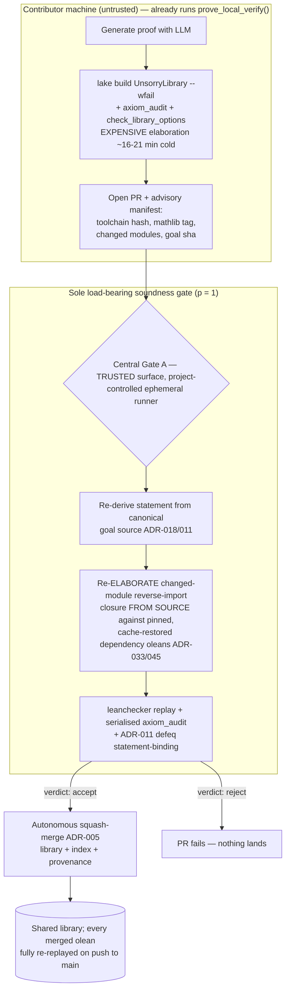

# Decentralised, Secure CI Runner Architecture: Options and Recommendation

Research output for [issue #635](https://github.com/cgbarlow/unsorry/issues/635) ("Research: Decentralised CI runner architecture"). It investigates options for moving unsorry's heavy CI verification compute off paid, centralised runners as the swarm scales, evaluates them against an explicit criteria set, and makes a recommendation. The candidate research, adversarial soundness review, and synthesis were produced by a parallel-agent workflow (8 candidate investigations + 2 cross-cutting studies + per-candidate adversarial soundness review + synthesis), per the issue's instruction to "create a workflow and run the research as parallel agents."

This is a research proposal, not an implementation. The decision it recommends is recorded in [ADR-046](../adrs/ADR-046-Decentralised-CI-Runner-Architecture.md) (Status: Proposed); the contract for the eventual implementation is sketched in [SPEC-046-A](../adrs/specs/SPEC-046-A-Decentralised-CI-Runner-Architecture.md).

## Recommendation

Adopt a **tiered split with a mandatory cheap central kernel re-check** — the [SPEC-030-A §7.2](../adrs/specs/SPEC-030-A-Distributed-Workload-Engine.md) prior made concrete:

> Push the dominant cost — full `lake build UnsorryLibrary --wfail` elaboration plus the axiom audit — onto the untrusted contributor, which `swarm/agent.sh::prove_local_verify()` **already runs** today. Keep a **mandatory, cheap, trusted central re-check** as the *sole* load-bearing soundness gate on every PR. The central surface **never trusts a client-supplied artifact**: it re-derives the theorem statement from the canonical goal source (ADR-018 create-only goals, ADR-011 binding), **re-elaborates the changed-module reverse-import closure from source** against pinned, locally-built dependency oleans, then runs `leanchecker` + `axiom_audit` + statement-binding on *that*.

The decisive idea is to **detect tampering by outcome, not by attestation**. Because acceptance is decided solely by the central re-check, a lying or tampered contributor runner cannot admit unsound content — it can at worst produce something the central kernel rejects. This **dissolves the issue's hardest requirement** ("the runner process must go through stringent checks to ensure its code has not been modified"): we make runner-code integrity *non-load-bearing for soundness* rather than trying to prove it. No client keys, runner registration, TEE attestation, redundancy quorum, or reputation are needed for soundness in v1.

This is the only decentralisation candidate that preserves the gating criterion (C1 = soundness) at full strength, because it keeps the Lean kernel as the sole oracle on ground the adversary never touches — consistent with the project's standing invariants ("the kernel is the only truth oracle"; ADR-007 "identity is hygiene, never soundness"; ADR-019 TCB hardening).

**Minimal first increment (v1).** A small, CODEOWNERS-reviewable delta on `gate-a.yml`, not a rewrite: scope the per-PR central `lake build UnsorryLibrary --wfail` to the **changed-module reverse-import closure** (ADR-033 already computes this closure by parsing `import Unsorry.*`), restoring the verified-on-`main` olean cache (ADR-045) for the unchanged remainder; keep the existing incremental `leanchecker` replay + serialised `axiom_audit` + ADR-011 statement-binding **verbatim** as the trust anchor; force a full re-check on any change to `lean-toolchain`, `lakefile*`, or `tools/gate_a/**` (the ADR-033 global-impact fallback).

**The honest caveat on the size of the win.** ADR-033 (incremental kernel replay) and ADR-045 (persistent library-build cache) have *already* captured most of the per-PR central saving. The marginal win v1 adds is the elimination of the redundant build of **unchanged** modules; the changed-closure re-elaboration is a scoped *source build*, not the ~10–30 s replay, and it cannot be safely offloaded without trusting client oleans. The framing is **offload-of-redundant-work plus a sub-linear cost slope as the swarm grows**, not SETI-scale decentralisation. Soundness is total; the cost reduction is real but modest. The larger, well-quantified win (an export-format independent re-check that removes even the elaborator from the trusted computing base) is deferred to a later, pilot-gated phase.

## Selection criteria

Soundness (C1) is the **gating** criterion: any option that lets a malicious client admit unsound content *without* a trusted re-check fails outright, regardless of how it scores elsewhere. Each option was scored 1–5 (5 best) on:

| # | Criterion | What it measures |
|---|-----------|------------------|
| **C1** | **Soundness preservation (gating)** | Can a malicious client admit unsound content? Kernel must remain sole oracle on trusted ground. |
| C2 | Central compute-cost reduction | How much heavy compute leaves paid central runners. |
| C3 | Scalability with swarm size | Does verification capacity grow with contributors? |
| C4 | Runner / code integrity | Tamper resistance — the issue's explicit requirement. |
| C5 | DoS / abuse resistance | Attack surface when runners open up. |
| C6 | Implementation complexity | 5 = simplest to build. |
| C7 | Operational burden | 5 = fewest keys / registration / secrets / runner-ops. |
| C8 | Merge latency / contributor UX | 5 = lowest added latency. |
| C9 | Fit with existing architecture | git-as-DB, ADR-002/004/005/019/030, kernel-only-oracle. |
| C10 | Decentralisation degree | How much truly leaves central infra. |

## Design principles

1. **The kernel is the only oracle, on trusted ground.** The only thing that decides whether content lands in `UnsorryLibrary` is a deterministic kernel verdict (`leanchecker` replay + `axiom_audit` whitelist `{propext, Classical.choice, Quot.sound}` + ADR-011 statement-binding) produced on a project-controlled surface. No linter, manifest, score, attestation, reputation, vote, hash match, or client claim is ever load-bearing for mathematical correctness.
2. **Identity is hygiene, never soundness (ADR-007).** Self-assigned identity, reputation, spot-audit sampling, and any peer-consensus signal may *only* throttle abuse, prioritise work, or decide how much *expensive elaboration* to re-run — never whether unsound content is admitted. Because the soundness re-check runs at sampling probability **p = 1**, a sybil burning a throwaway id per lie achieves nothing.
3. **Re-derive, never trust the artifact.** The central surface reconstructs ground truth from canonical source: it re-elaborates the changed-module closure and re-derives the statement for definitional-equality binding. A client-supplied `.olean` is **never** the kernel's input, because `leanchecker` trusts olean structure ("prone to an attacker crafting invalid `.olean` files") and replays the statement it is *given* rather than re-deriving it (the PR-#64 vacuity class).
4. **Split at Lean's natural seam, offload only the untrusted half.** Expensive *elaboration* (the cost driver, and the part that need not be trusted) moves to the contributor; cheap *kernel checking* stays central. The contributor's claim "I elaborated this" is never trusted; only the central re-check is.
5. **Determinism is the precondition that makes offload sound.** ADR-002 release-pinned mathlib/toolchain + the Lake lockfile + elan guarantee that a module whose source and entire transitive import closure are unchanged rebuilds byte-identically (the ADR-033 invariant). Any toolchain / lakefile / gate-tooling change is global-impact and **must** force a full central re-check rather than scope down.
6. **Detect tampering by outcome, not by attestation.** Rather than proving the runner code was not modified (TEE, signed binaries, runner registration), make tampering irrelevant — a tampered runner at worst produces something the central kernel rejects. This keeps the TCB to the kernel + pinned environment.
7. **Defense-in-depth layers stay strictly advisory.** Any optional spot-audit (random `p%` full rebuilds + all infra PRs) or peer-consensus tier is governed hard as **non-merge-gating**, matching ADR-030's VERIFIED tier where redundancy is unnecessary for trust.
8. **Keep the change CODEOWNERS-gated and minimal (ADR-019).** The `gate-a.yml` control flow is the TCB; changes ride a feature branch, require a human code-owner review, and are a small reviewable delta — not a new transport/attestation subsystem.

## High-level architecture

The client half is *already what `prove_local_verify()` does* — the proposal does not add a prover, it changes only **which work the trusted surface repeats** (the changed closure, not the whole library) and **codifies the invariant** that the trusted surface re-derives everything from source rather than trusting a client artifact.

## Ranked comparison

Soundness (C1) is the gate. Options whose soundness can be broken without a trusted re-check were **demoted** by the adversarial review (✗ in the "C1 gate" column) regardless of their raw score total. Scores are the parallel-agent investigators' assessments, adjusted by the adversarial soundness verdicts.

| Rank | Option | C1 gate | C1 | C2 | C3 | C4 | C5 | C6 | C7 | C8 | C9 | C10 | Decisive factor |
|---|---|:---:|:--:|:--:|:--:|:--:|:--:|:--:|:--:|:--:|:--:|:--:|---|
| **1 ★** | **Tiered split + mandatory cheap central re-check (recommended hybrid)** | ✓ | **5** | 3 | 4 | 5 | 4 | 3 | 4 | 4 | 5 | 3 | Only decentralisation option that keeps C1 = 5: acceptance decided by a mandatory central re-check, never by runner integrity, a vote, a penalty, or a vendor signature. Makes runner tampering detectable by outcome; composes with ADR-002/004/005/019/033/045 at near-zero conceptual friction. |
| 2 | Reproducible-build + content-addressed artifact verification | ✓ | 4 | 5 | 5 | 2 | 2 | 3 | 4 | 4 | 5 | 4 | Soundness holds *and* captures the fullest cost lever — **only if** central re-checks a re-derived export (or rebuilds the olean itself), not a client `.olean`. The strongest *engine* for a later phase of the recommended hybrid, not a standalone v1; does not address runner-code integrity (C4 = 2). |
| 3 | Client-attested verification + cheap central re-check (as literally scoped) | ✗ | 4 | 3 | 4 | 5 | 3 | 2 | 4 | 4 | 5 | 3 | Conceptually the same §7.2 split as the winner, but as scored it leaves the `.olean` trust boundary unresolved: "trust client oleans + leanchecker" admits a real proof of a weakened/renamed statement (ADR-011 vacuity class). Sound only once tightened to central source re-elaboration — i.e. it *collapses into* option 1. |
| 4 | BYO self-hosted GitHub Actions runners | ✗ | 2 | 4 | 4 | 2 | 1 | 3 | 2 | 3 | 2 | 3 | Gating failure on a public repo: `gate-a.yml` runs `on: pull_request`, so a fork PR runs the PR-head's own gate on hardware the contributor controls — a forged green Gate A with the kernel never running. Repair requires re-adding a central kernel replay, at which point option 1 dominates it without the self-hosted DoS/integrity liabilities. |
| 5 | Probabilistic spot-audit + reputation / economic disincentive | ✗ | 1 | 4 | 4 | 2 | 2 | 2 | 2 | 5 | 1 | 3 | A fraction `(1 − p)` of contributions land with no trusted re-check, making reputation/economics load-bearing for correctness — a direct violation of the invariants and ADR-007. Lean's re-check is cheap enough to run at p = 1, so probabilistic acceptance buys nothing on soundness. Salvageable only as a DoS-throttle on *expensive elaboration*, never on whether content lands. |
| 6 | Redundant N-of-M peer re-verification (BOINC/SETI CONSENSUS tier) | ✗ | 2 | 3 | 4 | 2 | 2 | 2 | 2 | 2 | 2 | 4 | Quorum among non-cryptographic identities (ADR-007) is a probabilistic vote defeatable by sybil/collusion, not a kernel proof. ADR-030 explicitly reserves CONSENSUS for domains with **no** cheap verifier; Lean is VERIFIED, where one valid result is ground truth. Adds 200–300 % wasted client compute to obtain what a ~10–30 s central replay settles deterministically. |
| 7 | TEE / hardware-attested runner (enclave) | ✗ | 1 | 4 | 2 | 3 | 3 | 1 | 1 | 3 | 1 | 2 | Worst gating failure: the contributor *owns* the hardware and has physical access — precisely the adversary TEEs are not built to stop (the research surfaced sub-$1000 attestation-key extraction attacks). Unavailable on much consumer hardware (re-centralises to cloud CVMs), exceeds enclave memory limits for a ~20 GB replay, and is rendered redundant by the cheap central re-check. |
| 8 | Centralised managed runners (baseline / control) | ✓ | 5 | 1 | 2 | 5 | 4 | 5 | 3 | 5 | 5 | 1 | The only candidate that maxes C1 by construction, but it **is** the problem #635 exists to solve: 0 % heavy compute leaves central infra, cost is linear in merged-PR volume with no asymptote, and an adversary's heavy PRs burn paid central minutes. The yardstick to beat, not a destination. |

**Reading the table.** Three options preserve soundness (1, 2, 8); only one of those (1) also moves heavy compute off central infra without re-introducing a non-kernel trust anchor. Option 2 is sound and the most cost-effective *engine*, but it is a Phase-3 upgrade of option 1 rather than a v1, and it leaves runner-code integrity unaddressed. Option 3 is the same idea as option 1 but, as commonly implemented, ships a latent soundness footgun; the recommendation is option 3 *done correctly*, which is option 1. Options 4–7 each make a non-kernel signal (runner integrity, a vote, a penalty, or a vendor's silicon) load-bearing for correctness and were demoted.

## Down-selected options, in brief

**Reproducible-build + content-addressed artifact verification (rank 2).** Deterministic builds (ADR-002 pinning + Lake lockfile) make a proof artifact content-addressable and tamper-evident, tying naturally to ADR-018 statement immutability and the SHA-256 library index. Its strongest form has the contributor ship a self-contained `lean4export` NDJSON of the new declaration's transitive closure, which a tiny independent checker (e.g. `nanoda`, &lt; 5 000 LOC of Rust) re-checks with **no** mathlib image and **no** Lean resident — the smallest possible TCB, trivially parallelisable, and the best fit for scaling with swarm growth. It even enables checking through *two* independent kernels for kernel-bug defense-in-depth. It is rank 2 rather than rank 1 only because (a) it does not address runner-*code* integrity, and (b) `lean4export` cross-machine determinism and external-checker wall-clock are open questions (external checkers can hit pathological definitional-equality reductions). It is therefore the recommended **Phase-3** engine of option 1, gated on a determinism + wall-clock pilot — not a v1.

**Client-attested verification + cheap central re-check (rank 3).** This is the SPEC-030-A §7.2 split stated at face value, and on paper the cleanest fit. The adversarial review demoted it because the obvious implementation — "trust the client's uploaded `.olean` and run `leanchecker` over it" — is unsound on two distinct vectors: (i) a *structurally crafted* invalid olean (`leanchecker` "trusts that the `.olean` files are structurally correct"), and (ii) a *real, type-correct* proof of a **weaker or renamed** statement, which `leanchecker` happily accepts because it replays the statement it is given rather than re-deriving the one the goal demanded (the ADR-011 vacuity class, exercised by red-team PR #64). The fix is exactly what the recommended option mandates — central source re-elaboration of the changed closure plus central statement re-derivation and defeq binding — at which point this option *becomes* option 1. We list it separately to record the footgun explicitly.

**BYO self-hosted GitHub Actions runners (rank 4).** Donated compute, but a well-documented gating hazard on *public* repos: because `gate-a.yml` triggers `on: pull_request`, a fork PR would run the PR head's own workflow on contributor-controlled hardware, allowing a forged green Gate A with the kernel never actually running, plus the classic self-hosted persistence/poisoning and fork-PR RCE risks. Making it sound requires re-adding a central kernel replay — at which point the plain "client builds, central re-checks" design (option 1) gets the same offload without the self-hosted liabilities, so this option is strictly dominated.

**Probabilistic spot-audit + reputation / economic disincentive (rank 5).** The right *cost shape* (push compute out, re-run only a fraction centrally) but the wrong *soundness shape*: any audit rate `p < 1` admits a non-zero fraction of contributions with no trusted re-check, making penalties load-bearing for correctness and assuming a merely *rational* (not Byzantine) adversary with a penalisable identity — neither holds here. Because Lean's central re-check is cheap enough to run at p = 1, spot-checking is appropriate only for the *expensive elaboration* layer as a cost optimisation, never for the kernel layer that gates correctness.

**Redundant N-of-M peer re-verification (rank 6).** The literal "SETI@home/BOINC" model: replicate each unit across K independent workers and accept on quorum. BOINC needs this because it has *no* cheap deterministic verifier and must establish truth by agreement (with homogeneous redundancy to tame floating-point non-determinism, plus reputation and spot-checks). Lean is the opposite regime — ADR-030's VERIFIED tier, where one deterministic kernel verdict is ground truth. Quorum among non-cryptographic identities (ADR-007) is a defeatable vote, and redundancy multiplies client compute 2–3× to obtain what a single cheap central replay already settles. Useful only as advisory hygiene, never as the soundness oracle.

**TEE / hardware-attested runner (rank 7).** The most direct literal answer to "prove the code was not modified" — and the worst fit. Remote attestation proves *code integrity relative to trusting the silicon vendor*, not mathematical correctness, and it defends against a *remote/host* adversary; here the contributor has *physical access*, exactly out of TEE scope (the research surfaced practical, low-cost attestation-key extraction). It is also unavailable on much consumer hardware (re-centralising to cloud confidential VMs), and a ~20 GB kernel replay does not fit comfortably in an enclave. The cheap central re-check makes the enclave's integrity claim irrelevant.

**Centralised managed runners (rank 8, the control).** Unimpeachable soundness because the kernel runs on fully-trusted, project-controlled ephemeral runners — but it is the status quo the issue exists to change: zero heavy compute leaves central infra, cost grows linearly with merged-PR volume with no asymptote, verification capacity does not grow with the swarm, and an adversary's heavy PRs burn paid central minutes. The yardstick every other option is measured against.

## Soundness: what must be right

Soundness is preserved **absolutely** under the threat model "a fully malicious / tampered contributor runner," because acceptance into `UnsorryLibrary` is decided exclusively by the central Gate A re-check on a project-controlled surface the adversary never touches, and that re-check consumes **no** client artifact as a trusted input. Concretely it (a) re-derives the theorem statement from canonical goal source (ADR-018 / ADR-011), (b) re-elaborates the changed-module reverse-import closure from source against pinned dependencies, (c) runs `leanchecker` over the resulting environment, (d) runs the serialised `axiom_audit` against the whitelist, and (e) defeq-binds the proved term to the re-derived statement.

The one sharp footgun, recorded so an implementer cannot reintroduce it: **`leanchecker` replays the environment it is *given*.** It re-runs stored proof terms through the kernel but does **not** re-elaborate from source and does **not** re-derive the statement, and it trusts that oleans are structurally correct. So "trust client oleans + leanchecker them" is unsound on both the crafted-invalid-olean vector and the proof-of-weaker-statement vector. The recommendation closes both by mandating central source re-elaboration (central builds the olean itself) and central statement re-derivation + defeq binding. **Never confuse hygiene with truth:** a manifest, a content-address match, a reputation score, or N peer agreements say nothing about mathematics; only the central kernel re-check admits content.

## Risks and mitigations

- **Implementation silently reintroduces the `.olean` attack surface** (an engineer "optimises" by leanchecker-ing a client-uploaded olean, or skips central statement re-derivation). *This is the single most likely way to break C1.* **Mitigate:** make "central re-elaborates the changed closure from source + re-derives the statement + defeq-binds" a written, CODEOWNERS-reviewed invariant in the Gate A spec; add regression tests that feed a crafted-invalid `.olean` **and** a proof-of-weaker/renamed-statement and assert Gate A **rejects** both; forbid any code path where a client-supplied `.olean` reaches `leanchecker` as a trusted input.
- **Soft cost bound / griefing.** A PR touching a global-impact path (`lean-toolchain`, `lakefile*`, `tools/gate_a/**`) or a high-fan-in base module forces the ADR-033 full-replay fallback, so worst-case central cost equals today's full build — and an attacker can trigger this deliberately to burn paid minutes. **Mitigate:** keep the full-replay fallback (correctness over cost); add cheap pre-filters (manifest/tag sanity, diff scope) that fast-fail junk before any build; rate-limit per-contributor heavy-path PRs via the advisory identity layer; track the fallback rate as a metric.
- **Reproducibility drift.** A contributor built against a skewed toolchain/mathlib, or `lean4export`/olean determinism varies across platform/version. **Mitigate:** the central re-check uses **only** the ADR-002 release-pinned toolchain/mathlib regardless of client claims; the manifest's hashes are hygiene, not trust; byte-identical reproducibility (ADR-033) makes divergence a hard fail, not a silent accept; defer cross-machine artifact-equality to a Phase-3 determinism pilot.
- **Cost win overstated to stakeholders.** ADR-033 + ADR-045 already captured most per-PR savings. **Mitigate:** state the bound honestly (modest, not SETI-scale; v1 offloads redundant unchanged-module builds only); measure baseline vs post-v1 central runner-minutes/PR before claiming a figure; position Phase 3 as the path to a larger, well-quantified win.
- **Scope-creep of the advisory tiers** (a spot-audit / peer-consensus layer starts to look merge-gating). **Mitigate:** govern hard as advisory-only — consensus/audit records carry no merge authority in `gate-a.yml`; any change that would make a non-kernel signal merge-gating requires a new ADR with explicit soundness analysis.
- **External-checker path hits pathological reductions** (external checkers can be ">100× slower than Lean" on mathlib-scale corpora). **Mitigate:** treat the export + independent-checker path as a defense-in-depth *upgrade*, gated on a wall-clock/timeout pilot; keep `leanchecker`-on-locally-rebuilt-environment as the authoritative anchor.
- **Manifest/transport becomes a new TCB-adjacent abuse surface.** **Mitigate:** keep the v1 manifest minimal and treat it as hygiene not trust (the soundness gate does not depend on it); place any parser under CODEOWNERS; cap closure width before paying build cost.

## Phasing

- **Phase 0 — ADR + spec the trust boundary (no code).** Write ADR-046 and a Gate A spec amendment stating the load-bearing invariant verbatim. Add the crafted-invalid-olean and proof-of-weaker-statement regression tests (red) *before* any control-flow change. CODEOWNERS review.
- **Phase 1 — Scope the central build to the changed closure (the minimal first increment).** Modify `gate-a.yml`: carry the advisory manifest; restore the ADR-045 verified-on-`main` olean cache for unchanged modules; restrict the source build to the ADR-033 changed-module reverse-import closure (incl. `*Binding` modules); keep `leanchecker` replay + serialised `axiom_audit` + ADR-011 binding verbatim over that closure; force full re-check on global-impact changes. Soundness regression tests go green. Measure central runner-minutes/PR before vs after.
- **Phase 2 — Pre-filters + anti-abuse throttle (advisory hygiene).** Cheap fast-fail pre-filters before paying build cost; per-contributor rate-limiting on heavy-path PRs as the SPEC-030-A §7.1 anti-abuse layer, strictly advisory. Add fallback-rate and griefing-detection metrics. Nothing merge-gating.
- **Phase 3 — Export-format independent re-check (defense-in-depth upgrade, gated on pilot).** Pilot `lean4export` of a declaration's transitive closure + an independent checker on real unsorry closures: measure export size, cross-machine determinism, and wall-clock with timeouts. **If** bounded and deterministic, add export-format re-check as a *second, kernel-diverse* anchor — putting even the elaborator out of the TCB. The authoritative gate stays `leanchecker`-on-locally-rebuilt-environment until the pilot proves the export path.
- **Phase 4 (optional, advisory only) — peer-consensus / spot-audit overlay.** Only if abuse / reproducibility-drift data justify it; governed hard as non-merge-gating per ADR-030 VERIFIED tier; requires its own anti-sybil ADR.

## Metrics

| Metric | Tests |
|---|---|
| **C1 soundness conformance (binary, must stay green forever)** | The crafted-invalid-`.olean` and proof-of-weaker/renamed-statement regression tests **reject** at Gate A; no code path lets a client-supplied `.olean` reach `leanchecker` as a trusted input. Any failure blocks merge. |
| Central heavy-compute offloaded | Central runner-minutes per merged PR, baseline vs post-Phase-1, and the % reduction. Honest target: removal of the redundant unchanged-module build. |
| Global-impact fallback rate | Fraction of PRs triggering the ADR-033 full-replay fallback. A rising rate signals churn or griefing. |
| Changed-closure size distribution | Median / p95 modules re-elaborated per PR (should track the typical 1–3 + bindings); detects reverse-import-closure amplification abuse. |
| Merge latency | PR-open to ADR-005 auto-merge, vs the centralised baseline; confirm the scoped build does not regress UX. |
| Cost-vs-throughput slope | Central spend per N merged PRs over time; success for #635 is this slope flattening (sub-linear) as the swarm grows, vs the baseline's linear-no-asymptote growth. |
| Phase-3 pilot gates | `lean4export` file size + cross-machine hash determinism rate; independent-checker wall-clock + timeout-hit rate (must show no ">100× slower" pathology) before the export path becomes a second anchor. |

## Open questions

1. What is the actual central runner-minute saving of Phase 1 on real PRs? The changed-closure re-elaboration is a scoped source build (not the ~10–30 s replay), and ADR-045/ADR-033 already captured much of the per-PR saving — the marginal win must be measured, not assumed.
2. Is `lean4export` deterministic across the contributor and central machines for unsorry-scale declaration closures? This decides whether Phase 3's export-format hashing/equality is reliable as a cross-machine oracle (vs only tamper-evidence/dedup).
3. What is an independent checker's wall-clock on a typical unsorry declaration's transitive closure, and does it ever hit the ">100× slower than Lean" definitional-equality pathology? This gates whether the independent-checker path can ever be authoritative rather than advisory.
4. How wide can a malicious contributor make the changed-module reverse-import closure (and thus the central re-elaboration cost) before pre-filters/rate-limits should reject the PR? Needs a concrete cap policy in Phase 2.
5. Should the central build restore dependency oleans from the ADR-045 verified-on-`main` cache, or rebuild dependencies from source too? The former is cheaper and sound under the byte-identical invariant, but the cache-trust assumption (oleans produced by a prior trusted Gate A run) must be stated explicitly as part of the TCB.
6. Does the SPEC-030-A §7.1 anti-abuse/identity layer need to exist before Phase 1 ships, or can v1 rely on GitHub's existing fork-PR controls plus the bounded namespace.so spend?
7. Is a manifest even needed for v1 *soundness*, or only for hygiene/diagnostics? Since the central re-check re-derives everything from canonical source, the manifest is strictly advisory — confirm it carries no trust weight so it never drifts into being load-bearing.

## Appendix A: the elaboration-vs-kernel-check cost split (the technical crux)

The whole recommendation rests on Lean's clean separation of **expensive elaboration** (tactic execution, type-class resolution, unification — what turns surface syntax into a proof term) from **cheap kernel checking** (independently re-verifying that the finished term has its declared type). This is the de Bruijn criterion, and Lean's design intent: the proof search "is hard … but none of it needs to be trusted"; only the small kernel must be trusted, and "checking is easier than finding."

Measured on unsorry's own library (ADR-033 ground truth):

| Operation | Time | Memory |
|---|---|---|
| `lake build UnsorryLibrary --wfail` (cold elaboration) | **~16–21 min** (~960–1260 s) | resident mathlib |
| `leanchecker` replay, 1 module | ~10 s | ~1.4 GB |
| `leanchecker` replay, 30-module chunk | ~127 s | ~12.5 GB |
| `leanchecker` replay, all 56 proof modules (one process) | ~225 s | ~20 GB |
| `leanchecker` incremental replay, typical 1–3 module PR (ADR-033) | **~10–30 s** | < 2 GB |

So a **full** kernel replay of every swarm-produced proof (~225 s) is already ~4–6× cheaper than **one** cold elaboration build, and the per-PR incremental check is ~40–120× cheaper than the build it replaces. That asymmetry is exactly what makes a mandatory central re-check affordable at p = 1.

Two checker tiers exist, in increasing strength and decreasing TCB:

1. **`leanchecker`** (folded into Lean core ≥ v4.28; the standalone `lean4checker` repo is archived) replays the compiled environment through the **same** Lean kernel, catching "environment hacking." It needs the import closure (mathlib) resident — hence unsorry's serial, high-memory runs — and it trusts olean structure, so it must run over an olean the **trusted** surface built.
2. **Export-format checking.** `lean4export` emits a self-contained NDJSON of a declaration "and its transitive dependencies" — pre-digested proof terms — which an independent checker (e.g. `nanoda`, a complete Lean checker in &lt; 5 000 LOC of Rust) re-checks with no Lean and no mathlib resident, even on a different machine. This is the smallest possible TCB and supports cross-kernel defense-in-depth, but its cross-machine determinism and worst-case wall-clock are open (Phase 3).

## Appendix B: why the volunteer-computing trust models are overkill here

The parallel-agent trust-model survey reached a negative-by-elimination conclusion: BOINC redundancy, refereed-delegation games (Truebit / optimistic rollups), TEE attestation, and zkVM proofs were each invented for the regime where the verifier **cannot** cheaply re-derive truth. unsorry is in the opposite regime — it has a cheap, deterministic, trusted re-check in the Lean kernel. So the right architecture borrows the *cost shape* of refereed delegation and spot-checking (untrusted heavy work + cheap trusted adjudication) while discarding their machinery (deposits, dispute games, jackpots, liveness/honest-verifier assumptions, enclaves, zk circuits) — all unnecessary because the kernel verdict is deterministic, total, and trusted. Map to ADR-030 tiers: Lean stays **VERIFIED** (one valid kernel-checked result = ground truth, zero redundancy); **CONSENSUS** is reserved for hypothetical future domains lacking a cheap checker.

## References

External sources gathered during the parallel-agent research (directional; the architecture's correctness rests on the project's own ADRs, not on these):

| Source | Relevance |
|---|---|
| Lean reference — *Validating a Lean Proof* — <https://lean-lang.org/doc/reference/latest/ValidatingProofs/> | `leanchecker` replays oleans through the kernel; meaningful only if the challenge statement is correct. |
| Lean reference — *Elaboration and Compilation* — <https://lean-lang.org/doc/reference/latest/Elaboration-and-Compilation/> | Elaboration → proof term; kernel independently verifies the term. |
| `leanprover/lean4checker` (archived; now core `leanchecker`) — <https://github.com/leanprover/lean4checker> | Replays the environment; detects environment hacking; trusts olean structure. |
| `leanprover/lean4export` — <https://github.com/leanprover/lean4export> | Self-contained NDJSON export of a declaration + transitive deps. |
| `ammkrn/nanoda_lib` — <https://github.com/ammkrn/nanoda_lib> | Independent Lean checker in Rust (&lt; 5 000 LOC) consuming the export format. |
| Lean export-format discussion (Carneiro et al.) — <https://leanprover-community.github.io/archive/stream/270676-lean4/topic/Export.20format.html> | External-checker reductions can be ">100× slower than Lean" pathologically. |
| Lake reproducible builds — <https://lean-lang.org/doc/reference/latest/Build-Tools-and-Distribution/Lake/> | Lockfile + pinned toolchain ⇒ byte-reproducible across machines. |
| BOINC *JobReplication* / *SecurityIssues* wikis — <https://github.com/BOINC/boinc/wiki/JobReplication> | Redundant computation + quorum + homogeneous redundancy + reputation (the CONSENSUS model unsorry does not need). |
| Anderson, *BOINC: A Platform for Volunteer Computing* — <https://arxiv.org/pdf/1903.01699> | Homogeneous redundancy, adaptive replication, reputation. |
| Teutsch & Reitwiessner, *Truebit* — <https://arxiv.org/pdf/1908.04756> | Verification game (bisection), deposits/slashing, one-honest-verifier, Verifier's Dilemma. |
| *Attestation Mechanisms for TEEs Demystified* — <https://arxiv.org/pdf/2206.03780> | TEE remote attestation proves code integrity relative to trusting the vendor, not correctness. |
| *Evaluating Compiler Optimization Impacts on zkVM Performance* — <https://arxiv.org/pdf/2508.17518> | zk proving overhead ~10⁴× native — absurd for mathlib-scale elaboration. |
| *Optimal Contracts for Outsourced Computation* (eprint 2014/374) — <https://eprint.iacr.org/2014/374.pdf> | Spot-check audit rate `p` × fine `f` > cheating reward; detection `P ≈ 1 − (1−ρ)^m`. |
| Equational Theories Project (arXiv 2512.07087) — <https://arxiv.org/pdf/2512.07087> | 35-contributor distributed Lean effort relying on central compile-per-PR — the cost #635 escapes. |

Internal references: [ADR-006 Gate A Soundness Enforcement](../adrs/ADR-006-Gate-A-Soundness-Enforcement.md), [ADR-011 Statement-Binding Gate](../adrs/ADR-011-Statement-Binding-Gate.md), [ADR-018 Goal Statement Immutability](../adrs/ADR-018-Goal-Statement-Immutability.md), [ADR-019 CI Supply-Chain Protection](../adrs/ADR-019-CI-Supply-Chain-Protection.md), [ADR-030 Distributed-Workload Engine](../adrs/ADR-030-Distributed-Workload-Engine.md) + [SPEC-030-A §7.2](../adrs/specs/SPEC-030-A-Distributed-Workload-Engine.md), [ADR-033 Incremental Kernel Replay](../adrs/ADR-033-Incremental-Kernel-Replay.md), [ADR-045 Gate A Library Build Cache](../adrs/ADR-045-Gate-A-Library-Build-Cache.md), [ADR-007 Agent Identity and Budgets](../adrs/ADR-007-Agent-Identity-and-Budgets.md), [the swarm architecture proposal](distributed-research-swarm-plan.md).
